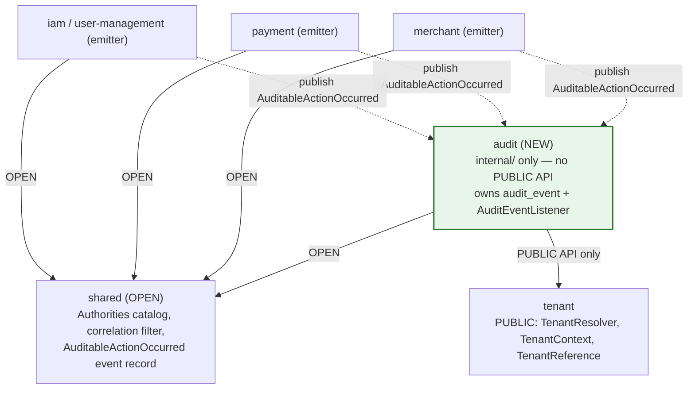
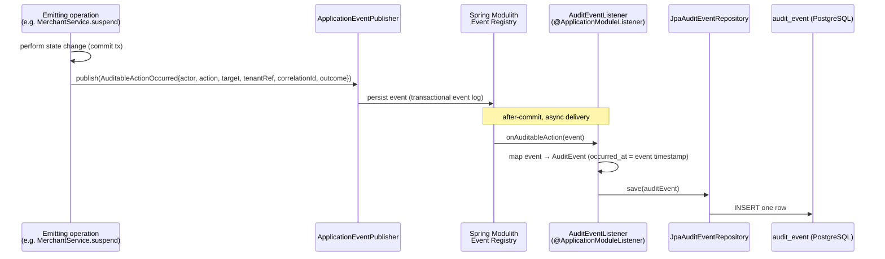
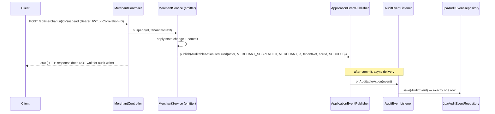
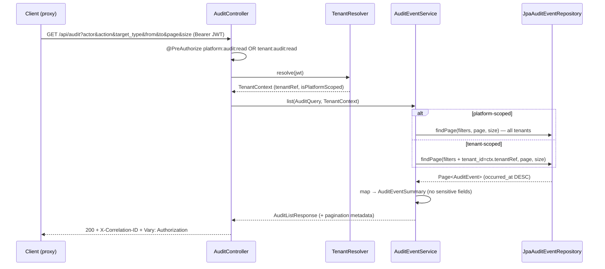
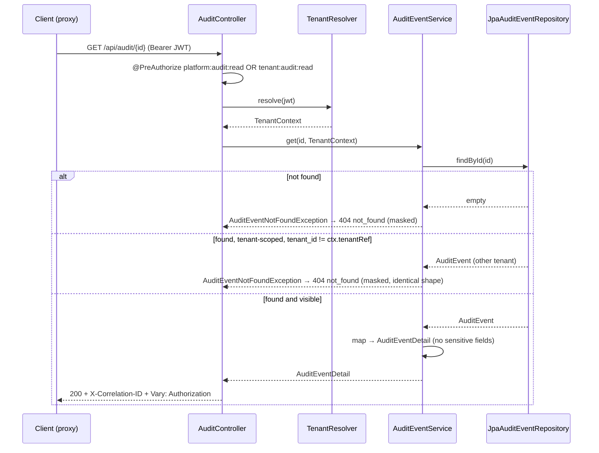

# Design Document: Audit Log Dashboard

## Overview

This feature adds a **global, searchable audit log** to the Payment Quality Engineering Lab: an append-only record of *who did what, to which resource, in which tenant, with what outcome*, exposed read-only through a backend REST API and a Nuxt Dashboard page. It is **Spec #4** of the SDET roadmap and a **brownfield enhancement** that extends — never rewrites — the existing backend (`apps/backend`), the existing Nuxt frontend (`apps/frontend`), and the existing Keycloak realm.

The defining decision (Resolved Decision A) is that audit capture is **event-driven and observational**, never synchronous. A new backend `audit` Spring Modulith module owns an `audit_event` table and an `AuditEventListener` annotated with `@ApplicationModuleListener`. Emitting modules (merchant, payment, iam/user-management) publish a Spring Modulith application event when an auditable action occurs; the listener consumes it and persists exactly one `audit_event` row. The emitter does not depend on the `audit` module and is unaware of how the action is recorded. The audit log is therefore an **eventual record** of actions, not part of any write transaction's HTTP contract.

A verified current-state fact this design rests on: **no `ApplicationEventPublisher` usage and no `@ApplicationModuleListener` exist anywhere in the backend today**, and there are no published domain events. The emitting modules **must be extended to publish events** before any action can be audited. That extension is an explicit cross-module touch point captured in the Cross-Spec Implementation Notes section. The existing `PaymentOrderStatusHistory` is a **payment-domain-specific** status trail bound to a single payment order; it is **not** the global audit log and is neither replaced nor consumed by this feature.

The design rests on two prerequisite specs:

1. **`iam-roles-and-keycloak-login`** introduced the five named composite roles (`PLATFORM_ADMIN`, `TENANT_ADMIN`, `MERCHANT_MANAGER`, `SUPPORT_AGENT`, `READ_ONLY_USER`), the `tenant_id` JWT claim, the `KeycloakRealmRoleConverter` allowlist, and the frontend `rbacMatrix.ts` / `useAuthorization` capability source of truth.
2. **`tenant-model-and-isolation`** introduced the `tenant` Spring Modulith module with the **PUBLIC** `TenantResolver` / `TenantContext` API, the platform-vs-tenant classification rule (`tenant_type`), and the masked-404-read / 403-write isolation pattern.

This spec adds a new authority family — `platform:audit:read` and `tenant:audit:read` (Resolved Decision B) — deliberately **distinct** from the pre-existing `platform:payments:audit`. This requires the realm composite roles to be **extended**, the backend `Authorities` catalog and `KeycloakRealmRoleConverter` allowlist to be **extended**, and the frontend RBAC matrix to be **reconciled**. Each is flagged in the Cross-Spec Implementation Notes section.

Unlike `user-management` (a Keycloak façade with no local table), this spec **does add a Flyway migration** (Resolved Decision C): a real, indexed `audit_event` table on PostgreSQL 18, append-only at the API boundary. Date filtering on the Dashboard uses the native `<input type="date">` control (Resolved Decision D) for accessibility.

The existing REST contract conventions are preserved exactly: `application/problem+json` on every 4xx, `X-Correlation-ID` on every response, `Vary: Authorization` on reads, masked `404` for cross-tenant single-entry reads, `403` for unauthorized access, `406` for unsupported `Accept`, and `405` for unsupported methods. No sensitive data (bearer tokens, passwords, PAN/CVV, personal financial data) is ever written to an audit row or returned in an audit response.

### Open Question Resolutions Adopted by This Design

- **OQ1 (module name):** this design **recommends and adopts `audit`** (package `lab.paymentquality.audit`). Rationale: it names the bounded context precisely, is the natural sibling of `tenant`, `merchant`, and `payment`, and leaves room for related observability concerns without renaming. Alternatives `auditlog` (narrower, redundant suffix) and `observability` (too broad, implies metrics/tracing) are not chosen.
- **OQ2 (RBAC capability):** this design **recommends and adopts a new `canViewAuditLog` capability**, distinct from the existing `canReadAudit` (which maps to `platform:payments:audit`). Conflating the two would over-grant payment auditors and under-model tenant-scoped audit reads.
- **OQ3 (event-publishing points):** documented per emitting module in Architecture → Event-Driven Capture; publication occurs **after** the operation's state change is committed (after-commit semantics via the Spring Modulith event registry).
- **OQ5 (auditing denials):** recording `DENIED` outcomes is modeled as **optional** (Requirement 4.6); the event contract supports it, but emitters are not required to publish denials in the initial set.

### Requirements Coverage Map

| Requirement | Where addressed |
|---|---|
| 1. Audit authority family + realm/backend extension | Architecture (authority model); Cross-Spec Implementation Notes |
| 2. Audit event persistence schema | Data Models (`audit_event` SQL + JPA entity + Flyway placement) |
| 3. Event-driven audit capture | Architecture (event flow, listener); Components (`AuditEventListener`, domain event); Property P6 |
| 4. Initial audited actions & event sources | Architecture (event sources table); Components (event record); Property P4 |
| 5. List audit events | Components (`AuditController.list`, `AuditEventService`); Sequence diagram (b); Properties P1, P3 |
| 6. Get single audit event | Components (`AuditController.get`); Sequence diagram (c); Property P2 |
| 7. REST contract conventions | Error Handling; Components (controller headers) |
| 8. Audit page listing & filtering | Frontend Design (page, composable, schema, states) |
| 9. Deep link & detail drawer | Frontend Design (`AuditEntryDrawer`, URL reflection) |
| 10. Role-gated nav & read-only UI states | Frontend Design (nav link + 6 UI states) |
| 11. RBAC matrix reconciliation | Frontend Design (`rbacMatrix.ts`); Property P5 |
| 12. Accessibility & testability | Frontend Design (data-testid + a11y) |
| 13. Security & data confidentiality | Error Handling (non-disclosure); Properties P1, P2, P4 |
| 14. RBAC & tenant-isolation matrix | Architecture (authority model + isolation table); Properties P1, P2, P5 |

## Architecture

### Open Question 1 Resolution — A Dedicated `audit` Module

**Decision: create a new, self-contained Spring Modulith module named `audit` (package `lab.paymentquality.audit`).** It owns the `audit_event` table, the `AuditEvent` JPA entity, the `AuditEventListener`, the `AuditEventService`, the read controller, and DTOs — all under `internal/`. It exposes **no PUBLIC API** (no other module needs to call into audit). Its only outbound module dependencies are the `tenant` module **PUBLIC** API (`TenantResolver`, `TenantContext`, `TenantReference`) and `shared` (the `Authorities` catalog and correlation filter).

The audit module depends only on the **published Domain Audit Event contract** to receive data from emitters; it never imports an emitting module's internal packages, and emitters never import `audit.internal.*`. This keeps `ModulithArchitectureTest` green and is the structural expression of Resolved Decision A's decoupling goal (Requirements 2.6, 3.6, 3.7).

**Where does the event contract live?** The Domain Audit Event is a small, stable record that both emitters (publishers) and the audit module (consumer) must reference. Two options were considered:

| Option | Description | Trade-off |
|---|---|---|
| **A — Shared published-events package (chosen)** | Define one event record `AuditableActionOccurred` in `shared` (the existing OPEN cross-cutting module), published by emitters and consumed by `audit`. | Single contract, one import for everyone, no module owns another module's event type. `shared` is already OPEN and already holds cross-cutting concerns (Authorities, correlation filter). Lowest coupling. |
| B — Per-emitter event types | Each emitting module publishes its own event type (`MerchantActionOccurred`, `PaymentActionOccurred`, `UserActionOccurred`); audit consumes all three. | More faithful to DDD per-context events, but triples the listener surface and forces `audit` to import three emitting-module public types — more coupling and more code for identical handling logic. |

**Decision: Option A — a single generic event record `AuditableActionOccurred` published from `shared`.** Rationale: every auditable action carries the *same* shape (actor, action, target, tenant, correlation, outcome). A single generic event keeps the listener trivial (one `@ApplicationModuleListener` method), keeps emitters decoupled from each other, and avoids `audit` importing emitting-module public APIs. The `action`, `targetType`, and `outcome` fields discriminate the domain at the data level, which is exactly how they are queried and filtered. Should a future spec need richer per-domain payloads, per-domain events can be added without removing the generic one.

### Spring Modulith Module Map



The dotted edges are **event publication**, not compile-time dependencies. Emitters publish via Spring's `ApplicationEventPublisher` (they depend only on the `shared` event record); the `audit` listener receives the event. There is no direct module-to-module call from an emitter into `audit`.

`audit` module internal layout:

```
lab.paymentquality.audit
├── package-info.java                          (@ApplicationModule, displayName = "Audit Log")
└── internal/
    ├── web/
    │   ├── AuditController.java                (GET /api/audit, GET /api/audit/{id})
    │   ├── AuditExceptionHandler.java          (@RestControllerAdvice → problem+json)
    │   └── dto/
    │       ├── AuditEventSummary.java          (list row)
    │       ├── AuditEventDetail.java           (single entry)
    │       ├── AuditListResponse.java          (page wrapper + pagination metadata)
    │       └── AuditQuery.java                 (parsed, validated filter params)
    ├── application/
    │   ├── AuditEventService.java              (tenant-scoped read orchestration + filtering)
    │   └── AuditEventListener.java             (@ApplicationModuleListener — persists one row per event)
    ├── domain/
    │   ├── AuditEvent.java                     (JPA entity — insert + read only)
    │   ├── Outcome.java                        (enum: SUCCESS, DENIED, FAILED)
    │   └── exception/
    │       └── AuditEventNotFoundException.java (→ masked 404)
    └── infrastructure/
        └── JpaAuditEventRepository.java        (Spring Data JPA — filtered, paginated queries)
```

```
lab.paymentquality.shared            (OPEN — existing module, extended additively)
└── events/
    └── AuditableActionOccurred.java  (PUBLIC event record — published by emitters, consumed by audit)
```

**Module dependency rule:** `audit` → `tenant` (PUBLIC API only), `audit` → `shared` (OPEN). No `audit` code imports `tenant.internal.*` or any emitting module's internal packages. No module imports `audit.internal.*`. Emitters import only `shared.events.AuditableActionOccurred`. Verified by `ModulithArchitectureTest` (existing) and a new `AuditModuleTest`.

### Event-Driven Capture — The Write Path



**Key design points:**

- `@ApplicationModuleListener` is the Spring Modulith composed annotation that combines `@Async`, `@Transactional(propagation = REQUIRES_NEW)`, and `@TransactionalEventListener(phase = AFTER_COMMIT)`. The listener therefore runs **after the emitting operation commits**, in its own transaction, asynchronously. The emitting operation's HTTP response does not wait for the audit row to be written (Resolved Decision A — observational, eventual).
- **Exactly one row per consumed event** (Requirement 3.2, Property P6). The listener performs a single `save`; it does not fan out or batch.
- **Correlation id** (Requirement 3.3): the `AuditableActionOccurred` event carries the `X-Correlation-ID` value of the originating request, captured by the emitter from the existing `shared` correlation filter / MDC at publish time. The listener copies it verbatim onto `audit_event.correlation_id`. Because delivery is after-commit and possibly on another thread, the correlation id must be captured **into the event payload** at publish time — it cannot be read from MDC inside the listener.
- **Durability of the event itself** (optional dependency note): Spring Modulith can persist the published event in an event-publication log so that a listener failure can be retried/replayed. To enable this, add the `spring-modulith-events-jpa` (and `spring-modulith-events-api`) starter and a Flyway migration for the `event_publication` table. This design **recommends enabling it** because audit capture should survive a transient listener failure (see Error Handling → Event-processing failure). If the durable log is not enabled, a listener failure loses the audit row silently — acceptable only for the learning baseline, but called out as a risk.
- **Non-null tenant** (Requirement 3.5): where an action's request carried no resolvable tenant, the emitter sets the event's `tenantRef` to a defined sentinel (the platform tenant reference) so the persisted row's `tenant_id` is always non-null.

### Event Sources — Initial Audited Actions

The initial set of `action` strings and their sources (Requirement 4.1–4.4). All are **cross-module touch points**: the emitter must be extended to publish, because no events exist today.

| Emitting module | Operation | `action` string | `target_type` |
|---|---|---|---|
| iam / user-management | create user | `USER_CREATED` | `USER` |
| iam / user-management | update user | `USER_UPDATED` | `USER` |
| iam / user-management | assign/remove roles | `USER_ROLES_ASSIGNED` | `USER` |
| merchant | create merchant | `MERCHANT_CREATED` | `MERCHANT` |
| merchant | activate merchant | `MERCHANT_ACTIVATED` | `MERCHANT` |
| merchant | suspend merchant | `MERCHANT_SUSPENDED` | `MERCHANT` |
| payment | authorize | `PAYMENT_AUTHORIZED` | `PAYMENT_ORDER` |
| payment | capture | `PAYMENT_CAPTURED` | `PAYMENT_ORDER` |
| payment | cancel | `PAYMENT_CANCELLED` | `PAYMENT_ORDER` |
| payment | refund | `PAYMENT_REFUNDED` | `PAYMENT_ORDER` |

`outcome` is set by the emitter per Requirement 4.5: `SUCCESS` for a completed action, `FAILED` for a server-side/business error, `DENIED` for an authorization rejection (optional, OQ5). Sensitive values (tokens, passwords, temporary passwords, PAN, CVV) are **never** placed in any event field (Requirement 4.7, Property P4).

### Tenant Scoping — Dependency on `TenantResolver`

The `audit` module depends **explicitly** on the `tenant` module PUBLIC API for *read* scoping. For each audit read request, after the `@PreAuthorize` authority check passes, the controller calls `TenantResolver.resolve(jwt)` to obtain the acting principal's `TenantContext` (resolved tenant identity + `isPlatformScoped`). This is the **same** classification mechanism used by the merchant module.

Scoping rules (Requirements 5.1–5.2, 6.1–6.4, 13.2, 14):

- **Platform-scoped principal** (`TenantContext.isPlatformScoped()` true — PLATFORM_ADMIN, SUPPORT_AGENT holding `platform:audit:read`): no tenant restriction — reads `audit_event` rows across all tenants.
- **Tenant-scoped principal** (TENANT_ADMIN holding `tenant:audit:read`): the service adds a `tenant_id = ctx.tenantReference()` predicate to every list query and validates the predicate on every single-entry read.

Cross-tenant outcomes:

| Operation | Tenant-scoped principal acting cross-tenant |
|---|---|
| List (`GET /api/audit`) | Cross-tenant rows are **filtered out** of the page (never returned) |
| Get single (`GET /api/audit/{id}`) | **Masked 404** `not_found` (existence not disclosed) |
| Get nonexistent id | **Masked 404** `not_found` — **indistinguishable** from cross-tenant (Requirement 6.4, Property P2) |

There is **no write path** through the API, so there is no 403-on-write case for audit (unlike merchant/user writes). The only `403` is the authority-absent case (no `*:audit:read` at all), rejected at `@PreAuthorize` before tenant scoping is evaluated (Requirements 5.11, 6.5, 14 note).

### Authority Model — New `*:audit:read` Authorities

This spec introduces two new fine-grained authorities (Resolved Decision B, Requirement 1):

| Authority | Granted by composite role | Scope |
|---|---|---|
| `platform:audit:read` | PLATFORM_ADMIN, SUPPORT_AGENT | Cross-tenant audit read |
| `tenant:audit:read` | TENANT_ADMIN | Own-tenant audit read |

MERCHANT_MANAGER and READ_ONLY_USER receive neither (Requirement 1.5). The pre-existing `platform:payments:audit` is **unchanged and never grants audit-log access** (Requirement 1.8).

Both controller read methods accept **either** variant:

```java
@PreAuthorize("hasAnyAuthority('" + Authorities.PLATFORM_AUDIT_READ
        + "','" + Authorities.TENANT_AUDIT_READ + "')")
```

The platform-vs-tenant *scope* is then determined by `TenantContext.isPlatformScoped()`, not by which authority string was present — mirroring the merchant and iam modules. The authority check gates *whether* the read is allowed; the `TenantContext` gates *which rows* are in scope.

**Cross-spec touch points (flagged, not implemented here):**

1. **Realm composite roles extended** — `infra/keycloak/realms/payment-quality-realm.json` adds the two new authority roles and aggregates `platform:audit:read` into PLATFORM_ADMIN and SUPPORT_AGENT, and `tenant:audit:read` into TENANT_ADMIN (Requirements 1.1–1.5, 1.9).
2. **`Authorities` catalog extended** — two new constants `PLATFORM_AUDIT_READ = "platform:audit:read"` and `TENANT_AUDIT_READ = "tenant:audit:read"`, distinct from `PLATFORM_PAYMENTS_AUDIT` (Requirement 1.6).
3. **Converter allowlist extended** — `KeycloakRealmRoleConverter` gains two additive `role → authority` entries; the conversion *rule* is unchanged (Requirement 1.7).

All three are restated in the Cross-Spec Implementation Notes section.

### Sequence Diagrams

#### (a) Action → event published → listener persists `audit_event`



#### (b) List audit with tenant scoping + filters



#### (c) Get single entry (deep-link) + cross-tenant / nonexistent masked 404



## Components and Interfaces

### Backend — `shared.events.AuditableActionOccurred` (PUBLIC event record)

The single event contract published by emitters and consumed by `audit`. It lives in `shared` (OPEN) so no module owns another module's type. It is an immutable record carrying only safe, non-sensitive fields.

```java
package lab.paymentquality.shared.events;

import java.time.Instant;

/**
 * Published by an emitting module when an auditable action occurs.
 * Consumed by the audit module's AuditEventListener.
 *
 * MUST NOT carry bearer tokens, passwords, temporary passwords, PAN, CVV,
 * or any sensitive value (Requirement 4.7).
 *
 * correlationId is captured by the emitter from the request's X-Correlation-ID
 * at publish time, because the listener runs after-commit on another thread and
 * cannot read it from MDC (Requirement 3.3).
 */
public record AuditableActionOccurred(
        Instant occurredAt,      // when the action occurred (event timestamp)
        String actorSubject,     // stable JWT subject of the actor
        String actorDisplay,     // safe human-readable label (e.g. username)
        String action,           // stable action string, e.g. "MERCHANT_SUSPENDED"
        String targetType,       // e.g. "MERCHANT", "USER", "PAYMENT_ORDER"
        String targetId,         // identifier of the acted-on resource
        String tenantRef,        // Tenant_Reference; non-null (sentinel if unresolved, Req 3.5)
        String correlationId,    // X-Correlation-ID of the originating request
        Outcome outcome          // SUCCESS | DENIED | FAILED
) {}
```

`Outcome` is shared between the event and the entity; it is declared in `audit.internal.domain` and re-exported for the event, or (preferred) declared in `shared.events` alongside the record to avoid the event depending on `audit.internal`. This design places `Outcome` in `shared.events` so the event record has no dependency on the audit module's internals.

### Backend — `AuditEventListener`

The single consumer. One `@ApplicationModuleListener` method that persists exactly one row per event.

```java
package lab.paymentquality.audit.internal.application;

import lab.paymentquality.shared.events.AuditableActionOccurred;
import lab.paymentquality.audit.internal.domain.AuditEvent;
import lab.paymentquality.audit.internal.infrastructure.JpaAuditEventRepository;
import org.springframework.modulith.events.ApplicationModuleListener;
import org.springframework.stereotype.Component;

@Component
class AuditEventListener {

    private final JpaAuditEventRepository repository;

    AuditEventListener(JpaAuditEventRepository repository) {
        this.repository = repository;
    }

    /**
     * @ApplicationModuleListener = @Async + @Transactional(REQUIRES_NEW)
     *                              + @TransactionalEventListener(AFTER_COMMIT).
     * Persists exactly one audit_event row per consumed event (Req 3.2, Property P6).
     */
    @ApplicationModuleListener
    void onAuditableAction(AuditableActionOccurred event) {
        repository.save(AuditEvent.fromEvent(event));
    }
}
```

The listener is **not** an HTTP endpoint and there is no create/update/delete endpoint anywhere in the module (Requirement 3.4).

### Backend — `AuditController`

Two read-only endpoints. Resolves `TenantContext` after the authority check and delegates to the service. Owns no business logic. `X-Correlation-ID` is added by the existing `shared` correlation filter; `Vary: Authorization` is set explicitly on each read response.

```java
package lab.paymentquality.audit.internal.web;

@RestController
@RequestMapping("/api/audit")
class AuditController {

    private final AuditEventService service;
    private final TenantResolver tenantResolver; // tenant module PUBLIC API

    AuditController(AuditEventService service, TenantResolver tenantResolver) {
        this.service = service;
        this.tenantResolver = tenantResolver;
    }

    @GetMapping(produces = MediaType.APPLICATION_JSON_VALUE)
    @PreAuthorize("hasAnyAuthority('" + Authorities.PLATFORM_AUDIT_READ
            + "','" + Authorities.TENANT_AUDIT_READ + "')")
    ResponseEntity<AuditListResponse> list(
            @RequestParam(required = false) String actor,
            @RequestParam(required = false) String action,
            @RequestParam(required = false) String target_type,
            @RequestParam(required = false) String from,   // ISO date (yyyy-MM-dd)
            @RequestParam(required = false) String to,      // ISO date (yyyy-MM-dd)
            @RequestParam(defaultValue = "0") int page,
            @RequestParam(defaultValue = "20") int size,
            @AuthenticationPrincipal Jwt jwt) {
        TenantContext ctx = tenantResolver.resolve(jwt);
        AuditQuery query = AuditQuery.of(actor, action, target_type, from, to, page, size); // validates + clamps size<=100
        AuditListResponse body = service.list(query, ctx);
        return ResponseEntity.ok().header("Vary", "Authorization").body(body);
    }

    @GetMapping(value = "/{id}", produces = MediaType.APPLICATION_JSON_VALUE)
    @PreAuthorize("hasAnyAuthority('" + Authorities.PLATFORM_AUDIT_READ
            + "','" + Authorities.TENANT_AUDIT_READ + "')")
    ResponseEntity<AuditEventDetail> get(@PathVariable String id, @AuthenticationPrincipal Jwt jwt) {
        TenantContext ctx = tenantResolver.resolve(jwt);
        return ResponseEntity.ok()
                .header("Vary", "Authorization")
                .body(service.get(id, ctx));   // throws AuditEventNotFoundException → masked 404
    }
}
```

`produces = application/json` makes Spring return `406 Not Acceptable` for an unsupported `Accept` (Requirement 7.6); unsupported HTTP methods yield `405` from the dispatcher (Requirement 7.6). Both are mapped to problem+json by the existing handler chain.

### Backend — `AuditEventService`

Read orchestration: tenant-scoped filtering, single-entry boundary enforcement, and mapping to non-sensitive DTOs.

```java
package lab.paymentquality.audit.internal.application;

@Service
class AuditEventService {

    private final JpaAuditEventRepository repository;

    AuditEventService(JpaAuditEventRepository repository) {
        this.repository = repository;
    }

    @Transactional(readOnly = true)
    AuditListResponse list(AuditQuery query, TenantContext ctx) {
        // Build a Specification from query filters (actor, action, target_type, from, to).
        // If ctx.isTenantScoped(): AND tenant_id = ctx.tenantReference().value().
        // Sort: occurred_at DESC (Req 5.9). Page size already clamped to <= 100 (Req 5.8).
        // Map Page<AuditEvent> → List<AuditEventSummary> + pagination metadata.
        // Empty match → empty page, status 200 at controller (Req 5.12).
    }

    @Transactional(readOnly = true)
    AuditEventDetail get(String id, TenantContext ctx) {
        AuditEvent event = repository.findById(parseUuid(id))   // unparsable id → not found (masked)
                .orElseThrow(AuditEventNotFoundException::new); // nonexistent → masked 404 (Req 6.4)
        if (ctx.isTenantScoped()
                && !event.getTenantId().equals(ctx.tenantReference().value())) {
            throw new AuditEventNotFoundException();            // cross-tenant → masked 404 (Req 6.3, identical shape)
        }
        return AuditEventDetail.from(event);                    // excludes actor_subject if deemed sensitive (Req 6.7, 13.4)
    }
}
```

The masked-404 cases (nonexistent id, cross-tenant id) throw the **same** `AuditEventNotFoundException` and produce the **identical** `not_found` problem shape, so existence is never disclosed (Requirement 6.3, 6.4, 13.5, Property P2).

### Backend — `JpaAuditEventRepository`

```java
package lab.paymentquality.audit.internal.infrastructure;

interface JpaAuditEventRepository
        extends JpaRepository<AuditEvent, UUID>, JpaSpecificationExecutor<AuditEvent> {
    // Filtering by actor/action/target_type/from/to (+ tenant_id when tenant-scoped)
    // is composed via Specification<AuditEvent>; pagination + occurred_at DESC sort
    // are supplied via PageRequest. No write methods beyond inherited save() used by the listener.
}
```

The repository is insert + read only in practice: the listener calls `save`, the service calls `findById` / `findAll(Specification, Pageable)`. There is no update or delete usage anywhere (append-only at the API boundary, Resolved Decision C).

### Backend — DTOs

```java
// list row — what the table renders
record AuditEventSummary(
        String id, Instant occurredAt, String actorDisplay, String action,
        String targetType, String targetId, String tenantId,
        String correlationId, Outcome outcome) {}

// single entry — deep-link target (Req 6.7)
record AuditEventDetail(
        String id, Instant occurredAt, String actorDisplay, String action,
        String targetType, String targetId, String tenantId,
        String correlationId, Outcome outcome) {}

// page wrapper — same pagination conventions as payment-order list (Req 5.8)
record AuditListResponse(
        List<AuditEventSummary> items, int page, int size, long totalElements, int totalPages) {}

// parsed + validated filter params; size clamped to <= 100; from/to parsed as LocalDate
record AuditQuery(
        String actor, String action, String targetType,
        LocalDate from, LocalDate to, int page, int size) {
    static AuditQuery of(/* raw params */) { /* validate, clamp, parse */ }
}
```

`actor_subject` is **not** exposed in either DTO by default; only `actor_display` is surfaced, matching what `PaymentOrderStatusHistory` already exposes (Requirements 6.7, 13.4). No DTO contains a token, password, PAN, or CVV field (Requirement 4.7, 13.3, Property P4).

### Frontend — Page, Composable, Schema, Components

All API access goes through the Nuxt `server/api/**` proxy; the browser never holds the bearer token (`frontend-nuxt-ui.md`). The audit surface is **read-only** — no create/edit/lifecycle components.

#### Page — `app/pages/admin/audit/index.vue`

The Audit_Page at `/admin/audit` (Requirement 8.1). Owns URL-query <-> filter-state synchronization (Requirements 8.3–8.5, 9.1–9.4) and renders the read-only state surface. SSR disabled for `/admin/**` (CSR only) per `frontend-nuxt-ui.md`.

Layout (Nuxt UI Dashboard primitives): `UDashboardPanel` > `UDashboardNavbar` (single semantic `<h1>`) > `UDashboardToolbar` (filters) > `AuditTable`. The `AuditEntryDrawer` (`USlideover`) is mounted at page level and driven by the `entry` query param.

#### Composable — `app/composables/useAuditApi.ts`

Delegates transport to `useApiClient` (`$fetch.raw`, header capture). Two methods:

```ts
interface UseAuditApi {
  // GET /api/audit with filter + pagination query; validates with auditListResponseSchema
  list(query: AuditQuery): Promise<ApiResponse<AuditListResponse>>
  // GET /api/audit/{id}; validates with auditEventSchema; 404 → null data for deep-link-not-found
  getEntry(id: string): Promise<ApiResponse<AuditEventDetail | null>>
}
```

It captures `X-Correlation-ID` and `Vary` from every response (Requirement 7.8, 8.7) and validates each response body with its Zod schema before returning; on schema failure it returns `data: null` so the page renders the error state (Requirement 8.6).

#### Zod schema — `app/schemas/audit.schema.ts`

```ts
import { z } from 'zod'

export const outcomeSchema = z.enum(['SUCCESS', 'DENIED', 'FAILED'])

export const auditEventSchema = z.object({
  id: z.string(),
  occurredAt: z.string(),            // ISO timestamp
  actorDisplay: z.string(),
  action: z.string(),
  targetType: z.string(),
  targetId: z.string(),
  tenantId: z.string(),
  correlationId: z.string(),
  outcome: outcomeSchema,
})

export const auditListResponseSchema = z.object({
  items: z.array(auditEventSchema),
  page: z.number().int().nonnegative(),
  size: z.number().int().positive(),
  totalElements: z.number().int().nonnegative(),
  totalPages: z.number().int().nonnegative(),
})

// validates filter inputs before they are reflected to the URL / sent to the proxy
export const auditQuerySchema = z.object({
  actor: z.string().optional(),
  action: z.string().optional(),
  targetType: z.string().optional(),
  from: z.string().regex(/^\d{4}-\d{2}-\d{2}$/).optional(),   // native <input type="date"> value
  to: z.string().regex(/^\d{4}-\d{2}-\d{2}$/).optional(),
  page: z.coerce.number().int().nonnegative().default(0),
  size: z.coerce.number().int().positive().max(100).default(20),
})
```

#### Components (under `app/components/audit/`)

| Component | Nuxt UI base | Responsibility | Test ids |
|---|---|---|---|
| `AuditTable` | `UTable` | Columns `occurred_at`, actor display, `action`, target type, target id, outcome; `<th scope="col">`; row-scoped test id; surfaces `correlation_id` | `audit-table`, `audit-row-{id}` |
| `AuditFilters` | `UDashboardToolbar` + `UFormField` | Native `<input type="date">` from/to; `USelectMenu` action + target-type; `UInput` actor; each `UFormField`-labelled | `audit-date-from`, `audit-date-to`, `audit-action-filter`, `audit-target-filter`, `audit-actor-filter` |
| `AuditEntryDrawer` | `USlideover` | Single-entry detail; opened by row select or `?entry={id}`; traps + restores focus; displays all detail fields incl. `tenant_id`, `correlation_id`, `outcome` | `audit-entry-drawer` |

Outcome is rendered via `BusinessStatusBadge` with **visible text** (not color alone), `aria-label` when icon-only (Requirement 12.4).

#### Proxy routes — `server/api/audit/**`

- `server/api/audit/index.get.ts` → forwards `GET /api/audit` with filter + pagination query.
- `server/api/audit/[id].get.ts` → forwards `GET /api/audit/{id}`.

Both use `server/utils/backendApi.ts` to attach the bearer token server-side and forward `X-Correlation-ID` and `Vary` to the browser (Requirements 7.8, 8.8). No write proxy routes exist for audit.

#### Navigation & RBAC — `app/utils/rbacMatrix.ts`

Resolve OQ2: introduce a **new `canViewAuditLog` capability** distinct from `canReadAudit` (Requirements 11.1–11.4). Granted to PLATFORM_ADMIN, SUPPORT_AGENT, TENANT_ADMIN; withheld from MERCHANT_MANAGER, READ_ONLY_USER. The sidebar `nav-link-audit` (`/admin/audit`, icon `i-lucide-scroll-text`) renders only when `canViewAuditLog` is true (Requirement 10.1). `UDashboardSearch` `groups` gains the Audit destination in parallel. This gating is **convenience only**; the backend remains authoritative (Requirements 10.2, 11.5, 13.1).

#### Read-only UI states (Requirement 10.3–10.7, 12)

| State | Trigger | Surface |
|---|---|---|
| loading | request in flight | `LoadingState` (`USkeleton`), `data-testid="loading-state"` |
| empty | success, zero rows, no active filters | `EmptyStateCard` (`UEmpty`), `data-testid="empty-state"` |
| filtered-empty | success, zero rows, filters active | distinct empty surface, `data-testid="filtered-empty-state"` |
| error | problem+json failure | `ErrorState` → `ProblemDetailsCard`, `data-testid="error-state"` |
| forbidden (403) | backend 403 | distinct forbidden surface, `data-testid="forbidden-state"` |
| deep-link-not-found | `?entry={id}` → 404 | distinct not-found surface, `data-testid="deeplink-not-found-state"` |

No success/conflict/create/write state is rendered (Requirement 10.7). Focus moves to the `<h1>` on navigation; the drawer traps focus and restores it to the triggering row control on close (Requirements 12.5, 12.6).

## Data Models

Unlike `user-management` (a Keycloak façade with **no** local table), this spec **does add a Flyway migration** and a real persistent table (Resolved Decision C).

### `audit_event` Table

```sql
-- db/migration/audit/V1__create_audit_event.sql
CREATE TABLE audit_event (
    id             UUID         PRIMARY KEY,
    occurred_at    TIMESTAMPTZ  NOT NULL,
    actor_subject  VARCHAR(255) NOT NULL,
    actor_display  VARCHAR(255) NOT NULL,
    action         VARCHAR(100) NOT NULL,
    target_type    VARCHAR(64)  NOT NULL,
    target_id      VARCHAR(255) NOT NULL,
    tenant_id      VARCHAR(64)  NOT NULL,
    correlation_id VARCHAR(255) NOT NULL,
    outcome        VARCHAR(20)  NOT NULL,
    CONSTRAINT chk_audit_event_outcome CHECK (outcome IN ('SUCCESS', 'DENIED', 'FAILED'))
);

-- Indexes to support filtered list queries (Req 2.2)
CREATE INDEX idx_audit_event_occurred_at   ON audit_event (occurred_at);
CREATE INDEX idx_audit_event_tenant_id     ON audit_event (tenant_id);
CREATE INDEX idx_audit_event_actor_subject ON audit_event (actor_subject);
CREATE INDEX idx_audit_event_action        ON audit_event (action);
```

Column notes:
- `id`: surrogate UUID PK, assigned by the listener at insert time.
- `occurred_at`: `timestamptz`, the event's action time (not the insert time). Drives default `DESC` ordering and from/to range filtering (Requirements 5.6, 5.7, 5.9).
- `actor_subject`: stable JWT subject; stored for traceability, **not** the primary display value, and not exposed by default in responses (Requirement 13.4).
- `actor_display`: safe human-readable label surfaced in responses and the Dashboard.
- `action`, `target_type`, `target_id`: stable action string + acted-on resource (Requirements 4.4, 2.1).
- `tenant_id`: the `Tenant_Reference` natural-key string (e.g. `TENANT_ALPHA`); always non-null, sentinel when unresolved (Requirement 3.5). Sole input to tenant-scoped read filtering.
- `correlation_id`: the originating request's `X-Correlation-ID` (Requirement 3.3).
- `outcome`: `SUCCESS | DENIED | FAILED`, enforced by a DB `CHECK` constraint (Requirement 2.3).
- **No `updated_at`, no `version`**: rows are append-only; never updated or deleted through the API (Resolved Decision C).

### Flyway Placement and Version Ordering

**Decision: a new migration location `db/migration/audit`, versioned after the tenant/merchant/payment locations**, registered in both `application.yml` and `application-test.yml`:

```yaml
spring:
  flyway:
    locations: classpath:db/migration/tenant,classpath:db/migration/merchant,classpath:db/migration/payment,classpath:db/migration/audit
```

Rationale: a dedicated location keeps the `audit` module's schema self-contained and module-owned (Requirement 2.6), consistent with how `tenant` owns `db/migration/tenant`. The `audit_event` table has **no foreign keys** to other tables (it stores `tenant_id` as the natural-key string, not a FK to `tenants`) — it is deliberately decoupled so audit rows survive even if a referenced resource is later removed, and so the audit module imports nothing from other modules. Flyway resolves all locations into one version-ordered sequence; `audit` migrations carry versions that do not collide with existing ones.

**If the durable event log is enabled** (recommended — see Architecture → Event-Driven Capture), a second migration creates Spring Modulith's `event_publication` table. This design places it under a shared/infrastructure location (e.g. `db/migration/shared`) or uses the schema initialization provided by `spring-modulith-events-jpa`, because the event log is cross-cutting infrastructure, not audit-owned data. This is flagged as a cross-cutting touch point in the Cross-Spec Implementation Notes.

### `AuditEvent` JPA Entity

Maps to `audit_event` with JPA mappings that pass `ddl-auto: validate` startup validation (Requirement 2.4, 2.5). Insert + read only — no setters that mutate persisted rows, no JPA `@Version`.

```java
package lab.paymentquality.audit.internal.domain;

@Entity
@Table(name = "audit_event")
public class AuditEvent {

    @Id
    @Column(name = "id", nullable = false, updatable = false)
    private UUID id;

    @Column(name = "occurred_at", nullable = false, updatable = false)
    private Instant occurredAt;

    @Column(name = "actor_subject", length = 255, nullable = false, updatable = false)
    private String actorSubject;

    @Column(name = "actor_display", length = 255, nullable = false, updatable = false)
    private String actorDisplay;

    @Column(name = "action", length = 100, nullable = false, updatable = false)
    private String action;

    @Column(name = "target_type", length = 64, nullable = false, updatable = false)
    private String targetType;

    @Column(name = "target_id", length = 255, nullable = false, updatable = false)
    private String targetId;

    @Column(name = "tenant_id", length = 64, nullable = false, updatable = false)
    private String tenantId;

    @Column(name = "correlation_id", length = 255, nullable = false, updatable = false)
    private String correlationId;

    @Enumerated(EnumType.STRING)
    @Column(name = "outcome", length = 20, nullable = false, updatable = false)
    private Outcome outcome;

    protected AuditEvent() {}

    /** Factory used by the listener — assigns a new UUID and copies safe fields only. */
    public static AuditEvent fromEvent(AuditableActionOccurred e) {
        AuditEvent a = new AuditEvent();
        a.id = UUID.randomUUID();
        a.occurredAt = e.occurredAt();
        a.actorSubject = e.actorSubject();
        a.actorDisplay = e.actorDisplay();
        a.action = e.action();
        a.targetType = e.targetType();
        a.targetId = e.targetId();
        a.tenantId = e.tenantRef();
        a.correlationId = e.correlationId();
        a.outcome = e.outcome();
        return a;
    }
    // getters only
}
```

| Column | JPA field | Type |
|---|---|---|
| `id` | `id` | `UUID` (PK, not updatable) |
| `occurred_at` | `occurredAt` | `Instant` (not null, not updatable) |
| `actor_subject` | `actorSubject` | `String` (255, not null) |
| `actor_display` | `actorDisplay` | `String` (255, not null) |
| `action` | `action` | `String` (100, not null) |
| `target_type` | `targetType` | `String` (64, not null) |
| `target_id` | `targetId` | `String` (255, not null) |
| `tenant_id` | `tenantId` | `String` (64, not null) |
| `correlation_id` | `correlationId` | `String` (255, not null) |
| `outcome` | `outcome` | `Outcome` (EnumType.STRING, 20, not null) |

### `Outcome` enum

```java
package lab.paymentquality.shared.events;

public enum Outcome { SUCCESS, DENIED, FAILED }
```

Declared in `shared.events` so both the published event record and the audit entity reference it without `audit` and `shared` forming a cycle, and without the event depending on `audit.internal`.

### Domain Event Record

`AuditableActionOccurred` (shown in Components and Interfaces) is the only domain event. It is generic (Option A in Architecture → OQ1) — one record for all emitters, discriminated by `action` / `targetType` / `outcome` at the data level.

## Correctness Properties

*A property is a characteristic or behavior that should hold true across all valid executions of a system — essentially, a formal statement about what the system should do. Properties serve as the bridge between human-readable specifications and machine-verifiable correctness guarantees.*

The properties below are derived from the prework analysis of the acceptance criteria. Acceptance criteria that are configuration/schema checks (realm import, Flyway DDL, JPA validate startup), module-boundary architecture rules, deterministic HTTP contract details (header presence, 403/405/406 codes), and UI/accessibility behaviors are **not** expressed as properties — they are covered by smoke, integration, security-slice, web-slice, and (deferred) Playwright tests described in the Testing Strategy. The six properties below capture the input-varying logic where 100+ generated cases find more bugs than a handful of examples.

### Property 1: Tenant-scoped list returns only own-tenant rows; platform sees all

*For any* set of persisted `audit_event` rows spanning multiple tenants, and *for any* acting principal, a `GET /api/audit` list (with any combination of filters) returns: when the principal is platform-scoped, rows from all tenants that match the filters; when the principal is tenant-scoped, exactly the rows whose `tenant_id` equals the principal's resolved `Tenant_Reference` and that match the filters — and never any row of another tenant. Results are ordered by `occurred_at` descending.

**Validates: Requirements 5.1, 5.2, 5.9, 13.1, 13.2, 14.2**

### Property 2: Single-entry read is scope-correct and masks non-visible entries identically

*For any* persisted `audit_event` and *for any* acting principal, `GET /api/audit/{id}` returns `200` with that entry when the principal may see it (platform-scoped, or tenant-scoped with matching `tenant_id`); and returns a `404` `not_found` problem response that is byte-identical in shape for both a cross-tenant entry (tenant-scoped principal, non-matching `tenant_id`) and a nonexistent id — so the existence of another tenant's entry is never disclosed.

**Validates: Requirements 6.1, 6.2, 6.3, 6.4, 7.4, 13.5, 14.3**

### Property 3: Date-range filter is inclusive on boundaries and returns only in-range events

*For any* set of persisted `audit_event` rows and *for any* `from` and/or `to` date parameters, the list returns exactly those rows whose `occurred_at` falls on or after the start of the `from` date and on or before the end of the `to` date — boundary dates included — and excludes every out-of-range row.

**Validates: Requirements 5.6, 5.7**

### Property 4: Every persisted audit event has valid, non-sensitive, complete data

*For any* `AuditableActionOccurred` event the listener consumes, the resulting persisted `audit_event` row has all required fields non-null (including a non-null `tenant_id`, using the sentinel when the originating request had no resolvable tenant) and an `outcome` that is one of `SUCCESS`, `DENIED`, `FAILED`; and *for any* such row, the response DTO produced for it (`AuditEventSummary` / `AuditEventDetail`) contains only the allowed safe field set and never a bearer token, password, temporary password, PAN, or CVV field.

**Validates: Requirements 2.3, 3.5, 4.5, 4.7, 6.7, 13.3, 13.4**

### Property 5: `canViewAuditLog` is granted exactly to the audit-reading roles and is distinct from `canReadAudit`

*For any* composite role, the frontend `rbacMatrix` capability `canViewAuditLog` is `true` if and only if the role is `PLATFORM_ADMIN`, `SUPPORT_AGENT`, or `TENANT_ADMIN`, and is `false` for `MERCHANT_MANAGER` and `READ_ONLY_USER`; and `canViewAuditLog` is a capability distinct from the existing `canReadAudit` (it is not an alias of the payment-audit capability).

**Validates: Requirements 11.1, 11.2, 11.4, 14.1**

### Property 6: Exactly one audit row is persisted per consumed event, preserving the event's fields

*For any* valid `AuditableActionOccurred` event, consuming it through the `AuditEventListener` persists exactly one `audit_event` row whose `occurred_at`, `actor_subject`, `actor_display`, `action`, `target_type`, `target_id`, `tenant_id`, `correlation_id`, and `outcome` equal the corresponding fields of the event (correlation id preserved verbatim).

**Validates: Requirements 3.2, 3.3**

## Error Handling

All `/api/audit` errors are emitted as `application/problem+json` (RFC 9457) with the five members `type`, `title`, `status`, `detail`, `instance`, using the project's existing problem-detail builder so the shape is byte-compatible with every other endpoint (Requirement 7.1). `X-Correlation-ID` is present on every response, success or error, via the existing `shared` correlation filter (Requirement 7.2). `Vary: Authorization` is present on every read response (Requirements 5.10, 6.6, 7.3). A dedicated `AuditExceptionHandler` (`@RestControllerAdvice` scoped to the `audit` web package) maps the module's exception hierarchy to status codes.

### Read-path error mapping

| Condition | Exception / mechanism | Status | Problem type | Notes |
|---|---|---|---|---|
| No `*:audit:read` authority | `@PreAuthorize` denial → existing access-denied handler | `403` | `forbidden` | Rejected before tenant scoping (Requirements 5.11, 6.5, 7.5, 14 note) |
| Tenant resolution fails (absent/unresolvable claim, suspended tenant) | `TenantResolutionException` (tenant module) | `403` | `forbidden` | Reused from `tenant-model-and-isolation`; generic detail, no other-tenant identifiers |
| Single entry not found | `AuditEventNotFoundException` | `404` | `not_found` | Masked (Requirement 6.4) |
| Single entry cross-tenant (tenant-scoped) | `AuditEventNotFoundException` (same type) | `404` | `not_found` | **Identical** shape to nonexistent — existence not disclosed (Requirements 6.3, 13.5, Property P2) |
| Unparsable `{id}` | treated as not found | `404` | `not_found` | Same masked shape; does not leak that the id was malformed vs absent |
| Unsupported `Accept` (e.g. `application/xml`) | content negotiation (`produces=json`) | `406` | — | Requirement 7.6 |
| Unsupported method (POST/PUT/DELETE/PATCH on `/api/audit`) | dispatcher | `405` | — | Confirms append-only API; no write endpoints (Requirements 3.4, 7.6) |
| Invalid filter value (e.g. malformed date) | `AuditQuery.of` validation | `400` | `validation` | Generic detail; never echoes sensitive input |

### Non-disclosure rules

- A denied cross-tenant single read returns `404` with the standard `not_found` body and **no** `tenant_id` or identifying value of the other tenant in `detail` or any extension member (Requirements 6.3, 13.5, 13.6).
- A `403` for missing authority carries a generic `forbidden` detail and never reveals which authority or tenant would have been required.
- No audit field, response body, response header, or log entry ever contains a bearer token, password, temporary password, PAN, or CVV (Requirements 4.7, 7.7, 13.3, Property P4). The `AuditEventDetail` deliberately omits `actor_subject` by default, surfacing only `actor_display` (Requirements 6.7, 13.4).
- The Nuxt `server/api/audit/**` proxy attaches the bearer token server-side and forwards only `X-Correlation-ID` and `Vary` to the browser; it never forwards an `Authorization` value, and any HTTP debug panel masks `Authorization` (Requirement 7.8 and `frontend-nuxt-ui.md` masking rule).

### Event-processing failure handling (write path)

Because capture is asynchronous and after-commit, a listener failure does **not** roll back or affect the emitting operation's HTTP response (Resolved Decision A). Two failure modes and the design's handling:

1. **Transient persistence failure inside the listener** (e.g. DB blip). With the **durable event log enabled** (`spring-modulith-events-jpa`, recommended), the event remains in the `event_publication` table as an incomplete publication and can be **re-published on restart** (`spring.modulith.events.republish-outstanding-events-on-restart=true`) or via the resubmission API. This gives at-least-once delivery so a transient failure does not silently drop an audit row. Note the trade-off: at-least-once can, in rare retry races, produce a duplicate row; if exactly-once matters, an idempotency key (e.g. a deterministic event id) can be added later — out of scope here.
2. **Poison event that always fails** (e.g. a programming error mapping a malformed event). Without an external broker there is no dead-letter queue; the failed publication stays marked incomplete in the event log for inspection. This design records the gap rather than building a DLQ: the learning baseline favors visibility (the incomplete publication is queryable) over infrastructure. A future spec may add a dead-letter table or alerting.

If the durable event log is **not** enabled, listener failures lose the audit row with no retry — acceptable only as a deliberate baseline simplification and explicitly flagged as a risk in Cross-Spec Implementation Notes.

## Testing Strategy

This spec is implemented later; this section defines the intended test architecture so implementation tasks have a clear target. It follows the project layering (`testing-strategy.md`): choose the narrowest layer that proves the behavior. **No Playwright files are created by this spec** — UI behavior is covered conceptually in the requirements' Future Playwright Scenarios and authored later.

### Layering for this feature

| Layer | Tool | What it proves here |
|---|---|---|
| Unit | JUnit 6 + AssertJ + Mockito | `AuditQuery` validation/clamping; `AuditEvent.fromEvent` mapping; DTO mapping excludes sensitive fields |
| Property | jqwik | The six correctness properties (P1–P6) |
| Repository slice | `@DataJpaTest` + Testcontainers (`PostgresContainerSupport`) | Filtered/paginated/ordered queries against the real `audit_event` schema; CHECK constraint; tenant predicate |
| Web slice | `@WebMvcTest(AuditController)` + `TestJwtConfiguration` | `@PreAuthorize` (403), masked 404, `Vary`/`X-Correlation-ID` headers, 405/406, problem+json shape |
| Module / event | `@ApplicationModuleTest` + Spring Modulith Scenario API | Event publication by an emitter and consumption by the listener (one row persisted) |
| Architecture | `ModulithArchitectureTest`, new `AuditModuleTest` | `audit` imports only `tenant` PUBLIC + `shared`; no module imports `audit.internal.*`; emitters import only `shared.events` |
| Integration | REST Assured 6 + Testcontainers | Full HTTP round-trip for list/get incl. headers, body, DB state; security matrix per role |
| Migration smoke | Testcontainers startup | Flyway `audit` migration applies; JPA `validate` passes (Requirements 2.4, 2.5) |

### Property-based testing (jqwik)

This feature is **suitable for PBT**: the read-scoping, date-range filtering, persistence-fidelity, confidentiality, and capability-mapping logic are pure-enough, input-varying functions where generated inputs reveal edge cases (empty datasets, boundary dates, single-tenant vs multi-tenant sets, sentinel tenants, all five roles).

- Library: **jqwik** (already added to the backend `pom.xml` by `backend-authority-refactor`). Do not hand-roll generators frameworks.
- Each property test runs a **minimum of 100 iterations**.
- Each property test is tagged with a comment referencing its design property, using the format:
  `// Feature: audit-log-dashboard, Property {n}: {property text}`
- Implement each correctness property with a **single** property-based test:

| Property | Test focus | Generators |
|---|---|---|
| P1 | list scope + ordering | multi-tenant `audit_event` sets; principal scope (platform / tenant-ref); arbitrary filters |
| P2 | single-read scope + identical masking | random entries + principals; ids that are visible / cross-tenant / nonexistent |
| P3 | inclusive date range | rows with `occurred_at` clustered around random `from`/`to` boundaries |
| P4 | non-null + valid outcome + no sensitive fields | events incl. sentinel tenant + outcome enum; assert DTO field set |
| P5 | `canViewAuditLog` mapping | all five composite roles (and unknown role) |
| P6 | one row per event + field preservation | arbitrary valid `AuditableActionOccurred` |

P5 is a **frontend** property — implemented as a Vitest property test (e.g. `fast-check`) over `rbacMatrix`, or, if backend mirrors the matrix, also as a jqwik test; the canonical assertion is on `app/utils/rbacMatrix.ts`. P1–P4 and P6 are backend jqwik tests; P1–P3 run against the repository slice (real schema) and P4/P6 against the mapping + listener.

### Example / integration / smoke tests (non-PBT)

- **Security matrix** (REST Assured + `TestJwtConfiguration`): one test per RBAC matrix cell (Requirement 14) — PLATFORM_ADMIN/SUPPORT_AGENT all-tenant 200, TENANT_ADMIN own-tenant 200 + cross-tenant masked 404, MERCHANT_MANAGER/READ_ONLY_USER 403.
- **Contract examples** (`@WebMvcTest` + REST Assured): `Vary: Authorization` + `X-Correlation-ID` present; `406` on `Accept: application/xml`; `405` on POST/PUT/DELETE `/api/audit`; problem+json shape via `ProblemDetailsAssertions`; `403` body discloses no required-authority detail; cross-tenant 404 body discloses no other-tenant id (Requirement 13.6).
- **Event-source examples** (`@ApplicationModuleTest` Scenario API): one per initial action (e.g. suspend merchant → `MERCHANT_SUSPENDED` row; assign roles → `USER_ROLES_ASSIGNED` row) (Requirements 4.1–4.4).
- **Converter / catalog** (reuse `backend-authority-refactor` patterns): one example per new authority confirming `role → authority`; regression example that `platform:payments:audit` grants no audit-log access (Requirements 1.7, 1.8).
- **Migration smoke**: Testcontainers startup applies the `audit` migration and JPA `validate` passes (Requirements 2.4, 2.5).
- **Frontend** (deferred to future Playwright, no files this spec): audit-trail verification, date filtering with `page.clock`, deep-link drawer + not-found, tenant-scoped visibility, RBAC nav gating — per the requirements' Future Playwright Scenarios.

## Cross-Spec Implementation Notes

This spec is **Spec #4** of the roadmap and cannot begin until its two hard prerequisites are implemented. It also touches several artifacts owned by other specs/modules, and it introduces the project's **first** Spring Modulith event usage and **first** audit Flyway migration. Those touch points are restated here so implementation cannot miss them.

### Hard prerequisites (must be implemented before this spec)

1. **`iam-roles-and-keycloak-login`** — provides the five composite roles, the `KeycloakRealmRoleConverter` allowlist pattern, deterministic test users, and the `tenant_id` JWT claim. Audit events carry the `actor_subject` derived from the session established here.
2. **`tenant-model-and-isolation`** — provides the persisted Tenant entity, the `tenant_type` (`PLATFORM`/`STANDARD`) classification, and the **PUBLIC** `TenantResolver` / `TenantContext` / `TenantReference`. This spec reuses `TenantResolver` to classify the acting principal and to scope audit reads by `Tenant_Reference`. **If this spec is not implemented, audit reads cannot resolve the acting tenant and this spec must not be started.**

### Event sources — emitters must be extended to publish (no events exist today)

**Verified current state: there is no `ApplicationEventPublisher` usage and no `@ApplicationModuleListener` anywhere in the backend.** The following emitter extensions are part of, or must land alongside, this spec (Requirement 3, 4; OQ3):

| Emitter module | Touch point | Publishes |
|---|---|---|
| iam / user-management (Spec #3) | after user create / update / role-assign commits | `AuditableActionOccurred` with `USER_CREATED` / `USER_UPDATED` / `USER_ROLES_ASSIGNED` |
| merchant | after create / activate / suspend commits | `MERCHANT_CREATED` / `MERCHANT_ACTIVATED` / `MERCHANT_SUSPENDED` |
| payment | after authorize / capture / cancel / refund commits | `PAYMENT_AUTHORIZED` / `PAYMENT_CAPTURED` / `PAYMENT_CANCELLED` / `PAYMENT_REFUNDED` |

Each emitter injects Spring's `ApplicationEventPublisher`, captures the request `X-Correlation-ID` (from the existing `shared` correlation filter / MDC) into the event at publish time, and publishes **after** the operation's state change is committed. Emitters depend only on `shared.events.AuditableActionOccurred` — never on `audit.internal.*` (Requirement 3.7).

### Authority / realm / converter touch points (owned by earlier specs)

1. **Realm composite-role extension** — `infra/keycloak/realms/payment-quality-realm.json`: add realm authority roles `platform:audit:read` and `tenant:audit:read`; aggregate `platform:audit:read` into PLATFORM_ADMIN and SUPPORT_AGENT, and `tenant:audit:read` into TENANT_ADMIN; leave MERCHANT_MANAGER and READ_ONLY_USER without any audit authority (Requirements 1.1–1.5, 1.9).
2. **`Authorities` catalog extension** — add `PLATFORM_AUDIT_READ = "platform:audit:read"` and `TENANT_AUDIT_READ = "tenant:audit:read"`, distinct from the unchanged `platform:payments:audit` (Requirements 1.6, 1.8).
3. **`KeycloakRealmRoleConverter` allowlist extension** — add two additive `role → authority` entries; the conversion **rule** is unchanged (Requirement 1.7). Because each realm authority role name equals its authority string, the existing rule handles them once the allowlist entries exist.

### New infrastructure introduced by this spec

- **First audit Flyway migration** — `db/migration/audit/V1__create_audit_event.sql` plus registering the `db/migration/audit` location in `application.yml` and `application-test.yml`. This spec **does add a migration**, unlike `user-management` which added none.
- **Spring Modulith event registry (recommended)** — to make capture durable, add `spring-modulith-events-api` + `spring-modulith-events-jpa` (and enable `republish-outstanding-events-on-restart`) plus the `event_publication` table migration (placed under shared/infrastructure, not audit-owned). **Risk if omitted:** a listener failure silently drops the audit row with no retry. Dependencies are not added without explicit approval per project rules — flag for confirmation during implementation.

### Frontend touch point (owned by frontend specs)

- **`rbacMatrix.ts` reconciliation** — introduce the new `canViewAuditLog` capability (OQ2 resolution), distinct from the existing `canReadAudit` (which maps to `platform:payments:audit`). Granted to PLATFORM_ADMIN, SUPPORT_AGENT, TENANT_ADMIN (Requirements 11.1–11.4). Add the role-gated `nav-link-audit` and the `UDashboardSearch` destination in parallel. Gating is convenience only; the backend is authoritative (Requirements 10.2, 11.5, 13.1).

### Downstream dependent

- **`deterministic-seed-and-test-isolation` (Spec #5)** will need deterministic, reset-able audit data and predictable events so future audit-trail verification tests are repeatable. Keep capture deterministic given a deterministic sequence of actions (stable `action` strings, event-carried `occurred_at`).
