# Implementation Plan: Audit Log Dashboard

## Overview

This plan converts the audit-log-dashboard design into incremental, dependency-ordered coding tasks for a **brownfield** enhancement of the existing backend (`apps/backend`, Java 25 / Spring Boot 4 / Spring Modulith 2.0.6) and frontend (`apps/frontend`, Nuxt 4 / TypeScript 6 / Zod 4). Every task **extends** existing artifacts or **adds** new ones inside the established module/package layout; nothing is rewritten.

Each task is tagged `[NEW]` (creates a new artifact) or `[EXTEND]` (modifies an existing one owned by another spec/module), cites the design section it implements, and lists the requirement clauses it satisfies. Property-based test sub-tasks reference their design property (P1–P6). Test sub-tasks are marked optional with `*` **except** module-boundary, event-module, and REST-integration tests, which are non-optional because they protect the cross-module contract this feature introduces.

> **Languages:** backend tasks are Java (matching `apps/backend`); frontend tasks are TypeScript (matching `apps/frontend`). The design specifies both concretely — no language selection is required.

---

## Prerequisites — DO NOT START until implemented

This is **Spec #4** of the roadmap. It introduces the project's **first** Spring Modulith application-event usage and **first** audit Flyway migration, and it depends on earlier specs. Implementation MUST NOT begin until the Wave 0 gate (Task 1) passes.

- **SPEC #1 `iam-roles-and-keycloak-login`** — provides the five composite roles, the `KeycloakRealmRoleConverter` allowlist pattern, deterministic test users, and the `tenant_id` JWT claim. This spec **extends** its realm roles, `Authorities` catalog, and converter allowlist.
- **SPEC #2 `tenant-model-and-isolation`** — provides the `tenant` module and the **PUBLIC** `TenantResolver` / `TenantContext` / `TenantReference` API plus the masked-404-read / 403-write isolation pattern. This spec reuses `TenantResolver` to scope audit reads. **If #2 is not implemented, audit reads cannot resolve the acting tenant and this spec must not start.**
- **SPEC #3 `user-management`** — is an **event SOURCE** (its user create / update / role-assign actions emit audit events). Ideally implemented, but the merchant + payment sources are enough to start; the iam/user-management emitter extension (Task 6.3) is **deferred until #3** if #3 is not yet present.

---

## Tasks

- [ ] 1. Wave 0 — Prerequisite gate (verify only, blocks all work)
  - Verify SPEC #1 `iam-roles-and-keycloak-login` is implemented: five composite roles present, `Authorities` catalog exists, `KeycloakRealmRoleConverter` allowlist pattern available, `tenant_id` JWT claim issued.
  - Verify SPEC #2 `tenant-model-and-isolation` is implemented: `tenant` module + PUBLIC `TenantResolver` / `TenantContext` / `TenantReference` available, masked-404 read pattern in place.
  - Verify current state: **no** `ApplicationEventPublisher` usage and **no** `@ApplicationModuleListener` exist anywhere in `apps/backend` (this spec introduces them). Search the codebase to confirm.
  - Note SPEC #3 `user-management` status: if implemented, its emitters are in scope (Task 6.3); if not, mark Task 6.3 deferred-until-#3 and proceed with merchant + payment sources.
  - This is a verification-only checkpoint. Ensure all prerequisites hold; ask the user if any are missing before starting any coding wave.
  - _Design: Cross-Spec Implementation Notes (Hard prerequisites; Event sources)_

- [ ] 2. Wave 1 — Cross-spec authority extensions [EXTEND]
  - [ ] 2.1 Extend the Keycloak realm composite roles [EXTEND]
    - Edit `infra/keycloak/realms/payment-quality-realm.json`: add realm authority roles `platform:audit:read` and `tenant:audit:read`; aggregate `platform:audit:read` into PLATFORM_ADMIN and SUPPORT_AGENT, and `tenant:audit:read` into TENANT_ADMIN; leave MERCHANT_MANAGER and READ_ONLY_USER without any audit authority. Leave `platform:payments:audit` unchanged.
    - _Design: Architecture → Authority Model; Cross-Spec Implementation Notes (Authority/realm/converter touch points)_
    - _Requirements: 1.1, 1.2, 1.3, 1.4, 1.5, 1.9_
  - [ ] 2.2 Extend the `Authorities` catalog [EXTEND]
    - Add constants `PLATFORM_AUDIT_READ = "platform:audit:read"` and `TENANT_AUDIT_READ = "tenant:audit:read"`, distinct from the unchanged `platform:payments:audit`.
    - _Design: Architecture → Authority Model_
    - _Requirements: 1.6, 1.8_
  - [ ] 2.3 Extend the `KeycloakRealmRoleConverter` allowlist [EXTEND]
    - Add two additive `role → authority` allowlist entries for the new authorities; do not change the conversion rule or any existing mapping.
    - _Design: Architecture → Authority Model_
    - _Requirements: 1.7_
  - [ ]* 2.4 Write converter + catalog unit/regression tests [EXTEND]
    - One example per new authority confirming `role → authority`; a regression example proving `platform:payments:audit` grants no audit-log access (reuse `backend-authority-refactor` patterns).
    - _Design: Testing Strategy → Converter / catalog_
    - _Requirements: 1.7, 1.8_

- [ ] 3. Wave 2 — Shared event contract + durable event-log infrastructure [NEW + EXTEND]
  - [ ] 3.1 Add the `AuditableActionOccurred` event record and `Outcome` enum [NEW]
    - Create `lab.paymentquality.shared.events.AuditableActionOccurred` (immutable record: `occurredAt`, `actorSubject`, `actorDisplay`, `action`, `targetType`, `targetId`, `tenantRef`, `correlationId`, `outcome`) and `lab.paymentquality.shared.events.Outcome` (`SUCCESS`, `DENIED`, `FAILED`) in the existing OPEN `shared` module. Carries only safe, non-sensitive fields; `correlationId` is captured by the emitter at publish time.
    - _Design: Components → `shared.events.AuditableActionOccurred`; Data Models → `Outcome` enum / Domain Event Record_
    - _Requirements: 3.3, 3.6, 3.7, 4.5, 4.7_
  - [ ] 3.2 Add Spring Modulith durable event-log dependencies and config [EXTEND]
    - **FLAG: dependency addition needs explicit approval** (project rule: no new dependencies without approval). Add `spring-modulith-events-api` + `spring-modulith-events-jpa` to the backend `pom.xml`; add the `event_publication` table Flyway migration under a shared/infrastructure location; set `spring.modulith.events.republish-outstanding-events-on-restart=true`.
    - _Design: Architecture → Event-Driven Capture (durability); Data Models → Flyway Placement; Error Handling → Event-processing failure_
    - _Requirements: 3.1, 3.2_
  - [ ]* 3.3 Write unit test for the event record and `Outcome` [NEW]
    - Assert field set and that no sensitive field exists on the record.
    - _Design: Testing Strategy → Unit_
    - _Requirements: 4.7_

- [ ] 4. Wave 3 — `audit` module foundation [NEW]
  - [ ] 4.1 Create the `audit` module declaration [NEW]
    - Add `lab.paymentquality.audit.package-info.java` annotated `@ApplicationModule(displayName = "Audit Log")` with the `internal/` layout (web, application, domain, infrastructure). No PUBLIC API.
    - _Design: Architecture → Spring Modulith Module Map / internal layout_
    - _Requirements: 2.6_
  - [ ] 4.2 Add the `audit_event` Flyway migration and register its location [NEW]
    - Create `db/migration/audit/V1__create_audit_event.sql` (table with `id`, `occurred_at`, `actor_subject`, `actor_display`, `action`, `target_type`, `target_id`, `tenant_id`, `correlation_id`, `outcome`; 4 indexes on `occurred_at`, `tenant_id`, `actor_subject`, `action`; `CHECK` constraint on `outcome IN ('SUCCESS','DENIED','FAILED')`; no FKs). Register `classpath:db/migration/audit` in `application.yml` and `application-test.yml`.
    - _Design: Data Models → `audit_event` Table / Flyway Placement_
    - _Requirements: 2.1, 2.2, 2.3_
  - [ ] 4.3 Implement the `AuditEvent` entity, repository, and not-found exception [NEW]
    - `audit.internal.domain.AuditEvent` (insert + read only, `@Enumerated(STRING)` outcome, `fromEvent(...)` factory assigning a new UUID, JPA mappings that pass `ddl-auto: validate`); `audit.internal.infrastructure.JpaAuditEventRepository extends JpaRepository<AuditEvent, UUID>, JpaSpecificationExecutor<AuditEvent>`; `audit.internal.domain.exception.AuditEventNotFoundException`.
    - _Design: Data Models → `AuditEvent` JPA Entity; Components → `JpaAuditEventRepository`_
    - _Requirements: 2.4, 6.4_
  - [ ]* 4.4 Write migration smoke + JPA validate test [NEW]
    - Testcontainers startup applies the `audit` migration and JPA `validate` passes; extends `PostgresContainerSupport`.
    - _Design: Testing Strategy → Migration smoke_
    - _Requirements: 2.5_

- [ ] 5. Wave 4 — Listener, read service, controller, DTOs, and handler [NEW]
  - [ ] 5.1 Implement `AuditEventListener` [NEW]
    - `audit.internal.application.AuditEventListener` with one `@ApplicationModuleListener` method persisting exactly one `audit_event` row per consumed event via `AuditEvent.fromEvent(...)`. Not an HTTP endpoint.
    - _Design: Components → `AuditEventListener`; Architecture → Event-Driven Capture_
    - _Requirements: 3.1, 3.2, 3.4, 3.5_
  - [ ] 5.2 Implement `AuditQuery` filter parsing/validation [NEW]
    - `audit.internal.web.dto.AuditQuery` with `of(...)` that validates inputs, clamps `size <= 100`, and parses `from`/`to` as `LocalDate`; malformed date → validation error.
    - _Design: Components → DTOs (`AuditQuery`); Error Handling (invalid filter value)_
    - _Requirements: 5.6, 5.7, 5.8_
  - [ ] 5.3 Implement `AuditEventService` [NEW]
    - Tenant-scoped list via `Specification` (adds `tenant_id = ctx.tenantReference()` when tenant-scoped; no restriction when platform-scoped; `occurred_at DESC`; empty match → empty page) and single read enforcing the masked-404 boundary (nonexistent, unparsable id, and cross-tenant all throw the same `AuditEventNotFoundException`).
    - _Design: Components → `AuditEventService`; Architecture → Tenant Scoping; Sequence (b),(c)_
    - _Requirements: 5.1, 5.2, 5.3, 5.4, 5.5, 5.9, 5.12, 6.1, 6.2, 6.3, 6.4, 13.2_
  - [ ] 5.4 Implement response DTOs and mapping [NEW]
    - `AuditEventSummary`, `AuditEventDetail` (omit `actor_subject`; surface `actor_display`, `tenant_id`, `correlation_id`, `outcome`), `AuditListResponse` (page wrapper matching payment-order pagination). No token/password/PAN/CVV fields.
    - _Design: Components → DTOs_
    - _Requirements: 6.7, 13.3, 13.4_
  - [ ] 5.5 Implement `AuditController` [NEW]
    - `GET /api/audit` (filterable, paginated list) and `GET /api/audit/{id}`; `@PreAuthorize hasAnyAuthority(PLATFORM_AUDIT_READ, TENANT_AUDIT_READ)`; resolve `TenantContext` via `TenantResolver` after the authority check; set `Vary: Authorization`; `produces = application/json` so unsupported `Accept` → 406 and unsupported method → 405.
    - _Design: Components → `AuditController`; Sequence (b),(c)_
    - _Requirements: 5.1, 5.2, 5.10, 5.11, 6.1, 6.2, 6.5, 6.6, 7.3, 7.6_
  - [ ] 5.6 Implement `AuditExceptionHandler` [NEW]
    - `@RestControllerAdvice` scoped to the audit web package mapping `AuditEventNotFoundException` → masked `404 not_found`, validation → `400`, reusing the project problem+json builder so the shape is byte-compatible; never discloses other-tenant identifiers or required authority.
    - _Design: Error Handling → Read-path error mapping / Non-disclosure rules_
    - _Requirements: 6.3, 6.4, 7.1, 7.4, 13.5, 13.6_

- [ ] 6. Wave 5 — Emitter event publication [EXTEND, cross-module]
  - [ ] 6.1 Extend the merchant module to publish audit events [EXTEND]
    - Inject `ApplicationEventPublisher`; after create / activate / suspend commit, publish `AuditableActionOccurred` with `MERCHANT_CREATED` / `MERCHANT_ACTIVATED` / `MERCHANT_SUSPENDED`, capturing the request `X-Correlation-ID` at publish time. Import only `shared.events.*`, never `audit.internal.*`.
    - _Design: Architecture → Event Sources; Cross-Spec Implementation Notes (Event sources)_
    - _Requirements: 4.2, 4.4, 4.5, 3.7_
  - [ ] 6.2 Extend the payment module to publish audit events [EXTEND]
    - After authorize / capture / cancel / refund commit, publish `AuditableActionOccurred` with `PAYMENT_AUTHORIZED` / `PAYMENT_CAPTURED` / `PAYMENT_CANCELLED` / `PAYMENT_REFUNDED`, correlation id captured at publish time. Import only `shared.events.*`. Do not consume or modify the existing `PaymentOrderStatusHistory`.
    - _Design: Architecture → Event Sources; Sequence (a)_
    - _Requirements: 4.3, 4.4, 4.5, 3.7_
  - [ ] 6.3 Extend the iam/user-management module to publish audit events [EXTEND]
    - **Deferred-until-#3:** only if SPEC #3 `user-management` is implemented. After user create / update / role-assign commit, publish `USER_CREATED` / `USER_UPDATED` / `USER_ROLES_ASSIGNED`. If #3 is not present, record this sub-task as deferred and skip it without blocking the rest of the plan.
    - _Design: Architecture → Event Sources; Cross-Spec Implementation Notes (Event sources)_
    - _Requirements: 4.1, 4.4, 4.5, 3.7_

- [ ] 7. Wave 6 — Backend tests
  - [ ]* 7.1 Write unit tests for `AuditQuery`, `fromEvent` mapping, and DTO redaction [NEW]
    - `AuditQuery` validation/clamping/date parsing; `AuditEvent.fromEvent` field copy; DTO mapping excludes `actor_subject` and any sensitive field.
    - _Design: Testing Strategy → Unit_
    - _Requirements: 5.8, 6.7, 13.3, 13.4_
  - [ ] 7.2 Write `@DataJpaTest` repository tests [NEW]
    - Filters (actor/action/target_type/from/to), pagination, `occurred_at DESC` order, tenant predicate, and the `outcome` CHECK constraint against the real schema; extends `PostgresContainerSupport`. (Non-optional — protects the persistence contract.)
    - _Design: Testing Strategy → Repository slice_
    - _Requirements: 2.2, 2.3, 5.1, 5.2, 5.6, 5.7, 5.9_
  - [ ] 7.3 Write `@WebMvcTest(AuditController)` slice tests [NEW]
    - 403 (no authority), masked 404 (nonexistent + cross-tenant identical shape), `Vary`/`X-Correlation-ID` headers, 405/406, problem+json shape via `ProblemDetailsAssertions`; uses `TestJwtConfiguration`. (Non-optional.)
    - _Design: Testing Strategy → Web slice; Error Handling_
    - _Requirements: 5.10, 5.11, 6.3, 6.4, 6.5, 6.6, 7.1, 7.3, 7.6_
  - [ ] 7.4 Write `@ApplicationModuleTest` event tests (Scenario API) [NEW]
    - Publish `AuditableActionOccurred` → consume via listener → assert exactly one row persisted with preserved fields; one example per initial action source. (Non-optional — protects the event contract.)
    - _Design: Testing Strategy → Module / event; Event-source examples_
    - _Requirements: 3.2, 4.1, 4.2, 4.3_
  - [ ] 7.5 Write `AuditModuleTest` architecture test [NEW]
    - Assert `audit` imports only `tenant` PUBLIC + `shared`; no module imports `audit.internal.*`; emitters import only `shared.events`. (Non-optional — protects module boundaries.)
    - _Design: Architecture → Module dependency rule; Testing Strategy → Architecture_
    - _Requirements: 2.6, 3.6, 3.7_
  - [ ] 7.6 Write REST Assured security-matrix integration test (`*IT`) [NEW]
    - One assertion per RBAC matrix cell (Testcontainers): PLATFORM_ADMIN/SUPPORT_AGENT all-tenant 200, TENANT_ADMIN own-tenant 200 + cross-tenant masked 404, MERCHANT_MANAGER/READ_ONLY_USER 403; verify headers + body + DB state. (Non-optional.)
    - _Design: Testing Strategy → Security matrix_
    - _Requirements: 14.1, 14.2, 14.3, 13.1, 13.2, 13.5_
  - [ ] 7.7 Write migration smoke integration test (`*IT`) [NEW]
    - Full-context Testcontainers startup confirming Flyway `audit` migration applies and JPA `validate` passes. (Non-optional.)
    - _Design: Testing Strategy → Migration smoke_
    - _Requirements: 2.4, 2.5_
  - [ ]* 7.8 Write jqwik property test — Property 1 [NEW]
    - **Property 1: Tenant-scoped list returns only own-tenant rows; platform sees all (ordered `occurred_at` DESC).**
    - **Validates: Requirements 5.1, 5.2, 5.9, 13.1, 13.2, 14.2** — ≥100 iterations; tag `// Feature: audit-log-dashboard, Property 1: ...`.
  - [ ]* 7.9 Write jqwik property test — Property 2 [NEW]
    - **Property 2: Single-entry read is scope-correct and masks non-visible entries identically.**
    - **Validates: Requirements 6.1, 6.2, 6.3, 6.4, 7.4, 13.5, 14.3** — ≥100 iterations; tag `// Feature: audit-log-dashboard, Property 2: ...`.
  - [ ]* 7.10 Write jqwik property test — Property 3 [NEW]
    - **Property 3: Date-range filter is inclusive on boundaries and returns only in-range events.**
    - **Validates: Requirements 5.6, 5.7** — ≥100 iterations; tag `// Feature: audit-log-dashboard, Property 3: ...`.
  - [ ]* 7.11 Write jqwik property test — Property 4 [NEW]
    - **Property 4: Every persisted audit event has valid, non-sensitive, complete data.**
    - **Validates: Requirements 2.3, 3.5, 4.5, 4.7, 6.7, 13.3, 13.4** — ≥100 iterations; tag `// Feature: audit-log-dashboard, Property 4: ...`.
  - [ ]* 7.12 Write jqwik property test — Property 6 [NEW]
    - **Property 6: Exactly one audit row is persisted per consumed event, preserving the event's fields.**
    - **Validates: Requirements 3.2, 3.3** — ≥100 iterations; tag `// Feature: audit-log-dashboard, Property 6: ...`.

- [ ] 8. Wave 7 — Frontend foundation [NEW + EXTEND]
  - [ ] 8.1 Create `audit.schema.ts` Zod schemas [NEW]
    - `app/schemas/audit.schema.ts`: `outcomeSchema`, `auditEventSchema`, `auditListResponseSchema`, `auditQuerySchema` (native `yyyy-MM-dd` date strings, `size` max 100).
    - _Design: Frontend Design → Zod schema_
    - _Requirements: 8.6_
  - [ ] 8.2 Create `useAuditApi` composable [NEW]
    - `app/composables/useAuditApi.ts` delegating transport to `useApiClient` (`$fetch.raw`); `list(query)` and `getEntry(id)`; capture `X-Correlation-ID` + `Vary`; validate every response with its Zod schema (failure → `data: null`); 404 → null for deep-link-not-found.
    - _Design: Frontend Design → Composable_
    - _Requirements: 8.6, 8.7, 8.8_
  - [ ] 8.3 Create `server/api/audit/**` proxy routes [NEW]
    - `server/api/audit/index.get.ts` (forwards `GET /api/audit` with filter/pagination query) and `server/api/audit/[id].get.ts` (forwards `GET /api/audit/{id}`), using `server/utils/backendApi.ts` to attach the bearer token server-side and forward `X-Correlation-ID` + `Vary`. No write routes.
    - _Design: Frontend Design → Proxy routes_
    - _Requirements: 7.8, 8.8_
  - [ ] 8.4 Extend `rbacMatrix.ts` with `canViewAuditLog` [EXTEND]
    - Add a new `canViewAuditLog` capability (distinct from the existing `canReadAudit`), `true` for PLATFORM_ADMIN, SUPPORT_AGENT, TENANT_ADMIN; `false` for MERCHANT_MANAGER, READ_ONLY_USER.
    - _Design: Frontend Design → Navigation & RBAC_
    - _Requirements: 11.1, 11.2, 11.4, 11.5_

- [ ] 9. Wave 8 — Frontend UI [NEW + EXTEND]
  - [ ] 9.1 Create the `/admin/audit` page [NEW]
    - `app/pages/admin/audit/index.vue` owning URL-query ⇄ filter-state sync, pagination reflected in the URL, and the `?entry={id}` deep link driving the drawer; single semantic `<h1>`; focus moved to heading on navigation; CSR only.
    - _Design: Frontend Design → Page_
    - _Requirements: 8.3, 8.4, 8.5, 9.1, 9.2, 9.3, 12.5_
  - [ ] 9.2 Create `AuditTable` component [NEW]
    - `app/components/audit/AuditTable.vue` on `UTable`; columns `occurred_at`, actor display, `action`, target type, target id, outcome; `<th scope="col">`; row-scoped `data-testid`; surfaces `correlation_id`; outcome via visible text (not color alone).
    - _Design: Frontend Design → Components_
    - _Requirements: 8.1, 8.7, 12.2, 12.3, 12.4_
  - [ ] 9.3 Create `AuditFilters` component [NEW]
    - `app/components/audit/AuditFilters.vue`: native `<input type="date">` from/to, `USelectMenu` for action + target type, `UInput` for actor; each in a `UFormField` with a visible label.
    - _Design: Frontend Design → Components_
    - _Requirements: 8.2, 12.3_
  - [ ] 9.4 Create `AuditEntryDrawer` component [NEW]
    - `app/components/audit/AuditEntryDrawer.vue` on `USlideover`; opened by row select or `?entry={id}`; displays `occurred_at`, actor display, `action`, target type, target id, `tenant_id`, `correlation_id`, outcome; traps focus and restores it to the triggering control on close.
    - _Design: Frontend Design → Components_
    - _Requirements: 9.1, 9.4, 9.5, 12.6_
  - [ ] 9.5 Add the role-gated audit nav link [EXTEND]
    - In `app/layouts/dashboard.vue` add `nav-link-audit` (`/admin/audit`, icon `i-lucide-scroll-text`) rendered only when `canViewAuditLog`; add the matching `UDashboardSearch` destination. Convenience gating only.
    - _Design: Frontend Design → Navigation & RBAC_
    - _Requirements: 10.1, 10.2, 12.1_
  - [ ] 9.6 Implement the six read-only UI states [NEW]
    - loading, empty, filtered-empty (distinct), error (`ProblemDetailsCard`), forbidden (403, distinct), deep-link-not-found (distinct); no create/update/conflict/success-write state; stable `data-testid`s per the design plan.
    - _Design: Frontend Design → Read-only UI states_
    - _Requirements: 9.3, 10.3, 10.4, 10.5, 10.6, 10.7_

- [ ] 10. Wave 9 — Frontend tests (optional, no Playwright)
  - [ ]* 10.1 Write Vitest + fast-check property test — Property 5 [NEW]
    - **Property 5: `canViewAuditLog` is granted exactly to the audit-reading roles and is distinct from `canReadAudit` (biconditional over all five composite roles + unknown role).**
    - **Validates: Requirements 11.1, 11.2, 11.4, 14.1** — ≥100 iterations; tag `// Feature: audit-log-dashboard, Property 5: ...`. No Playwright.
  - [ ]* 10.2 Write component tests for the six UI states [NEW]
    - Assert each state renders its distinct surface and `data-testid` using `page.route`-style mocks; no Playwright files.
    - _Design: Frontend Design → Read-only UI states_
    - _Requirements: 10.3, 10.4, 10.5, 10.6, 10.7_

- [ ] 11. Final checkpoint — Ensure all tests pass
  - From `apps/backend`: `./mvnw test` and `./mvnw verify` are green; `ModulithArchitectureTest` and `AuditModuleTest` pass; the `audit` Flyway migration applies and JPA `validate` passes.
  - From `apps/frontend`: `corepack pnpm typecheck` and `corepack pnpm test:unit` are green.
  - Confirm no bearer/admin tokens or sensitive data (passwords, PAN, CVV) appear in any audit row, audit response, or browser storage; `Authorization` masked everywhere.
  - Confirm no Playwright test files were created by this spec.
  - Ensure all tests pass, ask the user if questions arise.

## Notes

- **Prerequisite gate (Wave 0 / Task 1):** verification-only and blocks all coding. Do not start any wave until #1 and #2 are confirmed implemented and the no-events current-state fact is re-verified.
- **First Spring Modulith event usage in the project:** this spec introduces the first `ApplicationEventPublisher` publish and the first `@ApplicationModuleListener`. There are no existing domain events to model against.
- **First audit Flyway migration:** unlike `user-management` (Keycloak façade, no table), this spec adds a real `db/migration/audit/V1__create_audit_event.sql` and registers the new location in `application.yml` + `application-test.yml`.
- **Dependency approval required:** Task 3.2 adds `spring-modulith-events-api` + `spring-modulith-events-jpa`. Per project rules, new dependencies need explicit approval — flag and confirm before adding.
- **Durable event-log risk if omitted:** without the durable event log (Task 3.2), a listener failure silently drops the audit row with no retry. Enabling it gives at-least-once delivery (re-publish on restart); the rare duplicate-row trade-off is acceptable for the learning baseline.
- **Emitter touch points (cross-module):** merchant (create/activate/suspend), payment (authorize/capture/cancel/refund), and iam/user-management (create/update/role-assign) are extended to publish events. Emitters import only `shared.events.AuditableActionOccurred` and never `audit.internal.*`.
- **Event sources incl. #3 deferred:** SPEC #3 `user-management` is an event source; Task 6.3 is deferred-until-#3. Merchant + payment sources are sufficient to start and exercise the full event → listener → row → read path.
- **No Playwright:** this spec creates no Playwright files. Frontend automated coverage is Vitest + fast-check (Property 5) and component tests only; UI journeys are recorded as conceptual Future Playwright Scenarios for later lessons.
- **Tokens / sensitive data never in audit:** no bearer/admin token, password, temporary password, PAN, or CVV is ever written to an `audit_event` row or returned in any audit response; `actor_subject` is omitted from DTOs (only `actor_display` surfaced); `Authorization` is masked in every debug panel.
- **Optional tasks:** sub-tasks marked `*` (unit + property tests) can be skipped for a faster baseline. Module-boundary (7.5), event-module (7.4), repository (7.2), web-slice (7.3), security-matrix (7.6), and migration-smoke (7.7) tests are **non-optional** because they protect the cross-module and contract guarantees this feature introduces.

## Task Dependency Graph

The graph schedules only incomplete leaf sub-tasks. Task 1 (Wave 0 gate) and Task 11 (final checkpoint) are gates/checkpoints and are intentionally excluded. Graph wave 0 corresponds to the spec's Wave 1 onward; foundational, dependency-free tasks run first, and all test tasks run after the code they cover.

```json
{
  "waves": [
    { "id": 0, "tasks": ["2.1", "2.2", "2.3", "3.1", "3.2", "4.1", "4.2", "8.1", "8.4"] },
    { "id": 1, "tasks": ["2.4", "3.3", "4.3", "8.2", "8.3", "9.5"] },
    { "id": 2, "tasks": ["4.4", "5.1", "5.2", "5.4", "6.1", "6.2", "6.3", "9.2", "9.3", "9.4", "9.6"] },
    { "id": 3, "tasks": ["5.3", "9.1"] },
    { "id": 4, "tasks": ["5.5", "5.6"] },
    { "id": 5, "tasks": ["7.1", "7.2", "7.3", "7.4", "7.5", "7.6", "7.7", "7.8", "7.9", "7.10", "7.11", "7.12", "10.1", "10.2"] }
  ]
}
```

```mermaid
graph LR
  subgraph W0["Wave 0 — foundation"]
    T21["2.1 realm roles"]
    T22["2.2 Authorities"]
    T23["2.3 converter"]
    T31["3.1 event record + Outcome"]
    T32["3.2 modulith events deps (FLAG)"]
    T41["4.1 package-info"]
    T42["4.2 audit_event migration"]
    T81["8.1 audit.schema.ts"]
    T84["8.4 canViewAuditLog"]
  end
  subgraph W1["Wave 1"]
    T24["2.4* converter tests"]
    T33["3.3* event test"]
    T43["4.3 entity + repo + exception"]
    T82["8.2 useAuditApi"]
    T83["8.3 proxy routes"]
    T95["9.5 nav link"]
  end
  subgraph W2["Wave 2"]
    T44["4.4* migration smoke"]
    T51["5.1 listener"]
    T52["5.2 AuditQuery"]
    T54["5.4 DTOs"]
    T61["6.1 merchant emitter"]
    T62["6.2 payment emitter"]
    T63["6.3 iam emitter (deferred-#3)"]
    T92["9.2 AuditTable"]
    T93["9.3 AuditFilters"]
    T94["9.4 AuditEntryDrawer"]
    T96["9.6 UI states"]
  end
  subgraph W3["Wave 3"]
    T53["5.3 AuditEventService"]
    T91["9.1 audit page"]
  end
  subgraph W4["Wave 4"]
    T55["5.5 AuditController"]
    T56["5.6 AuditExceptionHandler"]
  end
  subgraph W5["Wave 5 — tests"]
    T71["7.1* unit"]
    T72["7.2 @DataJpaTest"]
    T73["7.3 @WebMvcTest"]
    T74["7.4 @ApplicationModuleTest"]
    T75["7.5 AuditModuleTest"]
    T76["7.6 security-matrix IT"]
    T77["7.7 migration smoke IT"]
    T78["7.8* P1"]
    T79["7.9* P2"]
    T710["7.10* P3"]
    T711["7.11* P4"]
    T712["7.12* P6"]
    T101["10.1* P5 (fast-check)"]
    T102["10.2* state components"]
  end
  W0 --> W1 --> W2 --> W3 --> W4 --> W5
```


