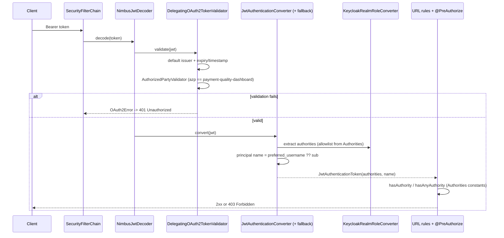

# Design Document

## Overview

This design covers a **backend-only, test-first, behavior-preserving refactor** of the security/authority layer in `apps/backend` (Java 25 / Spring Boot 4 / Spring Framework 7 / Spring Modulith 2.0.6 / Spring Security JWT resource server). It addresses four narrow concerns and one cross-spec record:

- **R1 — Typed Authority Catalog**: replace duplicated authority magic strings in `SecurityConfig` and `MerchantController` with a single compile-time source of truth.
- **R2 — Explicit, test-first Role Converter**: pin current `KeycloakRealmRoleConverter` behavior with characterization tests, then replace the heuristic prefix rule with an explicit allowlist that ignores unknown roles (fail-closed).
- **R5 — Principal claim name**: derive a readable principal from `preferred_username` with a safe fallback to `sub`.
- **R4 — Token audience / authorized-party validation**: add an `OAuth2TokenValidator<Jwt>` so the resource server only accepts tokens minted for this application. Highest risk, sequenced last.
- **Req6 — Cross-spec record**: note (do not edit) the documentation follow-up required in the `iam-roles-and-keycloak-login` spec.

The refactor changes **no REST contract, no business logic, and no frontend/Playwright code**. Every endpoint requires the identical authority it requires today. The single intentional, documented behavior change is R2: unknown realm-role names stop producing inert `platform:<name>` authorities and instead grant nothing.

### Guiding constraints

- `./mvnw test` (Surefire / `*Test.java`) and `./mvnw verify` (Failsafe / `*IT.java`, Testcontainers, Modulith tests) stay green at every step.
- The existing Security_Suite and `ModulithArchitectureTest` / `MerchantModuleTest` / `PaymentModuleTest` stay green; test setup is updated **additively**, never weakened.
- Changes stay small, reviewable, and within Spring Modulith boundaries.

### Sequencing / migration plan

The work is ordered lowest-risk to highest-risk; each step independently keeps the build green:

1. **R1 — Authority Catalog.** Introduce `Authorities`, repoint `SecurityConfig` and `MerchantController` to its constants. Pure string-identity substitution — no behavior change. Verify with the full suite.
2. **R2 — Converter (test-first).** First add characterization tests pinning today's behavior (10 known roles + unknown-role `platform:<name>` + empty/malformed guards). Then refactor the converter to an explicit allowlist derived from the catalog. The only intended diff: unknown roles now ignored. Re-run characterization tests (the unknown-role assertion is updated in the same commit as the deliberate change) plus the Security_Suite.
3. **R5 — Principal name.** Configure `preferred_username` with `sub` fallback. Authorities are untouched.
4. **R4 — azp validator (last).** Add the `AuthorizedPartyValidator`, compose it with the default validators on the decoder in both the main config and `TestJwtConfiguration`, and additively give minted test tokens `azp=payment-quality-dashboard`. Verify the Security_Suite, including a new wrong-`azp` rejection test.

## Architecture

### Spring Modulith module map (current state)

Spring Modulith treats every direct sub-package of the main package `lab.paymentquality` as an application module:

| Module | Type (today) | Notable contents |
|---|---|---|
| `foundation` | closed | `GET /api/status` |
| `merchant` | closed (`@ApplicationModule`) | `merchant.internal.web.MerchantController` (`@PreAuthorize`) |
| `payment` | closed (`@ApplicationModule`) | `payment.internal.web.PaymentOrderController` (programmatic checks) |
| `shared` | **closed (implicitly detected, no `package-info`)** | `shared.security` (`SecurityConfig`, `KeycloakRealmRoleConverter`), `shared.web` (filters) |

Today nothing in `merchant`/`payment` references `shared.security` in Java (authority strings are inline literals), so `ModulithArchitectureTest` passes even though `shared.security` is an *internal* package of the `shared` module.

### Request → authorization flow (target)



### OQ1 — Authority Catalog placement (Modulith-safe) — DECIDED

**Decision: place the catalog at `lab.paymentquality.shared.security.Authorities` and promote the `shared` package to an OPEN Spring Modulith module** (new `shared/package-info.java` with `@org.springframework.modulith.ApplicationModule(type = ApplicationModule.Type.OPEN)`).

Rationale:
- The catalog must be referenced from `SecurityConfig` (in `shared.security`), the refactored converter (in `shared.security`), and `MerchantController` (in the `merchant` module). The merchant reference is the only cross-module edge.
- `shared` is currently an *implicitly detected closed* module, so `shared.security` is an internal package. A `merchant → shared.security` reference would be flagged by `ModulithArchitectureTest`. Placement alone does **not** keep the tests green.
- An **OPEN** module is Spring Modulith's documented idiom for cross-cutting / technical modules: other modules may reference any of its types and internal-package hiding is not enforced. `shared` already hosts the security filter chain, CORS, correlation-id and request-rejection filters — it is inherently cross-cutting. Marking it OPEN lets `merchant` (and, optionally, `payment`) reference `Authorities` while keeping `ModulithArchitectureTest`, `MerchantModuleTest`, and `PaymentModuleTest` green.
- Co-locating `Authorities` with the converter and `SecurityConfig` gives the highest cohesion and most directly satisfies R2.8 (the converter and catalog share one source of truth).

**Rejected alternative (viable):** a dedicated `lab.paymentquality.shared.authorization` package exposed via `@NamedInterface`, keeping the rest of `shared` closed. This is more precise (exposes only authority constants, keeps `SecurityConfig`/filters internal) but splits the catalog away from its primary consumers (the converter and `SecurityConfig`), adds a package, and buys encapsulation that has little value for a module that is cross-cutting by nature. If a reviewer prefers maximum encapsulation over cohesion, switch to this option — both keep the three architecture tests green.

`PaymentOrderController`'s inline authority literals (`platform:payments:read|lifecycle|audit`) live inside programmatic ownership checks (business logic). R1 does not require refactoring them. Because `shared` becomes OPEN, the payment module *may* also reference `Authorities` for those literals; this is recommended as a low-risk drift-reduction follow-up but is kept out of R1's required scope to avoid touching business logic (R3.2).

## Components and Interfaces

### 1. `Authorities` — the typed catalog (R1)

A `final` class with a private constructor exposing `public static final String` constants for the **9 enforced** fine-grained authorities. Constants are compile-time constants so they can be used both in Java (`hasAuthority(Authorities.MERCHANTS_CREATE)`) and inside SpEL annotation strings via concatenation.

```java
package lab.paymentquality.shared.security;

public final class Authorities {
    // Merchant registry (platform-scoped)
    public static final String MERCHANTS_CREATE        = "platform:merchants:create";
    public static final String MERCHANTS_READ          = "platform:merchants:read";
    public static final String MERCHANTS_UPDATE_STATUS = "platform:merchants:update-status";

    // Payment orders (merchant-scoped)
    public static final String MERCHANT_PAYMENTS_CREATE    = "merchant:payments:create";
    public static final String MERCHANT_PAYMENTS_READ      = "merchant:payments:read";
    public static final String MERCHANT_PAYMENTS_LIFECYCLE = "merchant:payments:lifecycle";

    // Payment orders (platform-scoped)
    public static final String PLATFORM_PAYMENTS_READ      = "platform:payments:read";
    public static final String PLATFORM_PAYMENTS_LIFECYCLE = "platform:payments:lifecycle";
    public static final String PLATFORM_PAYMENTS_AUDIT     = "platform:payments:audit";

    private Authorities() {}
}
```

`SecurityConfig` references these constants in every URL rule, e.g.:

```java
.requestMatchers(HttpMethod.POST, "/api/merchants/*/payment-orders")
    .hasAuthority(Authorities.MERCHANT_PAYMENTS_CREATE)
.requestMatchers(HttpMethod.POST, "/api/merchants/*/payment-orders/*/authorize")
    .hasAnyAuthority(Authorities.MERCHANT_PAYMENTS_LIFECYCLE, Authorities.PLATFORM_PAYMENTS_LIFECYCLE)
...
.requestMatchers(HttpMethod.POST, "/api/merchants").hasAuthority(Authorities.MERCHANTS_CREATE)
```

`MerchantController` references the same constants through SpEL string concatenation against the compile-time constant (R1.4):

```java
@PreAuthorize("hasAuthority('" + Authorities.MERCHANTS_CREATE + "')")        // create
@PreAuthorize("hasAuthority('" + Authorities.MERCHANTS_READ + "')")          // getById / list
@PreAuthorize("hasAuthority('" + Authorities.MERCHANTS_UPDATE_STATUS + "')") // activate / suspend
```

Because the constants resolve at compile time to the *identical* strings used today, every URL rule and method-security outcome is unchanged (R1.5, R3.3).

### 2. `KeycloakRealmRoleConverter` — explicit allowlist (R2)

The converter is rewritten from the heuristic prefix rule to an **explicit allowlist** keyed by raw realm role name. The allowlist is the single mapping from `Raw_Realm_Role → authority string`, and its values are `Authorities` constants (R2.8). The empty/malformed-claim guards are preserved exactly.

```java
package lab.paymentquality.shared.security;

public class KeycloakRealmRoleConverter implements Converter<Jwt, Collection<GrantedAuthority>> {

    // Known realm role retained for behavior-preserving conversion (see "operate role status").
    // No SecurityConfig rule or @PreAuthorize references this authority; it is intentionally
    // NOT part of the enforced Authorities catalog.
    static final String MERCHANT_PAYMENTS_OPERATE = "merchant:payments:operate";

    private static final Map<String, String> KNOWN_ROLES = Map.ofEntries(
        Map.entry("merchants:create",          Authorities.MERCHANTS_CREATE),
        Map.entry("merchants:read",            Authorities.MERCHANTS_READ),
        Map.entry("merchants:update-status",   Authorities.MERCHANTS_UPDATE_STATUS),
        Map.entry("merchant:payments:create",  Authorities.MERCHANT_PAYMENTS_CREATE),
        Map.entry("merchant:payments:read",    Authorities.MERCHANT_PAYMENTS_READ),
        Map.entry("merchant:payments:operate", MERCHANT_PAYMENTS_OPERATE),
        Map.entry("merchant:payments:lifecycle", Authorities.MERCHANT_PAYMENTS_LIFECYCLE),
        Map.entry("platform:payments:read",      Authorities.PLATFORM_PAYMENTS_READ),
        Map.entry("platform:payments:lifecycle", Authorities.PLATFORM_PAYMENTS_LIFECYCLE),
        Map.entry("platform:payments:audit",     Authorities.PLATFORM_PAYMENTS_AUDIT));

    @Override
    public Collection<GrantedAuthority> convert(Jwt jwt) {
        var realmAccessClaim = jwt.getClaims().get("realm_access");
        if (!(realmAccessClaim instanceof Map<?, ?> realmAccess)) {
            return List.of();                       // R2.4
        }
        var rolesClaim = realmAccess.get("roles");
        if (!(rolesClaim instanceof Collection<?> roles)) {
            return List.of();                       // R2.5
        }
        return roles.stream()
                .filter(String.class::isInstance)
                .map(String.class::cast)
                .map(KNOWN_ROLES::get)              // unknown -> null
                .filter(Objects::nonNull)          // R2.7 fail-closed: unknown ignored
                .distinct()
                .<GrantedAuthority>map(SimpleGrantedAuthority::new)
                .toList();
    }
}
```

**Single source of truth (R2.8):** nine of the ten allowlist values are `Authorities` constants. The tenth, `merchant:payments:operate`, is a documented exception explained next.

**`merchant:payments:operate` status (decided).** This is one of the ten Known_Roles and is minted by `TestJwtSupport.merchantPaymentOperatorToken(...)`, but a workspace-wide search confirms **no `SecurityConfig` URL rule and no `@PreAuthorize` references it**. Today the heuristic converter produces the authority `merchant:payments:operate` (it starts with `merchant:`), but nothing ever checks it — it is inert. Behavior preservation (R2.2 / R2.6 enumerate `operate → merchant:payments:operate`) requires the refactored converter to keep producing it, yet R1.2 requires the catalog to hold *exactly* the nine enforced authorities. The chosen resolution:

- The **enforced catalog** (`Authorities`) holds exactly nine constants (R1.2).
- The converter retains the `operate → merchant:payments:operate` mapping using a clearly documented constant local to the converter (`KeycloakRealmRoleConverter.MERCHANT_PAYMENTS_OPERATE`), so authorization behavior for `operate` tokens is byte-for-byte identical to today.
- This keeps R1.2 and R2.6 simultaneously true. Dropping `operate` would also be observationally behavior-preserving (nothing enforces it), but it would contradict the characterization assertion in R2.6, so it is retained.

### 3. Principal claim name + fallback (R5)

The default `JwtAuthenticationConverter` returns a `null` principal name when `principalClaimName` is set but the claim is absent. To honor the explicit `sub` fallback (R4/Req4 AC3) without adding any other claim processing (AC5), the authentication converter is a thin wrapper that reuses `JwtAuthenticationConverter` for authorities and computes the name itself:

```java
@Bean
public Converter<Jwt, AbstractAuthenticationToken> jwtAuthenticationConverter() {
    JwtAuthenticationConverter delegate = new JwtAuthenticationConverter();
    delegate.setJwtGrantedAuthoritiesConverter(new KeycloakRealmRoleConverter());
    return jwt -> {
        AbstractAuthenticationToken token = delegate.convert(jwt);
        String name = jwt.getClaimAsString("preferred_username");
        if (name == null || name.isBlank()) {
            name = jwt.getSubject();                     // safe fallback, no error
        }
        return new JwtAuthenticationToken(jwt, token.getAuthorities(), name);
    };
}
```

Authorities come solely from `KeycloakRealmRoleConverter`, so the principal-name change cannot alter any authorization decision (Req4 AC4).

### 4. `AuthorizedPartyValidator` — azp validation (R4)

#### OQ2 — audience strategy — DECIDED: validate `azp` (Option A)

**Decision: validate that the `azp` (authorized party) claim equals `payment-quality-dashboard` via a custom `OAuth2TokenValidator<Jwt>`. No Keycloak realm change.**

Rationale:
- Keycloak access tokens default `aud` to `account`, so validating `aud` out of the box would reject every token. `azp` reliably carries the OAuth client id for a single-client resource server, which is exactly the "intended for this application" check R4 wants.
- This Backend is a single-client resource server; `azp == payment-quality-dashboard` is the minimal, correct signal that the token was minted for this app.
- It avoids coupling to `infra/keycloak/realms/payment-quality-realm.json`, which the `iam-roles-and-keycloak-login` spec also edits. Option A keeps this spec self-contained.

**Rejected — Option B (audience mapper + `aud`):** add a Keycloak audience protocol mapper so tokens carry a resource-server audience, then validate `aud`. Rejected because it couples to the shared realm file (cross-spec edit risk), adds infra change to a backend-only refactor, and provides no security benefit over `azp` for a single client.

```java
package lab.paymentquality.shared.security;

public final class AuthorizedPartyValidator implements OAuth2TokenValidator<Jwt> {

    private static final OAuth2Error INVALID =
        new OAuth2Error("invalid_token", "Required authorized party (azp) is missing or not allowed", null);

    private final String expectedAzp;

    public AuthorizedPartyValidator(String expectedAzp) {
        this.expectedAzp = expectedAzp;
    }

    @Override
    public OAuth2TokenValidatorResult validate(Jwt jwt) {
        return expectedAzp.equals(jwt.getClaimAsString("azp"))
            ? OAuth2TokenValidatorResult.success()
            : OAuth2TokenValidatorResult.failure(INVALID);
    }
}
```

The expected client id is read from configuration with the required default so production and tests agree:

```yaml
payment-quality:
  security:
    authorized-party: ${EXPECTED_AZP:payment-quality-dashboard}
```

#### Composition on the decoder (main config)

Spring Boot auto-configures a `NimbusJwtDecoder` from `issuer-uri`/`jwk-set-uri` with only the default issuer+timestamp validators. To **add** (not replace) the azp check (R4 AC4), `SecurityConfig` declares an explicit `JwtDecoder` bean that composes both validators:

```java
@Bean
public JwtDecoder jwtDecoder(
        @Value("${spring.security.oauth2.resourceserver.jwt.issuer-uri}") String issuerUri,
        @Value("${spring.security.oauth2.resourceserver.jwt.jwk-set-uri}") String jwkSetUri,
        @Value("${payment-quality.security.authorized-party}") String expectedAzp) {
    NimbusJwtDecoder decoder = NimbusJwtDecoder.withJwkSetUri(jwkSetUri).build();
    decoder.setJwtValidator(new DelegatingOAuth2TokenValidator<>(
            JwtValidators.createDefaultWithIssuer(issuerUri),   // issuer + timestamp (unchanged)
            new AuthorizedPartyValidator(expectedAzp)));        // additive azp check
    return decoder;
}
```

#### OQ3 — test-token / profile strategy — DECIDED: validator active in all profiles

**Decision: the `AuthorizedPartyValidator` is active in all profiles, including `test`, for fidelity. `TestJwtConfiguration` composes the same delegating validator, and `TestJwtSupport` is updated additively so minted tokens carry `azp=payment-quality-dashboard`. No existing assertion is weakened.**

`TestJwtConfiguration` mirrors the production composition on its public-key decoder:

```java
@Bean
JwtDecoder jwtDecoder() {
    NimbusJwtDecoder decoder = NimbusJwtDecoder.withPublicKey(TestJwtSupport.publicKey()).build();
    decoder.setJwtValidator(new DelegatingOAuth2TokenValidator<>(
            JwtValidators.createDefaultWithIssuer(TestJwtSupport.ISSUER),
            new AuthorizedPartyValidator(TestJwtSupport.EXPECTED_AZP)));   // EXPECTED_AZP = "payment-quality-dashboard"
    return decoder;
}
```

`TestJwtSupport` adds `.claim("azp", EXPECTED_AZP)` to every token builder (the happy-path, expired, invalid-issuer, merchant-scoped, and denied builders). These additions are purely additive: the expired/invalid-issuer/invalid-signature negative tokens still fail on their original grounds. A new helper `tokenWithWrongAuthorizedParty()` (azp = a different client id) is added to exercise rejection — a new positive test asset, not a weakening of any existing assertion.

Error mapping: a failed `OAuth2TokenValidator` makes `NimbusJwtDecoder.decode` throw `JwtValidationException` (a `BadJwtException`), which the resource-server filter renders as **401 Unauthorized** via `BearerTokenAuthenticationEntryPoint` — identical to how invalid-issuer/expired tokens already produce 401.

## Data Models

These are configuration/mapping models, not persisted entities. The refactor adds no schema and no Flyway migration.

### Enforced authority catalog (R1.2) — exactly 9

| Constant | Authority string | Enforced by |
|---|---|---|
| `MERCHANTS_CREATE` | `platform:merchants:create` | URL + `@PreAuthorize` (POST /merchants) |
| `MERCHANTS_READ` | `platform:merchants:read` | URL + `@PreAuthorize` (GET /merchants, /merchants/**) |
| `MERCHANTS_UPDATE_STATUS` | `platform:merchants:update-status` | URL + `@PreAuthorize` (activate/suspend) |
| `MERCHANT_PAYMENTS_CREATE` | `merchant:payments:create` | URL (POST payment-orders) |
| `MERCHANT_PAYMENTS_READ` | `merchant:payments:read` | URL (GET/HEAD/summary/history) |
| `MERCHANT_PAYMENTS_LIFECYCLE` | `merchant:payments:lifecycle` | URL (authorize/capture/cancel/refund/PATCH/history) |
| `PLATFORM_PAYMENTS_READ` | `platform:payments:read` | URL (GET/HEAD/summary/history) + programmatic |
| `PLATFORM_PAYMENTS_LIFECYCLE` | `platform:payments:lifecycle` | URL (lifecycle/PATCH/history) + programmatic |
| `PLATFORM_PAYMENTS_AUDIT` | `platform:payments:audit` | URL (history) |

### Known_Role → authority allowlist (R2.2 / R2.6) — exactly 10

| Raw realm role (claim) | Produced authority | Catalog constant? |
|---|---|---|
| `merchants:create` | `platform:merchants:create` | yes |
| `merchants:read` | `platform:merchants:read` | yes |
| `merchants:update-status` | `platform:merchants:update-status` | yes |
| `merchant:payments:create` | `merchant:payments:create` | yes |
| `merchant:payments:read` | `merchant:payments:read` | yes |
| `merchant:payments:operate` | `merchant:payments:operate` | **no — known but unenforced** |
| `merchant:payments:lifecycle` | `merchant:payments:lifecycle` | yes |
| `platform:payments:read` | `platform:payments:read` | yes |
| `platform:payments:lifecycle` | `platform:payments:lifecycle` | yes |
| `platform:payments:audit` | `platform:payments:audit` | yes |
| *any other name (Unknown_Role)* | *(none — ignored)* | n/a (was `platform:<name>` before) |

### Empty / malformed `realm_access` guards (R2.4 / R2.5)

| Input condition | Result |
|---|---|
| `realm_access` claim absent | empty authorities |
| `realm_access` present but not a `Map` | empty authorities |
| `realm_access.roles` absent | empty authorities |
| `realm_access.roles` present but not a `Collection` | empty authorities |
| `roles` contains non-`String` elements | those elements skipped |

### Token validation model (R4)

| Claim | Source validator | Pass condition |
|---|---|---|
| `iss` | `JwtValidators.createDefaultWithIssuer` | equals configured issuer |
| `exp` / `nbf` | default timestamp validator | not expired / active |
| signature | `NimbusJwtDecoder` (JWK) | valid RS256 signature |
| `azp` | `AuthorizedPartyValidator` | equals `payment-quality-dashboard` |

### Principal name model (R5)

| `preferred_username` | Principal name |
|---|---|
| present and non-blank | value of `preferred_username` |
| absent or blank | value of `sub` (fallback) |

## Correctness Properties

*A property is a characteristic or behavior that should hold true across all valid executions of a system — a formal statement about what the system should do. Properties serve as the bridge between human-readable specifications and machine-verifiable correctness guarantees.*

The converter (`Jwt → Collection<GrantedAuthority>`), the principal-name derivation, and the azp validator are pure functions, which makes property-based testing the right tool for them. Each property below is implemented by a **single** property-based test running **≥100 iterations**, tagged `Feature: backend-authority-refactor, Property {n}: {text}`. Properties P1–P3 are first written as **characterization** tests (pinning current behavior before the R2 refactor); after the refactor they continue to hold, except the deliberate unknown-role change captured by P2.

### Property 1: Known roles map to their documented authorities

*For any* non-empty collection of Known_Roles drawn from the 10-entry allowlist (in any order, including duplicates), the converter produces exactly the set of authorities those roles map to, with no extra and no missing authorities.

**Validates: Requirements 2.2, 2.6**

### Property 2: Unknown roles are ignored (fail-closed)

*For any* role name that is not one of the 10 Known_Roles — mixed with any subset of Known_Roles — the converter produces authorities only for the Known_Roles present and produces no authority derived from the unknown name (in particular, never `platform:<unknown>`).

**Validates: Requirements 2.7, 3.5**

### Property 3: Absent or malformed `realm_access`/`roles` yields no authorities

*For any* JWT whose `realm_access` claim is absent, or not a map, or whose `roles` entry is absent or not a collection, the converter returns an empty authority collection.

**Validates: Requirements 2.4, 2.5**

### Property 4: Catalog constants match the enforced authority strings (no drift)

*For all* nine enforced authorities, the string value of each `Authorities` constant equals the exact authority literal that `SecurityConfig` URL rules and `MerchantController` `@PreAuthorize` expressions enforce, so the catalog and the enforcement points cannot diverge.

**Validates: Requirements 1.2, 1.3, 1.4, 1.5**

### Property 5: The azp validator accepts only the expected authorized party, composed with defaults

*For any* `azp` claim value, the `AuthorizedPartyValidator` succeeds if and only if the value equals `payment-quality-dashboard`, and when composed via `DelegatingOAuth2TokenValidator` it never suppresses the existing issuer and expiry/timestamp checks (a token with the correct `azp` but a bad issuer or past expiry is still rejected).

**Validates: Requirements 5.2, 5.3, 5.4**

### Property 6: Principal name is `preferred_username` with a safe `sub` fallback, authorities unchanged

*For any* validated JWT, the principal name equals `preferred_username` when that claim is present and non-blank, and equals `sub` otherwise; and the authorities exposed are exactly those produced by `KeycloakRealmRoleConverter` for the token's `realm_access`, independent of the principal-name configuration.

**Validates: Requirements 4.2, 4.3, 4.4**

## Error Handling

- **Failed token validation (issuer, expiry, signature, or azp):** `NimbusJwtDecoder.decode` throws `JwtValidationException` / `BadJwtException`. The resource-server filter renders **401 Unauthorized** through `BearerTokenAuthenticationEntryPoint`. The new azp failure therefore behaves identically to existing invalid-issuer/expired failures — no new error surface, no REST contract change (R3.1).
- **Empty or malformed `realm_access`:** the converter returns an empty authority collection rather than throwing. A token that authenticates but carries no usable authority is then denied by the URL rules / `@PreAuthorize` as **403 Forbidden** (or masked 404 for merchant-scoped reads, per existing controller logic) — unchanged from today.
- **Missing `preferred_username`:** the principal-name wrapper falls back to `sub` without raising an error (Req4 AC3). A blank value is treated as absent.
- **Unknown roles:** silently ignored (fail-closed). No error is raised; the only effect is that no authority is granted for that name — the single intended behavior change (R3.5).
- **Catalog misuse:** `Authorities` is a `final` class with a private constructor and only compile-time string constants, so it cannot be instantiated or mutated.

## Testing Strategy

Tests follow the workspace layer hierarchy: the narrowest layer that proves the behavior. **Property tests** cover the pure converter/validator/principal logic; **unit/characterization tests** cover specific examples and the pre-refactor pin; the **existing Security_Suite, architecture/module tests, and REST Assured suite** provide regression coverage. **No Playwright / frontend work** is in scope (R3.4).

### Characterization-first (R2.1)

Before refactoring `KeycloakRealmRoleConverter`, add `KeycloakRealmRoleConverterTest` (new — none exists today) that pins current behavior: the 10 known-role mappings, the current unknown-role behavior `X → platform:X` (R2.3), and the empty/malformed-claim guards. The unknown-role assertion is the one assertion intentionally updated (to "ignored") in the same commit that lands the R2 allowlist change; every other assertion is unchanged, demonstrating behavior preservation.

### Property-based tests

Use a JVM property-based testing library (jqwik, which integrates with JUnit) — do not hand-roll generators or implement PBT from scratch. Each property test runs ≥100 iterations and carries the `Feature: backend-authority-refactor, Property {n}` tag.

| Property | Test layer | Location | Notes |
|---|---|---|---|
| P1 Known-role mapping | Unit (pure) | `shared/security/KeycloakRealmRoleConverterTest` | Generate subsets/multisets of the 10 known roles. Characterization-first. |
| P2 Unknown-role ignored | Unit (pure) | same | Generate arbitrary strings excluded from the known set, mixed with known roles. |
| P3 Malformed claim → empty | Unit (pure) | same | Generate malformed `realm_access`/`roles` shapes; plus explicit edge-case examples. |
| P4 Catalog no-drift | Slice/integration | `security/AuthorityCatalogDriftTest` | Assert enforced authority strings equal `Authorities` constants; back with existing endpoint allow/deny tests. |
| P5 azp accept/reject | Unit (pure) | `shared/security/AuthorizedPartyValidatorTest` | Generate azp values; success iff expected. Composition (issuer/expiry retained) asserted by example below. |
| P6 Principal name derivation | Unit (pure) | `shared/security/JwtPrincipalNameTest` | Generate tokens with/without `preferred_username`; assert name and that authorities equal converter output. |

### Unit / example tests

- **azp composition (P5 support):** with a correct `azp`, an expired token and an invalid-issuer token are still rejected — proves `DelegatingOAuth2TokenValidator` did not drop the defaults (R5 AC4).
- **azp rejection end-to-end:** a token minted via the new `TestJwtSupport.tokenWithWrongAuthorizedParty()` yields **401** on a protected endpoint.
- **Principal fallback example:** a token without `preferred_username` exposes `sub` as the principal name.

### Regression / integration (must stay green, additive only)

- **Security_Suite** under `src/test/.../security/` (imports `TestJwtConfiguration`): unchanged assertions; `TestJwtConfiguration`/`TestJwtSupport` updated additively (compose the delegating validator, add `azp` claim). `./mvnw test` and `./mvnw verify` green (R2.9, R4.5, R4.6).
- **Architecture/module tests** `ModulithArchitectureTest`, `MerchantModuleTest`, `PaymentModuleTest`: stay green after the `shared` module is marked OPEN and `merchant` references `Authorities` (R1.6, R1.7, R3.6).
- **REST Assured `*IT` suite**: unchanged; confirms paths, status codes, headers, and bodies are preserved (R3.1, R3.3).

### Property-to-requirement-to-test traceability

| Property | Requirements | Primary test |
|---|---|---|
| P1 | 2.2, 2.6 | `KeycloakRealmRoleConverterTest` (PBT) |
| P2 | 2.7, 3.5 | `KeycloakRealmRoleConverterTest` (PBT) |
| P3 | 2.4, 2.5 | `KeycloakRealmRoleConverterTest` (PBT) |
| P4 | 1.2–1.5 | `AuthorityCatalogDriftTest` + Security_Suite |
| P5 | 5.2, 5.3, 5.4 | `AuthorizedPartyValidatorTest` (PBT) + composition example |
| P6 | 4.2, 4.3, 4.4 | `JwtPrincipalNameTest` (PBT) + fallback example |

## Cross-Spec Impact Record (Req6 — note only, no edit)

R2 removes the "inert authority" behavior that the `iam-roles-and-keycloak-login` spec relies on. That spec's `design.md` **Decision 1**, **discrepancy A**, and **Property 1 & Property 9** assume Unknown_Roles become inert `platform:<name>` authorities. After R2 ships, those passages need a small documentation update to describe unknown roles as **ignored (not inert)** and fail-closed. This is recorded here only; **this spec does not modify any `iam-roles-and-keycloak-login` file** (Req6 AC2). The follow-up belongs to that spec.
