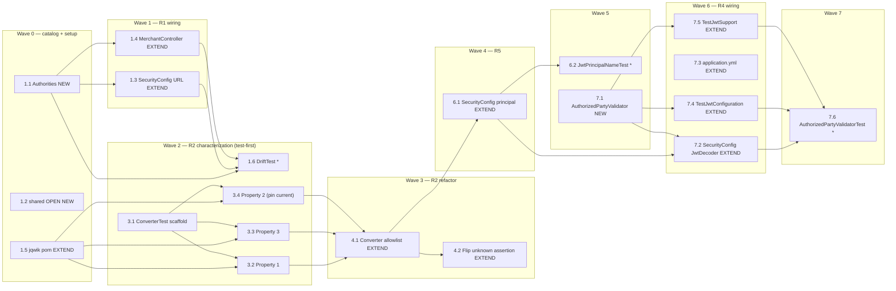

# Implementation Plan: Backend Authority Refactor

## Overview

Backend-only, test-first, behavior-preserving refactor of the `apps/backend` security/authority
layer. Work is sequenced lowest-risk to highest-risk per the design's migration plan:
**R1 (typed catalog) → R2 (test-first converter) → R5 (principal name) → R4 (azp validator, last)**.
Every step keeps `./mvnw test` and `./mvnw verify` green, preserves all REST contracts and business
logic, and changes no frontend/Playwright code. The single intended behavior change is R2: unknown
realm roles stop producing inert `platform:<name>` authorities and instead grant nothing (fail-closed).

Language: **Java 25** (specified by the design — no language selection required).
Property-based tests use **jqwik** (JUnit-integrated JVM PBT), ≥100 iterations, tagged
`Feature: backend-authority-refactor, Property {n}: ...`.

Conventions used below:
- **[NEW]** = create a new file. **[EXTEND]** = modify an existing file (additive / in-place).
- Test sub-tasks are marked optional with `*` **except** the R2 converter characterization tests
  (Properties 1–3), which are NON-optional because they gate the converter refactor (test-first).

## Tasks

- [x] 1. R1 — Typed Authority Catalog and PBT build setup
  - [x] 1.1 Create the typed authority catalog [NEW]
    - Create `apps/backend/src/main/java/lab/paymentquality/shared/security/Authorities.java`
    - `final` class, private constructor, exactly **9** `public static final String` enforced-authority constants per design Data Models table (`MERCHANTS_CREATE`, `MERCHANTS_READ`, `MERCHANTS_UPDATE_STATUS`, `MERCHANT_PAYMENTS_CREATE`, `MERCHANT_PAYMENTS_READ`, `MERCHANT_PAYMENTS_LIFECYCLE`, `PLATFORM_PAYMENTS_READ`, `PLATFORM_PAYMENTS_LIFECYCLE`, `PLATFORM_PAYMENTS_AUDIT`)
    - Compile-time constants so they are usable both in Java and in SpEL via concatenation
    - _Design: Components §1 `Authorities`; Data Models "Enforced authority catalog"_
    - _Requirements: 1.1, 1.2, 1.6_

  - [x] 1.2 Mark the `shared` module OPEN (Spring Modulith) [NEW]
    - Create `apps/backend/src/main/java/lab/paymentquality/shared/package-info.java`
    - Annotate the package `@org.springframework.modulith.ApplicationModule(type = ApplicationModule.Type.OPEN)` so `merchant` may reference `Authorities` without tripping architecture tests
    - _Design: OQ1 decision (catalog placement); Architecture module map_
    - _Requirements: 1.6, 1.7, 3.6_

  - [x] 1.3 Repoint SecurityConfig URL rules to catalog constants [EXTEND]
    - Modify `apps/backend/src/main/java/lab/paymentquality/shared/security/SecurityConfig.java`
    - Replace every inline literal in `hasAuthority(...)` / `hasAnyAuthority(...)` URL rule with the matching `Authorities` constant; resolved strings stay byte-identical (no rule-mapping change)
    - _Design: Components §1 (SecurityConfig snippet)_
    - _Requirements: 1.3, 1.5_

  - [x] 1.4 Repoint MerchantController @PreAuthorize to catalog constants [EXTEND]
    - Modify `apps/backend/src/main/java/lab/paymentquality/merchant/internal/web/MerchantController.java`
    - Rewrite each `@PreAuthorize` using SpEL string concatenation against the compile-time constant, e.g. `@PreAuthorize("hasAuthority('" + Authorities.MERCHANTS_CREATE + "')")` for create, `MERCHANTS_READ` for getById/list, `MERCHANTS_UPDATE_STATUS` for activate/suspend
    - _Design: Components §1 (MerchantController snippet)_
    - _Requirements: 1.4, 1.5_

  - [x] 1.5 Add jqwik as a test-scoped dependency [EXTEND]
    - Modify `apps/backend/pom.xml` to add `net.jqwik:jqwik` (test scope) so JUnit-integrated property tests compile and run; pin an explicit version
    - Required by the non-optional R2 characterization PBTs (tasks 3.2–3.4)
    - _Design: Testing Strategy "Property-based tests" (jqwik, ≥100 iterations)_
    - _Requirements: 2.1_

  - [x] 1.6 Write the catalog no-drift property test [NEW]
    - Create `apps/backend/src/test/java/lab/paymentquality/security/AuthorityCatalogDriftTest.java`
    - **Property 4: Catalog constants match the enforced authority strings (no drift)**
    - Assert each `Authorities` constant equals the exact literal enforced by `SecurityConfig` URL rules and `MerchantController` `@PreAuthorize`; backed by existing endpoint allow/deny coverage
    - Tag `Feature: backend-authority-refactor, Property 4: catalog no-drift`
    - **Validates: Requirements 1.2, 1.3, 1.4, 1.5**

- [x] 2. Checkpoint — R1 complete
  - Ensure all tests pass, ask the user if questions arise.
  - Run `./mvnw test` then `./mvnw verify` from `apps/backend`; confirm Security_Suite, `ModulithArchitectureTest`, `MerchantModuleTest`, `PaymentModuleTest`, and REST Assured `*IT` are green. Behavior must be identical to pre-refactor.

- [x] 3. R2 — Converter characterization (TEST-FIRST, gates the refactor)
  - [x] 3.1 Create the converter characterization test scaffold [NEW]
    - Create `apps/backend/src/test/java/lab/paymentquality/shared/security/KeycloakRealmRoleConverterTest.java`
    - Example-based characterization pinning CURRENT behavior: the 10 known-role mappings produce identically named authorities, and explicit empty/malformed-claim edge cases (`realm_access` absent/not-a-map; `roles` absent/not-a-collection; non-String elements skipped). Must be GREEN against the CURRENT converter before any converter edit
    - _Design: Testing Strategy "Characterization-first (R2.1)"; Data Models "Known_Role → authority allowlist", "Empty / malformed guards"_
    - _Requirements: 2.1, 2.2, 2.4, 2.5_

  - [x] 3.2 Property 1 PBT — known-role mapping (characterization) [NEW, NON-optional]
    - In `KeycloakRealmRoleConverterTest`
    - **Property 1: Known roles map to their documented authorities**
    - Generate subsets/multisets of the 10 known roles (any order, duplicates); assert exactly the mapped authority set, no extras/missing. ≥100 iterations. GREEN against the CURRENT converter
    - Tag `Feature: backend-authority-refactor, Property 1: known-role mapping`
    - **Validates: Requirements 2.2, 2.6**

  - [x] 3.3 Property 3 PBT — malformed/absent claim → empty (characterization) [NEW, NON-optional]
    - In `KeycloakRealmRoleConverterTest`
    - **Property 3: Absent or malformed `realm_access`/`roles` yields no authorities**
    - Generate malformed `realm_access`/`roles` shapes plus explicit edge examples; assert empty authority collection. ≥100 iterations. GREEN against the CURRENT converter
    - Tag `Feature: backend-authority-refactor, Property 3: malformed claim yields empty`
    - **Validates: Requirements 2.4, 2.5**

  - [x] 3.4 Property 2 PBT — pin CURRENT unknown-role behavior (characterization) [NEW, NON-optional]
    - In `KeycloakRealmRoleConverterTest`
    - **Property 2: Unknown roles (current behavior pin)** — an unknown role `X` currently produces `platform:X`, mixed with any subset of known roles
    - ≥100 iterations. GREEN against the CURRENT converter. This is the single assertion intentionally flipped in task 4.2
    - Tag `Feature: backend-authority-refactor, Property 2: unknown-role handling`
    - **Validates: Requirements 2.3**

- [x] 4. R2 — Refactor converter to an explicit allowlist
  - [x] 4.1 Refactor KeycloakRealmRoleConverter to a catalog-derived allowlist [EXTEND]
    - Modify `apps/backend/src/main/java/lab/paymentquality/shared/security/KeycloakRealmRoleConverter.java`
    - Replace the heuristic prefix rule with an explicit `Map<String,String>` allowlist of the 10 known roles whose 9 enforced values are `Authorities` constants, plus the documented converter-local `static final String MERCHANT_PAYMENTS_OPERATE = "merchant:payments:operate"` for the known-but-unenforced operate role
    - Preserve the empty/malformed guards exactly; unknown roles map to `null` and are filtered out (ignored, fail-closed)
    - _Design: Components §2 (converter snippet); "operate role status" decision_
    - _Requirements: 2.6, 2.7, 2.8, 3.5_

  - [x] 4.2 Flip ONLY the unknown-role assertion to "ignored" [EXTEND]
    - Modify `apps/backend/src/test/java/lab/paymentquality/shared/security/KeycloakRealmRoleConverterTest.java`
    - In the same change as 4.1, update Property 2 (task 3.4) so unknown roles now produce **no** authority (never `platform:<unknown>`). Leave every other assertion (Properties 1, 3, known-role examples, guards) unchanged to demonstrate behavior preservation
    - **Property 2: Unknown roles are ignored (fail-closed)** — ≥100 iterations
    - **Validates: Requirements 2.7, 3.5**

- [x] 5. Checkpoint — R2 complete
  - Ensure all tests pass, ask the user if questions arise.
  - Run `./mvnw test` then `./mvnw verify`; confirm `KeycloakRealmRoleConverterTest` and the full Security_Suite are green with no weakened assertions (only the unknown-role assertion changed).

- [x] 6. R5 — Principal claim name
  - [x] 6.1 Configure principal name = preferred_username with safe sub fallback [EXTEND]
    - Modify `apps/backend/src/main/java/lab/paymentquality/shared/security/SecurityConfig.java`
    - Replace the JWT authentication converter with a thin wrapper that delegates authorities to `KeycloakRealmRoleConverter` (via `JwtAuthenticationConverter`) and sets principal name to `preferred_username`, falling back to `sub` when absent/blank (no error). Authorities must be unchanged
    - _Design: Components §3 (jwtAuthenticationConverter snippet); Data Models "Principal name model"_
    - _Requirements: 4.1, 4.2, 4.3, 4.4, 4.5_

  - [x] 6.2 Write the principal-name property test [NEW]
    - Create `apps/backend/src/test/java/lab/paymentquality/shared/security/JwtPrincipalNameTest.java`
    - **Property 6: Principal name is `preferred_username` with safe `sub` fallback, authorities unchanged**
    - Generate tokens with/without `preferred_username`; assert name resolution and that authorities equal `KeycloakRealmRoleConverter` output. Include the fallback example (no `preferred_username` → `sub`). ≥100 iterations
    - Tag `Feature: backend-authority-refactor, Property 6: principal name derivation`
    - **Validates: Requirements 4.2, 4.3, 4.4**

- [x] 7. R4 — Token authorized-party (azp) validation (LAST, highest risk)
  - [x] 7.1 Add the AuthorizedPartyValidator [NEW]
    - Create `apps/backend/src/main/java/lab/paymentquality/shared/security/AuthorizedPartyValidator.java`
    - `OAuth2TokenValidator<Jwt>` that succeeds iff the `azp` claim equals the configured client id; failure returns an `invalid_token` `OAuth2Error`
    - _Design: Components §4 (validator snippet); OQ2 decision (validate azp, Option A)_
    - _Requirements: 5.1, 5.3_

  - [x] 7.2 Declare an explicit composed JwtDecoder bean [EXTEND]
    - Modify `apps/backend/src/main/java/lab/paymentquality/shared/security/SecurityConfig.java`
    - Add a `JwtDecoder` bean built from `jwk-set-uri` whose validator is a `DelegatingOAuth2TokenValidator<>(JwtValidators.createDefaultWithIssuer(issuerUri), new AuthorizedPartyValidator(expectedAzp))`; read `expectedAzp` from `payment-quality.security.authorized-party`. The azp check is additive — issuer + timestamp defaults are retained
    - _Design: Components §4 "Composition on the decoder (main config)"_
    - _Requirements: 5.1, 5.2, 5.4_

  - [x] 7.3 Add authorized-party configuration property [EXTEND]
    - Modify `apps/backend/src/main/resources/application.yml`
    - Add `payment-quality.security.authorized-party: ${EXPECTED_AZP:payment-quality-dashboard}`
    - _Design: Components §4 (yaml snippet)_
    - _Requirements: 5.2_

  - [x] 7.4 Mirror the composed validator in the test decoder [EXTEND]
    - Modify `apps/backend/src/test/java/lab/paymentquality/testsupport/TestJwtConfiguration.java`
    - Set the public-key `NimbusJwtDecoder`'s validator to the same `DelegatingOAuth2TokenValidator` (default-with-issuer + `AuthorizedPartyValidator(TestJwtSupport.EXPECTED_AZP)`) so the Security_Suite exercises production-fidelity validation
    - _Design: Components §4 "OQ3 decision"; TestJwtConfiguration snippet_
    - _Requirements: 5.5, 5.6_

  - [x] 7.5 Additively give test tokens the azp claim + wrong-azp helper [EXTEND]
    - Modify `apps/backend/src/test/java/lab/paymentquality/testsupport/TestJwtSupport.java`
    - Add `EXPECTED_AZP = "payment-quality-dashboard"` and append `.claim("azp", EXPECTED_AZP)` to ALL existing token builders (happy-path, expired, invalid-issuer, merchant-scoped, denied) so negatives still fail on their original grounds. Add `tokenWithWrongAuthorizedParty()` (different client id) as a new positive asset. No existing assertion weakened
    - _Design: Components §4 "OQ3 decision" (additive TestJwtSupport)_
    - _Requirements: 5.5_

  - [x] 7.6 Write the azp validator property + composition + end-to-end tests [NEW]
    - Create `apps/backend/src/test/java/lab/paymentquality/shared/security/AuthorizedPartyValidatorTest.java`
    - **Property 5: The azp validator accepts only the expected authorized party, composed with defaults**
    - Generate azp values (success iff equals expected), ≥100 iterations; plus example tests proving composition (correct azp but bad issuer / past expiry still rejected) and an end-to-end **401** on a protected endpoint via `TestJwtSupport.tokenWithWrongAuthorizedParty()`
    - Tag `Feature: backend-authority-refactor, Property 5: azp accept/reject`
    - **Validates: Requirements 5.2, 5.3, 5.4**

- [x] 8. Final checkpoint — full regression
  - Ensure all tests pass, ask the user if questions arise.
  - Run `./mvnw test` then `./mvnw verify` from `apps/backend`; confirm Security_Suite, `ModulithArchitectureTest`, `MerchantModuleTest`, `PaymentModuleTest`, and REST Assured `*IT` are all green.
  - Confirm no REST contract / status / header / business-logic change, and no frontend/Playwright change.

## Notes

- **Test-first gating for R2:** tasks 3.1–3.4 pin the CURRENT converter behavior and MUST be green before the converter is touched. They are NON-optional. The converter refactor (4.1) and the single flipped unknown-role assertion (4.2) land together.
- **Behavior preservation:** the only intended observable change is unknown realm roles becoming ignored (fail-closed) instead of inert `platform:<name>` authorities (R3.5). Every other authority outcome stays byte-identical.
- **Additive-only test changes:** `TestJwtConfiguration`/`TestJwtSupport` updates add the composed validator and the `azp` claim; no existing security assertion is weakened. `tokenWithWrongAuthorizedParty()` is a new positive asset.
- **Optional `*` sub-tasks** (1.6, 6.2, 7.6) are additive-coverage property tests (Properties 4, 6, 5). They can be deferred for a faster path, but the converter characterization PBTs (3.2–3.4) cannot.
- **Spring Modulith:** the `shared` module is promoted to OPEN (1.2) so `merchant` may reference `Authorities`; architecture/module tests must stay green.
- **R4 sequenced last** as the highest-risk item; the azp validator is composed with (not replacing) the default issuer + timestamp validators, so failures render as 401 exactly like existing invalid-issuer/expired tokens.
- **Cross-spec follow-up (Req6):** R2 invalidates the "inert authority" assumption in the `iam-roles-and-keycloak-login` spec (its design.md Decision 1, discrepancy A, Property 1 & 9). That documentation update is recorded as a note only and is **NOT part of this spec** — no `iam-roles-and-keycloak-login` file is edited here.
- Property tests use jqwik, ≥100 iterations, tagged `Feature: backend-authority-refactor, Property {n}: ...`.

## Task Dependency Graph

Same-file edits are placed in different waves: `SecurityConfig.java` (1.3 → 6.1 → 7.2) and the
converter test (3.x written, then 4.2 flips one assertion) never share a wave.

```json
{
  "waves": [
    { "id": 0, "tasks": ["1.1", "1.2", "1.5"] },
    { "id": 1, "tasks": ["1.3", "1.4"] },
    { "id": 2, "tasks": ["1.6", "3.1", "3.2", "3.3", "3.4"] },
    { "id": 3, "tasks": ["4.1", "4.2"] },
    { "id": 4, "tasks": ["6.1"] },
    { "id": 5, "tasks": ["6.2", "7.1"] },
    { "id": 6, "tasks": ["7.2", "7.3", "7.4", "7.5"] },
    { "id": 7, "tasks": ["7.6"] }
  ]
}
```


