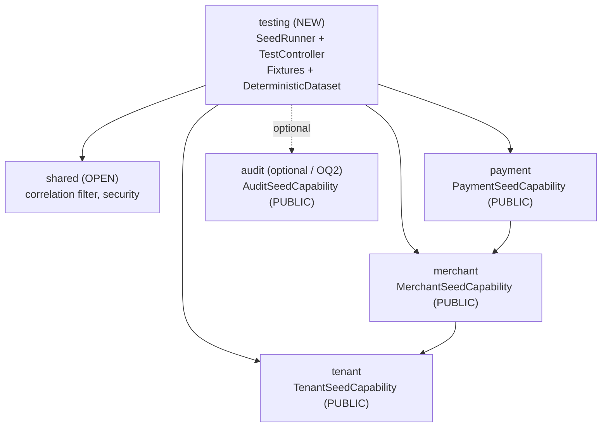
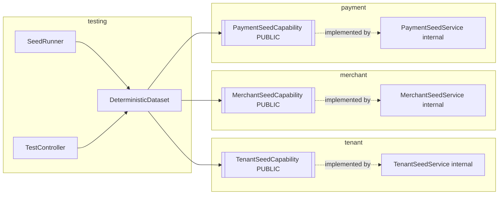
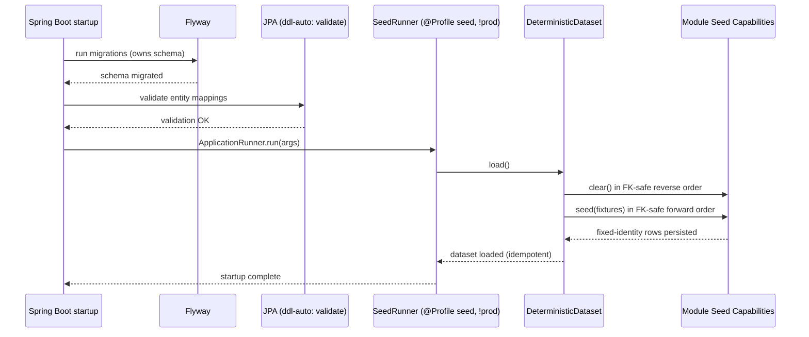
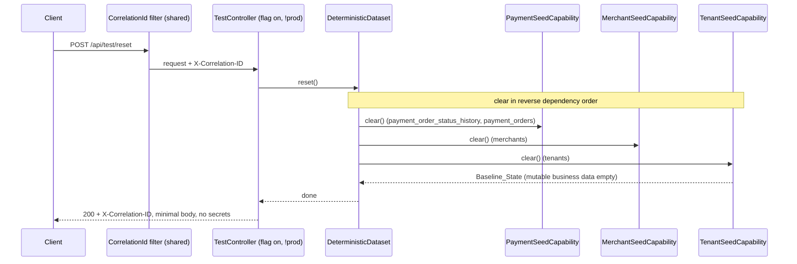
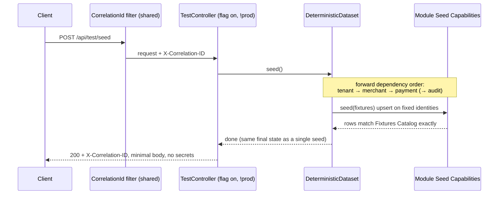
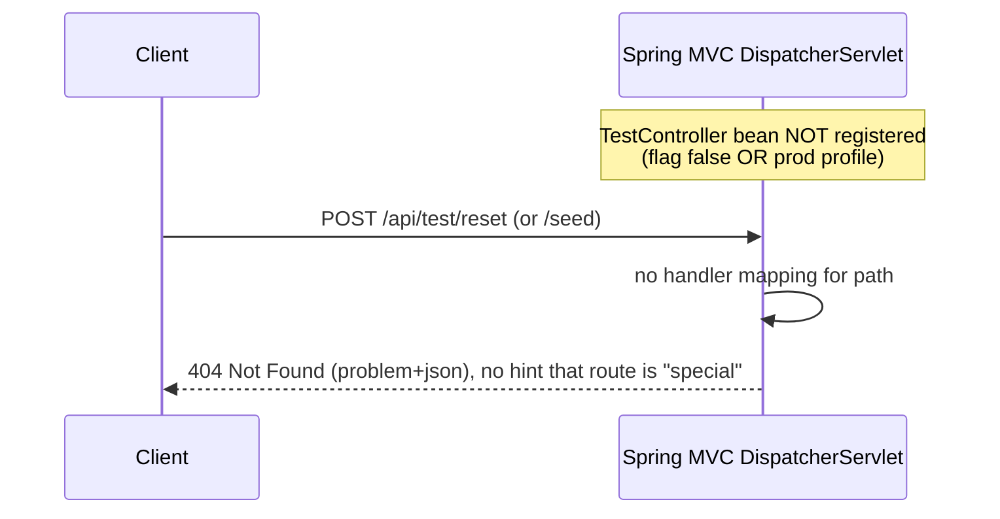

# Design Document: Deterministic Seed and Test Isolation

## Overview

This feature adds a **deterministic seed dataset** and a **feature-flagged, test-only reset/seed REST affordance** to the Payment Quality Engineering Lab backend. It is Spec #5 of the Playwright/SDET roadmap and the capstone enabler of the first five specs: it provides predictable, reset-able data across all prior specs' entities (tenants, merchants, payment orders, and — by alignment, not duplication — the Keycloak realm test users) so that future REST Assured and Playwright lessons run against a known, stable, repeatable state.

The design is **brownfield and additive**, makes **no production behavior change**, and is built around three guiding constraints that come directly from the verified current-state facts in the requirements:

1. **JPA runs `ddl-auto: validate` and Flyway owns the schema.** Seeding must therefore be **profile-gated application code**, never a default-location Flyway repeatable (`R__`) migration that would run on every startup including production. (Decision A)
2. **Spring Modulith boundaries are verified by architecture tests.** The seeding orchestration must touch each domain module only through its **PUBLIC API**, never importing another module's `internal` packages. (Requirement 10)
3. **The test endpoints must be impossible to reach in production.** They are gated by a feature flag (`app.testing.enabled`, default `false`) plus a profile guard, and return `404` (not `403`) when disabled so their existence is never advertised. (Decision D)

The central architectural decision (resolving Open Question 1) is to introduce a **new, dedicated `testing` Spring Modulith module** (`lab.paymentquality.testing`) that owns the seed runner, the test endpoints, and the orchestration logic. This module is gated so that it is **never instantiated under the `prod` profile**. It orchestrates seeding and reset by calling a **`Module_Seed_Capability`** PUBLIC interface that each domain module exposes (`TenantSeedCapability`, `MerchantSeedCapability`, `PaymentSeedCapability`, and optionally an audit capability). The `testing` module depends only on these PUBLIC APIs, so `ModulithArchitectureTest`, `MerchantModuleTest`, and `PaymentModuleTest` all stay green and a new `TestingModuleTest` documents the new module's allowed dependencies.

This document is a specification only and contains **no implementation**.

## Architecture

### Spring Modulith Module Map

The codebase gains one new first-class module, `testing`, plus a `Module_Seed_Capability` PUBLIC interface added to each domain module. The new module depends on the PUBLIC seed capabilities of the domain modules; it never reaches into any `internal` package.



**Module dependency rule:** `testing` → {`tenant`, `merchant`, `payment`, optionally `audit`} PUBLIC APIs, plus `shared` (OPEN). No module imports `*.internal.*` from another module. The `testing` module is the only new edge; the existing `merchant → tenant` and `payment → merchant` edges are unchanged. This is verified by `ApplicationModules.of(PaymentQualityApplication.class).verify()` in the architecture tests.

### Why a dedicated `testing` module (Open Question 1, resolved)

A dedicated module is recommended over folding the seeder into `shared` or a domain module for three reasons:

- **Single gating point.** The whole module can be disabled as a unit (profile + flag), so its components are simply not instantiated under `prod`. A shared-location seeder would scatter gating logic across modules.
- **Honest dependency graph.** The seeder legitimately depends on *every* domain module. Placing it in a domain module would invert or tangle the dependency graph (e.g. `merchant` depending on `payment`). A leaf `testing` module that depends on the others keeps the graph acyclic and readable.
- **Boundary enforcement is explicit.** A new `TestingModuleTest` documents exactly which PUBLIC capabilities the module is allowed to use, turning the Modulith rule into an executable contract.

### Module_Seed_Capability Pattern

Each domain module that owns seedable data exposes a small PUBLIC interface in its module root package. The `testing` module depends on these interfaces only; the implementations live in each module's `internal` package and use the module's own repositories.



**Cross-module touch points (incremental).** Each prior spec's module gains one PUBLIC seed capability:

| Module | PUBLIC capability added | Seeds / clears |
|---|---|---|
| `tenant` | `TenantSeedCapability` | `tenants` rows |
| `merchant` | `MerchantSeedCapability` | `merchants` rows |
| `payment` | `PaymentSeedCapability` | `payment_orders` (+ `payment_order_status_history`) rows |
| `audit` (optional, OQ2) | `AuditSeedCapability` | `audit_event` rows |

These additions are **purely additive** to each module's PUBLIC surface — no existing REST contract, authority, or test changes.

### Profile and Feature-Flag Guards (defense-in-depth)

Reachability of the seeder and the test endpoints is determined by **two independent gates** plus a **prod fail-safe**, so that no single misconfiguration can expose them in production:

| Concern | Guard | Effect |
|---|---|---|
| Startup seeding | `@Profile("seed")` on `SeedRunner` | Runner bean exists only when the `seed` profile is active |
| Endpoint registration | `@ConditionalOnProperty(name = "app.testing.enabled", havingValue = "true")` on `TestController` | Controller bean (and therefore its routes) exists only when the flag is `true` |
| Production fail-safe | `@Profile("!prod")` on both `SeedRunner` and `TestController` | Beans are excluded whenever `prod` is active, regardless of external config |
| Production flag override | `application-prod.yml` sets `app.testing.enabled: false` | The externally supplied value cannot turn the flag on under `prod` |

**Disabled means the route is absent, not forbidden.** When the flag is `false` (or `prod` is active), the `TestController` bean is never created, so Spring MVC has **no handler mapping** for `/api/test/reset` or `/api/test/seed`. An unmapped path yields `404 Not Found` from Spring's default dispatcher behavior — *not* `403`. This is the intended non-disclosure behavior (Decision D): the existence of the endpoints is never advertised. The design deliberately uses **bean-absence** (conditional registration) rather than a `403`-returning filter, because a filter that returns `403` would reveal that the path is special.

> Security note: because reachability is bound to the flag + profile and not to any business authority (Requirement 6.4), the endpoints are intentionally **unauthenticated** when enabled. This is acceptable only because they exist solely in non-production, flag-on environments and are physically absent everywhere else. The Spring Security filter chain must permit `/api/test/**` *only* under the same `@Profile("!prod")` + flag condition, so production never even has a permit rule for these paths.

### Sequence: Startup Seeding under the `seed` Profile



The `SeedRunner` never alters the schema and never runs DDL, so it cannot break `ddl-auto: validate` (Requirements 1.5, 1.6). It runs *after* Flyway and JPA validation have completed.

### Sequence: POST /api/test/reset (FK-safe clear to Baseline_State)



Reverse dependency order is **payment → merchant → tenant** (and, when present, **audit** is cleared alongside payment before merchant, since audit events reference payment/merchant identities). This respects the foreign keys `payment_orders.merchant_id → merchants` and `merchants.tenant_id → tenants` (Requirement 7.2).

### Sequence: POST /api/test/seed (idempotent reload)



### Sequence: Disabled flag → 404 (route absent)



## Components and Interfaces

All new types live in the new `testing` module except the `*SeedCapability` PUBLIC interfaces, which live in each domain module's root package.

### `testing` module — package layout

```
lab.paymentquality.testing
├── package-info.java                 (@ApplicationModule(displayName = "Testing Support"))
├── internal/
│   ├── seed/
│   │   ├── SeedRunner.java           (@Profile({"seed"}) + @Profile("!prod") ApplicationRunner)
│   │   ├── DeterministicDataset.java (assembler: orchestrates seed()/reset() via capabilities)
│   │   └── Fixtures.java             (fixed UUID + natural-key constants)
│   └── web/
│       ├── TestController.java       (@ConditionalOnProperty + @Profile("!prod"))
│       └── TestOperationResponse.java(minimal success DTO)
```

The `testing` module exposes **no PUBLIC API of its own** — it is a leaf consumer. Its components are all `internal`.

### `Module_Seed_Capability` PUBLIC interfaces (one per domain module)

Each is a minimal PUBLIC interface placed in the domain module root package. The shape is identical across modules; each takes its own slice of the dataset.

```java
// lab.paymentquality.tenant.TenantSeedCapability  (PUBLIC)
public interface TenantSeedCapability {
    /** Upsert the given fixed-identity tenants. Idempotent on tenant_id. */
    void seed(List<TenantSeed> tenants);
    /** Delete all tenant rows (Baseline_State for tenants). FK-safe only after merchants cleared. */
    void clear();
}

// lab.paymentquality.tenant.TenantSeed  (PUBLIC value object — carries fixed identity + fields)
public record TenantSeed(UUID tenantId, String tenantReference, String name,
                         String tenantType, String status) {}
```

```java
// lab.paymentquality.merchant.MerchantSeedCapability  (PUBLIC)
public interface MerchantSeedCapability {
    void seed(List<MerchantSeed> merchants);   // upsert on merchant_id
    void clear();
}

// lab.paymentquality.merchant.MerchantSeed  (PUBLIC)
public record MerchantSeed(UUID merchantId, String merchantReference, String displayName,
                           String status, UUID tenantId) {}
```

```java
// lab.paymentquality.payment.PaymentSeedCapability  (PUBLIC)
public interface PaymentSeedCapability {
    void seed(List<PaymentOrderSeed> orders);  // upsert on payment_order_id
    void clear();                              // clears status history + orders
}

// lab.paymentquality.payment.PaymentOrderSeed  (PUBLIC)
public record PaymentOrderSeed(UUID paymentOrderId, UUID merchantId, String clientOrderReference,
                               long amountMinor, String currency, String status,
                               long version) {}
```

Design notes:

- **PUBLIC value objects, not entities.** The capability inputs are immutable records, never JPA entities. The `testing` module never sees a `Tenant`, `Merchant`, or `PaymentOrder` entity — it builds plain records from `Fixtures`. This keeps cross-module coupling at the value level and avoids dragging `internal.domain` types across boundaries.
- **Idempotency lives in the implementation.** Each `*SeedService` (internal) performs an **upsert on the fixed primary key** (insert when absent, update fields when present) so repeated `seed()` calls converge to the same state. Alternatively a clear-then-insert is acceptable; the interface is agnostic.
- **`clear()` is per-module.** Each module clears only its own tables, using its own repositories. The `testing` module composes the FK-safe order; it does not know each module's table names.

### `SeedRunner` (internal, `testing`)

```java
@Component
@Profile({"seed"})   // active only under the seed profile
// plus a !prod guard — see note below
class SeedRunner implements ApplicationRunner {
    private final DeterministicDataset dataset;
    SeedRunner(DeterministicDataset dataset) { this.dataset = dataset; }

    @Override
    public void run(ApplicationArguments args) {
        dataset.seed();   // idempotent; never alters schema
    }
}
```

The `!prod` guard is applied either by combining profile expressions (`@Profile("seed & !prod")`) or by a `@ConditionalOnProperty`-style guard; the design intent (Requirement 9.2) is that under `prod` the runner bean does not exist. The runner performs no logging of secrets and emits only counts/identities that are safe to log.

### `DeterministicDataset` (internal, `testing`)

The orchestration assembler. It builds the seed records from `Fixtures` and drives the capabilities in the correct order.

```java
@Component
class DeterministicDataset {
    private final TenantSeedCapability tenants;
    private final MerchantSeedCapability merchants;
    private final PaymentSeedCapability payments;
    // optional: private final AuditSeedCapability audit;

    @Transactional
    void seed() {
        tenants.seed(Fixtures.tenants());        // forward FK order
        merchants.seed(Fixtures.merchants());
        payments.seed(Fixtures.paymentOrders());
        // audit.seed(Fixtures.auditEvents());   // when OQ2 resolves to "seed directly"
    }

    @Transactional
    void reset() {
        payments.clear();                         // reverse FK order
        merchants.clear();
        tenants.clear();
    }
}
```

Both operations run inside a single transaction so that a failure leaves no partially seeded/partially cleared state (Requirements 2.5, 7.2).

### `TestController` (internal, `testing`)

```java
@RestController
@RequestMapping("/api/test")
@ConditionalOnProperty(name = "app.testing.enabled", havingValue = "true")
@Profile("!prod")
class TestController {
    private final DeterministicDataset dataset;
    TestController(DeterministicDataset dataset) { this.dataset = dataset; }

    @PostMapping("/reset")
    ResponseEntity<TestOperationResponse> reset() {
        dataset.reset();
        return ResponseEntity.ok(TestOperationResponse.reset());
    }

    @PostMapping("/seed")
    ResponseEntity<TestOperationResponse> seed() {
        dataset.seed();
        return ResponseEntity.ok(TestOperationResponse.seeded());
    }
}
```

- `X-Correlation-ID` is added by the existing `shared` correlation filter (the same filter that stamps every other response), so reset/seed responses carry it automatically (Requirements 7.6, 8.6).
- `TestOperationResponse` is a minimal DTO (e.g. `{ "operation": "reset", "status": "ok" }`) that **never** includes tokens, passwords, or seeded field values that could leak secrets (Requirements 7.4, 8.4, 9.4).

### `Fixtures` (internal, `testing`)

A final class of fixed constants — the finalized form of the requirements' Fixtures Catalog. It is the single source of truth for the fixed UUIDs and natural keys (see Data Models).

```java
public final class Fixtures {
    public static final UUID PLATFORM_TENANT_ID    = UUID.fromString("00000000-0000-0000-0000-0000000000a1");
    public static final UUID TENANT_ALPHA_ID       = UUID.fromString("00000000-0000-0000-0000-0000000000a2");
    public static final UUID PLACEHOLDER_TENANT_ID = UUID.fromString("00000000-0000-0000-0000-0000000000a3");
    // ... merchants (b*), payment orders (c*) ...
    private Fixtures() {}
    static List<TenantSeed> tenants() { /* fixed list */ }
    static List<MerchantSeed> merchants() { /* fixed list */ }
    static List<PaymentOrderSeed> paymentOrders() { /* fixed list */ }
}
```

## Data Models

The seed feature introduces **no new persistent table of its own** and **no Flyway migration for seeding** (Decision A). The `DeterministicDataset` writes into the existing `tenants`, `merchants`, `payment_orders`, and `payment_order_status_history` tables (and optionally `audit_event`) via the seed capabilities. JPA `ddl-auto: validate` is untouched.

### DeterministicDataset = the finalized Fixtures Catalog

The illustrative UUIDs from the requirements are finalized into the fixed constants below. **Natural-key references are fixed and authoritative** (they must match the realm test-user attributes). The UUIDs are now also fixed (no longer "illustrative") and become the `Fixtures` constants.

**Tenants:**

| Tenant_Reference | Fixed UUID | tenant_type | Aligns with realm users |
|---|---|---|---|
| `PLATFORM_TENANT` | `00000000-0000-0000-0000-0000000000a1` | `PLATFORM` | `platform.admin`, `support.agent` |
| `TENANT_ALPHA` | `00000000-0000-0000-0000-0000000000a2` | `STANDARD` | `tenant.admin`, `merchant.manager`, `readonly.user` |
| `PLACEHOLDER_TENANT_ID` | `00000000-0000-0000-0000-0000000000a3` | `STANDARD` | legacy/placeholder |

**Merchants:**

| Merchant_Reference | Fixed UUID | Owning Tenant | Status | Purpose |
|---|---|---|---|---|
| `MERCHANT_ALPHA_001` | `00000000-0000-0000-0000-0000000000b1` | `TENANT_ALPHA` | `ACTIVE` | matches `merchant.manager` `merchant_id` |
| `MERCHANT_ALPHA_002` | `00000000-0000-0000-0000-0000000000b2` | `TENANT_ALPHA` | `ACTIVE` | second merchant for list/filter coverage |
| `MERCHANT_BETA_001` | `00000000-0000-0000-0000-0000000000b3` | `PLATFORM_TENANT` | `ACTIVE` | cross-tenant isolation coverage |

**Payment orders (minimum status coverage; expanded for pagination/summary — see below):**

| Fixed UUID | Owning Merchant | Status | version (ETag source) |
|---|---|---|---|
| `00000000-0000-0000-0000-0000000000c1` | `MERCHANT_ALPHA_001` | `CREATED` | 0 |
| `00000000-0000-0000-0000-0000000000c2` | `MERCHANT_ALPHA_001` | `AUTHORIZED` | 1 |
| `00000000-0000-0000-0000-0000000000c3` | `MERCHANT_ALPHA_001` | `CAPTURED` | 2 |
| `00000000-0000-0000-0000-0000000000c4` | `MERCHANT_ALPHA_002` | `CANCELLED` | 1 |
| `00000000-0000-0000-0000-0000000000c5` | `MERCHANT_ALPHA_002` | `REFUNDED` | 3 |
| `00000000-0000-0000-0000-0000000000c6` | `MERCHANT_BETA_001` | `CREATED` | 0 |

**Pagination / summary expansion.** The existing list endpoint caps page size at 100. To exercise pagination and summary aggregation deterministically (Requirement 5.4), the design seeds an **additional fixed block** of orders for `MERCHANT_ALPHA_001` using a deterministic UUID scheme (`...0000000000c1xx`) and fixed field values, so that `MERCHANT_ALPHA_001` holds more than one page and the per-status summary counts are exactly known. The exact count and UUIDs are enumerated in `Fixtures` and remain byte-stable across runs (Requirement 5.5).

### Baseline_State definition

`Baseline_State` is the database state produced by a Reset_Operation: **all mutable business data removed** in FK-safe order (`payment_order_status_history`, `payment_orders`, `merchants`, `tenants`, and `audit_event` when present), **schema intact**, ready for a subsequent Seed_Operation. The schema, Flyway history table, and any reference/lookup data owned by migrations are not touched — only the mutable business rows are cleared. The "seeded baseline" is `Baseline_State` followed by one Seed_Operation (the full Deterministic_Dataset).

### Terminal-status seeding (bypasses lifecycle deliberately)

Several seeded statuses (`AUTHORIZED`, `CAPTURED`, `CANCELLED`, `REFUNDED`) are normally reached only by driving the lifecycle through `If-Match`/idempotency-guarded transitions. The seed **inserts each payment order directly in its target status** without driving the lifecycle (Requirement 5.6). This is a deliberate fixture shortcut, and the design records its consequences explicitly:

- The `PaymentSeedCapability.seed(...)` implementation inserts a `payment_orders` row with the target `status` and a chosen `version` (the value the `ETag` "v{version}" contract will expose). The version is fixed per fixture so the seeded `ETag` is deterministic.
- **Status-history consistency:** for each seeded order the implementation inserts **a single synthetic `payment_order_status_history` creation entry** (and, optionally, terminal-state entries) so that `GET /{id}/history` returns a coherent, non-empty trail. The design's default is one creation entry per seeded order; richer synthetic histories are optional and must remain deterministic.
- **Lifecycle invariants are intentionally bypassed.** The seed does not replay `authorize → capture` etc., so invariants such as "captured amount ≤ authorized amount" are enforced by the *fixture data itself* (the seeded field values are chosen to be internally consistent), not by the lifecycle services. This is acceptable because seeded fixtures are curated constants, not user input. The design documents this as a known, deliberate divergence from the runtime lifecycle path.

## Correctness Properties

*A property is a characteristic or behavior that should hold true across all valid executions of a system — essentially, a formal statement about what the system should do. Properties serve as the bridge between human-readable specifications and machine-verifiable correctness guarantees.*

This feature's **pure orchestration logic** (idempotency of seeding, identity assignment, reset-to-baseline) is well suited to property-based testing when the seed capabilities are exercised against a real (Testcontainers) or in-memory fake database. The properties below are universally quantified and trace to the requirements. Infrastructure and configuration concerns (profile gating, route registration) are validated by example/integration tests rather than property tests, and are noted in the Testing Strategy.

### Property 1: Seed idempotency

*For any* sequence of N ≥ 1 consecutive Seed_Operations starting from any database state reachable by seeding/reset, the final database state SHALL be identical to the state after exactly one Seed_Operation.

**Validates: Requirements 2.2, 2.3, 8.3**

### Property 2: Fixed identities are stable and exact

*For any* Seed_Operation, every seeded tenant, merchant, and payment order SHALL be assigned exactly the fixed UUID primary key and natural-key reference recorded in the Fixtures Catalog, and these identities SHALL NOT vary between operations or runs.

**Validates: Requirements 2.4, 3.2, 3.5, 5.5, 8.2**

### Property 3: Reset yields Baseline_State, FK-safe, schema intact

*For any* database state reachable by seeding and arbitrary test-created data, a Reset_Operation SHALL remove all mutable business data without violating foreign-key constraints and SHALL leave the schema intact and ready for a subsequent Seed_Operation.

**Validates: Requirements 7.1, 7.2, 7.3**

### Property 4: Production safety is total and deterministic

*For any* externally supplied configuration value of `app.testing.enabled`, while the `prod` profile is active the effective flag SHALL be `false`, the Seed_Runner SHALL NOT be active, and both `POST /api/test/reset` and `POST /api/test/seed` SHALL return `404`.

**Validates: Requirements 9.1, 9.2, 9.3**

### Property 5: Disabled flag means 404 for both endpoints

*For any* request to `POST /api/test/reset` or `POST /api/test/seed` while the Testing_Flag is `false`, the Backend_API SHALL return status `404` (never `403`), so the endpoints' existence is not advertised.

**Validates: Requirements 6.2, 7.5, 8.5**

### Property 6: Realm-alignment — no dangling identity

*For any* Realm_Test_User attribute that names a tenant (`tenant_id`) or merchant (`merchant_id`), the seeded Deterministic_Dataset SHALL contain a matching tenant or merchant record, so that no Realm_Test_User resolves to a missing identity.

**Validates: Requirements 4.1, 4.2, 4.3, 4.5**

## Error Handling

| Condition | Behavior | Requirement |
|---|---|---|
| Test endpoint called while flag `false` or under `prod` | Controller bean absent → no handler mapping → `404 Not Found` (problem+json), never `403` | 6.2, 7.5, 8.5, 9.3 |
| Reset FK-order failure | All clears run in one transaction in reverse dependency order (payment → merchant → tenant); on any failure the transaction rolls back, leaving the prior consistent state — never a partially cleared DB | 7.2 |
| Seed partial failure | Seed runs in one transaction in forward dependency order; if any capability fails (e.g. missing schema object), the transaction rolls back so no partially seeded state remains | 2.5 |
| Seed against missing schema object | Surfaced as a startup failure (seed profile) or `500` problem+json (endpoint); no partial seed persists | 2.5 |
| Secret exposure | Success/error bodies and all log statements from `SeedRunner`, `TestController`, and the capabilities never include bearer tokens, passwords, PAN, CVV, or personal data; responses carry only `operation`/`status` plus `X-Correlation-ID` | 7.4, 8.4, 9.4 |
| Accidental enablement | Reachability is bound to flag + `!prod` profile only, not to any business authority; under `prod` there is no permit rule and no controller bean, so an unrelated config change cannot expose the routes | 6.4, 9.5 |

All `4xx`/`5xx` responses follow the platform's `application/problem+json` contract; the `404` for disabled endpoints is the standard Spring "no handler" problem response and reveals nothing endpoint-specific.

## Testing Strategy

The strategy follows the project's narrowest-layer principle and its dual unit + property approach. Property-based tests use **jqwik** and run a **minimum of 100 iterations** each, tagged to the design property.

### Unit tests (JUnit 6 + AssertJ, narrowest layer)

- **Fixtures consistency:** every `MerchantSeed.tenantId` resolves to a `TenantSeed`; every `PaymentOrderSeed.merchantId` resolves to a `MerchantSeed`; all natural keys match the authoritative constants. (supports Property 2, 6)
- **DeterministicDataset ordering:** with mocked capabilities, `seed()` calls tenant → merchant → payment and `reset()` calls payment → merchant → tenant. (supports Property 3)
- **Response DTO:** `TestOperationResponse` carries no sensitive fields. (Requirement 7.4, 8.4)

### Property-based tests (jqwik, ≥100 iterations)

Run against a real schema via Testcontainers (`PostgresContainerSupport`) using the seed capabilities, or against an in-memory fake repository for pure-logic properties. Each test is tagged:

`// Feature: deterministic-seed-and-test-isolation, Property {n}: {property text}`

| Property | Generator strategy | Assertion |
|---|---|---|
| P1 Seed idempotency | random N in 1..5; optionally random pre-existing mutable rows | DB snapshot after N seeds equals snapshot after 1 seed |
| P2 Fixed identities | random operation order (seed/reset/seed) | every seeded row carries the exact catalog UUID + natural key |
| P3 Reset → baseline | random test-created rows added before reset | after reset, all mutable business tables empty; no FK violation; schema present |
| P6 Realm-alignment | iterate over the realm test-user attribute set | each `tenant_id`/`merchant_id` attribute has a matching seeded record |

P4 (prod safety) and P5 (disabled → 404) concern **configuration and route registration**, which do not vary meaningfully with generated input. They are covered by integration/slice examples below rather than 100-iteration PBT, though they are still stated as universal properties for traceability.

### Slice and integration tests

- **`@SpringBootTest` with the `seed` profile** (`*IT.java`, Testcontainers): startup seeds the full dataset; Flyway + `ddl-auto: validate` succeed (Requirements 1.2, 1.5, 1.6); a second `POST /api/test/seed` leaves state unchanged (Property 1).
- **Endpoint enabled** (`@SpringBootTest`, `app.testing.enabled=true`, non-prod): `POST /api/test/reset` clears to Baseline_State; `POST /api/test/seed` reloads; both responses carry `X-Correlation-ID` and a minimal body (Requirements 7, 8). Covers P3, P5-positive.
- **Endpoint disabled → 404** (`@SpringBootTest`, flag `false`): both paths return `404`, not `403` (Property 5). A second variant with `@ActiveProfiles("prod")` + `app.testing.enabled=true` confirms the prod fail-safe still yields `404` and the runner is inactive (Property 4).
- **No-seed-by-default:** without the `seed` profile, startup does not load the dataset (Requirement 1.3). Default remains `seed`-only, not `test` (Open Question 4 resolved: seeding does **not** auto-run under `test`, preserving the existing `deleteAll()` isolation).

### Architecture tests

- Existing `ModulithArchitectureTest`, `MerchantModuleTest`, `PaymentModuleTest` continue to pass unchanged (Requirement 10.3).
- New **`TestingModuleTest`** verifies the `testing` module depends only on the PUBLIC seed capabilities of `tenant`/`merchant`/`payment` (and optionally `audit`) plus `shared`, and imports no `*.internal.*` package (Requirements 10.1, 10.2).

### Scope boundaries (what is NOT tested here)

- **No Playwright or other frontend test files** are created by this spec. The test-reset/seed endpoints themselves are tested at the REST/integration layer only. Future Playwright usage is conceptual (recorded in requirements) and out of scope.
- The existing per-class Testcontainers + `@BeforeEach deleteAll()` unit isolation pattern is **retained unchanged** and does not depend on the Test_Endpoints (Requirements 11.2, 11.3).

## Cross-Spec Implementation Notes

This spec is **implemented last** of the first-five roadmap and is designed to land **incrementally** as prior specs complete.

- **Implement in stages (matches requirements sequencing).**
  1. Build the `testing` module skeleton, `SeedRunner`, `TestController`, `Fixtures`, `DeterministicDataset`, the `MerchantSeedCapability` and `PaymentSeedCapability`, plus all profile/flag/prod guards — these need only merchants and payment orders, which exist today.
  2. Add `TenantSeedCapability` and tenant fixtures once `tenant-model-and-isolation` (#2) lands; assign each seeded merchant to its tenant.
  3. Confirm realm-alignment (Property 6) once `iam-roles-and-keycloak-login` (#1) and `user-management` (#3) land.
  4. Add `AuditSeedCapability` and audit fixtures only if Open Question 2 resolves toward seeding audit rows directly, once `audit-log-dashboard` (#4) lands.

- **Each module gains a seed capability (touch points).** The only change to existing modules is the **additive** PUBLIC `*SeedCapability` interface + value object + an `internal` `*SeedService` implementation using that module's existing repositories. No existing REST contract, authority, mapper, or test is modified.

- **Production safety is non-negotiable at every increment.** Every stage keeps the two gates (`@Profile("seed")` runner, `@ConditionalOnProperty` controller) plus the `@Profile("!prod")` fail-safe and the `application-prod.yml` flag override. The Spring Security permit rule for `/api/test/**` must itself be `!prod` + flag-gated so production never even permits the path.

- **No migration for seeding.** Seeding is profile-gated application code only. No `data.sql`, no default-location Flyway repeatable (`R__`) migration, no change to `ddl-auto: validate` (Decision A). If a future increment needs reference data owned by the schema, that belongs in a versioned Flyway migration in the relevant module — never in the seed runner.

- **Open Questions carried into implementation.** OQ1 resolved here (dedicated `testing` module). OQ2 (seed audit directly vs. via actions) deferred to the audit increment. OQ3 (tenant-scoped reset) deferred — default is a full reset; a tenant-scoped variant can later add an optional request body without breaking the full-reset default. OQ4 resolved here (seed runs under `seed` only, not `test`).
