# Implementation Plan: Deterministic Seed and Test Isolation

## Prerequisites & Incremental Implementation Strategy

This is **Spec #5** of the Playwright/SDET roadmap. It is **implemented last** but lands **incrementally**, one stage per prerequisite spec. Every stage preserves production safety (two gates + `!prod` fail-safe + prod flag override) and Spring Modulith module boundaries. The Module_Seed_Capability pattern means each domain module gains only an **additive** PUBLIC `*SeedCapability` interface + value record + an `internal` `*SeedService` — no existing REST contract, authority, mapper, or test changes.

Implementation language is **Java 25 / Spring Boot 4.0.x / Spring Modulith 2.0.6** (taken directly from the design; no pseudocode). Tests use JUnit 6 + AssertJ + Mockito, REST Assured 6 + Testcontainers for integration, and **jqwik** for property tests.

### Stage 1 — no prerequisites (merchants + payments exist today). CAN be built now.

Build the `testing` module skeleton, `SeedRunner`, `TestController`, `Fixtures`, `DeterministicDataset`, `MerchantSeedCapability` + `PaymentSeedCapability`, and all profile/flag/prod guards. These need only the `merchant` and `payment` modules, which already exist on the current branch. Covers Waves 1–3 below.

### Stage 2 — after `tenant-model-and-isolation` (#2).

Add `TenantSeedCapability` + `TenantSeed` + `internal` `TenantSeedService`, extend `Fixtures` and `DeterministicDataset` with tenants, and assign every seeded merchant to its tenant. Covers Wave 4. **Deferred until #2 implemented.**

### Stage 3 — after `iam-roles-and-keycloak-login` (#1) + `user-management` (#3).

Confirm realm-alignment (Property 6): every seeded `tenant_id`/`merchant_id` matches a realm test-user attribute. Covers Wave 5. **Deferred until #1 and #3 implemented.**

### Stage 4 — after `audit-log-dashboard` (#4), conditional on Open Question 2.

If OQ2 resolves toward seeding audit rows directly, add `AuditSeedCapability` + audit fixtures; otherwise note it deferred. Covers Wave 6. **Deferred until #4 implemented and OQ2 resolved.**

## Overview

Stage 1 (Waves 1–3) delivers the full prod-safe seed/reset affordance against merchants + payment orders today. Later stages (Waves 4–6) extend the same orchestration as each prerequisite spec lands, never weakening the gates and never reaching into another module's `internal` package.

## Tasks

- [ ] 1. Wave 1 — Stage 1 module + seed capabilities
  - [ ] 1.1 Create the `testing` Spring Modulith module skeleton [NEW]
    - Create `lab.paymentquality.testing` package with `package-info.java` annotated `@ApplicationModule(displayName = "Testing Support")`
    - Module exposes no PUBLIC API of its own; all components live under `internal/` (`internal/seed`, `internal/web`)
    - Module is a leaf consumer gated so it is never instantiated under `prod`
    - _Design: Architecture → "Why a dedicated `testing` module"; Components → `testing` module package layout. Requirements: 10.1, 10.4_

  - [ ] 1.2 Add `MerchantSeedCapability` PUBLIC interface + `MerchantSeed` record + `internal` `MerchantSeedService` [EXTEND merchant]
    - Add PUBLIC `MerchantSeedCapability` (`seed(List<MerchantSeed>)` upsert on `merchant_id`, `clear()`) and PUBLIC `MerchantSeed` record in `lab.paymentquality.merchant` root package
    - Implement `internal` `MerchantSeedService` using the merchant module's existing repository; idempotent upsert on fixed PK; `clear()` deletes only `merchants` rows
    - Purely additive: no change to existing merchant REST contract, authority, or mapper
    - _Design: Components → Module_Seed_Capability pattern (merchant). Requirements: 10.2, 2.3, 2.4_

  - [ ] 1.3 Add `PaymentSeedCapability` PUBLIC interface + `PaymentOrderSeed` record + `internal` `PaymentSeedService` [EXTEND payment]
    - Add PUBLIC `PaymentSeedCapability` (`seed(List<PaymentOrderSeed>)` upsert on `payment_order_id`, `clear()` clears status history + orders) and PUBLIC `PaymentOrderSeed` record in `lab.paymentquality.payment` root package
    - Implement `internal` `PaymentSeedService`: insert each order **directly in its target status** with a fixed `version` (deliberate lifecycle bypass), plus a synthetic single `payment_order_status_history` creation entry per order so `GET /{id}/history` is coherent
    - `clear()` deletes `payment_order_status_history` then `payment_orders` (FK-safe within the module)
    - _Design: Components → Module_Seed_Capability pattern (payment); Data Models → Terminal-status seeding. Requirements: 5.6, 10.2, 2.3, 2.4_

  - [ ] 1.4 Implement `Fixtures` constants for merchants + payment orders [NEW]
    - Final class of fixed UUID + natural-key constants; static factory methods `merchants()` and `paymentOrders()` returning the finalized catalog (merchant `b*` UUIDs, payment-order `c*` UUIDs incl. the pagination/summary expansion block `...c1xx`)
    - Byte-stable seeded field values for every fixed identity; private constructor
    - Tenant constants (`a*`) are declared here but their fixtures list is added in Stage 2 (task 4.2)
    - _Design: Components → `Fixtures`; Data Models → finalized Fixtures Catalog, pagination/summary expansion. Requirements: 3.2, 3.4, 5.2, 5.3, 5.4, 5.5_

  - [ ] 1.5 Implement `DeterministicDataset` orchestration assembler [NEW]
    - `@Component` in `internal/seed` that builds seed records from `Fixtures` and drives capabilities
    - `@Transactional seed()` in forward FK order (tenant → merchant → payment); `@Transactional reset()` in reverse FK order (payment → merchant → tenant)
    - Stage 1 wires merchant + payment only; tenant calls added in Stage 2 (task 4.3). Single transaction so a failure leaves no partial state
    - _Design: Components → `DeterministicDataset`; Sequence diagrams (seed/reset). Requirements: 7.2, 2.5, 7.3_

- [ ] 2. Wave 2 — Stage 1 runner + endpoints + guards
  - [ ] 2.1 Implement `SeedRunner` profile-gated `ApplicationRunner` [NEW]
    - `@Component implements ApplicationRunner` gated `@Profile("seed")` plus a `!prod` fail-safe; calls `dataset.seed()` after Flyway + JPA validation
    - Never alters schema, never runs DDL, logs only safe counts/identities (no secrets)
    - _Design: Components → `SeedRunner`; Sequence → Startup Seeding. Requirements: 1.1, 1.2, 1.4, 1.5, 9.2, 9.4_

  - [ ] 2.2 Implement `TestController` + minimal `TestOperationResponse` DTO [NEW]
    - `@RestController @RequestMapping("/api/test")` gated `@ConditionalOnProperty(name = "app.testing.enabled", havingValue = "true")` + `@Profile("!prod")`
    - `POST /reset` → `dataset.reset()`; `POST /seed` → `dataset.seed()`; both return 200 with minimal `TestOperationResponse` (`operation`/`status` only, no secrets); `X-Correlation-ID` supplied by the existing `shared` correlation filter
    - _Design: Components → `TestController`, `TestOperationResponse`; Sequences (reset/seed/disabled→404). Requirements: 6.1, 6.3, 6.4, 7.1, 7.4, 7.6, 8.1, 8.4, 8.6_

  - [ ] 2.3 Force the Testing_Flag off under `prod` via `application-prod.yml` [NEW/EXTEND config]
    - Set `app.testing.enabled: false` in `application-prod.yml` so an externally supplied value cannot turn the flag on under `prod`
    - _Design: Architecture → Profile and Feature-Flag Guards (prod flag override). Requirements: 9.1, 9.5_

  - [ ] 2.4 Permit `/api/test/**` only under `!prod` + flag in Spring Security [EXTEND shared SecurityConfig]
    - Add a permit rule for `/api/test/**` that is itself `@Profile("!prod")` + flag-gated, so production never even has a permit rule for these paths; endpoints stay unauthenticated only when enabled in non-prod
    - Disabled means the route is **absent** (404 from no handler mapping), never a 403-returning filter
    - _Design: Architecture → Profile and Feature-Flag Guards (security note). Requirements: 6.2, 6.4, 9.3, 9.5_

- [ ] 3. Wave 3 — Stage 1 tests
  - [ ]* 3.1 Write unit tests for `Fixtures` and `DeterministicDataset` and DTO
    - `Fixtures` consistency: every `PaymentOrderSeed.merchantId` resolves to a `MerchantSeed`; natural keys match authoritative constants
    - `DeterministicDataset` ordering with mocked capabilities: `seed()` calls merchant → payment, `reset()` calls payment → merchant (tenant added in Stage 2)
    - `TestOperationResponse` carries no sensitive fields
    - _Design: Testing Strategy → Unit tests. Requirements: 7.4, 8.4_

  - [ ] 3.2 Write `@SpringBootTest` seed-profile integration test (`*IT.java`)
    - Testcontainers + `@ActiveProfiles({"test","seed"})`: startup seeds the full Stage-1 dataset; Flyway + `ddl-auto: validate` succeed; a second `POST /api/test/seed` leaves state unchanged
    - _Design: Testing Strategy → Slice and integration tests. Requirements: 1.2, 1.5, 1.6, 2.2_

  - [ ] 3.3 Write endpoint-enabled integration test (`*IT.java`)
    - `app.testing.enabled=true`, non-prod: `POST /api/test/reset` clears to Baseline_State; `POST /api/test/seed` reloads; both responses carry `X-Correlation-ID` and a minimal body with no secrets
    - _Design: Testing Strategy → Slice and integration tests; Sequences. Requirements: 7.1, 7.3, 7.6, 8.1, 8.6_

  - [ ] 3.4 Write endpoint-disabled → 404 integration test (`*IT.java`)
    - Flag `false`: both `POST /api/test/reset` and `POST /api/test/seed` return `404` (never `403`)
    - _Design: Error Handling; Sequence → Disabled flag → 404. Requirements: 6.2, 7.5, 8.5_

  - [ ] 3.5 Write prod-profile → 404 integration test (`*IT.java`)
    - `@ActiveProfiles("prod")` + `app.testing.enabled=true`: both endpoints still return `404` and the `SeedRunner` is inactive (prod fail-safe)
    - **Property 4: Production safety is total and deterministic**
    - **Validates: Requirements 9.1, 9.2, 9.3**
    - _Design: Correctness Properties → Property 4; Testing Strategy → Slice and integration tests_

  - [ ] 3.6 Write `TestingModuleTest` architecture/boundary test
    - Verify the `testing` module depends only on the PUBLIC seed capabilities of `merchant`/`payment` (+ `shared`) and imports no `*.internal.*`; confirm existing `ModulithArchitectureTest`, `MerchantModuleTest`, `PaymentModuleTest` still pass
    - _Design: Testing Strategy → Architecture tests. Requirements: 10.1, 10.2, 10.3_

  - [ ]* 3.7 Write jqwik property test — Property 1 (seed idempotency)
    - Random N in 1..5 (optionally random pre-existing mutable rows): DB snapshot after N seeds equals snapshot after 1 seed; ≥100 iterations
    - Tag: `// Feature: deterministic-seed-and-test-isolation, Property 1: Seed idempotency`
    - **Property 1: Seed idempotency**
    - **Validates: Requirements 2.2, 2.3, 8.3**
    - _Design: Correctness Properties → Property 1; Testing Strategy → PBT table_

  - [ ]* 3.8 Write jqwik property test — Property 2 (fixed identities stable and exact)
    - Random operation order (seed/reset/seed): every seeded row carries the exact catalog UUID + natural key; ≥100 iterations
    - Tag: `// Feature: deterministic-seed-and-test-isolation, Property 2: Fixed identities are stable and exact`
    - **Property 2: Fixed identities are stable and exact**
    - **Validates: Requirements 2.4, 3.2, 3.5, 5.5, 8.2**
    - _Design: Correctness Properties → Property 2; Testing Strategy → PBT table_

  - [ ]* 3.9 Write jqwik property test — Property 3 (reset → baseline, FK-safe, schema intact)
    - Random test-created rows added before reset: after reset all mutable business tables empty, no FK violation, schema present; ≥100 iterations
    - Tag: `// Feature: deterministic-seed-and-test-isolation, Property 3: Reset yields Baseline_State`
    - **Property 3: Reset yields Baseline_State, FK-safe, schema intact**
    - **Validates: Requirements 7.1, 7.2, 7.3**
    - _Design: Correctness Properties → Property 3; Testing Strategy → PBT table_

- [ ] 4. Wave 4 — Stage 2 (after `tenant-model-and-isolation` #2). Deferred until #2 implemented.
  - [ ] 4.1 Add `TenantSeedCapability` PUBLIC interface + `TenantSeed` record + `internal` `TenantSeedService` [EXTEND tenant]
    - Add PUBLIC `TenantSeedCapability` (`seed(List<TenantSeed>)` upsert on `tenant_id`, `clear()`) and PUBLIC `TenantSeed` record in `lab.paymentquality.tenant` root package
    - Implement `internal` `TenantSeedService` using the tenant module's repository; `clear()` deletes only `tenants` rows (FK-safe only after merchants cleared)
    - _Design: Components → Module_Seed_Capability pattern (tenant); Cross-Spec Notes (stage 2). Requirements: 10.2, 4.1, 4.3_

  - [ ] 4.2 Extend `Fixtures` with tenant fixtures [EXTEND]
    - Implement `Fixtures.tenants()` returning `PLATFORM_TENANT` (`a1`), `TENANT_ALPHA` (`a2`), `PLACEHOLDER_TENANT_ID` (`a3`) with correct `tenant_type`
    - _Design: Data Models → Fixtures Catalog (Tenants). Requirements: 3.3, 5.1_

  - [ ] 4.3 Wire tenants into `DeterministicDataset` and assign merchants to tenants [EXTEND]
    - `seed()` calls `tenants.seed(Fixtures.tenants())` first (forward FK order); `reset()` calls `tenants.clear()` last (reverse FK order)
    - Ensure each seeded `MerchantSeed.tenantId` references a seeded tenant (`MERCHANT_ALPHA_*` → `TENANT_ALPHA`, `MERCHANT_BETA_001` → `PLATFORM_TENANT`)
    - _Design: Components → `DeterministicDataset`; Data Models → Merchants table. Requirements: 4.2, 4.3, 7.2_

  - [ ] 4.4 Extend integration + boundary tests for tenants [EXTEND]
    - Seed/clear FK order covers `tenants`; reset leaves no tenant rows; `TestingModuleTest` now also allows the `tenant` PUBLIC capability and forbids `tenant.internal`
    - Partial realm-alignment check (tenant references resolvable); full alignment in Wave 5
    - _Design: Testing Strategy → Architecture tests; Slice and integration tests. Requirements: 4.1, 4.3, 10.1, 10.2_

- [ ] 5. Wave 5 — Stage 3 (after #1 + #3). Deferred until #1 and #3 implemented.
  - [ ]* 5.1 Write jqwik property test — Property 6 (realm-alignment, no dangling identity)
    - Iterate over the realm test-user attribute set: each `tenant_id`/`merchant_id` attribute resolves to a matching seeded tenant/merchant record; ≥100 iterations (or exhaustive over the attribute set)
    - Confirm seeded tenant/merchant references match the realm test-user attributes finalized by #1 and #3
    - Tag: `// Feature: deterministic-seed-and-test-isolation, Property 6: Realm-alignment — no dangling identity`
    - **Property 6: Realm-alignment — no dangling identity**
    - **Validates: Requirements 4.1, 4.2, 4.3, 4.5**
    - _Design: Correctness Properties → Property 6; Testing Strategy → PBT table_

- [ ] 6. Wave 6 — Stage 4 (after `audit-log-dashboard` #4, conditional on OQ2). Deferred until #4 implemented and OQ2 resolved.
  - [ ] 6.1 Add `AuditSeedCapability` + audit fixtures (only if OQ2 = seed audit directly) [EXTEND audit]
    - If OQ2 resolves toward seeding audit rows directly: add PUBLIC `AuditSeedCapability` (`seed`/`clear`) + value record + `internal` audit seed service; extend `Fixtures` with audit events; wire into `DeterministicDataset` (audit cleared alongside payment, before merchant; seeded after payment)
    - Otherwise: record that direct audit seeding is **deferred** and audit data is produced by domain actions instead — no capability is added
    - _Design: Architecture → module map (audit optional); Cross-Spec Notes (stage 4, OQ2). Requirements: 10.2, 7.2_

- [ ] 7. Final checkpoint — Ensure all tests pass, ask the user if questions arise.
  - `./mvnw test` and `./mvnw verify` green under the **default** profile with no seed loaded (Requirement 1.3)
  - Seed-profile `*IT` green; `ModulithArchitectureTest` + `MerchantModuleTest` + `PaymentModuleTest` + `TestingModuleTest` green
  - Both endpoints return `404` when the flag is disabled and under the `prod` profile
  - No Flyway seed migration (`data.sql` / default-location `R__`) exists; no secrets logged; no Playwright or other frontend test files created
  - Existing per-class Testcontainers + `@BeforeEach deleteAll()` unit isolation retained unchanged

## Notes

- Tasks marked with `*` are optional (unit + property tests). Module boundary and endpoint integration tests (3.2–3.6) are **non-optional** because they protect production-safety and module-encapsulation guarantees that are central to this spec.
- **Incremental staging:** Stage 1 (Waves 1–3) is buildable today; Stages 2–4 (Waves 4–6) are gated on prerequisite specs #2, then #1+#3, then #4, and are marked "deferred until #N implemented".
- **Production safety at every increment:** every stage keeps the two gates (`@Profile("seed")` runner + `@ConditionalOnProperty` controller), the `@Profile("!prod")` fail-safe, the `application-prod.yml` flag override, and the `!prod`+flag-gated security permit rule.
- **No seed migration:** seeding is profile-gated application code only — no `data.sql`, no default-location Flyway repeatable, no change to `ddl-auto: validate`.
- **Module-boundary seed-capability pattern:** the `testing` module orchestrates only through each domain module's PUBLIC `*SeedCapability`; it never imports another module's `internal` package.
- **Disabled = 404, not 403:** reachability is bean-absence (conditional registration), so an unmapped path yields `404` and never advertises that the route is special.
- **Terminal-status seeding bypasses the lifecycle deliberately:** payment orders are inserted directly in their target status with a fixed version plus a synthetic creation history entry; lifecycle invariants are guaranteed by curated fixture data, not by replaying transitions.
- **No Playwright:** this spec creates no frontend test files; future Playwright/SDET usage is conceptual only.
- **Existing `deleteAll()` unit pattern retained:** the new API-driven seed/reset is for E2E/manual/future-Playwright use and does not replace the narrowest-layer per-class Testcontainers + `@BeforeEach deleteAll()` isolation.
- Property tests use jqwik at **≥100 iterations** and are tagged `// Feature: deterministic-seed-and-test-isolation, Property {n}: ...`.

## Task Dependency Graph

```json
{
  "waves": [
    { "id": 0, "tasks": ["1.1", "1.2", "1.3", "1.4"] },
    { "id": 1, "tasks": ["1.5", "2.1", "2.2", "2.3", "2.4"] },
    { "id": 2, "tasks": ["3.1", "3.2", "3.3", "3.4", "3.5", "3.6", "3.7", "3.8", "3.9"] },
    { "id": 3, "tasks": ["4.1", "4.2"] },
    { "id": 4, "tasks": ["4.3"] },
    { "id": 5, "tasks": ["4.4"] },
    { "id": 6, "tasks": ["5.1"] },
    { "id": 7, "tasks": ["6.1"] }
  ]
}
```

```mermaid
graph TD
    subgraph W0["Wave 0 — Stage 1 capabilities + fixtures"]
        T11["1.1 testing module skeleton"]
        T12["1.2 MerchantSeedCapability"]
        T13["1.3 PaymentSeedCapability"]
        T14["1.4 Fixtures (merchant+payment)"]
    end
    subgraph W1["Wave 1 — Stage 1 orchestration + endpoints + guards"]
        T15["1.5 DeterministicDataset"]
        T21["2.1 SeedRunner"]
        T22["2.2 TestController + DTO"]
        T23["2.3 application-prod.yml flag off"]
        T24["2.4 Security permit !prod+flag"]
    end
    subgraph W2["Wave 2 — Stage 1 tests"]
        T31["3.1 unit*"]
        T32["3.2 seed-profile IT"]
        T33["3.3 endpoint-enabled IT"]
        T34["3.4 disabled→404 IT"]
        T35["3.5 prod→404 IT (P4)"]
        T36["3.6 TestingModuleTest"]
        T37["3.7 jqwik P1*"]
        T38["3.8 jqwik P2*"]
        T39["3.9 jqwik P3*"]
    end
    subgraph W3["Wave 3 — Stage 2 tenant capability"]
        T41["4.1 TenantSeedCapability"]
        T42["4.2 Fixtures tenants"]
    end
    subgraph W4["Wave 4 — Stage 2 wiring"]
        T43["4.3 wire tenants + assign merchants"]
    end
    subgraph W5["Wave 5 — Stage 2 tests"]
        T44["4.4 tenant IT + boundary"]
    end
    subgraph W6["Wave 6 — Stage 3 realm-alignment"]
        T51["5.1 jqwik P6*"]
    end
    subgraph W7["Wave 7 — Stage 4 audit (conditional)"]
        T61["6.1 AuditSeedCapability / deferred"]
    end

    W0 --> W1 --> W2 --> W3 --> W4 --> W5 --> W6 --> W7
```


