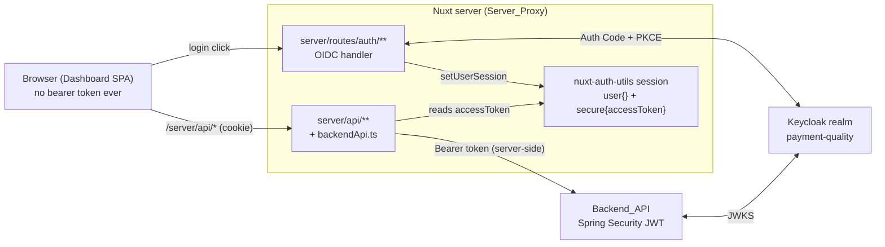
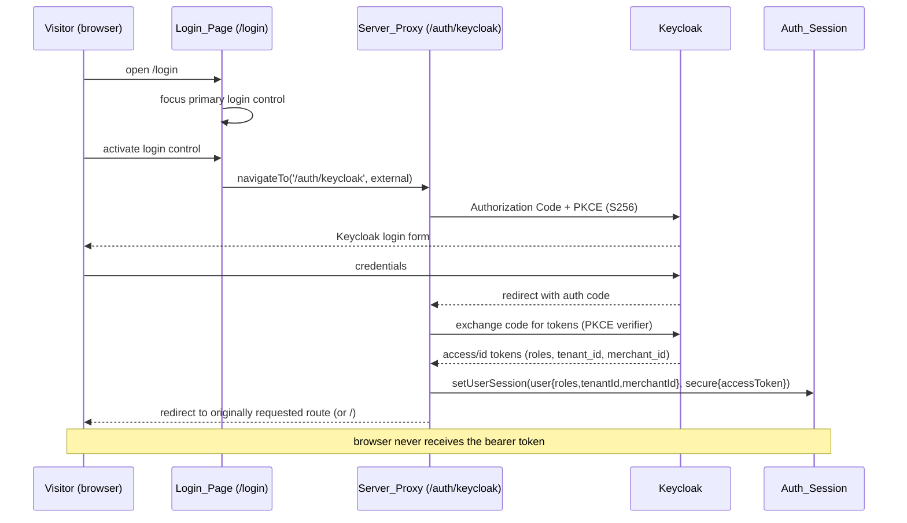
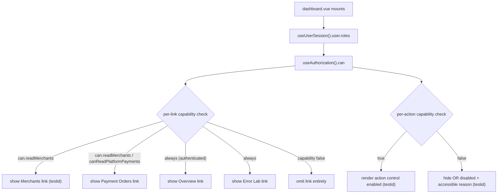
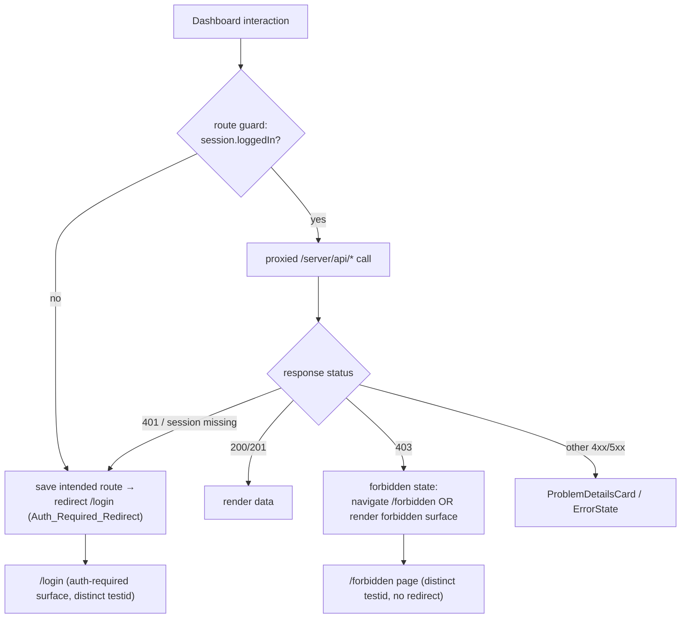

# Technical Design: IAM Roles and Keycloak Login

## Overview

This feature adds a realistic, multi-role IAM model and a real Keycloak OIDC login flow to the Payment Quality Engineering Lab. It is a **brownfield enhancement**: every change either adds a new artifact or extends an existing one. No REST contract, authority string, `@PreAuthorize` expression, or `SecurityFilterChain` rule changes.

The design rests on one backward-compatibility lever, verified against the source:

- The backend authorizes exclusively on **Fine_Grained_Authorities** (`platform:*`, `merchant:*`). These authorities are produced by `KeycloakRealmRoleConverter`, which maps each name in the JWT `realm_access.roles` claim to an authority using an **explicit allowlist** of the ten known raw realm roles. Unknown role names (including composite role display names such as `PLATFORM_ADMIN`) are **ignored** — they produce no authority. This is the result of the `backend-authority-refactor` spec (R2), which replaced the previous heuristic prefix rule with a fail-closed allowlist.
- Keycloak **composite roles** expand transitively: a token issued to the holder of a composite role carries, in `realm_access.roles`, the composite role name **plus every role it aggregates**. ([Keycloak composite roles](https://www.keycloak.org/docs/latest/server_admin/#_composite-roles); content rephrased for licensing compliance.)

Therefore, if we build the five named business roles as composite roles **over the existing ten raw realm roles**, the converter turns each holder's token into exactly the authority set the backend already enforces. The new composite-role names (`PLATFORM_ADMIN`, etc.) flow through the converter but are **ignored** (fail-closed) — they produce no authority. The resulting authority set is identical to what the backend authorizes on, so **no `@PreAuthorize` expression and no `SecurityFilterChain` rule changes**.

On the frontend, the design extends the existing `nuxt-auth-utils` session and the existing `auth.global.ts` guard rather than replacing them. The session is enriched server-side with a safe `user` object (`username`, `email`, `roles[]`, `tenantId`, `merchantId`) derived from the OIDC tokens. The bearer token stays in the `secure` partition of the server session and is **never** exposed to the browser. A new `useAuthorization` composable maps composite roles to capability booleans — a single client-side mirror of the backend RBAC matrix that drives role-aware navigation and action visibility. The backend remains the sole authoritative enforcement point.

The work splits into two cohesive areas:

1. **Keycloak realm** (`infra/keycloak/realms/payment-quality-realm.json`): add 5 composite roles, a `tenant_id` protocol mapper, 5 deterministic enabled test users, and `tenant_id` attributes on legacy users.
2. **Nuxt frontend** (`apps/frontend`): derive roles/tenant/merchant into the session, add the `useAuthorization` composable, make sidebar links and Overview sections role-aware, add a `/forbidden` page, distinguish 401-vs-403 surfaces in `auth.global.ts` and the proxy/`useApiClient` error path, preserve the originally requested route on redirect, and keep `Authorization` masked everywhere.

### Requirements Coverage Map

| Requirement | Where addressed |
|---|---|
| 1. Named composite roles | Architecture · Data Models (Realm) — composite role composition table |
| 2. RBAC backward compatibility | Architecture — backward-compat lever; Testing Strategy — backend suite unchanged |
| 3. Deterministic test users | Data Models (Realm) — Test User Catalog |
| 4. tenant_id claim | Architecture — protocol mapper; Data Models — token/claims |
| 5. OIDC login flow | Components — Server_Proxy, OIDC sequence diagram |
| 6. Logout | Components — auth store / logout flow |
| 7. 401 handling | Components — `auth.global.ts`, 401-vs-403 decision flow |
| 8. 403 handling & distinction | Components — `/forbidden` page, proxy 403 surfacing |
| 9. Role-aware navigation & actions | Components — `useAuthorization`, role-aware rendering diagram |
| 10. Accessibility & testability | Components — data-testid plan, accessibility rules |
| 11. Token confidentiality | Architecture — session split; Components — masking |

## Architecture

### System Context



The browser only ever talks to the Nuxt server. The bearer token lives only in the `secure` partition of the server session and is attached to backend calls server-side by `backendApi.ts`. This satisfies Requirements 5.3, 5.4, 11.2, and 11.3 at the architecture level.

### The Backward-Compatibility Lever (Requirements 1, 2)

The existing raw realm roles and their post-conversion authorities (verified against `KeycloakRealmRoleConverter`):

| Raw realm role (`realm_access.roles`) | Authority after conversion |
|---|---|
| `merchants:create` | `platform:merchants:create` |
| `merchants:read` | `platform:merchants:read` |
| `merchants:update-status` | `platform:merchants:update-status` |
| `merchant:payments:create` | `merchant:payments:create` |
| `merchant:payments:read` | `merchant:payments:read` |
| `merchant:payments:operate` | `merchant:payments:operate` |
| `merchant:payments:lifecycle` | `merchant:payments:lifecycle` |
| `platform:payments:read` | `platform:payments:read` |
| `platform:payments:lifecycle` | `platform:payments:lifecycle` |
| `platform:payments:audit` | `platform:payments:audit` |

The three `merchants:*` roles get the `platform:` prefix; everything else already starts with `merchant:`/`platform:` and passes through unchanged. **The converter uses an explicit allowlist** — the ten known raw roles are mapped to their documented authorities; any other name (including composite role display names) is ignored and produces no authority (Requirement 2.1).

Composite roles aggregate these raw roles. When Keycloak issues a token to a composite-role holder, `realm_access.roles` contains the composite name **and** all aggregated raw names. The converter maps the raw names to the documented authorities; the composite name itself is **not in the allowlist and is silently ignored** — it produces no authority at all. Because the resulting authority set is identical to what the backend already authorizes on, **no `@PreAuthorize` expression and no `SecurityFilterChain` rule changes** (Requirements 2.2, 2.3), and the existing backend security suite passes unchanged (Requirement 2.4).

### Composite Role Composition (Requirement 1.3–1.8)

Each composite role's aggregated raw roles and the resulting authority set:

| Composite role | Aggregated raw realm roles | Resulting Fine_Grained_Authorities |
|---|---|---|
| **PLATFORM_ADMIN** | `merchants:create`, `merchants:read`, `merchants:update-status`, `platform:payments:read`, `platform:payments:lifecycle`, `platform:payments:audit` | `platform:merchants:create`, `platform:merchants:read`, `platform:merchants:update-status`, `platform:payments:read`, `platform:payments:lifecycle`, `platform:payments:audit` |
| **TENANT_ADMIN** | `merchants:create`, `merchants:read`, `merchants:update-status`, `merchant:payments:read` | `platform:merchants:create`, `platform:merchants:read`, `platform:merchants:update-status`, `merchant:payments:read` |
| **MERCHANT_MANAGER** | `merchant:payments:create`, `merchant:payments:read`, `merchant:payments:lifecycle` | `merchant:payments:create`, `merchant:payments:read`, `merchant:payments:lifecycle` |
| **SUPPORT_AGENT** | `merchants:read`, `platform:payments:read`, `platform:payments:audit` | `platform:merchants:read`, `platform:payments:read`, `platform:payments:audit` |
| **READ_ONLY_USER** | `merchants:read`, `platform:payments:read` | `platform:merchants:read`, `platform:payments:read` |

SUPPORT_AGENT deliberately excludes any payment-create or lifecycle raw role (Requirement 1.7); READ_ONLY_USER excludes any create/update-status/lifecycle raw role (Requirement 1.8).

### tenant_id Claim (Requirement 4)

A second protocol mapper is added to the `payment-quality-dashboard` client, parallel to the existing `merchant-id-mapper`: an `oidc-usermodel-attribute-mapper` that maps the `tenant_id` user attribute into a `tenant_id` claim in the access token, ID token, and userinfo. Keycloak's attribute mapper omits the claim entirely when the user attribute is absent, which satisfies Requirement 4.4 (valid token, no claim) without extra configuration. The backend treats `tenant_id` as informational and applies no new authorization rule (Requirement 4.7) — confirmed by the fact that no filter-chain rule references it.

### Frontend Session Derivation & Confidentiality (Requirements 5.5, 11)

The OIDC `onSuccess` handler is extended to derive a safe `user` object from the OIDC `user` info and the decoded access-token claims, storing roles/tenant/merchant in the **non-secure** session partition (readable by the browser via `useUserSession`) and keeping the access token in `secure` (server-only). The browser obtains roles for rendering without ever seeing the token.

## Backward-Compatibility & Refactoring Decisions

The "supplement, don't replace" approach buys zero backend change, but it does so at the cost of some honest, conscious tradeoffs. This section names the real behavioral deltas against the current implementation (Part 1) and records the senior-level decisions that resolve or accept them for this spec (Part 2).

### Part 1 — Named discrepancies vs the current implementation

These are real deltas, accepted with eyes open rather than hidden.

- **(A) ~~Inert authorities~~ — RESOLVED by `backend-authority-refactor`.** Previously each composite role **name** (e.g. `PLATFORM_ADMIN`) would have passed through the old heuristic `KeycloakRealmRoleConverter` and become an unused `platform:PLATFORM_ADMIN` authority polluting the granted-authority set. The `backend-authority-refactor` spec (R2) replaced the heuristic prefix rule with an explicit allowlist — unknown role names, including composite display names, are now **ignored** (fail-closed) and produce no authority. Discrepancy A no longer applies. The action item (grep for exact-set tests) was executed as part of R2; `KeycloakRealmRoleConverterTest` (Properties 1–3) confirms the allowlist behavior. No impact on this spec's implementation — the outcome for composite-role holders is the same (correct authority set), just via a cleaner mechanism.

- **(B) `platform.operator` visibility change.** The existing `platform.operator` user holds **only** `merchants:*` authorities (no payments). Today the UI shows payment surfaces unconditionally (a click would 403 at the backend); after role-aware rendering, those payment sidebar links and actions will be **hidden** for an identity without payment-read capability. This is a UX improvement, but it is a real behavioral change and it affects existing Playwright specs that reuse the `platform.operator` storage state (e.g. `payment-orders-panel`). Resolved by **Decision 3** below.

- **(C) Two sources of truth for the RBAC matrix.** The matrix exists both as backend authorities and as the frontend `useAuthorization` capability map → drift risk. Mitigated by **Property 3** (the mirror is asserted against a single matrix definition), but the duplication is still real.

- **(D) Two role layers coexist in the realm.** By the "supplement" decision the realm now carries both the raw authority roles and the new composite roles; the realm becomes denser. This is intentional and accepted — it is what preserves the converter contract without backend edits.

### Part 2 — Senior-architect decisions (DECIDED for this spec)

1. **Token→authority contract clarity — DELIVERED by `backend-authority-refactor`.** The `backend-authority-refactor` spec (R2) implemented the explicit allowlist that was recorded here as a future optional hardening item. `KeycloakRealmRoleConverter` now uses a `Map<String, String>` allowlist of the ten known raw realm roles; unknown role names (including composite display names) are silently ignored and produce no authority. Discrepancy (A) no longer applies. The converter has full unit-test coverage (Properties 1–3 in `KeycloakRealmRoleConverterTest`) and the refactor is complete. **No further action needed in this spec.**

2. **Single source of truth for the RBAC matrix (no backend change).** The capability→authorities mapping is defined **once, as data** — a shared TS constant in the frontend (e.g. an `rbacMatrix` object) that both `useAuthorization` and its property test consume — so the matrix is data-driven rather than hand-maintained in prose plus code. **Property 3** asserts the `useAuthorization` mirror equals this single `rbacMatrix` definition, which is what keeps discrepancy (C) bounded.

3. **`platform.operator` continuity (resolves discrepancy B).** To avoid a silent regression in the existing `platform.operator` storage-state journeys, **assign `platform.operator` the `PLATFORM_ADMIN` composite role.** It already holds the three `merchants:*` raw roles; `PLATFORM_ADMIN` is the closest named superset and keeps platform-level visibility coherent. The existing raw-role assignment is **retained** for backward compatibility (the composite is additive). The backend authority outcome for `platform.operator` is therefore a **superset**: it additionally gains `platform:payments:read`, `platform:payments:lifecycle`, and `platform:payments:audit` via `PLATFORM_ADMIN`. This is **intentional** so the existing payment screens remain visible to that storage-state identity and the current Playwright specs keep passing. *Alternative (not chosen):* migrate future Playwright payment specs onto the new `merchant.manager`/`platform.admin` test users instead of widening `platform.operator`; recorded for the later learning lessons, but the primary decision is to assign `PLATFORM_ADMIN` to `platform.operator`.

4. **Forward note — tenant modeling.** Tenant modeling should use Keycloak **GROUPS** (group → `tenant_id` attribute + role mapping) rather than per-user attributes, in the follow-up spec `tenant-model-and-isolation`. This spec keeps per-user `tenant_id` attributes as the minimal step.

## Components and Interfaces

### OIDC Login Flow (Requirement 5)



On cancellation/failure Keycloak redirects to the OIDC handler's `onError`, which sends the visitor back to `/login?error=keycloak`; the Login_Page renders an authentication-failed message containing no token value (Requirement 5.6).

**Extended artifact — `server/routes/auth/keycloak.get.ts`:** `onSuccess` derives `roles[]` (from the decoded access token `realm_access.roles`, filtered to the five composite role names), `tenantId` (from the `tenant_id` claim), and `merchantId` (from `merchant_id`), and stores them under `user`. It reads a post-login redirect target captured at login start and redirects there, falling back to `/`.

```ts
// derived, non-secret — safe to expose to the browser
interface SessionUser {
  username: string
  email?: string
  roles: CompositeRole[]      // subset of the five composite role names
  tenantId?: string
  merchantId?: string
}
// nuxt-auth-utils session shape
// { user: SessionUser, secure: { accessToken: string }, loggedInAt: number }
```

### Authorization Composable (`app/composables/useAuthorization.ts`) — Requirement 9

A new composable is the **single client-side source of truth** mirroring the backend RBAC matrix. It reads `roles` from `useUserSession().user` and exposes capability booleans. It contains no token logic.

```ts
type CompositeRole =
  | 'PLATFORM_ADMIN' | 'TENANT_ADMIN' | 'MERCHANT_MANAGER'
  | 'SUPPORT_AGENT' | 'READ_ONLY_USER'

// Capability → set of composite roles that grant it (mirrors the RBAC matrix)
interface Capabilities {
  canCreateMerchant: boolean        // platform:merchants:create
  canReadMerchants: boolean         // platform:merchants:read
  canUpdateMerchantStatus: boolean  // platform:merchants:update-status
  canCreatePaymentOrder: boolean    // merchant:payments:create
  canReadMerchantPayments: boolean  // merchant:payments:read
  canReadPlatformPayments: boolean  // platform:payments:read
  canRunLifecycle: boolean          // *:payments:lifecycle
  canReadAudit: boolean             // platform:payments:audit
}

function useAuthorization(): {
  roles: ComputedRef<CompositeRole[]>
  can: ComputedRef<Capabilities>
  hasRole: (r: CompositeRole) => boolean
}
```

The capability map is derived from the same composition table above, so a capability is `true` iff at least one of the user's roles grants the corresponding authority. This keeps the frontend mirror provably aligned with the backend matrix (see Correctness Properties).

### Role-Aware Navigation Rendering (Requirement 9)



**Extended artifact — `app/layouts/dashboard.vue`:** the static `links` array becomes a `computed` filtered by capability booleans. Each role-gated link carries a stable `data-testid`. The `UDashboardSearch` `groups` are derived from the same filtered links so search stays in sync (Requirement 9.1). The Overview page (`app/pages/index.vue`) renders sections conditionally by capability (Requirement 9.2). Action controls hidden or disabled-with-reason use `useAuthorization` (Requirements 9.3, 9.5). Frontend gating is convenience only; the backend enforces and returns 403 when authority is absent (Requirement 9.4, 9.5).

### 401-vs-403 Decision Flow (Requirements 7, 8)



The two outcomes are surfaced by **distinct components with distinct `data-testid`s** and text-based meaning (Requirements 8.3, 8.4, 10.3): 401 → Auth_Required_Redirect to `/login`; 403 → `/forbidden` page that states "authenticated but not authorized," offers a return-to-Overview control, and never redirects to login (Requirements 8.1, 8.2, 8.5).

**Extended artifact — `app/middleware/auth.global.ts`:** when no session, capture `to.fullPath` (e.g. into a `redirectTo` query param or session-cookie value) before redirecting to `/login`, so the visitor returns post-login (Requirement 7.4). Logout-cleared sessions are treated as unauthenticated on the next protected-route access (Requirement 6.3).

### 403 Detection in the Proxy / API Client (Requirement 8.1)

`useApiClient` already returns `status` faithfully (verified) and never throws to callers. The design adds a thin **403/401 reaction layer** without changing the transport contract:

- A new `useAuthError` composable (or a small guard helper) inspects `ApiResponse.status` after each call. On `403` it routes to `/forbidden` (or sets a forbidden surface flag); on `401` it triggers the Auth_Required_Redirect to `/login`. All other statuses keep current behavior (`ProblemDetailsCard`/`ErrorState`), so existing screens are unaffected (Requirement 8 without breaking the proxy).
- `server/utils/backendApi.ts` already maps a missing access token to `401` and re-throws backend statuses (including `403`) unchanged. No change to its header-forwarding behavior is required; it never forwards the `Authorization` value to the browser (Requirement 11.3), which the design preserves.

### Logout (Requirement 6)

**Extended artifact — `app/stores/auth.ts`:** the existing `logout()` already calls `session.clear()` then `navigateTo('/login')` (Requirements 6.1, 6.2). The logout control gains a stable `data-testid` and a preserved focus ring (Requirement 10.6). No new store is added.

### Token Confidentiality in Panels (Requirement 11)

Any panel that renders request headers (e.g. `ApiDebugPanel`, `HeaderKeyValuePanel`) displays the `Authorization` header as the fixed Masked_Authorization placeholder `Bearer ••••••••` and never renders any portion of a real token (Requirements 11.1, 11.4). Because the token is server-only, captured client-side requests never contain it in the first place (Requirement 11.2).

### data-testid Plan (Requirements 7.5, 8.4, 9.6, 10.1)

| `data-testid` | Element | Surface |
|---|---|---|
| `login-control` | primary login `<button>` | Login_Page |
| `auth-required-surface` | root container | Login_Page / auth-required surface |
| `auth-error-message` | authentication-failed message | Login_Page (error case) |
| `forbidden-page` | root container | `/forbidden` |
| `forbidden-home-link` | return-to-Overview control | `/forbidden` |
| `logout-control` | logout `<button>` | dashboard footer menu |
| `nav-link-overview` / `nav-link-merchants` / `nav-link-payment-orders` / `nav-link-error-lab` | sidebar links | dashboard layout |
| `action-create-merchant` / `action-activate-merchant` / `action-suspend-merchant` | role-gated controls | merchants screens |
| `action-create-payment-order` / `action-lifecycle-*` | role-gated controls | payment screens |

Each id is stable (byte-identical across rebuilds) and resolves to exactly one element per page (Requirement 10.1).

### Accessibility (Requirement 10)

- Single semantic `<h1>` on Login_Page, `/forbidden`, and the auth-required surface (Requirement 10.2).
- Roles, authorization status, and auth status are conveyed in **text**, not color alone (Requirement 10.3).
- On Login_Page mount, keyboard focus moves to `login-control` (Requirement 10.4).
- Disabled action controls expose an accessible name/description explaining why they are disabled (Requirement 10.5).
- Visible focus rings preserved on login, logout, and forbidden-home controls (Requirement 10.6).

## Data Models

### Keycloak Realm Additions (`infra/keycloak/realms/payment-quality-realm.json`)

**Composite roles** — added under `roles.realm`, each with `"composite": true` and `"composites": { "realm": [ ...aggregated raw role names... ] }` per the composition table in Architecture. The ten raw roles are retained verbatim (Requirement 1.2, 1.9).

**Protocol mapper** — added to the `payment-quality-dashboard` client's `protocolMappers`, alongside the retained `merchant-id-mapper` (Requirement 4.2):

```json
{
  "name": "tenant-id-mapper",
  "protocol": "openid-connect",
  "protocolMapper": "oidc-usermodel-attribute-mapper",
  "consentRequired": false,
  "config": {
    "user.attribute": "tenant_id",
    "claim.name": "tenant_id",
    "jsonType.label": "String",
    "id.token.claim": "true",
    "access.token.claim": "true",
    "userinfo.token.claim": "true"
  }
}
```

**Test User Catalog** — five new enabled users, each assigned only its single composite role, with a fixed non-temporary password equal to the username for determinism (Requirement 3):

| Username | Password | Composite role | `merchant_id` | `tenant_id` |
|---|---|---|---|---|
| `platform.admin` | `platform.admin` | PLATFORM_ADMIN | (none) | `PLATFORM_TENANT` |
| `tenant.admin` | `tenant.admin` | TENANT_ADMIN | (none) | `TENANT_ALPHA` |
| `merchant.manager` | `merchant.manager` | MERCHANT_MANAGER | `MERCHANT_ALPHA_001` | `TENANT_ALPHA` |
| `support.agent` | `support.agent` | SUPPORT_AGENT | (none) | `PLATFORM_TENANT` |
| `readonly.user` | `readonly.user` | READ_ONLY_USER | (none) | `TENANT_ALPHA` |

The deterministic `merchant_id` literal for the merchant-scoped role is finalized here as **`MERCHANT_ALPHA_001`** (Requirement 3.5).

**Legacy users** — retained without deletion. The placeholder/legacy users carrying `merchant_id: PLACEHOLDER_MERCHANT_ID` (and other legacy users without a deterministic tenant) receive `tenant_id: PLACEHOLDER_TENANT_ID` (Requirements 3.6, 4.5). Their enabled/disabled state and roles are otherwise unchanged, with one deliberate exception: per **Decision 3**, the existing `platform.operator` user is **additionally** granted the `PLATFORM_ADMIN` composite role while **retaining** its existing `merchants:*` raw-role assignment. This is additive — `platform.operator` keeps its current authorities and gains the `PLATFORM_ADMIN` superset (`platform:payments:read`/`lifecycle`/`audit`) so its existing payment screens stay visible under role-aware rendering.

### Token Claim Model

A composite-role holder's access token carries:

```
realm_access.roles = [ "<COMPOSITE_NAME>", <aggregated raw role names...> ]
merchant_id        = <attribute>      // present only if set
tenant_id          = <attribute>      // present only if set (Req 4.3, 4.4)
```

After `KeycloakRealmRoleConverter`, authorities = mapped aggregated raw roles only. Composite role display names in `realm_access.roles` are ignored by the allowlist and produce no authority.

### Frontend Session Model

`SessionUser` (browser-readable) and `secure.accessToken` (server-only) as defined in Components. `roles[]` is the intersection of `realm_access.roles` with the five composite names, so the client mirror is driven only by business roles, not raw roles.

## Correctness Properties

*A property is a characteristic or behavior that should hold true across all valid executions of a system — essentially, a formal statement about what the system should do. Properties serve as the bridge between human-readable specifications and machine-verifiable correctness guarantees.*

The acceptance criteria were classified in prework. Many criteria are configuration presence checks (SMOKE), Keycloak/IdP behavior or backend enforcement (INTEGRATION — covered by the unchanged backend security suite and future E2E), or single UI render assertions (EXAMPLE). The criteria that express **universal, input-varying logic in our own code** become the properties below. Redundant criteria were consolidated during property reflection (e.g. Requirements 1.3–1.8/2.2 collapse into Property 1; Requirements 9.1/9.2/9.3/9.7 collapse into Property 4).

### Property 1: Composite role conversion yields exactly the documented authority set

*For any* composite role among the five named roles, expanding it to its aggregated raw realm roles and applying the `KeycloakRealmRoleConverter` allowlist produces exactly the documented Fine_Grained_Authority set for that role — no missing and no extra business authority — and for SUPPORT_AGENT and READ_ONLY_USER the result contains none of the excluded authorities (no payment-create and no lifecycle for SUPPORT_AGENT; no create, update-status, or lifecycle for READ_ONLY_USER). The composite role display name itself is not in the allowlist and produces no authority.

**Validates: Requirements 1.3, 1.4, 1.5, 1.6, 1.7, 1.8, 2.2**

### Property 2: Realm test-user invariants hold across all new test users

*For any* of the five new deterministic test users in the parsed realm import, the user is enabled, has exactly one assigned realm role which is one of the five composite role names, has no raw Realm_Authority_Role assigned directly, carries a non-temporary password credential, and carries the `tenant_id` attribute value recorded in the Test User Catalog; and the merchant-scoped test user additionally carries its deterministic `merchant_id` attribute.

**Validates: Requirements 3.1, 3.2, 3.3, 3.4, 3.5, 4.6**

### Property 3: Role-to-capability mapping matches the RBAC matrix

*For any* set of composite roles, the capability booleans returned by `useAuthorization` are true exactly for the capabilities granted by the union of those roles' Fine_Grained_Authorities according to the RBAC access matrix — equivalently, a capability is true if and only if at least one held role grants the corresponding authority.

**Validates: Requirements 2.5, 9.3**

### Property 4: Role-aware rendering follows capabilities for the current session roles

*For any* set of composite roles in the current Auth_Session, the set of rendered role-gated surfaces (sidebar links, Overview sections, and enabled action controls) equals exactly the set whose governing capability is granted by `useAuthorization` for those roles; surfaces whose capability is not granted are omitted or rendered disabled, and the rendering is a pure function of the current session roles.

**Validates: Requirements 9.1, 9.2, 9.3, 9.7**

### Property 5: 401-versus-403 reaction mapping is deterministic and disjoint

*For any* HTTP status returned by a proxied Backend_API call, the Dashboard reaction is determined solely by the status: a 401 (or missing/expired session) yields the Auth_Required_Redirect to the Login_Page; a 403 yields the Forbidden surface and never a redirect to the Login_Page; any other status yields neither the Auth_Required_Redirect nor the Forbidden surface. The 401 and 403 reactions are mutually exclusive for every status.

**Validates: Requirements 7.2, 7.3, 8.1, 8.2**

### Property 6: No bearer token in any browser-exposed state

*For any* OIDC token set used to establish a session, the browser-exposed `SessionUser` object (and any state derived from it for rendering, including the Forbidden_Page) contains no field holding, and no value equal to or containing, the bearer access token.

**Validates: Requirements 5.3, 8.6, 11.2**

### Property 7: Authorization header is always masked when displayed

*For any* request-headers object that contains an `Authorization` value, the header representation prepared for any learning/debug panel renders the fixed Masked_Authorization placeholder and contains no substring of the original token value.

**Validates: Requirements 11.1, 11.4**

### Property 8: Redirect target round-trips through the Auth_Required_Redirect

*For any* protected route path, capturing it as the post-login redirect target during the Auth_Required_Redirect and then restoring it after a successful login returns the original path, so the visitor lands back on the originally requested route.

**Validates: Requirements 7.4**

### Property 9: Derived session roles equal the composite-name intersection

*For any* `realm_access.roles` array in the issued token, the `roles` array placed on the browser-exposed `SessionUser` equals the intersection of that array with the five composite role names — raw realm roles are excluded from the client-facing role list (they are the raw building blocks, not the business role labels), and composite display names that the converter ignores at the authority level are still the correct labels for the session role list.

**Validates: Requirements 5.5**

### Property 10: Forwarded response headers never include Authorization

*For any* set of response headers received from the Backend_API, the headers forwarded by the Server_Proxy to the browser are a subset of the fixed allow-list (`ETag`, `Cache-Control`, `Vary`, `X-Correlation-ID`, `Location`, `Accept-Patch`, `Allow`) and never include the `Authorization` header or the bearer token.

**Validates: Requirements 11.3**

> **Integration-shaped expectation (not a unit property):** the `tenant_id` claim is present in an issued token **if and only if** the user has a `tenant_id` attribute, and a token issued for a user without that attribute is still valid (Requirements 4.3, 4.4). This is Keycloak token-issuance behavior and is verified at the integration/import level rather than by a property-based unit test.

## Error Handling

| Condition | Detection point | Handling | Requirement |
|---|---|---|---|
| OIDC login fails or is cancelled | OIDC handler `onError` | Redirect to `/login?error=keycloak`; Login_Page shows an authentication-failed message with no token value | 5.6 |
| No session on protected route | `auth.global.ts` | Capture intended route, apply Auth_Required_Redirect to `/login` | 7.1, 7.4 |
| Missing/expired access token at proxy | `backendApi.ts` (already throws 401) | `useApiClient` surfaces status 401; reaction layer triggers Auth_Required_Redirect | 7.2 |
| Backend returns 401 | `useApiClient` status | Auth-required state (redirect to `/login`), distinct from forbidden | 7.3 |
| Backend returns 403 | `useApiClient` status | Forbidden surface / navigate to `/forbidden`; no login redirect | 8.1, 8.2 |
| Logout | `auth.ts` `logout()` | Clear session, navigate to `/login`; subsequent protected access redirects | 6.1, 6.2, 6.3 |
| Schema validation failure (existing) | `useApiClient` | Existing `ProblemDetails` "Response Validation Error" path — unchanged | (existing behavior preserved) |
| Other 4xx/5xx (existing) | `useApiClient` | Existing `ProblemDetailsCard` / `ErrorState` path — unchanged | (existing behavior preserved) |
| Keycloak realm import error | Keycloak startup | Surfaced by Keycloak import logs; verified during infra bring-up | 1.9 |

Token confidentiality is preserved on every error surface: no error message, panel, or forwarded header includes a token value (Requirements 8.6, 11.1–11.4).

## Testing Strategy

This strategy follows the workspace testing-strategy steering: choose the narrowest layer that proves the behavior, keep the backend security suite green, and do **not** create any Playwright files in this spec.

### Backend — unchanged and must stay green

- No backend source changes are made; therefore the existing security tests under `apps/backend/src/test/java/lab/paymentquality/security/` (using `TestJwtConfiguration`) and the architecture/module tests must continue to pass without modification (Requirements 2.1, 2.3, 2.4, 4.7).
- Verification commands (from `apps/backend`): `./mvnw test` (Surefire `*Test.java`) and `./mvnw verify` (Failsafe `*IT.java`).
- Optional additive backend coverage (only if the team wants explicit composite-role evidence): a `*Test.java` in `security/` that mints, via `TestJwtConfiguration`, a JWT whose `realm_access.roles` contains a composite name plus its aggregated raw roles, and asserts the resulting authorities equal the documented set and that existing endpoint rules accept/deny accordingly. This adds tests; it does not modify existing ones.
- **Converter allowlist (discrepancy A — RESOLVED):** the `backend-authority-refactor` spec delivered the explicit allowlist on `KeycloakRealmRoleConverter`. `KeycloakRealmRoleConverterTest` (Properties 1–3) covers the known-role mapping, unknown-role ignore, and malformed-claim guards. No existing security test was weakened. The action item from the previous version of this design (grep for exact-set tests) was completed as part of that spec — all existing security tests remain green. No additional backend test changes are needed here.

### Realm import — config assertions and one-shot smoke

- Lightweight assertions over the parsed `payment-quality-realm.json` cover the configuration invariants (Properties 1 and 2): five composite roles present and correctly composed, ten raw roles retained, `tenant-id-mapper` present and `merchant-id-mapper` unchanged, the five enabled single-composite-role test users with deterministic credentials and attributes, and `PLACEHOLDER_TENANT_ID` on placeholder users. These can live as a JSON-shape test in the frontend or backend test tree, or as a CI lint step.
- A one-shot import smoke check (manual or CI) confirms the realm imports without error and exposes the roles (Requirement 1.9), and — at integration level — that issued tokens carry `tenant_id` iff the attribute is set (Requirements 4.3, 4.4).

### Frontend — property tests with Vitest + fast-check

The repo already uses Vitest + fast-check with the Nuxt test environment and a `*.property.test.ts` convention (see `app/composables/useApiClient.property.test.ts`). Future property tests for this feature follow the same pattern, run ≥100 iterations, and carry a tag comment.

- **Location:** colocated `*.property.test.ts` files next to the unit under test:
  - `app/composables/useAuthorization.property.test.ts` → Property 3 (role→capability matches the RBAC matrix) and Property 9 (derived roles = composite-name intersection). Generators: arbitrary subsets of the five composite role names; oracle: the composition/RBAC matrix encoded as data.
  - `app/composables/useAuthError.property.test.ts` (or wherever the status→reaction logic lives) → Property 5 (401-vs-403 reaction mapping) using an arbitrary over the backend status set, and Property 8 (redirect-target round trip) using arbitrary protected paths.
  - A masking util test → Property 7 (Authorization always masked) and a session-derivation test → Property 6 (no token in browser-exposed `SessionUser`) and Property 10 (forwarded-header allow-list excludes Authorization), generating arbitrary header maps / claim sets.
- **Tag format (required):** `// Feature: iam-roles-and-keycloak-login, Property {n}: {property text}`.
- **Configuration:** `fc.assert(fc.property(...), { numRuns: 100 })` minimum, matching the existing file.

### Frontend — example/component tests

Single-instance render and accessibility assertions (Vitest + the Nuxt test environment / component testing) cover the EXAMPLE-classified criteria: each required `data-testid` resolves to exactly one element (10.1), exactly one `<h1>` per surface (10.2), text-based status labels (10.3), focus moves to the login control (10.4), disabled controls expose an accessible explanation (10.5), the 401 and 403 surfaces have distinct root test ids (8.3, 8.4), and the Forbidden_Page exposes a working return-to-Overview control (8.5).

### Future Playwright scenarios — CONCEPTUAL ONLY (no files created here)

These are recorded so the later learning lessons can be written; this spec creates **no** Playwright files. They will use the existing storage-state auth setup pattern, one storage state per composite role:

- **Existing-spec impact note (discrepancy B, conceptual only — no Playwright files changed here):** role-aware rendering hides payment surfaces for identities without payment-read capability. Per **Decision 3**, `platform.operator` is granted the `PLATFORM_ADMIN` composite specifically so existing specs that reuse the `platform.operator` storage state (e.g. `payment-orders-panel`) keep seeing payment surfaces and continue to pass. If a later decision instead migrates those specs to the new `merchant.manager`/`platform.admin` test users, that migration would be a separate, explicit change.

- **Multi-role storage state:** generate `tests/.auth/{role}.json` for each of the five test users via the OIDC login flow, reused across specs.
- **RBAC matrix walk:** for each role, assert the allowed/denied operations from the RBAC matrix surface correctly (allowed actions visible/usable, denied actions hidden or 403).
- **401-vs-403 distinction:** unauthenticated access redirects to `/login` (auth-required surface testid); an authenticated-but-unauthorized action lands on `/forbidden` (forbidden testid) with no login redirect.
- **Permission-based rendering:** per role, assert the exact set of visible sidebar links and Overview sections via stable test ids.
- **Token confidentiality:** scan DOM, HTML attributes, and browser storage for the absence of any bearer token, and assert any displayed `Authorization` header shows only the mask.
- **Login focus & accessibility:** assert focus on the login control and single-`h1` semantics on each surface.

### Coverage summary

| Property | Layer | Where |
|---|---|---|
| P1 conversion → authorities | Vitest property (+ optional backend `*Test.java`) | realm-shape / security test |
| P2 realm test-user invariants | Config assertion | realm-shape test / CI lint |
| P3 role→capability | Vitest + fast-check | `useAuthorization.property.test.ts` |
| P4 role-aware rendering | Vitest + fast-check / component | composable + component tests |
| P5 401-vs-403 reaction | Vitest + fast-check | `useAuthError.property.test.ts` |
| P6 no token client-side | Vitest + fast-check / future E2E | session-derivation test + E2E scan |
| P7 Authorization masking | Vitest + fast-check | masking util test |
| P8 redirect round trip | Vitest + fast-check | guard/redirect test |
| P9 roles = composite intersection | Vitest + fast-check | session-derivation test |
| P10 forwarded-header allow-list | Vitest + fast-check | proxy-forward test |
| tenant_id claim iff attribute | Integration/import smoke | infra bring-up |
| Backend enforcement (9.4, 9.5) | Existing backend suite | `security/` (unchanged) |
