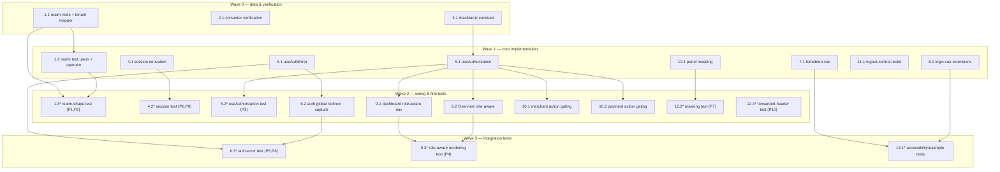

# Implementation Plan: IAM Roles and Keycloak Login

## Overview

This plan implements a brownfield, multi-role IAM model and a real Keycloak OIDC login flow by **extending** existing artifacts and **adding** a small number of new ones. There are **no backend Java source changes and no REST contract/authority changes**: `KeycloakRealmRoleConverter` uses an explicit allowlist (delivered by `backend-authority-refactor`) and `SecurityConfig`/`SecurityFilterChain` stay unchanged. Composite role display names are ignored (fail-closed) by the converter — they produce no authority.

Implementation language: **TypeScript 6 / Vue (Nuxt 4)** for the Dashboard, **JSON** for the Keycloak realm import. Property-based tests use **Vitest + fast-check** at `numRuns: 100` minimum, are colocated as `*.property.test.ts`, and carry the tag `// Feature: iam-roles-and-keycloak-login, Property {n}: ...`. Every test sub-task is optional (`*`) and is excluded from MVP cut.

No Playwright files of any kind are created here — Playwright coverage is conceptual only (recorded in design Testing Strategy) and is written later by the user.

## Tasks

- [ ] 1. Keycloak realm: composite roles, tenant mapper, test users
  - [ ] 1.1 Add composite roles and tenant-id protocol mapper
    - EXTEND `infra/keycloak/realms/payment-quality-realm.json`
    - Under `roles.realm`, add the 5 composite roles `PLATFORM_ADMIN`, `TENANT_ADMIN`, `MERCHANT_MANAGER`, `SUPPORT_AGENT`, `READ_ONLY_USER`, each `"composite": true` with `"composites": { "realm": [...] }` exactly per the design "Composite Role Composition" table; retain all 10 raw Realm_Authority_Roles verbatim
    - Add the `tenant-id-mapper` (`oidc-usermodel-attribute-mapper`, `user.attribute`/`claim.name` = `tenant_id`, claim in access + id + userinfo) to the `payment-quality-dashboard` client `protocolMappers`, alongside the unchanged `merchant-id-mapper`
    - _Design: Data Models → Keycloak Realm Additions; Architecture → Composite Role Composition, tenant_id Claim_
    - _Requirements: 1.1, 1.2, 1.3, 1.4, 1.5, 1.6, 1.7, 1.8, 4.1, 4.2_

  - [ ] 1.2 Add deterministic test users and legacy/operator attributes
    - EXTEND `infra/keycloak/realms/payment-quality-realm.json` (same file as 1.1 — sequenced in a later wave)
    - Add the 5 enabled test users from the Test User Catalog (`platform.admin`, `tenant.admin`, `merchant.manager`, `support.agent`, `readonly.user`), each with a non-temporary password equal to its username, assigned **only** its single composite role (no raw role assigned directly), with `tenant_id` per catalog and `merchant_id = MERCHANT_ALPHA_001` on `merchant.manager`
    - Set `tenant_id = PLACEHOLDER_TENANT_ID` on retained legacy users carrying `merchant_id = PLACEHOLDER_MERCHANT_ID`; leave their enabled state and roles otherwise unchanged
    - Per Decision 3, ADD the `PLATFORM_ADMIN` composite role to the existing `platform.operator` user while RETAINING its existing `merchants:*` raw-role assignments (additive widening)
    - _Design: Data Models → Test User Catalog, Legacy users; Backward-Compatibility & Refactoring Decisions → Decision 3_
    - _Requirements: 3.1, 3.2, 3.3, 3.4, 3.5, 3.6, 4.5, 4.6_

  - [ ]* 1.3 Write realm-shape config assertion property tests
    - NEW `apps/frontend/tests/unit/realm/realm-shape.property.test.ts` (parses the realm JSON; matches the `tests/unit/**` Vitest include)
    - **Property 1: Composite role conversion yields exactly the documented authority set** — for any of the 5 composite roles, expand `composites.realm` and apply the converter rule (prefix `platform:` unless already `merchant:`/`platform:`); assert the business-authority set equals the documented set, and that SUPPORT_AGENT/READ_ONLY_USER contain none of the excluded authorities
    - **Property 2: Realm test-user invariants hold across all new test users** — for any of the 5 new users: enabled, exactly one realm role (a composite name), no raw role assigned directly, non-temporary password credential, `tenant_id` per catalog, and `merchant_id` on the merchant-scoped user
    - **Validates: Requirements 1.3–1.8, 2.2 (P1); 3.1–3.5, 4.6 (P2)**
    - Include a documented manual/CI import-smoke note: load the realm into Keycloak once and confirm it imports without error and exposes the 5 composite + 10 raw roles (Requirement 1.9) — recorded as a verification note, not an automated assertion
    - _Design: Testing Strategy → Realm import; Correctness Properties → Property 1, Property 2_

- [x] 2. Backend converter verification (discrepancy A — RESOLVED by `backend-authority-refactor`)
  - [x] 2.1 Confirm no exact-set converter test is impacted
    - COMPLETED — `backend-authority-refactor` spec delivered the explicit allowlist on `KeycloakRealmRoleConverter`
    - `KeycloakRealmRoleConverterTest` (Properties 1–3) covers known-role mapping, unknown-role ignore (fail-closed), and malformed-claim guards; all 266 backend tests pass
    - Discrepancy A is resolved: composite role names produce no authority (not inert `platform:<NAME>`)
    - _Design: Backward-Compatibility & Refactoring Decisions → Part 1 (A) — RESOLVED, Decision 1 — DELIVERED_
    - _Requirements: 2.1, 2.3, 2.4_

- [ ] 3. Shared RBAC matrix as data
  - [ ] 3.1 Create the single-source `rbacMatrix` constant
    - NEW `apps/frontend/app/utils/rbacMatrix.ts`
    - Define the `CompositeRole` union and a data-only `rbacMatrix` mapping each capability (`canCreateMerchant`, `canReadMerchants`, `canUpdateMerchantStatus`, `canCreatePaymentOrder`, `canReadMerchantPayments`, `canReadPlatformPayments`, `canRunLifecycle`, `canReadAudit`) to the set of composite roles that grant it, derived from the design composition table (Decision 2 — single source of truth consumed by `useAuthorization` and its property test)
    - _Design: Backward-Compatibility & Refactoring Decisions → Decision 2; Components → Authorization Composable_
    - _Requirements: 2.5_

- [ ] 4. Session role/tenant/merchant derivation
  - [ ] 4.1 Derive SessionUser into the auth session
    - EXTEND `apps/frontend/server/routes/auth/keycloak.get.ts`
    - In `onSuccess`, derive `SessionUser { username, email?, roles[], tenantId?, merchantId? }` and store it in the **non-secure** session partition; keep `accessToken` in `secure` (server-only); set `roles[]` to the intersection of decoded `realm_access.roles` with the five composite names; read the captured post-login redirect target and redirect there, falling back to `/`
    - _Design: Components → OIDC Login Flow, Frontend Session Derivation & Confidentiality; Data Models → Frontend Session Model_
    - _Requirements: 5.2, 5.3, 5.5_

  - [ ]* 4.2 Write session-derivation property tests
    - NEW `apps/frontend/server/routes/auth/keycloak.property.test.ts` (or a colocated helper test if derivation is extracted into a util)
    - **Property 9: Derived session roles equal the composite-name intersection** — for any `realm_access.roles` array, derived `roles` equals the intersection with the five composite names (raw roles and inert composite-name authorities never leak)
    - **Property 6: No bearer token in any browser-exposed state** — for any OIDC token set, the browser-exposed `SessionUser` (and anything derived from it) contains no field holding or value containing the access token
    - **Validates: Requirements 5.5 (P9); 5.3, 8.6, 11.2 (P6)**
    - _Design: Correctness Properties → Property 9, Property 6; Testing Strategy → session-derivation test_

- [ ] 5. Authorization composable
  - [ ] 5.1 Implement `useAuthorization`
    - NEW `apps/frontend/app/composables/useAuthorization.ts`
    - Read `roles` from `useUserSession().user`; derive capability booleans purely from `rbacMatrix` (a capability is true iff at least one held role grants it); expose `roles`, `can`, and `hasRole`; contain no token logic
    - _Design: Components → Authorization Composable_
    - _Requirements: 9.3_

  - [ ]* 5.2 Write `useAuthorization` property test
    - NEW `apps/frontend/app/composables/useAuthorization.property.test.ts`
    - **Property 3: Role-to-capability mapping matches the RBAC matrix** — for any subset of the five composite roles, each capability boolean is true iff at least one held role grants the corresponding authority per `rbacMatrix`
    - **Validates: Requirements 2.5, 9.3**
    - _Design: Correctness Properties → Property 3; Testing Strategy → useAuthorization.property.test.ts_

- [ ] 6. 401-vs-403 reaction layer
  - [ ] 6.1 Create the auth-error reaction composable
    - NEW `apps/frontend/app/composables/useAuthError.ts`
    - Inspect `ApiResponse.status` after a proxied call: `401` (or missing/expired session) → trigger Auth_Required_Redirect to `/login`; `403` → route to `/forbidden` (or set a forbidden surface flag) and never redirect to login; all other statuses → unchanged behavior. Reactions are deterministic and mutually exclusive
    - _Design: Components → 401-vs-403 Decision Flow, 403 Detection in the Proxy / API Client_
    - _Requirements: 7.3, 8.1, 8.2_

  - [ ] 6.2 Capture intended route and distinguish 401 in the global guard
    - EXTEND `apps/frontend/app/middleware/auth.global.ts`
    - When no session, capture `to.fullPath` (e.g. `redirectTo` query param or session-cookie value) before redirecting to `/login`; treat logout-cleared sessions as unauthenticated on next protected-route access; keep the redirect distinct from the 403 forbidden surface
    - _Design: Components → 401-vs-403 Decision Flow (auth.global.ts)_
    - _Requirements: 6.3, 7.1, 7.2, 7.4_

  - [ ]* 6.3 Write auth-error reaction property tests
    - NEW `apps/frontend/app/composables/useAuthError.property.test.ts`
    - **Property 5: 401-vs-403 reaction mapping is deterministic and disjoint** — for any HTTP status, 401/session-missing → Auth_Required_Redirect; 403 → Forbidden surface, never a login redirect; any other → neither; 401 and 403 reactions are mutually exclusive
    - **Property 8: Redirect target round-trips through the Auth_Required_Redirect** — for any protected path, capturing it as the post-login target then restoring it after login returns the original path
    - **Validates: Requirements 7.2, 7.3, 8.1, 8.2 (P5); 7.4 (P8)**
    - _Design: Correctness Properties → Property 5, Property 8_

- [ ] 7. Forbidden page (403 surface)
  - [ ] 7.1 Create the `/forbidden` page
    - NEW `apps/frontend/app/pages/forbidden.vue`
    - Single semantic `<h1>`; root container `data-testid="forbidden-page"`; text (not color) stating the user is authenticated but not authorized and that it does not redirect to login; a return-to-Overview control `data-testid="forbidden-home-link"` with a preserved focus ring; render any `Authorization` header as Masked_Authorization
    - _Design: Components → 401-vs-403 Decision Flow, data-testid Plan, Accessibility_
    - _Requirements: 8.2, 8.3, 8.4, 8.5, 8.6, 10.2, 10.3, 10.6_

- [ ] 8. Login page extensions
  - [ ] 8.1 Extend the login page surfaces
    - EXTEND `apps/frontend/app/pages/login.vue`
    - Add `data-testid="login-control"` (primary login button), `data-testid="auth-required-surface"` (root container), and `data-testid="auth-error-message"` (auth-failed message shown on `?error=keycloak`, containing no token value); move keyboard focus to the login control on mount; single semantic `<h1>`; preserve the login control focus ring
    - _Design: Components → OIDC Login Flow, data-testid Plan, Accessibility_
    - _Requirements: 5.6, 7.5, 10.2, 10.3, 10.4, 10.6_

- [ ] 9. Role-aware navigation and Overview
  - [ ] 9.1 Make sidebar links and search role-aware
    - EXTEND `apps/frontend/app/layouts/dashboard.vue`
    - Convert the static `links` array to a `computed` filtered by `useAuthorization().can`; derive `UDashboardSearch` `groups` from the same filtered links; add stable `data-testid` `nav-link-overview` / `nav-link-merchants` / `nav-link-payment-orders` / `nav-link-error-lab`; omit links whose capability is not granted
    - _Design: Components → Role-Aware Navigation Rendering, data-testid Plan_
    - _Requirements: 9.1, 9.6, 9.7_

  - [ ] 9.2 Make the Overview page role-aware
    - EXTEND `apps/frontend/app/pages/index.vue`
    - Render only the Overview content sections whose governing capability is granted by `useAuthorization`; rendering is a pure function of current session roles
    - _Design: Components → Role-Aware Navigation Rendering_
    - _Requirements: 9.2, 9.7_

  - [ ]* 9.3 Write role-aware rendering property/component test
    - NEW `apps/frontend/tests/unit/navigation/role-aware-rendering.property.test.ts`
    - **Property 4: Role-aware rendering follows capabilities for the current session roles** — for any subset of composite roles, the set of rendered role-gated surfaces (sidebar links, Overview sections, enabled action controls) equals exactly the set whose capability is granted; ungranted surfaces are omitted or disabled
    - **Validates: Requirements 9.1, 9.2, 9.3, 9.7**
    - _Design: Correctness Properties → Property 4_

- [ ] 10. Role-gated action visibility
  - [ ] 10.1 Gate merchant action controls
    - EXTEND `apps/frontend/app/components/merchant/MerchantTable.vue` and `apps/frontend/app/components/merchant/CreateMerchantForm.vue`
    - Use `useAuthorization` to hide, or disable-with-accessible-reason, the create/activate/suspend controls; add stable `data-testid` `action-create-merchant` / `action-activate-merchant` / `action-suspend-merchant`; backend remains authoritative (frontend gating is convenience only)
    - _Design: Components → Role-Aware Navigation Rendering, data-testid Plan, Accessibility_
    - _Requirements: 9.3, 9.4, 9.5, 9.6, 10.5_

  - [ ] 10.2 Gate payment action controls
    - EXTEND `apps/frontend/app/components/payment/CreatePaymentOrderForm.vue` and `apps/frontend/app/components/shared/PaymentOrderLifecycleActions.vue`
    - Use `useAuthorization` to hide or disable-with-accessible-reason the create and lifecycle controls; add stable `data-testid` `action-create-payment-order` and `action-lifecycle-*`; backend remains authoritative
    - _Design: Components → Role-Aware Navigation Rendering, data-testid Plan, Accessibility_
    - _Requirements: 9.3, 9.4, 9.5, 9.6, 10.5_

- [ ] 11. Logout control testability
  - [ ] 11.1 Add logout control testid and focus ring
    - EXTEND `apps/frontend/app/components/AppUserMenu.vue` (and confirm `apps/frontend/app/stores/auth.ts` `logout()` already clears the session then navigates to `/login` — no new store)
    - Add `data-testid="logout-control"` to the logout button; preserve its visible focus ring
    - _Design: Components → Logout, data-testid Plan, Accessibility_
    - _Requirements: 6.1, 6.2, 10.6_

- [ ] 12. Token confidentiality confirmation
  - [ ] 12.1 Confirm Authorization masking in panels
    - EXTEND/verify `apps/frontend/app/components/shared/ApiDebugPanel.vue` and `apps/frontend/app/components/shared/HeaderKeyValuePanel.vue`
    - Ensure any rendered `Authorization` header value is the fixed `Bearer ••••••••` placeholder and no portion of a real token is rendered
    - _Design: Components → Token Confidentiality in Panels_
    - _Requirements: 11.1, 11.4_

  - [ ]* 12.2 Write Authorization-masking property test
    - NEW `apps/frontend/tests/unit/security/authorization-masking.property.test.ts`
    - **Property 7: Authorization header is always masked when displayed** — for any request-headers object containing an `Authorization` value, the panel representation renders the fixed mask and contains no substring of the original token
    - **Validates: Requirements 11.1, 11.4**
    - _Design: Correctness Properties → Property 7_

  - [ ]* 12.3 Write forwarded-header allow-list property test (verify-only)
    - NEW `apps/frontend/tests/unit/security/forwarded-headers.property.test.ts` (asserts existing `server/utils/backendApi.ts` behavior; no behavior change)
    - **Property 10: Forwarded response headers never include Authorization** — for any backend response-headers set, the forwarded headers are a subset of `ETag`, `Cache-Control`, `Vary`, `X-Correlation-ID`, `Location`, `Accept-Patch`, `Allow` and never include `Authorization` or the bearer token
    - **Validates: Requirements 11.3**
    - _Design: Correctness Properties → Property 10; Components → 403 Detection in the Proxy / API Client_

- [ ] 13. Accessibility and example component tests
  - [ ]* 13.1 Write example/accessibility component tests for auth surfaces
    - NEW colocated component tests for `login.vue` and `forbidden.vue` (e.g. `apps/frontend/tests/unit/auth/auth-surfaces.test.ts`)
    - Assert each required `data-testid` resolves to exactly one element (10.1); exactly one `<h1>` per surface (10.2); text-based status labels (10.3); focus moves to `login-control` on Login_Page mount (10.4); disabled action controls expose an accessible explanation (10.5); the 401 (`auth-required-surface`) and 403 (`forbidden-page`) roots have distinct test ids (8.3, 8.4); the Forbidden_Page return-to-Overview control works (8.5)
    - _Design: Testing Strategy → Frontend example/component tests; data-testid Plan; Accessibility_
    - _Requirements: 8.3, 8.4, 8.5, 10.1, 10.2, 10.3, 10.4, 10.5, 10.6_

- [ ] 14. Final checkpoint
  - Ensure all tests pass, ask the user if questions arise.
  - From `apps/frontend`: run `corepack pnpm typecheck` and `corepack pnpm test:unit`.
  - From `apps/backend`: confirm the existing security suite remains green with `./mvnw test` (no backend changes were made).
  - Confirm no Playwright files were created in this spec (Playwright remains excluded; future lessons only).

## Notes

- Tasks marked `*` are optional test sub-tasks (Vitest + fast-check, `numRuns: 100`+, colocated `*.property.test.ts`, tagged `// Feature: iam-roles-and-keycloak-login, Property {n}: ...`) and may be skipped for a faster MVP. Core implementation sub-tasks are never optional.
- **No Playwright files** are created in this spec. Playwright coverage is conceptual only (design Testing Strategy) and is authored later by the user.
- **No backend Java source or REST contract/authority changes.** `KeycloakRealmRoleConverter` uses an explicit allowlist (delivered by `backend-authority-refactor`); `SecurityConfig`/`SecurityFilterChain` stay unchanged. Task 2.1 is complete — discrepancy A is resolved.
- **`platform.operator` is intentionally widened** to add the `PLATFORM_ADMIN` composite while retaining its `merchants:*` raw roles (Decision 3), so existing payment surfaces stay visible under role-aware rendering.
- **`rbacMatrix` is the single source of truth** for capability mapping (Decision 2), consumed by both `useAuthorization` and its property test to bound matrix drift (discrepancy C).
- Existing artifacts are extended, not duplicated: `keycloak.get.ts`, `auth.global.ts`, `auth.ts`, `AppUserMenu.vue`, `login.vue`, `dashboard.vue`, `index.vue`, `backendApi.ts`, `useApiClient`, `ApiDebugPanel`, `HeaderKeyValuePanel`.
- Each task references the specific requirement clause(s) and design section it satisfies for traceability.

## Task Dependency Graph

Tasks that write to the same file are placed in different waves (notably realm-JSON edits 1.1 → 1.2). Setup/data (rbacMatrix, verification) is in early waves; tests follow the code they cover.

```json
{
  "waves": [
    { "id": 0, "tasks": ["1.1", "2.1", "3.1"] },
    { "id": 1, "tasks": ["1.2", "4.1", "5.1", "6.1", "7.1", "8.1", "11.1", "12.1"] },
    { "id": 2, "tasks": ["1.3", "4.2", "5.2", "6.2", "9.1", "9.2", "10.1", "10.2", "12.2", "12.3"] },
    { "id": 3, "tasks": ["6.3", "9.3", "13.1"] }
  ]
}
```


