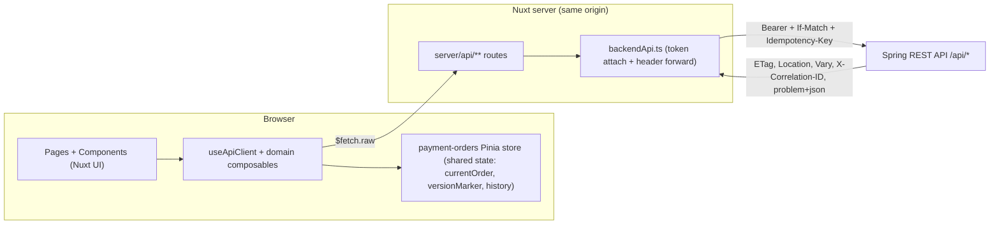
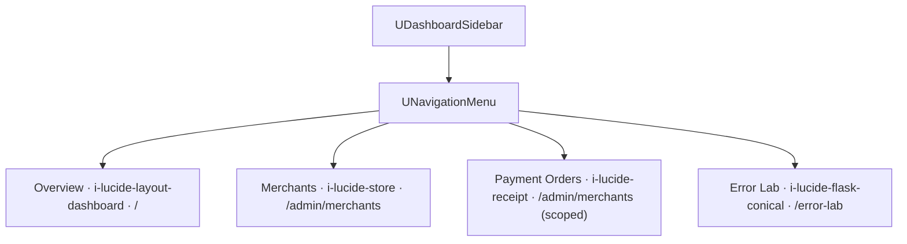
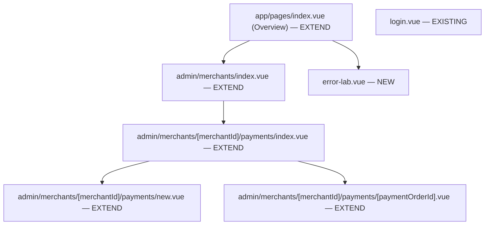
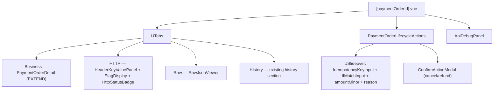
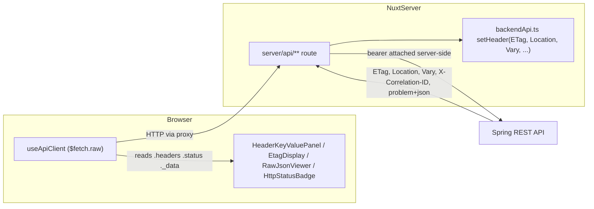
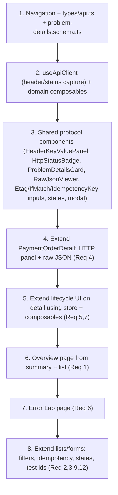
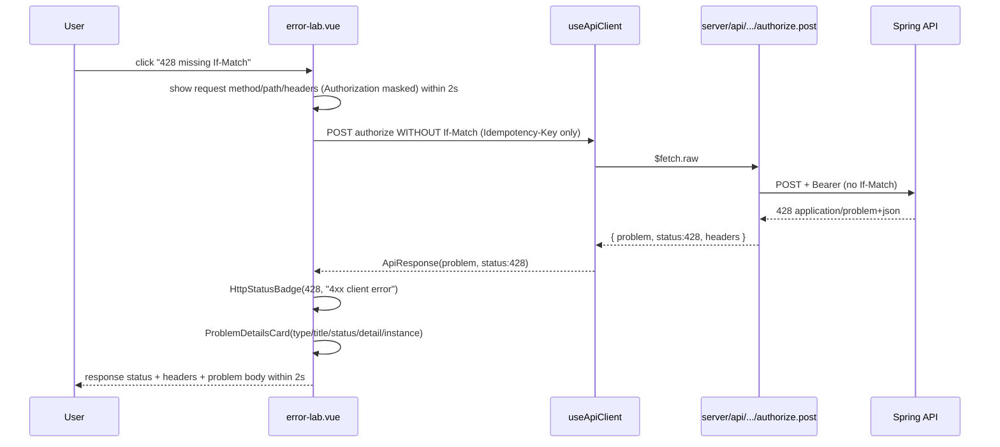

# Design Document: Payment Operations Dashboard

> Section guide: this document follows the canonical spec headings (Overview, Architecture,
> Components and Interfaces, Data Models, Correctness Properties, Error Handling, Testing Strategy)
> and folds the explicitly requested topics into them. Cross-references use section names rather than
> numbers.

## Overview

The Payment Operations Dashboard is a **brownfield enhancement** of the existing Nuxt 4
frontend at `apps/frontend`. It is not a new application and not a rewrite. The goal is to
turn the already-working merchant + payment-order screens into a cohesive operations
dashboard that *also* doubles as an HTTP learning surface (ETag, If-Match, Idempotency-Key,
Vary, Cache-Control, X-Correlation-ID, and `application/problem+json`).

### Brownfield intent

This design treats the **existing code as the source of truth for current behavior**. Every
screen, component, schema, Pinia store, and server proxy route that already exists MUST be
*extended or improved*, never duplicated or replaced. New artifacts are introduced only where
there is a genuine gap (navigation entries, the Error Lab page, shared protocol components, a
header-aware API client layer, and a problem-details schema).

### What already works today (verified against the codebase)

- A dashboard layout (`app/layouts/dashboard.vue`) using `UDashboardGroup` / `UDashboardSidebar`
  / `UNavigationMenu` / `UDashboardSearch`.
- Merchant screens and components (`CreateMerchantForm`, `MerchantStatusBadge`, `MerchantTable`).
- Payment-order screens and components (`CreatePaymentOrderForm`, `PaymentOrderDetail`,
  `PaymentOrderListTable`, `PaymentOrderSummaryCards`, `PaymentStatusBadge`).
- A **fully implemented lifecycle console** in `app/stores/payment-orders.ts`
  (`getAvailableActions`, `submitLifecycleAction`, `saveMetadata`, `loadHistory`, `versionMarker`).
- **All** server proxy routes including lifecycle and history under
  `server/api/merchants/[merchantId]/payment-orders/[paymentOrderId]/`.
- Server-side header forwarding and bearer-token attachment in `server/utils/backendApi.ts`.

### The one core gap this design must close

`server/utils/backendApi.ts` forwards backend response headers to the browser via `setHeader`,
**but the page/store layer uses plain `$fetch`, which returns only the parsed body and discards
response headers and status.** Today there is no way for the UI to read the ETag, Location, Vary,
or X-Correlation-ID values that the proxy faithfully forwards. Requirements 4, 5, 6, and 8 cannot
be satisfied without closing this gap. Section 11 specifies the fix: a header-aware API client
layer built on `$fetch.raw` / `useFetch` that returns `{ data, headers, status }`.

### Traceability to requirements

| Requirement | Title | Primary design sections |
|---|---|---|
| 1 | Dashboard Overview | Navigation, Components and Interfaces, Composables |
| 2 | Merchant Management | Endpoint Mapping, Components and Interfaces, Data Models |
| 3 | Payment Order Listing/Creation/Filtering | Endpoint Mapping, Components and Interfaces, Data Models (enum/bounds reconciliation) |
| 4 | Payment Order Detail + HTTP Learning Surface | Components and Interfaces, Composables, HTTP Headers Visibility |
| 5 | Payment Order Lifecycle Operations | Components and Interfaces, Composables, Pinia Usage, Sequence Diagrams |
| 6 | Error Lab and HTTP Learning Panel | Components and Interfaces, Error Handling, HTTP Headers Visibility, Sequence Diagrams |
| 7 | Lifecycle History and Audit Timeline | Components and Interfaces, Composables |
| 8 | Reusable Component Library | Components and Interfaces |
| 9 | Loading / Empty / Error States | Error Handling, Components and Interfaces |
| 10 | Form Validation | Data Models |
| 11 | Security and Token Handling | HTTP Headers Visibility, Error Handling |
| 12 | Playwright Testability | Playwright Testability Strategy |

### Scope discipline

The dashboard reflects **only** backend-supported behavior. No fabricated metrics, no top-level
`POST /payments`, no endpoints beyond the discovered controller surface. Where a requirement
implies behavior the backend does not support, this design documents the gap rather than inventing
an endpoint (see Current Backend Endpoint Audit and Data Models).

---

## Architecture

The dashboard is a Nuxt 4 app-directory frontend that never talks to the Spring API directly. Every
call goes through Nuxt server proxy routes (`server/api/**`) that attach the bearer token server-side
and forward selected response headers back to the browser. The browser-side transport is centralized
in a header-aware API client (`useApiClient`) so the UI can read ETag/Location/Vary/status — the
capability the current plain-`$fetch` layer lacks.



Layering decisions:
- **Transport** lives in composables on top of the existing proxy routes (header/status capture).
- **Shared state** stays in the existing `payment-orders` Pinia store (see Pinia Usage Decision).
- **Presentation** is built from Nuxt UI dashboard primitives before any custom CSS.

The remaining sections detail each layer: the current code audit, endpoint mapping, navigation, the
page/component architecture (Components and Interfaces), the schema/data-model strategy (Data Models),
composables, error handling, header visibility, responsiveness, accessibility, testability, migration,
sequence diagrams, and correctness properties.

---

## Current Frontend Audit

### What exists and is reused as-is

| Artifact | Path | Role | Disposition |
|---|---|---|---|
| Dashboard layout | `app/layouts/dashboard.vue` | Shell: sidebar, search, slot | EXTEND (add nav groups) |
| Auth store | `app/stores/auth.ts` | Session-backed login/logout | REUSE |
| Payment orders store | `app/stores/payment-orders.ts` | List/summary/detail/history + lifecycle console | EXTEND |
| App-shell store | `app/stores/app-shell.ts` | Shell UI state | REUSE |
| Merchant components | `app/components/merchant/*` | Create/Badge/Table | EXTEND |
| Payment components | `app/components/payment/*` | Form/Detail/Table/Summary/Badge | EXTEND |
| Merchant schema | `app/schemas/merchant.schema.ts` | Create validation | REUSE (stricter than reqs — see Data Models) |
| Payment-order schema | `app/schemas/payment-order.schema.ts` | Create + response validation | REUSE/EXTEND (enum + bounds — see Data Models) |
| Global auth middleware | `app/middleware/auth.global.ts` | Route guard | REUSE |
| Server proxy routes | `server/api/merchants/**` | Authenticated backend proxy | EXTEND (header capture) |
| Backend API helper | `server/utils/backendApi.ts` | Token attach + header forward | REUSE (already correct) |

### What is underused in the Nuxt UI Dashboard template

The current layout uses only `UDashboardGroup`, `UDashboardSidebar`, `UNavigationMenu`, and
`UDashboardSearch`. The richer dashboard primitives that the requirements call for are not yet
used and should be adopted before any custom CSS:

- `UDashboardPanel`, `UDashboardNavbar`, `UDashboardToolbar` — page chrome for each route.
- `UTabs` — to organize the Payment Order Detail (Business / HTTP / Raw / History) and the Error Lab.
- `USlideover` — for the lifecycle action drawer and the Api Debug Panel.
- `UModal` — for destructive-action confirmation (`ConfirmActionModal`).
- `USkeleton` / `UAlert` / `UToast` — for the deterministic Loading/Empty/Error states required by Req 9.

### Gaps (what must be added)

1. **No header/status visibility** at the page/store layer (the core gap — see HTTP Headers Visibility Strategy).
2. **No navigation** to Overview, Payment Orders (cross-merchant), or Error Lab (Proposed Dashboard Navigation).
3. **No Overview page** populated from the backend summary + list endpoints (Req 1).
4. **No Error Lab page** (Req 6).
5. **No shared protocol components**: `HttpStatusBadge`, `HeaderKeyValuePanel`, `ProblemDetailsCard`,
   `RawJsonViewer`, `IdempotencyKeyInput`, `EtagDisplay`, `IfMatchInput`, `ApiDebugPanel`,
   `EmptyStateCard`, `LoadingState`, `ErrorState`, `ConfirmActionModal` (Req 8).
6. **`PaymentOrderDetail`** shows business fields + history but has **no HTTP headers panel and no
   raw JSON preview** (Req 4).
7. **No `problem-details.schema.ts`** and no shared `types/api.ts` for response envelopes (Req 10).

---

## Current Backend Endpoint Audit

Grounded in `MerchantController.java` and `PaymentOrderController.java`. The "Auth authority"
column reflects the controller-enforced authority or ownership check; the proxy attaches the
bearer token server-side, so the browser never carries it.

| Method & Path | Auth authority / ownership | Key request headers | Key response headers | Status codes |
|---|---|---|---|---|
| `GET /api/status` | public | — | — | 200 |
| `POST /api/merchants` | `platform:merchants:create` | — | — | 201, 400, 403, 409 |
| `GET /api/merchants` | `platform:merchants:read` | — | — | 200, 403 |
| `GET /api/merchants/{id}` | `platform:merchants:read` | — | — | 200, 400, 403, 404 |
| `POST /api/merchants/{id}/activate` | `platform:merchants:update-status` | — | — | 200, 400, 403, 404 |
| `POST /api/merchants/{id}/suspend` | `platform:merchants:update-status` | — | — | 200, 400, 403, 404 |
| `POST /.../payment-orders` | merchant scope (`merchant_id` claim) | `Idempotency-Key` (required), `Content-Type` | `Location` (201), `ETag`, `Vary: Authorization, Idempotency-Key` | 201 created / 200 replay, 400, 403, 409, 415 |
| `GET /.../payment-orders/{id}` | `platform:payments:read` or merchant scope | — | `ETag`, `Vary: Authorization`, `Cache-Control` | 200, 403, 404, 406 |
| `HEAD /.../payment-orders/{id}` | read or merchant scope | — | `ETag`, `Vary: Authorization` | 200, 404 |
| `OPTIONS /.../payment-orders/{id}` | open (discovery) | — | `Allow`, `Accept-Patch`, `X-Correlation-ID` | 204 |
| `GET /.../payment-orders` (list) | `platform:payments:read` or merchant scope | — | `Vary: Authorization` | 200, 400, 403 |
| `GET /.../payment-orders/summary` | `platform:payments:read` or merchant scope | — | `Vary: Authorization` | 200, 403 |
| `GET /.../payment-orders/{id}/history` | `platform:payments:read\|lifecycle\|audit` or merchant scope | — | `Vary: Authorization` | 200, 403, 404 |
| `PATCH /.../payment-orders/{id}` | merchant scope or `platform:payments:lifecycle` | `If-Match` (required), `Content-Type: application/merge-patch+json` | `ETag`, `Vary: Authorization, If-Match` | 200, 400, 403, 404, 412, 415, 428 |
| `POST /.../{id}/authorize` | merchant scope or `platform:payments:lifecycle` | `Idempotency-Key`, `If-Match` (required) | `ETag`, `Vary: Authorization, If-Match` | 200, 400, 403, 404, 409, 412, 422, 428 |
| `POST /.../{id}/capture` | same | `Idempotency-Key`, `If-Match` (req); body optional `amountMinor`, `reason` | `ETag`, `Vary: Authorization, If-Match` | 200, 400, 403, 404, 409, 412, 422, 428 |
| `POST /.../{id}/cancel` | same | `Idempotency-Key`, `If-Match` (req); body optional `reason` | `ETag`, `Vary: Authorization, If-Match` | 200, 400, 403, 404, 409, 412, 422, 428 |
| `POST /.../{id}/refund` | same | `Idempotency-Key`, `If-Match` (req); body optional `amountMinor`, `reason` | `ETag`, `Vary: Authorization, If-Match` | 200, 400, 403, 404, 409, 412, 422, 428 |

### Problem contract status semantics (for the Error Lab, Req 6)

`400` validation / malformed JSON / malformed If-Match · `401` unauthenticated · `403` forbidden ·
`404` not found · `406` `Accept: application/xml` · `409` idempotency conflict · `412` stale
If-Match / version mismatch / optimistic lock · `415` unsupported media type · `422` invalid
transition / authorization expired / capture exceeds authorized / refund exceeds captured · `428`
missing If-Match.

### Documented gaps (no invented endpoints)

- **`401 unauthenticated`** is enforced at the proxy/security layer, not by `PaymentOrderController`.
  The proxy already returns `401` when the session has no access token (see `backendApi.ts`). The
  Error Lab triggers 401 by calling a proxy route in a context without a valid session token, not by
  a dedicated backend endpoint.
- The backend exposes **no client-recomputable counts** beyond the `summary` and `list` endpoints,
  so the Overview cards (Req 1) are populated strictly from `GET /.../payment-orders/summary` and
  `GET /api/merchants`. No count is computed client-side (Req 1.1, 1.7).
- There is **no cross-merchant "all payment orders" list endpoint**; payment-order lists are always
  merchant-scoped. The Overview "recent orders" and any Payment Orders nav must therefore operate
  within a selected merchant scope (or aggregate by iterating merchants only if a `platform:payments:read`
  token is present). This design keeps the merchant-scoped contract and documents it rather than
  inventing a global list.

---

## Endpoint-to-Screen Mapping

Each backend endpoint maps to the screen/component that consumes it. The disposition column marks
whether the consuming artifact is **EXISTING** (already wired), **EXTEND** (exists but must gain
capability), or **NEW**.

| Endpoint | Screen / Page | Component(s) | Composable | Disposition |
|---|---|---|---|---|
| `GET /api/merchants` | `/admin/merchants` + Overview | `MerchantTable`, `PaymentOrderSummaryCards` (merchant count) | `useMerchantsApi` | EXTEND |
| `POST /api/merchants` | `/admin/merchants` | `CreateMerchantForm` | `useMerchantsApi` | EXISTING |
| `GET /api/merchants/{id}` | merchant detail / `MerchantStatusCard` | `MerchantStatusCard` (new), `MerchantStatusBadge` | `useMerchantsApi` | EXTEND |
| `POST /api/merchants/{id}/activate` | `/admin/merchants` | `MerchantTable` action, `ConfirmActionModal` | `useMerchantsApi` | EXISTING |
| `POST /api/merchants/{id}/suspend` | `/admin/merchants` | `MerchantTable` action | `useMerchantsApi` | EXTEND |
| `POST /.../payment-orders` | `/admin/merchants/{merchantId}/payments/new` | `CreatePaymentOrderForm`, `IdempotencyKeyInput`, `ApiDebugPanel` | `usePaymentOrdersApi` | EXTEND |
| `GET /.../payment-orders` | `/admin/merchants/{merchantId}/payments` + Overview recent orders | `PaymentOrderListTable`, `PaymentOrderSummaryCards` | `usePaymentOrdersApi` | EXTEND |
| `GET /.../payment-orders/summary` | Overview + payments index | `PaymentOrderSummaryCards` | `usePaymentOrdersApi` | EXTEND |
| `GET /.../payment-orders/{id}` | `/admin/merchants/{merchantId}/payments/{paymentOrderId}` | `PaymentOrderDetail`, `HeaderKeyValuePanel`, `RawJsonViewer`, `EtagDisplay` | `usePaymentOrdersApi` | EXTEND |
| `GET /.../payment-orders/{id}/history` | payment detail (history tab) | `PaymentOrderDetail` history section | `usePaymentOrdersApi` | EXISTING |
| `PATCH /.../payment-orders/{id}` | payment detail (metadata) | `IfMatchInput`, `ApiDebugPanel` | `usePaymentLifecycleApi` | EXTEND |
| `POST /.../{id}/authorize` | payment detail | `PaymentOrderLifecycleActions`, `IdempotencyKeyInput`, `IfMatchInput` | `usePaymentLifecycleApi` | EXTEND |
| `POST /.../{id}/capture` | payment detail | `PaymentOrderLifecycleActions` (+ amountMinor) | `usePaymentLifecycleApi` | EXTEND |
| `POST /.../{id}/cancel` | payment detail | `PaymentOrderLifecycleActions`, `ConfirmActionModal` | `usePaymentLifecycleApi` | EXTEND |
| `POST /.../{id}/refund` | payment detail | `PaymentOrderLifecycleActions`, `ConfirmActionModal` (+ amountMinor) | `usePaymentLifecycleApi` | EXTEND |
| `OPTIONS` / `HEAD .../{id}` | Error Lab + detail discovery | `HeaderKeyValuePanel` (Allow / Accept-Patch) | `useApiClient` | NEW |
| all error scenarios | `/error-lab` | `ProblemDetailsCard`, `HttpStatusBadge`, `HeaderKeyValuePanel`, `ApiDebugPanel` | `useApiClient` | NEW |

---

## Proposed Dashboard Navigation

The sidebar today links only to Merchants. It is extended in `dashboard.vue` by expanding the
`links` array passed to `UNavigationMenu` (and the matching `groups` for `UDashboardSearch`). No
structural change to the layout is needed — only data additions — which keeps the change minimal
and reversible.



Proposed `links` structure (extends the existing `satisfies NavigationMenuItem[][]` array):

```ts
const links = [[
  { label: 'Overview',       icon: 'i-lucide-layout-dashboard', to: '/' },
  { label: 'Merchants',      icon: 'i-lucide-store',            to: '/admin/merchants' },
  { label: 'Payment Orders', icon: 'i-lucide-receipt',          to: '/admin/merchants' }, // merchant-scoped entry
  { label: 'Error Lab',      icon: 'i-lucide-flask-conical',    to: '/error-lab' },
]] satisfies NavigationMenuItem[][]
```

Because there is no global cross-merchant list endpoint (Current Backend Endpoint Audit), the "Payment Orders" entry routes to
the merchant registry where the operator picks a merchant scope; the per-merchant payments index is
the real listing surface. The `UDashboardSearch` `groups` are extended in parallel so search covers
the new destinations.

---

## Components and Interfaces

> Page and component architecture. Covers the pages tree, the component tree, and the mapping of every
> required reusable component to EXISTING/EXTEND/NEW.

### Pages tree



- `index.vue` is currently a placeholder/landing; it becomes the **Overview** (Req 1): summary cards
  + recent orders + a control linking to the Error Lab.
- `error-lab.vue` is the only **NEW** page.

### Component tree and required-component mapping

The requirements name a set of reusable components (Req 8). Several already exist under different
names and MUST be extended rather than duplicated (Req 8.12). The table below maps every required
component to its disposition.

| Required component (Req 8) | Existing artifact | Disposition | Notes |
|---|---|---|---|
| `BusinessStatusBadge` | `PaymentStatusBadge`, `MerchantStatusBadge` | EXTEND/CONSOLIDATE | Generalize to render both Merchant and Payment_Status with non-color-only labels (Req 8.1). Keep existing badges as thin wrappers to avoid breaking current pages/tests. |
| `PaymentOrderSummaryCards` | `PaymentOrderSummaryCards` | EXTEND | Add per-status count cards + merchant/order totals from backend summary (Req 1.1). |
| `MerchantStatusCard` | — | NEW | Wraps `GET /api/merchants/{id}` business fields + badge. |
| `HttpStatusBadge` | — | NEW | Renders code + leading-digit category (Req 8.2). |
| `HeaderKeyValuePanel` | — | NEW | Renders header pairs; empty indicator when zero (Req 8.3–8.4); masks Authorization (Req 11.3). |
| `ProblemDetailsCard` | — | NEW | Renders problem+json members with empty indicators (Req 8.5). |
| `RawJsonViewer` | — | NEW | Indented JSON preserving key order; non-JSON fallback (Req 8.6–8.7). |
| `IdempotencyKeyInput` | (logic in store) | NEW | UI control generating + editing key (Req 8.8); key generation already exists in `submitLifecycleAction`. |
| `EtagDisplay` | (versionMarker in store) | NEW | Shows latest ETag (Req 8.9). |
| `IfMatchInput` | (versionMarker in store) | NEW | Edits If-Match, pre-filled from latest ETag (Req 8.9, 5.3). |
| `PaymentOrderLifecycleActions` | (logic in store `getAvailableActions`) | NEW (component) | One control per available action (Req 8.10); reuses store logic. |
| `ApiDebugPanel` | — | NEW | Renders Http_Learning_Detail for the most recent request (Req 6, 8.11). |
| `EmptyStateCard` | — | NEW | Description + next action (Req 9.3). |
| `LoadingState` | — | NEW | `USkeleton`/spinner wrapper (Req 9.1). |
| `ErrorState` | (error refs in store) | NEW | Renders `ProblemDetailsCard` or message; token-safe (Req 9.4–9.5). |
| `ConfirmActionModal` | — | NEW | `UModal` confirm for destructive actions (Req 5.8, 8.11). |
| `CreateMerchantForm` / `MerchantTable` | exist | EXTEND | Add test ids + states (Req 2.10, 12). |
| `CreatePaymentOrderForm` / `PaymentOrderListTable` | exist | EXTEND | Filters, idempotency, states (Req 3.10). |
| `PaymentOrderDetail` | exists | EXTEND | Add HTTP headers panel + raw JSON preview (Req 4.9). |

All components are built from Nuxt UI primitives (`UCard`, `UTable`, `UBadge`, `UButton`, `UForm`,
`UFormField`, `UInput`, `USelect`, `UTextarea`, `UModal`, `USlideover`, `UTabs`, `UAlert`, `UToast`,
`USkeleton`) before any custom CSS (Req 8.13, Constraints).

### Payment Order Detail composition (Req 4)



---

## Composables and API Client Design

### Why composables on top of an existing store

The existing `payment-orders` Pinia store works, but it has two limitations that block the
requirements:

1. It uses plain `$fetch`, so **response headers and status are discarded** (the core gap).
2. It mixes transport, validation, and shared state, which makes the HTTP learning surface hard to
   expose without bloating the store.

The design introduces a thin **composable transport layer** that captures headers/status, and keeps
the store for genuinely shared state (see Pinia Usage Decision). Composables call the same `server/api/**` proxy routes
the store already uses, so runtime and tests exercise one path.

### `useApiClient` — the header-aware foundation

`useApiClient` is the single place that knows how to read forwarded response headers. It wraps
`$fetch.raw` (which exposes `response.headers`, `response.status`, and `response._data`) and returns
a normalized envelope:

```ts
interface ApiResponse<T> {
  data: T | null
  status: number
  headers: ApiHeaders          // typed view: etag, location, vary, cacheControl, correlationId, allow, acceptPatch
  problem: ProblemDetails | null
  raw: string                  // unmodified body text for RawJsonViewer (Req 4.3, 8.6)
}

async function request<T>(
  path: string,
  schema: ZodType<T>,
  opts?: { method?; body?; headers?; query? }
): Promise<ApiResponse<T>>
```

Responsibilities:
- Call the proxy route with `$fetch.raw` and read `response.headers` / `response.status`.
- Capture the raw body text **before** parsing for `RawJsonViewer` (preserves key order, Req 8.6).
- Validate `data` against the supplied Zod schema (Req 10.4); on failure return a typed validation
  error and never expose unvalidated data (Req 10.5).
- Detect `application/problem+json` and populate `problem` (Req 9.4).
- The browser never sees the token; `Authorization` is attached server-side by `backendApi.ts`
  (Req 11.1, 11.6).

> Implementation note: `useFetch`/`useAsyncData` are used where SSR-aware reactive state is wanted
> (Overview, list pages); the underlying `$fetch.raw` envelope shape is identical so components read
> the same `{ data, headers, status }`.

### Domain composables

| Composable | Wraps | Returns | Requirements |
|---|---|---|---|
| `useMerchantsApi` | merchant proxy routes | list/detail/create/activate/suspend with `ApiResponse` | Req 2 |
| `usePaymentOrdersApi` | list/summary/detail/create proxy routes | `ApiResponse` incl. `etag`, `location` on create | Req 1, 3, 4 |
| `usePaymentLifecycleApi` | authorize/capture/cancel/refund/PATCH | `ApiResponse` carrying new `etag`; categorized errors | Req 5, 7 |

Each domain composable delegates transport to `useApiClient`, adds the right schema, and surfaces the
captured `etag`/`location`/`correlationId` to callers so the detail page and Error Lab can render them.

### Division of labor vs the store

- **Composables** own transport, header/status capture, and per-call response validation.
- **Store** (`payment-orders`) keeps cross-component shared state: `currentOrder`, `versionMarker`
  (latest ETag), `history`, `lifecycleFeedback`, and the action-availability logic
  (`getAvailableActions`). The store's existing `submitLifecycleAction` / `saveMetadata` /
  `loadHistory` are **refactored to delegate transport to the composables** so the captured ETag from
  a write updates `versionMarker` directly (today `versionMarker` is only set from the detail GET).

---

## Data Models

> Zod schema strategy and shared API types. This is the data-model layer: form schemas, response
> schemas, the new problem-details schema, the API envelope types, and the validation policy.

### Reuse existing schemas (source of truth)

Existing schemas are kept and reused. They are **stricter** than the generic prose in the
requirements; the existing code wins and the discrepancy is reconciled explicitly below.

#### Reconciliation: merchant schema

`merchant.schema.ts` enforces:
- `merchantReference`: **3–64 chars**, regex `^[A-Za-z0-9][A-Za-z0-9-]*[A-Za-z0-9]$` (must start/end
  alphanumeric, hyphens allowed internally).
- `displayName`: **2–120 chars**.

Requirement 2.4 generically states `merchantReference` 1–64 and `displayName` 1–140. **Decision: keep
the existing stricter schema.** It better matches a real reference format and the backend's normalized
uniqueness behavior. The requirement's looser bounds are treated as a non-binding upper sketch; the
design notes that field-level validation messages (Req 2.5, 10.2) come from these existing rules.

#### Reconciliation: payment-order schema

`payment-order.schema.ts` enforces:
- `currency`: **enum `PLN | EUR | USD`** (not arbitrary ISO 4217).
- `amountMinor`: integer **1 – 100,000,000** (not 999,999,999,999).
- `clientOrderReference`: 1–120 chars (not 255).

Requirements 3.2 and 5.4/5.11 mention 3-letter ISO 4217 and a 999,999,999,999 ceiling. **Decision:
keep the existing enum and bounds.** Consequences for this design:
- The **currency filter** (Req 3.5) is a `USelect` over `PLN/EUR/USD`, not a free-text ISO field.
- The **create form** and **lifecycle amount inputs** validate against `max 100,000,000`; validation
  messages reflect the real ceiling.
- The Error Lab can still demonstrate a `400` by submitting a value outside these real bounds.

### New schemas

| New file | Purpose | Requirements |
|---|---|---|
| `app/schemas/problem-details.schema.ts` | Validate `application/problem+json` (`type`, `title`, `status`, `detail`, `instance`, plus passthrough extensions) | Req 4.4, 6.4, 8.5, 9.4 |
| `app/types/api.ts` | `ApiResponse<T>`, `ApiHeaders`, `ProblemDetails` types + a query-filter type matching the list endpoint params | Req 3.5, 4.2, 7 |

`problemDetailsSchema` (shape):

```ts
export const problemDetailsSchema = z.object({
  type: z.string().optional(),
  title: z.string().optional(),
  status: z.number().int().optional(),
  detail: z.string().optional(),
  instance: z.string().optional(),
}).passthrough()   // preserve backend extension members for display
```

### Response validation policy (Req 10.4–10.5)

Every backend response is validated against its schema **before** any parsed data is rendered. On
schema failure the UI shows an `ErrorState` ("response was invalid"), renders nothing unvalidated, and
retains the prior valid view. The existing store already does this for payment detail/list/summary
(`paymentOrderResponseSchema.parse(...)`); `useApiClient` generalizes it to all calls.

### Filter schema (Req 3.5–3.7)

A `paymentOrderListQuerySchema` constrains filters to exactly the backend-supported set: `status`
(enum), `currency` (enum), `fromDate`, `toDate`, `minAmount`, `maxAmount`, `clientOrderReference`,
`page` (default 0), `size` (default 20, **max 100**), `sort`. No filter exists that the backend list
endpoint does not support.

---

## Pinia Usage Decision

Per the project constraint ("use Pinia only where shared cross-component state is genuinely needed;
prefer composables for API calls"), state is split as follows.

| Concern | Home | Justification |
|---|---|---|
| One-shot fetch + headers/status | Composable (`useApiClient`) | Not shared; transport detail. |
| Auth/session view | `auth` store (EXISTING) | Shared across layout + guards. |
| Current payment order + latest ETag (`versionMarker`) | `payment-orders` store (KEEP) | Read by detail tabs, lifecycle drawer, and `IfMatchInput` simultaneously — genuinely shared. |
| Lifecycle feedback category | `payment-orders` store (KEEP) | Shared between action drawer and toast/error surfaces. |
| History entries | `payment-orders` store (KEEP) | Shared between history tab and timeline. |
| Action availability (`getAvailableActions`) | `payment-orders` store (KEEP) | Pure derivation already implemented and unit-testable. |
| Error Lab transient request/response | local component state | Single-page, not shared. |

**Decision: keep the existing `payment-orders` store.** It already holds exactly the cross-component
state that multiple detail-page surfaces need (current order, version marker, history, feedback). The
store is *narrowed* — its transport is delegated to composables — but not removed. New per-call,
header-aware reads use composables directly. No new store is introduced.

---

## Error Handling

> Full error-handling strategy: problem+json mapping, lifecycle error categories, state surfaces, and
> token-safe errors.

### problem+json mapping

`useApiClient` detects `application/problem+json` and validates the body with `problemDetailsSchema`.
The normalized `problem` object flows into `ProblemDetailsCard`, which renders `type/title/status/
detail/instance` with an explicit "not present" indicator for each absent member (Req 8.5). The
response status is shown via `HttpStatusBadge` with its leading-digit category (Req 6.3, 8.2).

### Lifecycle error categories (already in the store)

The store already maps lifecycle HTTP status to a category enum
(`lifecycleErrorCategorySchema`): `412 → stale_state`, `422 → invalid_transition`,
`409 → idempotency_conflict`, `403 → forbidden`, `404 → not_found`, else `validation`, plus
`backend_unavailable`. This mapping is preserved and surfaced as human-readable guidance next to the
`ProblemDetailsCard`. On lifecycle failure the user-entered Idempotency-Key and If-Match are retained
(Req 5.7), which the existing store already does (it does not clear inputs on error).

### State surfaces (Req 9)

| State | Component | Trigger | Requirement |
|---|---|---|---|
| Loading | `LoadingState` (`USkeleton`/spinner) | request in flight | 9.1 |
| Timeout | `ErrorState` + retry | no completion within 10s | 9.2, 1.6, 4.5 |
| Empty | `EmptyStateCard` (description + action) | zero items | 9.3, 1.5, 3.9 |
| Error | `ErrorState` → `ProblemDetailsCard` or message | failure | 9.4 |
| Write outcome | `UToast` (dismissible) | success/failure of write | 9.6 |

### Token-safe errors (Req 9.5, 11)

`ErrorState`, `ApiDebugPanel`, and `HeaderKeyValuePanel` never render the bearer token. The token
lives only in the server session and is attached server-side; any `Authorization` header shown in a
debug panel is replaced with a fixed masked placeholder (see HTTP Headers Visibility Strategy). Error bodies are problem+json from
the backend and contain no credential material.

---

## HTTP Headers Visibility Strategy

This section specifies the fix for the core gap.

### The problem, precisely

`server/utils/backendApi.ts` and the per-route handlers (e.g. `[paymentOrderId].get.ts`) call
`$fetch.raw` against the backend, then `setHeader(event, ...)` to forward `ETag`, `Cache-Control`,
`Vary`, `X-Correlation-ID`, `Location`, `Accept-Patch`, `Allow` to the browser response. **But the
client store/page uses plain `$fetch`, whose return value is only the parsed body.** Headers and
status are silently dropped. Confirmed in `payment-order-read.spec.ts`: it asserts only business
fields, never headers.

### The fix: capture at the client transport boundary

The browser-side reads switch from `$fetch(...)` to **`$fetch.raw(...)`** (or `useFetch` with access
to `response`), centralized in `useApiClient`. `$fetch.raw` returns a `FetchResponse` exposing
`.headers` (a `Headers` instance), `.status`, and `._data` (parsed body). `useApiClient` projects
these into the typed `ApiResponse<T>` envelope `{ data, status, headers, problem, raw }`.



Nothing in the proxy changes — it already forwards the right headers. The only change is the
**client** reading them through `$fetch.raw` instead of `$fetch`.

### Surfacing ETag / If-Match / Idempotency-Key

- **ETag**: captured from every detail/lifecycle response; stored in `versionMarker`; rendered by
  `EtagDisplay` (Req 4.2, 5.6). On a successful write the *new* ETag from the response replaces the
  old marker (Req 5.6, and the round-trip property in Correctness Properties).
- **If-Match**: `IfMatchInput` is pre-populated from the latest `versionMarker` (Req 5.3); writes send
  it via the proxy's `forwardIfMatch` option.
- **Idempotency-Key**: `IdempotencyKeyInput` generates a unique value per initiation, editable, ≤255
  chars (Req 5.2, 5.10); on failed create the same key is reused on resubmit when form values are
  unchanged (Req 3.4).
- **Location**: captured from the `201` create response and shown in the create `ApiDebugPanel`
  (Req 4.2 cross-reference, Sequence Diagram 16a).
- **Vary / Cache-Control / X-Correlation-ID / Allow / Accept-Patch**: rendered in
  `HeaderKeyValuePanel`; each absent header shows an explicit "not present" indicator (Req 4.2, 8.4).

### Masking Authorization (Req 6.6, 11.3)

Any header panel that could include a request `Authorization` header replaces the **entire** value
with a fixed placeholder (e.g. `Bearer ••••••••`) so no character of the token is rendered. In
practice the browser never holds the token at all (it is attached server-side), so request-header
displays are reconstructed from known request metadata with `Authorization` shown only as the masked
placeholder — never read from a real token value.

---

## Responsive Layout Strategy

- Use `UDashboardPanel` + `UDashboardNavbar` + `UDashboardToolbar` for consistent page chrome across
  Overview, Merchants, Payments, Detail, and Error Lab.
- **Breakpoints**: rely on Nuxt UI's Tailwind-based responsive utilities. Tables (`UTable`) collapse to
  stacked card rows on small screens; the sidebar is already `collapsible` + `resizable` in
  `dashboard.vue`.
- **Detail page**: two-column on `lg+` (business fields | HTTP/raw panels), single-column stacked on
  smaller screens; lifecycle actions move into a `USlideover` drawer on small screens.
- **Density**: `VISUAL_DENSITY 5–7` — compact, scannable operational tables with deliberate whitespace
  between decision groups; numeric amounts right-aligned and monospaced for scan.
- **Motion**: `MOTION_INTENSITY 1–3` — focus/hover/disclosure transitions only; no spectacle; honor
  reduced-motion.
- Prefer Nuxt UI primitives over custom CSS; custom CSS only where the library cannot express a state.

---

## Accessibility Notes

- **Non-color-only status** (Req 2.7, 8.1, 11 testability): `BusinessStatusBadge` and `HttpStatusBadge`
  always include a text label and/or icon, so status is distinguishable with color removed.
- **Labelled controls**: every input uses `UFormField` with an associated label; `IdempotencyKeyInput`,
  `IfMatchInput`, amount, and reason fields have explicit labels and helper/validation text.
- **Focus management**: `ConfirmActionModal` (`UModal`) and the lifecycle `USlideover` trap focus and
  restore it to the trigger on close; visible focus rings retained from Nuxt UI defaults.
- **Keyboard**: tabs, modals, slideovers, and menus are keyboard-operable; the Error Lab triggers are
  `UButton`s reachable and activatable by keyboard.
- **Empty/error indicators** are textual, not icon-only, so assistive tech announces them.
- **Contrast**: rely on Nuxt UI tokens / color-mode defaults; avoid low-contrast custom colors.

---

## Playwright Testability Strategy

### Reuse existing patterns

Tests live in `apps/frontend/tests/e2e` and reuse the existing **auth storage-state** setup
(`tests/auth/auth.setup.ts` → `tests/.auth/platform-operator.json`). Existing specs use route mocks
(`page.route(...)`) and user-facing text/role locators; new specs follow the same approach and add
`data-testid` where Req 12 requires stable hooks. Calls continue to flow through the Server_Proxy so
tests exercise the runtime path.

### `data-testid` placement plan (maps to Req 12)

| Test_Id | Element | Component | Req |
|---|---|---|---|
| `create-merchant-form` | form | `CreateMerchantForm` | 12.1 |
| `activate-merchant-button` | button | `MerchantTable` row action | 12.2 |
| `create-payment-order-form` | form | `CreatePaymentOrderForm` | 12.3 |
| `payment-order-table` | table | `PaymentOrderListTable` | 12.4 |
| `payment-order-detail` | detail container | detail page | 12.5 |
| `lifecycle-authorize` / `lifecycle-capture` / `lifecycle-cancel` / `lifecycle-refund` | buttons | `PaymentOrderLifecycleActions` | 12.6 |
| `problem-details-card` | card | `ProblemDetailsCard` | 12.7 |
| `http-headers-panel` | panel | `HeaderKeyValuePanel` | 12.8 |

Plus supporting ids used by new flows: `error-lab-trigger-{status}`, `idempotency-key-input`,
`if-match-input`, `etag-display`, `raw-json-viewer`, `api-debug-panel`, `empty-state`, `error-state`,
`loading-state`, `confirm-action-modal`.

### Stability rules (Req 12.9–12.10)

- Test ids are **content/style independent** — placed on the structural element, never derived from
  dynamic text, and unchanged across rebuilds/sessions.
- Each rendered id resolves to **exactly one** element. Lists use a stable parent id plus row-scoped
  ids derived from `paymentOrderId` so locators stay unambiguous.
- The HTTP headers panel and problem details card stay in the DOM with stable ids whenever their data
  is available, so tests can assert HTTP outcomes (Testability Requirements).

### Coverage to add (by risk)

1. Header capture: detail page shows ETag / Vary / X-Correlation-ID from mocked response headers
   (the gap fix — highest value).
2. Error Lab: each of 400/401/403/404/406/409/412/415/428 renders matching `HttpStatusBadge` and
   problem card.
3. Lifecycle: authorize with If-Match → new ETag shown; cancel/refund confirm modal gating.
4. Validation: enum currency + amount ceiling messages; create blocked on invalid input.
5. Empty/error/loading deterministic states.

---

## Incremental Migration Strategy

Ordering preserves existing pages/components and ships in small, reversible commits.



Principles:
- Step 1–2 are foundational (close the header gap) and unblock everything else.
- Each step keeps the app green: existing `$fetch`-based store paths keep working until each surface
  is migrated to the composable envelope.
- Refactor the store's transport to composables in step 2/5 without changing its public API, so
  existing components/tests keep passing.
- Commit per step; never a single mega-change.

---

## Sequence Diagrams

### 16a. Create payment order with Idempotency-Key (capture Location + ETag)

```mermaid
sequenceDiagram
  participant U as User
  participant F as CreatePaymentOrderForm
  participant C as useApiClient ($fetch.raw)
  participant P as server/api/.../payment-orders/index.post
  participant B as backendApi.ts
  participant API as Spring API

  U->>F: submit (amountMinor, currency enum, clientOrderReference)
  F->>F: Zod validate (max 100,000,000; PLN/EUR/USD)
  F->>C: POST with generated Idempotency-Key
  C->>P: $fetch.raw (no token in browser)
  P->>B: backendApi(event, path, { idempotencyKey })
  B->>API: POST + Bearer (server-side) + Idempotency-Key
  API-->>B: 201 Location + ETag + Vary: Authorization, Idempotency-Key
  B-->>P: body + setHeader(Location, ETag, Vary)
  P-->>C: response (_data, headers, status)
  C-->>F: { data, status:201, headers:{location, etag} }
  F->>F: store versionMarker = etag
  F-->>U: success toast + ApiDebugPanel shows Location & ETag
```

### 16b. Authorize with If-Match (version marker → new ETag)

```mermaid
sequenceDiagram
  participant U as User
  participant A as PaymentOrderLifecycleActions
  participant S as payment-orders store
  participant C as usePaymentLifecycleApi
  participant P as server/api/.../authorize.post
  participant API as Spring API

  U->>A: click Authorize
  A->>S: read versionMarker (latest ETag)
  A->>A: IfMatchInput prefilled = versionMarker; IdempotencyKeyInput unique
  U->>A: confirm
  A->>C: POST authorize (If-Match, Idempotency-Key)
  C->>P: $fetch.raw
  P->>API: POST + Bearer + If-Match + Idempotency-Key
  alt success
    API-->>P: 200 new status + new ETag
    P-->>C: { data, status:200, headers:{etag:new} }
    C->>S: versionMarker = new ETag; refresh detail+history
    A-->>U: show new Payment_Status + new ETag
  else stale If-Match
    API-->>P: 412 problem+json
    P-->>C: { problem, status:412 }
    C->>S: lifecycleFeedback = stale_state (retain inputs)
    A-->>U: ProblemDetailsCard + HttpStatusBadge 4xx
  end
```

### 16c. Error Lab triggering 428 missing If-Match



---

## Correctness Properties

*A property is a characteristic or behavior that should hold true across all valid executions of a
system — essentially, a formal statement about what the system should do. Properties serve as the
bridge between human-readable specifications and machine-verifiable correctness guarantees.*

These properties target the **pure logic and invariants** of the dashboard (status mapping, masking,
validation gating, JSON rendering, ETag/If-Match handling). UI timing, presence-of-control, and
modal-interaction criteria are covered by example/integration tests (see Playwright Testability Strategy and Testing Strategy),
not by property-based tests. Properties below were derived from the prework classification and
de-duplicated by the reflection step.

### Property 1: No fabricated business metric

*For any* backend summary or list payload, every business metric the dashboard renders SHALL be equal
to a value present in that backend response, with no count or amount computed on the client.

**Validates: Requirements 1.1, 1.7**

### Property 2: Status badges are distinguishable without color

*For any* Merchant status or Payment_Status value, `BusinessStatusBadge` SHALL render a non-empty text
label that is unique per status, so that every status remains distinguishable from the others when
color is removed.

**Validates: Requirements 2.7, 8.1**

### Property 3: Outbound request gating by form schema

*For any* form input, the dashboard SHALL send the create/lifecycle request if and only if the input
passes its Zod schema (currency in `PLN|EUR|USD`, `amountMinor` an integer in `1..100,000,000`,
non-empty `clientOrderReference`, `merchantReference`/`displayName` within the existing schema bounds),
and SHALL display a field-level message for each failing field while retaining entered values.

**Validates: Requirements 3.2, 3.3, 5.4, 5.11, 10.1, 10.2, 10.3**

### Property 4: Inbound response validation gating

*For any* backend response, the dashboard SHALL render parsed data only if the response passes its Zod
schema; if validation fails it SHALL render an error state, render no unvalidated data, and retain the
prior valid view.

**Validates: Requirements 10.4, 10.5**

### Property 5: HTTP status category mapping

*For any* HTTP status code in `100..599`, `HttpStatusBadge` SHALL display the category determined by the
leading digit (1xx informational, 2xx success, 3xx redirection, 4xx client error, 5xx server error).

**Validates: Requirements 8.2, 6.3**

### Property 6: Raw JSON round-trip and key-order preservation

*For any* JSON response body, `RawJsonViewer` SHALL render text that parses back to an equivalent value
with original key ordering preserved; *for any* input that is not valid JSON, it SHALL render the raw
content with an explicit not-valid-JSON indication.

**Validates: Requirements 8.6, 8.7**

### Property 7: Problem details rendering with empty indicators

*For any* `application/problem+json` object, `ProblemDetailsCard` SHALL display each of `type`, `title`,
`status`, `detail`, and `instance` when present and an explicit empty indicator for each absent member.

**Validates: Requirements 8.5**

### Property 8: Header panel rendering with empty indicator

*For any* set of response/request header key-value pairs, `HeaderKeyValuePanel` SHALL render every pair,
and when the set is empty it SHALL render an explicit empty indicator instead of an empty panel.

**Validates: Requirements 8.3, 8.4**

### Property 9: Token confidentiality and Authorization masking

*For any* access-token value and *for any* dashboard surface that can display request or response detail
(header panel, error state, api debug panel, DOM, attributes, client state, browser storage), the
rendered output SHALL NOT contain any character of the token value and SHALL replace any Authorization
header value with a fixed masking placeholder.

**Validates: Requirements 11.1, 11.2, 11.3, 6.6**

### Property 10: Displayed status equals proxied backend status

*For any* request whose response is captured through the Server_Proxy, the HTTP status code the
dashboard displays SHALL equal the status code of the captured response.

**Validates: Requirements 6.3**

### Property 11: If-Match carries the latest ETag and updates on success

*For any* read-then-write sequence on a payment order, the `If-Match` value sent with a write SHALL equal
the most recent ETag captured from a prior read or write, and a successful write SHALL replace the stored
version marker with the new ETag returned in that write's response.

**Validates: Requirements 5.3, 5.6**

### Property 12: Idempotency-Key reuse on unchanged resubmit

*For any* create attempt that fails and is resubmitted without changing the form values, the dashboard
SHALL send the same Idempotency_Key, and SHALL generate a new key when the form values change.

**Validates: Requirements 3.4**

### Property 13: Filter parameters are a supported subset and bounded

*For any* filter UI state, the query parameters emitted to the list endpoint SHALL be a subset of
`{status, currency, fromDate, toDate, minAmount, maxAmount, clientOrderReference, page, size, sort}` and
the `size` parameter SHALL never exceed 100.

**Validates: Requirements 3.5, 3.7**

### Property 14: History is ordered ascending by timestamp

*For any* status-history collection, the dashboard SHALL render entries in non-decreasing timestamp order
from oldest to newest.

**Validates: Requirements 7.6**

### Property 15: Non-display actor fields are never rendered

*For any* history entry containing an internal actor subject field, the dashboard SHALL render only the
safe actor display value and SHALL NOT render the internal actor subject.

**Validates: Requirements 7.8**

### Property 16: Test ids are unique per rendered page

*For any* rendered page state, each required `data-testid` value SHALL match exactly one element in that
page.

**Validates: Requirements 12.9, 12.10**

---

## Error Handling (reference)

See Error Handling for the full strategy. Summary of behavior the implementation must uphold:
- problem+json is validated with `problemDetailsSchema` and rendered by `ProblemDetailsCard`.
- Lifecycle status codes map to the existing `lifecycleErrorCategorySchema` and produce human-readable
  guidance while retaining user inputs (Req 5.7).
- Timeouts (10s) exit loading and show a retry `ErrorState` (Req 9.2).
- No error surface renders the bearer token (Req 9.5, 11) — enforced by Property 9.
- Write outcomes show a dismissible `UToast` (Req 9.6).

---

## Testing Strategy

### Dual approach

- **Property-based tests** verify the universal invariants in Correctness Properties (pure logic: status mapping, masking,
  validation gating, JSON viewer, ETag/If-Match handling, filter mapping, ordering).
- **Unit/component tests** verify specific examples and edge cases (timeout→error transitions, Error Lab
  control set, confirm-modal gating, toast on write).
- **Playwright E2E** (Playwright Testability Strategy) verifies integrated journeys against the Server_Proxy with route mocks and
  the existing auth storage-state.

### Where PBT applies vs not

PBT **applies** to the dashboard's pure functions and invariants: `HttpStatusBadge` category mapping,
`BusinessStatusBadge` labels, Zod form/response gating, `RawJsonViewer` round-trip, `ProblemDetailsCard`
and `HeaderKeyValuePanel` rendering, token masking, status-equality, If-Match/ETag round-trip, filter
mapping, history ordering, actor masking, and test-id uniqueness.

PBT does **not** apply to: timing-bound state transitions (loading/timeout), one-shot presence checks
(Overview nav control, Error Lab control set), modal interaction flows, and toast feedback. These are
example/integration tests. Server proxy routes and `backendApi.ts` header forwarding are verified by
integration tests, not properties (external I/O).

### Property test configuration

- Use a property-based testing library for the stack (**fast-check** with Vitest); do not hand-roll
  generators/shrinking.
- Run a **minimum of 100 iterations** per property.
- Tag each property test with a comment referencing its design property, format:
  **Feature: payment-operations-dashboard, Property {number}: {property_text}**
- Implement each correctness property in Correctness Properties with a **single** property-based test.

### Unit/component testing balance

- Keep example tests focused: bound/edge inputs (amount = 0, 1, 100000000, 100000001; currency outside
  enum), problem bodies with missing members, empty header maps, empty history.
- Mock the Server_Proxy at the `$fetch.raw` boundary so header/status capture is exercised the same way
  the runtime does.

### E2E (Playwright) priorities

Highest value first: header-capture on the detail page (the gap fix), Error Lab status/problem
rendering across the 9 supported codes, lifecycle If-Match→new-ETag, validation gating with the real
enum/bounds, and deterministic loading/empty/error states. Reuse `tests/auth/auth.setup.ts` storage
state and the existing `page.route(...)` mocking pattern.
