# Implementation Plan: Payment Operations Dashboard

## Overview

This plan turns the approved design into small, dependency-ordered coding tasks for the
**brownfield enhancement** of the existing Nuxt 4 frontend at `apps/frontend`. The backbone
ordering follows the design's "Incremental Migration Strategy" (8 ordered steps), folded into the
13 requested task groups. Every task is explicitly marked **EXTEND** (modify an existing artifact)
or **NEW** (create a new artifact), citing the exact path from `design.md` / `structure.md`.

Foundation first: the header-aware API client layer (`useApiClient` via `$fetch.raw`) and the
domain composables close the **core gap** (plain `$fetch` discards response headers/status). That
foundation unblocks every per-screen surface that must render ETag / Vary / X-Correlation-ID /
problem+json. Existing pages/components keep working on the current `$fetch`-based store paths until
each surface is migrated, so the app stays green per step.

Scope guardrails (from requirements Non-Goals and steering):
- **No backend changes.** The dashboard consumes the existing REST contracts only. No task in this
  plan modifies Java source, REST contracts, or proxy header-forwarding behavior.
- **Extend, do not duplicate.** Existing components/pages/schemas/store/proxy routes are the source
  of truth and must be improved in place.
- **Existing schemas win.** `merchant.schema.ts` and `payment-order.schema.ts` keep their stricter
  bounds (currency enum `PLN|EUR|USD`; `amountMinor` 1..100,000,000). Do not widen to the looser
  prose bounds.
- **Security:** the bearer token never reaches the browser; `Authorization` is always masked in any
  HTTP panel. These are explicit acceptance points on the relevant tasks.

Test tooling: property-based tests use **fast-check + Vitest** (component/unit layer), example/
integration tests use Vitest, and journey tests use the existing **Playwright** harness with the
`tests/.auth/platform-operator.json` storage state. Each property test is tagged
`Feature: payment-operations-dashboard, Property {n}: {property_text}` and runs a **minimum of 100
iterations**. Existing Playwright specs are **extended, not replaced**.

> Design-vs-structure path note: `design.md` names the shared API types file `app/types/api.ts`.
> This plan follows the design. Place new shared components under `app/components/shared/` per the
> frontend steering.

## Tasks

- [x] 1. Frontend audit verification (light — design already audited the codebase)
  - [x] 1.1 Verify current artifact inventory against the design's Current Frontend Audit
    - Confirm existence and current roles of: `app/layouts/dashboard.vue`,
      `app/stores/payment-orders.ts` (incl. `getAvailableActions`, `submitLifecycleAction`,
      `saveMetadata`, `loadHistory`, `versionMarker`), `app/components/merchant/*`,
      `app/components/payment/*`, `app/schemas/merchant.schema.ts`,
      `app/schemas/payment-order.schema.ts`, and `server/api/merchants/**` proxy routes
    - Confirm `server/utils/backendApi.ts` forwards `ETag, Location, Vary, X-Correlation-ID,
      Cache-Control, Accept-Patch, Allow` and attaches the bearer token server-side
    - Record any drift from the audit as inline notes; do NOT modify code in this task
    - _Requirements: 2.10, 3.10, 4.9, 8.12, 11.1, 11.6_
    - _Design: Current Frontend Audit; HTTP Headers Visibility Strategy_

  - [x] 1.2 Verify existing Playwright specs and auth storage-state to plan extensions
    - Read `tests/auth/auth.setup.ts` + `tests/.auth/platform-operator.json` usage
    - Catalogue existing specs (`payment-order-read.spec.ts`, `payment-order-create.spec.ts`,
      `payment-orders-panel.spec.ts`, `merchant-*.spec.ts`, `auth-deny.spec.ts`,
      `payment-order-auth-deny.spec.ts`) and note where each will be **extended** rather than
      replaced (esp. header-capture additions to `payment-order-read.spec.ts`)
    - _Requirements: 12.9, 12.10_
    - _Design: Playwright Testability Strategy (Reuse existing patterns)_

- [x] 2. Test tooling foundation (enables property + component tests)
  - [x] 2.1 Add Vitest + fast-check + Nuxt test utils for component/unit testing
    - Add devDependencies: `vitest`, `@nuxt/test-utils`, `@vue/test-utils`, `happy-dom`,
      `fast-check`; add `"test:unit": "vitest run"` script to `apps/frontend/package.json` (NEW script)
    - Create `apps/frontend/vitest.config.ts` (NEW) with the Nuxt/Vue environment
    - Do NOT change Playwright config; the two runners coexist
    - _Requirements: 10.1, 10.4_
    - _Design: Testing Strategy (Property test configuration)_

- [x] 3. Shared API types and problem-details schema (migration step 1 — foundation)
  - [x] 3.1 Create shared API envelope and header types
    - NEW `app/types/api.ts`: `ApiResponse<T>` (`{ data, status, headers, problem, raw }`),
      `ApiHeaders` (typed `etag, location, vary, cacheControl, correlationId, allow, acceptPatch`),
      and `ProblemDetails` type
    - _Requirements: 3.5, 4.2, 7.1_
    - _Design: Data Models (New schemas); Composables and API Client Design (useApiClient)_

  - [x] 3.2 Create the problem-details Zod schema
    - NEW `app/schemas/problem-details.schema.ts`: `problemDetailsSchema` = object with optional
      `type/title/status/detail/instance` + `.passthrough()` to preserve extension members
    - _Requirements: 4.4, 6.4, 8.5, 9.4_
    - _Design: Data Models (problemDetailsSchema shape); Error Handling (problem+json mapping)_

  - [x] 3.3 Add the payment-order list query (filter) schema
    - EXTEND `app/schemas/payment-order.schema.ts`: add `paymentOrderListQuerySchema` constraining
      params to exactly `{status, currency, fromDate, toDate, minAmount, maxAmount,
      clientOrderReference, page(default 0), size(default 20, max 100), sort}`
    - Reuse the existing currency enum (`PLN|EUR|USD`) and status enum as the source of truth
    - _Requirements: 3.5, 3.7_
    - _Design: Data Models (Filter schema); Property 13_

  - [x]* 3.4 Write property test for filter parameter subset and bound
    - **Property 13: Filter parameters are a supported subset and bounded**
    - **Validates: Requirements 3.5, 3.7**
    - fast-check, ≥100 iterations; assert emitted params ⊆ supported set and `size` never > 100

- [x] 4. Header-aware API client and domain composables (migration step 2 — closes the core gap)
  - [x] 4.1 Implement `useApiClient` (header/status capture via `$fetch.raw`)
    - NEW `app/composables/useApiClient.ts`: wrap `$fetch.raw` on `server/api/**`; return
      `ApiResponse<T>`; capture raw body text BEFORE parsing (for `RawJsonViewer`); detect
      `application/problem+json` and populate `problem` via `problemDetailsSchema`
    - Validate `data` against the supplied Zod schema before returning; on failure return a typed
      validation error and never expose unvalidated data
    - Security acceptance: the browser issues calls only through the proxy; the token is never read
      or held client-side (attached server-side by `backendApi.ts`)
    - _Requirements: 6.3, 9.4, 10.4, 10.5, 11.1, 11.6_
    - _Design: Composables and API Client Design; HTTP Headers Visibility Strategy_

  - [x]* 4.2 Write property test for inbound response validation gating
    - **Property 4: Inbound response validation gating**
    - **Validates: Requirements 10.4, 10.5**
    - fast-check, ≥100 iterations; valid payloads render data, invalid payloads yield error + no data

  - [x]* 4.3 Write property test for displayed status equals proxied status
    - **Property 10: Displayed status equals proxied backend status**
    - **Validates: Requirements 6.3**
    - fast-check over status codes; assert `ApiResponse.status` equals the captured response status

  - [x] 4.4 Implement `useMerchantsApi`
    - NEW `app/composables/useMerchantsApi.ts`: list/detail/create/activate/suspend returning
      `ApiResponse`, delegating transport to `useApiClient` with the merchant schemas
    - _Requirements: 2.1, 2.4, 2.6, 2.8_
    - _Design: Domain composables; Endpoint-to-Screen Mapping_

  - [x] 4.5 Implement `usePaymentOrdersApi`
    - NEW `app/composables/usePaymentOrdersApi.ts`: list/summary/detail/create; surface captured
      `etag` and `location` (on create) to callers
    - _Requirements: 1.1, 1.2, 3.1, 3.6, 4.1_
    - _Design: Domain composables; Sequence Diagram 16a_

  - [x] 4.6 Implement `usePaymentLifecycleApi`
    - NEW `app/composables/usePaymentLifecycleApi.ts`: authorize/capture/cancel/refund/PATCH +
      history; carries the new `etag` on success and maps status→category
    - _Requirements: 5.6, 5.12, 7.1_
    - _Design: Domain composables; Sequence Diagram 16b; Error Handling (lifecycle categories)_

  - [x] 4.7 Delegate `payment-orders` store transport to the composables (preserve public API)
    - EXTEND `app/stores/payment-orders.ts`: refactor `submitLifecycleAction`, `saveMetadata`,
      `loadHistory` to call the composables so a write's new ETag updates `versionMarker` directly
    - Keep the store's public surface unchanged so existing components/tests keep passing
    - _Requirements: 5.6, 5.3, 7.1_
    - _Design: Division of labor vs the store; Pinia Usage Decision_

  - [x]* 4.8 Write property test for If-Match round-trip and version-marker update
    - **Property 11: If-Match carries the latest ETag and updates on success**
    - **Validates: Requirements 5.3, 5.6**
    - fast-check over read→write sequences; assert sent If-Match equals latest captured ETag and a
      successful write replaces `versionMarker` with the response ETag

- [x] 5. Checkpoint - foundation green
  - Ensure all tests pass, ask the user if questions arise.

- [x] 6. Dashboard layout and navigation (migration step 1 — navigation)
  - [x] 6.1 Extend sidebar links and search groups
    - EXTEND `app/layouts/dashboard.vue`: expand the `links` array (Overview `/`, Merchants
      `/admin/merchants`, Payment Orders `/admin/merchants` merchant-scoped, Error Lab `/error-lab`)
      and update `UDashboardSearch` `groups` in parallel
    - _Requirements: 1.3_
    - _Design: Proposed Dashboard Navigation_

- [x] 7. Reusable protocol + state components (migration step 3) — under `app/components/shared/`
  - [x] 7.1 Consolidate `BusinessStatusBadge`; keep existing badges as thin wrappers
    - NEW `app/components/shared/BusinessStatusBadge.vue` rendering Merchant + Payment_Status with a
      non-empty, unique, non-color-only text label
    - EXTEND `app/components/payment/PaymentStatusBadge.vue` and
      `app/components/merchant/MerchantStatusBadge.vue` to delegate to it (no breaking changes)
    - _Requirements: 2.7, 8.1, 8.12_
    - _Design: Component tree and required-component mapping_

  - [x]* 7.2 Write property test for status-badge distinguishability
    - **Property 2: Status badges are distinguishable without color**
    - **Validates: Requirements 2.7, 8.1**

  - [x] 7.3 Implement `HttpStatusBadge`
    - NEW `app/components/shared/HttpStatusBadge.vue`: render code + leading-digit category
      (1xx/2xx/3xx/4xx/5xx)
    - _Requirements: 8.2, 6.3_
    - _Design: HTTP Headers Visibility Strategy; Property 5_

  - [x]* 7.4 Write property test for HTTP status category mapping
    - **Property 5: HTTP status category mapping**
    - **Validates: Requirements 8.2, 6.3**
    - fast-check over codes `100..599`

  - [x] 7.5 Implement `HeaderKeyValuePanel` with masking + empty indicator + test id
    - NEW `app/components/shared/HeaderKeyValuePanel.vue`: render header pairs; explicit empty
      indicator when zero; replace any `Authorization` value with a fixed masked placeholder
    - Add `data-testid="http-headers-panel"` on the panel root
    - Security acceptance: no character of a token is ever rendered
    - _Requirements: 8.3, 8.4, 6.6, 11.3, 12.8_
    - _Design: Masking Authorization; Property 8, Property 9; data-testid placement plan_

  - [x]* 7.6 Write property tests for header panel rendering and token masking
    - **Property 8: Header panel rendering with empty indicator**
    - **Property 9: Token confidentiality and Authorization masking**
    - **Validates: Requirements 8.3, 8.4, 11.1, 11.2, 11.3, 6.6**

  - [x] 7.7 Implement `ProblemDetailsCard` with empty indicators + test id
    - NEW `app/components/shared/ProblemDetailsCard.vue`: render `type/title/status/detail/instance`
      with explicit empty indicator per absent member; add `data-testid="problem-details-card"`
    - _Requirements: 8.5, 12.7_
    - _Design: Error Handling (problem+json mapping); Property 7_

  - [x]* 7.8 Write property test for problem-details rendering
    - **Property 7: Problem details rendering with empty indicators**
    - **Validates: Requirements 8.5**

  - [x] 7.9 Implement `RawJsonViewer` with non-JSON fallback + test id
    - NEW `app/components/shared/RawJsonViewer.vue`: indented multi-line JSON preserving key order;
      non-JSON fallback with explicit label; add `data-testid="raw-json-viewer"`
    - _Requirements: 8.6, 8.7_
    - _Design: HTTP Learning Panels; Property 6_

  - [x]* 7.10 Write property test for raw JSON round-trip and key ordering
    - **Property 6: Raw JSON round-trip and key-order preservation**
    - **Validates: Requirements 8.6, 8.7**

  - [x] 7.11 Implement protocol input components
    - NEW `app/components/shared/IdempotencyKeyInput.vue` (generates unique editable key ≤255 chars;
      `data-testid="idempotency-key-input"`), `EtagDisplay.vue` (`data-testid="etag-display"`),
      `IfMatchInput.vue` (pre-filled from latest ETag; `data-testid="if-match-input"`)
    - _Requirements: 8.8, 8.9, 5.2, 5.3, 5.10_
    - _Design: Surfacing ETag / If-Match / Idempotency-Key_

  - [x] 7.12 Implement state + feedback components
    - NEW `app/components/shared/LoadingState.vue` (`USkeleton`/spinner; `data-testid="loading-state"`),
      `EmptyStateCard.vue` (description + next action; `data-testid="empty-state"`),
      `ErrorState.vue` (renders `ProblemDetailsCard` or message, token-safe; `data-testid="error-state"`),
      `ConfirmActionModal.vue` (`UModal`; `data-testid="confirm-action-modal"`)
    - _Requirements: 9.1, 9.3, 9.4, 9.5, 5.8, 8.11_
    - _Design: State surfaces (Req 9); Accessibility Notes (focus trap)_

  - [x] 7.13 Implement `ApiDebugPanel`
    - NEW `app/components/shared/ApiDebugPanel.vue`: render request method/path/masked headers +
      response status/forwarded headers/body for the most recent request; `data-testid="api-debug-panel"`
    - Security acceptance: `Authorization` shown only as the fixed masked placeholder
    - _Requirements: 6.2, 6.6, 8.11, 11.3_
    - _Design: HTTP Learning Panels; Masking Authorization_

  - [x] 7.14 Implement `MerchantStatusCard` and `PaymentOrderLifecycleActions` shells
    - NEW `app/components/shared/MerchantStatusCard.vue` (wraps `GET /api/merchants/{id}` fields +
      badge); NEW `app/components/shared/PaymentOrderLifecycleActions.vue` (one control per available
      action, reusing store `getAvailableActions`; test ids `lifecycle-authorize/capture/cancel/refund`)
    - _Requirements: 2.8, 5.1, 8.10, 12.6_
    - _Design: Component tree and required-component mapping; Payment Order Detail composition_

  - [x]* 7.15 Write unit tests for state components and lifecycle action rendering
    - Test empty/error/loading rendering and that lifecycle controls render exactly one per
      available action (presence checks, not properties)
    - _Requirements: 9.1, 9.3, 9.4, 5.1_

- [x] 8. Checkpoint - shared component library green
  - Ensure all tests pass, ask the user if questions arise.

- [x] 9. Merchants pages and components (migration step 8 — lists/forms)
  - [x] 9.1 Extend merchant list page + table + create form
    - EXTEND `app/pages/admin/merchants/index.vue` to use `useMerchantsApi`, `LoadingState`,
      `EmptyStateCard`, `ErrorState`
    - EXTEND `app/components/merchant/MerchantTable.vue` (activate + suspend row actions;
      `data-testid="activate-merchant-button"`), `CreateMerchantForm.vue` (Zod field messages;
      `data-testid="create-merchant-form"`), retaining user input on failure
    - _Requirements: 2.1, 2.2, 2.3, 2.4, 2.5, 2.6, 2.9, 2.10, 12.1, 12.2_
    - _Design: Endpoint-to-Screen Mapping (merchants); data-testid placement plan_

  - [x] 9.2 Add merchant detail view using `MerchantStatusCard`
    - EXTEND merchants area to show `GET /api/merchants/{id}` business fields via `MerchantStatusCard`
    - _Requirements: 2.8_
    - _Design: Endpoint-to-Screen Mapping (merchant detail)_

  - [-]* 9.3 Extend merchant Playwright specs [SKIPPED — Playwright tests excluded per user decision]
    - EXTEND `tests/e2e/merchant-create.spec.ts` / `merchant-lifecycle.spec.ts` for create validation
      gating, activate/suspend, and empty/error states via `data-testid`
    - _Requirements: 2.3, 2.5, 2.6, 12.1, 12.2_

- [x] 10. Payment order list and creation (migration step 8)
  - [x] 10.1 Extend payment order list page with filters + pagination
    - EXTEND `app/pages/admin/merchants/[merchantId]/payments/index.vue` and
      `app/components/payment/PaymentOrderListTable.vue`: filter UI (status, currency via `USelect`
      over `PLN|EUR|USD`, fromDate, toDate, minAmount, maxAmount, clientOrderReference), pagination
      (`page`/`size`/`sort`, default 0/20, size ≤ 100), empty + error states, `data-testid="payment-order-table"`
    - Emit only `paymentOrderListQuerySchema`-validated params
    - _Requirements: 3.1, 3.5, 3.6, 3.7, 3.8, 3.9, 3.10, 12.4_
    - _Design: Data Models (Filter schema); Endpoint-to-Screen Mapping_

  - [x] 10.2 Extend create payment order form + page with idempotency
    - EXTEND `app/pages/admin/merchants/[merchantId]/payments/new.vue` and
      `app/components/payment/CreatePaymentOrderForm.vue`: integrate `IdempotencyKeyInput` and
      `ApiDebugPanel`; validate against existing schema (currency enum, amount ≤ 100,000,000); on
      failure retain values and reuse the same Idempotency-Key on unchanged resubmit;
      `data-testid="create-payment-order-form"`
    - _Requirements: 3.2, 3.3, 3.4, 10.1, 10.2, 10.3, 12.3_
    - _Design: Sequence Diagram 16a; Surfacing Idempotency-Key_

  - [ ]* 10.3 Write property test for outbound request gating by form schema
    - **Property 3: Outbound request gating by form schema**
    - **Validates: Requirements 3.2, 3.3, 5.4, 5.11, 10.1, 10.2, 10.3**

  - [ ]* 10.4 Write property test for Idempotency-Key reuse on unchanged resubmit
    - **Property 12: Idempotency-Key reuse on unchanged resubmit**
    - **Validates: Requirements 3.4**

  - [-]* 10.5 Extend payment-order create Playwright spec [SKIPPED — Playwright tests excluded per user decision]
    - EXTEND `tests/e2e/payment-order-create.spec.ts`: validation gating with the real enum/bounds,
      Idempotency-Key reuse on resubmit, empty/error states
    - _Requirements: 3.3, 3.4, 3.9_

- [x] 11. Payment order detail + HTTP learning surface (migration step 4)
  - [x] 11.1 Extend `PaymentOrderDetail` with UTabs (Business / HTTP / Raw / History)
    - EXTEND `app/components/payment/PaymentOrderDetail.vue` and
      `app/pages/admin/merchants/[merchantId]/payments/[paymentOrderId].vue`: add `UTabs`; Business
      fields with explicit empty indicators; HTTP tab = `HeaderKeyValuePanel` + `EtagDisplay` +
      `HttpStatusBadge`; Raw tab = `RawJsonViewer`; History tab reuses existing history section;
      `data-testid="payment-order-detail"`; loading hides all panels; problem response hides business panel
    - Wire detail read through `usePaymentOrdersApi` so ETag/Vary/X-Correlation-ID are captured
    - _Requirements: 4.1, 4.2, 4.3, 4.4, 4.5, 4.6, 4.9, 12.5_
    - _Design: Payment Order Detail composition; HTTP Headers Visibility Strategy_

  - [x] 11.2 Render lifecycle history timeline with ordering + actor safety
    - EXTEND detail History tab: render each entry (from→to status, action, safe actor display,
      timestamp, Correlation_ID when present), ascending by timestamp; explicit empty-history
      indicator; never render non-display actor subject fields
    - _Requirements: 4.7, 4.8, 7.1, 7.2, 7.3, 7.4, 7.5, 7.6, 7.7, 7.8_
    - _Design: Endpoint-to-Screen Mapping (history); Property 14, Property 15_

  - [ ]* 11.3 Write property tests for history ordering and actor masking
    - **Property 14: History is ordered ascending by timestamp**
    - **Property 15: Non-display actor fields are never rendered**
    - **Validates: Requirements 7.6, 7.8**

  - [-]* 11.4 Extend payment-order detail Playwright spec for header capture [SKIPPED — Playwright tests excluded per user decision]
    - EXTEND `tests/e2e/payment-order-read.spec.ts`: mock response headers and assert
      `http-headers-panel` shows the forwarded ETag, Vary, and X-Correlation-ID; assert
      `raw-json-viewer` and `etag-display` render
    - _Requirements: 4.2, 4.3_
    - _Design: Playwright Testability Strategy (Coverage to add #1)_

- [x] 12. Payment order lifecycle actions (migration step 5)
  - [x] 12.1 Wire `PaymentOrderLifecycleActions` into the detail page + drawer
    - EXTEND detail page to mount `PaymentOrderLifecycleActions` with a `USlideover` drawer holding
      `IdempotencyKeyInput` + `IfMatchInput` (pre-filled from `versionMarker`) + optional `amountMinor`
      (capture/refund) + optional `reason`; `ConfirmActionModal` gates cancel/refund
    - On success show new Payment_Status + new ETag; on problem show `ProblemDetailsCard` +
      `HttpStatusBadge` and retain Idempotency-Key/If-Match; dismissing the modal sends nothing and
      retains all entered values; write outcomes show a dismissible `UToast`
    - Transport delegates to `usePaymentLifecycleApi`; validation blocks empty/over-length
      Idempotency-Key and invalid `amountMinor`
    - _Requirements: 5.1, 5.2, 5.3, 5.4, 5.5, 5.6, 5.7, 5.8, 5.9, 5.10, 5.11, 5.12, 9.6_
    - _Design: Sequence Diagram 16b; Pinia Usage Decision_

  - [ ]* 12.2 Write integration tests for lifecycle gating and modal flow
    - Confirm-modal gating (cancel/refund withhold until confirm; dismiss retains values), toast on
      write outcome, validation messages on Idempotency-Key/amountMinor (example-based)
    - _Requirements: 5.8, 5.9, 5.10, 5.11, 9.6_

  - [-]* 12.3 Add lifecycle Playwright spec [SKIPPED — Playwright tests excluded per user decision]
    - NEW `tests/e2e/payment-order-lifecycle.spec.ts`: authorize prefilled If-Match → new ETag +
      AUTHORIZED; stale If-Match → `problem-details-card` with 412
    - _Requirements: 5.3, 5.6, 5.7_
    - _Design: Playwright Testability Strategy (Lifecycle tests)_

- [x] 13. Error Lab page (migration step 7)
  - [x] 13.1 Implement the Error Lab page with the 9 supported scenarios
    - NEW `app/pages/error-lab.vue`: exactly one trigger per supported code
      (400/401/403/404/406/409/412/415/428) and none outside the list;
      `data-testid="error-lab-trigger-{status}"`; show request method/path/headers (Authorization
      masked) within the timing budget; render `HttpStatusBadge` + forwarded headers +
      `ProblemDetailsCard`; use `UTabs`/`ApiDebugPanel`; transport via `useApiClient`
    - Security acceptance: bearer token never rendered; Authorization shown only as masked placeholder
    - _Requirements: 6.1, 6.2, 6.3, 6.4, 6.5, 6.6, 6.7_
    - _Design: Sequence Diagram 16c; Current Backend Endpoint Audit (problem contract status semantics)_

  - [-]* 13.2 Add Error Lab Playwright spec [SKIPPED — Playwright tests excluded per user decision]
    - NEW `tests/e2e/error-lab.spec.ts`: per code, click trigger → assert `HttpStatusBadge` shows the
      code, `problem-details-card` visible with `detail`, and Authorization masked
    - _Requirements: 6.1, 6.3, 6.4, 6.6_
    - _Design: Playwright Testability Strategy (Error Lab tests)_

- [x] 14. Dashboard Overview (migration step 6)
  - [x] 14.1 Extend the Overview landing page
    - EXTEND `app/pages/index.vue`: summary cards (merchant count, payment-order count, per
      Payment_Status count) populated only from backend summary/list responses (no client
      recompute); recent orders (≤10, creation desc) from the list endpoint; Error Lab nav control;
      per-section `LoadingState`/`EmptyStateCard`/`ErrorState` with retry
    - _Requirements: 1.1, 1.2, 1.3, 1.4, 1.5, 1.6, 1.7_
    - _Design: Proposed Dashboard Navigation; Endpoint-to-Screen Mapping (Overview)_

  - [x] 14.2 Extend `PaymentOrderSummaryCards` with per-status counts
    - EXTEND `app/components/payment/PaymentOrderSummaryCards.vue`: add per-status count cards +
      merchant/order totals strictly from the backend summary payload
    - _Requirements: 1.1, 1.7, 3.10_
    - _Design: Component tree and required-component mapping; Property 1_

  - [ ]* 14.3 Write property test for no fabricated business metric
    - **Property 1: No fabricated business metric**
    - **Validates: Requirements 1.1, 1.7**

  - [ ]* 14.4 Write integration tests for Overview deterministic states
    - Loading→content transition, empty recent-orders state with create action, timeout→error with
      retry (example-based timing)
    - _Requirements: 1.4, 1.5, 1.6_

- [ ] 15. Testability hardening and uniqueness verification
  - [x] 15.1 Audit all required `data-testid`s for uniqueness and stability
    - EXTEND components/pages as needed so each required id resolves to exactly one element per page
      and is content/style independent (list rows use a stable parent id + row-scoped ids)
    - _Requirements: 12.1, 12.2, 12.3, 12.4, 12.5, 12.6, 12.7, 12.8, 12.9, 12.10_
    - _Design: Stability rules (Req 12.9–12.10)_

  - [ ]* 15.2 Write property test for test-id uniqueness per rendered page
    - **Property 16: Test ids are unique per rendered page**
    - **Validates: Requirements 12.9, 12.10**

- [ ] 16. Cleanup and documentation
  - [ ] 16.1 Run typecheck and unit/property tests; fix regressions
    - Run `corepack pnpm typecheck` and `corepack pnpm test:unit`; ensure all unit/property tests pass
    - NOTE: Playwright tests excluded per user decision — `corepack pnpm exec playwright test` NOT run
    - _Requirements: 12.9, 12.10_

  - [ ] 16.2 Update frontend README with the new composable/component layer and Error Lab
    - EXTEND `apps/frontend/README.md` (and `app/README.md` if relevant): document `useApiClient`
      envelope, shared component inventory, and the HTTP learning surfaces
    - _Requirements: 8.13_

- [ ] 17. Final checkpoint - all tests pass
  - Ensure all tests pass, ask the user if questions arise.

## Notes

- Playwright E2E tasks (9.3, 10.5, 11.4, 12.3, 13.2) are **SKIPPED** per user decision — no Playwright specs are created or extended in this implementation.
- Tasks marked with `*` are optional test sub-tasks and can be skipped for a faster MVP; core
  implementation tasks are never optional.
- Each task is labeled **EXTEND** (modify existing file) or **NEW** (create file) with the exact path
  from `design.md` / `structure.md`.
- Every task references the specific requirement clause(s) it satisfies and the relevant design
  section for traceability.
- All 16 correctness properties have a dedicated property-based test sub-task (fast-check + Vitest,
  ≥100 iterations, tagged `Feature: payment-operations-dashboard, Property {n}`). Timing, presence,
  and modal-flow criteria are covered by example/integration tests and Playwright E2E, per the design
  Testing Strategy.
- Security acceptance points (token never in the browser; `Authorization` always masked) are explicit
  in tasks 4.1, 7.5, 7.13, and 13.1.
- No task changes backend code or REST contracts; the dashboard consumes existing contracts only.
- Existing Playwright specs (`payment-order-read.spec.ts`, `payment-order-create.spec.ts`,
  `merchant-*.spec.ts`) are **extended**, not replaced; new journeys add dedicated specs.

## Task Dependency Graph

Foundation (types/schemas → `useApiClient` → domain composables) is wave 0–2 and clearly unblocks all
per-screen work. Test sub-tasks follow the code they protect. Tasks writing the same file are placed
in different waves to avoid conflicts.

### Visual (mermaid)

```mermaid
flowchart TD
  subgraph W0["Wave 0 — foundation types/tooling"]
    T31["3.1 types/api.ts"]
    T32["3.2 problem-details.schema"]
    T33["3.3 list query schema"]
    T21["2.1 vitest+fast-check"]
    T11["1.1 audit"]
    T12["1.2 spec audit"]
  end
  subgraph W1["Wave 1 — header-aware client + nav"]
    T41["4.1 useApiClient"]
    T34["3.4* P13 test"]
    T61["6.1 nav links"]
  end
  subgraph W2["Wave 2 — domain composables + client tests"]
    T44["4.4 useMerchantsApi"]
    T45["4.5 usePaymentOrdersApi"]
    T46["4.6 usePaymentLifecycleApi"]
    T42["4.2* P4 test"]
    T43["4.3* P10 test"]
  end
  subgraph W3["Wave 3 — store delegation + shared components"]
    T47["4.7 store delegate"]
    T71["7.1 BusinessStatusBadge"]
    T73["7.3 HttpStatusBadge"]
    T75["7.5 HeaderKeyValuePanel"]
    T77["7.7 ProblemDetailsCard"]
    T79["7.9 RawJsonViewer"]
    T711["7.11 protocol inputs"]
    T712["7.12 state components"]
    T713["7.13 ApiDebugPanel"]
    T714["7.14 status/lifecycle shells"]
  end
  subgraph W4["Wave 4 — component tests + screens"]
    T48["4.8* P11 test"]
    T72["7.2* P2"]
    T74["7.4* P5"]
    T76["7.6* P8/P9"]
    T78["7.8* P7"]
    T710["7.10* P6"]
    T715["7.15* unit"]
    T91["9.1 merchants list"]
    T92["9.2 merchant detail"]
    T101["10.1 PO list filters"]
    T102["10.2 PO create"]
    T111["11.1 detail tabs"]
  end
  subgraph W5["Wave 5 — detail/lifecycle/labs/overview"]
    T112["11.2 history"]
    T121["12.1 lifecycle actions"]
    T131["13.1 Error Lab"]
    T141["14.1 Overview"]
    T142["14.2 summary cards"]
    T103["10.3* P3"]
    T104["10.4* P12"]
  end
  subgraph W6["Wave 6 — screen tests + testid hardening"]
    T93["9.3* merchant E2E"]
    T105["10.5* create E2E"]
    T113["11.3* P14/P15"]
    T114["11.4* header E2E"]
    T122["12.2* lifecycle int"]
    T123["12.3* lifecycle E2E"]
    T132["13.2* Error Lab E2E"]
    T143["14.3* P1"]
    T144["14.4* overview int"]
    T151["15.1 testid audit"]
  end
  subgraph W7["Wave 7 — uniqueness + cleanup"]
    T152["15.2* P16"]
    T161["16.1 verify"]
    T162["16.2 docs"]
  end
  W0 --> W1 --> W2 --> W3 --> W4 --> W5 --> W6 --> W7
```



### Execution waves (authoritative)

```json
{
  "waves": [
    { "id": 0, "tasks": ["1.1", "1.2", "2.1", "3.1", "3.2", "3.3"] },
    { "id": 1, "tasks": ["4.1", "3.4", "6.1"] },
    { "id": 2, "tasks": ["4.4", "4.5", "4.6", "4.2", "4.3"] },
    { "id": 3, "tasks": ["4.7", "7.1", "7.3", "7.5", "7.7", "7.9", "7.11", "7.12", "7.13", "7.14"] },
    { "id": 4, "tasks": ["4.8", "7.2", "7.4", "7.6", "7.8", "7.10", "7.15", "9.1", "9.2", "10.1", "10.2", "11.1"] },
    { "id": 5, "tasks": ["11.2", "12.1", "13.1", "14.1", "14.2", "10.3", "10.4"] },
    { "id": 6, "tasks": ["9.3", "10.5", "11.3", "11.4", "12.2", "12.3", "13.2", "14.3", "14.4", "15.1"] },
    { "id": 7, "tasks": ["15.2", "16.1", "16.2"] }
  ]
}
```
