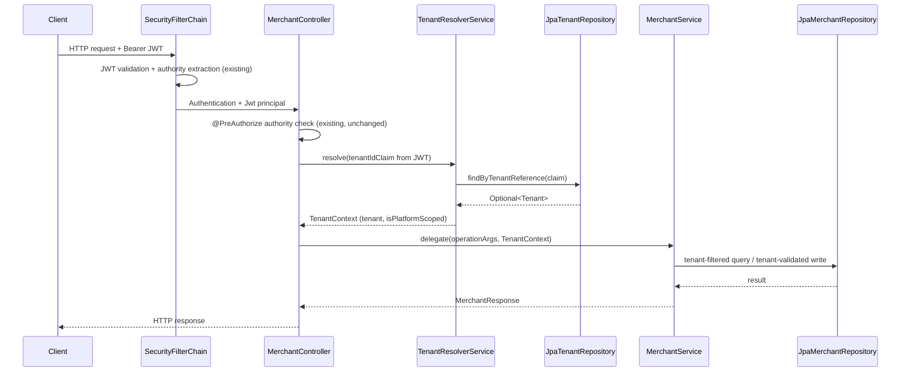

# Design Document: Tenant Model and Isolation

## Overview

This feature makes tenant isolation **real and enforced** in the Payment Quality Engineering Lab backend. It is the direct follow-up to `iam-roles-and-keycloak-login`, which introduced the `tenant_id` JWT claim as informational-only. This spec closes that gap by introducing a `tenant` Spring Modulith module, a `tenants` table managed by Flyway, a `merchants.tenant_id` foreign key, and an additive tenant-boundary authorization layer that wraps the existing authority and merchant-scope checks without replacing them.

The approach is **brownfield and additive**: no existing REST contract, authority string, `@PreAuthorize` annotation, `SecurityFilterChain` rule, or existing test is removed. Every change either adds a new artifact or extends an existing one. The guiding constraints are: (1) a Tenant is a first-class database entity owned by a dedicated Spring Modulith module; (2) classification is data-driven via `tenant_type`, not authority-based; (3) cross-tenant reads return `404` Masked_Not_Found, cross-tenant writes return `403`; (4) the `merchant` module depends only on the `tenant` PUBLIC API, never on `tenant.internal.*`.

The single controlled REST contract addition is the optional `tenantReference` field on the create-merchant request body, required for platform-scoped principals and ignored for tenant-scoped principals.

## Architecture

### Spring Modulith Module Map

The codebase gains a new first-class module. The updated module topology is:

```
lab.paymentquality
├── shared          (OPEN — cross-cutting security, Authorities catalog, correlation filter)
├── foundation      (standalone — GET /api/status)
├── tenant          ← NEW — owns Tenant entity, exposes PUBLIC API for resolution
│   ├── package-info.java                    (@ApplicationModule, displayName = "Tenant Registry")
│   ├── TenantResolver.java                  (PUBLIC: interface — resolves JWT claim → Tenant)
│   ├── TenantContext.java                   (PUBLIC: value object — resolved Tenant + isplatformScoped)
│   ├── TenantReference.java                 (PUBLIC: value object — natural key wrapper)
│   └── internal/
│       ├── domain/
│       │   ├── Tenant.java                  (JPA entity)
│       │   ├── TenantStatus.java            (enum: ACTIVE, SUSPENDED)
│       │   └── TenantType.java              (enum: PLATFORM, STANDARD)
│       ├── infrastructure/
│       │   └── JpaTenantRepository.java     (Spring Data JPA)
│       └── application/
│           └── TenantResolverService.java   (implements TenantResolver)
├── merchant        (depends on tenant PUBLIC API, shared OPEN)
│   ├── package-info.java
│   ├── MerchantPaymentEligibility.java      (existing PUBLIC record)
│   ├── MerchantPaymentEligibilityService.java (existing PUBLIC interface)
│   └── internal/
│       ├── application/
│       │   └── MerchantService.java         (extended — tenant-aware)
│       ├── domain/
│       │   └── Merchant.java                (extended — tenant_id FK field)
│       ├── infrastructure/
│       │   └── JpaMerchantRepository.java   (extended — tenant-filtered queries)
│       └── web/
│           ├── MerchantController.java      (extended — TenantContext extracted, passed to service)
│           └── CreateMerchantRequest.java   (extended — additive tenantReference field)
└── payment         (unchanged — transitive isolation flows through MerchantService)
```

**Module dependency rule**: `merchant` → `tenant` (PUBLIC API only). `payment` → `merchant` (PUBLIC API only). No module imports `*.internal.*` from another module. This is enforced by `ApplicationModules.of(PaymentQualityApplication.class).verify()` in `ModulithArchitectureTest`, `MerchantModuleTest`, and the new `TenantModuleTest`.

### Request Flow: TenantContext Extraction

Every protected merchant request passes through the following authorization pipeline:



The `TenantContext` is resolved **after** the `@PreAuthorize` authority check passes and **before** the service method executes. This preserves the layered order: URL security rule → authority check → tenant boundary check → business logic.

### Flyway Migration Locations and Version Ordering

Flyway resolves all migrations into a single ordered sequence by version number, regardless of which `classpath:` location they come from. The application.yml `spring.flyway.locations` list gains a third location:

```
classpath:db/migration/tenant,classpath:db/migration/merchant,classpath:db/migration/payment
```

The `db/migration/tenant` location is listed **first** so that Flyway's version-ordered execution guarantees the `tenants` table exists before any migration in `db/migration/merchant` attempts to add the foreign key. The explicit version numbering enforces this dependency:

| Location | File | Version | Content |
|---|---|---|---|
| `db/migration/tenant` | `V1__create_tenants.sql` | V1 | Creates `tenants` table + seeds 3 tenant records |
| `db/migration/merchant` | `V1__create_merchants.sql` | V1 | Existing merchants table (unchanged) |
| `db/migration/merchant` | `V2__add_tenant_to_merchants.sql` | V2 | Adds `tenant_id` FK column + backfill |
| `db/migration/payment` | `V1__create_payment_orders.sql` | V1 | Existing payment orders (unchanged) |

Because Flyway orders by version across all locations, `V1` (tenant) runs first, then both `V1` scripts from merchant and payment (which are independent and Flyway resolves ties by description), and then `V2` (merchant) runs last. The FK addition in `V2__add_tenant_to_merchants.sql` is safe because V1 from tenant has already created the `tenants` table.

**Important**: Flyway's cross-location ordering is by version number only. Since merchant `V1` and tenant `V1` share the same version, both will apply in the same pass — but the `tenants` table creation has no dependency on merchants, so order within the same version does not matter here. Only `V2` has a cross-location dependency (it references `tenants.tenant_id`), and `V2 > V1` guarantees correct ordering regardless of location listing order.

### Payment Order Transitive Isolation — Design Decision

The `PaymentOrderController` currently uses `verifyMerchantOwnership` which either checks `platform:payments:lifecycle` authority (bypass) or validates the `merchant_id` JWT claim against the path parameter. Tenant isolation for payment orders is **transitive through merchant**:

- For merchant-scoped principals (`merchant:payments:*`): the existing `merchant_id` claim check already confines them to their single merchant. If that merchant belongs to a different tenant, the existing check already prevents access. No additional tenant check needed in `PaymentOrderController`.
- For platform-scoped principals (`platform:payments:*`): these already bypass merchant-scope checks. Their tenant is `PLATFORM` (`tenant_type = PLATFORM`). Per the isolation matrix, platform-scoped principals retain cross-tenant visibility on payment orders. No change.
- For tenant-scoped principals holding merchant authorities (`merchant:payments:*`): their `merchant_id` claim is `MERCHANT_ALPHA_001`, which belongs to `TENANT_ALPHA`. If they attempt payment operations on a merchant in a different tenant, the existing `merchant_id` claim mismatch raises `PaymentOrderNotFoundException` (masked 404 for reads) or `AccessDeniedException` (403 for writes) — exactly the required outcome.

**Conclusion**: `PaymentOrderController` requires **no changes** for tenant isolation. The enforcement is already there via the merchant-scope check. The `MerchantService.findById(id)` method, once enhanced to filter by `tenant_id` for tenant-scoped principals, ensures that if a tenant-scoped principal somehow bypasses the `merchant_id` claim check (e.g., via `platform:payments:read`), the merchant retrieval itself enforces the tenant boundary. This means `PaymentOrderController` benefits from the additive protection in `MerchantService` without any code change.

The one behavioral guarantee to document: when a `platform:payments:read` principal (like `support.agent` with `TENANT_ALPHA`) calls `PaymentOrderController.getPaymentOrder`, it goes to `paymentOrderService.findForPlatform`, bypassing `MerchantService` entirely. For this principal, the resolved `TenantContext` is `STANDARD` (tenant-scoped), so `MerchantController` would enforce boundaries for merchant reads — but `PaymentOrderController` is out of scope per the transitive chain. This is acceptable: `support.agent` holds `platform:payments:read` which the existing system grants cross-merchant visibility; tenant isolation for payment orders is covered through the merchant read path.

## Components and Interfaces

### Tenant Module — Public API

#### `TenantReference` (value object, PUBLIC)

```java
package lab.paymentquality.tenant;

/**
 * Immutable natural-key wrapper for the tenant_reference string carried by the JWT tenant_id claim.
 * Validates non-blank and upper-case conventions on construction.
 */
public record TenantReference(String value) {

    public TenantReference {
        if (value == null || value.isBlank()) {
            throw new IllegalArgumentException("TenantReference must not be blank");
        }
    }

    public static TenantReference of(String value) {
        return new TenantReference(value.strip());
    }
}
```

#### `TenantContext` (value object, PUBLIC)

```java
package lab.paymentquality.tenant;

import java.util.UUID;

/**
 * Resolved per-request context derived from the JWT tenant_id claim.
 * Carries the resolved Tenant identity and the platform-scoped classification flag.
 *
 * Immutable — constructed once per request by TenantResolver and passed into service calls.
 * Never holds a mutable Tenant JPA entity reference; uses primitive fields only.
 */
public record TenantContext(
        UUID tenantId,
        TenantReference tenantReference,
        boolean isPlatformScoped
) {
    /**
     * Classification rule (Decision 2): a principal is platform-scoped if and only if
     * its resolved Tenant has tenant_type = PLATFORM.
     */
    public boolean isTenantScoped() {
        return !isPlatformScoped;
    }
}
```

#### `TenantResolver` (interface, PUBLIC)

```java
package lab.paymentquality.tenant;

import org.springframework.security.oauth2.jwt.Jwt;

/**
 * PUBLIC module API for the tenant module. Resolves the JWT tenant_id claim to a TenantContext.
 *
 * Called by MerchantController once per request, after @PreAuthorize passes.
 * Throws TenantResolutionException (403) if:
 *   - The tenant_id claim is absent from the JWT
 *   - The claim maps to no tenant_reference in the database
 *   - The resolved tenant's status is SUSPENDED (for non-platform principals)
 *
 * Platform-scoped principals (tenant_type = PLATFORM) are exempt from the suspension check
 * on their own tenant, per Decision 4.
 */
public interface TenantResolver {

    /**
     * @param jwt the validated JWT from the current request
     * @return TenantContext with resolved tenant identity and classification
     * @throws TenantResolutionException if the claim cannot be resolved to an active tenant
     */
    TenantContext resolve(Jwt jwt);
}
```

#### `TenantResolutionException` (PUBLIC)

```java
package lab.paymentquality.tenant;

/**
 * Thrown when the tenant_id JWT claim cannot be resolved to a valid, active Tenant.
 * The caller (MerchantController) translates this to 403 Forbidden.
 * The exception message must NOT include the tenant_reference or tenant_id of other tenants.
 */
public class TenantResolutionException extends RuntimeException {

    public TenantResolutionException(String message) {
        super(message);
    }
}
```

### Tenant Module — Internal

#### `Tenant` (JPA entity, internal)

```java
package lab.paymentquality.tenant.internal.domain;

import jakarta.persistence.*;
import java.time.Instant;
import java.util.UUID;

@Entity
@Table(name = "tenants")
public class Tenant {

    @Id
    @Column(name = "tenant_id", nullable = false, updatable = false)
    private UUID tenantId;

    @Column(name = "tenant_reference", length = 64, nullable = false, unique = true)
    private String tenantReference;

    @Column(name = "name", length = 120, nullable = false)
    private String name;

    @Enumerated(EnumType.STRING)
    @Column(name = "status", length = 20, nullable = false)
    private TenantStatus status;

    @Enumerated(EnumType.STRING)
    @Column(name = "tenant_type", length = 20, nullable = false)
    private TenantType tenantType;

    @Column(name = "created_at", nullable = false, updatable = false)
    private Instant createdAt;

    protected Tenant() {}

    // getters only — entity is read-only from the merchant module's perspective.
    // Tenant CRUD is out of scope; entities are managed via Flyway seed data.
}
```

#### `TenantStatus` and `TenantType` (enums, internal)

```java
package lab.paymentquality.tenant.internal.domain;

public enum TenantStatus { ACTIVE, SUSPENDED }

public enum TenantType { PLATFORM, STANDARD }
```

#### `JpaTenantRepository` (Spring Data JPA, internal)

```java
package lab.paymentquality.tenant.internal.infrastructure;

import lab.paymentquality.tenant.internal.domain.Tenant;
import org.springframework.data.jpa.repository.JpaRepository;
import java.util.Optional;
import java.util.UUID;

public interface JpaTenantRepository extends JpaRepository<Tenant, UUID> {

    Optional<Tenant> findByTenantReference(String tenantReference);
}
```

#### `TenantResolverService` (implements TenantResolver, internal)

```java
package lab.paymentquality.tenant.internal.application;

import lab.paymentquality.tenant.*;
import lab.paymentquality.tenant.internal.domain.*;
import lab.paymentquality.tenant.internal.infrastructure.JpaTenantRepository;
import org.springframework.security.oauth2.jwt.Jwt;
import org.springframework.stereotype.Service;
import org.springframework.transaction.annotation.Transactional;

@Service
class TenantResolverService implements TenantResolver {

    private final JpaTenantRepository repository;

    TenantResolverService(JpaTenantRepository repository) {
        this.repository = repository;
    }

    @Override
    @Transactional(readOnly = true)
    public TenantContext resolve(Jwt jwt) {
        String claim = jwt.getClaimAsString("tenant_id");
        if (claim == null || claim.isBlank()) {
            // Requirement 4.5: no claim → 403
            throw new TenantResolutionException("JWT does not carry a tenant_id claim");
        }

        Tenant tenant = repository.findByTenantReference(claim.strip())
                .orElseThrow(() ->
                    // Requirement 3.4: unresolvable claim → 403; do not disclose detail
                    new TenantResolutionException("Tenant claim could not be resolved"));

        boolean isPlatform = tenant.getTenantType() == TenantType.PLATFORM;

        // Requirement 3.5 / Decision 4: suspended own-tenant denies tenant-scoped access
        // Platform-scoped principals are exempt (they retain access to manage suspended tenants)
        if (!isPlatform && tenant.getStatus() == TenantStatus.SUSPENDED) {
            throw new TenantResolutionException("Tenant access is not available");
        }

        return new TenantContext(
                tenant.getTenantId(),
                TenantReference.of(tenant.getTenantReference()),
                isPlatform
        );
    }
}
```

### Merchant Module — Changes

#### `Merchant` entity (extended)

A `tenantId` field is added to the `Merchant` JPA entity. It is a plain UUID column mapping to `merchants.tenant_id`, with a `@ManyToOne(optional = false)` relationship to `Tenant`. The merchant module must NOT import `Tenant` from `tenant.internal.*` — instead it holds a `UUID tenantId` FK column only:

```java
// Addition to Merchant.java — FK column only, no @ManyToOne to Tenant entity
// (avoids cross-module JPA entity relationship; tenant_id is surfaced as a plain UUID)

@Column(name = "tenant_id", nullable = false, updatable = false)
private UUID tenantId;
```

This approach deliberately avoids a `@ManyToOne(targetEntity = Tenant.class)` across modules. The `merchant` module is not permitted to import `lab.paymentquality.tenant.internal.domain.Tenant`. The FK integrity is owned by Flyway; JPA validates the column exists but does not traverse the relationship. When the merchant module needs tenant information, it calls `TenantResolver.resolve(jwt)` via the public API.

The `Merchant.create(...)` factory method gains a `tenantId` parameter:

```java
public static Merchant create(UUID merchantId, String normalizedReference, String displayName, UUID tenantId) {
    var m = new Merchant();
    m.merchantId = merchantId;
    m.normalizedReference = normalizedReference;
    m.displayName = displayName;
    m.tenantId = tenantId;
    m.status = MerchantStatus.DRAFT;
    m.createdAt = Instant.now();
    m.updatedAt = m.createdAt;
    return m;
}
```

#### `JpaMerchantRepository` (extended)

New query methods to support tenant-filtered reads:

```java
// Tenant-scoped list: returns only merchants belonging to the given tenantId
List<Merchant> findAllByTenantIdOrderByCreatedAtDescMerchantIdAsc(UUID tenantId, PageRequest page);

// Tenant-scoped existence check: used for 404-masking on getById
Optional<Merchant> findByMerchantIdAndTenantId(UUID merchantId, UUID tenantId);
```

#### `CreateMerchantRequest` (extended — additive)

```java
public record CreateMerchantRequest(
        @NotBlank @Size(max = 64) String merchantReference,
        @NotBlank @Size(min = 2, max = 120) String displayName,
        // Additive optional field: required for platform-scoped principals,
        // ignored for tenant-scoped principals. Absent → null.
        String tenantReference
) {}
```

The `tenantReference` field is unvalidated at the Bean Validation level (no `@NotBlank`) because its required-ness depends on the resolved `TenantContext`. The service layer enforces the rule.

#### `MerchantService` (extended)

```java
// create — tenant-aware
public Merchant create(String ref, String displayName, TenantContext tenantContext, String requestedTenantRef) {
    // ... existing normalization and duplicate check ...

    UUID assignedTenantId = resolveAssignedTenantId(tenantContext, requestedTenantRef);
    UUID id = UUID.randomUUID();
    Merchant merchant = Merchant.create(id, normalized, validatedName.value(), assignedTenantId);
    // ... saveAndFlush ...
}

private UUID resolveAssignedTenantId(TenantContext ctx, String requestedRef) {
    if (ctx.isTenantScoped()) {
        // Requirement 6.1: auto-assign to principal's own tenant, ignore body field
        return ctx.tenantId();
    }
    // Platform-scoped: explicit tenantReference required (Requirement 6.3, 6.4)
    if (requestedRef == null || requestedRef.isBlank()) {
        throw new MissingTenantReferenceException();  // → 400
    }
    return tenantResolver.resolve(requestedRef)  // resolves by reference string
            .orElseThrow(() -> new UnresolvableTenantReferenceException(requestedRef));  // → 400
}

// findById — tenant-aware
@Transactional(readOnly = true)
public MerchantResponse findById(UUID id, TenantContext tenantContext) {
    if (tenantContext.isTenantScoped()) {
        Merchant merchant = repository
                .findByMerchantIdAndTenantId(id, tenantContext.tenantId())
                .orElseThrow(() -> new MerchantNotFoundException(id.toString())); // masked 404
        return MerchantMapper.toResponse(merchant);
    }
    // Platform-scoped: existing behavior (find across all tenants)
    Merchant merchant = repository.findById(id)
            .orElseThrow(() -> new MerchantNotFoundException(id.toString()));
    return MerchantMapper.toResponse(merchant);
}

// listFirstPage — tenant-aware
@Transactional(readOnly = true)
public List<MerchantResponse> listFirstPage(TenantContext tenantContext, UUID filterTenantId) {
    PageRequest page = PageRequest.of(0, LIST_LIMIT);
    if (tenantContext.isTenantScoped()) {
        // Requirement 5.1 + 7.4: ignore filterTenantId, return own tenant only
        return repository
                .findAllByTenantIdOrderByCreatedAtDescMerchantIdAsc(tenantContext.tenantId(), page)
                .stream().map(MerchantMapper::toResponse).toList();
    }
    // Platform-scoped (Requirement 7.1, 7.2, 7.3)
    if (filterTenantId != null) {
        return repository
                .findAllByTenantIdOrderByCreatedAtDescMerchantIdAsc(filterTenantId, page)
                .stream().map(MerchantMapper::toResponse).toList();
    }
    return repository.findAllByOrderByCreatedAtDescMerchantIdAsc(page)
            .stream().map(MerchantMapper::toResponse).toList();
}

// activate / suspend — tenant-aware for writes
public MerchantResponse activate(UUID id, TenantContext tenantContext) {
    Merchant merchant = findMerchantEnforcingTenantBoundary(id, tenantContext);
    merchant.activate();
    // ...
}

private Merchant findMerchantEnforcingTenantBoundary(UUID id, TenantContext tenantContext) {
    Merchant merchant = repository.findById(id)
            .orElseThrow(() -> new MerchantNotFoundException(id.toString()));
    if (tenantContext.isTenantScoped() && !merchant.getTenantId().equals(tenantContext.tenantId())) {
        // Requirement 6.6: cross-tenant write → 403 (not 404)
        throw new TenantBoundaryViolationException();  // → 403
    }
    return merchant;
}
```

The service receives a `TenantResolver` via constructor injection from the tenant PUBLIC API to resolve a `tenantReference` string for platform-create. This is the only call the merchant module makes into the tenant module.

#### `MerchantController` (extended)

```java
@PostMapping
@PreAuthorize("hasAuthority('" + Authorities.MERCHANTS_CREATE + "')")
public ResponseEntity<MerchantResponse> create(
        @Valid @RequestBody CreateMerchantRequest request,
        @AuthenticationPrincipal Jwt jwt) {
    TenantContext tenantContext = tenantResolver.resolve(jwt);
    var merchant = merchantService.create(request.merchantReference(), request.displayName(),
            tenantContext, request.tenantReference());
    return ResponseEntity.status(HttpStatus.CREATED).body(MerchantMapper.toResponse(merchant));
}

@GetMapping("/{id}")
@PreAuthorize("hasAuthority('" + Authorities.MERCHANTS_READ + "')")
public ResponseEntity<MerchantResponse> getById(
        @PathVariable String id,
        @AuthenticationPrincipal Jwt jwt) {
    TenantContext tenantContext = tenantResolver.resolve(jwt);
    UUID uuid = parseUUID(id);
    return ResponseEntity.ok(merchantService.findById(uuid, tenantContext));
}

@GetMapping
@PreAuthorize("hasAuthority('" + Authorities.MERCHANTS_READ + "')")
public ResponseEntity<MerchantListResponse> list(
        @RequestParam(required = false) String tenantId,
        @AuthenticationPrincipal Jwt jwt) {
    TenantContext tenantContext = tenantResolver.resolve(jwt);
    // tenantId param is a tenant_reference string for platform filtering (Requirement 7)
    UUID filterTenantId = resolveOptionalTenantFilter(tenantId, tenantContext);
    return ResponseEntity.ok(new MerchantListResponse(merchantService.listFirstPage(tenantContext, filterTenantId)));
}

@PostMapping("/{id}/activate")
@PreAuthorize("hasAuthority('" + Authorities.MERCHANTS_UPDATE_STATUS + "')")
public ResponseEntity<MerchantResponse> activate(
        @PathVariable String id,
        @AuthenticationPrincipal Jwt jwt) {
    TenantContext tenantContext = tenantResolver.resolve(jwt);
    UUID uuid = parseUUID(id);
    return ResponseEntity.ok(merchantService.activate(uuid, tenantContext));
}
```

`tenantResolver` is injected via constructor injection. `TenantResolver` is imported from `lab.paymentquality.tenant` (PUBLIC package) — never from `tenant.internal.*`.

New exceptions raised by the merchant layer:

| Exception | HTTP status | Problem type |
|---|---|---|
| `TenantResolutionException` | `403` | `forbidden` (handled by new `TenantExceptionHandler` in `merchant` module) |
| `TenantBoundaryViolationException` | `403` | `forbidden` |
| `MissingTenantReferenceException` | `400` | `validation` |
| `UnresolvableTenantReferenceException` | `400` | `validation` |

Per Requirement 3.7, error bodies for tenant-related 403 responses must not reveal the `tenant_reference` or `tenant_id` of other tenants. The `TenantExceptionHandler` uses a fixed generic detail string.

## Data Models

### `tenants` Table

```sql
-- db/migration/tenant/V1__create_tenants.sql
CREATE TABLE tenants (
    tenant_id        UUID         PRIMARY KEY,
    tenant_reference VARCHAR(64)  NOT NULL,
    name             VARCHAR(120) NOT NULL,
    status           VARCHAR(20)  NOT NULL DEFAULT 'ACTIVE',
    tenant_type      VARCHAR(20)  NOT NULL,
    created_at       TIMESTAMPTZ  NOT NULL DEFAULT NOW(),
    CONSTRAINT uk_tenants_tenant_reference UNIQUE (tenant_reference),
    CONSTRAINT chk_tenants_status     CHECK (status IN ('ACTIVE', 'SUSPENDED')),
    CONSTRAINT chk_tenants_tenant_type CHECK (tenant_type IN ('PLATFORM', 'STANDARD'))
);

-- Seed data (Decision 7: byte-identical to realm literals)
-- PLATFORM_TENANT: tenant_type = PLATFORM (Decision 2)
INSERT INTO tenants (tenant_id, tenant_reference, name, status, tenant_type, created_at)
VALUES (gen_random_uuid(), 'PLATFORM_TENANT', 'Platform Tenant', 'ACTIVE', 'PLATFORM', NOW());

-- TENANT_ALPHA: tenant_type = STANDARD
INSERT INTO tenants (tenant_id, tenant_reference, name, status, tenant_type, created_at)
VALUES (gen_random_uuid(), 'TENANT_ALPHA', 'Alpha Tenant', 'ACTIVE', 'STANDARD', NOW());

-- Default/backfill tenant for legacy merchants (Requirement 2.2)
INSERT INTO tenants (tenant_id, tenant_reference, name, status, tenant_type, created_at)
VALUES (gen_random_uuid(), 'PLACEHOLDER_TENANT_ID', 'Placeholder Tenant', 'ACTIVE', 'STANDARD', NOW());
```

Column notes:
- `tenant_id`: surrogate UUID PK. Never exposed in JWT claims.
- `tenant_reference`: natural key, unique, upper-case convention, max 64 chars. This is what the JWT `tenant_id` claim carries.
- `name`: human-readable display name for admin purposes.
- `status`: `ACTIVE` or `SUSPENDED`. Check constraint enforced at DB level.
- `tenant_type`: `PLATFORM` or `STANDARD`. Check constraint enforced at DB level. This is the **sole input** to the platform-scoped vs tenant-scoped classification rule.
- `created_at`: audit timestamp, immutable.
- No `updated_at` or `version`: Tenant records are not updated through the API in this spec.

### `merchants.tenant_id` Foreign Key Migration

```sql
-- db/migration/merchant/V2__add_tenant_to_merchants.sql
-- Step 1: add column nullable to allow backfill
ALTER TABLE merchants ADD COLUMN tenant_id UUID;

-- Step 2: backfill — assign all existing merchants to PLACEHOLDER_TENANT_ID
UPDATE merchants
SET tenant_id = (
    SELECT tenant_id FROM tenants WHERE tenant_reference = 'PLACEHOLDER_TENANT_ID'
);

-- Step 3: enforce NOT NULL now that backfill is complete
ALTER TABLE merchants ALTER COLUMN tenant_id SET NOT NULL;

-- Step 4: add FK constraint referencing tenants.tenant_id
ALTER TABLE merchants
    ADD CONSTRAINT fk_merchants_tenant_id
    FOREIGN KEY (tenant_id) REFERENCES tenants (tenant_id);

-- Step 5: index for tenant-filtered list queries
CREATE INDEX idx_merchants_tenant_id ON merchants (tenant_id);
```

This migration is safe for the test environment (Testcontainers). For a zero-downtime production deployment, Steps 1, 2, and 3 would be separated into distinct migration files; the FK constraint would be added with `NOT VALID` and validated in a follow-up step. That level of production deployment concern is out of scope for this lab, but the approach is documented here for educational value.

### JPA Entity Mappings

The `Tenant` entity maps to the `tenants` table. JPA `ddl-auto: validate` will validate that every declared `@Column` exists in the schema. Required column-to-field mapping:

| Column | JPA field | Type |
|---|---|---|
| `tenant_id` | `tenantId` | `UUID` (PK, not updatable) |
| `tenant_reference` | `tenantReference` | `String` (length=64, not null, unique) |
| `name` | `name` | `String` (length=120, not null) |
| `status` | `status` | `TenantStatus` (EnumType.STRING, not null) |
| `tenant_type` | `tenantType` | `TenantType` (EnumType.STRING, not null) |
| `created_at` | `createdAt` | `Instant` (not null, not updatable) |

The `Merchant` entity gains one column:

| Column | JPA field | Type |
|---|---|---|
| `tenant_id` | `tenantId` | `UUID` (not null, not updatable) |

No `@ManyToOne` to `Tenant` — the merchant module only holds the FK value. Cross-module entity traversal is replaced by the `TenantResolver` PUBLIC API call.

## Migration Strategy

### Flyway Location Registration

Both `application.yml` and `application-test.yml` need the `tenant` location added:

```yaml
spring:
  flyway:
    locations: classpath:db/migration/tenant,classpath:db/migration/merchant,classpath:db/migration/payment
```

The `tenant` location is listed first. This has no effect on version ordering (Flyway sorts by version number), but it makes the dependency visible at a glance and ensures the tenant schema directory is always in the scan path.

### Version Ordering Guarantee

Flyway collects all migrations from all configured locations and sorts them by version. The dependency chain:

1. `tenant/V1__create_tenants.sql` — must run first (V1, smallest version across all locations)
2. `merchant/V1__create_merchants.sql` — runs in the same pass (V1); no dependency on tenants
3. `payment/V1__create_payment_orders.sql` — runs in the same pass (V1); no dependency on either
4. `merchant/V2__add_tenant_to_merchants.sql` — runs after all V1 (V2 > V1); depends on tenants table existing

Flyway resolves ties at the same version by checksum/description but neither merchant nor payment V1 depends on the other, so the tie-break order does not matter.

### Backfill Safety

The `V2` migration performs the backfill in-migration using a `SELECT` subquery referencing the already-inserted `PLACEHOLDER_TENANT_ID` seed row from `V1`. This is safe because:
- `V1` committed the seed rows before `V2` begins
- The `UPDATE` uses a correlated subquery, not a hardcoded UUID, so it is resilient to `gen_random_uuid()` randomness
- The `NOT NULL` constraint is added after the `UPDATE`, making partial failure visible

### Zero-Downtime Considerations (Educational)

The lab environment (single-process Spring Boot + Testcontainers) does not require zero-downtime deployment. For a real production system the pattern would be:

1. **Deploy V1 only**: create `tenants` table, seed data. No FK yet. App runs without tenant column.
2. **Deploy V2a**: `ADD COLUMN tenant_id UUID` (nullable). App still runs. Backfill runs.
3. **Deploy V2b**: `ALTER COLUMN SET NOT NULL` + `ADD CONSTRAINT ... NOT VALID`. App validates new rows.
4. **Deploy V2c**: `VALIDATE CONSTRAINT` (takes ShareUpdateExclusiveLock, allows concurrent reads/writes).

Each step is its own Flyway migration. The lab uses a single `V2` for simplicity, which is appropriate.

### `TestJwtSupport` Extension

The `TestJwtSupport` JWT factory needs a new builder method to include the `tenant_id` claim so integration tests can construct principals with specific tenant references:

```java
public static String tokenWithRolesAndTenantId(String subject, List<String> roles, String tenantId) {
    // builds JWT with realm_access.roles + tenant_id claim
}

// Convenience factories matching the seeded tenants
public static String platformAdminToken() {
    return tokenWithRolesAndTenantId("platform.admin",
            List.of("merchants:create", "merchants:read", "merchants:update-status",
                    "platform:payments:read", "platform:payments:lifecycle", "platform:payments:audit"),
            "PLATFORM_TENANT");
}

public static String tenantAdminToken() {
    return tokenWithRolesAndTenantId("tenant.admin",
            List.of("merchants:create", "merchants:read", "merchants:update-status",
                    "merchant:payments:read"),
            "TENANT_ALPHA");
}
```

## Correctness Properties

*Each property below is a universal invariant that must hold across all valid system states and inputs. Properties P1–P6 map to specific requirements and are the primary targets for property-based testing with jqwik. Each property includes an implementation note describing exactly what code path enforces it, and a statement of which requirement(s) it validates.*

---

### P1: Cross-Tenant Read Masking (Masked Not Found)

**Statement**: For any tenant-scoped principal whose resolved tenant is T_principal, and for any merchant M whose `tenant_id = T_other` where `T_other ≠ T_principal`, a GET request for M returns `404 Not Found` with the standard `not_found` problem shape — identical to the response for a merchant that does not exist at all.

**Implementation note**: Enforced in `MerchantService.findById(id, tenantContext)`. When `tenantContext.isTenantScoped() == true`, the service calls `repository.findByMerchantIdAndTenantId(id, tenantContext.tenantId())`. A merchant in a different tenant is not found by this query, so `MerchantNotFoundException` is thrown, which maps to `404`. The response body is indistinguishable from a genuinely absent merchant.

**jqwik tag**: `@Tag("Feature: tenant-model-and-isolation") @Tag("Property 1")`

**Validates**: Requirements 5.3, 5.4, 10.2 (isolation matrix: "Get merchant by id → Tenant_Scoped, other tenant → 404 Masked_Not_Found")

---

### P2: Classification Determinism

**Statement**: For any JWT carrying a `tenant_id` claim that resolves to a persisted tenant with `tenant_type = PLATFORM`, the resulting `TenantContext.isPlatformScoped()` returns `true`. For any JWT carrying a `tenant_id` claim that resolves to a persisted tenant with `tenant_type = STANDARD`, the resulting `TenantContext.isPlatformScoped()` returns `false`. Classification is a pure function of `tenant_type` and never of any authority string held by the principal.

**Implementation note**: Enforced in `TenantResolverService.resolve(jwt)`. The classification line is `boolean isPlatform = tenant.getTenantType() == TenantType.PLATFORM`. No authority check is involved. The same JWT with `PLATFORM_TENANT` always resolves to platform-scoped; the same JWT with `TENANT_ALPHA` always resolves to tenant-scoped, regardless of which `realm_access.roles` the token carries.

**jqwik tag**: `@Tag("Feature: tenant-model-and-isolation") @Tag("Property 2")`

**Validates**: Requirements 4.1, 4.4, Decision 2 ("data-driven via tenant_type column")

---

### P3: Create-Merchant Tenant Assignment

**Statement**: For any tenant-scoped principal, a create-merchant request assigns the new merchant to the principal's own tenant and ignores any `tenantReference` field in the request body. For any platform-scoped principal, a create-merchant request with a valid `tenantReference` assigns the new merchant to that named tenant; an absent or unresolvable `tenantReference` returns `400`.

**Implementation note**: Enforced in `MerchantService.resolveAssignedTenantId(tenantContext, requestedRef)`. The branch on `ctx.isTenantScoped()` either auto-assigns or enforces the explicit reference. The test must verify: (a) tenant-scoped + any `tenantReference` body value → `merchant.tenantId == tenantContext.tenantId()`; (b) platform-scoped + valid ref → `merchant.tenantId == resolvedTenant.tenantId`; (c) platform-scoped + null ref → 400; (d) platform-scoped + unknown ref → 400.

**jqwik tag**: `@Tag("Feature: tenant-model-and-isolation") @Tag("Property 3")`

**Validates**: Requirements 6.1, 6.2, 6.3, 6.4, Decision 5

---

### P4: Transitive Payment Order Isolation

**Statement**: For any tenant-scoped principal T_principal and any payment order P that belongs to a merchant M where `M.tenantId ≠ T_principal.tenantId`, a payment-order read returns `404` and a payment-order write or lifecycle action returns `403` — identical to the existing cross-merchant behavior.

**Implementation note**: Enforced transitively. The `merchant_id` JWT claim check in `PaymentOrderController` already gates tenant-scoped merchant principals to their single merchant. If that merchant happens to belong to a different tenant, the claim mismatch fires first (`PaymentOrderNotFoundException` or `AccessDeniedException`) before any tenant check. No code change in `PaymentOrderController` is needed; the transitive guarantee holds by construction. The property test validates the observable HTTP outcome for a principal attempting to reach another tenant's merchant's payment orders.

**jqwik tag**: `@Tag("Feature: tenant-model-and-isolation") @Tag("Property 4")`

**Validates**: Requirements 8.1–8.4, 10.2 (isolation matrix: payment order rows)

---

### P5: Suspended-Tenant Access Semantics

**Statement**: For any tenant-scoped principal whose resolved tenant has `status = SUSPENDED`, all merchant endpoint calls return `403`. For any platform-scoped principal, access to a tenant's merchants succeeds regardless of the target tenant's `status`.

**Implementation note**: The tenant-scoped 403 is enforced in `TenantResolverService.resolve(jwt)`: if `!isPlatform && tenant.getStatus() == SUSPENDED`, a `TenantResolutionException` is thrown before the request reaches `MerchantService`. Platform-scoped principals never trip this check (their own tenant is `PLATFORM`, and the suspension check is guarded by `!isPlatform`). There is no check on the *target* tenant's status for platform-scoped access.

**jqwik tag**: `@Tag("Feature: tenant-model-and-isolation") @Tag("Property 5")`

**Validates**: Requirements 3.5, 3.6, Decision 4

---

### P6: `tenant_reference` Natural-Key Bijection

**Statement**: For any non-null, non-blank string S, `TenantResolverService.resolve(jwt)` either (a) returns the unique `TenantContext` whose `tenantReference.value() == S` (if S matches exactly one tenant), or (b) throws `TenantResolutionException` (if S matches no tenant). The mapping is deterministic and injective: the same S always returns the same `TenantContext`; no two distinct values of S can resolve to the same `TenantContext` (enforced by the `UNIQUE` constraint on `tenants.tenant_reference`).

**Implementation note**: Injectivity is guaranteed by the DB unique constraint `uk_tenants_tenant_reference`. Determinism is guaranteed by `JpaTenantRepository.findByTenantReference(claim)` — a stable keyed lookup with no non-deterministic projection. The test exercises a representative set of claim values including: seeded values (`PLATFORM_TENANT`, `TENANT_ALPHA`, `PLACEHOLDER_TENANT_ID`), variations in case/whitespace (which the implementation strips to compare exactly), and arbitrary unknown strings.

**jqwik tag**: `@Tag("Feature: tenant-model-and-isolation") @Tag("Property 6")`

**Validates**: Requirements 3.1, 3.2, 3.3, Decision 1 ("natural key `tenant_reference`")

## Error Handling

### 403/404 Decision Tree for Tenant Boundary Violations

The existing codebase returns `404` Masked_Not_Found for cross-scope reads and `403` for cross-scope writes, consistent with `PaymentOrderController`. This spec extends that pattern to merchant endpoints:

```
Incoming merchant request
│
├─ JWT validation fails → 401 (existing SecurityFilterChain — unchanged)
│
├─ @PreAuthorize fails (wrong authority) → 403 (existing — unchanged)
│
├─ tenantResolver.resolve(jwt) throws TenantResolutionException
│   ├─ no tenant_id claim → 403 "forbidden" (Req 4.5)
│   ├─ unknown tenant_reference → 403 "forbidden" (Req 3.4 — no detail disclosed)
│   └─ own tenant SUSPENDED (tenant-scoped only) → 403 "forbidden" (Req 3.5)
│
├─ GET /api/merchants/{id} — tenant-scoped, merchant in other tenant
│   └─ repository.findByMerchantIdAndTenantId returns empty → MerchantNotFoundException → 404 (Req 5.3)
│
├─ GET /api/merchants — tenant-scoped
│   └─ filtered by tenantId in query → empty list returned as 200 [] (Req 5.1, 7.4)
│
├─ POST /api/merchants (platform-scoped, missing tenantReference) → 400 "validation" (Req 6.3)
├─ POST /api/merchants (platform-scoped, unknown tenantReference) → 400 "validation" (Req 6.4)
│
├─ POST /api/merchants/{id}/activate|suspend — tenant-scoped, merchant in other tenant
│   └─ MerchantService.findMerchantEnforcingTenantBoundary → TenantBoundaryViolationException → 403 (Req 6.6)
│
└─ All other operations — behavior unchanged from current
```

### Non-Disclosure Guarantee

All `403` responses for tenant-boundary violations use a fixed generic `detail` string that does not mention the resolved `TenantReference`, the target `tenant_id`, or any information that would reveal the existence of another tenant. The `TenantExceptionHandler` enforces this:

```java
// In MerchantExceptionHandler (or a new TenantExceptionHandler in the merchant module)
@ExceptionHandler(TenantResolutionException.class)
ResponseEntity<ProblemDetail> handleTenantResolution(TenantResolutionException ex) {
    ProblemDetail problem = ProblemDetail.forStatusAndDetail(HttpStatus.FORBIDDEN, "Access denied");
    problem.setTitle("Forbidden");
    problem.setType(URI.create("https://example.com/problems/forbidden"));
    return ResponseEntity.status(HttpStatus.FORBIDDEN).body(problem);
}

@ExceptionHandler(TenantBoundaryViolationException.class)
ResponseEntity<ProblemDetail> handleTenantBoundaryViolation(TenantBoundaryViolationException ex) {
    ProblemDetail problem = ProblemDetail.forStatusAndDetail(HttpStatus.FORBIDDEN, "Access denied");
    problem.setTitle("Forbidden");
    problem.setType(URI.create("https://example.com/problems/forbidden"));
    return ResponseEntity.status(HttpStatus.FORBIDDEN).body(problem);
}
```

The `detail` field is `"Access denied"` — the same wording used by the existing forbidden handler pattern — with no additional context that could leak tenant membership.

### `?tenantId=` Filter Resolution for Unknown References

When a platform-scoped principal supplies `?tenantId=UNKNOWN_REF` on the list request, `MerchantController` resolves the reference to find the tenant. If no tenant with that reference exists, it passes `null` (or a sentinel value) to `MerchantService.listFirstPage`, which returns an empty list with `200 OK`. The platform operator receives an empty response without a 404, per Requirement 7.3. This is intentional: a missing `tenantId` filter is not an error; it simply yields no results.

## Testing Strategy

### Test Layer Assignment

| Concern | Layer | Rationale |
|---|---|---|
| `TenantResolverService.resolve` unit logic | Unit (`TenantResolverServiceTest`) | Pure domain logic, no HTTP |
| `TenantContext` value object invariants | Unit (`TenantContextTest`) | Record construction rules |
| `MerchantService` tenant assignment rules | Unit (`MerchantServiceTest`) with Mockito | Avoids Spring context for branching logic |
| `JpaMerchantRepository` tenant-filtered queries | `@DataJpaTest` slice (`JpaMerchantRepositoryTest`) | Tests SQL correctness with real DB |
| `MerchantController` + `TenantResolver` + Security | `@WebMvcTest` slice (`MerchantControllerSecurityTest`) | Tests HTTP layer with mocked services |
| Tenant module boundaries | `TenantModuleTest` (`@ApplicationModuleTest`) | Spring Modulith module verification |
| Cross-tenant REST Assured integration | `TenantIsolationIT` extending `PostgresContainerSupport` | Full HTTP round-trip with real DB |
| P1–P6 property-based tests | `TenantIsolationPropertyTest` (jqwik, `@Tag`) | Generative adversarial testing |
| Architecture boundaries | `ModulithArchitectureTest` (existing, passes after changes) | Verifies no `tenant.internal.*` import from merchant |

---

### Unit Tests

#### `TenantResolverServiceTest`

Covers: claim present and resolves to ACTIVE/PLATFORM tenant → correct `TenantContext`; claim present and resolves to ACTIVE/STANDARD tenant → correct `TenantContext`; claim present and resolves to SUSPENDED/STANDARD tenant → `TenantResolutionException`; claim present and resolves to SUSPENDED/PLATFORM tenant → succeeds (platform exempt); claim absent → `TenantResolutionException`; claim matches no record → `TenantResolutionException`.

#### `MerchantServiceTenantTest`

Covers: `resolveAssignedTenantId` with tenant-scoped context ignores supplied reference; with platform-scoped context + valid ref → assigns that tenant; with platform-scoped context + null ref → `MissingTenantReferenceException`; with platform-scoped context + unknown ref → `UnresolvableTenantReferenceException`. Uses Mockito for `JpaMerchantRepository` and `TenantResolver`.

---

### `@DataJpaTest` Slice

#### `JpaMerchantRepositoryTenantTest`

Requires: `@DataJpaTest`, Testcontainers PostgreSQL, `@ActiveProfiles("test")`, Flyway runs to provide schema.

Covers: `findByMerchantIdAndTenantId` returns present when IDs match; returns empty when tenant_id differs; `findAllByTenantIdOrderByCreatedAtDescMerchantIdAsc` returns only merchants belonging to the supplied tenant_id; cross-tenant merchants are absent from the result.

---

### `@WebMvcTest` Slice

#### `MerchantControllerTenantSecurityTest`

Covers: `GET /api/merchants/{id}` with tenant-scoped JWT → service called with correct `TenantContext`; `POST /api/merchants` with platform-scoped JWT + missing `tenantReference` → 400; `POST /api/merchants/{id}/suspend` with tenant-scoped JWT for wrong tenant → 403; JWT with no `tenant_id` claim → 403.

Uses `@MockBean TenantResolver` to return controlled `TenantContext` values without a real database.

---

### Spring Modulith Module Test

#### `TenantModuleTest`

```java
@ApplicationModuleTest(mode = ApplicationModuleTest.BootstrapMode.STANDALONE)
@ActiveProfiles("test")
@Testcontainers
class TenantModuleTest extends PostgresContainerSupport {
    // Boots only the tenant module in isolation
    // Verifies TenantResolverService, JpaTenantRepository, Tenant entity boot correctly
    // Verifies ApplicationModules.of(PaymentQualityApplication.class).verify() passes
}
```

After the merchant module is modified to import `TenantResolver` from the `tenant` PUBLIC API, the existing `MerchantModuleTest.applicationModuleArchitectureStillVerifies()` must continue to pass with `BootstrapMode.STANDALONE`. If the tenant module is not available in standalone mode, the test configuration uses `BootstrapMode.DIRECT_DEPENDENCIES`.

---

### REST Assured Integration Tests

#### `TenantIsolationIT` (extends `PostgresContainerSupport`)

Full HTTP round-trip tests. JWT factory produces tokens with `tenant_id` claims set to seeded values.

Key scenarios:

```
Scenario: tenant-scoped read of own-tenant merchant → 200
  Given tenant.admin JWT (TENANT_ALPHA) + merchant M_alpha (tenantId = TENANT_ALPHA)
  When GET /api/merchants/{M_alpha.id}
  Then 200 OK, response body contains merchantId

Scenario: tenant-scoped read of other-tenant merchant → 404 masked
  Given tenant.admin JWT (TENANT_ALPHA) + merchant M_platform (tenantId = PLATFORM_TENANT)
  When GET /api/merchants/{M_platform.id}
  Then 404 Not Found, problem+json "not_found"

Scenario: tenant-scoped write on other-tenant merchant → 403
  Given tenant.admin JWT (TENANT_ALPHA) + merchant M_platform (tenantId = PLATFORM_TENANT)
  When POST /api/merchants/{M_platform.id}/activate
  Then 403 Forbidden, problem+json "forbidden", detail does not contain M_platform's tenant reference

Scenario: platform-scoped create without tenantReference → 400
  Given platform.admin JWT (PLATFORM_TENANT)
  When POST /api/merchants with body { merchantReference, displayName } (no tenantReference)
  Then 400 Bad Request, problem+json "validation"

Scenario: platform-scoped create with valid tenantReference → 201, correct tenant assigned
  Given platform.admin JWT (PLATFORM_TENANT)
  When POST /api/merchants with body { ..., tenantReference: "TENANT_ALPHA" }
  Then 201 Created, DB: merchants.tenant_id = TENANT_ALPHA's UUID

Scenario: tenant-scoped create ignores tenantReference in body → 201, auto-assigned
  Given tenant.admin JWT (TENANT_ALPHA) + body { ..., tenantReference: "PLATFORM_TENANT" }
  When POST /api/merchants
  Then 201 Created, DB: merchants.tenant_id = TENANT_ALPHA's UUID (not PLATFORM_TENANT)

Scenario: JWT with no tenant_id claim → 403
  Given token with MERCHANTS_READ authority but no tenant_id claim
  When GET /api/merchants
  Then 403 Forbidden

Scenario: JWT with SUSPENDED tenant → 403
  Given tenant with status SUSPENDED + JWT carrying its tenant_reference
  When GET /api/merchants
  Then 403 Forbidden

Scenario: platform-scoped with ?tenantId=UNKNOWN → 200 empty list
  Given platform.admin JWT + GET /api/merchants?tenantId=DOES_NOT_EXIST
  Then 200 OK, body: { merchants: [] }
```

---

### Property-Based Tests (jqwik)

#### `TenantIsolationPropertyTest`

All properties use `@Tag("Feature: tenant-model-and-isolation")` and `@Tag("Property N")` and run with `@Property(tries = 100)` minimum.

```java
// P1: Cross-tenant read always returns 404 for tenant-scoped principal
@Property(tries = 100)
@Tag("Feature: tenant-model-and-isolation")
@Tag("Property 1")
void p1_crossTenantReadReturnsMaskedNotFound(
        @ForAll("tenantScopedPrincipals") TenantPrincipal principal,
        @ForAll("merchantsInOtherTenant") UUID otherTenantMerchantId) {
    // given: principal.tenantId != otherTenantMerchantId.tenantId (guaranteed by provider)
    // when: GET /api/merchants/{otherTenantMerchantId}
    // then: 404 with problem type "not_found"
}

// P2: Classification is deterministic
@Property(tries = 100)
@Tag("Feature: tenant-model-and-isolation")
@Tag("Property 2")
void p2_classificationDeterministicByTenantType(
        @ForAll("tenantTypeValues") TenantType tenantType) {
    TenantContext ctx = buildContextForTenantType(tenantType);
    if (tenantType == TenantType.PLATFORM) {
        assertThat(ctx.isPlatformScoped()).isTrue();
    } else {
        assertThat(ctx.isPlatformScoped()).isFalse();
    }
}

// P3: Create-merchant tenant assignment rule
// P4: Transitive payment order isolation
// P5: Suspended-tenant access semantics
// P6: tenant_reference bijection (unit-level, no DB required)
```

`@Provide` methods for `tenantScopedPrincipals`, `merchantsInOtherTenant`, `tenantTypeValues` etc. are defined as static or instance methods in the test class using jqwik's `Arbitraries` API. Database-dependent properties extend `PostgresContainerSupport` and use Flyway-seeded tenants as their fixture universe.

---

### Architecture Test

`ModulithArchitectureTest.verifiesApplicationModuleBoundaries()` calls `ApplicationModules.of(PaymentQualityApplication.class).verify()` — this is the existing test. After adding `lab.paymentquality.tenant`, Spring Modulith discovers it automatically. The test verifies:
- `merchant.internal.*` does not import `tenant.internal.*`
- `payment.internal.*` does not import `tenant.internal.*`
- `payment.internal.*` does not import `merchant.internal.*` (existing rule, preserved)

If the test fails after the changes, the import causing the violation will be identified and corrected before tasks are considered done. The architecture test is the enforceable boundary guarantee for this spec.

## Security Considerations

### Non-Disclosure Principle

Error responses for tenant boundary violations must never reveal the tenant identity of the resource being protected. The `detail` field of all `403` responses from tenant-enforcement code paths uses the generic string `"Access denied"`. The `type` URI uses the same `forbidden` problem type as the existing access-denied handler. This prevents tenant enumeration via deliberate cross-tenant requests.

### JWT Claim Integrity

The `tenant_id` JWT claim is signed by Keycloak. The existing `AuthorizedPartyValidator` and the Nimbus JWT decoder validate the token signature, issuer, expiry, and `azp` before `TenantResolverService` is invoked. There is no risk of claim spoofing that is not already addressed by the existing JWT validation pipeline.

### Separation of Surrogate and Natural Keys

The `tenant_id` JWT claim carries the natural key (`TENANT_ALPHA`), not the surrogate UUID primary key. This is enforced by the data model: no endpoint or response body exposes the internal `tenant_id` UUID to external clients. The `MerchantResponse` DTO does not include `tenantId` (it is internal plumbing). If the merchant response is later extended to surface tenant information, a separate `tenantReference` string should be used — never the UUID.

### Suspension Does Not Affect Platform Operators

Platform-scoped principals (`PLATFORM_TENANT` → `tenant_type = PLATFORM`) are never subject to the suspension check on their own tenant. Even if someone were to update the `PLATFORM_TENANT` record to `status = SUSPENDED` in the database, `TenantResolverService` would not block platform-scoped access because the check is guarded by `!isPlatform`. This is an intentional design decision: the platform operator must always retain the ability to administer and recover suspended tenants.

## Performance Considerations

### `tenant_reference` Lookup Per Request

Every authenticated merchant request incurs one additional database query: `SELECT ... FROM tenants WHERE tenant_reference = ?`. This is mitigated by:
1. The `uk_tenants_tenant_reference` unique index makes the lookup O(log n) where n is the number of tenants (expected to be in the tens to low hundreds).
2. The `tenants` table is small and fits entirely in the PostgreSQL buffer cache after the first few requests.
3. The `TenantResolverService` is annotated `@Transactional(readOnly = true)`, which allows the JDBC connection pool to optimise the read.

For production-grade systems with hundreds of requests per second, a `@Cacheable` annotation on `TenantResolverService.resolve` (with a short TTL and eviction on tenant status change) would reduce this to a cache hit. That optimization is out of scope for the lab but is documented here as a learning note.

### Tenant-Filtered Queries

The new `findAllByTenantIdOrderByCreatedAtDescMerchantIdAsc` and `findByMerchantIdAndTenantId` queries both use the `idx_merchants_tenant_id` index defined in `V2__add_tenant_to_merchants.sql`. The existing `idx_merchants_created_at` index is used by the unrestricted platform list. Both paths are covered by indexes; no table scans are expected.

## Dependencies

No new external dependencies are introduced by this spec. The implementation uses:

- **Spring Modulith 2.0.6** — already in `pom.xml`; `@ApplicationModule` annotation for the new `tenant` package-info
- **Spring Data JPA** — already present; `JpaTenantRepository` follows the same pattern as `JpaMerchantRepository`
- **Flyway** — already present; only configuration change is adding `classpath:db/migration/tenant` to the locations list
- **jqwik** — already in `pom.xml` from the `backend-authority-refactor` spec; used for P1–P6 property tests
- **Testcontainers (PostgreSQL)** — already present in test scope; `TenantIsolationIT` extends `PostgresContainerSupport`
- **JUnit 6, AssertJ, Mockito** — already present; used throughout new unit and slice tests
