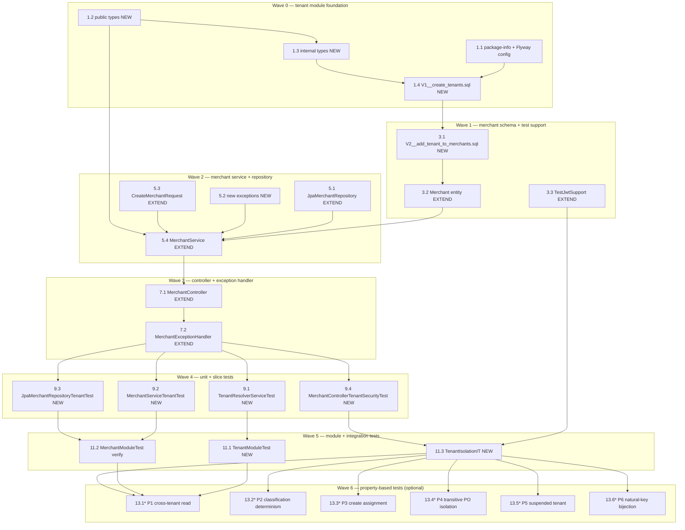

# Implementation Plan: Tenant Model and Isolation

## Overview

Brownfield, additive enforcement of tenant isolation on the `merchant` module.
Work is sequenced low-risk-first per the design's Migration Strategy:
**Wave 0 (tenant module foundation) → Wave 1 (merchant schema + test support) →
Wave 2 (merchant service/repository) → Wave 3 (controller + exception handler) →
Wave 4 (unit + slice tests) → Wave 5 (module + integration tests) →
Wave 6 (property-based tests, optional)**.

Every step keeps `./mvnw test` and `./mvnw verify` green, preserves all existing REST
contracts, status codes, and headers, and changes no `payment` module code.
The single controlled contract addition is the optional `tenantReference` field on
`POST /api/merchants`.

Language: **Java 25** (specified by the design — no language selection required).
Property-based tests use **jqwik** (already in `pom.xml` from `backend-authority-refactor`),
≥100 iterations, tagged `Feature: tenant-model-and-isolation, Property {n}: ...`.

Conventions used below:
- **[NEW]** = create a new file. **[EXTEND]** = modify an existing file (additive / in-place).
- Test sub-tasks are marked optional with `*` **except** module tests and integration tests,
  which are NON-optional.

## Tasks

- [ ] 1. Wave 0 — Tenant module foundation (no dependencies)

  - [ ] 1.1 Create `tenant` module package-info and Flyway location config [NEW + EXTEND]
    - Create `apps/backend/src/main/java/lab/paymentquality/tenant/package-info.java`
      - Annotate with `@ApplicationModule(displayName = "Tenant Registry")`
    - Extend `apps/backend/src/main/resources/application.yml`
      - Add `classpath:db/migration/tenant` as the first entry in `spring.flyway.locations`
      - Result: `classpath:db/migration/tenant,classpath:db/migration/merchant,classpath:db/migration/payment`
    - Mirror the same change in `apps/backend/src/test/resources/application-test.yml` (if present) or the test application config so Flyway finds the new location in the test Postgres container
    - _Design: Architecture §Spring Modulith Module Map; Flyway Migration Locations_
    - _Requirements: 1.6, 9.5_

  - [ ] 1.2 Create tenant module public types [NEW]
    - Create `apps/backend/src/main/java/lab/paymentquality/tenant/TenantReference.java`
      - Immutable record; validates non-blank on construction; `static TenantReference of(String)`
    - Create `apps/backend/src/main/java/lab/paymentquality/tenant/TenantContext.java`
      - Immutable record: `UUID tenantId`, `TenantReference tenantReference`, `boolean isPlatformScoped`
      - Convenience method `isTenantScoped()` returns `!isPlatformScoped`
    - Create `apps/backend/src/main/java/lab/paymentquality/tenant/TenantResolutionException.java`
      - Extends `RuntimeException`; single `String message` constructor
    - Create `apps/backend/src/main/java/lab/paymentquality/tenant/TenantResolver.java`
      - Public interface; single method `TenantContext resolve(Jwt jwt)`
      - Javadoc documents the three failure cases (absent claim, unresolvable claim, suspended tenant)
    - _Design: Components §Tenant Module — Public API_
    - _Requirements: 3.1–3.5, 4.1, 4.5_


  - [ ] 1.3 Create tenant module internal types [NEW]
    - Create `apps/backend/src/main/java/lab/paymentquality/tenant/internal/domain/TenantStatus.java`
      - Enum: `ACTIVE`, `SUSPENDED`
    - Create `apps/backend/src/main/java/lab/paymentquality/tenant/internal/domain/TenantType.java`
      - Enum: `PLATFORM`, `STANDARD`
    - Create `apps/backend/src/main/java/lab/paymentquality/tenant/internal/domain/Tenant.java`
      - JPA entity mapped to `tenants` table
      - Fields: `UUID tenantId` (PK, not updatable), `String tenantReference` (length=64, unique), `String name` (length=120), `TenantStatus status` (EnumType.STRING), `TenantType tenantType` (EnumType.STRING), `Instant createdAt` (not updatable)
      - Protected no-arg constructor; getters only (read-only entity)
    - Create `apps/backend/src/main/java/lab/paymentquality/tenant/internal/infrastructure/JpaTenantRepository.java`
      - Extends `JpaRepository<Tenant, UUID>`
      - Method: `Optional<Tenant> findByTenantReference(String tenantReference)`
    - Create `apps/backend/src/main/java/lab/paymentquality/tenant/internal/application/TenantResolverService.java`
      - Package-private class annotated `@Service`, implements `TenantResolver`
      - Constructor injection of `JpaTenantRepository`
      - `@Transactional(readOnly = true)` on `resolve(Jwt jwt)`
      - Logic: extract `tenant_id` claim → blank → throw; `findByTenantReference` → absent → throw; `!isPlatform && SUSPENDED` → throw; return new `TenantContext`
    - _Design: Components §Tenant Module — Internal_
    - _Requirements: 1.5, 1.6, 3.1, 3.3–3.5, 4.1, 4.4_

  - [ ] 1.4 Create Flyway tenant migration V1 [NEW]
    - Create `apps/backend/src/main/resources/db/migration/tenant/V1__create_tenants.sql`
      - `CREATE TABLE tenants` with columns: `tenant_id UUID PRIMARY KEY`, `tenant_reference VARCHAR(64) NOT NULL`, `name VARCHAR(120) NOT NULL`, `status VARCHAR(20) NOT NULL DEFAULT 'ACTIVE'`, `tenant_type VARCHAR(20) NOT NULL`, `created_at TIMESTAMPTZ NOT NULL DEFAULT NOW()`
      - `CONSTRAINT uk_tenants_tenant_reference UNIQUE (tenant_reference)`
      - `CONSTRAINT chk_tenants_status CHECK (status IN ('ACTIVE', 'SUSPENDED'))`
      - `CONSTRAINT chk_tenants_tenant_type CHECK (tenant_type IN ('PLATFORM', 'STANDARD'))`
      - Three seed `INSERT` statements: `PLATFORM_TENANT` (tenant_type=PLATFORM), `TENANT_ALPHA` (tenant_type=STANDARD), `PLACEHOLDER_TENANT_ID` (tenant_type=STANDARD)
      - Use `gen_random_uuid()` for surrogate PKs
    - _Design: Data Models §`tenants` Table_
    - _Requirements: 1.1–1.4, 2.2, 3.2_

- [ ] 2. Checkpoint — Wave 0 complete
  - Run `./mvnw test` from `apps/backend`; confirm `ModulithArchitectureTest` and `MerchantModuleTest` are green and the application context starts with the new Flyway location.
  - Ask the user if any questions arise before continuing.


- [ ] 3. Wave 1 — Merchant schema migration and test-support extension

  - [ ] 3.1 Create Flyway merchant migration V2 [NEW]
    - Create `apps/backend/src/main/resources/db/migration/merchant/V2__add_tenant_to_merchants.sql`
      - Step 1: `ALTER TABLE merchants ADD COLUMN tenant_id UUID;` (nullable)
      - Step 2: `UPDATE merchants SET tenant_id = (SELECT tenant_id FROM tenants WHERE tenant_reference = 'PLACEHOLDER_TENANT_ID');`
      - Step 3: `ALTER TABLE merchants ALTER COLUMN tenant_id SET NOT NULL;`
      - Step 4: `ALTER TABLE merchants ADD CONSTRAINT fk_merchants_tenant_id FOREIGN KEY (tenant_id) REFERENCES tenants (tenant_id);`
      - Step 5: `CREATE INDEX idx_merchants_tenant_id ON merchants (tenant_id);`
    - _Design: Data Models §`merchants.tenant_id` Foreign Key Migration_
    - _Requirements: 2.1, 2.3, 2.4_

  - [ ] 3.2 Extend `Merchant` entity with `tenantId` FK field [EXTEND]
    - Modify `apps/backend/src/main/java/lab/paymentquality/merchant/internal/domain/Merchant.java`
    - Add `@Column(name = "tenant_id", nullable = false, updatable = false) private UUID tenantId;`
      - No `@ManyToOne` to `Tenant` — FK value only to keep module boundary clean
    - Add `tenantId` parameter to the `Merchant.create(...)` static factory method
    - Add `getTenantId()` getter
    - _Design: Components §Merchant Module — Changes, Merchant entity; Data Models §JPA Entity Mappings_
    - _Requirements: 2.5, 2.6, 9.5_

  - [ ] 3.3 Extend `TestJwtSupport` with `tenant_id` claim builders [EXTEND]
    - Modify `apps/backend/src/test/java/lab/paymentquality/testsupport/TestJwtSupport.java`
    - Add `tokenWithRolesAndTenantId(String subject, List<String> roles, String tenantId)` builder that appends `.claim("tenant_id", tenantId)` to the JWT
    - Add convenience factories: `platformAdminToken()` (subject `platform.admin`, platform roles, `PLATFORM_TENANT`), `tenantAdminToken()` (subject `tenant.admin`, tenant roles, `TENANT_ALPHA`)
    - Add `tokenWithoutTenantClaim()` for the "no tenant_id claim → 403" scenario
    - Ensure ALL existing token builders still include valid `azp` claim (already present from `backend-authority-refactor` spec) — do not remove existing claims
    - _Design: Migration Strategy §`TestJwtSupport` Extension_
    - _Requirements: 9.4_

- [ ] 4. Checkpoint — Wave 1 complete
  - Run `./mvnw test` from `apps/backend`; confirm Flyway migrations V1 + V2 run cleanly in the Testcontainers Postgres, JPA schema validation passes, and existing merchant/payment tests are still green.
  - Ask the user if any questions arise before continuing.


- [ ] 5. Wave 2 — Merchant repository, service, request, and new exceptions

  - [ ] 5.1 Extend `JpaMerchantRepository` with tenant-filtered query methods [EXTEND]
    - Modify `apps/backend/src/main/java/lab/paymentquality/merchant/internal/infrastructure/JpaMerchantRepository.java`
    - Add: `Optional<Merchant> findByMerchantIdAndTenantId(UUID merchantId, UUID tenantId)`
    - Add: `List<Merchant> findAllByTenantIdOrderByCreatedAtDescMerchantIdAsc(UUID tenantId, PageRequest page)`
    - Existing `findAllByOrderByCreatedAtDescMerchantIdAsc(PageRequest page)` method is preserved unchanged
    - _Design: Components §JpaMerchantRepository (extended)_
    - _Requirements: 5.1, 5.2, 5.3_

  - [ ] 5.2 Add new merchant-layer exception classes [NEW]
    - Create `apps/backend/src/main/java/lab/paymentquality/merchant/internal/domain/TenantBoundaryViolationException.java`
      - Extends `RuntimeException`; no-arg constructor with fixed message
    - Create `apps/backend/src/main/java/lab/paymentquality/merchant/internal/domain/MissingTenantReferenceException.java`
      - Extends `RuntimeException`; no-arg constructor
    - Create `apps/backend/src/main/java/lab/paymentquality/merchant/internal/domain/UnresolvableTenantReferenceException.java`
      - Extends `RuntimeException`; constructor accepts the unresolvable reference string
    - _Design: Components §MerchantController (extended), exception table_
    - _Requirements: 6.3, 6.4, 6.6_

  - [ ] 5.3 Extend `CreateMerchantRequest` with additive `tenantReference` field [EXTEND]
    - Modify `apps/backend/src/main/java/lab/paymentquality/merchant/internal/web/CreateMerchantRequest.java`
    - Add `String tenantReference` as an additive optional field (no `@NotBlank`; null when absent)
    - Preserve existing `merchantReference` and `displayName` fields and their validation annotations unchanged
    - _Design: Components §CreateMerchantRequest (extended)_
    - _Requirements: 6.2–6.4_


  - [ ] 5.4 Extend `MerchantService` with tenant-aware methods [EXTEND]
    - Modify `apps/backend/src/main/java/lab/paymentquality/merchant/internal/application/MerchantService.java`
    - Add constructor injection of `TenantResolver` (imported from `lab.paymentquality.tenant`, never from `tenant.internal.*`)
    - Extend `create(...)` to accept `TenantContext tenantContext` and `String requestedTenantRef`; add private `resolveAssignedTenantId(TenantContext, String)` implementing the platform/tenant branch: tenant-scoped → auto-assign, platform-scoped + null ref → throw `MissingTenantReferenceException`, platform-scoped + unknown ref → throw `UnresolvableTenantReferenceException`
    - Extend `findById(UUID id)` to `findById(UUID id, TenantContext tenantContext)`; tenant-scoped → `findByMerchantIdAndTenantId`; platform-scoped → existing `findById`
    - Extend `listFirstPage()` to `listFirstPage(TenantContext tenantContext, UUID filterTenantId)`; tenant-scoped → `findAllByTenantIdOrderBy...`; platform-scoped + filter → filtered; platform-scoped no filter → existing all-tenants query
    - Extend `activate(UUID id)` and `suspend(UUID id)` to accept `TenantContext tenantContext`; add private `findMerchantEnforcingTenantBoundary(UUID, TenantContext)` that loads merchant then checks `isTenantScoped && merchant.getTenantId() != tenantContext.tenantId()` → throw `TenantBoundaryViolationException`
    - Pass `tenantId` to `Merchant.create(...)` factory in the create flow
    - _Design: Components §MerchantService (extended)_
    - _Requirements: 5.1–5.3, 6.1–6.4, 6.6, 7.1–7.4_

- [ ] 6. Checkpoint — Wave 2 complete
  - Run `./mvnw test` from `apps/backend`; confirm compilation and existing unit tests pass.
  - Ask the user if any questions arise before continuing.


- [ ] 7. Wave 3 — Controller and exception handler

  - [ ] 7.1 Extend `MerchantController` with `TenantContext` resolution and `?tenantId=` filter [EXTEND]
    - Modify `apps/backend/src/main/java/lab/paymentquality/merchant/internal/web/MerchantController.java`
    - Add constructor injection of `TenantResolver` (from `lab.paymentquality.tenant`)
    - Extend `create(...)`: add `@AuthenticationPrincipal Jwt jwt`; call `tenantResolver.resolve(jwt)` before delegating to `merchantService.create(..., tenantContext, request.tenantReference())`
    - Extend `getById(...)`: resolve `TenantContext`; pass to `merchantService.findById(uuid, tenantContext)`
    - Extend `list(...)`: add `@RequestParam(required = false) String tenantId`; resolve `TenantContext`; add private `resolveOptionalTenantFilter(String tenantId, TenantContext)` that returns the UUID for a platform-scoped principal (null if unresolvable) and ignores the param for tenant-scoped principals; pass both to `merchantService.listFirstPage(tenantContext, filterTenantId)`
    - Extend `activate(...)` and `suspend(...)`: resolve `TenantContext`; pass to updated service methods
    - All existing `@PreAuthorize` annotations are preserved unchanged
    - _Design: Components §MerchantController (extended); Request Flow sequence diagram_
    - _Requirements: 5.6, 6.7, 7.1–7.4, 9.1_

  - [ ] 7.2 Extend `MerchantExceptionHandler` with tenant exception mappings [EXTEND]
    - Modify `apps/backend/src/main/java/lab/paymentquality/merchant/internal/web/MerchantExceptionHandler.java`
    - Add `@ExceptionHandler(TenantResolutionException.class)` → `403 Forbidden`, `ProblemDetail` with `detail = "Access denied"`, `title = "Forbidden"`, `type = URI.create("https://example.com/problems/forbidden")`
    - Add `@ExceptionHandler(TenantBoundaryViolationException.class)` → `403 Forbidden`, same generic shape
    - Add `@ExceptionHandler(MissingTenantReferenceException.class)` → `400 Bad Request`, `ProblemDetail` with `type = "validation"`
    - Add `@ExceptionHandler(UnresolvableTenantReferenceException.class)` → `400 Bad Request`, same `validation` shape
    - `detail` strings for 403 responses must NOT mention `tenant_reference` or `tenant_id` of any tenant (non-disclosure guarantee from Requirement 3.7)
    - _Design: Error Handling §403/404 Decision Tree; Non-Disclosure Guarantee_
    - _Requirements: 3.7, 6.3, 6.4, 6.6, 9.1_

- [ ] 8. Checkpoint — Wave 3 complete
  - Run `./mvnw test` from `apps/backend`; confirm `ModulithArchitectureTest`, `MerchantModuleTest`, and all existing REST Assured `*IT` tests are still green.
  - Ask the user if any questions arise before continuing.


- [ ] 9. Wave 4 — Unit tests and web-layer slice tests

  - [ ] 9.1 Write `TenantResolverServiceTest` unit tests [NEW]
    - Create `apps/backend/src/test/java/lab/paymentquality/tenant/internal/application/TenantResolverServiceTest.java`
    - Uses Mockito for `JpaTenantRepository`; no Spring context
    - Cover: claim present + ACTIVE PLATFORM tenant → `TenantContext` with `isPlatformScoped = true`; claim present + ACTIVE STANDARD tenant → `isPlatformScoped = false`; claim present + SUSPENDED STANDARD tenant → `TenantResolutionException`; claim present + SUSPENDED PLATFORM tenant → succeeds (platform exempt); claim absent / blank → `TenantResolutionException`; claim matches no record → `TenantResolutionException`
    - _Design: Testing Strategy §Unit Tests §`TenantResolverServiceTest`_
    - _Requirements: 3.3–3.5, 4.1_

  - [ ] 9.2 Write `MerchantServiceTenantTest` unit tests [NEW]
    - Create `apps/backend/src/test/java/lab/paymentquality/merchant/internal/application/MerchantServiceTenantTest.java`
    - Uses Mockito for `JpaMerchantRepository` and `TenantResolver`; no Spring context
    - Cover: `resolveAssignedTenantId` — tenant-scoped ignores body field, auto-assigns; platform-scoped + valid ref → correct tenant assigned; platform-scoped + null ref → `MissingTenantReferenceException`; platform-scoped + unknown ref → `UnresolvableTenantReferenceException`
    - Cover: `findById` — tenant-scoped, merchant matches → returns merchant; tenant-scoped, merchant in other tenant → `MerchantNotFoundException`
    - Cover: `findMerchantEnforcingTenantBoundary` — tenant-scoped, same tenant → proceeds; tenant-scoped, other tenant → `TenantBoundaryViolationException`
    - _Design: Testing Strategy §Unit Tests §`MerchantServiceTenantTest`_
    - _Requirements: 5.2, 5.3, 6.1–6.4, 6.6_

  - [ ] 9.3 Write `JpaMerchantRepositoryTenantTest` `@DataJpaTest` slice [NEW]
    - Create `apps/backend/src/test/java/lab/paymentquality/merchant/internal/infrastructure/JpaMerchantRepositoryTenantTest.java`
    - `@DataJpaTest`, `@ActiveProfiles("test")`, Testcontainers Postgres, Flyway runs to provide full schema
    - Cover: `findByMerchantIdAndTenantId` — matching IDs → present; wrong tenant_id → empty; `findAllByTenantIdOrderByCreatedAtDescMerchantIdAsc` — returns only merchants for supplied tenantId; cross-tenant merchants absent from result; ordering (created_at desc, merchant_id asc) is preserved
    - _Design: Testing Strategy §`@DataJpaTest` Slice_
    - _Requirements: 5.1, 5.2, 5.3_

  - [ ] 9.4 Write `MerchantControllerTenantSecurityTest` `@WebMvcTest` slice [NEW]
    - Create `apps/backend/src/test/java/lab/paymentquality/merchant/internal/web/MerchantControllerTenantSecurityTest.java`
    - `@WebMvcTest(MerchantController.class)`, `@MockBean TenantResolver`, `@MockBean MerchantService`, imports `TestJwtConfiguration`
    - Cover: `GET /api/merchants/{id}` with tenant-scoped JWT → `TenantResolver.resolve` called once, service called with correct `TenantContext`; `POST /api/merchants` with platform-scoped JWT and missing `tenantReference` body field → 400; `POST /api/merchants/{id}/suspend` where service throws `TenantBoundaryViolationException` → 403, `application/problem+json`, `detail` does not contain tenant reference; JWT with no `tenant_id` claim and resolver throws `TenantResolutionException` → 403
    - Verify response `Content-Type: application/problem+json` on all 4xx responses
    - _Design: Testing Strategy §`@WebMvcTest` Slice_
    - _Requirements: 3.4, 3.7, 4.5, 6.3, 6.6_

- [ ] 10. Checkpoint — Wave 4 complete
  - Run `./mvnw test` from `apps/backend`; ensure all 4 new test classes and all existing tests pass.
  - Ask the user if any questions arise before continuing.


- [ ] 11. Wave 5 — Spring Modulith module test and REST Assured integration tests

  - [ ] 11.1 Write `TenantModuleTest` Spring Modulith module test [NEW, NON-optional]
    - Create `apps/backend/src/test/java/lab/paymentquality/tenant/TenantModuleTest.java`
    - `@ApplicationModuleTest(mode = BootstrapMode.STANDALONE)`, `@ActiveProfiles("test")`, `@Testcontainers`, extends `PostgresContainerSupport`
    - Boots only the `tenant` module in isolation; verifies `TenantResolverService`, `JpaTenantRepository`, and `Tenant` entity boot correctly
    - Verifies `ApplicationModules.of(PaymentQualityApplication.class).verify()` passes — confirms no cross-module `internal` package import
    - _Design: Testing Strategy §Spring Modulith Module Test §`TenantModuleTest`_
    - _Requirements: 9.5_

  - [ ] 11.2 Verify `MerchantModuleTest` still passes after merchant module changes [NON-optional]
    - Run `./mvnw verify` — confirm existing `MerchantModuleTest` (standalone and direct-dependency bootstrap modes) is green after the merchant module gained a dependency on the `tenant` PUBLIC API
    - If the test fails due to the new `TenantResolver` dependency not being satisfied in standalone mode, switch the relevant bootstrap mode to `DIRECT_DEPENDENCIES` and document the reason as a comment
    - _Design: Architecture §Module dependency rule_
    - _Requirements: 9.5_

  - [ ] 11.3 Write `TenantIsolationIT` REST Assured integration tests [NEW, NON-optional]
    - Create `apps/backend/src/test/java/lab/paymentquality/security/TenantIsolationIT.java`
    - Extends `PostgresContainerSupport`; `@ActiveProfiles("test")`; uses `TestJwtSupport` token factories from task 3.3
    - Cover all 9 scenarios from the design Testing Strategy:
      1. Tenant-scoped read of own-tenant merchant → 200
      2. Tenant-scoped read of other-tenant merchant → 404 + problem type `not_found`
      3. Tenant-scoped write (activate) on other-tenant merchant → 403 + `forbidden`; response `detail` does not contain the foreign tenant reference
      4. Platform-scoped create without `tenantReference` body field → 400 + `validation`
      5. Platform-scoped create with valid `tenantReference` → 201; verify DB: `merchants.tenant_id` equals TENANT_ALPHA's UUID
      6. Tenant-scoped create ignores `tenantReference` in body → 201; verify DB: `merchants.tenant_id` equals TENANT_ALPHA's UUID (not PLATFORM_TENANT)
      7. JWT with no `tenant_id` claim → 403 + `forbidden`
      8. JWT with SUSPENDED tenant → 403 + `forbidden`
      9. Platform-scoped with `?tenantId=DOES_NOT_EXIST` → 200 + empty merchant list
    - Assert `Content-Type: application/problem+json` on all 4xx responses
    - Assert `X-Correlation-ID` header is present on all responses (existing contract)
    - _Design: Testing Strategy §REST Assured Integration Tests §`TenantIsolationIT`_
    - _Requirements: 3.4, 3.6, 3.7, 5.2, 5.3, 6.1–6.4, 6.6, 7.3, 9.1, 10.2, 10.3_

- [ ] 12. Checkpoint — Wave 5 complete
  - Run `./mvnw verify` from `apps/backend`; confirm Security_Suite, `ModulithArchitectureTest`, `MerchantModuleTest`, `TenantModuleTest`, `PaymentModuleTest`, `TenantIsolationIT`, and all existing `*IT` REST Assured tests are green.
  - Confirm no REST contract / status / header / business-logic change on non-tenant-boundary paths.
  - Ask the user if any questions arise before continuing.


- [ ] 13. Wave 6 — Property-based tests (optional)

  - [ ]* 13.1 Write P1 — Cross-tenant read masking [NEW]
    - Create `apps/backend/src/test/java/lab/paymentquality/tenant/TenantIsolationPropertyTest.java`
    - **Property 1: Cross-tenant read always returns 404 Masked_Not_Found for tenant-scoped principal**
    - Generate: tenant-scoped principal (TENANT_ALPHA), merchant IDs belonging to PLATFORM_TENANT; assert every `GET /api/merchants/{id}` returns 404 with problem type `not_found`
    - `@Property(tries = 100)`, tagged `Feature: tenant-model-and-isolation, Property 1`
    - _Design: Correctness Properties §P1_
    - _Requirements: 5.3, 5.4, 10.2_

  - [ ]* 13.2 Write P2 — Classification determinism [NEW, in `TenantIsolationPropertyTest`]
    - **Property 2: Classification is deterministic — `tenant_type = PLATFORM` → platform-scoped; `tenant_type = STANDARD` → tenant-scoped; never authority-based**
    - Unit-level jqwik property on `TenantContext` construction; generate `TenantType` values; assert `isPlatformScoped` is `true` iff `PLATFORM`
    - `@Property(tries = 100)`, tagged `Feature: tenant-model-and-isolation, Property 2`
    - _Design: Correctness Properties §P2_
    - _Requirements: 4.1, 4.4_

  - [ ]* 13.3 Write P3 — Create-merchant tenant assignment [NEW, in `TenantIsolationPropertyTest`]
    - **Property 3: Create-merchant tenant assignment — tenant-scoped auto-assigns and ignores body field; platform-scoped requires explicit valid `tenantReference`**
    - Generate: (a) tenant-scoped context + arbitrary `tenantReference` body values → persisted `tenant_id` always equals principal's resolved tenant; (b) platform-scoped context + arbitrary valid/invalid refs → 201 or 400 as per rule
    - `@Property(tries = 100)`, tagged `Feature: tenant-model-and-isolation, Property 3`
    - _Design: Correctness Properties §P3_
    - _Requirements: 6.1–6.4_

  - [ ]* 13.4 Write P4 — Transitive payment order isolation [NEW, in `TenantIsolationPropertyTest`]
    - **Property 4: A tenant-scoped principal cannot reach payment orders of a merchant in another tenant — reads → 404, writes → 403**
    - Generate: TENANT_ALPHA principal + merchant IDs belonging to PLATFORM_TENANT's merchants; assert payment-order reads return 404, lifecycle actions return 403
    - `@Property(tries = 100)`, tagged `Feature: tenant-model-and-isolation, Property 4`
    - _Design: Correctness Properties §P4_
    - _Requirements: 8.2, 8.3, 10.2_

  - [ ]* 13.5 Write P5 — Suspended-tenant access semantics [NEW, in `TenantIsolationPropertyTest`]
    - **Property 5: Tenant-scoped principal with SUSPENDED own-tenant → 403 on all merchant endpoints; platform-scoped principal → access retained**
    - For the tenant-scoped side: temporarily set TENANT_ALPHA status to SUSPENDED in the test DB, run any merchant endpoint, assert 403; restore to ACTIVE after assertion
    - `@Property(tries = 100)`, tagged `Feature: tenant-model-and-isolation, Property 5`
    - _Design: Correctness Properties §P5_
    - _Requirements: 3.5, 3.6_

  - [ ]* 13.6 Write P6 — `tenant_reference` natural-key bijection [NEW, unit-level in `TenantIsolationPropertyTest`]
    - **Property 6: `tenant_reference` resolution is deterministic and injective — the same claim always returns the same `TenantContext`; unknown claims always throw**
    - Unit-level; generate: seeded reference values → always resolve; arbitrary unknown strings → always throw; case/whitespace variants → throw (exact match required)
    - `@Property(tries = 100)`, tagged `Feature: tenant-model-and-isolation, Property 6`
    - _Design: Correctness Properties §P6_
    - _Requirements: 3.1, 3.4_

- [ ] 14. Final checkpoint — full regression
  - Run `./mvnw test` then `./mvnw verify` from `apps/backend`; confirm Security_Suite, `TenantModuleTest`, `MerchantModuleTest`, `PaymentModuleTest`, `ModulithArchitectureTest`, `TenantIsolationIT`, all existing `*IT` REST Assured tests, and (if executed) `TenantIsolationPropertyTest` P1–P6 are all green.
  - Confirm the single controlled REST contract addition (`tenantReference` field on `POST /api/merchants`) does not break any existing test (it is an additive optional field).
  - Confirm no `payment` module source file was modified.
  - Confirm no frontend/Playwright file was created or modified.

## Notes

- Tasks marked `*` are optional property-based test sub-tasks (jqwik, ≥100 iterations, tagged `Feature: tenant-model-and-isolation, Property {n}`). Core implementation and NON-optional test tasks must all be completed.
- **No payment module changes.** `PaymentOrderController` provides transitive tenant isolation by construction via the existing `merchant_id` claim check. No task in this plan touches `payment` module source.
- **No frontend changes.** The only user-visible change is the additive `tenantReference` field on `POST /api/merchants` and the `?tenantId=` filter parameter on `GET /api/merchants`.
- **Module boundary rule.** The `merchant` module imports only `lab.paymentquality.tenant.*` (PUBLIC) — never `lab.paymentquality.tenant.internal.*`. This is enforced by `ModulithArchitectureTest`. Any violation must be fixed before the task is considered complete.
- **Non-disclosure.** All `403` responses from tenant-boundary code paths use `detail = "Access denied"` with no tenant reference values in the body. This is an explicit acceptance criterion on tasks 7.2 and 11.3.
- **Flyway version ordering.** `db/migration/tenant/V1` must run before `db/migration/merchant/V2`. This is guaranteed by Flyway's version-number ordering across all configured locations; the `tenant` location is listed first in `application.yml` as a human-readability aid only.
- **Existing tests must remain green.** No existing `@PreAuthorize`, `SecurityFilterChain` rule, or REST contract changes. Additive changes only: new `tenantId` field on `Merchant`, new `tenantReference` field on `CreateMerchantRequest`, new `?tenantId=` parameter on the list endpoint.
- **`TestJwtSupport` extension is additive.** New token factories add `tenant_id` claim; existing builders are extended to include it. No existing assertion is weakened.

## Task Dependency Graph

Tasks that write to the same file are placed in different waves. Foundation (tenant module) is Wave 0 and unblocks all subsequent work. Schema migrations (Wave 1) must complete before service/repository changes (Wave 2). Tests follow the code they cover (Waves 4–6).

```json
{
  "waves": [
    { "id": 0, "tasks": ["1.1", "1.2", "1.3", "1.4"] },
    { "id": 1, "tasks": ["3.1", "3.2", "3.3"] },
    { "id": 2, "tasks": ["5.1", "5.2", "5.3", "5.4"] },
    { "id": 3, "tasks": ["7.1", "7.2"] },
    { "id": 4, "tasks": ["9.1", "9.2", "9.3", "9.4"] },
    { "id": 5, "tasks": ["11.1", "11.2", "11.3"] },
    { "id": 6, "tasks": ["13.1", "13.2", "13.3", "13.4", "13.5", "13.6"] }
  ]
}
```


