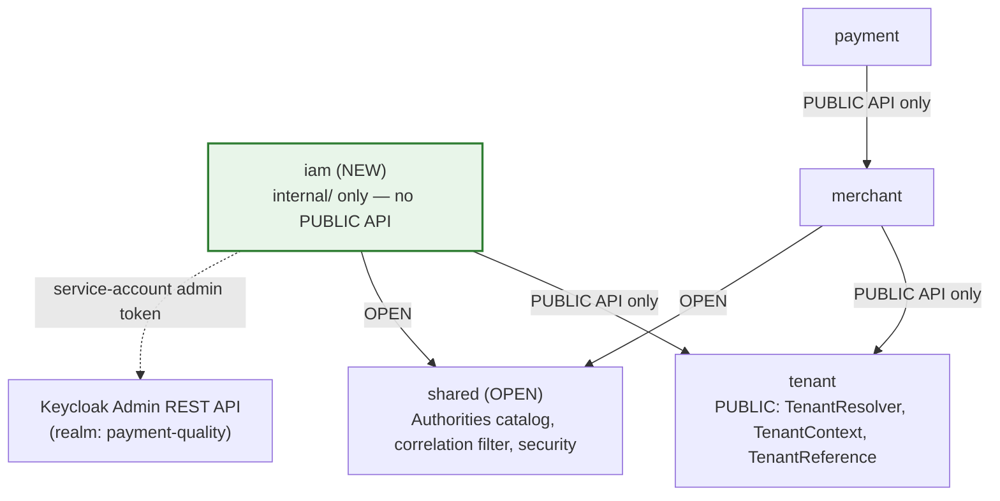
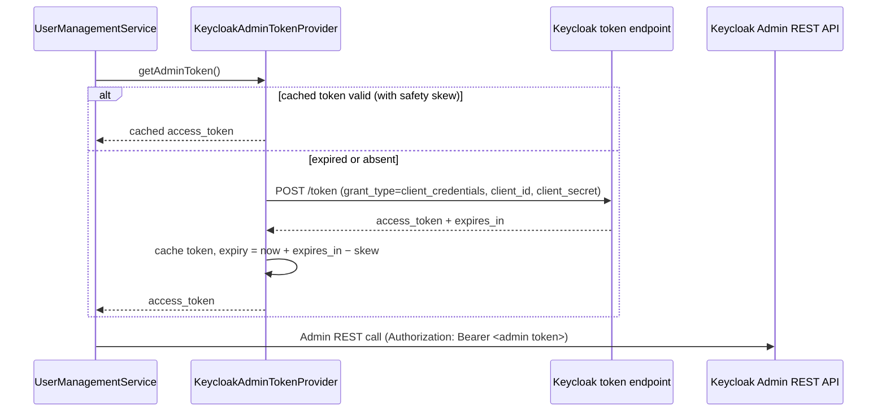
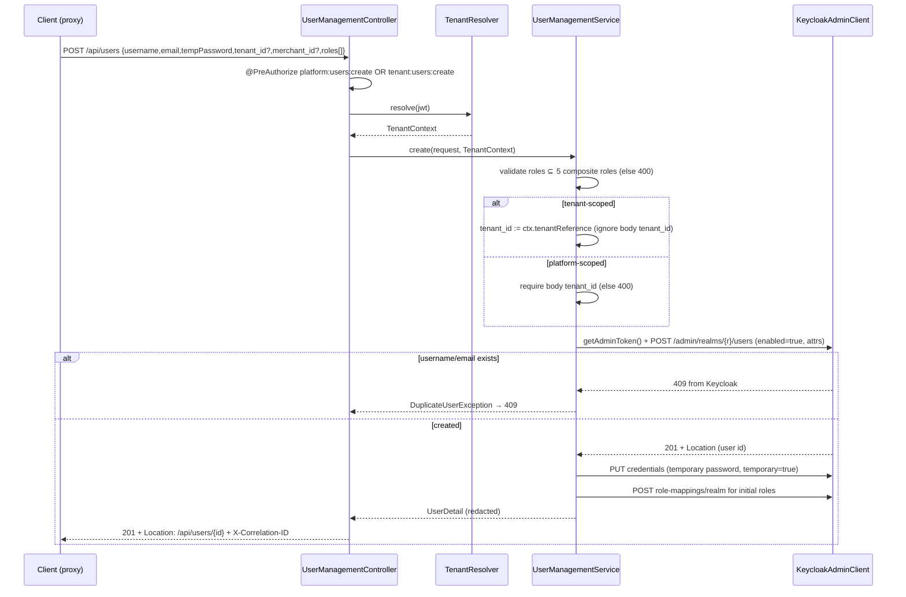
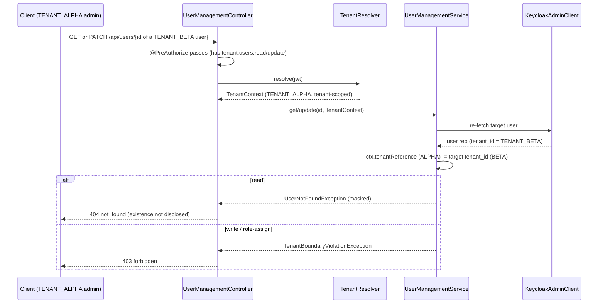

# Design Document: User Management (Keycloak Admin API Façade)

## Overview

This feature adds **user management** to the Payment Quality Engineering Lab as a **façade (proxy) over the Keycloak Admin REST API** (Keycloak 26). It is **Spec #3** of the SDET roadmap and a **brownfield enhancement** that extends — never rewrites — the existing backend security layer, the existing Nuxt frontend, and the existing Keycloak realm.

The defining decision (Resolved Decision 1) is the **identity store model**: there is **no local `app_user` table**. Keycloak is the single source of truth for user `id`, `username`, `email`, `enabled` flag, attributes (`tenant_id`, optional `merchant_id`), and assigned composite roles. The backend translates each `/api/users` request into one or more Keycloak Admin REST API calls using a dedicated **service-account admin client**. The admin token is obtained server-side by the module's own client credentials and **never** reaches the browser, the acting principal, any response body/header, or any log entry.

The design rests on three existing levers from prerequisite specs:

1. **`iam-roles-and-keycloak-login`** introduced the five named composite roles (`PLATFORM_ADMIN`, `TENANT_ADMIN`, `MERCHANT_MANAGER`, `SUPPORT_AGENT`, `READ_ONLY_USER`), the `tenant_id` JWT claim, the `KeycloakRealmRoleConverter` allowlist, and the frontend `rbacMatrix.ts` / `useAuthorization` capability source of truth.
2. **`tenant-model-and-isolation`** introduced the `tenant` Spring Modulith module with the **PUBLIC** `TenantResolver` / `TenantContext` API, the platform-vs-tenant classification rule, and the masked-404-read / 403-write isolation pattern.
3. **`backend-authority-refactor`** introduced the explicit allowlist in `KeycloakRealmRoleConverter` and added `jqwik` to the backend `pom.xml`.

This spec adds a new authority pair — `platform:users:*` and `tenant:users:*` — which requires the realm composite-role definitions to be **extended** (cross-spec touch point) and the converter allowlist to gain **8 new role→authority entries** (cross-spec touch point). Both are flagged explicitly in the Cross-Spec Implementation Notes section.

The existing REST contract conventions are preserved exactly: `application/problem+json` on every 4xx, `X-Correlation-ID` on every response, `Vary: Authorization` on reads, masked `404` for cross-tenant reads, `403` for cross-tenant writes, `409` for duplicate username/email, and a new `502` for Keycloak Admin API failures.

### Requirements Coverage Map

| Requirement | Where addressed |
|---|---|
| 1. User-management authorities + realm extension | Architecture (authority model); Cross-Spec Implementation Notes |
| 2. Keycloak admin client for the façade | Architecture (admin client + token strategy); Components (`KeycloakAdminClient`) |
| 3. List users | Components (`UserManagementController.list`, service); Sequence diagram (a) |
| 4. Create user | Components (create); Sequence diagram (b); Property P4 |
| 5. Get user by id | Components (get); tenant scoping; Property P1, P2 |
| 6. Update user | Components (update); tenant scoping; Property P2 |
| 7. Enable/disable via PATCH | Components (update); Resolved Decision 2 |
| 8. Assign/remove composite roles | Components (assignRoles); Sequence diagram (c); Property P2, P3 |
| 9. Concurrency / safe-edit without ETags | Architecture (re-fetch-before-write) |
| 10. REST contract conventions | Error Handling; Data Models (DTOs) |
| 11. RBAC + tenant-isolation matrix | Architecture (authority model); Property P1, P2 |
| 12. Users page list/filters/pagination | Frontend Design (page + composable + states) |
| 13. Create/edit/role-assignment surfaces | Frontend Design (components) |
| 14. Role-gated navigation | Frontend Design (nav link) |
| 15. Required UI states | Frontend Design (7 UI states) |
| 16. Frontend RBAC matrix extension | Frontend Design (`rbacMatrix.ts`); Property P5 |
| 17. Accessibility & testability | Frontend Design (data-testid + a11y) |

## Architecture

### Open Question 1 Resolution — A Dedicated `iam` Module

**Decision: create a new, self-contained Spring Modulith module named `iam` (package `lab.paymentquality.iam`).** It owns the User_Management_Facade and exposes **no PUBLIC API** initially (the package contains only `internal/`), because no other module needs to call user management. If a future spec (e.g. `audit-log-dashboard`) needs to react to user-management events, a PUBLIC API or `@ApplicationModuleListener` event can be added then.

**Rationale vs the alternatives (Open Question 1):**

- **`iam` (chosen).** The name describes the bounded context — identity & access management — and leaves room for future identity concerns (group management, service accounts) without re-naming. It is the natural sibling of the `tenant` module and reads coherently alongside `merchant` and `payment`. It does **not** imply a single CRUD surface the way `usermanagement` does.
- **`usermanagement` (not chosen).** Accurately describes *this* spec but is narrower than the context it will grow into; it would invite a second `iam`-style module later and fragment identity concerns.
- **shared `admin` module (not chosen).** Bundling user-management with future audit administration couples two unrelated bounded contexts behind one module boundary; it weakens the `ModulithArchitectureTest` guarantees and makes ownership ambiguous. The lab already separates concerns by domain (`merchant`, `payment`, `tenant`), so a domain-named `iam` module is consistent.

The module is **self-contained**: the façade, the Keycloak admin client wrapper, the web controller, DTOs, exception types, and the exception handler all live under `iam/internal/`. The only outbound module dependency is on the `tenant` module's **PUBLIC** API (`TenantResolver`, `TenantContext`, `TenantReference`) and on `shared` (the `Authorities` catalog). This keeps `ModulithArchitectureTest` green: `iam` imports only `tenant` (PUBLIC) and `shared` (OPEN), and no module imports `iam.internal.*`.

### Spring Modulith Module Map



`iam` module internal layout:

```
lab.paymentquality.iam
├── package-info.java                         (@ApplicationModule, displayName = "Identity & Access Management")
└── internal/
    ├── web/
    │   ├── UserManagementController.java      (the 5 endpoints)
    │   ├── UserManagementExceptionHandler.java(@RestControllerAdvice → problem+json mapping)
    │   ├── dto/
    │   │   ├── UserSummary.java               (list entry)
    │   │   ├── UserDetail.java                (single user)
    │   │   ├── UserListResponse.java          (page wrapper)
    │   │   ├── CreateUserRequest.java
    │   │   ├── UpdateUserRequest.java
    │   │   └── RoleAssignmentRequest.java
    │   └── UserMapper.java                    (Keycloak rep ↔ DTO, redaction)
    ├── application/
    │   └── UserManagementService.java         (façade orchestration + tenant-boundary enforcement)
    ├── domain/
    │   ├── CompositeRole.java                 (enum: the 5 assignable roles)
    │   ├── ManagedUser.java                   (internal value view of a Keycloak user)
    │   └── exception/                         (the iam exception hierarchy)
    └── infrastructure/
        ├── KeycloakAdminClient.java           (thin wrapper over Keycloak Admin REST API)
        ├── KeycloakAdminTokenProvider.java    (client-credentials token cache/refresh)
        └── KeycloakAdminProperties.java       (@ConfigurationProperties: base URL, realm, client id/secret)
```

**Module dependency rule:** `iam` → `tenant` (PUBLIC API only), `iam` → `shared` (OPEN). No `iam` code imports `tenant.internal.*`. No module imports `iam.internal.*`. Verified by `ModulithArchitectureTest` (existing) and a new `IamModuleTest`.

### The Façade — Request Flow

Every `/api/users` request follows the same layered pipeline, identical in shape to the merchant pipeline established by `tenant-model-and-isolation`:

```
URL security rule (SecurityFilterChain)
  → @PreAuthorize authority check (platform:users:* OR tenant:users:*)
    → TenantResolver.resolve(jwt) → TenantContext (after authority passes)
      → UserManagementService (tenant-boundary enforcement + orchestration)
        → KeycloakAdminClient (re-fetch-before-write, admin token attached server-side)
          → Keycloak Admin REST API
```

The acting principal's bearer token is used **only** for the resource-server authority check at the Spring Security layer. It is **never** forwarded to Keycloak Admin API calls. The façade authenticates to Keycloak with its **own** service-account client credentials (Requirement 2.6).

### Keycloak Admin Client — Recommendation

**Decision: use a thin `RestClient` wrapper (`KeycloakAdminClient`) against the Keycloak Admin REST API, not the `keycloak-admin-client` library.**

**Rationale (dependency weight vs control):**

| Factor | `keycloak-admin-client` library | Thin `RestClient` wrapper (chosen) |
|---|---|---|
| New dependencies | Pulls `org.keycloak:keycloak-admin-client` + RESTEasy/Jakarta client stack, transitively heavy and historically version-coupled to the Keycloak server line | Zero new dependencies — Spring Framework 7 `RestClient` is already on the classpath |
| Control over HTTP | Abstracts away status codes and headers — exactly the contract surface this learning lab exists to teach | Full control of status-code → exception mapping (404/409/502), request shape, and re-fetch-before-write |
| Token handling | Manages its own token internally; harder to assert "admin token never leaks" | Token obtained and attached explicitly by `KeycloakAdminTokenProvider`, easy to confine server-side and assert in tests |
| Test doubling | Couples tests to the library's client internals | Trivially doubled with WireMock; integration-tested with Testcontainers-Keycloak |
| Learning value | Hides the Admin REST API the SDET should understand | Surfaces the real Admin REST endpoints (`/admin/realms/{realm}/users`, `/role-mappings/realm`) |

The `keycloak-admin-client` library is convenient for large administrative tooling, but for five endpoints over a handful of Admin REST operations the thin wrapper is lighter, gives the explicit status-code control the contract requires, and avoids adding a heavyweight dependency (consistent with the project's "no dependencies without explicit need" rule).

### Admin Token Strategy — Service-Account Client Credentials

The `iam` module authenticates to Keycloak using the **OAuth 2.0 client-credentials grant** with a dedicated confidential client (service account) in the `payment-quality` realm. The client id and secret are supplied via configuration (`KeycloakAdminProperties`, sourced from environment variables — never committed).



**Token caching/refresh:**

- The token is cached in memory in `KeycloakAdminTokenProvider` with its expiry computed as `now + expires_in − safetySkew` (e.g. 30 s skew) so a token is refreshed slightly before it actually expires.
- Access is guarded so a single refresh happens under contention (e.g. a synchronized/`AtomicReference` compute-if-expired). A simple double-checked refresh is sufficient for the lab; no distributed cache is needed (single backend instance).
- On a `401` from the Admin REST API (token rejected mid-flight), the provider invalidates the cache and refreshes **once**; a second failure surfaces as a `502` to the caller.
- The token value is held only in `KeycloakAdminTokenProvider`; it is never placed in a DTO, response header, `X-Correlation-ID`, or log. The exception handler and mapper are responsible for ensuring it cannot leak (Requirements 2.3, 10.7).

### Tenant Scoping — Dependency on `TenantResolver`

The `iam` module depends **explicitly** on the `tenant` module PUBLIC API. For each request, after the `@PreAuthorize` authority check passes, the controller calls `TenantResolver.resolve(jwt)` to obtain the acting principal's `TenantContext` (resolved tenant identity + `isPlatformScoped` flag). This is the **same** classification mechanism used by the merchant module — `iam` reuses it rather than re-deriving tenant scope.

Tenant scoping of a target user works on the user's **`tenant_id` Keycloak attribute** (a `Tenant_Reference` natural key such as `TENANT_ALPHA`):

- The service reads the target user's `tenant_id` attribute from the Keycloak user representation.
- It compares that attribute to the acting principal's resolved `TenantReference` (from `TenantContext`).
- **Platform-scoped principal** (`TenantContext.isPlatformScoped()` true): no tenant restriction — sees and edits across all tenants.
- **Tenant-scoped principal**: may act only on users whose `tenant_id` equals the principal's `TenantReference`.

Cross-tenant outcomes (Requirement 11.3, mirrored from `tenant-model-and-isolation`):

| Operation | Tenant-scoped principal acting cross-tenant |
|---|---|
| Read (`GET /api/users/{id}`) | **Masked 404** `not_found` (existence not disclosed) |
| List (`GET /api/users`) | Cross-tenant users are simply **filtered out** of the page |
| Write (`PATCH /api/users/{id}`) | **403** `forbidden` |
| Role assignment (`POST /api/users/{id}/roles`) | **403** `forbidden` |

The read-vs-write asymmetry is deliberate and **deterministic and disjoint**: a given (principal, target, operation) triple maps to exactly one outcome (see Property P2). The dependency on `TenantResolver` is the single inbound coupling that makes this scoping possible; if `tenant-model-and-isolation` is not implemented, this spec cannot resolve the acting tenant and must not be started (see Cross-Spec Implementation Notes).

### Authority Model — New `*:users:*` Authorities

This spec introduces eight new Fine_Grained_Authorities:

| Authority | Granted by composite role |
|---|---|
| `platform:users:read` | PLATFORM_ADMIN |
| `platform:users:create` | PLATFORM_ADMIN |
| `platform:users:update` | PLATFORM_ADMIN |
| `platform:users:assign-roles` | PLATFORM_ADMIN |
| `tenant:users:read` | TENANT_ADMIN |
| `tenant:users:create` | TENANT_ADMIN |
| `tenant:users:update` | TENANT_ADMIN |
| `tenant:users:assign-roles` | TENANT_ADMIN |

The controller's `@PreAuthorize` expressions accept **either** the platform or the tenant variant for each operation, e.g.:

```java
@PreAuthorize("hasAnyAuthority('" + Authorities.PLATFORM_USERS_READ + "','" + Authorities.TENANT_USERS_READ + "')")
```

The platform-vs-tenant *scope* of the request is then determined by `TenantContext.isPlatformScoped()`, not by which authority string was present. This mirrors the merchant module: the authority check gates *whether* the operation is allowed at all; the `TenantContext` gates *which users* are in scope.

**Cross-spec touch points (flagged, not implemented here):**

1. **Realm composite roles must be extended.** The `iam-roles-and-keycloak-login` realm import (`infra/keycloak/realms/payment-quality-realm.json`) must add the 8 new authority roles and aggregate the 4 `platform:users:*` roles into `PLATFORM_ADMIN` and the 4 `tenant:users:*` roles into `TENANT_ADMIN` (Requirement 1.1–1.4).
2. **Converter allowlist must be extended.** `KeycloakRealmRoleConverter` (from `backend-authority-refactor`) uses an explicit allowlist. The converter rule itself is **not** modified (Requirement 1.5); only the allowlist **data** gains 8 new `role→authority` entries, one per new authority. Because each new realm authority role name is identical to its authority string (e.g. realm role `platform:users:read` → authority `platform:users:read`), the converter handles them via the existing rule once the allowlist entries exist.

Both touch points are restated in the Cross-Spec Implementation Notes section.

### Concurrency — Re-Fetch-Before-Write, Last-Write-Wins

The Keycloak Admin API exposes **no ETag / `If-Match`** for user resources (Requirement 9.1). Therefore:

- `PATCH /api/users/{id}` and `POST /api/users/{id}/roles` carry **no** optimistic-locking precondition. The façade **never** requires `If-Match` and **never** returns `428` or `412` for these operations (Requirement 9.3).
- **Safe-edit pattern:** before applying any update or role change, the façade **re-fetches** the current user representation from Keycloak immediately before computing and applying the change (Requirement 9.2, 9.5). This ensures the write is computed against the latest known state and that the merge of partial PATCH fields is applied onto a current snapshot, not a stale client view.
- **Last-write-wins (documented risk, Requirement 9.4):** when two administrators edit the same user concurrently, the later write overwrites the earlier one with no conflict detection. This is an accepted trade-off of the façade model (Resolved Decision 1) and is recorded here so future contract tests do not expect `412`/`428` on these endpoints.

### Sequence Diagrams

#### (a) List users with tenant scoping

```mermaid
sequenceDiagram
    participant C as Client (proxy)
    participant Ctl as UserManagementController
    participant TR as TenantResolver
    participant Svc as UserManagementService
    participant KC as KeycloakAdminClient

    C->>Ctl: GET /api/users?role&status&search&page&size (Bearer JWT)
    Ctl->>Ctl: @PreAuthorize platform:users:read OR tenant:users:read
    Ctl->>TR: resolve(jwt)
    TR-->>Ctl: TenantContext (tenantRef, isPlatformScoped)
    Ctl->>Svc: list(filters, page, TenantContext)
    Svc->>KC: getAdminToken() + GET /admin/realms/{r}/users (paged + search)
    KC-->>Svc: List<Keycloak user rep>
    alt platform-scoped
        Svc->>Svc: keep all users
    else tenant-scoped
        Svc->>Svc: filter users where tenant_id == ctx.tenantReference
    end
    Svc->>Svc: apply role/status filters; map → UserSummary (redacted)
    Svc-->>Ctl: UserListResponse
    Ctl-->>C: 200 + X-Correlation-ID + Vary: Authorization
```

#### (b) Create user (platform picks tenant vs tenant auto-assign)



#### (c) Assign roles

```mermaid
sequenceDiagram
    participant C as Client (proxy)
    participant Ctl as UserManagementController
    participant TR as TenantResolver
    participant Svc as UserManagementService
    participant KC as KeycloakAdminClient

    C->>Ctl: POST /api/users/{id}/roles {assign:[...], remove:[...]}
    Ctl->>Ctl: @PreAuthorize platform:users:assign-roles OR tenant:users:assign-roles
    Ctl->>TR: resolve(jwt)
    TR-->>Ctl: TenantContext
    Ctl->>Svc: assignRoles(id, request, TenantContext)
    Svc->>Svc: validate names ⊆ 5 composite roles (else 400)
    Svc->>KC: re-fetch user (safe-edit)
    alt user not found
        KC-->>Svc: 404
        Svc-->>Ctl: tenant-scoped → masked 404; platform → 404
    else found
        Svc->>Svc: tenant boundary check (tenant-scoped cross-tenant → 403)
        Svc->>KC: POST/DELETE role-mappings/realm (assign/remove composites)
        Svc->>KC: re-fetch effective roles
        Svc-->>Ctl: UserDetail with updated roles
        Ctl-->>C: 200 + X-Correlation-ID
    end
```

#### (d) Cross-tenant access → masked 404 (read) / 403 (write)



## Components and Interfaces

### Backend — `UserManagementController`

The controller exposes the five endpoints. Each resolves `TenantContext` after the authority check and delegates to the service. It owns no business logic.

```java
package lab.paymentquality.iam.internal.web;

@RestController
@RequestMapping("/api/users")
class UserManagementController {

    private final UserManagementService service;
    private final TenantResolver tenantResolver; // tenant module PUBLIC API

    UserManagementController(UserManagementService service, TenantResolver tenantResolver) {
        this.service = service;
        this.tenantResolver = tenantResolver;
    }

    @GetMapping
    @PreAuthorize("hasAnyAuthority('" + Authorities.PLATFORM_USERS_READ
            + "','" + Authorities.TENANT_USERS_READ + "')")
    ResponseEntity<UserListResponse> list(
            @RequestParam(required = false) String role,
            @RequestParam(required = false) String status,
            @RequestParam(required = false) String search,
            @RequestParam(defaultValue = "0") int page,
            @RequestParam(defaultValue = "20") int size,
            @AuthenticationPrincipal Jwt jwt) {
        TenantContext ctx = tenantResolver.resolve(jwt);
        UserListResponse body = service.list(new UserListQuery(role, status, search, page, size), ctx);
        return ResponseEntity.ok()
                .header("Vary", "Authorization")
                .body(body);
    }

    @PostMapping
    @PreAuthorize("hasAnyAuthority('" + Authorities.PLATFORM_USERS_CREATE
            + "','" + Authorities.TENANT_USERS_CREATE + "')")
    ResponseEntity<UserDetail> create(
            @Valid @RequestBody CreateUserRequest request,
            @AuthenticationPrincipal Jwt jwt) {
        TenantContext ctx = tenantResolver.resolve(jwt);
        UserDetail created = service.create(request, ctx);
        return ResponseEntity.created(URI.create("/api/users/" + created.id()))
                .body(created);
    }

    @GetMapping("/{id}")
    @PreAuthorize("hasAnyAuthority('" + Authorities.PLATFORM_USERS_READ
            + "','" + Authorities.TENANT_USERS_READ + "')")
    ResponseEntity<UserDetail> get(@PathVariable String id, @AuthenticationPrincipal Jwt jwt) {
        TenantContext ctx = tenantResolver.resolve(jwt);
        return ResponseEntity.ok()
                .header("Vary", "Authorization")
                .body(service.get(id, ctx));
    }

    @PatchMapping("/{id}")
    @PreAuthorize("hasAnyAuthority('" + Authorities.PLATFORM_USERS_UPDATE
            + "','" + Authorities.TENANT_USERS_UPDATE + "')")
    ResponseEntity<UserDetail> update(
            @PathVariable String id,
            @Valid @RequestBody UpdateUserRequest request,
            @AuthenticationPrincipal Jwt jwt) {
        TenantContext ctx = tenantResolver.resolve(jwt);
        return ResponseEntity.ok(service.update(id, request, ctx));
    }

    @PostMapping("/{id}/roles")
    @PreAuthorize("hasAnyAuthority('" + Authorities.PLATFORM_USERS_ASSIGN_ROLES
            + "','" + Authorities.TENANT_USERS_ASSIGN_ROLES + "')")
    ResponseEntity<UserDetail> assignRoles(
            @PathVariable String id,
            @Valid @RequestBody RoleAssignmentRequest request,
            @AuthenticationPrincipal Jwt jwt) {
        TenantContext ctx = tenantResolver.resolve(jwt);
        return ResponseEntity.ok(service.assignRoles(id, request, ctx));
    }
}
```

`X-Correlation-ID` is added by the existing `shared` correlation filter on every response, so it is not set per-handler. `Vary: Authorization` is set explicitly on read responses (Requirements 3.7, 5.5, 10.3).

### Backend — `UserManagementService`

The façade orchestration layer. It owns: role-allowlist validation, tenant-assignment resolution on create, tenant-boundary enforcement on read/write, safe-edit re-fetch, and mapping to redacted DTOs.

```java
package lab.paymentquality.iam.internal.application;

@Service
class UserManagementService {

    private final KeycloakAdminClient admin;

    UserManagementService(KeycloakAdminClient admin) {
        this.admin = admin;
    }

    UserListResponse list(UserListQuery query, TenantContext ctx) {
        // 1. Fetch a page of users from Keycloak (search delegated where possible — see Open Q4).
        // 2. If ctx.isTenantScoped(): retain only users whose tenant_id attr == ctx.tenantReference().
        // 3. Apply role + status filters (see Open Q4 trade-off).
        // 4. Map to UserSummary (redacted). Return with pagination metadata.
    }

    UserDetail get(String id, TenantContext ctx) {
        ManagedUser user = admin.getUser(id)               // throws UserNotFoundException on 404
                .orElseThrow(UserNotFoundException::new);
        enforceReadBoundary(user, ctx);                    // cross-tenant read → masked 404
        return UserMapper.toDetail(user);
    }

    UserDetail create(CreateUserRequest req, TenantContext ctx) {
        validateRolesAreComposite(req.roles());            // else InvalidRoleException → 400
        String tenantRef = resolveCreateTenant(ctx, req.tenantId()); // platform picks / tenant auto-assigns
        String newId = admin.createUser(req, tenantRef);   // 409 from Keycloak → DuplicateUserException
        admin.setTemporaryPassword(newId, req.temporaryPassword()); // never logged
        admin.assignRealmComposites(newId, req.roles());
        return UserMapper.toDetail(admin.getUser(newId).orElseThrow(UserNotFoundException::new));
    }

    UserDetail update(String id, UpdateUserRequest req, TenantContext ctx) {
        ManagedUser current = admin.getUser(id)            // safe-edit re-fetch (Req 9.2)
                .orElseThrow(UserNotFoundException::new);
        enforceWriteBoundary(current, ctx);                // cross-tenant write → 403
        admin.updateUser(id, current, req);                // merge PATCH onto re-fetched snapshot
        return UserMapper.toDetail(admin.getUser(id).orElseThrow(UserNotFoundException::new));
    }

    UserDetail assignRoles(String id, RoleAssignmentRequest req, TenantContext ctx) {
        validateRolesAreComposite(req.assign());
        validateRolesAreComposite(req.remove());
        ManagedUser current = admin.getUser(id)            // safe-edit re-fetch
                .orElseThrow(UserNotFoundException::new);
        enforceWriteBoundary(current, ctx);                // cross-tenant role-assign → 403
        admin.assignRealmComposites(id, req.assign());
        admin.removeRealmComposites(id, req.remove());
        return UserMapper.toDetail(admin.getUser(id).orElseThrow(UserNotFoundException::new));
    }

    // --- boundary helpers ---

    private void enforceReadBoundary(ManagedUser user, TenantContext ctx) {
        if (ctx.isTenantScoped() && !user.tenantId().equals(ctx.tenantReference().value())) {
            throw new UserNotFoundException();             // masked 404 (Req 5.3)
        }
    }

    private void enforceWriteBoundary(ManagedUser user, TenantContext ctx) {
        if (ctx.isTenantScoped() && !user.tenantId().equals(ctx.tenantReference().value())) {
            throw new TenantBoundaryViolationException();  // 403 (Req 6.3, 8.3)
        }
    }

    private String resolveCreateTenant(TenantContext ctx, String bodyTenantId) {
        if (ctx.isTenantScoped()) {
            return ctx.tenantReference().value();          // ignore body (Req 4.2)
        }
        if (bodyTenantId == null || bodyTenantId.isBlank()) {
            throw new MissingTenantReferenceException();   // 400 (Req 4.3)
        }
        return bodyTenantId.strip();
    }

    private void validateRolesAreComposite(Collection<String> roles) {
        for (String r : roles) {
            if (!CompositeRole.isAssignable(r)) {
                throw new InvalidRoleException(r);         // 400 (Req 4.4, 8.4)
            }
        }
    }
}
```

### Backend — `KeycloakAdminClient` (thin wrapper)

```java
package lab.paymentquality.iam.internal.infrastructure;

@Component
class KeycloakAdminClient {

    private final RestClient restClient;                  // base URL = {keycloak}/admin/realms/{realm}
    private final KeycloakAdminTokenProvider tokenProvider;

    // Reads
    Optional<ManagedUser> getUser(String id);             // GET /users/{id}; 404 → Optional.empty()
    List<ManagedUser> listUsers(UserListQuery query);     // GET /users?first&max&search
    List<String> getRealmCompositeRoleNames(String id);   // GET /users/{id}/role-mappings/realm

    // Writes
    String createUser(CreateUserRequest req, String tenantRef); // POST /users; 409 → DuplicateUserException
    void setTemporaryPassword(String id, String password);      // PUT /users/{id}/reset-password (temporary=true)
    void updateUser(String id, ManagedUser current, UpdateUserRequest req); // PUT /users/{id} (merged)
    void assignRealmComposites(String id, Collection<String> roleNames);    // POST /users/{id}/role-mappings/realm
    void removeRealmComposites(String id, Collection<String> roleNames);    // DELETE /users/{id}/role-mappings/realm

    // Every call: Authorization: Bearer <tokenProvider.getAdminToken()> (server-side only).
    // Any non-2xx that is not a mapped business status (404/409) → KeycloakAdminUnavailableException (→ 502).
}
```

`KeycloakAdminTokenProvider` implements the client-credentials cache/refresh described in the Architecture section. Its only public method is `String getAdminToken()`. The token never appears in any return value exposed to the web layer.

### Backend — DTOs (Data Models also covers shapes)

```java
// Outbound — list entry
record UserSummary(String id, String username, String email, boolean enabled,
                   String tenantId, String merchantId, List<String> roles) {}

// Outbound — single user (same shape, sole detail representation)
record UserDetail(String id, String username, String email, boolean enabled,
                  String tenantId, String merchantId, List<String> roles) {}

// Outbound — page wrapper (mirrors payment-order list conventions)
record UserListResponse(List<UserSummary> users, int page, int size, long totalEstimate) {}

// Inbound — create
record CreateUserRequest(
        @NotBlank String username,
        @NotBlank @Email String email,
        @NotBlank String temporaryPassword,
        String tenantId,            // required for platform-scoped, ignored for tenant-scoped (service-enforced)
        String merchantId,          // optional, opaque (Open Q5: opaque, not cross-validated)
        List<@NotBlank String> roles) {}

// Inbound — update (PATCH; all fields optional / nullable = "no change")
record UpdateUserRequest(
        @Email String email,
        Boolean enabled,
        Map<String, List<String>> attributes) {}

// Inbound — role assignment
record RoleAssignmentRequest(List<String> assign, List<String> remove) {}
```

No DTO carries a password, credential, or token field outbound. `UserMapper` never copies credential data into `UserSummary`/`UserDetail` (Requirements 3.9, 4.9, 5.6, 6.9, 10.7).

### Backend — `UserManagementExceptionHandler`

A `@RestControllerAdvice` scoped to the `iam` web package, mapping the module's exceptions to `application/problem+json` (see Error Handling for the full decision tree). It reuses the project's existing problem-detail builder so the shape matches every other endpoint.

### Frontend — Page, Composable, Schemas

**Page:** `app/pages/admin/users/index.vue` — the `/admin/users` Users_Page. CSR-only (consistent with `/admin/**`). Hosts the list table, filters (role, status, search) reflected into URL query params, pagination, and the create/edit/role surfaces. Renders all seven required states.

**Composable:** `app/composables/useUsersApi.ts` — delegates transport to `useApiClient` (`$fetch.raw`), captures headers/status, validates every response against its Zod schema before returning.

```ts
// app/composables/useUsersApi.ts
export function useUsersApi() {
  const client = useApiClient()

  async function listUsers(query: UsersQuery): Promise<ApiResponse<UserList>> { /* GET /api/users */ }
  async function getUser(id: string): Promise<ApiResponse<UserDetail>> { /* GET /api/users/:id */ }
  async function createUser(body: CreateUserInput): Promise<ApiResponse<UserDetail>> { /* POST /api/users */ }
  async function updateUser(id: string, body: UpdateUserInput): Promise<ApiResponse<UserDetail>> { /* PATCH */ }
  async function assignRoles(id: string, body: RoleAssignmentInput): Promise<ApiResponse<UserDetail>> { /* POST roles */ }

  return { listUsers, getUser, createUser, updateUser, assignRoles }
}
```

**Schemas:** `app/schemas/user.schema.ts` — Zod schemas validated before rendering (Requirement 12.5):

```ts
export const compositeRoleSchema = z.enum([
  'PLATFORM_ADMIN', 'TENANT_ADMIN', 'MERCHANT_MANAGER', 'SUPPORT_AGENT', 'READ_ONLY_USER',
])

export const userSummarySchema = z.object({
  id: z.string(),
  username: z.string(),
  email: z.string().email(),
  enabled: z.boolean(),
  tenantId: z.string(),
  merchantId: z.string().nullable().optional(),
  roles: z.array(compositeRoleSchema),
})
export const userDetailSchema = userSummarySchema
export const userListSchema = z.object({
  users: z.array(userSummarySchema),
  page: z.number().int(),
  size: z.number().int(),
  totalEstimate: z.number().int(),
})

export const createUserSchema = z.object({
  username: z.string().min(3).max(64),
  email: z.string().email(),
  temporaryPassword: z.string().min(8),
  tenantId: z.string().optional(),     // required-ness enforced by UI based on role + by backend
  merchantId: z.string().optional(),
  roles: z.array(compositeRoleSchema).min(1),
})
export const updateUserSchema = z.object({
  email: z.string().email().optional(),
  enabled: z.boolean().optional(),
}).refine(o => o.email !== undefined || o.enabled !== undefined, 'at least one field required')
export const roleAssignmentSchema = z.object({
  assign: z.array(compositeRoleSchema),
  remove: z.array(compositeRoleSchema),
})
```

### Frontend — Components

| Component | Nuxt UI primitive | Test_Id | Notes |
|---|---|---|---|
| `UserTable` | `UTable` | `users-table` | Reuses table/list patterns; `<th scope="col">`; row actions have accessible names; row-scoped ids by User_Id |
| `CreateUserForm` | `UForm` in `UModal` | `create-user-form` (form), `create-user-button` (trigger) | Tenant control shown only for PLATFORM_ADMIN; omitted for TENANT_ADMIN |
| `EditUserDrawer` | `UForm` in `USlideover` | `edit-user-drawer` | Edits email, enabled, attributes; focus trap + restore |
| `RoleAssignmentSelect` | `USelectMenu` (multiple, searchable) | `role-assignment-select` | Offers only the 5 composite roles; fully keyboard-navigable |

Shared components are **reused, not duplicated**: `LoadingState`, `EmptyStateCard`, `ErrorState`, `ProblemDetailsCard`, `ConfirmActionModal`, `BusinessStatusBadge` (for enabled/disabled), `UToast` for write outcomes (per `frontend-nuxt-ui.md`).

**Server proxy routes:** `server/api/users/**` mirroring the existing `backendApi.ts` pattern — attach bearer token server-side, forward `X-Correlation-ID`, `Location`, `Vary` to the browser, never expose the bearer or admin token:

```
server/api/users/index.get.ts          → GET  /api/users
server/api/users/index.post.ts         → POST /api/users
server/api/users/[id]/index.get.ts     → GET  /api/users/{id}
server/api/users/[id]/index.patch.ts   → PATCH /api/users/{id}
server/api/users/[id]/roles.post.ts    → POST /api/users/{id}/roles
```

**`rbacMatrix.ts` extension:** add `canManageUsers` and `canAssignRoles`, granted to PLATFORM_ADMIN and TENANT_ADMIN only (Requirement 16). `useAuthorization` exposes them; the page and nav derive visibility from them.

**Role-gated nav link:** in `app/layouts/dashboard.vue`, the Users link (`nav-link-users`, `to: '/admin/users'`, `icon: 'i-lucide-users'`) is added to the `computed` links array, included only when `can.canManageUsers` is true. `UDashboardSearch` `groups` updated in parallel.

### Frontend — Seven Required UI States (Requirement 15)

| State | Trigger | Component | Distinguishing text |
|---|---|---|---|
| `loading` | request in flight | `LoadingState` (`loading-state`) | "Loading users…" |
| `empty` | empty list, no filters | `EmptyStateCard` (`empty-state`) | "No users yet" + create action |
| `filtered-empty` | empty list, filters active | filtered-empty variant | names active filters + "Clear filters" |
| `error` | problem+json response | `ProblemDetailsCard` (`problem-details-card`) | renders `detail` |
| `forbidden` | 403 response | distinct forbidden surface (`forbidden-state`) | "You don't have access to manage users" |
| `success` | create/edit/role success | `UToast` (dismissible) | "User created/updated" |
| `conflict` | 409 response | conflict surface from problem detail, retains entered values | "Username or email already exists" |

All states convey meaning through **text**, not color alone (Requirement 15.8, 17). Semantic-locator-first: `getByRole`/`getByLabel`/`getByText` preferred, `data-testid` only where semantics are insufficient (Requirement 17.3).

## Data Models

### No Database Schema — No Migration

**This spec adds no database table, column, or Flyway migration.** Per Resolved Decision 1, Keycloak is the single source of truth for all user data; the backend persists nothing about users. There is **no `app_user` table, no JPA entity, no repository, and no `db/migration` change** in this spec. JPA `ddl-auto: validate` is unaffected because the `iam` module declares no `@Entity`.

### Keycloak User Representation (source of truth)

The Keycloak Admin API user representation (the subset the façade reads/writes):

```jsonc
{
  "id": "f7c1...uuid",           // User_Id (immutable, Keycloak-assigned)
  "username": "alice.admin",
  "email": "alice@example.com",
  "enabled": true,
  "attributes": {
    "tenant_id":   ["TENANT_ALPHA"],    // Tenant_Reference natural key — the scoping attribute
    "merchant_id": ["MERCHANT_ALPHA_001"] // optional, opaque (Open Q5)
  }
  // realm composite role mappings are read separately via /role-mappings/realm
}
```

Notes:
- Keycloak stores attributes as `Map<String, List<String>>`. The façade reads the first element of `tenant_id` / `merchant_id`. The internal `ManagedUser` value object flattens these to scalars for the service layer.
- Credentials (`credentials[]`, passwords) are **write-only** through the Admin API and are **never read back or surfaced** in any DTO.
- Composite role mappings are fetched via `GET /users/{id}/role-mappings/realm` and filtered to the five assignable composite role names for the `roles` field.

### Internal `ManagedUser` value object

```java
record ManagedUser(String id, String username, String email, boolean enabled,
                   String tenantId, String merchantId, List<String> roles) {}
```

This is the boundary type between `KeycloakAdminClient` and `UserManagementService`. `UserMapper` converts it to `UserSummary` / `UserDetail`, which are byte-for-byte the redacted outbound shapes (no credential fields exist on either type, so redaction is structural — a credential value cannot be represented).

### DTO Shapes

The outbound `UserSummary` / `UserDetail` and inbound `CreateUserRequest` / `UpdateUserRequest` / `RoleAssignmentRequest` shapes are defined in Components and Interfaces. The single most important data-model invariant: **no outbound type has a field capable of holding a password, temporary password, credential, bearer token, or admin token** (Requirements 2.3, 3.9, 4.9, 5.6, 6.9, 9 redaction, 10.7).

### `CompositeRole` enum (assignable-role allowlist)

```java
enum CompositeRole {
    PLATFORM_ADMIN, TENANT_ADMIN, MERCHANT_MANAGER, SUPPORT_AGENT, READ_ONLY_USER;

    static boolean isAssignable(String name) {
        for (CompositeRole r : values()) if (r.name().equals(name)) return true;
        return false;
    }
}
```

This is the single source of truth for "which roles may be assigned" on both create and role-assignment paths (Requirements 4.4, 8.4).
## Correctness Properties

*A property is a characteristic or behavior that should hold true across all valid executions of a system — essentially, a formal statement about what the system should do. Properties serve as the bridge between human-readable specifications and machine-verifiable correctness guarantees.*

These properties target the pure, input-varying logic of the façade — tenant scoping/filtering, cross-tenant outcome determinism, role-allowlist validation, create-tenant-assignment resolution, the frontend capability mapping, and the structural redaction invariant. They are exercised against a **mocked/faked `KeycloakAdminClient`** (backend) and the pure `rbacMatrix` function (frontend), so 100+ iterations are cheap and deterministic. External Keycloak Admin REST behavior (token grant, realm import, actual role-mapping persistence) is **not** property-tested; it is covered by integration and smoke tests (see Testing Strategy).

The prework classified every acceptance criterion; criteria classified `EXAMPLE`, `EDGE_CASE`, `INTEGRATION`, or `SMOKE` are addressed in the Testing Strategy rather than as properties. After property reflection, the testable-as-property criteria reduce to exactly the six properties below, each unique and non-redundant.

### Property 1: Tenant-scoped list returns only in-scope users and honours all active filters

*For any* generated population of Managed_Users across multiple tenants, *for any* acting principal, and *for any* combination of `role`, `status`, and `search` filters, every user returned by `list` satisfies all of: (a) if the principal is tenant-scoped, the user's `tenant_id` equals the principal's resolved `TenantReference`; if platform-scoped, no tenant restriction applies; (b) if a `role` filter is set, the user has that composite role; (c) if a `status` filter is set, the user's `enabled` flag matches; (d) if a `search` filter is set, the user's username or email contains it. No user violating any active constraint ever appears, and no in-scope matching user is omitted.

**Validates: Requirements 3.1, 3.2, 3.3, 3.4, 3.5, 11.4**

### Property 2: Cross-tenant access is deterministic and read/write outcomes are disjoint

*For any* tenant-scoped acting principal and *for any* target Managed_User in a different tenant (and for any non-existent User_Id), a read operation (`GET /api/users/{id}`) yields a Masked_Not_Found `404` whose response is byte-indistinguishable from the not-found response, while a write or role-assignment operation (`PATCH /api/users/{id}`, `POST /api/users/{id}/roles`) yields `403`. For every (principal, target, operation) triple exactly one of these outcomes is produced — the read→404 and write→403 classes are disjoint and total over the cross-tenant case — and neither outcome ever discloses the existence or tenant of the target.

**Validates: Requirements 5.3, 5.4, 6.3, 8.3, 10.4, 10.5, 11.3**

### Property 3: Only the five composite roles are assignable

*For any* set of role-name strings supplied on create (`CreateUserRequest.roles`) or on role assignment (`RoleAssignmentRequest.assign` / `remove`), the request is accepted only if every name is one of the five Composite_Roles (`PLATFORM_ADMIN`, `TENANT_ADMIN`, `MERCHANT_MANAGER`, `SUPPORT_AGENT`, `READ_ONLY_USER`); if any name is outside that set the operation is rejected with a `400` Problem_Response and no Keycloak write is attempted.

**Validates: Requirements 4.4, 8.4**

### Property 4: Create assigns tenant by scope, ignoring the body for tenant-scoped principals

*For any* `CreateUserRequest` and *for any* acting principal: if the principal is tenant-scoped, the created user's `tenant_id` equals the principal's resolved `TenantReference` regardless of any `tenant_id` value supplied in the request body (including a foreign or blank value); if the principal is platform-scoped and the body carries a non-blank `tenant_id`, the created user's `tenant_id` equals that body value; if the principal is platform-scoped and the body `tenant_id` is absent or blank, the operation is rejected with a `400` Problem_Response and no user is created.

**Validates: Requirements 4.1, 4.2, 4.3**

### Property 5: Frontend capability mapping is a biconditional on admin roles

*For any* Composite_Role, the `rbacMatrix` capabilities `canManageUsers` and `canAssignRoles` are both `true` if and only if the role is `PLATFORM_ADMIN` or `TENANT_ADMIN`, and both `false` for `MERCHANT_MANAGER`, `SUPPORT_AGENT`, and `READ_ONLY_USER`. The visibility of the `nav-link-users` navigation entry and of the create/edit/role-assignment controls is derived solely from these capabilities, so the navigation link is present exactly for the roles granted `canManageUsers`.

**Validates: Requirements 14.1, 14.2, 16.1, 16.2, 16.3**

### Property 6: Secrets never appear in any browser-exposed surface

*For any* user-management operation and *for any* generated input — success or error — the response body, the response headers forwarded to the browser, and any captured log output contain none of: the Keycloak_Admin_Token, the acting principal's bearer token, a password, or a Temporary_Password. This is reinforced structurally: every outbound type (`UserSummary`, `UserDetail`, `UserListResponse`) has no field capable of holding a credential or token, so a secret value cannot be represented in an outbound payload, and admin calls to Keycloak are authenticated with the service-account token rather than the principal's bearer token.

**Validates: Requirements 2.3, 2.6, 3.9, 4.9, 5.6, 6.9, 10.7, 10.8**

### Supporting property (not in the headline set)

A genuine but secondary **safe-edit merge invariant** also holds: *for any* current Managed_User and *for any* partial `UpdateUserRequest`, fields not present in the request are unchanged after the merge onto the re-fetched snapshot (Requirements 7.2, 9.2, 9.5). This is primarily verified via the re-fetch-before-write interaction example (see Testing Strategy) and is recorded here as an additional jqwik candidate; it is intentionally kept out of P1–P6 to keep the headline property set focused.

## Error Handling

All `/api/users` errors are emitted as `application/problem+json` (RFC 9457) with the five members `type`, `title`, `status`, `detail`, `instance`, using the project's existing problem-detail builder so the shape is byte-compatible with every other endpoint. `X-Correlation-ID` is present on every response (success or error) via the existing `shared` correlation filter. A dedicated `UserManagementExceptionHandler` (`@RestControllerAdvice` scoped to the `iam` web package) maps the module's exception hierarchy to status codes.

### Status Decision Tree

```mermaid
flowchart TD
    A[/api/users request] --> B{Authenticated?}
    B -- no --> B401[401 — security layer, not the handler]
    B -- yes --> C{Has required platform OR tenant authority?}
    C -- no --> C403[403 forbidden]
    C -- yes --> D[Resolve TenantContext]
    D --> E{Request body valid?<br/>roles ⊆ 5 composites?<br/>platform create has tenant_id?}
    E -- invalid role / missing tenant_id / malformed --> E400[400 validation]
    E -- valid --> F{Re-fetch target from Keycloak}
    F --> G{Target exists?}
    G -- no, tenant-scoped --> G404[404 masked not_found]
    G -- no, platform-scoped --> G404p[404 not_found]
    G -- yes --> H{Operation type?}
    H -- read, cross-tenant, tenant-scoped --> G404[404 masked not_found]
    H -- write/assign, cross-tenant, tenant-scoped --> H403[403 forbidden]
    H -- in-scope --> I{Keycloak write outcome}
    I -- duplicate username/email --> I409[409 conflict]
    I -- admin API unreachable / 5xx --> I502[502 bad gateway]
    I -- success --> J[2xx + X-Correlation-ID + Vary on reads]
```

### Exception-to-Status Map

| Exception (iam.internal.domain.exception) | HTTP status | Problem `type` | Triggered by |
|---|---|---|---|
| (handled by Spring Security) | `401` | — | Missing/invalid bearer token (proxy/security layer) |
| `@PreAuthorize` denial | `403` | `forbidden` | Principal lacks both the platform and tenant authority for the operation (Req 3.8, 4.8, 6.8, 8.6, 11.2) |
| `TenantBoundaryViolationException` | `403` | `forbidden` | Tenant-scoped principal performing a cross-tenant **write** or role-assignment (Req 6.3, 8.3, 10.5, 11.3) |
| `InvalidRoleException` | `400` | `validation` | A supplied role is not one of the five Composite_Roles (Req 4.4, 8.4) |
| `MissingTenantReferenceException` | `400` | `validation` | Platform-scoped create without a `tenant_id` (Req 4.3) |
| Bean Validation failure | `400` | `validation` | Malformed body — blank username, invalid email, etc. (Req 10.1) |
| `UserNotFoundException` | `404` | `not_found` | Target user does not exist, **or** tenant-scoped cross-tenant **read** (masked) (Req 5.3, 5.4, 6.5, 8.5, 10.4) |
| `DuplicateUserException` | `409` | `conflict` | Keycloak reports an existing username/email on create/update (Req 4.5, 6.4, 10.6) |
| `KeycloakAdminUnavailableException` | `502` | `bad_gateway` | Admin API unreachable or returns a non-business 5xx (Req 2.5) |

### Masked Not-Found — Non-Disclosure

The cross-tenant read outcome and the genuine not-found outcome produce an **identical** `404 not_found` Problem_Response (same `type`, `title`, `status`, and a generic `detail` that does not name the target or its tenant). This indistinguishability is the substance of Property 2: a tenant-scoped principal cannot use response differences to infer whether a user exists in another tenant. The `detail` string is a fixed generic message; it never includes the target's `username`, `email`, `tenant_id`, or User_Id of a foreign tenant.

For a **platform-scoped** principal, a missing user is a plain `404 not_found` (there is nothing to mask, since platform scope is cross-tenant-visible by design).

### Cross-Tenant Read vs Write Asymmetry

The asymmetry is deliberate and is the disjointness guarantee of Property 2:

- **Reads** return `404` so existence is not disclosed (revealing `403` would confirm the user exists).
- **Writes and role-assignments** return `403` — the principal is authenticated and the resource is addressable within the API, but the tenant boundary forbids the mutation. Because a write necessarily references a concrete target the principal is attempting to change, `403` is the correct "you may not do this" signal, and it is consistent with the `tenant-model-and-isolation` merchant pattern.

### Admin-Token and Bearer-Token Confidentiality

Confidentiality is enforced at three layers and asserted by Property 6:

1. **Structural** — no outbound DTO (`UserSummary`, `UserDetail`, `UserListResponse`) declares any field able to hold a password, Temporary_Password, credential, bearer token, or admin token. A secret literally cannot be represented in a response body. The internal `ManagedUser` never carries credential data (Keycloak credentials are write-only and are never read back).
2. **Token handling** — the Keycloak_Admin_Token lives only inside `KeycloakAdminTokenProvider`. It is attached server-side to Admin REST calls and is never placed in a response body, response header, `X-Correlation-ID`, exception message, or log line. Admin calls use the service-account token, never the acting principal's bearer token (Req 2.6).
3. **Error paths** — `KeycloakAdminUnavailableException` and every other mapped exception build their `detail` from fixed, non-sensitive text. Upstream Keycloak error payloads are **not** echoed verbatim into the problem `detail` (they could contain tokens or internal data); only a sanitized, generic message is surfaced. The `502` body excludes the admin token (Req 2.5).

The Nuxt `server/api/users/**` proxy attaches the bearer token server-side and forwards only `X-Correlation-ID`, `Location`, and `Vary` to the browser; it never forwards an `Authorization` header value to the client, and any HTTP debug panel masks `Authorization` values (Req 10.8, and `frontend-nuxt-ui.md` masking rule).

## Testing Strategy

This spec is implemented later; this section defines the intended test architecture so implementation tasks have a clear target. It follows the project layering (`testing-strategy.md`): choose the narrowest layer that proves the behavior. **No Playwright files are created by this spec** — UI behavior is covered conceptually in the requirements' Future Playwright Scenarios and is authored later.

### Test Double for the Keycloak Admin API — Recommendation

**Decision: use WireMock for fast, deterministic façade tests, and Testcontainers-Keycloak for a small number of true end-to-end integration tests.**

| Factor | WireMock (primary) | Testcontainers Keycloak (secondary) |
|---|---|---|
| Speed | Milliseconds; runs under Surefire (`*Test.java`) | Container startup ~seconds; runs under Failsafe (`*IT.java`) |
| Determinism | Full control of Admin API responses, including `409`, `5xx`, malformed bodies, and slow responses — exactly the status-mapping and `502` paths to test | Real Keycloak behavior; less control over forcing failure modes |
| What it proves | Our façade logic: status mapping, redaction, tenant scoping, safe-edit re-fetch ordering, token-attachment | Real wiring: client-credentials grant, actual user creation, real composite-role mapping, realm import correctness |
| Cost of many runs | Cheap — suitable for property tests at 100+ iterations | Expensive — keep to 1–3 representative examples |

**Rationale:** the bulk of the risk in this feature is in **our** orchestration logic (scoping, validation, redaction, error mapping), which is best exercised with a fast, controllable double. WireMock lets a single jqwik property drive 100+ generated requests against scripted Admin API responses without container overhead. A thin layer of Testcontainers-Keycloak integration tests then confirms the real grant and real role-mapping calls work against an actual Keycloak 26 — the things WireMock cannot prove. This split keeps the fast suite fast while still validating the genuine integration. (Testcontainers-Keycloak is added only if not already present; it is the lighter choice than standing up a shared Keycloak, and it is consistent with the existing `PostgresContainerSupport` pattern.)

### Property-Based Tests (jqwik) — P1–P6

Property tests use **jqwik** (already on the backend classpath via `backend-authority-refactor`) for backend properties and **Vitest + fast-check** for the frontend property. Each property test:

- runs a **minimum of 100 iterations** (`@Property(tries = 100)` / fast-check `numRuns: 100`);
- carries a tag comment referencing the design property in the form **`Feature: user-management, Property {n}: {property text}`**;
- implements exactly one design property with a single property-based test;
- uses a **faked/mocked `KeycloakAdminClient`** (backend) or the pure `rbacMatrix` function (frontend) so no external call is made.

| Property | Layer / tool | Generators | Oracle |
|---|---|---|---|
| **P1** tenant-scoped list + filters | Backend, jqwik + faked client | random multi-tenant user populations; random principal (platform/tenant); random `role`/`status`/`search` filters | every returned user satisfies tenant scope ∧ all active filter predicates; no in-scope match omitted |
| **P2** cross-tenant read→404 / write→403, disjoint | Backend, jqwik + faked client | random tenant-scoped principal; random foreign-tenant target and random non-existent ids; random operation (read/write/assign) | reads → masked `404` (body == not-found body); writes/assigns → `403`; outcomes disjoint and total |
| **P3** only 5 composite roles assignable | Backend, jqwik | random role-name sets mixing valid composites and arbitrary strings | accepted iff all names ∈ the 5 composites; else `400` and no Keycloak write attempted |
| **P4** create tenant assignment | Backend, jqwik + faked client | random `CreateUserRequest` (incl. foreign/blank body `tenant_id`); random principal scope | tenant-scoped → tenant_id == principal ref (body ignored); platform + body → body value; platform + blank → `400`, no create |
| **P5** rbacMatrix biconditional | Frontend, Vitest + fast-check | random Composite_Role | `canManageUsers == canAssignRoles == (role ∈ {PLATFORM_ADMIN, TENANT_ADMIN})` |
| **P6** secrets never browser-exposed | Backend, jqwik + faked client | random operation + inputs incl. passwords/temp passwords; injected admin/bearer token sentinels | no response body/forwarded header/captured log contains any token or password sentinel; outbound DTOs structurally have no such field |

The supporting safe-edit merge invariant (Req 7.2/9.2/9.5) is an additional optional jqwik candidate: for any current user and any partial PATCH, untouched fields are preserved after merge.

### Unit Tests (JUnit 6 + Mockito + AssertJ)

Focused, example-based coverage for concrete behaviors and edge cases that are not universal properties:

- `CompositeRole.isAssignable` — known vs unknown names (anchors P3).
- `resolveCreateTenant` branch examples (anchors P4 with concrete cases).
- `KeycloakAdminTokenProvider` — caches a valid token, refreshes when expired (with skew), refreshes once on a mid-flight `401` then surfaces `502` on a second failure.
- `UserMapper` — Keycloak representation → redacted DTO; flattens `attributes.tenant_id`/`merchant_id` first element; never copies credentials.
- Safe-edit ordering — Mockito `InOrder` asserts `getUser` is called **before** `updateUser` / role-mapping calls (Req 9.2, 9.5).

### Slice Tests (`@WebMvcTest` + Spring Security Test)

Web-layer and authorization contract, with `KeycloakAdminClient` mocked and `TenantResolver` stubbed, importing `TestJwtConfiguration` to mint JWTs with specific authorities and `tenant_id` claims:

- Each endpoint: valid authority → 2xx; missing both authorities → `403`; (401 is the security layer's concern).
- Header contract: `X-Correlation-ID` on every response; `Vary: Authorization` on read responses (Req 3.7, 5.5, 10.2, 10.3).
- `201` create returns `Location: /api/users/{id}` (Req 4.7).
- Problem+json shape per status via the shared `ProblemDetailsAssertions` helper (Req 10.1).
- No-ETag contract: `PATCH /api/users/{id}` and `POST /api/users/{id}/roles` **without** `If-Match` do not return `428`/`412` (Req 9.3).
- Status-mapping examples: `409` on duplicate, `502` on injected admin-API failure (Req 4.5, 2.5).

### Integration Tests (REST Assured + Testcontainers Keycloak, `*IT.java`)

A small, representative set (1–3 examples each) proving real wiring that WireMock cannot:

- Service-account client-credentials grant obtains a working admin token; admin calls carry the service-account token, never the principal's bearer (Req 2.1, 2.6).
- Create user → user exists in Keycloak, `enabled = true`, Temporary_Password requires change at first login (Req 4.1, 4.6).
- Assign/remove composite roles → real `/role-mappings/realm` reflects the change; response shows the updated role set (Req 8.1, 8.7).
- Enable/disable via PATCH → account can/cannot authenticate (Req 6.6, 6.7).

### Architecture / Module Tests

- `ModulithArchitectureTest` (existing) stays green: `iam` imports only `tenant` (PUBLIC) and `shared` (OPEN); no module imports `iam.internal.*`.
- A new `IamModuleTest` verifies the `iam` module boundary and that it declares **no JPA `@Entity`** and contributes **no Flyway migration** (anchors Req 2.4 — Keycloak is the single source of truth, no local persistence).

### Smoke Tests (single execution)

- Realm-import smoke check: the extended `payment-quality-realm.json` imports without error and exposes the 8 new authority roles with the correct PLATFORM_ADMIN / TENANT_ADMIN composite membership and none on the other three roles (Req 1.1–1.4, 1.6).
- Converter allowlist: reuse the existing `KeycloakRealmRoleConverter` property/example tests from `backend-authority-refactor` after adding the 8 allowlist entries; one example per new authority confirms `role → authority` mapping (Req 1.5).

## Cross-Spec Implementation Notes

This spec is **Spec #3** of the roadmap and cannot begin until its two hard prerequisites are implemented. It also touches two artifacts owned by earlier specs; those touch points are restated here so implementation cannot miss them.

### Hard Prerequisites (must be implemented first)

- **`iam-roles-and-keycloak-login` (Spec #1).** Provides the five Composite_Roles, the `tenant_id` JWT claim, the frontend `rbacMatrix.ts` / `useAuthorization` source of truth, and server-side session role exposure. This spec **extends** those composite roles and **adds** capabilities to that existing matrix — it does not create them. Without Spec #1 there are no roles to assign, no tenant claim to scope by, and no matrix to extend.
- **`tenant-model-and-isolation` (Spec #2).** Provides the `tenant` Spring Modulith module with the PUBLIC `TenantResolver` / `TenantContext` / `TenantReference` API, the platform-vs-tenant classification rule, and the masked-404-read / 403-write isolation pattern this spec reuses verbatim. The `tenant_id` attribute values used to scope users (`TENANT_ALPHA`, `PLATFORM_TENANT`, …) are the same Tenant_Reference natural keys Spec #2 seeds. Without Spec #2 the acting tenant cannot be resolved and tenant scoping of users is meaningless. **This spec must not be started before Spec #2 is implemented.**

### Touch Point 1 — Keycloak Realm Extension (owned by `iam-roles-and-keycloak-login`)

The realm import `infra/keycloak/realms/payment-quality-realm.json` must be **extended** (additively — no existing role removed or renamed):

1. Add 8 new realm authority roles: `platform:users:read`, `platform:users:create`, `platform:users:update`, `platform:users:assign-roles`, `tenant:users:read`, `tenant:users:create`, `tenant:users:update`, `tenant:users:assign-roles`.
2. Aggregate the 4 `platform:users:*` roles into the **PLATFORM_ADMIN** composite (Req 1.2).
3. Aggregate the 4 `tenant:users:*` roles into the **TENANT_ADMIN** composite (Req 1.3).
4. Leave MERCHANT_MANAGER, SUPPORT_AGENT, and READ_ONLY_USER composites **without** any user-management authority (Req 1.4).
5. Add the service-account confidential client used by the `iam` admin client (client-credentials grant) with the realm-management privileges needed to manage users and realm role mappings. Its client id/secret are supplied via environment configuration and are never committed.

### Touch Point 2 — Converter Allowlist Extension (owned by `backend-authority-refactor`)

`KeycloakRealmRoleConverter` uses an explicit allowlist. The converter **rule is not modified** (Req 1.5); only the allowlist **data** gains **8 new `role → authority` entries**, one per new authority. Because each new realm authority role name is identical to its authority string (e.g. realm role `platform:users:read` → authority `platform:users:read`), the existing rule maps them correctly once the entries exist. The new `Authorities` constants (`PLATFORM_USERS_READ`, …, `TENANT_USERS_ASSIGN_ROLES`) are added to the `shared` `Authorities` catalog and referenced by the controller's `@PreAuthorize` expressions. After extension, re-run the existing converter property/example tests plus one example per new authority.

### Touch Points Within This Spec

- **Backend:** new self-contained `iam` Spring Modulith module (`lab.paymentquality.iam`, `internal/{web,application,domain,infrastructure}`); depends only on `tenant` PUBLIC API and `shared`. Adds no database table, JPA entity, or Flyway migration.
- **Frontend:** new `app/pages/admin/users/index.vue`, `app/composables/useUsersApi.ts`, `app/schemas/user.schema.ts`, `server/api/users/**` proxy routes, new shared-component reuse (`UserTable`, `CreateUserForm`, `EditUserDrawer`, `RoleAssignmentSelect`); extends `rbacMatrix.ts` with `canManageUsers` / `canAssignRoles` and adds the role-gated `nav-link-users` entry (plus the matching `UDashboardSearch` group) in `dashboard.vue`.

### Downstream Notes

- `audit-log-dashboard` (Spec #4) will likely record user-management create/update/role-assignment as audited events; this spec does not implement auditing but its operations are natural audit sources (a future PUBLIC API or `@ApplicationModuleListener` event can be added to `iam` then without renaming the module).
- `deterministic-seed-and-test-isolation` (Spec #5) will provide predictable users/roles/tenants; the deterministic test users from Spec #1 are sufficient for this spec's manual verification.

### Open Questions Resolved in This Design

- **Open Question 1 (module name):** resolved to a dedicated **`iam`** module (see Architecture → Open Question 1 Resolution).
- **Open Question 2 (enable/disable shape):** resolved to fold enable/disable into `PATCH /api/users/{id}` (no separate endpoints), consistent with Requirement 7.
- **Open Question 4 (Keycloak listing/filtering):** delegate `search` and pagination to the Keycloak Admin API where supported; apply `role` and tenant filtering in the façade after fetching a page. The trade-off (façade-side role filtering can under-fill a page relative to the requested size because Keycloak paginates before the role filter is applied) is accepted for the lab and surfaced via `totalEstimate` rather than an exact total.
- **Open Question 5 (merchant_id validation):** treat `merchant_id` as an **opaque** attribute (no cross-module validation), consistent with the existing `merchant_id` claim handling.

Open Question 3 (SUPPORT_AGENT read-only access) remains a product decision recorded in the requirements; this design denies SUPPORT_AGENT all user-management access per the current RBAC matrix.
