# Implementation Plan: User Management (Keycloak Admin API Façade)

## Overview

This plan converts the User Management design (Spec #3) into incremental, dependency-ordered coding tasks. The feature is a **façade over the Keycloak Admin REST API** — Keycloak is the single source of truth, there is **no local `app_user` table, no JPA entity, and no Flyway migration**. The backend adds a new self-contained `iam` Spring Modulith module; the frontend adds a `/admin/users` surface and extends the existing RBAC matrix and dashboard navigation.

Implementation languages are taken directly from the design and the project stack: **Java 25 / Spring Boot 4 / Spring Modulith 2.0.6** for the backend, and **TypeScript 6 / Nuxt 4 / Zod 4** for the frontend. No language selection is required because the design uses concrete code, not pseudocode.

Each task builds on the previous ones and ends by wiring components together. Tasks are tagged **[NEW]** (new artifact owned by this spec) or **[EXTEND]** (additive change to an artifact owned by a prerequisite spec). Test sub-tasks are marked optional with `*` **except** the module-boundary test and the integration tests, which are non-optional.

---

## Prerequisites — DO NOT START until these are implemented

This spec is **Spec #3** of the roadmap and has **two hard prerequisites**. Wave 0 is a **hard gate**: no user-management task (Wave 1 onward) may begin until both prerequisites are confirmed present in the codebase.

- **SPEC #1 — `iam-roles-and-keycloak-login` MUST be implemented.**
  Provides the five composite roles (`PLATFORM_ADMIN`, `TENANT_ADMIN`, `MERCHANT_MANAGER`, `SUPPORT_AGENT`, `READ_ONLY_USER`), the `tenant_id` JWT claim, the `KeycloakRealmRoleConverter` allowlist, server-side session role exposure, and the frontend `rbacMatrix.ts` / `useAuthorization` source of truth. This spec **extends** those composite roles and **adds** capabilities to that existing matrix — it does not create them.

- **SPEC #2 — `tenant-model-and-isolation` MUST be implemented.**
  Provides the `tenant` Spring Modulith module with the **PUBLIC** `TenantResolver` / `TenantContext` / `TenantReference` API, the platform-vs-tenant classification rule, and the masked-404-read / 403-write isolation pattern this spec reuses verbatim.

Without Spec #1 there are no roles to assign, no tenant claim to scope by, and no matrix to extend. Without Spec #2 the acting tenant cannot be resolved and tenant scoping of users is meaningless. **Do not start Wave 1 until Wave 0 passes.**

_Design: Cross-Spec Implementation Notes → Hard Prerequisites; Architecture → Tenant Scoping. Requirements: 1, 2, 11._

---

## Tasks

- [ ] 1. Prerequisite gate (verification only — HARD GATE)
  - [ ] 1.1 Verify SPEC #1 `iam-roles-and-keycloak-login` is implemented
    - Confirm the 5 composite roles exist in `infra/keycloak/realms/payment-quality-realm.json`
    - Confirm the `tenant_id` JWT claim is issued and the frontend `rbacMatrix.ts` / `useAuthorization` capability source exists
    - Confirm session role exposure is wired; do not modify anything — verification only
    - _Design: Cross-Spec Implementation Notes → Hard Prerequisites. Requirements: 1.1, 11.1_
  - [ ] 1.2 Verify SPEC #2 `tenant-model-and-isolation` is implemented
    - Confirm the `tenant` module exposes the PUBLIC `TenantResolver`, `TenantContext`, `TenantReference` API
    - Confirm the masked-404-read / 403-write isolation pattern is present in the merchant pipeline
    - _Design: Cross-Spec Implementation Notes → Hard Prerequisites; Architecture → Tenant Scoping. Requirements: 11.3_
  - [ ] 1.3 Verify the cross-spec extension points exist to extend
    - Confirm `KeycloakRealmRoleConverter` uses an explicit allowlist (rule + data separation) so 8 entries can be added without rule changes
    - Confirm the shared `Authorities` catalog exists and can take 8 new constants
    - Confirm `TenantResolver` PUBLIC API is importable from a new module
    - _Design: Cross-Spec Implementation Notes → Touch Points 1 & 2. Requirements: 1.5, 2.6_

- [ ] 2. Checkpoint — Prerequisite gate
  - Ensure both prerequisites and all extension points are confirmed present. If any is missing, STOP and ask the user; do not proceed to Wave 1.

- [ ] 3. Cross-spec extensions (touch points) [EXTEND]
  - [ ] 3.1 Extend the Keycloak realm import with 8 authority roles, composite aggregation, and the admin service-account client [EXTEND]
    - In `infra/keycloak/realms/payment-quality-realm.json`, add 8 new realm authority roles: `platform:users:read`, `platform:users:create`, `platform:users:update`, `platform:users:assign-roles`, `tenant:users:read`, `tenant:users:create`, `tenant:users:update`, `tenant:users:assign-roles`
    - Aggregate the 4 `platform:users:*` roles into the PLATFORM_ADMIN composite; aggregate the 4 `tenant:users:*` roles into the TENANT_ADMIN composite
    - Leave MERCHANT_MANAGER, SUPPORT_AGENT, READ_ONLY_USER composites without any user-management authority
    - Add a confidential service-account client (client-credentials grant) with realm-management privileges to manage users and realm role mappings; client id/secret supplied via environment config, never committed
    - Additive only — do not remove or rename any existing role. This artifact is owned by `iam-roles-and-keycloak-login`
    - _Design: Cross-Spec Implementation Notes → Touch Point 1; Architecture → Authority Model. Requirements: 1.1, 1.2, 1.3, 1.4, 2.1, 2.6_
  - [ ] 3.2 Add 8 `Authorities` constants to the shared catalog [EXTEND]
    - Add `PLATFORM_USERS_READ`, `PLATFORM_USERS_CREATE`, `PLATFORM_USERS_UPDATE`, `PLATFORM_USERS_ASSIGN_ROLES`, `TENANT_USERS_READ`, `TENANT_USERS_CREATE`, `TENANT_USERS_UPDATE`, `TENANT_USERS_ASSIGN_ROLES` to the `shared` `Authorities` catalog, each equal to its realm role string
    - _Design: Cross-Spec Implementation Notes → Touch Point 2; Architecture → Authority Model. Requirements: 1.5_
  - [ ] 3.3 Add 8 allowlist entries to `KeycloakRealmRoleConverter` (data only, rule unchanged) [EXTEND]
    - Add one `role → authority` allowlist entry per new authority; do NOT modify the converter rule
    - _Design: Cross-Spec Implementation Notes → Touch Point 2. Requirements: 1.5_

- [ ] 4. iam module foundation [NEW]
  - [ ] 4.1 Create `iam` module `package-info.java` [NEW]
    - `@ApplicationModule(displayName = "Identity & Access Management")` on `lab.paymentquality.iam`
    - Establish the `internal/{web,application,domain,infrastructure}` package skeleton; no PUBLIC API
    - _Design: Architecture → Open Question 1 Resolution; Spring Modulith Module Map. Requirements: 2.4_
  - [ ] 4.2 Implement `KeycloakAdminProperties` [NEW]
    - `@ConfigurationProperties` for Keycloak base URL, realm, admin client id, client secret (sourced from env)
    - _Design: Architecture → Admin Token Strategy; Components → KeycloakAdminClient. Requirements: 2.1, 2.6_
  - [ ] 4.3 Implement `CompositeRole` enum [NEW]
    - The 5 assignable roles with `isAssignable(String)` as the single allowlist source of truth
    - _Design: Data Models → CompositeRole enum. Requirements: 4.4, 8.4_
  - [ ] 4.4 Implement `ManagedUser` value object [NEW]
    - Record `(id, username, email, enabled, tenantId, merchantId, roles)`; flattens Keycloak attribute lists to scalars; never carries credentials
    - _Design: Data Models → Internal ManagedUser value object. Requirements: 2.4, 5.6_
  - [ ] 4.5 Implement the iam exception hierarchy [NEW]
    - `TenantBoundaryViolationException` (403), `InvalidRoleException` (400), `MissingTenantReferenceException` (400), `UserNotFoundException` (404, masked), `DuplicateUserException` (409), `KeycloakAdminUnavailableException` (502)
    - _Design: Error Handling → Exception-to-Status Map. Requirements: 2.5, 4.3, 4.4, 4.5, 5.3, 6.3, 6.4, 8.3, 8.4_
  - [ ] 4.6 Implement `KeycloakAdminTokenProvider` (client-credentials cache/refresh) [NEW]
    - Client-credentials grant; in-memory token cache with expiry = `now + expires_in − skew`; single refresh under contention; refresh once on mid-flight 401 then surface 502; token confined to this class, never returned to the web layer
    - _Design: Architecture → Admin Token Strategy; Components → KeycloakAdminClient. Requirements: 2.3, 2.5, 2.6, 10.7_

- [ ] 5. Façade service, DTOs, controller, and exception handler [NEW]
  - [ ] 5.1 Implement the DTOs [NEW]
    - `UserSummary`, `UserDetail`, `UserListResponse`, `CreateUserRequest`, `UpdateUserRequest`, `RoleAssignmentRequest` with Bean Validation; no outbound type has any credential/token field
    - _Design: Components → DTOs; Data Models → DTO Shapes. Requirements: 3.6, 3.9, 4.9, 5.6, 6.9, 10.1, 10.7_
  - [ ] 5.2 Implement `UserMapper` (Keycloak rep ↔ DTO, redaction) [NEW]
    - Map `ManagedUser` → `UserSummary` / `UserDetail`; flatten `attributes.tenant_id` / `merchant_id` first element; never copy credentials
    - _Design: Components → DTOs; Data Models → ManagedUser. Requirements: 5.6, 10.7_
  - [ ] 5.3 Implement `KeycloakAdminClient` (thin RestClient wrapper) [NEW]
    - `getUser`, `listUsers`, `getRealmCompositeRoleNames`, `createUser`, `setTemporaryPassword`, `updateUser`, `assignRealmComposites`, `removeRealmComposites`; attach admin token server-side per call; map 404→empty, 409→`DuplicateUserException`, other non-2xx→`KeycloakAdminUnavailableException`
    - _Design: Components → KeycloakAdminClient; Architecture → Keycloak Admin Client Recommendation. Requirements: 2.1, 2.2, 2.5, 4.5, 4.6_
  - [ ] 5.4 Implement `UserManagementService` (orchestration + tenant-boundary enforcement) [NEW]
    - `list` (tenant filter + role/status/search filters), `get` (read boundary → masked 404), `create` (role allowlist, `resolveCreateTenant`, temp password, initial roles), `update` (safe-edit re-fetch, write boundary → 403), `assignRoles` (safe-edit re-fetch, write boundary → 403); depends on `TenantResolver` PUBLIC API
    - _Design: Components → UserManagementService; Architecture → Façade Request Flow, Tenant Scoping, Concurrency; Sequence diagrams (a)(b)(c)(d). Requirements: 3.1–3.6, 4.1–4.6, 5.1–5.4, 6.1–6.7, 7.2, 8.1–8.5, 9.2, 9.5_
  - [ ] 5.5 Implement `UserManagementController` (5 endpoints) [NEW]
    - `GET /api/users`, `POST /api/users`, `GET /api/users/{id}`, `PATCH /api/users/{id}`, `POST /api/users/{id}/roles`; `@PreAuthorize` accepts platform OR tenant variant; resolve `TenantContext` after authority check; set `Vary: Authorization` on reads, `Location` on 201; no `If-Match` required
    - _Design: Components → UserManagementController. Requirements: 3.7, 3.8, 4.7, 4.8, 5.5, 6.8, 8.6, 9.3, 10.2, 10.3, 11.2_
  - [ ] 5.6 Implement `UserManagementExceptionHandler` [NEW]
    - `@RestControllerAdvice` scoped to the iam web package; map the exception hierarchy to `application/problem+json` (403/404-masked/409/400/502) reusing the shared problem-detail builder; never echo upstream Keycloak payloads or tokens into `detail`
    - _Design: Error Handling → Status Decision Tree, Exception-to-Status Map, Masked Not-Found, Confidentiality. Requirements: 2.5, 10.1, 10.4, 10.5, 10.6, 10.7_

- [ ] 6. Backend tests
  - [ ]* 6.1 Unit test `KeycloakAdminTokenProvider`
    - Caches a valid token; refreshes when expired (with skew); refreshes once on mid-flight 401 then surfaces 502 on a second failure
    - _Design: Testing Strategy → Unit Tests. Requirements: 2.3, 2.5, 2.6_
  - [ ]* 6.2 Unit test `UserMapper`
    - Keycloak representation → redacted DTO; flattens attribute first element; never copies credentials
    - _Design: Testing Strategy → Unit Tests. Requirements: 5.6, 10.7_
  - [ ]* 6.3 Unit test `resolveCreateTenant` branches
    - Concrete cases anchoring P4 (tenant-scoped ignores body, platform requires body, platform blank → 400)
    - _Design: Testing Strategy → Unit Tests. Requirements: 4.1, 4.2, 4.3_
  - [ ]* 6.4 Unit test safe-edit ordering (Mockito `InOrder`)
    - Assert `getUser` is called before `updateUser` / role-mapping calls
    - _Design: Testing Strategy → Unit Tests; Architecture → Concurrency. Requirements: 9.2, 9.5_
  - [ ]* 6.5 `@WebMvcTest` slice for `UserManagementController`
    - Per endpoint: valid authority → 2xx, missing both authorities → 403; `X-Correlation-ID` on every response; `Vary: Authorization` on reads; 201 returns `Location`; problem+json shape via `ProblemDetailsAssertions`; no-If-Match contract (no 428/412); 409 duplicate and 502 admin-failure status mapping. Mock `KeycloakAdminClient`, stub `TenantResolver`, import `TestJwtConfiguration`
    - _Design: Testing Strategy → Slice Tests. Requirements: 3.7, 3.8, 4.7, 4.8, 5.5, 6.8, 8.6, 9.3, 10.1, 10.2, 10.3_
  - [ ] 6.6 Write `IamModuleTest` (module boundary) — NON-optional
    - Verify `iam` imports only `tenant` (PUBLIC) and `shared` (OPEN); no module imports `iam.internal.*`; assert the module declares NO JPA `@Entity` and contributes NO Flyway migration; confirm `ModulithArchitectureTest` stays green
    - _Design: Testing Strategy → Architecture / Module Tests. Requirements: 2.4_
  - [ ] 6.7 Write integration tests with Testcontainers-Keycloak (`*IT.java`) — NON-optional
    - Service-account client-credentials grant obtains a working admin token (admin calls never use the principal's bearer); create user → exists, enabled=true, temp password requires change; assign/remove composite roles → real `/role-mappings/realm` reflects change; enable/disable via PATCH → account can/cannot authenticate
    - _Design: Testing Strategy → Integration Tests. Requirements: 2.1, 2.6, 4.1, 4.6, 6.6, 6.7, 8.1, 8.7_
  - [ ]* 6.8 Realm-import smoke check
    - Extended `payment-quality-realm.json` imports without error and exposes the 8 new authority roles with correct PLATFORM_ADMIN / TENANT_ADMIN composite membership and none on the other three; one converter example per new authority confirms `role → authority`
    - _Design: Testing Strategy → Smoke Tests. Requirements: 1.1, 1.2, 1.3, 1.4, 1.5, 1.6_
  - [ ]* 6.9 Property test P1 — tenant-scoped list + filters (jqwik)
    - **Property 1: Tenant-scoped list returns only in-scope users and honours all active filters**
    - **Validates: Requirements 3.1, 3.2, 3.3, 3.4, 3.5, 11.4**
    - jqwik `@Property(tries = 100)` minimum, faked `KeycloakAdminClient`; tag `Feature: user-management, Property 1: tenant-scoped list returns only in-scope users and honours all active filters`
  - [ ]* 6.10 Property test P2 — cross-tenant read→404 / write→403, disjoint (jqwik)
    - **Property 2: Cross-tenant access is deterministic and read/write outcomes are disjoint**
    - **Validates: Requirements 5.3, 5.4, 6.3, 8.3, 10.4, 10.5, 11.3**
    - jqwik ≥100 iterations, faked client; reads → masked 404 byte-equal to not-found body, writes/assigns → 403; tag `Feature: user-management, Property 2: cross-tenant access is deterministic and read/write outcomes are disjoint`
  - [ ]* 6.11 Property test P3 — only the five composite roles are assignable (jqwik)
    - **Property 3: Only the five composite roles are assignable**
    - **Validates: Requirements 4.4, 8.4**
    - jqwik ≥100 iterations; accepted iff all names ∈ the 5 composites else 400 and no Keycloak write attempted; tag `Feature: user-management, Property 3: only the five composite roles are assignable`
  - [ ]* 6.12 Property test P4 — create assigns tenant by scope (jqwik)
    - **Property 4: Create assigns tenant by scope, ignoring the body for tenant-scoped principals**
    - **Validates: Requirements 4.1, 4.2, 4.3**
    - jqwik ≥100 iterations, faked client; tag `Feature: user-management, Property 4: create assigns tenant by scope, ignoring the body for tenant-scoped principals`
  - [ ]* 6.13 Property test P6 — secrets never browser-exposed (jqwik)
    - **Property 6: Secrets never appear in any browser-exposed surface**
    - **Validates: Requirements 2.3, 2.6, 3.9, 4.9, 5.6, 6.9, 10.7, 10.8**
    - jqwik ≥100 iterations, faked client with injected admin/bearer token + password sentinels; assert no response body / forwarded header / captured log contains any sentinel; tag `Feature: user-management, Property 6: secrets never appear in any browser-exposed surface`

- [ ] 7. Checkpoint — Backend complete
  - Ensure all tests pass (`./mvnw test` then `./mvnw verify`); confirm `IamModuleTest` and `ModulithArchitectureTest` are green and no Flyway migration was added. Ask the user if questions arise.

- [ ] 8. Frontend foundation
  - [ ] 8.1 Create `user.schema.ts` (Zod) [NEW]
    - `compositeRoleSchema`, `userSummarySchema`, `userDetailSchema`, `userListSchema`, `createUserSchema`, `updateUserSchema`, `roleAssignmentSchema` in `app/schemas/`
    - _Design: Frontend → Schemas. Requirements: 12.5, 13_
  - [ ] 8.2 Implement `useUsersApi` composable [NEW]
    - `app/composables/useUsersApi.ts` delegating transport to `useApiClient` (`$fetch.raw`); capture headers/status; validate every response with its Zod schema before returning
    - _Design: Frontend → Page, Composable, Schemas. Requirements: 12, 13_
  - [ ] 8.3 Create `server/api/users/**` proxy routes [NEW]
    - `index.get.ts`, `index.post.ts`, `[id]/index.get.ts`, `[id]/index.patch.ts`, `[id]/roles.post.ts` mirroring `backendApi.ts`; attach bearer server-side; forward `X-Correlation-ID`, `Location`, `Vary`; never expose bearer or admin token
    - _Design: Frontend → Server proxy routes; Error Handling → Confidentiality. Requirements: 10.8, 12, 13_
  - [ ] 8.4 Extend `rbacMatrix.ts` with `canManageUsers` / `canAssignRoles` [EXTEND]
    - Add the two capabilities granted only to PLATFORM_ADMIN and TENANT_ADMIN; expose them via `useAuthorization`
    - _Design: Frontend → rbacMatrix.ts extension. Requirements: 16.1, 16.2, 16.3_

- [ ] 9. Frontend UI
  - [ ] 9.1 Build the `/admin/users` page [NEW]
    - `app/pages/admin/users/index.vue` (CSR-only): list table, role/status/search filters reflected into URL query params, pagination; render all 7 required UI states (loading, empty, filtered-empty, error, forbidden, success, conflict)
    - _Design: Frontend → Page; Seven Required UI States. Requirements: 12, 15, 17_
  - [ ] 9.2 Build `UserTable` [NEW]
    - `UTable` with `data-testid="users-table"`; `<th scope="col">`; row actions have accessible names; row-scoped ids by User_Id
    - _Design: Frontend → Components. Requirements: 12, 17_
  - [ ] 9.3 Build `CreateUserForm` (UModal) [NEW]
    - `UForm` in `UModal`; tenant control shown only for PLATFORM_ADMIN, omitted for TENANT_ADMIN; `data-testid="create-user-form"` / `create-user-button`; Zod field messages
    - _Design: Frontend → Components. Requirements: 4, 13, 17_
  - [ ] 9.4 Build `EditUserDrawer` (USlideover) [NEW]
    - `UForm` in `USlideover` editing email/enabled/attributes; focus trap + restore; `data-testid="edit-user-drawer"`
    - _Design: Frontend → Components. Requirements: 6, 7, 13, 17_
  - [ ] 9.5 Build `RoleAssignmentSelect` (USelectMenu) [NEW]
    - Multiple, searchable `USelectMenu` offering only the 5 composite roles; fully keyboard-navigable; `data-testid="role-assignment-select"`
    - _Design: Frontend → Components. Requirements: 8, 13, 17_
  - [ ] 9.6 Add role-gated `nav-link-users` to `dashboard.vue` [EXTEND]
    - Add the Users link (`to: '/admin/users'`, `icon: 'i-lucide-users'`, `data-testid="nav-link-users"`) to the computed links array, included only when `can.canManageUsers`; update the `UDashboardSearch` group in parallel
    - _Design: Frontend → Role-gated nav link. Requirements: 14.1, 14.2_

- [ ] 10. Frontend tests (optional)
  - [ ]* 10.1 Property test P5 — rbacMatrix biconditional (Vitest + fast-check)
    - **Property 5: Frontend capability mapping is a biconditional on admin roles**
    - **Validates: Requirements 14.1, 14.2, 16.1, 16.2, 16.3**
    - fast-check `numRuns: 100` minimum over Composite_Role; assert `canManageUsers === canAssignRoles === (role ∈ {PLATFORM_ADMIN, TENANT_ADMIN})`; tag `Feature: user-management, Property 5: frontend capability mapping is a biconditional on admin roles`
  - [ ]* 10.2 Component tests for the seven UI states
    - Vitest component tests asserting loading / empty / filtered-empty / error (ProblemDetailsCard) / forbidden / success (UToast) / conflict surfaces render with text-based, semantic locators. No Playwright files (conceptual only)
    - _Design: Frontend → Seven Required UI States; Testing Strategy (no Playwright). Requirements: 15, 17_

- [ ] 11. Final checkpoint — Ensure all tests pass
  - Run `./mvnw test` and `./mvnw verify` (green); `ModulithArchitectureTest` + `IamModuleTest` green; integration `*IT` green. Run `corepack pnpm typecheck` and `corepack pnpm test:unit` (green). Confirm: no Flyway migration added, no app code beyond the spec, the Keycloak admin token is never browser-exposed, and the realm changes are additive only. Ask the user if questions arise.

## Notes

- **Prerequisite gate (Wave 0).** Wave 0 is verification-only and is a hard gate. Do not start any user-management implementation until both `iam-roles-and-keycloak-login` (Spec #1) and `tenant-model-and-isolation` (Spec #2) are confirmed implemented and the converter allowlist + `Authorities` catalog + `TenantResolver` PUBLIC API are confirmed available to extend.
- **No database migration.** Per Resolved Decision 1, Keycloak is the single source of truth. This spec adds no table, column, JPA `@Entity`, repository, or Flyway migration. `IamModuleTest` enforces this.
- **Keycloak Admin API façade.** Every `/api/users` operation is translated into Keycloak Admin REST calls through a thin `RestClient` wrapper (`KeycloakAdminClient`) — not the `keycloak-admin-client` library — to keep full control of status-code mapping (404/409/502) and avoid a heavyweight dependency.
- **Admin-token confidentiality.** The Keycloak admin token lives only inside `KeycloakAdminTokenProvider`, is obtained via the service-account client-credentials grant (never the principal's bearer), and never appears in any response body/header, `X-Correlation-ID`, exception `detail`, or log. Confidentiality is enforced structurally (no outbound DTO can hold a credential/token), in token handling, and on error paths. Property P6 asserts this.
- **Cross-spec touch points.** Two artifacts owned by earlier specs are extended additively: (1) the Keycloak realm import (`payment-quality-realm.json`) gains 8 authority roles, composite aggregation, and a service-account client; (2) the `KeycloakRealmRoleConverter` allowlist gains 8 `role → authority` data entries with the rule unchanged. The new `Authorities` constants are added to the shared catalog.
- **No Playwright.** This spec creates no Playwright files. UI behavior is covered conceptually and via Vitest component tests; E2E specs are authored in a later learning lesson.
- **Additive realm changes only.** No existing role is removed or renamed; the realm import must continue to load without error.
- **Optional vs non-optional tests.** Sub-tasks marked `*` (unit + property tests, smoke, frontend tests) are optional and may be skipped for a faster path. The module-boundary test (6.6) and the Testcontainers-Keycloak integration tests (6.7) are NON-optional. Property tests use **jqwik** (backend) / **fast-check** (frontend), run ≥100 iterations, and carry a `Feature: user-management, Property {n}: ...` tag.
- Each task references specific design sections and requirement clauses for traceability; checkpoints ensure incremental validation.

## Task Dependency Graph

```json
{
  "waves": [
    { "id": 0, "tasks": ["1.1", "1.2", "1.3"] },
    { "id": 1, "tasks": ["3.1", "3.2", "3.3"] },
    { "id": 2, "tasks": ["4.1", "4.2", "4.3", "4.4", "4.5", "5.1"] },
    { "id": 3, "tasks": ["4.6", "5.2", "5.6"] },
    { "id": 4, "tasks": ["5.3"] },
    { "id": 5, "tasks": ["5.4"] },
    { "id": 6, "tasks": ["5.5"] },
    { "id": 7, "tasks": ["6.1", "6.2", "6.3", "6.4", "6.5", "6.6", "6.7", "6.8", "6.9", "6.10", "6.11", "6.12", "6.13"] },
    { "id": 8, "tasks": ["8.1", "8.2", "8.3", "8.4"] },
    { "id": 9, "tasks": ["9.1", "9.2", "9.3", "9.4", "9.5", "9.6"] },
    { "id": 10, "tasks": ["10.1", "10.2"] }
  ]
}
```

```mermaid
graph TD
  subgraph W0["Wave 0 — Prerequisite gate"]
    T1_1["1.1 verify Spec #1"]
    T1_2["1.2 verify Spec #2"]
    T1_3["1.3 verify extension points"]
  end
  subgraph W1["Wave 1 — Cross-spec extensions"]
    T3_1["3.1 realm extend"]
    T3_2["3.2 Authorities constants"]
    T3_3["3.3 converter allowlist"]
  end
  subgraph W2["Wave 2 — iam foundation + DTOs"]
    T4_1["4.1 package-info"]
    T4_2["4.2 AdminProperties"]
    T4_3["4.3 CompositeRole"]
    T4_4["4.4 ManagedUser"]
    T4_5["4.5 exceptions"]
    T5_1["5.1 DTOs"]
  end
  subgraph W3["Wave 3 — token, mapper, handler"]
    T4_6["4.6 TokenProvider"]
    T5_2["5.2 UserMapper"]
    T5_6["5.6 ExceptionHandler"]
  end
  subgraph W4["Wave 4 — admin client"]
    T5_3["5.3 KeycloakAdminClient"]
  end
  subgraph W5["Wave 5 — service"]
    T5_4["5.4 UserManagementService"]
  end
  subgraph W6["Wave 6 — controller"]
    T5_5["5.5 UserManagementController"]
  end
  subgraph W7["Wave 7 — backend tests"]
    T6_x["6.1–6.13 unit / slice / module / IT / smoke / P1-P4,P6"]
  end
  subgraph W8["Wave 8 — frontend foundation"]
    T8_1["8.1 user.schema.ts"]
    T8_2["8.2 useUsersApi"]
    T8_3["8.3 proxy routes"]
    T8_4["8.4 rbacMatrix extend"]
  end
  subgraph W9["Wave 9 — frontend UI"]
    T9_x["9.1–9.6 page / table / forms / nav"]
  end
  subgraph W10["Wave 10 — frontend tests"]
    T10_1["10.1 P5 fast-check"]
    T10_2["10.2 component tests"]
  end

  W0 --> W1 --> W2 --> W3 --> W4 --> W5 --> W6 --> W7 --> W8 --> W9 --> W10
```


