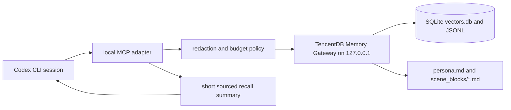

# TencentDB-Agent-Memory Feasibility for Codex CLI and My Agent Workflow

## 1. Executive verdict

Verdict: **Build a small adapter first**.

Do not install this into your real Codex, Kilo, OpenClaw, or Hermes environment today. The default `main` branch implementation is primarily an OpenClaw plugin plus a Hermes sidecar, not a Codex-native memory system. Codex does not consume `openclaw.plugin.json`; Codex plugins use a `.codex-plugin/plugin.json` manifest and separate skill/app/MCP wiring. The newer `feat/server` branch and `v1.0.0` prerelease make the project more interesting because they add a standalone Gateway and TypeScript/Python SDKs, but that still requires a local service plus an adapter for Codex. The useful path for you is a read-only local adapter that queries memory and injects a small, human-auditable summary into Codex prompts; automatic write/capture should wait until you have a redaction policy and deletion workflow. The project is promising, but it is moving fast, has open PRs for real bugs, and has weak visible test coverage on `main`. If you only need project conventions, testing patterns, and debugging notes, `AGENTS.md + MEMORY.md + DECISIONS.md + DEBUG_LOG.md` is safer and probably enough right now. Treat TencentDB-Agent-Memory as an experiment, not infrastructure.

## 2. What the project actually is

TencentDB-Agent-Memory is a TypeScript/Node memory engine wrapped for agent hosts.

The inspected `main` branch at commit `a21ef3f66aebd549dcccc63084c572231b62d245` is package version `0.3.6`. It contains:

- an OpenClaw plugin entry (`index.ts`, `openclaw.plugin.json`);
- a Hermes Python memory provider under `hermes-plugin/memory/memory_tencentdb`;
- a Node HTTP Gateway under `src/gateway`;
- a host-neutral core facade, `TdaiCore`, that handles recall, capture, search, and pipeline scheduling;
- local SQLite storage with `sqlite-vec` and FTS/BM25 fallback;
- optional Tencent Cloud VectorDB storage;
- context offload machinery for long tool logs and Mermaid memory.

The memory model is:

- L0 Conversation: raw user/assistant messages stored as daily JSONL and in SQLite tables.
- L1 Atom: extracted memory records, stored as JSONL and SQLite rows.
- L2 Scenario: Markdown scene blocks under `scene_blocks/`.
- L3 Persona: `persona.md`, with scene navigation.
- Short-term context offload: tool output references in `refs/*.md`, JSONL summaries, and Mermaid task graphs.

The newer `feat/server` branch at commit `4261d10abdf652484b920a2e787d474fa7eb4ab2` is package version `1.0.0` and adds a standalone Gateway v2 API, TypeScript SDK, Python SDK, OpenClaw v2 adapter, Hermes v2 adapter, and more service-oriented code. GitHub marks `v1.0.0` as a prerelease published on 2026-06-11, with `feat/server` as the target branch. That branch is more relevant to Codex integration than `main`, but it is also newer and more complex.

## 3. What is confirmed from the repo

Repository evidence inspected locally:

- `README.md` claims L0 -> L1 -> L2 -> L3 layering, Mermaid symbolic short-term memory, local SQLite default, optional Tencent Cloud VectorDB, OpenClaw integration, Hermes integration, and benchmark improvements.
- `package.json` on `main` is version `0.3.6`, requires Node `>=22.16.0`, uses TypeScript 6, Vitest 4, Vercel AI SDK, `@ai-sdk/openai`, `sqlite-vec@0.1.7-alpha.2`, `@node-rs/jieba`, and optional `opik`.
- `package.json` has a `postinstall` script: `bash scripts/openclaw-after-tool-call-messages.patch.sh 2>/dev/null || true`. This attempts to patch OpenClaw installations after npm install. That is a serious operational smell for your environment.
- `openclaw.plugin.json` exposes OpenClaw tools `tdai_memory_search` and `tdai_conversation_search`, configures capture/extraction/persona/pipeline/recall/embedding/tcvdb/offload, and defaults `storeBackend` to `sqlite`.
- `SKILL.md` is an OpenClaw-oriented setup skill, not a Codex skill. It tells an agent to install/update the OpenClaw plugin, edit `~/.openclaw/openclaw.json`, restart OpenClaw, and validate `~/.openclaw/state/memory-tdai/`.
- `hermes-plugin/memory/memory_tencentdb/README.md` confirms Hermes integration is a Python provider plus Node Gateway sidecar. Hermes calls `/recall`, `/capture`, `/search/memories`, `/search/conversations`, and `/session/end`.
- `src/gateway/config.ts` on `main` resolves data to `TDAI_DATA_DIR`, config `data.baseDir`, default `~/.memory-tencentdb/memory-tdai`, or legacy `~/memory-tdai`. OpenClaw mode stores under OpenClaw state, typically `~/.openclaw/memory-tdai/`.
- `src/utils/pipeline-factory.ts` creates data subdirectories: `conversations`, `records`, `scene_blocks`, `.metadata`, `.backup`.
- `src/core/conversation/l0-recorder.ts` writes raw L0 messages to `conversations/YYYY-MM-DD.jsonl`.
- `src/core/record/l1-writer.ts` writes extracted L1 records to `records/YYYY-MM-DD.jsonl`.
- `src/core/store/sqlite.ts` creates local tables including `l0_conversations`, `l1_records`, FTS tables, and vector tables when embeddings are configured. The SQLite file is `vectors.db`.
- `src/core/hooks/auto-recall.ts` reads `persona.md`, scene index/navigation, and L1 search results for injection.
- `src/utils/sanitize.ts` removes memory tags, some framework metadata, media markers, base64 image data, and framework noise. It does not redact secrets such as API keys, bearer tokens, credentials, private URLs, or customer data from normal text.
- `src/config.ts` defaults `capture.enabled = true`, `extraction.enabled = true`, `recall.enabled = true`, `embedding.provider = "none"`, `storeBackend = "sqlite"`, and `offload.enabled = false`.
- `scripts/install_hermes_memory_tencentdb.sh` downloads npm packages, installs Node dependencies, links Hermes plugin files, writes `/etc/profile.d/memory-tencentdb-env.sh`, and writes `~/.hermes/.env`.
- `scripts/README.memory-tencentdb-ctl.md` documents management commands and states that credentials are written to `$TDAI_DATA_DIR/tdai-gateway.json` with `0600` permissions and redacted display.
- `scripts/openclaw-after-tool-call-messages.patch.sh` searches OpenClaw `dist` files and patches after-tool-call hook events.
- Visible tests on `main` are thin: one TypeScript test file under `src` plus two Hermes Python tests. Changelog entries mention many more tests, but they are not visible in the inspected `main` checkout.

GitHub metadata verified on 2026-06-12:

- Repository: `TencentCloud/TencentDB-Agent-Memory`.
- Created: 2026-04-07.
- Pushed: 2026-06-12.
- Stars: 5293; forks: 461; open issues/PR count: 87.
- Latest release metadata includes `v1.0.0` prerelease on 2026-06-11 targeting `feat/server`.
- Open PR #200 claims vector embeddings are lost after embedding config changes because `needsReindex` is ignored in `tdai-core.ts`.
- Open PR #199 is docs-only and proposes a standalone MCP access roadmap. That means MCP is not confirmed as implemented.
- Open PR #187 proposes an explicit `tdai_memory_write` tool. On inspected `main`, write tooling is not part of the exposed OpenClaw contracts.

Not verified:

- Benchmark methodology, raw benchmark artifacts, or reproducibility.
- npm package contents versus repository branch contents.
- Runtime behavior under Codex CLI.
- Full v1.0.0 server branch quality. I did a targeted pass, not a complete audit.

## 4. Compatibility matrix

| Integration route | Feasibility | Effort | Risk | Verdict | Notes |
| ----------------- | ----------: | -----: | ---: | ------- | ----- |
| Direct Codex plugin | Low | High | High | Not worth it | OpenClaw plugin format is not Codex plugin format. Codex plugins use `.codex-plugin/plugin.json`; this repo uses `openclaw.plugin.json`. |
| MCP adapter | Medium | Medium | Medium | Probably works with small adapter | No MCP server found in inspected branches. PR #199 proposes MCP roadmap. A thin MCP server could wrap Gateway v2 or local scripts. |
| Hermes Gateway bridge | Medium | Medium | Medium | Possible but fragile | Works for Hermes. Codex would still need to call Hermes or the Gateway through a tool/MCP/wrapper. Adds another agent framework. |
| OpenClaw plugin | High for OpenClaw, low for Codex | Low if using OpenClaw | Medium | Use only if you already adopt OpenClaw | Native path for OpenClaw, but it patches OpenClaw runtime for offload and is not needed for Codex. |
| AGENTS.md export | High | Low | Low | Works now | Safest practical route: export selected, reviewed memory summaries into repo markdown or AGENTS.md includes. |
| CLI wrapper | Medium | Medium | Medium | Probably works with small adapter | Wrapper can query local Gateway/SQLite before starting Codex and inject selected memories. Must avoid prompt bloat and stale recall. |
| Local scripts | High for read-only | Low to Medium | Low to Medium | Works now for read-only | `read-local-memory` exists. Direct SQLite/BM25 scripts are easy. Write scripts need redaction and policy. |

Additional routes:

- Codex config/custom tool route: possible only if you define a local MCP/tool integration or script wrapper. Not native from this repo.
- Repository skill route: feasible. A Codex skill can read `MEMORY.md`, query a local Gateway, or call local scripts. This is probably the cleanest Codex-native control surface.
- Tencent Cloud VectorDB backend: not needed for your stated local-first workflow. It introduces cloud lock-in and secret handling.

## 5. Best practical integration path for me

Recommendation: **Do not integrate yet; use AGENTS.md + MEMORY.md first**.

The next best experimental route is: **Create a read-only MCP adapter first**.

Reasoning:

- Codex cannot directly use the OpenClaw plugin.
- The Hermes bridge works for Hermes, but using Hermes only to feed Codex memory is unnecessary coupling.
- The v1.0.0 server branch makes a Gateway/SDK adapter plausible, but it is a prerelease branch and not what `main` currently represents.
- Automatic memory writes are the risky part. They capture raw dialogue and can capture secrets or wrong conclusions.
- Read-only recall is much safer: you can inspect and curate memory first, then let Codex use it as advisory context.
- Your current repo already benefits from explicit `AGENTS.md`, project skills, and markdown learning notes. Those are deterministic, inspectable, easy to diff, and versionable.

The realistic architecture is:

1. Keep canonical rules in `AGENTS.md`, project docs, and skills.
2. Keep human-curated working memory in markdown files.
3. Optionally run TencentDB-Agent-Memory in `/tmp` or a dedicated local directory.
4. Build a small read-only adapter that queries memory and returns only a short, source-linked summary.
5. Add writes only after redaction, allowlists, and deletion/export workflows are proven.

## 6. Minimal PoC plan

Use the newer standalone Gateway route only in a temporary directory. Do not run install scripts. Do not use your real project data.

Temporary setup:

```bash
mkdir -p /tmp/tdai-memory-poc
cd /tmp/tdai-memory-poc
git clone --depth 1 --branch feat/server https://github.com/TencentCloud/TencentDB-Agent-Memory.git repo
cd repo
npm install
```

Start a local Gateway on loopback with throwaway data:

```bash
export TDAI_GATEWAY_CONFIG="$PWD/tdai-gateway.standalone.yaml"
export TDAI_GATEWAY_HOST=127.0.0.1
export TDAI_GATEWAY_PORT=18420
export TDAI_DATA_DIR=/tmp/tdai-memory-poc/data
export TDAI_GATEWAY_API_KEY=local-poc-only
export TDAI_LLM_API_KEY=dummy
export TDAI_LLM_BASE_URL=http://127.0.0.1:9/v1
export TDAI_LLM_MODEL=dummy
node --import tsx/esm src/gateway/server.ts
```

Expected files:

```text
/tmp/tdai-memory-poc/data/
  conversations/
  records/
  scene_blocks/
  .metadata/
  .backup/
  vectors.db
```

Confirm service health from another shell:

```bash
curl -s http://127.0.0.1:18420/health
```

Confirm L0 memory write without sending secrets:

```bash
curl -s \
  -H 'Authorization: Bearer local-poc-only' \
  -H 'x-tdai-service-id: default' \
  -H 'Content-Type: application/json' \
  -d '{
    "session_id": "poc-session-1",
    "messages": [
      {"role": "user", "content": "In this PoC, remember that I prefer REST Assured tests to assert status, headers, body, and DB side effects."},
      {"role": "assistant", "content": "Acknowledged for the PoC."}
    ]
  }' \
  http://127.0.0.1:18420/v2/conversation/add
```

Confirm L0 recall/search:

```bash
curl -s \
  -H 'Authorization: Bearer local-poc-only' \
  -H 'x-tdai-service-id: default' \
  -H 'Content-Type: application/json' \
  -d '{"query":"REST Assured headers body DB side effects","limit":5}' \
  http://127.0.0.1:18420/v2/conversation/search
```

Confirm local artifacts:

```bash
find /tmp/tdai-memory-poc/data -maxdepth 3 -type f | sort
sqlite3 /tmp/tdai-memory-poc/data/vectors.db '.tables'
```

Confirm L1 memory extraction:

- This requires a real LLM endpoint or a local OpenAI-compatible model endpoint.
- Do not use private project data for this.
- If no LLM is configured, expect L0 search to work but L1/L2/L3 extraction to be degraded or absent.

Delete everything afterward:

```bash
# Stop the node process with Ctrl-C in the Gateway shell first.
rm -rf /tmp/tdai-memory-poc
```

Do not run:

```bash
bash scripts/install_hermes_memory_tencentdb.sh
bash scripts/openclaw-after-tool-call-messages.patch.sh
npm install -g ...
```

Those modify real user/system agent state or global paths.

## 7. Adapter design, if needed

Minimal recommendation: a read-only MCP adapter over the standalone Gateway v2 API.



Data flow:

1. Codex starts or user invokes memory lookup.
2. MCP adapter receives a query such as "payment order ETag tests".
3. Adapter rejects queries containing obvious secrets.
4. Adapter calls local Gateway search endpoints.
5. Adapter limits results by character count, age, source, and confidence.
6. Adapter returns a short summary with source IDs and file/table origin.
7. Codex treats it as advisory context, not authority.

Tools exposed:

- `memory_search(query, limit, scope)`: searches L1/L2/L3 if available.
- `conversation_search(query, limit, session_id?)`: searches raw L0 only when explicitly requested.
- `memory_read_source(id_or_path)`: reads one source artifact after the user asks for evidence.
- `memory_health()`: reports data dir, backend, counts, and whether LLM/embedding is configured.

Write API, initially disabled:

- `memory_write(content, type, source, sensitivity)`: only later, after approval.
- `memory_delete(id_or_path)`: required before enabling writes.
- `memory_export(format)`: required before enabling writes.

Safety policy:

- Bind Gateway to `127.0.0.1`.
- Set `TDAI_GATEWAY_API_KEY`.
- Do not expose port `8420` to LAN.
- Keep `TDAI_DATA_DIR` outside private repos unless deliberately versioning sanitized memory.
- Never auto-save terminal logs, `.env`, tokens, Keycloak secrets, API credentials, customer data, proprietary source snippets, or private incident data.
- Store only short conclusions and source references.
- Prefer project-scoped memory over global persona memory.
- Require explicit write confirmation until the redaction policy has been tested.

Where memory is stored:

- Standalone main/0.3.6 Gateway default: `~/.memory-tencentdb/memory-tdai`.
- OpenClaw mode: typically `~/.openclaw/memory-tdai` or OpenClaw state dir.
- PoC: force `TDAI_DATA_DIR=/tmp/tdai-memory-poc/data`.

How Codex would call it:

- Best: Codex MCP server configured as a local tool.
- Acceptable: wrapper script queries Gateway before launching Codex and prepends a compact memory block.
- Low-tech: a Codex skill reads `MEMORY.md` and optionally calls a local script.

## 8. Security risks

Concrete risks:

- Raw conversation capture can store secrets, tokens, logs, stack traces, private source snippets, customer data, and credentials.
- Sanitization is not secret redaction. `sanitize.ts` strips framework/memory tags and some media noise, not normal API keys or bearer tokens.
- Default Gateway auth is off unless `TDAI_GATEWAY_API_KEY` is set.
- The v2 API on the server branch requires a non-empty Bearer token and service ID, but without `TDAI_GATEWAY_API_KEY`, standalone mode treats `apiKey = "local"` as protocol shape, not strong auth.
- Installer scripts write `/etc/profile.d` and `~/.hermes/.env`.
- npm `postinstall` attempts OpenClaw runtime patching.
- Optional Tencent Cloud VectorDB sends memory to a cloud backend.
- Embedding providers can send memory text to remote APIs.
- Persona and scene summaries can silently overgeneralize incorrect facts.
- LLM-generated scene/persona files can preserve wrong or sensitive conclusions.
- Local SQLite and markdown files are plaintext.
- Deletion exists at lower storage layers and v2 API, but a simple, user-facing "forget this everywhere" workflow was not verified on `main`.

Mitigations:

- Keep PoC in `/tmp`.
- Use only synthetic data.
- Set `TDAI_GATEWAY_HOST=127.0.0.1`.
- Set `TDAI_GATEWAY_API_KEY`.
- Keep `embedding.provider = "none"` for first PoC.
- Do not configure Tencent Cloud VectorDB.
- Do not configure remote embeddings until you accept data egress.
- Do not run install or patch scripts.
- Use disk encryption for any real memory store.
- Add a pre-write redaction layer.
- Add allowlisted memory categories.
- Make write operations explicit.
- Add a delete/export command before enabling writes.
- Review `persona.md`, `scene_blocks/`, `records/*.jsonl`, and `conversations/*.jsonl` periodically.

Acceptability for private commercial projects:

- Not acceptable as automatic capture today unless you have legal/security approval, disk encryption, egress controls, redaction, retention policy, and deletion proof.
- Acceptable as a local, synthetic-data experiment.
- Potentially acceptable as a read-only, human-curated memory index over sanitized markdown.

## 9. Performance risks

Concrete risks:

- L1/L2/L3 extraction requires LLM calls. Without a host LLM or standalone LLM endpoint, only L0/local search is useful.
- Remote LLM/embedding calls add latency, cost, and data egress.
- `sqlite-vec@0.1.7-alpha.2` is explicitly alpha-level dependency risk.
- SQLite storage is synchronous through Node `node:sqlite`; this is simple but can block the event loop under larger workloads.
- Background embedding and pipeline scheduling can consume CPU/network after a turn.
- Offload compression has many moving parts and previously had performance bugs according to the changelog.
- The memory pipeline can add latency to every recall if search/embedding stalls; config has a 5s recall timeout by default.
- Months of coding sessions can create large L0 JSONL/SQLite stores; retention defaults to disabled.
- Retrieval quality is not guaranteed to beat curated markdown. Bad L1 extraction can make memory worse than no memory.

Mitigations:

- Start with keyword/BM25 and no embeddings.
- Add strict recall budgets.
- Keep project-scoped stores.
- Rotate or archive raw L0.
- Keep retention enabled after proving cleanup safety.
- Periodically inspect SQLite row counts and JSONL size.
- Prefer explicit "remember this" writes over passive capture.
- Keep canonical rules in `AGENTS.md`, not probabilistic memory.

## 10. Fit for QA Automation / REST / Playwright / Spring Boot learning

Useful memory examples:

- Good memory: "For Payment Quality Lab REST Assured tests, assert status code, ETag/If-Match headers, response body, and database state for lifecycle transitions."
- Good memory: "Payment module must not depend on `merchant.internal`; public module APIs live under module root packages."
- Good memory: "Playwright auth setup uses storage state; avoid UI login per test unless testing login itself."
- Good memory: "When PostgreSQL Testcontainers fails with port errors, check Docker/Podman service and existing containers before changing tests."
- Good memory: "Use `./mvnw verify` from `apps/backend` to include Failsafe `*IT.java` tests."

Bad memory examples:

- Bad memory: "Always mock repositories in Spring tests." Too broad and likely harmful.
- Bad memory: "The payment API has `POST /payments`." False for your current project.
- Bad memory: "Use sleeps to fix Playwright flakes." Bad practice.
- Bad memory: "Disable ETag checks if tests fail." Masks contract bugs.

Memory that should not be saved:

- API keys, tokens, passwords, Keycloak client secrets.
- Real customer/payment data.
- Private incident logs with credentials.
- Large source files copied into chat.
- Temporary stack traces that include environment-specific secrets.
- Anything from a private commercial repo unless approved.

Memory that belongs in `AGENTS.md` instead:

- Stable project-wide rules.
- Non-goals such as no Kafka, no PSP, no top-level `POST /payments`.
- Required test commands.
- Module boundary rules.
- REST API surface.
- Safety constraints for Codex.

Memory that belongs in project docs instead:

- Architecture decisions.
- API contract documentation.
- Database migration rules.
- Test strategy.
- CI/CD workflow.
- Security model.
- Spec Kit decisions.

## 11. Simpler alternative

Use a local markdown memory system first.

Files:

- `AGENTS.md`: stable operating rules, commands, architecture constraints, non-goals.
- `MEMORY.md`: short curated facts the agent should remember across sessions.
- `DECISIONS.md`: architecture decisions with date, context, decision, consequence.
- `DEBUG_LOG.md`: failed fixes, root causes, commands that worked.
- `TESTING_PATTERNS.md`: REST Assured, AssertJ, JUnit, Playwright, Spring Boot testing patterns.

Suggested workflow:

1. At the end of a meaningful session, add 3-8 bullet memories.
2. Mark each memory as `project`, `testing`, `debugging`, `preference`, or `risk`.
3. Keep each memory under 300 characters.
4. Link to source files, PRs, tests, or decision docs.
5. Move stable rules from `MEMORY.md` to `AGENTS.md`.
6. Move durable design choices to `DECISIONS.md`.
7. Move recurring test idioms to `TESTING_PATTERNS.md`.
8. Prune monthly.

Optional later SQLite/BM25:

- Store markdown sections in SQLite FTS5.
- Expose `memory_search.sh "query"` as a local command.
- Return source file and heading, not anonymous summaries.
- Add embeddings only after keyword search stops being enough.

This is less impressive than TencentDB-Agent-Memory, but it is more inspectable, reproducible, and aligned with your learning workflow.

## 12. Final recommendation

Should you use it today?

No, not as automatic memory for Codex CLI.

Should you wait?

Yes for direct adoption. The v1.0.0 server branch is the one to watch, especially if MCP support lands after PR #199 or a real MCP server appears.

Should you build an adapter?

Only a read-only adapter. Build a thin MCP or wrapper around the standalone Gateway v2 API, or around a simpler markdown/SQLite store. Do not start with automatic write/capture.

Should you ignore it?

Do not ignore it. The architecture has useful ideas: layered evidence, human-readable persona/scenes, SQLite local backend, and source traceability. But do not let the branding or benchmark table push you into installing a moving target into your real agent setup.

Next one concrete action:

Create `MEMORY.md`, `DECISIONS.md`, `DEBUG_LOG.md`, and `TESTING_PATTERNS.md` for your current workflow, then run the TencentDB-Agent-Memory PoC with synthetic data in `/tmp` only if you still want to compare retrieval quality.

## TL;DR for terminal

- Verdict: build a small adapter first; do not install into real Codex/OpenClaw/Hermes yet.
- Codex cannot use `openclaw.plugin.json` directly.
- `main` is OpenClaw/Hermes first; `feat/server` adds standalone Gateway/SDKs but is prerelease.
- No MCP implementation verified; open PR #199 is only an MCP roadmap.
- Local SQLite is real and inspectable: JSONL, `vectors.db`, `scene_blocks`, `persona.md`.
- Secret redaction is not enough for private work.
- Avoid Tencent Cloud VectorDB for your local-first goal.
- Best safe path now: `AGENTS.md + MEMORY.md + DECISIONS.md + DEBUG_LOG.md + TESTING_PATTERNS.md`.
- Best experiment later: read-only MCP adapter over the standalone Gateway v2 API.
