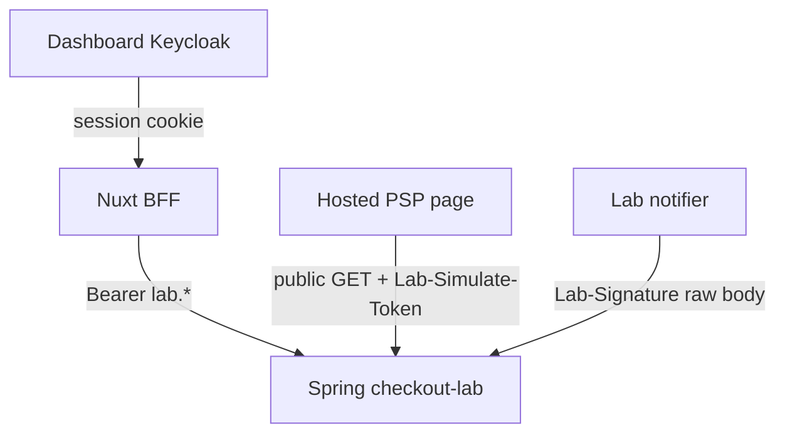

# 01 — Analiza luk biznesowych (product manager)

Zespół: PM + test analyst. Pytanie: **czy wszystkie zaplanowane features CPL są zaimplementowane biznesowo?**

Źródła: [00-context-requirements.md](../../status/roadmaps/checkout-protocol-lab/00-context-requirements.md), epiki E0–E7, [task-board.md](../../status/roadmaps/checkout-protocol-lab/task-board.md) (T01–T30 = DONE), [checkout-protocol-lab-hops.md](../../implementation/checkout-protocol-lab-hops.md), kod `apps/backend/.../checkoutlab` + UI `apps/frontend/app/pages/**/checkout-lab*` i `/psp/checkout`.

## Werdykt

| Warstwa | Status tablicy | Status produktowy |
|---|---|---|
| Rdzeń protokołu (OAuth, 302, hosted, HMAC notify, worker, cash, inspector API, ops clock/reset/reconcile, simulate token) | IMPLEMENTED | **Done** — da się przeprowadzić hop edukacyjny end-to-end |
| Katalog scenariuszy E6-S2 (8 szt.) | T28 DONE | **Partial** — 3 pozycje cienkie lub puste |
| AC „każdy scenario ≥1 test RA/PW” | T30 DONE | **Niespełnione** dla części katalogu |
| Ops UI | nie było osobnego FR | **Missing** (tylko API) |
| UI dla `POST /sessions` 302 | learning copy obiecuje debug panel | **Missing** — booking idzie `POST /bookings` → 200 |

**Rekomendacja PM:** nie otwierać nowych epiców produktowych poza:

1. Implementacja lub **wykreślenie** `OOO_EVENTS` (obecnie enum bez zachowania).
2. Dociągnięcie testów/AC dla `USER_CANCEL`, `PAY_NO_RETURN`, `RETURN_LIE_SUCCESS` (API header).
3. Świadoma decyzja: Ops zostaje API-only (OK dla labu SDET) albo dodać stronę.

Do czasu (1) testy `OOO_EVENTS` oznaczać `blocked`.

Hop-by-hop (pozytyw/negatyw, headers/body): [09-protocol-flow-simulations.md](09-protocol-flow-simulations.md).

---

## FR-01 … FR-15

| ID | Wymaganie | Status | Dowód | Luka | Rec. |
|---|---|---|---|---|---|
| FR-01 | OAuth stub form-urlencoded → Bearer `lab.*` | **Done** | `CheckoutLabOAuthTokenController`; RA OAuth | JSON → 401 (celowo nie 415) — udokumentować w testach | test |
| FR-02 | Create session → **302** + `Location` + JSON `redirectUri` | **Done** (API) | `CheckoutLabSessionController` | Brak strony UI; composable `createSession` + `redirect: 'manual'` nieużywany przez page | test API; opcjonalnie UI P2 |
| FR-03 | Hosted związany z session | **Done** | `/psp/checkout/{sessionId}`; public GET | — | test |
| FR-04 | `continueUrl` niewiarygodny hint | **Done** | Return page + hub alert; PW lie return | Brak RA z `Lab-Force-Scenario: RETURN_LIE_SUCCESS` | test |
| FR-05 | Stub event `Lab-Signature`, `Lab-Event-Id` | **Done** | Notifier + receiver | — | test |
| FR-06 | HMAC raw body → inbox → **202** | **Done** | `CheckoutLabNotifyReceiverService` | — | test |
| FR-07 | Worker re-fetch przed fulfill | **Done** | `CheckoutLabInboxWorker` + SKIP LOCKED RETURNING | Trudne do zaobserwowania z UI | test API/RA |
| FR-08 | Dedup `eventId` → 200, 0 side-effect | **Done** | RA duplicate | Precedencja header vs body `id` — cienko | test |
| FR-09 | **400** no retry; **503** retry | **Done** | BAD_SIGNATURE, NOTIFY_5XX_RETRY | Brak UI ćwiczącego 400/503 (tylko copy na hubie) | test API; E2E P2 |
| FR-10 | Payment link `validityUntil` | **Done** | Clock + 409 `expired_link`; countdown UI | PW expiry niepokryty | test |
| FR-11 | `Idempotency-Key` + conflict | **Done** | hash = SHA-256(klucz); fingerprint bez `validitySeconds` | Zmiana samego `validitySeconds` = replay (świadome) | test |
| FR-12 | Booking cash vs online | **Done** | `CheckoutLabBookingController`; UI form | PW cash przez prefix `CASH-*` w mocku, nie select mode | test |
| FR-13 | Event Inspector | **Partial** | UI: events + signature; API deliveries/anomalies | PW nie asertuje deliveries/anomalies/ErrorState/`lastError` | test |
| FR-14 | Scenario engine | **Partial** | Enum + `fromHeader`; część zachowań | patrz tabela scenariuszy | fix + test |
| FR-15 | Reconcile + anomaly | **Done** (API) | UNIQUE `(session_id, kind)`; Inspector woła anomalies | Brak Ops UI; PW anomalies nie | test |

## NFR

| ID | Status | Uwaga testowa |
|---|---|---|
| NFR-01 ACK p95 poniżej 200 ms | Niezmierzony | Poza katalogiem funkcjonalnym |
| NFR-02 `X-Correlation-ID` | **Done** | Echo na error + create; SecurityChain OAuth |
| NFR-03 Structured log | **Done** (impl) | Słabo testowalne z PW; log IT opcjonalny |
| NFR-04 Constant-time compare | **Done** | Unit `CheckoutLabSignatureServiceTest` |
| NFR-05 Modulith zielony | **Done** | `CheckoutLabModuleTest` — poza PW |

## Constraints C-01…C-07

Wszystkie **trzymane**: brak Kafki/PAN, modulith `internal`, flaga, nie ruszamy `MockPspClient`, amountMinor+ISO, fulfill po evencie, testy RA+PW.  
C-03: `CheckoutLabEndpointsDisabledIT` istnieje — PW flaga `NUXT_PUBLIC_CHECKOUT_LAB_ENABLED=false` **nie** w katalogu existing.

---

## Hops protokołu

| Hop | Status | Test existing | Luka |
|---|---|---|---|
| `POST /oauth/token` | Done | RA | grant_type/missing fields EP |
| `POST /sessions` 302 | Done | RA | BVA amount; unknown scenario; BFF 302 |
| `GET /hosted/sessions/{id}` + `simulateToken` | Done | RA + PW mock | 404; token null gdy EXPIRED/COMPLETED |
| `POST …/simulate` + `Lab-Simulate-Token` | Done | RA 403 missing | invalid token; aliases outcome; noop terminal |
| `POST /notify` 202/200/400/503 | Done | RA | tolerance HMAC; malformed header; Lab-Event-Id vs body |
| Worker SKIP LOCKED | Done | RA happy + 5xx | konkurencja dwóch workerów — poza MVP |
| `GET hosted …/fulfillment` oracle | Done | PW return | 404 empty vs Bearer problem |
| Cash `POST /bookings` | Done | RA + PW mock | mode case-insensitive; GET booking |

---

## Katalog scenariuszy (E6-S2) — GAP

| Scenario | Planowane zachowanie | Implementacja | Test | GAP |
|---|---|---|---|---|
| `HAPPY_COMPLETED` | Approve → completed → CONFIRMED | Default path | existing-ra, existing-pom | — |
| `USER_CANCEL` | Decline → fulfillment `CANCELLED` | Decline emituje `checkout.session.canceled`; **enum nic nie zmienia** | **brak** dedykowanego | Partial — dodać TC Decline; header opcjonalny |
| `RETURN_LIE_SUCCESS` | hint success, **brak** notify | `skipNotify()` | existing-pom (bez header); **brak RA** | Partial |
| `BAD_SIGNATURE` | zły HMAC → 400, 0 insert | `shouldSignIncorrectly()` | existing-ra | — |
| `NOTIFY_5XX_RETRY` | 503 potem 202 | `consumeForced503()` | existing-ra | — |
| `OOO_EVENTS` | odwrócona kolejność eventów | **Tylko enum** — brak emit/reorder | brak | **Missing (GAP-01)** |
| `EXPIRED_LINK` | validity w przeszłości; simulate 409 | Create ustawia `validityUntil=now-1s` | existing-ra przez clock; header path cienki | Partial |
| `PAY_NO_RETURN` | completed bez wizyty return | Brak specjalnej logiki (to normalna ścieżka) | **brak PW close-tab** | Partial (GAP-02) — zachowanie = happy minus return; TC E2E wystarczy |

Unknown header → 400 `validation` (`UnknownCheckoutScenarioException`) — **brak** existing test.

### Rekomendacje produktowe

| ID | Finding | Priorytet | Działanie |
|---|---|---|---|
| GAP-01 | `OOO_EVENTS` obiecane w AC, nie działa | High | Zaimplementować reorder **albo** usunąć z katalogu i hops |
| GAP-02 | E4-S4 close-tab nie ma PW | Medium | **zamknięty** — PW-E2E-043 existing-pom `approve without return still confirms fulfillment (PAY_NO_RETURN)` |
| GAP-03 | `USER_CANCEL` jako named scenario jest no-op | Low | Albo spiąć z default Decline, albo dokument „użyj outcome CANCELED” |
| GAP-04 | Brak Ops UI | Low | Zostawić API (SDET-first) — nie blocker |
| GAP-05 | Copy booking wspomina 302 debug na „direct session create”, UI go nie ma | Low | Usunąć zdanie albo dodać mini-form 302 |
| GAP-06 | AC per-scenario test | Medium | Katalog 03–05 zamyka lukę testową bez czekania na GAP-01 (blocked) |
| GAP-07 | Idempotency: zmiana tylko `validitySeconds` | Low (test) | PW-API-026 / EP-113 **existing-ra** — produkt już replay (fingerprint bez TTL) |

Mapa UC / „już zapłacone” / dwa światy: [README](README.md). Śledzenie ID: [08](08-traceability-matrix.md).

### Luki testowe (designed) — jawne ID

Nie mylić z luką produktową GAP-01. Poniższe zachowanie **jest** w kodzie (albo jest świadomym no-opem scenariusza); brakuje **specu**.

| ID testu | Scenariusz | Status |
|---|---|---|
| PW-API-071 | `RETURN_LIE_SUCCESS` przez header → 0 eventów, fulfillment AWAITING | designed (UI: PW-E2E-040 existing) |
| PW-E2E-043 | PAY_NO_RETURN: Approve, nie return, poll fulfillment CONFIRMED | existing-pom |
| PW-API-075 | to samo REST (simulate + GET fulfillment, bez GET return) | designed |
| PW-API-026 | ten sam `Idempotency-Key`, inny tylko `validitySeconds` → 302 replay | existing-ra |
| PW-API-076 | `OOO_EVENTS` | **blocked** GAP-01 |

---

## Identity worlds (kontrakt produktowy)

| Świat | Produktowo dozwolone | Produktowo zabronione |
|---|---|---|
| Keycloak | Hub, Booking, Inspector, Error Lab | Notify, hosted simulate jako „zaloguj się” |
| Lab Bearer | Merchant create, inspector API, ops | Zastępowanie HMAC |
| HMAC | Tylko `POST /notify` | Dashboard login |
| Simulate token | Tylko `POST …/simulate` po GET hosted | Traktowanie UUID sesji jako secret |

---

## User-facing flows vs UI

| Flow | Zaimplementowany? | Uwagi PM |
|---|---|---|
| Hub 4 karty identity + hosted capability | Tak | PW sprawdza „Hosted capability” |
| Booking ONLINE → open hosted | Tak | 200 JSON `redirectUri` — **nie** 302 |
| Booking CASH → CONFIRMED, brak przycisku hosted | Tak | |
| Hosted Approve / Decline | Tak | PW tylko Approve |
| Return poll fulfillment | Tak | |
| Inspector Load events | Tak | deliveries/anomalies w kodzie, cienkie PW |
| Clock / reset z UI | **Nie** | API only — OK jeśli SDET |
| Direct 302 session create z UI | **Nie** | |

## Non-goals (nie testować jako CPL)

Kafka, outbox prod, real PSP, PAN, 3DS, settlement, KYC, zmiana realm, `tenant.webhook_base_url` jako IPN, `event_publication` jako inbox, F-D2 jako substytut hosted session.

F-D2 zostaje **osobnym** zestawem (`psp-redirect-simulator.spec.ts`) — multi-tab bez order binding. Nie wliczać do pokrycia FR-03.

---

## Definition of Done programu vs rzeczywistość

| Kryterium DoD | Met? |
|---|---|
| Flaga off → brak powierzchni | Tak (IT disabled) |
| Żaden test nie używa `continueUrl` jako jedynego oracle | PW lie return spełnia; pilnować w nowych TC |
| Brak Kafki / PAN | Tak |
| Modulith + RA + chromium dla nowych speców | Tak dla istniejącego zestawu; katalog designed niezaimplementowany |
| REST-REDIRECT-01 zamknięty przez CPL | Status registry — poza tą analizą kodu |

**Podsumowanie PM:** produkt nadaje się do nauki hops. **Nie** jest kompletny względem własnego katalogu scenariuszy (`OOO_EVENTS`). Mapa testów 03–08 zakłada testowanie **zaimplementowanego** zachowania i oznacza blocked tam, gdzie feature nie istnieje.
