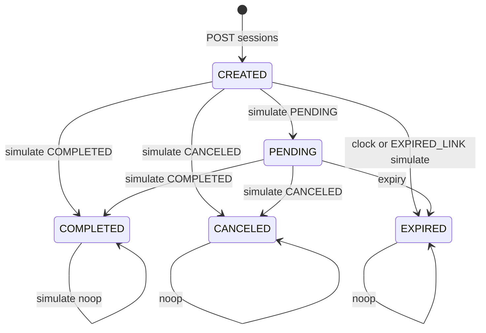

# 07 — Decision tables, stany, use case, pairwise, error guessing

Techniki ISTQB FL 4.2.3–4.2.5 i 4.4 oraz dodatki interview (pairwise, classification tree, checklist).

Reguła: każda **kolumna akcji** ma konkretny HTTP i `error` tam, gdzie dotyczy. Implementacja = `PW-API-*` / `PW-E2E-*`.

---

## 7.1 Decision table — powierzchnia auth (DT-AUTH)

Warunki: NoAuth | LabBearer | KeycloakJWT | HMAC | SimulateToken.  
„—” = nie dotyczy. Wynik = status (i `error` jeśli problem+json).

| ID | Endpoint | NoAuth | Lab Bearer | KC JWT only | HMAC valid | Simulate token |
|---|---|---|---|---|---|---|
| DT-A01 | POST `/oauth/token` (form OK) | 200 | n/a | n/a | n/a | n/a |
| DT-A02 | POST `/oauth/token` (złe creds) | 401 empty | n/a | n/a | n/a | n/a |
| DT-A03 | GET `/health` | 200 | 200 | 200 | n/a | n/a |
| DT-A04 | POST `/sessions` | **401** empty | **302** | **401** | n/a | n/a |
| DT-A05 | GET `/sessions/{id}` | 401 | 200 | 401 | n/a | n/a |
| DT-A06 | GET `/hosted/sessions/{id}` | **200** | 200 | 200 | n/a | n/a |
| DT-A07 | POST `…/simulate` brak tokenu | **403** `missing_simulate_token` | 403 (token i tak wymagany) | 403 | n/a | — |
| DT-A08 | POST `…/simulate` + token | **200** | 200 | 200 | n/a | **200** |
| DT-A09 | POST `/notify` brak HMAC | **400** `invalid_signature` | 400 | 400 | — | n/a |
| DT-A10 | POST `/notify` HMAC OK | **202** | 202 | 202 | **202** | n/a |
| DT-A11 | POST `/bookings` | 401 | **200** | 401 | n/a | n/a |
| DT-A12 | POST `/clock` `/reset` `/reconcile` | 401 | **200** | 401 | n/a | n/a |
| DT-A13 | GET `/anomalies` | 401 | 200 | 401 | n/a | n/a |
| DT-A14 | OPTIONS `/sessions` | **nie 401** | n/a | n/a | n/a | n/a |
| DT-A15 | OPTIONS `/notify` CORS | 200/204 + Allow-Headers | n/a | n/a | n/a | n/a |

Mapowanie: DT-A04 → PW-API-021/022; DT-A07 → PW-API-110; DT-A09 → PW-API-203; DT-A14 → PW-API-023.

**Collapsed tests (minimal hitting set):** A04 noauth, A04 lab, A04 KC, A06, A07, A08, A09, A10, A11, A12, A14 — 11 TC pokrywa tabelę.

---

## 7.2 Decision table — simulate status gate (DT-SIM)

Warunki: CurrentStatus × Expired × Token × Outcome.

| ID | Status | Expired | Token | Outcome | HTTP | Effect |
|---|---|---|---|---|---|---|
| DT-S01 | CREATED | N | valid | COMPLETED | 200 | COMPLETED + notify (happy) |
| DT-S02 | CREATED | N | valid | CANCELED | 200 | CANCELED + notify canceled |
| DT-S03 | CREATED | N | valid | PENDING | 200 | PENDING, 0 notify |
| DT-S04 | PENDING | N | valid | COMPLETED | 200 | COMPLETED + notify |
| DT-S05 | CREATED | Y | valid | COMPLETED | **409** `expired_link` | session+fulfillment EXPIRED, 0 notify |
| DT-S06 | CREATED | N | missing | * | **403** `missing_simulate_token` | no change |
| DT-S07 | CREATED | N | invalid | * | **403** `invalid_simulate_token` | no change |
| DT-S08 | COMPLETED | N | stale/valid | COMPLETED | 200 noop **lub** 403 jeśli brak tokenu | 0 drugi event |
| DT-S09 | CANCELED | N | — | COMPLETED | jak S08 | no resurrection |
| DT-S10 | EXPIRED | N/Y | — | COMPLETED | 409 lub 200 EXPIRED unchanged | brak COMPLETED |
| DT-S11 | CREATED | N | valid | FOO | **400** `validation` | no change |
| DT-S12 | unknown id | — | any | COMPLETED | **404** `not_found` (GET session w verify) | — |

Mapowanie: S01 PW-API-113; S05 PW-API-130; S06–S07 110–111; S11 117.

---

## 7.3 Decision table — notify ACK (DT-NFY)

| ID | Signature | Duplicate eventId | Scenario 5xx first | HTTP | Body | Inbox |
|---|---|---|---|---|---|---|
| DT-N01 | valid | N | N | **202** | `{duplicate:false}` | insert RECEIVED |
| DT-N02 | valid | Y | N | **200** | `{duplicate:true}` | 0 nowy wiersz |
| DT-N03 | invalid | — | — | **400** `invalid_signature` | problem | 0 insert |
| DT-N04 | valid | N | Y (first) | **503** `transient_error` | problem | 0 insert tego requestu |
| DT-N05 | valid | N | Y (retry) | **202** | duplicate false | insert |

Learning: 400 = do not retry; 503 = retry; 202 ≠ CONFIRMED (worker osobno).

---

## 7.4 Decision table — mode × fulfillment (DT-MODE)

| ID | mode | Session row | Fulfillment | booking HTTP | redirectUri |
|---|---|---|---|---|---|
| DT-M01 | CASH | nie | CONFIRMED | 200 | null |
| DT-M02 | ONLINE | CREATED | AWAITING_PAYMENT | 200 | hosted URL |
| DT-M03 | ONLINE → simulate COMPLETED → worker | COMPLETED | CONFIRMED | — | — |
| DT-M04 | ONLINE → Decline → worker | CANCELED | CANCELLED | — | — |
| DT-M05 | ONLINE → lie / skip notify | COMPLETED possible | AWAITING | — | — |

---

## 7.5 State transition — session (ST-SES)

Stany: `CREATED`, `PENDING`, `COMPLETED`, `CANCELED`, `EXPIRED`.



| ID | From | Event | To | HTTP simulate | Invalid? |
|---|---|---|---|---|---|
| ST-001 | CREATED | COMPLETED | COMPLETED | 200 | |
| ST-002 | CREATED | CANCELED | CANCELED | 200 | |
| ST-003 | CREATED | PENDING | PENDING | 200 | |
| ST-004 | CREATED | expiry | EXPIRED | 409 | |
| ST-005 | PENDING | COMPLETED | COMPLETED | 200 | |
| ST-006 | COMPLETED | CANCELED | COMPLETED | 200 noop | **invalid business** — nie cofa |
| ST-007 | CANCELED | COMPLETED | CANCELED | 200 noop | nie resurrect |
| ST-008 | EXPIRED | COMPLETED | EXPIRED | 409 lub noop | |

Pokrycie: każda **valid** strzałka + 2 invalid (ST-006, ST-007) = P0.

---

## 7.6 State transition — fulfillment (ST-FUL)

Stany: `AWAITING_PAYMENT`, `CONFIRMED`, `CANCELLED`, `EXPIRED`.

| ID | From | Trigger | To |
|---|---|---|---|
| ST-010 | (new ONLINE) | create | AWAITING_PAYMENT |
| ST-011 | (new CASH) | create cash | CONFIRMED |
| ST-012 | AWAITING | inbox `checkout.session.completed` | CONFIRMED |
| ST-013 | AWAITING | inbox `checkout.session.canceled` | CANCELLED |
| ST-014 | AWAITING | expire session | EXPIRED |
| ST-015 | AWAITING | lie / no event | AWAITING (stay) |
| ST-016 | CONFIRMED | drugi completed | CONFIRMED (no-op worker) |
| ST-017 | CANCELLED | completed event | CANCELLED (no-op — fulfillment not awaiting) |

Oracle: ST-016/017 GET fulfillment unchanged; event może być DONE.

---

## 7.7 State transition — event processStatus (ST-EVT)

`RECEIVED → PROCESSING → DONE | FAILED`; duplikat ingest nie tworzy drugiego RECEIVED.

| ID | From | Event | To | Uwaga |
|---|---|---|---|---|
| ST-020 | — | POST notify 202 | RECEIVED | ackStatus 202 |
| ST-021 | RECEIVED | worker claim RETURNING | PROCESSING | SKIP LOCKED |
| ST-022 | PROCESSING | success refetch | DONE | fulfill maybe |
| ST-023 | PROCESSING | rollback | RECEIVED | jeden TransactionTemplate |
| ST-024 | — | duplicate notify | (brak nowego) | HTTP 200 |
| ST-025 | * | 400 HMAC | (brak wiersza) | |

Obserwacja PROCESSING: wąski race — P2; DONE+202 path P0.

---

## 7.8 Use cases (UC)

### UC-01 Happy book-pay-return — P0

Aktor: merchant tester + płatnik.  
Główny: Booking ONLINE → Open hosted → Approve (token) → Return.  
Oracle: fulfillment CONFIRMED; event DONE; hint success **dodatkowy**.  
TC: PW-E2E-010, 050, 041; PW-API-113, 200.

Rozszerzenia: 5xx retry (UC-01a), EUR/USD (UC-01b).

### UC-02 Cash — P0

Booking CASH → CONFIRMED, brak hosted.  
TC: PW-E2E-011; PW-API-300.

### UC-03 Lie return — P0

Płatnik otwiera continueUrl z `status=success` bez Approve.  
Oracle: AWAITING.  
TC: PW-E2E-040; PW-API-071.

### UC-04 User cancel — P0

Decline → return failure → CANCELLED.  
TC: PW-E2E-022, 042; DT-S02.

### UC-05 Pay no return — P0

Approve, zamknij tab, nie return.  
Oracle: CONFIRMED via GET fulfillment.  
TC: PW-E2E-043; PW-API-075.

### UC-06 Expired link — P0

Clock / EXPIRED_LINK → Approve zablokowane / 409.  
TC: PW-E2E-024; PW-API-130.

### UC-07 Inspect after pay — P1

Inspector Load → signature, deliveries 202, process DONE.  
TC: PW-E2E-060–062.

### UC-08 Unauth vs public — P0

Dashboard bez sesji → login; hosted/return bez sesji → 200 UI.  
TC: PW-E2E-007, 020, 045.

### UC-09 Reconcile mismatch — P1

COMPLETED session + AWAITING fulfillment → anomaly unique.  
TC: PW-API-405.

### UC-10 Unknown scenario — P1

Header garbage → 400.  
TC: PW-API-029.

---

## 7.9 Pairwise — mode × currency × scenario (PWISE)

Pełny kartezjusz: 2 mode × 3 currency × 8 scenario = 48. Pairwise (każda para wartości ≥1 raz) ≈ **8–12** wierszy.

Minimal covering array (przykład):

| ID | mode | currency | scenario | Oczekiwanie skrót |
|---|---|---|---|---|
| PWISE-01 | ONLINE | PLN | HAPPY_COMPLETED | CONFIRMED po approve |
| PWISE-02 | ONLINE | EUR | RETURN_LIE_SUCCESS | AWAITING mimo success hint |
| PWISE-03 | ONLINE | USD | BAD_SIGNATURE | 400, 0 event |
| PWISE-04 | ONLINE | PLN | NOTIFY_5XX_RETRY | 503→202 CONFIRMED |
| PWISE-05 | ONLINE | EUR | EXPIRED_LINK | 409 |
| PWISE-06 | ONLINE | USD | USER_CANCEL | CANCELLED po decline |
| PWISE-07 | CASH | PLN | HAPPY_COMPLETED | CONFIRMED, header scenario ignorowany na cash path |
| PWISE-08 | CASH | EUR | EXPIRED_LINK | CASH i tak CONFIRMED (brak linku) — **sprawdzić** |
| PWISE-09 | ONLINE | PLN | PAY_NO_RETURN | CONFIRMED bez return |
| PWISE-10 | ONLINE | USD | OOO_EVENTS | **blocked** |

CASH × scenario: `createCash` **nie** przekazuje `Lab-Force-Scenario` — pairwise uczy, że kombinacja jest martwa (PWISE-07/08).

---

## 7.10 Classification tree (skrót) — POST sessions

```text
CreateSession
├── Auth: none | lab | KC
├── Idempotency: none | sameFp | otherFp
├── Amount: invalid | min | max | nominal
├── Currency: PLN | EUR | USD | other
└── Scenario: omit | known | unknown
```

Liście valid ∩ lab ∩ nominal ∩ PLN ∩ omit = happy (1 TC).  
Nie testować wszystkich liści — DT-AUTH + EP currency + EP idempotency wystarczą. Drzewo = pomoc interview.

---

## 7.11 Error guessing (EG) i checklist (CL)

| ID | Pomysł | Oczekiwanie | Prio |
|---|---|---|---|
| EG-01 | JSON notify pretty-print po HMAC (re-serialize) | 400 `invalid_signature` | P0 |
| EG-02 | Double Approve | 1 event | P1 |
| EG-03 | Bearer na notify zamiast HMAC | 400 | P0 |
| EG-04 | Simulate token w query string nie header | 403 missing | P1 |
| EG-05 | `Idempotency-Key` na bookings | ignorowany; dwa bookingi | P2 |
| EG-06 | Trailing slash `/sessions/` | 404/401 — zanotować | P2 |
| EG-07 | Hosted GET wyciek notifyUrl | pole nieobecne | P0 |
| EG-08 | 401 problem+json (fałszywa nauka) | **puste** body | P0 |
| EG-09 | CORS credentials + Origin | Allow-Origin localhost:3000 | P1 |
| EG-10 | Clock bez reset — flaky expiry | reset w `@After` / reset endpoint | P0 |
| EG-11 | UUID nil `00000000-...` | 404 not_found | P2 |
| EG-12 | Duplicate reconcile race | UNIQUE łapie; created 0 | P1 |
| CL-01 | problem+json: type, title, status, detail, instance, code, error, correlationId | wszystkie na 400/403/409/404 | P0 |
| CL-02 | `instance` = request URI | RFC 9457 | P1 |
| CL-03 | `X-Correlation-ID` echo na error | tak | P1 |
| CL-04 | Flag off 404 | IT existing | P0 |
| CL-05 | `@Profile("!prod")` | nie w PW | P2 |
| CL-06 | Zero `waitForTimeout` | standard PW | P0 |
| CL-07 | F-D2 vs CPL URL | nie mylić testid | P1 |
| CL-08 | OPTIONS nie 401 | Bearer skip | P0 |

### Exploratory charter (nie TC)

„Znajdź sposób na CONFIRMED bez `checkout.session.completed` w inboxie (poza CASH).”  
Czas 45 min. Notatka → nowy EG jeśli znajdzie.

---

## 7.12 Cause-effect (skrót interview)

- **Przyczyna:** HMAC OK ∧ nowe eventId ∧ nie 5xx → **Skutek:** 202 ∧ wiersz RECEIVED.  
- **Przyczyna:** HMAC OK ∧ znane eventId → 200 ∧ 0 insert.  
- **Przyczyna:** session COMPLETED ∧ fulfillment AWAITING ∧ reconcile → anomaly 1.  
- **Przyczyna:** simulate ∧ (expired ∨ scenario EXPIRED_LINK) → 409 ∧ EXPIRED.

Wystarczy do narysowania grafu na tablicy; DT-NFY/DT-SIM są wykonalną formą.
