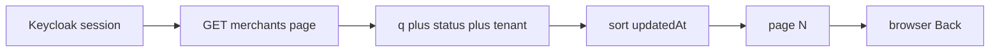
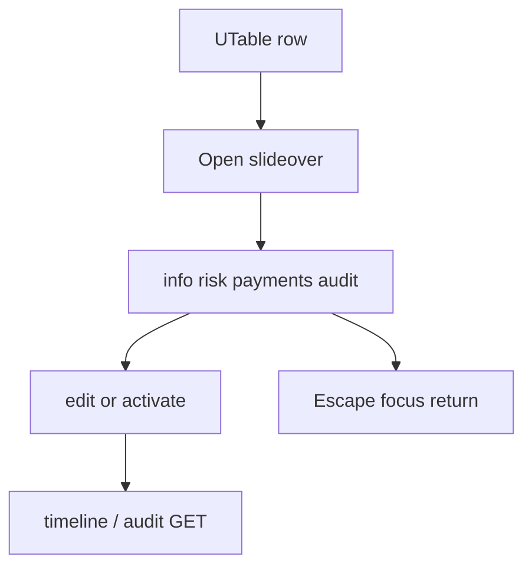
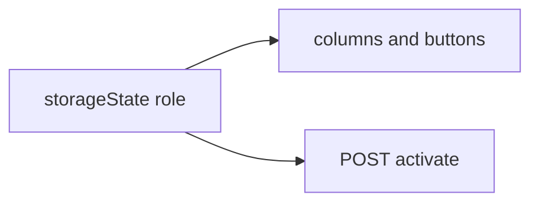
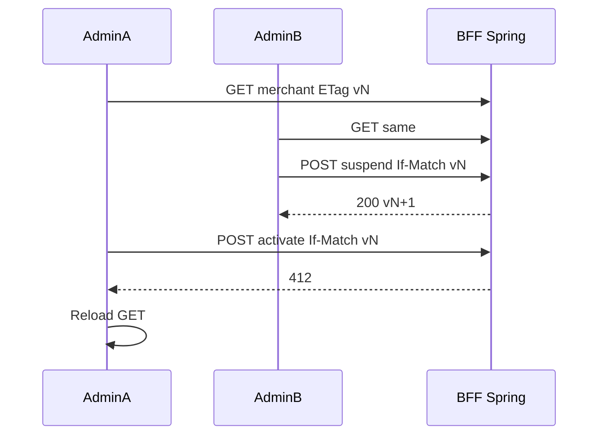
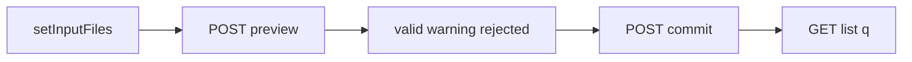
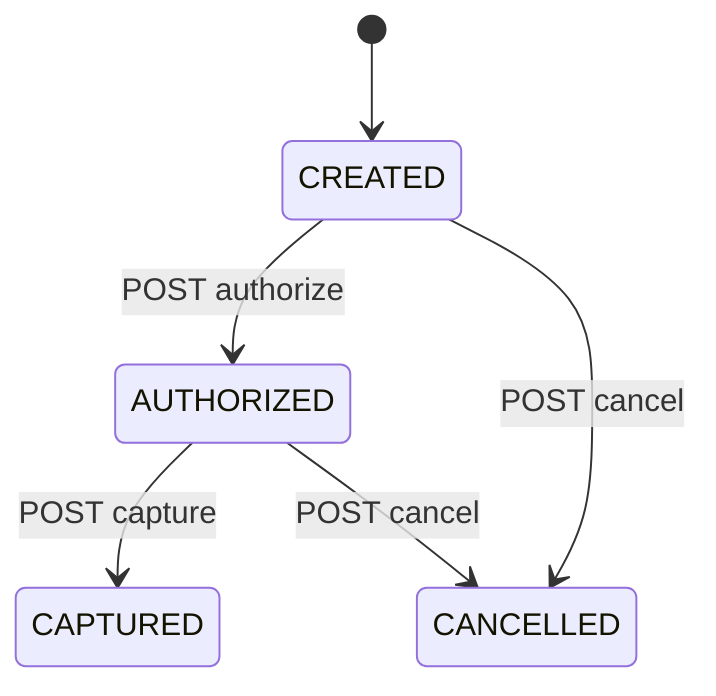

# 00 — Business flows (PM)

Sukces operatora to **znaleziony merchant, legalna zmiana stanu, izolacja tenanta**, nie „tabela się narysowała”.

Nie-oracle (fałszywy sukces): sam `innerText` bez GET; schowany przycisk bez 403; sort tylko w RAM na 50 wierszach; Kanban bez POST lifecycle.

Persony i seed: [live-pom-wave-2/09](../live-pom-wave-2/09-core-domain-flows.md). Stos: `scripts/dev-stack.sh --app`.

Kanon PM: [playbook 01](../playwright-method-playbook/01-pm-business-flows.md).  
Para z Ops Wave 2: [m360-ops-wave-2-value-and-learning.md](../m360-ops-wave-2-value-and-learning.md) · flow ops: [ops 00](../ops-wave-2-interaction-lab/00-business-flows.md).

### Co te flowy dają (M360)

Rejestr merchanta zachowuje się jak ERP: **znajdź (GET+URL), otwórz 360, zmień stan legalnie, nie zgub izolacji**. Ops Wave 2 nie zastępuje tych ścieżek — dokłada conflict workspace, support queue i PIN na tym samym merchancie/płatności.

---

## BF-M360-01 — Registry: znajdź i posortuj

**BC:** BC-M360-02, BC-M360-10  
**Aktor:** platform.admin / tenant.admin

| Krok | Oracle | Nie-oracle |
|---|---|---|
| Apply filtrów | GET query string; wiersze zgodne | filter `computed` na pierwszej stronie |
| Sort header | `waitForResponse` `sort=` | kolejność DOM bez requestu |
| Back | ten sam `?q=&status=&page=` | localStorage magia |

**UC:** UC-M360-10, UC-M360-11 · **AT:** AT-M360-10 · **TC:** E2E-020…032

---

## BF-M360-02 — Merchant 360 (analog Customer 360)

**BC:** BC-M360-20, BC-M360-21, BC-M360-61

| Krok | Oracle | Nie-oracle |
|---|---|---|
| Open | `role=dialog` + GET `/{id}` 200 | zmiana route na detail |
| Escape | dialog hidden | klik overlay tylko |
| Activate | POST + GET status ACTIVE + wpis historii | sam badge |

**UC:** UC-M360-20, UC-M360-21, UC-M360-61 · **AT:** AT-M360-20 · **TC:** E2E-060…073, E2E-132

---

## BF-M360-03 — RBAC: UI hide i 403

**BC:** BC-M360-30

Nie-oracle: „readonly nie widzi Delete” bez `API-040` 403.

**UC:** UC-M360-30 · **AT:** AT-M360-30 · **TC:** SEC-010…014, API-040, RA-040

---

## BF-M360-04 — Dwóch operatorów, stale ETag

**BC:** BC-M360-31

Nie-oracle: 409 jako lock (w labie 409 = duplikat/idempotency).

**UC:** UC-M360-31 · **AT:** AT-M360-31 · **TC:** SEC-020, RA-050…055

---

## BF-M360-05 — Import CSV

**BC:** BC-M360-40

Preview **nie** INSERT. Drugi commit tego samego preview → 409.

**UC:** UC-M360-40, UC-M360-41 · **AT:** AT-M360-40 · **TC:** E2E-080…085, RA-060…063

---

## BF-M360-06 — Pipeline płatności (Kanban)

**BC:** BC-M360-41 · **Aktor:** merchant.manager.wN (nie Alpha seed)

Drop/menu = **istniejący** lifecycle + If-Match. Nielegalna krawędź = problem+json, karta wraca.

**UC:** UC-M360-42 · **AT:** AT-M360-42 · **TC:** E2E-090…094

---

## BF-M360-07 — Drzewo + Ctrl+K + summary

**BC:** BC-M360-50…52

Nawigacja hierarchii i skok do encji; chart = `GET summary`, nie piksele.

**UC:** UC-M360-50…52 · **AT:** AT-M360-50 · **TC:** E2E-100…121
