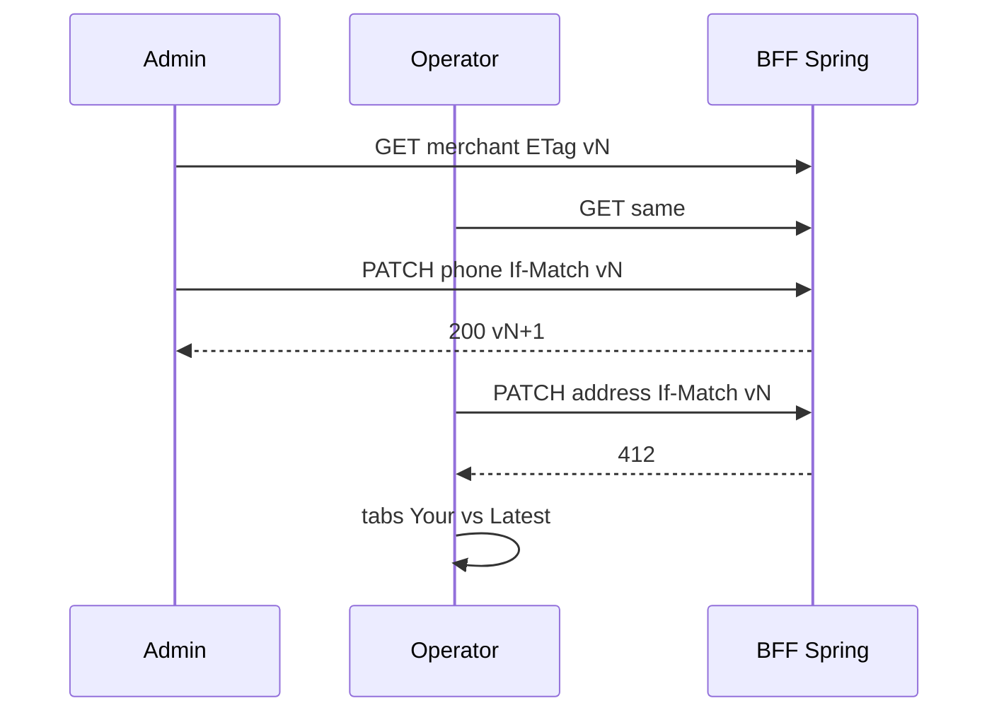
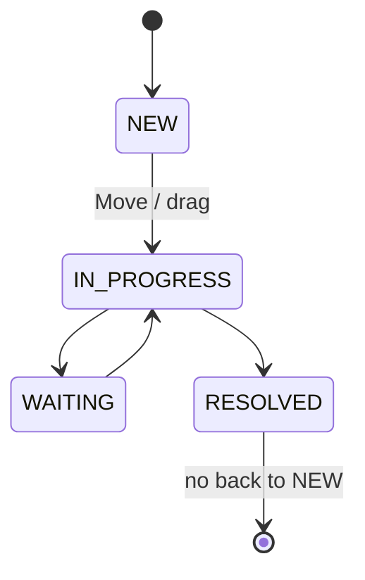

# 00 — Business flows (Ops Wave 2)

Sukces operatora to **zapisana sprawa / polityka / PIN bez utraty cudzej edycji**, nie „Kanban się narysował”.

Nie-oracle: `innerText` bez PATCH; schowany Save bez 403; 409 jako stale lock; `routeWebSocket` zamiast prawdziwej ramki; pixel-drag slidera.

Persony: `platform.admin`, **`platform.operator`** (drugi writer), `support.agent`, `merchant.manager`, `readonly.user`. Stos: `scripts/dev-stack.sh --app`.

Kanon PM: [playbook 01](../playwright-method-playbook/01-pm-business-flows.md).  
Para z Merchant 360: [m360-ops-wave-2-value-and-learning.md](../m360-ops-wave-2-value-and-learning.md). Payment-status Kanban zostaje w [BF-M360-06](../merchant-360-erp-lab/00-business-flows.md).

---

## BF-OPS-01 — Dwóch writerów, 412 + conflict workspace

**BC:** BC-OPS-13 · **UC:** UC-OPS-13…15

409 zostaje dla duplikatu / idempotency / illegal case — **nie** dla stale If-Match.

**TC:** RA-OPS-050…055, PW-OPS-SEC-020, E2E-130…132

---

## BF-OPS-02 — Dirty form (Stay / Discard / beforeunload)

**BC:** BC-OPS-16 · **UC:** UC-OPS-16, 17

Dirty telefon → Back → Stay = ten sam URL, PATCH=0. Discard = lista bez lokalnego telefonu. `beforeunload` = native dialog.

**TC:** E2E-160…164

---

## BF-OPS-03 — Support Work Queue (nie payment status)

**BC:** BC-OPS-11 · **UC:** UC-OPS-11, 12, 18, 19

Menu Move = P0. `dragTo` = P1. 412 = karta wraca + toast. Illegal drop = 409.

**TC:** RA-OPS-110…122, E2E-110…114

---

## BF-OPS-04 — Bulk assign partial

**BC:** BC-OPS-15 · **UC:** UC-OPS-20, 21

Dwa OK + dwa fail w jednym POST. Modal: `successCount` + wiersze fail. Retry body **tylko** failed ids.

**TC:** RA-OPS-150…154, E2E-150…153, API-031

---

## BF-OPS-05 — Step-up PIN high-value refund

**BC:** BC-OPS-17 · **UC:** UC-OPS-22, 23

`amountMinor > 100000` → challenge; hash ≠ PIN w DOM. 5 fail → 429. Maker ≠ checker. AUTOMATIC policy **nie** wyłącza PIN (E10 stored-only).

**TC:** RA-OPS-170…179, E2E-170…176

---

## BF-OPS-06 — Live Operations feed

**BC:** BC-OPS-12 · **UC:** UC-OPS-24…26

Capture (BffClient) → `page.on('websocket')` `framereceived` → wiersz. Duplikat `eventId` = jeden wiersz. Inject malformed = toast, kanał żywy. **Nie** `routeWebSocket`.

**TC:** E2E-120…125, RA-OPS-125…127, API-020

---

## BF-OPS-07 — Notification inbox

**BC:** BC-OPS-19 · **UC:** UC-OPS-27

Badge tylko na actionable event (assign/inject), nie każdy CAPTURE. Persist read. BOLA 404.

**TC:** E2E-190…194, RA-OPS-190…193

---

## BF-OPS-08 — Saved views + kolumny

**BC:** BC-OPS-14 · **UC:** UC-OPS-28…30

Najpierw localStorage filtrów (nigdy JWT), potem V35 API. Inny `sub` = pusta lista. URL ↔ checkbox kolumn; Back.

**TC:** E2E-140…147, RA-OPS-140…143, API-050

---

## BF-OPS-09 — Global search (pogłębienie M360)

**BC:** BC-OPS-20 · **UC:** UC-OPS-31…33

Jeśli M360 T17 live: ten flow = RBAC grup + last `waitForResponse` wins. Manager bez grupy Merchants. Nie drugi Ctrl+K.

**TC:** E2E-200…203, SEC-040/041, API-060

---

## BF-OPS-10 — Tenant payment policy

**BC:** BC-OPS-18 · **UC:** UC-OPS-34, 35

PATCH `/api/tenants/current/settings` + `paymentPolicy` JSONB (V36 na `tenants`, nie nowa tabela). ETag `"v{n}"`. OFF → amount disabled. ON empty → 400/UI. Slider Home/End = `aria-valuenow`. Brak workera auto-capture.

**TC:** RA-OPS-180…185, E2E-180…184

---

## BF-OPS-11 — Locale EN / PL / SV

**BC:** BC-OPS-21 · **UC:** UC-OPS-36

`ULocaleSelect` + cookie `pq-locale`. Kwota 123456 minor EUR i data 2026-08-20 przez `Intl`. Jeden projekt Playwright `locale`, nie 3× suite. POM bez hardcode `"Save"`.

**TC:** E2E-210…213

---

## BF-OPS-12 — Evidence gallery

**BC:** BC-OPS-22 · **UC:** UC-OPS-37, 38

Carousel **tego** orderu (BOLA jak lista). ArrowLeft/Right. PDF = ikona + istniejący GET. Broken = losowy UUID → 404 slide (`UAlert`), bez `page.route`.

**TC:** E2E-220…224, API-070
