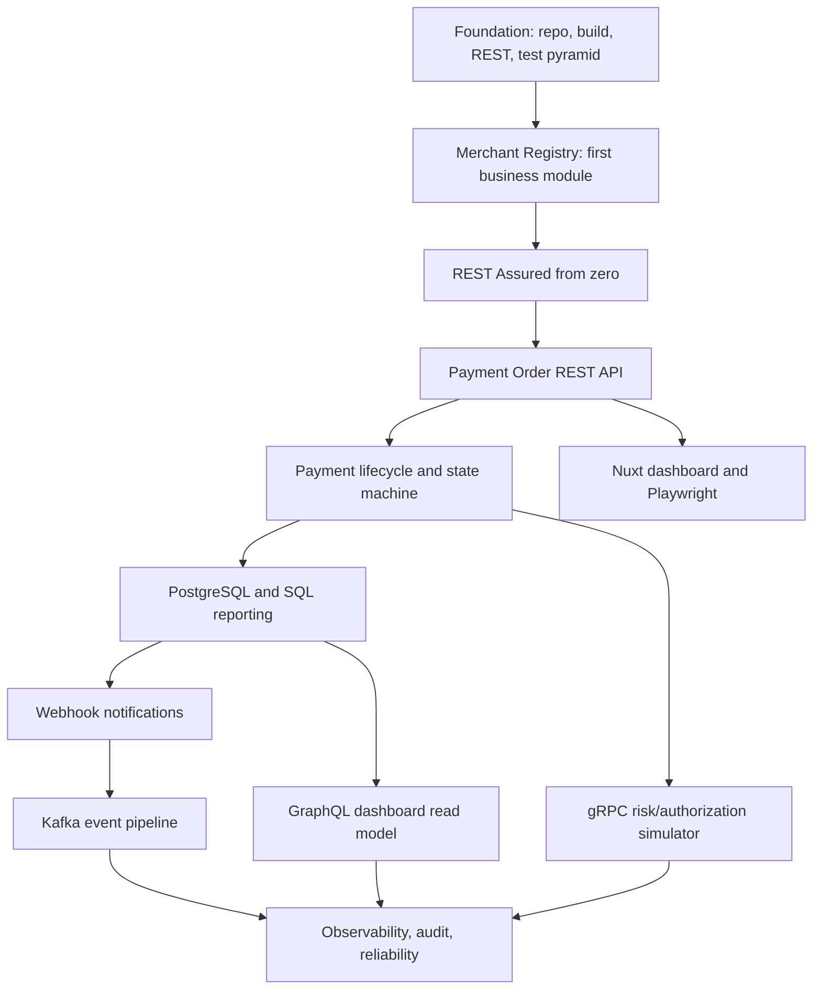
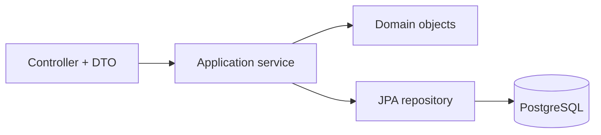

# Payment Gateway SDET Learning Plan

## Cel

Ten plan prowadzi krok po kroku od fundamentów do poziomu Senior QA Automation/SDET, synchronicznie budując aplikację Payment Quality Engineering Lab i ucząc testowania backendu, danych, UI, security, architektury oraz myślenia ryzykiem.

Projekt nie ma być pełnym klonem PayU. Ma być realistycznym laboratorium, w którym każda nowa funkcja i technologia odpowiada na konkretne pytanie testowe:

- jakie ryzyko wprowadzamy,
- jak projektujemy scenariusze biznesowe,
- gdzie testujemy dane zachowanie,
- jak automatyzujemy testy stabilnie,
- jak wyjaśniamy decyzję na rozmowie Senior QA/SDET.

Aktualna interpretacja PayU-like clone jest celowo ograniczona: klonujemy tylko te zachowania, ktore wspieraja trzy zaawansowane sciezki nauki: Payment Order REST API/idempotency/lifecycle, security/ownership/tenant isolation oraz reliability/data integrity/audit/webhook/event evolution. Szczegolowy zakres jest zapisany w `knowledge-vault/01 Projects/Payment_Quality_Engineering_Lab/Strategy/Three Advanced Learning Paths for API Testing and Payment Lab.md`.

## Główna Zasada Nauki

Każda lekcja ma taki rytm:

1. Cel biznesowy: jaki fragment systemu płatniczego powstaje.
2. Cel techniczny: czego uczysz się w Java/Spring/TypeScript/SQL.
3. Cel testowy: jakie ryzyko testujesz.
4. Kod produkcyjny: najmniejszy sensowny vertical slice.
5. Testy: najpierw poziom właściwy dla zachowania, potem automatyzacja.
6. Dane: jak tworzymy izolowane i czytelne dane testowe.
7. Vault: krótka notatka z lekcji, ryzykami i pytaniami rekrutacyjnymi.
8. Review: co dobry SDET powinien zauważyć w kodzie i testach.

## Mapa Mentalna



## Warstwa 0 - Jak Korzystać Z Tego Planu

Nie przeskakuj do technologii tylko dlatego, że jest popularna.

Najpierw opanuj:

- HTTP request/response,
- Java object model,
- JUnit i asercje,
- REST Assured DSL,
- Spring MVC boundary,
- PostgreSQL constraints,
- business scenario design,
- test level selection.

Kafka, GraphQL i gRPC wchodzą dopiero wtedy, gdy system ma dane i zachowania, dla których te technologie rozwiązują realny problem.

## Model Pracy - Lekcja Vs Learning Sprint

Ten vault rozróżnia dwa typy pracy.

| Tryb | Kiedy używać | Wynik |
|---|---|---|
| Lekcja koncepcyjna | Gdy trzeba zrozumieć fundament przed kodowaniem | Notatka, ćwiczenia, pytania, linki do kodu |
| Lekcja oparta na istniejącym kodzie | Gdy repo ma już przykład, który można studiować | Wyjaśnienie przepływu, ćwiczenia z czytania kodu, test-design notes |
| Learning sprint implementacyjny | Gdy kolejny krok roadmapy wymaga nowego vertical slice | Kod produkcyjny, testy, SQL/migracje, vault note, review checklist |
| Review/risk lesson | Gdy kod jest gotowy i trzeba ocenić jakość | Checklist, deferred risks, interview story |

Nie każda lekcja ma dodawać kod. Każdy sprint implementacyjny musi jednak dodać lekcję lub zaktualizować istniejącą notatkę, żeby nauka była utrwalona.

## Spiral Learning Rule

Każda kolejna lekcja lub sprint musi spełniać ten rytm:

1. Dodać albo przeanalizować mały fragment realnego systemu.
2. Powtórzyć minimum dwa wcześniejsze tematy.
3. Dodać maksymalnie jeden główny nowy temat.
4. Połączyć teorię z kodem produkcyjnym.
5. Połączyć teorię z testami.
6. Pokazać, na której warstwie testować dane zachowanie.
7. Pokazać, jakie dane testowe są potrzebne.
8. Dodać ćwiczenie z czytania kodu.
9. Dodać ćwiczenie z projektowania testu.
10. Dodać pytanie reviewera/SDET.
11. Dodać pytanie rekrutacyjne po angielsku.

Nie tworzymy sprintu, który tylko dodaje funkcję. Nie tworzymy lekcji, która tylko tłumaczy teorię bez repo. Każdy krok ma być: teoria + repo + testy + ryzyko + interview capital.

## Backend-First Scope

Na obecnym etapie priorytet mają:

1. Java 25.
2. Spring Boot / Spring Framework.
3. REST API.
4. REST Assured.
5. SQL/PostgreSQL/Flyway.
6. Spring Data JPA.
7. Testcontainers.
8. Security/Keycloak/JWT.
9. Test design and test data design.
10. Layered backend testing.

Kafka, GraphQL i gRPC są later topics. Nie dodajemy ich, dopóki REST API, Payment Order, SQL basics, security matrix oraz event/status model nie mają realnego sensu biznesowego.

## Obowiązkowa Sprint Learning Matrix

Każda lekcja/sprint powinna uzupełniać tę matrycę:

| Sekcja | Pytanie |
|---|---|
| Business capability | Jaką funkcję albo zachowanie budujemy/analizujemy? |
| Previous knowledge refresh | Jaką wcześniejszą wiedzę powtarzamy? |
| New learning focus | Jaki jeden nowy temat dodajemy? |
| Java 25 focus | Jakiego elementu Java uczę się w tej lekcji? |
| Spring focus | Jakiego elementu Spring uczę się w tej lekcji? |
| SQL/PostgreSQL focus | Jakiego elementu danych uczę się w tej lekcji? |
| REST Assured focus | Jakiego typu test API ćwiczę? |
| Security/Keycloak focus | Czy są role, JWT, 401/403, ownership? |
| Test design focus | BVA, EP, decision table, state transition, pairwise? |
| Test data focus | Jak tworzymy i izolujemy dane? |
| Test layers | Unit, domain, repository, REST Assured, security, integration? |
| Vault output | Jaką notatkę tworzymy lub aktualizujemy? |
| Interview story | Jak można o tym opowiedzieć po angielsku? |

## Backend-First Learning Tracks

Te ścieżki są obowiązkowymi torami nauki przed wejściem głęboko w Kafka, GraphQL i gRPC:

| Track | Vault path | Cel |
|---|---|---|
| REST API From Zero | `knowledge-vault/02 Areas/Technical Learning/REST API From Zero/` | Zrozumieć request/response i przepływ przez backend |
| JUnit REST Assured | `knowledge-vault/02 Areas/Technical Learning/JUnit REST Assured/` | Pisać i reviewować backend API tests |
| PostgreSQL and SQL From Zero | `knowledge-vault/02 Areas/Technical Learning/PostgreSQL and SQL From Zero/` | Czytać SQL, projektować dane, testować integralność |
| Java 25 For SDET | `knowledge-vault/02 Areas/Technical Learning/Java 25 For SDET/` | Rozumieć Java używaną w kodzie i testach |
| Spring Boot Spring MVC | `knowledge-vault/02 Areas/Technical Learning/Spring Boot Spring MVC/` | Rozumieć controller, DTO, validation, binding |
| Spring Data JPA and Flyway | `knowledge-vault/02 Areas/Technical Learning/Spring Data JPA and Flyway/` | Mapować encje na tabele i migracje |
| Security and Authorization Testing | `knowledge-vault/02 Areas/Technical Learning/Security and Authorization Testing/` | Testować Keycloak/JWT/401/403/ownership |

## Sprint Synchronization Model

| Sprint | Funkcja | Powtórka | Nowa wiedza | Testy |
|---|---|---|---|---|
| 1 | Merchant create/list/get | REST basics | DTO, validation, JPA entity | Unit, REST Assured, repository |
| 2 | Merchant activate/suspend | Status codes, auth | State machine | State transition tests |
| 3 | REST Assured cleanup | Existing merchant API | `RequestSpecification`, logging | Refactoring tests |
| 4 | Payment Order create | REST body, 201, 400 | Money value object, idempotency | REST contract + DB constraint |
| 5 | Payment status lookup | GET, path param | `@PathVariable UUID`, not found | 200/400/404 |
| 6 | Payment lifecycle | State testing | Optimistic locking | Domain + REST transitions |
| 7 | Payment list/report | Query params | SQL `WHERE`, `ORDER BY`, `LIMIT` | API + SQL assertions |
| 8 | Payment aggregation | Existing filters | SQL `GROUP BY`, indexes | Reporting tests |
| 9 | Auth ownership | 401/403 repeat | Tenant isolation | Security matrix |
| 10 | Webhook subscription | REST config | Outbound HTTP/WireMock | Retry tests |
| 11 | Webhook delivery | Previous webhook setup | Async failure states | Delivery status tests |
| 12 | Kafka events | Event history repeat | Outbox + topic + consumer | Testcontainers Kafka |
| 13 | GraphQL read model | SQL/reporting repeat | Schema/query testing | GraphQL tests |
| 14 | gRPC simulator | Lifecycle repeat | Proto/deadline/error mapping | gRPC contract tests |

Na razie pracujemy głównie w sprintach 1-9: backend, REST, SQL, REST Assured, Spring i security. Kafka, GraphQL i gRPC są zapisane jako późniejszy etap.

## Warstwa 1 - Fundamenty Przed Kolejnymi Funkcjami

### Lekcja 1. Repo, Build I Mental Model Labu

Cel biznesowy: zrozumieć, co istnieje i czego nie ma.

Cel techniczny: Maven wrapper, backend/frontend layout, infra, vault.

Cel testowy: wiedzieć, które testy są smoke, które są kontraktowe, a które integracyjne.

Kod/praktyka:

- uruchomić backend tests,
- uruchomić frontend typecheck/build,
- przejrzeć `docs/setup/phase-1-merchant-orientation-pack.md`,
- przeczytać `docs/architecture/payment-gateway-roadmap-analysis.md`.

Vault:

- link do `00 Phase 0 - Foundation`,
- link do `01 Phase 1 - Merchant Registry`,
- własna notatka: „co już istnieje, czego nie udajemy”.

Pytanie rekrutacyjne EN:

- **How do you start testing a backend system you did not build?**
- **Answer:** I first map existing capabilities, boundaries, data stores, authentication, test layers and known non-goals. Then I choose the smallest observable behavior and verify it at the right layer.

### Lekcja 2. REST API Od Zera Na Przepływie Merchant

Cel biznesowy: zrozumieć request create merchant.

Cel techniczny: HTTP method, path, JSON body, response DTO, status code.

Cel testowy: odróżnić manual API exploration od automatycznego API testu.

Materiały:

- `knowledge-vault/02 Areas/Technical Learning/REST API From Zero/Merchant Request and Response Flow.md`.

Kod/praktyka:

- prześledzić `MerchantController`, `CreateMerchantRequest`, `MerchantResponse`, `MerchantService`, `JpaMerchantRepository`,
- wypisać własnymi słowami flow: request -> controller -> DTO -> validation -> service -> domain -> repository -> PostgreSQL -> response.

### Lekcja 3. JUnit I AssertJ Jako Język Oracles

Cel biznesowy: test ma mówić, co system gwarantuje.

Cel techniczny: `@Test`, nazwy testów, AssertJ `assertThat`, fluent assertions.

Cel testowy: rozumieć oracle testowy, nie tylko „czy test przeszedł”.

Kod/praktyka:

- czytać `MerchantReferenceTest`, `DisplayNameTest`, `MerchantStatusTest`,
- dopisać mentalnie brakujące przypadki boundary,
- porównać assertion `isEqualTo` z assertion semantycznym typu `hasMessageContaining`.

Zasada jakości:

- test ma sprawdzać zachowanie, nie implementacyjny przypadek uboczny.

### Lekcja 4. REST Assured Od Absolutnego Zera

Cel biznesowy: REST Assured staje się Twoim kodowym klientem HTTP.

Cel techniczny: `given()`, `.when()`, `.then()`, body assertions, extraction.

Cel testowy: API contract testing.

Materiały obowiązkowe:

- `knowledge-vault/02 Areas/Technical Learning/JUnit REST Assured/REST Assured from Zero to Professional Backend API Testing/README.md`,
- `01-12 REST Assured Foundations.md`.

Praktyka:

- przerabiać lekcje 1-12 po kolei,
- przy każdej lekcji wskazać odpowiadający fragment `MerchantRestAssuredTest` albo `MerchantSecurityTest`,
- nie używać helperów, zanim rozumiesz podstawowy test.

### Lekcja 5. Test Design Fundamentals Dla Scenariuszy Biznesowych

Cel biznesowy: merchant lifecycle jako pierwszy proces biznesowy.

Cel techniczny: status enum, transitions, validation constraints.

Cel testowy: BVA, EP, decision table, state transition testing.

Praktyka:

- stworzyć mini tabelę warunków dla merchant reference: null, blank, 2 chars, 3 chars, 64 chars, 65 chars, invalid chars,
- stworzyć state table dla `DRAFT -> ACTIVE -> SUSPENDED`,
- zdecydować, które przypadki są unit, które REST, które Playwright.

Vault:

- `knowledge-vault/02 Areas/Business Product and Testing Thinking/Phase 1 Test Design.md`.

## Warstwa 2 - Backend Java/Spring/JPA Na Istniejącym Merchant Registry

### Lekcja 6. PayU-like Business Flow: Response Contracts, Correlation IDs, Idempotency, ETag And Security Oracles

Cel biznesowy: przygotować pierwszy accelerated sprint po Merchant Registry: merchant-scoped Payment Order jako realistyczny PayU-like flow, ale bez łamania aktualnych Phase 1 guardrails.

Cel techniczny: zaprojektować kontrakt API dla `Location`, `X-Correlation-ID`, `Idempotency-Key`, `ETag`, `If-Match`, stabilnych error codes, transakcji, SQL constraints i module boundary.

Cel testowy: użyć response assertions jako executable specification dla business outcomes, nie jako osobnej lekcji składni REST Assured.

Learning Delta Map:

| Sekcja | Delta względem Lessons 1-5 |
|---|---|
| Nie powtarzamy | REST Assured basics, `given/when/then`, podstawowe body/header/path concepts, `Map.of`, DTO serialization |
| Product | Payment order, idempotent create, payment lifecycle, merchant ownership |
| HTTP/API | `201` + `Location`, `X-Correlation-ID`, `Idempotency-Key`, `ETag`, `If-Match`, `409`, `412`, stable error codes |
| Java/Spring | `Money`, `CurrencyCode`, `IdempotencyKey`, enum state machine, transaction boundary, `@RestControllerAdvice`, Spring Security ownership checks |
| SQL | FK to merchant, unique idempotency, amount/currency/status checks, merchant-scoped indexes, status history |
| Security | role + ownership matrix, 401/403/404 decision, UI hiding vs backend enforcement |
| Frontend/Playwright | payment order form/detail/action buttons, Zod schema, role-aware journey, API-assisted setup |
| REST Assured/AssertJ | header assertions, extracted DTO comparison, idempotency replay oracle, stale ETag oracle |

Kod/praktyka w tej lekcji:

- przeczytać aktualny Phase 1 guardrail w `specs/002-merchant-registry-activation/spec.md`,
- przeczytać Spec Kit input w `specs/003-payment-order-access-lifecycle/spec-input.md`,
- przeanalizować istniejący `CorrelationIdFilter`, `MerchantSecurityTest`, `MerchantRestAssuredTest` jako prerequisites,
- zaprojektować testy dla Payment Order bez implementowania ich w Phase 1,
- zapisać, które testy będą domain, repository, REST Assured, security i Playwright po zatwierdzeniu nowej specyfikacji.

Pytanie rekrutacyjne EN:

- **How do you test idempotent payment order creation?**
- **Answer:** I verify the first `POST` creates one resource with `201`, `Location`, `ETag` and a correlation ID, then retry the same request with the same idempotency key and assert the same order identity is returned without a duplicate row. I also send the same key with a different body and expect a stable `409 idempotency_conflict`.

Uwaga sequencing:

- Ta lekcja przygotowuje nową funkcję, ale nie zatwierdza implementacji płatności. Payment code starts only after a new Spec Kit feature is approved.

### Lekcja 7. Spring MVC Boundary: DTO, Validation, Binding

Cel biznesowy: API ma odrzucać niepoprawne dane przy granicy systemu.

Cel techniczny: `@RequestBody`, `@Valid`, `@PathVariable UUID`, exception handling.

Cel testowy: wiedzieć, dlaczego malformed UUID testujemy przez HTTP, a nie przez unit test ręcznego parsowania.

Kod/praktyka:

- `CreateMerchantRequest`, `MerchantController`, `MerchantExceptionHandler`,
- REST Assured negative tests dla 400/404/409,
- notatka: framework binding vs własna logika.

### Lekcja 8. Application Service I Layering Dla Testowalności

Cel biznesowy: service koordynuje przypadek użycia.

Cel techniczny: controller -> service -> domain -> repository.

Cel testowy: rozpoznawać smell, gdy DTO lub web exception przecieka do application layer.

Diagram:



Praktyka:

- ocenić, czy obecny `MerchantService` zależy od web package,
- jeśli zależy, zapisać to jako refactoring learning target, nie zmieniać bez osobnego zadania,
- powiązać z lekcjami 17-18 w ścieżce REST Assured professional practice.

### Lekcja 9. PostgreSQL I Flyway Jako Safety Net

Cel biznesowy: duplicate merchant reference nie może przejść nawet przy race condition.

Cel techniczny: migration SQL, unique constraint, optimistic locking, repository test.

Cel testowy: DB constraint jako final safety net, nie zamiennik walidacji aplikacyjnej.

Praktyka:

- przeczytać migration `V1__create_merchants.sql`,
- przeanalizować `JpaMerchantRepositoryTest`,
- wypisać: constraint, index, FK, optimistic locking, transakcja.

## Warstwa 3 - Profesjonalny REST Assured I Backend API Testing

Ta warstwa jest już rozpisana jako pełna ścieżka:

- `knowledge-vault/02 Areas/Technical Learning/JUnit REST Assured/README.md`,
- `REST Assured from Zero to Professional Backend API Testing/01-12 REST Assured Foundations.md`,
- `REST Assured from Zero to Professional Backend API Testing/13-22 Professional Practice After Refactoring.md`,
- `knowledge-vault/02 Areas/Technical Learning/Backend Testing Review/Professional Backend API Testing Reviewer Checklist.md`.

Minimalna kolejność:

1. Czym jest REST Assured.
2. `given / when / then`.
3. Request: method, endpoint, content type, accept.
4. Path params, query params, headers.
5. Body: JSON, `Map.of`, DTO, serialization.
6. Response contracts as PayU-like business-flow oracles.
7. Nested body/list assertions.
8. Extraction and deserialization.
9. Auth, 401, 403, authorized flow.
10. Negative tests.
11. Test level selection.
12. Good REST Assured test structure.
13. Reusable `RequestSpecification`.
14. Spec builders.
15. Logging only on validation failure and header blacklisting.
16. Test data design.
17. Backend architecture for testers.
18. SOLID for backend testers.
19. API validation vs domain rules.
20. Java 25 and tooling warning awareness.
21. Test quality after refactoring.
22. Deferred risk thinking.

## Warstwa 4 - Payment Order REST API Jako Pierwszy Nowy Vertical Slice

Nie zaczynać od Kafki, GraphQL ani gRPC. Następna implementacyjna lekcja powinna być `Payment Order REST API`.

### Lekcja 10. Business Scenario Design Dla Payment Order

Cel biznesowy: active merchant tworzy payment order.

Cel techniczny: nowy moduł `payment`, DTO, service, JPA entity, Flyway migration.

Cel testowy: acceptance criteria, happy path, negative paths, ownership, idempotency.

Artefakty przed kodem:

- business goal,
- actors,
- main flow,
- alternatives,
- business rules,
- data needs,
- test conditions,
- open questions.

Przykładowe reguły:

- payment order może utworzyć tylko active merchant,
- amount musi być dodatni,
- currency musi być obsługiwane,
- idempotency key musi chronić przed duplicate charge,
- początkowy status to `CREATED`.

### Lekcja 11. Java 25 Model Danych Dla Payment Order

Cel techniczny:

- `PaymentOrder`,
- `PaymentStatus`,
- `MoneyAmount`,
- `CurrencyCode`,
- `IdempotencyKey`.

Cel testowy:

- boundary tests dla kwot,
- enum transition tests,
- domain invariants.

### Lekcja 12. Spring REST API Dla Payment Order

Cel techniczny:

- `POST /api/payment-orders`,
- `GET /api/payment-orders/{id}`,
- `CreatePaymentOrderRequest`,
- `PaymentOrderResponse`,
- `PaymentExceptionHandler`.

Cel testowy:

- 201 create,
- 400 validation,
- 401 unauthenticated,
- 403 wrong authority,
- 404 merchant not found,
- 409 idempotency conflict if contract requires it.

### Lekcja 13. REST Assured Payment Contract Tests

Cel techniczny: profesjonalne testy HTTP na nowym module.

Cel testowy:

- request body readability,
- response shape,
- status codes,
- extraction id -> follow-up GET,
- security matrix.

Praktyka:

- najpierw test bez helpera,
- potem helper dopiero gdy szum się powtarza,
- reviewer checklist po każdej zmianie.

### Lekcja 14. PostgreSQL Payment Orders

Cel techniczny:

- tabela `payment_orders`,
- FK do `merchants`,
- amount constraint,
- unique idempotency key per merchant,
- indexes for status and merchant/date.

Cel testowy:

- migration test,
- duplicate idempotency,
- FK behavior,
- query learning.

SQL do nauki:

```sql
SELECT payment_order_id, status, amount_minor
FROM payment_orders
WHERE merchant_id = ?
ORDER BY created_at DESC
LIMIT 20;
```

## Warstwa 5 - Payment Lifecycle I State Machine

### Lekcja 15. Statusy Płatności I State Transition Testing

Cel biznesowy: payment order przechodzi przez kontrolowany lifecycle.

Cel techniczny: `CREATED -> AUTHORIZED -> CAPTURED` albo `FAILED`.

Cel testowy: state transition table.

Praktyka:

- domain unit tests dla statusów,
- REST tests tylko dla zewnętrznie widocznych przejść,
- SQL event history dla timeline.

### Lekcja 16. Concurrency I Idempotency

Cel biznesowy: nie wolno utworzyć podwójnej płatności.

Cel techniczny: transaction boundary, unique constraint, optimistic locking.

Cel testowy:

- concurrent POST with same idempotency key,
- retry same request,
- retry with same key but different body.

## Warstwa 6 - SQL I PostgreSQL Od Zera Do Raportowania

### Lekcja 17. SELECT, WHERE, ORDER BY, LIMIT

Cel biznesowy: operator widzi ostatnie płatności.

Cel testowy: czy lista ma właściwe rekordy, porządek i limit.

### Lekcja 18. JOIN Merchant + Payment

Cel biznesowy: payment należy do merchanta.

Cel testowy: tenant isolation i ownership.

### Lekcja 19. GROUP BY I Raporty

Cel biznesowy: suma płatności per merchant/status/currency.

Cel testowy: aggregation correctness.

### Lekcja 20. Constraints, Indexes, Transactions

Cel biznesowy: baza broni integralności danych.

Cel testowy: DB-level defects, race conditions, performance risk.

## Warstwa 7 - Nuxt, TypeScript 6 I Playwright

### Lekcja 21. Nuxt Dashboard Jako Warstwa Użytkownika

Cel biznesowy: operator widzi merchantów i payment orders.

Cel techniczny: Nuxt pages, server routes, Pinia, Zod schemas.

Cel testowy: UI nie zastępuje API tests, tylko potwierdza user journey.

### Lekcja 22. TypeScript 6 I Zod Dla Bezpiecznego Frontendu

Cel techniczny:

- typed API response,
- schema validation,
- store state,
- form validation.

Cel testowy:

- invalid input feedback,
- API error mapping,
- safe UI states.

### Lekcja 23. Playwright Fixtures I API-Assisted Setup

Cel techniczny:

- authenticated storage state,
- fixtures per role,
- API setup for merchant/payment data.

Cel testowy:

- stable E2E,
- fewer slow UI setup steps,
- worker-aware test data.

### Lekcja 24. UI Vs API Decision Making

Cel testowy:

- UI: critical journey, visible feedback, auth redirect.
- API: variants, boundary values, security matrix, idempotency.

Checklist:

- Czy testujesz zachowanie użytkownika, czy regułę API?
- Czy przez UI naprawdę musisz sprawdzić 20 wariantów walidacji?
- Czy możesz przygotować dane przez API, a UI użyć tylko do obserwacji efektu?

## Warstwa 8 - Webhook, Kafka, GraphQL, gRPC Dopiero Po Fundamentach

### Lekcja 25. Webhook Notifications

Cel biznesowy: merchant dostaje status płatności.

Cel testowy: async HTTP, retry, duplicate delivery, idempotent receiver.

### Lekcja 26. Kafka Event Pipeline

Cel biznesowy: zdarzenia płatności są konsumowane asynchronicznie.

Cel testowy: ordering, at-least-once delivery, DLQ, poison messages, outbox.

Warunek wejścia:

- istnieje stabilny payment event model w DB.

### Lekcja 27. GraphQL Dashboard Read Model

Cel biznesowy: dashboard pobiera agregacje i projekcje.

Cel testowy: schema testing, field-level auth, N+1, query limits.

Warunek wejścia:

- istnieją dane do raportów i realne potrzeby dashboardu.

### Lekcja 28. gRPC Risk/Authorization Simulator

Cel biznesowy: internal service zwraca risk/auth decision.

Cel testowy: proto contract, deadlines, retries, unavailable service.

Warunek wejścia:

- istnieje payment lifecycle, w którym decyzja auth/risk ma sens.

## Warstwa 9 - Observability, Audit I Regulated-System Thinking

### Lekcja 29. Correlation ID I Log Hygiene

Cel testowy: diagnozowalność bez wycieku sekretów.

Ryzyka:

- zbyt długi incoming correlation id,
- tokeny w logach,
- brak correlation id w błędach.

### Lekcja 30. Audit Log

Cel biznesowy: system potrafi odpowiedzieć, kto zmienił co i kiedy.

Cel testowy:

- audit event emitted,
- no sensitive payload,
- append-only discipline.

### Lekcja 31. Reliability And Failure Scenarios

Cel testowy:

- timeout,
- retry,
- duplicate request,
- partial failure,
- stale status,
- missing event.

## Minimalna Kolejność Na Najbliższe Tygodnie

1. Przerobić `REST API From Zero - Merchant Request and Response Flow` jako pierwszą praktyczną lekcję.
2. Przerobić `REST Assured Foundations` lekcje 1-12.
3. Równolegle założyć fundamenty ścieżek: SQL, Java 25, Spring MVC/JPA i Security.
4. Użyć checklisty reviewera na istniejących `MerchantRestAssuredTest` i `MerchantSecurityTest`.
5. Przerobić professional lessons 13-22.
6. Przygotować BA Discovery Pack dla `Payment Order REST API`.
7. Dopiero potem kodować `learn/rest-payment-order`.
8. Przy każdej nowej funkcji dodać: domain tests, repository tests, REST Assured tests, security tests, vault note, review checklist i interview story.

## Czego Nie Robić Teraz

- Nie dodawać Kafki przed payment events/outbox.
- Nie dodawać GraphQL przed dashboard read model.
- Nie dodawać gRPC przed internal boundary.
- Nie kodować PSP/card/real payment flows.
- Nie robić mikroserwisów.
- Nie testować wszystkich wariantów przez Playwright.
- Nie tworzyć helperów testowych, zanim powtarzalny problem jest widoczny.

## Linki Do Istniejących Materiałów

- `knowledge-vault/01 Projects/Payment_Quality_Engineering_Lab/Strategy/Three Advanced Learning Paths for API Testing and Payment Lab.md`
- `docs/architecture/payment-gateway-roadmap-analysis.md`
- `knowledge-vault/02 Areas/Technical Learning/REST API From Zero/README.md`
- `knowledge-vault/02 Areas/Technical Learning/REST API From Zero/Merchant Request and Response Flow.md`
- `knowledge-vault/02 Areas/Technical Learning/JUnit REST Assured/README.md`
- `knowledge-vault/02 Areas/Technical Learning/JUnit REST Assured/REST Assured from Zero to Professional Backend API Testing/README.md`
- `knowledge-vault/02 Areas/Technical Learning/Backend Testing Review/Professional Backend API Testing Reviewer Checklist.md`
- `knowledge-vault/02 Areas/Technical Learning/PostgreSQL and SQL From Zero/README.md`
- `knowledge-vault/02 Areas/Technical Learning/Java 25 For SDET/README.md`
- `knowledge-vault/02 Areas/Technical Learning/Spring Boot Spring MVC/README.md`
- `knowledge-vault/02 Areas/Technical Learning/Spring Data JPA and Flyway/README.md`
- `knowledge-vault/02 Areas/Technical Learning/Security and Authorization Testing/README.md`
- `knowledge-vault/02 Areas/Business Product and Testing Thinking/Phase 1 Test Design.md`
- `knowledge-vault/02 Areas/Technical Learning/Spring Modulith/Merchant Module Architecture.md`
- `knowledge-vault/02 Areas/Technical Learning/Testing Architecture/Testing - Parallel Readiness Principles.md`
- `knowledge-vault/01 Projects/Payment_Quality_Engineering_Lab/Learning Prompts/Prompt - Lesson 01 - REST API Request Response Flow.md`

## Finalna Zasada Mentorska

Nie uczysz się „REST Assured”, „Springa”, „PostgreSQL” albo „Playwrighta” w izolacji. Uczysz się podejmować decyzje SDET:

- gdzie leży odpowiedzialność za zachowanie,
- które ryzyko jest najważniejsze,
- jaki poziom testu ma najlepszy sygnał,
- jakie dane testowe są bezpieczne,
- czy architektura pomaga testować,
- czy wynik można obronić na rozmowie technicznej.
