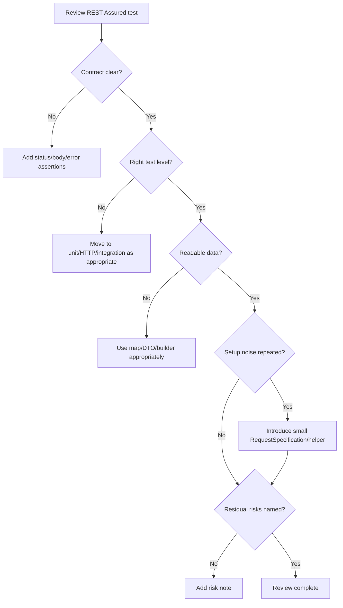

# Professional Backend API Testing Reviewer Checklist

Use this checklist when reviewing REST Assured tests, backend API tests, or backend refactoring that affects testability. The goal is not to enforce pattern theatre. The goal is to protect API behavior with readable, deterministic and maintainable tests.

## A. REST Assured Syntax And Structure

- [ ] Test has a clear Given / When / Then or Arrange / Act / Assert shape.
- [ ] `given()` setup is understandable to a beginner after reading helper names.
- [ ] HTTP method and endpoint are visible in the test.
- [ ] Request body is readable and not hidden behind a vague helper.
- [ ] Response assertions are close to the request they verify.
- [ ] Fluent API chain is not so long that it becomes unreadable.
- [ ] Static imports such as `given`, `equalTo`, `notNullValue` are used consistently.
- [ ] Helper names describe user/API intent, not only technical setup.

## B. API Contract

- [ ] Expected status code is asserted.
- [ ] Expected content type is asserted when it matters.
- [ ] Required response fields are asserted.
- [ ] Business-relevant response values are asserted, not only `notNullValue`.
- [ ] Error response shape is asserted for negative scenarios.
- [ ] Error code/message matches the documented contract.
- [ ] `400`, `401`, `403`, `404`, `409` are used according to their meaning.
- [ ] List ordering is asserted only when ordering is part of the contract.

## C. Request Data

- [ ] Request body is not built with fragile string concatenation unless malformed raw JSON is the point of the test.
- [ ] `Map.of` or a small map helper is used for small payloads.
- [ ] DTO/record is considered when payloads become larger or reused.
- [ ] Builder/fixture is introduced only when it reduces real duplication and improves clarity.
- [ ] Test data names explain why the value exists, e.g. `Short Reference`, `Duplicate Merchant`.
- [ ] Unique test data is used where shared data would cause flakiness.
- [ ] Boundary values are explicit: 2/3/64/65 where relevant.

## D. Auth And Security

- [ ] Unauthenticated case is covered where endpoint is protected.
- [ ] Invalid token case is covered where JWT validation matters.
- [ ] Forbidden case is covered with authenticated identity lacking authority.
- [ ] Authorized happy path is covered.
- [ ] `401` and `403` are not treated as interchangeable.
- [ ] Tests make the role/authority under test visible.
- [ ] Authorization headers are not logged in CI output.
- [ ] Reusable auth specs do not hide the purpose of security tests.

## E. Test Levels

- [ ] Pure domain rule is tested with unit tests where possible.
- [ ] HTTP binding and validation behavior is tested at HTTP/web level.
- [ ] Database constraints and transaction behavior are tested with integration tests.
- [ ] Browser feedback is left to Playwright/UI tests, not REST Assured.
- [ ] Framework binding is not over-tested through brittle hand-written unit tests.
- [ ] Each test level has a clear reason to exist.
- [ ] Tests do not duplicate the same assertion across many layers without added value.

## F. Reuse And Abstraction

- [ ] `RequestSpecification` removes repeated technical setup.
- [ ] Reusable spec does not hide endpoint, payload or expected behavior.
- [ ] `ResponseSpecification` is used only for truly shared response contracts.
- [ ] Helper methods have domain/API names, not generic names like `doRequest`.
- [ ] There is no pattern theatre: no builder/factory/spec without repeated problem.
- [ ] Helper failures are easy to diagnose.
- [ ] A new contributor can understand a test without jumping through many files.

## G. Architecture Awareness

- [ ] Web DTOs do not leak into application layer unless there is a deliberate reason.
- [ ] Application layer does not depend on web exceptions or web mappers.
- [ ] Controller handles HTTP concerns and delegates use cases.
- [ ] Service orchestrates use case logic and transaction boundary.
- [ ] Domain holds business rules and value-object validation.
- [ ] Repository handles persistence access, not business decisions.
- [ ] Mapping from domain to response DTO happens near the web boundary.
- [ ] Architecture changes make tests simpler or more focused, not merely prettier.

## H. JDK 25 / Tooling Hygiene

- [ ] Build/test logs are checked, not ignored.
- [ ] Mockito/JDK dynamic-agent warnings are investigated.
- [ ] Surefire and Failsafe configuration is explicit where test runtime needs it.
- [ ] Unit and integration tests use consistent JVM/test-tool setup.
- [ ] Deprecated or deprecated-for-removal API warnings are treated as future risk.
- [ ] Maven lifecycle distinction is clear: unit tests vs integration tests.
- [ ] Tooling changes are documented enough for a learner to understand why they exist.

## I. Risk Thinking

- [ ] Error response contract is stable enough for clients and tests.
- [ ] Flexible fields such as `Object details` are tracked as contract risk if they grow.
- [ ] Correlation id handling avoids log pollution and unbounded input risk.
- [ ] Role conversion does not silently expand access beyond intended authorities.
- [ ] Ordered/static integration tests are documented as exceptions or refactored.
- [ ] Parallel execution and test data isolation are considered.
- [ ] Logging gives enough diagnostic context without leaking secrets.
- [ ] Deferred risks have owner/follow-up, not just vague comments.

## Quick Review Questions

1. What behavior does this test protect?
2. What would have to break for this test to fail?
3. Is this the right test level?
4. Is request setup hiding too much?
5. Are assertions contract-focused?
6. Are auth and negative cases meaningful?
7. Are data and logs safe for parallel CI execution?
8. Did a refactoring improve failure signal or only reduce line count?

## Mermaid - Review Flow

