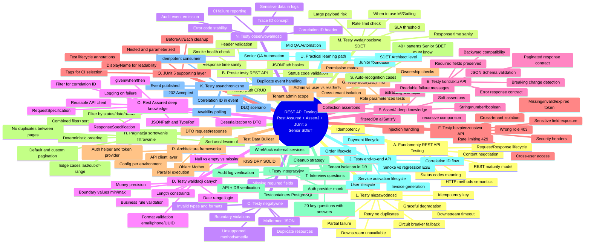

---
tags:
  - rest-api
  - rest-assured
  - assertj
  - junit5
  - sdet
  - interview
  - mindmap
  - test-cases
created: 2026-06-01
status: active
level: senior
---

# REST API Testing — Complete Mindmap & Practical Catalog for Senior SDET

> **Centrum mapy:** REST API Testing with Rest Assured + AssertJ + JUnit 5 for Senior SDET

---

## 1. Mermaid Mindmap



---

## 2. Text Hierarchy Version

```
REST API Testing — Senior SDET Complete Map
│
├── A. FUNDAMENTY REST API TESTING
│   ├── HTTP methods: GET, POST, PUT, PATCH, DELETE semantics
│   ├── Status codes: 2xx, 3xx, 4xx, 5xx meaning and when to expect each
│   ├── Content-Type and Accept negotiation
│   ├── Idempotency: which methods are idempotent and why it matters
│   ├── REST maturity model (Level 0-3)
│   └── Request/Response lifecycle and middleware chain
│
├── B. PROSTE TESTY REST API
│   ├── Smoke test: health endpoint returns 200
│   ├── Happy path: CRUD operations succeed
│   ├── Status code validation per endpoint
│   ├── Header validation (Content-Type, Location, custom)
│   ├── JSONPath basic assertions
│   └── Response time sanity check (< threshold)
│
├── C. TESTY NEGATYWNE
│   ├── Missing required field → 400
│   ├── Invalid field type → 400
│   ├── Invalid enum value → 400
│   ├── Invalid date format → 400
│   ├── Invalid UUID → 400
│   ├── Non-existing resource → 404
│   ├── Malformed JSON → 400
│   ├── Duplicate resource → 409
│   ├── Unsupported HTTP method → 405
│   ├── Unsupported media type → 415
│   ├── Invalid query parameter → 400
│   ├── Invalid pagination parameter → 400
│   ├── Empty body → 400
│   ├── Too large payload → 413
│   └── Invalid nested object → 400
│
├── D. TESTY WALIDACJI DANYCH
│   ├── Boundary value min/max
│   ├── Below min / above max
│   ├── Null vs empty vs missing
│   ├── Min/max length strings
│   ├── Invalid characters
│   ├── Invalid email/phone/ISO code/currency
│   ├── Too many decimal places for money
│   ├── Date from future
│   ├── Date range start after end
│   └── Business rule validation error
│
├── E. TESTY KONTRAKTU API
│   ├── JSON Schema validation
│   ├── Required fields preserved
│   ├── Optional field missing but accepted
│   ├── Unknown additional field behavior
│   ├── Error response contract
│   ├── Backward-compatible response
│   ├── Breaking change example
│   ├── Paginated response contract
│   ├── List response contract
│   └── Consumer expectation contract
│
├── F. TESTY BEZPIECZENSTWA API
│   ├── Missing token → 401
│   ├── Invalid token → 401
│   ├── Expired token → 401
│   ├── Valid token wrong role → 403
│   ├── User cannot access admin endpoint → 403
│   ├── User cannot access another user's resource → 403/404
│   ├── Tenant A cannot access Tenant B data → 403/404
│   ├── Sensitive fields not exposed
│   ├── Rate limiting → 429
│   ├── Injection-like input rejected
│   ├── Security headers present
│   └── 404 instead of 403 (hiding resource existence)
│
├── G. TESTY AUTORYZACJI I ROL
│   ├── Admin can read report
│   ├── Regular user cannot read report
│   ├── Read-only user cannot modify
│   ├── Tenant admin manages own users
│   ├── Tenant admin cannot manage another tenant
│   ├── Service provider accesses assigned orders
│   ├── Network operator cannot access billing
│   ├── Role matrix with @ParameterizedTest
│   ├── Ownership check
│   └── Cross-tenant isolation
│
├── H. PAGINACJA, SORTOWANIE, FILTROWANIE
│   ├── Default pagination
│   ├── Custom page size
│   ├── Invalid negative page → 400
│   ├── Invalid too large size → 400
│   ├── Last page behavior
│   ├── Page out of range
│   ├── Empty result
│   ├── Sort ascending/descending
│   ├── Sort by multiple fields
│   ├── Filter by status/date range/owner
│   ├── Combined filtering and sorting
│   ├── No duplicates between pages
│   └── Deterministic ordering
│
├── I. TESTY INTEGRACYJNE
│   ├── API creates record in DB
│   ├── API does not create record after validation error
│   ├── API updates DB status
│   ├── API writes audit log
│   ├── API reads with tenant isolation
│   ├── External service success (WireMock)
│   ├── External service timeout (WireMock)
│   ├── External service 500 handled gracefully
│   ├── PostgreSQL Testcontainers setup
│   ├── API + DB cleanup strategy
│   ├── Auth provider mock
│   └── Payment provider mock
│
├── J. TESTY END-TO-END API
│   ├── User lifecycle: create → read → update → delete
│   ├── Order lifecycle
│   ├── Payment lifecycle
│   ├── Service activation lifecycle
│   ├── Invoice generation lifecycle
│   ├── Create order → verify payment required
│   ├── Payment accepted → order becomes paid
│   ├── Service activation → eventually active
│   ├── Full flow with correlation ID
│   └── E2E smoke vs full regression
│
├── K. TESTY ASYNCHRONICZNE I EVENT-DRIVEN
│   ├── POST returns 202 Accepted
│   ├── Event published after REST command
│   ├── Event contains correlation ID
│   ├── Consumer processes event and updates status
│   ├── Awaitility waits for final state
│   ├── Duplicate event does not duplicate state
│   ├── Out-of-order event handling
│   ├── Retry scenario
│   ├── DLQ scenario
│   ├── Audit event emitted
│   └── Idempotent consumer
│
├── L. TESTY NIEZAWODNOSCI I ODPORNOSCI
│   ├── Downstream timeout
│   ├── Downstream unavailable
│   ├── Retry does not create duplicate
│   ├── Circuit breaker fallback error
│   ├── Database unavailable concept
│   ├── Partial failure
│   ├── 500 error response contract
│   ├── Idempotency key duplicate request
│   ├── Same request twice no duplicate
│   ├── Network latency (WireMock)
│   ├── Service restart concept
│   └── Graceful degradation
│
├── M. TESTY WYDAJNOSCIOWE (SDET perspective)
│   ├── Response time sanity check
│   ├── Why not Rest Assured for full perf testing
│   ├── Basic SLA threshold
│   ├── Percentiles explanation
│   ├── Rate limit check
│   ├── Large page size risk
│   ├── Large payload risk
│   ├── Search endpoint response time
│   ├── Smoke performance in CI
│   └── When to move to k6/Gatling/JMeter
│
├── N. TESTY OBSERWOWALNOSCI
│   ├── Correlation ID returned in header
│   ├── Correlation ID accepted from request
│   ├── Error response contains correlation ID
│   ├── Error response contains stable error code
│   ├── Audit event after sensitive operation
│   ├── Trace ID concept
│   ├── Logs should not expose sensitive data
│   ├── CI report includes request/response on failure
│   ├── Debugging with correlation ID
│   └── Quality gate concept
│
├── O. REST ASSURED — DEEP KNOWLEDGE
│   ├── given/when/then fluent API
│   ├── baseURI and basePath configuration
│   ├── RequestSpecification reuse
│   ├── ResponseSpecification reuse
│   ├── pathParam, queryParam, formParam
│   ├── headers, cookies, auth
│   ├── Logging only on failure
│   ├── Extracting response to POJO
│   ├── JSONPath and GPath
│   ├── TypeRef for generic types
│   ├── Deserialization to DTO
│   ├── Reusable API client layer
│   ├── Filter for correlation ID injection
│   └── Avoiding duplicated setup
│
├── P. ASSERTJ — DEEP KNOWLEDGE
│   ├── assertThat for String/Number/Boolean
│   ├── Collection: hasSize, contains, doesNotContain
│   ├── extracting with field names and lambdas
│   ├── tuple for multi-field extraction
│   ├── filteredOn for conditional filtering
│   ├── allSatisfy for uniform validation
│   ├── anySatisfy for at-least-one validation
│   ├── containsExactly and containsExactlyInAnyOrder
│   ├── recursive comparison with ignoring fields
│   ├── SoftAssertions for multiple checks
│   ├── Readable failure messages with as()
│   ├── Comparing error response DTO
│   └── Comparing paginated response
│
├── Q. JUNIT 5 — SUPPORTING LAYER
│   ├── @Test, @DisplayName
│   ├── @Nested for grouping
│   ├── @BeforeEach, @AfterEach, @BeforeAll
│   ├── @ParameterizedTest
│   ├── @ValueSource, @CsvSource, @MethodSource
│   ├── @Tag for CI selection
│   ├── Test lifecycle and execution order
│   ├── CI selection by tags
│   └── Why JUnit organizes but does not test REST
│
├── R. ARCHITEKTURA FRAMEWORKA TESTOWEGO
│   ├── API client layer (UserApiClient, OrderApiClient, etc.)
│   ├── DTO request/response
│   ├── ErrorResponse DTO
│   ├── Test Data Builder pattern
│   ├── Object Mother pattern
│   ├── Fixture pattern
│   ├── Auth helper and TokenProvider
│   ├── Config per environment
│   ├── Cleanup strategy
│   ├── Reporting and logging
│   ├── Parallel execution
│   ├── KISS, DRY, SOLID
│   ├── When abstraction helps
│   └── When abstraction hurts
│
├── S. AUTO-RECOGNITION CASES (40+)
│   └── Patterns Senior SDET must recognize instantly
│
├── T. INTERVIEW QUESTIONS (20)
│   └── Design, security, async, framework, CI/CD
│
└── U. PRACTICAL LEARNING PATH
    ├── Junior / Foundation
    ├── Mid QA Automation
    ├── Senior QA Automation
    └── SDET / Architect level
```

---

## 3. Mental Model Senior SDET: Endpoint → Risk → Test Case → Implementation

```
┌─────────────────────────────────────────────────────────────────────────────┐
│                    SENIOR SDET MENTAL MODEL                                 │
│                                                                             │
│  ENDPOINT ──► RISK ──► TEST TYPE ──► TEST CASE ──► TOOLS ──► ASSERTIONS   │
│                                                                             │
│  1. Widze endpoint                                                          │
│     np. POST /api/orders                                                    │
│                                                                             │
│  2. Identyfikuje ryzyka                                                     │
│     ├── Walidacja: czy odrzuci niepoprawne dane?                            │
│     ├── Autoryzacja: czy tylko uprawniony user moze utworzyc?               │
│     ├── Idempotentnosc: czy duplikat requestu nie tworzy duplikatu?         │
│     ├── Kontrakt: czy response ma stabilny schema?                          │
│     ├── Biznesowe: czy status przechodzi poprawnie?                         │
│     ├── Integracja: czy zapis do DB jest poprawny?                          │
│     └── Bezpieczenstwo: czy dane wrazliwe nie wyciekaja?                    │
│                                                                             │
│  3. Dobieram typ testu                                                      │
│     ├── Smoke → szybki health check                                         │
│     ├── Negative → walidacja odrzuca invalid input                          │
│     ├── Contract → schema i backward compatibility                          │
│     ├── Security → auth, roles, tenant isolation                            │
│     ├── Integration → API + DB + external services                          │
│     ├── E2E → pelny flow biznesowy                                          │
│     └── Resilience → timeout, retry, circuit breaker                        │
│                                                                             │
│  4. Projektuje przypadek testowy                                            │
│     ├── Given: stan poczatkowy, dane testowe, auth                          │
│     ├── When: wywolanie endpointu                                           │
│     └── Then: asercje na status, body, headers, DB, events                  │
│                                                                             │
│  5. Dobieram narzedzia                                                      │
│     ├── Rest Assured → HTTP request/response                                │
│     ├── AssertJ → czytelne asercje na DTO i kolekcjach                      │
│     ├── JUnit 5 → organizacja, parametryzacja, tagi                         │
│     ├── DTO → type-safe response extraction                                  │
│     ├── JSON Schema → contract validation                                   │
│     ├── Testcontainers → real DB isolation                                  │
│     ├── WireMock → controlled external dependencies                         │
│     ├── Awaitility → async/eventual consistency                             │
│     └── DB verification → side-effect validation                            │
│                                                                             │
│  6. Pisze test w stylu senior                                               │
│     ├── @Tag("negative") @DisplayName("...")                                │
│     ├── given().contentType().body().when().post().then()                   │
│     ├── extract().as(ErrorResponse.class)                                   │
│     ├── assertThat(error.code()).isEqualTo("VALIDATION_ERROR")             │
│     └── Wyjasniam DLACZEGO ten test istnieje                                │
│                                                                             │
│  7. Umiem wyjasnic na rozmowie po angielsku                                 │
│     "I validate not just the status code but the error contract             │
│      because frontend and API consumers depend on stable error structure."  │
└─────────────────────────────────────────────────────────────────────────────┘
```

### Quick Decision Flow

```
Widze endpoint
  │
  ├── Czy to GET? ──────────► Sprawdz: 200, body, schema, pagination, auth
  │
  ├── Czy to POST? ─────────► Sprawdz: 201, Location header, validation,
  │                            idempotency, auth, DB side-effect
  │
  ├── Czy to PUT? ──────────► Sprawdz: idempotency, full replace, 200/204,
  │                            validation, auth, ownership
  │
  ├── Czy to PATCH? ────────► Sprawdz: partial update, 200, only changed fields,
  │                            validation, auth, ownership
  │
  └── Czy to DELETE? ───────► Sprawdz: 204, resource gone after, auth,
                               ownership, cascade behavior
```

---

## 4. Risk → Test Type → Tool Combination Matrix

| # | Typ ryzyka API | Typ testu | Konkretny przypadek | Rest Assured | + AssertJ | + JUnit 5 | + DTO | + Schema | + DB | + WireMock | + Testcontainers | + Awaitility | Snippet (istota) | Pytanie rekrutacyjne |
|---|---|---|---|---|---|---|---|---|---|---|---|---|---|---|
| 1 | Invalid input accepted | Negative | Missing required email → 400 | send POST, check status | validate error DTO fields | @Tag("negative") | ErrorResponse | — | — | — | — | — | `assertThat(error.details()).extracting("field").contains("email")` | "How do you validate error response structure?" |
| 2 | Unauthorized access | Security | No token → 401 | send GET without auth | — | @Tag("security") | — | — | — | — | — | — | `given().when().get("/api/users/1").then().statusCode(401)` | "How do you test authentication?" |
| 3 | Wrong role access | Authorization | User accesses admin report → 403 | send GET with user token | check error code | @CsvSource roles | ErrorResponse | — | — | — | — | — | `assertThat(error.code()).isEqualTo("INSUFFICIENT_PERMISSION")` | "How do you test role-based access?" |
| 4 | Schema breaking change | Contract | Response missing required field | send GET | — | @Tag("contract") | — | JSON Schema | — | — | — | — | `body(matchesJsonSchemaInClasspath("schemas/user.json"))` | "How do you catch breaking API changes?" |
| 5 | Data not persisted | Integration | POST creates DB record | send POST | verify DTO | @Tag("integration") | UserResponse | — | JdbcTemplate | — | yes | — | `assertThat(jdbc.queryForObject(...)).isEqualTo("ACTIVE")` | "How do you verify API side effects?" |
| 6 | External service failure | Resilience | Payment provider timeout → 503 | send POST | check error | @Tag("resilience") | ErrorResponse | — | — | yes (timeout) | — | — | `wireMock.stubFor(post("/charge").willReturn(aResponse().withFixedDelay(5000)))` | "How do you test external dependency failures?" |
| 7 | Eventual consistency | Async | Service activation → eventually ACTIVE | send POST, poll GET | check status | @Tag("async") | ActivationResponse | — | — | — | — | yes | `await().atMost(10, SECONDS).until(() -> getStatus().equals("ACTIVE"))` | "How do you test async APIs?" |
| 8 | Cross-tenant data leak | Security | Tenant A reads Tenant B order → 404 | send GET with tenant A token | check status | @Tag("security") | — | — | — | — | — | — | `given().auth().oauth2(tenantAToken).get("/api/orders/{id}", tenantBOrderId).then().statusCode(404)` | "How do you test multi-tenant isolation?" |
| 9 | Duplicate creation | Idempotency | Same POST twice → second returns existing | send POST x2 | compare IDs | @Tag("idempotency") | OrderResponse | — | — | — | — | — | `assertThat(secondResponse.id()).isEqualTo(firstResponse.id())` | "How do you test idempotency?" |
| 10 | Pagination inconsistency | Pagination | Duplicates between pages | send GET page 0,1 | compare sets | @Tag("pagination") | PagedResponse | — | — | — | — | — | `assertThat(page0Ids).doesNotContainAnyElementsOf(page1Ids)` | "How do you test pagination correctness?" |
| 11 | Sensitive data exposure | Security | Password hash in response | send GET | check fields | @Tag("security") | UserResponse | — | — | — | — | — | `assertThat(json).doesNotContain("passwordHash")` | "How do you prevent sensitive data leaks?" |
| 12 | Invalid boundary | Validation | Name 256 chars → 400 | send POST | check error | @ParameterizedTest | ErrorResponse | — | — | — | — | — | `@ValueSource(strings = {"", "a", "a".repeat(256)})` | "How do you test boundary values?" |
| 13 | Correlation ID missing | Observability | No X-Correlation-Id in response | send GET | check header | @Tag("observability") | — | — | — | — | — | — | `assertThat(response.header("X-Correlation-Id")).isNotBlank()` | "How do you test observability?" |
| 14 | DB state after invalid request | Integration | Invalid POST → no DB record | send invalid POST | — | @Tag("integration") | — | — | count before/after | — | yes | — | `assertThat(countAfter).isEqualTo(countBefore)` | "How do you verify no side effects on failure?" |
| 15 | Rate limiting | Security | >100 requests/min → 429 | send loop | count 429s | @Tag("security") | — | — | — | — | — | — | `IntStream.range(0,101).mapToObj(i -> get()).filter(r -> r.statusCode() == 429)` | "How do you test rate limiting?" |
| 16 | Backward compatibility | Contract | New optional field added | send GET | check old fields | @Tag("contract") | UserResponse | — | — | — | — | — | `assertThat(response).usingRecursiveComparison().ignoringFields("newField").isEqualTo(expected)` | "How do you ensure backward compatibility?" |
| 17 | Optimistic locking | Concurrency | Stale update → 409 | send PUT with old version | check status | @Tag("concurrency") | ErrorResponse | — | — | — | — | — | `assertThat(error.code()).isEqualTo("VERSION_CONFLICT")` | "How do you test optimistic locking?" |
| 18 | Retry creates duplicate | Resilience | POST payment retried → single charge | send POST x2 with idempotency key | check count | @Tag("resilience") | PaymentResponse | — | count charges | yes | — | — | `assertThat(chargeCount).isEqualTo(1)` | "How do you prevent duplicate charges on retry?" |
| 19 | Sort instability | Sorting | Same data different order | send GET ?sort=name | compare order | @Tag("pagination") | List of UserResponse | — | — | — | — | — | `assertThat(names).isSorted()` | "How do you verify sort stability?" |
| 20 | Audit trail missing | Observability | DELETE user → no audit event | send DELETE | check audit | @Tag("audit") | — | — | audit table | — | yes | yes | `assertThat(auditLog).anyMatch(e -> e.action().equals("USER_DELETED"))` | "How do you verify audit trails?" |

---

## 5. Catalog of 100+ REST API Test Cases

### A. Fundamenty REST API Testing (10 cases)

#### A1. GET existing resource

**Risk:** API returns wrong data or incorrect status for valid resource.

```java
@Test
@DisplayName("GET /api/users/{id} should return 200 and user data")
void shouldReturnExistingUser() {
    // When
    var user = given()
        .auth().oauth2(validToken)
    .when()
        .get("/api/users/{id}", existingUserId)
    .then()
        .statusCode(200)
        .contentType(ContentType.JSON)
        .extract()
        .as(UserResponse.class);

    // Then
    assertThat(user.id()).isEqualTo(existingUserId);
    assertThat(user.email()).isEqualTo("john@example.com");
}
```

**Tool combo:** Rest Assured + AssertJ + JUnit 5 + DTO

#### A2. GET non-existing resource

**Risk:** API returns 500 instead of 404, or leaks internal error details.

```java
@Test
@DisplayName("GET /api/users/{id} should return 404 for non-existing user")
void shouldReturn404ForNonExistingUser() {
    var error = given()
        .auth().oauth2(validToken)
    .when()
        .get("/api/users/{id}", UUID.randomUUID())
    .then()
        .statusCode(404)
        .extract().as(ErrorResponse.class);

    assertThat(error.code()).isEqualTo("USER_NOT_FOUND");
}
```

#### A3. POST creates resource

**Risk:** Resource not created, wrong status, missing Location header.

```java
@Test
@DisplayName("POST /api/users should create user and return 201 with Location")
void shouldCreateUser() {
    var request = new CreateUserRequest("john@example.com", "John Doe", "ACTIVE");

    var response = given()
        .contentType(ContentType.JSON)
        .auth().oauth2(adminToken)
        .body(request)
    .when()
        .post("/api/users")
    .then()
        .statusCode(201)
        .header("Location", containsString("/api/users/"))
        .extract().as(UserResponse.class);

    assertThat(response.id()).isNotNull();
    assertThat(response.email()).isEqualTo("john@example.com");
}
```

#### A4. PUT is idempotent

**Risk:** PUT called twice produces different results.

```java
@Test
@DisplayName("PUT /api/users/{id} should be idempotent")
void shouldBeIdempotent() {
    var request = new UpdateUserRequest("updated@example.com", "Updated Name");

    var first = given().contentType(ContentType.JSON).body(request)
        .auth().oauth2(adminToken)
        .put("/api/users/{id}", userId).then().extract().as(UserResponse.class);

    var second = given().contentType(ContentType.JSON).body(request)
        .auth().oauth2(adminToken)
        .put("/api/users/{id}", userId).then().extract().as(UserResponse.class);

    assertThat(second).usingRecursiveComparison()
        .ignoringFields("updatedAt")
        .isEqualTo(first);
}
```

#### A5. PATCH updates one field

**Risk:** PATCH replaces entire resource instead of partial update.

```java
@Test
@DisplayName("PATCH /api/users/{id} should update only provided fields")
void shouldUpdateOnlyProvidedField() {
    var patch = Map.of("displayName", "New Name");

    var updated = given()
        .contentType(ContentType.JSON)
        .auth().oauth2(adminToken)
        .body(patch)
    .when()
        .patch("/api/users/{id}", userId)
    .then()
        .statusCode(200)
        .extract().as(UserResponse.class);

    assertThat(updated.displayName()).isEqualTo("New Name");
    assertThat(updated.email()).isEqualTo(originalEmail);
}
```

#### A6. DELETE removes resource

**Risk:** Resource still accessible after deletion.

```java
@Test
@DisplayName("DELETE /api/users/{id} should return 204 and remove resource")
void shouldDeleteUser() {
    given().auth().oauth2(adminToken)
        .delete("/api/users/{id}", userId)
    .then()
        .statusCode(204);

    given().auth().oauth2(adminToken)
        .get("/api/users/{id}", userId)
    .then()
        .statusCode(404);
}
```

#### A7. Content-Type validation

**Risk:** API accepts non-JSON content type silently.

```java
@Test
@DisplayName("POST /api/users with XML content type should return 415")
void shouldRejectNonJsonContentType() {
    given()
        .contentType(ContentType.XML)
        .body("<user><name>John</name></user>")
        .auth().oauth2(adminToken)
    .when()
        .post("/api/users")
    .then()
        .statusCode(415);
}
```

#### A8. Accept header validation

```java
@Test
@DisplayName("GET /api/users/{id} with Accept XML should return 406 or JSON")
void shouldHandleAcceptHeader() {
    given()
        .accept(ContentType.XML)
        .auth().oauth2(validToken)
    .when()
        .get("/api/users/{id}", userId)
    .then()
        .statusCode(anyOf(is(406), is(200)));
}
```

#### A9. Path parameter validation

```java
@ParameterizedTest
@ValueSource(strings = {"not-a-uuid", "0", "-1", "null", "../admin"})
@DisplayName("GET /api/users/{id} should reject invalid path parameters")
void shouldRejectInvalidPathParameter(String invalidId) {
    given().auth().oauth2(validToken)
        .get("/api/users/{id}", invalidId)
    .then()
        .statusCode(anyOf(is(400), is(404)));
}
```

#### A10. Query parameter validation

```java
@Test
@DisplayName("GET /api/orders with invalid status filter should return 400")
void shouldRejectInvalidQueryParameter() {
    var error = given()
        .auth().oauth2(validToken)
        .queryParam("status", "INVALID_STATUS")
    .when()
        .get("/api/orders")
    .then()
        .statusCode(400)
        .extract().as(ErrorResponse.class);

    assertThat(error.code()).isEqualTo("INVALID_QUERY_PARAMETER");
}
```

---

### B. Proste testy REST API (10 cases)

#### B1. Smoke test health endpoint

```java
@Test @Tag("smoke")
@DisplayName("GET /actuator/health should return UP")
void healthCheckShouldReturnUp() {
    given().when().get("/actuator/health").then()
        .statusCode(200)
        .body("status", equalTo("UP"));
}
```

**Why important:** First test to run in CI; if this fails, nothing else matters.

#### B2. Happy path user creation

```java
@Test @Tag("smoke")
@DisplayName("POST /api/users happy path creates user successfully")
void shouldCreateUserHappyPath() {
    var request = UserRequestBuilder.aUser().build();
    var response = given().contentType(ContentType.JSON).body(request)
        .auth().oauth2(adminToken)
        .post("/api/users").then().statusCode(201)
        .extract().as(UserResponse.class);

    assertThat(response.id()).isNotNull();
    assertThat(response.status()).isEqualTo("ACTIVE");
    assertThat(response.createdAt()).isNotNull();
}
```

#### B3. Basic CRUD flow

```java
@Test @Tag("smoke")
@DisplayName("Full CRUD flow: create, read, update, delete user")
void shouldPerformFullCrudFlow() {
    var created = given().contentType(ContentType.JSON)
        .body(UserRequestBuilder.aUser().build())
        .auth().oauth2(adminToken)
        .post("/api/users").then().statusCode(201)
        .extract().as(UserResponse.class);

    given().auth().oauth2(validToken)
        .get("/api/users/{id}", created.id()).then().statusCode(200);

    given().contentType(ContentType.JSON)
        .body(new UpdateUserRequest("new@email.com", "New Name"))
        .auth().oauth2(adminToken)
        .put("/api/users/{id}", created.id()).then().statusCode(200);

    given().auth().oauth2(adminToken)
        .delete("/api/users/{id}", created.id()).then().statusCode(204);
}
```

#### B4. Status code validation

```java
@ParameterizedTest
@CsvSource({
    "GET,    /api/users/{id}, 200",
    "POST,   /api/users,      201",
    "DELETE, /api/users/{id}, 204"
})
@DisplayName("Each endpoint returns correct status code")
void shouldReturnCorrectStatusCode(String method, String path, int expectedStatus) {
    // Implementation uses switch on method to call appropriate HTTP method
}
```

#### B5. Header validation

```java
@Test
@DisplayName("POST /api/users should return Location and Content-Type headers")
void shouldReturnCorrectHeaders() {
    var response = given().contentType(ContentType.JSON)
        .body(UserRequestBuilder.aUser().build())
        .auth().oauth2(adminToken)
        .post("/api/users").then()
        .statusCode(201)
        .header("Location", notNullValue())
        .header("Content-Type", containsString("application/json"))
        .extract().response();

    assertThat(response.header("Location")).contains("/api/users/");
}
```

#### B6. Content type validation

```java
@Test
@DisplayName("GET /api/users/{id} should return application/json")
void shouldReturnJsonContentType() {
    given().auth().oauth2(validToken)
        .get("/api/users/{id}", userId).then()
        .contentType(ContentType.JSON);
}
```

#### B7. Required fields in response

```java
@Test
@DisplayName("GET /api/users/{id} response should contain all required fields")
void shouldContainAllRequiredFields() {
    var user = given().auth().oauth2(validToken)
        .get("/api/users/{id}", userId).then().statusCode(200)
        .extract().as(UserResponse.class);

    assertThat(user).satisfies(u -> {
        assertThat(u.id()).isNotNull();
        assertThat(u.email()).isNotBlank();
        assertThat(u.status()).isNotBlank();
        assertThat(u.createdAt()).isNotNull();
    });
}
```

#### B8. Not null fields

```java
@Test
@DisplayName("GET /api/orders/{id} critical fields should not be null")
void criticalFieldsShouldNotBeNull() {
    var order = given().auth().oauth2(validToken)
        .get("/api/orders/{id}", orderId).then().statusCode(200)
        .extract().as(OrderResponse.class);

    assertThat(order.id()).isNotNull();
    assertThat(order.status()).isNotNull();
    assertThat(order.merchantId()).isNotNull();
    assertThat(order.amount()).isNotNull();
}
```

#### B9. Simple JSONPath assertion

```java
@Test
@DisplayName("GET /api/users/{id} should return correct email via JSONPath")
void shouldReturnCorrectEmailViaJsonPath() {
    given().auth().oauth2(validToken)
        .get("/api/users/{id}", userId).then()
        .body("email", equalTo("john@example.com"))
        .body("status", equalTo("ACTIVE"));
}
```

**Note:** For simple single-field checks, Rest Assured `.body()` is sufficient. For complex assertions, extract to DTO and use AssertJ.

#### B10. Basic response time sanity check

```java
@Test @Tag("smoke")
@DisplayName("GET /api/users/{id} should respond within 500ms")
void shouldRespondWithinThreshold() {
    given().auth().oauth2(validToken)
        .get("/api/users/{id}", userId).then()
        .time(lessThan(500L), TimeUnit.MILLISECONDS);
}
```

---

### C. Testy negatywne (15 cases)

#### C1. Missing required field

```java
@Test @Tag("negative")
@DisplayName("POST /api/users should return 400 when email is missing")
void shouldReturn400WhenEmailMissing() {
    var request = new CreateUserRequest(null, "John", "ACTIVE");

    var error = given().contentType(ContentType.JSON).body(request)
        .auth().oauth2(adminToken)
        .post("/api/users").then().statusCode(400)
        .extract().as(ErrorResponse.class);

    assertThat(error.code()).isEqualTo("VALIDATION_ERROR");
    assertThat(error.details()).extracting(ErrorDetail::field).contains("email");
}
```

**Interview:** "I validate the error contract points to the exact invalid field because frontend depends on this structure."

#### C2. Invalid field type

```java
@Test @Tag("negative")
@DisplayName("POST /api/users should return 400 when age is a string")
void shouldReturn400ForInvalidFieldType() {
    var json = """
        {"email": "john@example.com", "age": "not-a-number"}
        """;

    given().contentType(ContentType.JSON).body(json)
        .auth().oauth2(adminToken)
        .post("/api/users").then().statusCode(400);
}
```

#### C3. Invalid enum value

```java
@Test @Tag("negative")
@DisplayName("POST /api/users should return 400 for invalid status enum")
void shouldReturn400ForInvalidEnum() {
    var request = new CreateUserRequest("john@example.com", "John", "INVALID_STATUS");

    var error = given().contentType(ContentType.JSON).body(request)
        .auth().oauth2(adminToken)
        .post("/api/users").then().statusCode(400)
        .extract().as(ErrorResponse.class);

    assertThat(error.details()).extracting(ErrorDetail::field).contains("status");
}
```

#### C4. Invalid date format

```java
@Test @Tag("negative")
@DisplayName("POST /api/orders should return 400 for invalid date format")
void shouldReturn400ForInvalidDateFormat() {
    var json = """
        {"merchantId": "%s", "amount": 100.00, "dueDate": "31-12-2026"}
        """.formatted(merchantId);

    given().contentType(ContentType.JSON).body(json)
        .auth().oauth2(validToken)
        .post("/api/orders").then().statusCode(400);
}
```

#### C5. Invalid UUID

```java
@Test @Tag("negative")
@DisplayName("GET /api/users/{id} should return 400 for invalid UUID format")
void shouldReturn400ForInvalidUuid() {
    given().auth().oauth2(validToken)
        .get("/api/users/{id}", "not-a-uuid")
    .then()
        .statusCode(400);
}
```

#### C6. Non-existing resource

```java
@Test @Tag("negative")
@DisplayName("GET /api/orders/{id} should return 404 for non-existing order")
void shouldReturn404ForNonExistingOrder() {
    given().auth().oauth2(validToken)
        .get("/api/orders/{id}", UUID.randomUUID())
    .then()
        .statusCode(404)
        .body("code", equalTo("ORDER_NOT_FOUND"));
}
```

#### C7. Malformed JSON

```java
@Test @Tag("negative")
@DisplayName("POST /api/users should return 400 for malformed JSON")
void shouldReturn400ForMalformedJson() {
    given().contentType(ContentType.JSON)
        .body("{invalid json!!!}")
        .auth().oauth2(adminToken)
        .post("/api/users")
    .then()
        .statusCode(400);
}
```

#### C8. Duplicate resource

```java
@Test @Tag("negative")
@DisplayName("POST /api/users should return 409 for duplicate email")
void shouldReturn409ForDuplicateEmail() {
    var request = new CreateUserRequest("existing@example.com", "John", "ACTIVE");

    var error = given().contentType(ContentType.JSON).body(request)
        .auth().oauth2(adminToken)
        .post("/api/users").then().statusCode(409)
        .extract().as(ErrorResponse.class);

    assertThat(error.code()).isEqualTo("DUPLICATE_RESOURCE");
}
```

#### C9. Unsupported HTTP method

```java
@Test @Tag("negative")
@DisplayName("PATCH /api/users should return 405 if PATCH not supported")
void shouldReturn405ForUnsupportedMethod() {
    given().auth().oauth2(adminToken)
        .patch("/api/users")
    .then()
        .statusCode(405);
}
```

#### C10. Unsupported media type

```java
@Test @Tag("negative")
@DisplayName("POST /api/users with text/plain should return 415")
void shouldReturn415ForUnsupportedMediaType() {
    given().contentType("text/plain")
        .body("plain text body")
        .auth().oauth2(adminToken)
        .post("/api/users")
    .then()
        .statusCode(415);
}
```

#### C11. Invalid query parameter

```java
@Test @Tag("negative")
@DisplayName("GET /api/orders?status= should return 400 for empty status filter")
void shouldReturn400ForEmptyStatusFilter() {
    given().auth().oauth2(validToken)
        .queryParam("status", "")
        .get("/api/orders")
    .then()
        .statusCode(400);
}
```

#### C12. Invalid pagination parameter

```java
@ParameterizedTest @Tag("negative")
@ValueSource(ints = {-1, -100, Integer.MIN_VALUE})
@DisplayName("GET /api/orders should return 400 for negative page number")
void shouldReturn400ForNegativePage(int page) {
    given().auth().oauth2(validToken)
        .queryParam("page", page)
        .get("/api/orders")
    .then()
        .statusCode(400);
}
```

#### C13. Empty body

```java
@Test @Tag("negative")
@DisplayName("POST /api/users with empty body should return 400")
void shouldReturn400ForEmptyBody() {
    given().contentType(ContentType.JSON)
        .body("{}")
        .auth().oauth2(adminToken)
        .post("/api/users")
    .then()
        .statusCode(400);
}
```

#### C14. Too large payload

```java
@Test @Tag("negative")
@DisplayName("POST /api/users with oversized payload should return 413")
void shouldReturn413ForTooLargePayload() {
    var hugeName = "x".repeat(1_000_000);
    var request = new CreateUserRequest("test@example.com", hugeName, "ACTIVE");

    given().contentType(ContentType.JSON).body(request)
        .auth().oauth2(adminToken)
        .post("/api/users")
    .then()
        .statusCode(anyOf(is(413), is(400)));
}
```

#### C15. Invalid nested object

```java
@Test @Tag("negative")
@DisplayName("POST /api/orders with invalid address should return 400")
void shouldReturn400ForInvalidNestedObject() {
    var json = """
        {
            "merchantId": "%s",
            "amount": 100.00,
            "shippingAddress": {
                "street": "",
                "country": "INVALID"
            }
        }
        """.formatted(merchantId);

    var error = given().contentType(ContentType.JSON).body(json)
        .auth().oauth2(validToken)
        .post("/api/orders").then().statusCode(400)
        .extract().as(ErrorResponse.class);

    assertThat(error.details()).extracting(ErrorDetail::field)
        .containsAnyOf("shippingAddress.street", "shippingAddress.country");
}
```

---

### D. Testy walidacji danych (15 cases)

#### D1. Boundary value min

```java
@Test @Tag("validation")
@DisplayName("POST /api/users should accept name with exactly 1 character")
void shouldAcceptNameWithMinLength() {
    var request = new CreateUserRequest("a@b.com", "A", "ACTIVE");
    given().contentType(ContentType.JSON).body(request)
        .auth().oauth2(adminToken)
        .post("/api/users").then().statusCode(201);
}
```

#### D2. Boundary value max

```java
@Test @Tag("validation")
@DisplayName("POST /api/users should accept name with exactly 100 characters")
void shouldAcceptNameWithMaxLength() {
    var request = new CreateUserRequest("a@b.com", "a".repeat(100), "ACTIVE");
    given().contentType(ContentType.JSON).body(request)
        .auth().oauth2(adminToken)
        .post("/api/users").then().statusCode(201);
}
```

#### D3. Below min

```java
@Test @Tag("validation")
@DisplayName("POST /api/users should reject empty name")
void shouldRejectEmptyName() {
    var request = new CreateUserRequest("a@b.com", "", "ACTIVE");
    given().contentType(ContentType.JSON).body(request)
        .auth().oauth2(adminToken)
        .post("/api/users").then().statusCode(400);
}
```

#### D4. Above max

```java
@Test @Tag("validation")
@DisplayName("POST /api/users should reject name with 101 characters")
void shouldRejectNameAboveMaxLength() {
    var request = new CreateUserRequest("a@b.com", "a".repeat(101), "ACTIVE");
    given().contentType(ContentType.JSON).body(request)
        .auth().oauth2(adminToken)
        .post("/api/users").then().statusCode(400);
}
```

#### D5. Null vs empty vs missing

```java
@ParameterizedTest @Tag("validation")
@MethodSource("nullEmptyMissingBodies")
@DisplayName("POST /api/users should reject null, empty, and missing email")
void shouldRejectNullEmptyMissingEmail(String jsonBody) {
    given().contentType(ContentType.JSON).body(jsonBody)
        .auth().oauth2(adminToken)
        .post("/api/users").then().statusCode(400);
}

static Stream<String> nullEmptyMissingBodies() {
    return Stream.of(
        """{"email": null, "name": "John", "status": "ACTIVE"}""",
        """{"email": "", "name": "John", "status": "ACTIVE"}""",
        """{"name": "John", "status": "ACTIVE"}"""
    );
}
```

#### D6-D15 (abbreviated — same pattern)

| # | Case | Expected | Key assertion |
|---|---|---|---|
| D6 | Min length string (1 char) | 201 | `assertThat(user.name()).hasSize(1)` |
| D7 | Max length string (255 chars) | 201 | `assertThat(user.name()).hasSize(255)` |
| D8 | Invalid characters `<script>alert(1)</script>` | 400 or sanitized | `assertThat(error.details()).isNotEmpty()` |
| D9 | Invalid email `not-an-email` | 400 | `assertThat(error.details()).extracting("field").contains("email")` |
| D10 | Invalid phone `+00000` | 400 | Error detail points to phone field |
| D11 | Invalid ISO country `XX` | 400 | Error detail points to country field |
| D12 | Invalid currency `XYZ123` | 400 | Error detail points to currency field |
| D13 | Too many decimal places `99.999` for money | 400 | Error detail points to amount field |
| D14 | Date from future for past-only field | 400 | Error detail points to date field |
| D15 | Date range start after end | 400 | Error detail mentions date range |

---

### E. Testy kontraktu API (10 cases)

#### E1. JSON Schema validation

```java
@Test @Tag("contract")
@DisplayName("GET /api/users/{id} response matches JSON schema")
void shouldMatchJsonSchema() {
    given().auth().oauth2(validToken)
        .get("/api/users/{id}", userId)
    .then()
        .statusCode(200)
        .body(matchesJsonSchemaInClasspath("schemas/user-response.json"));
}
```

**Why important:** Catches breaking changes before consumers are affected.

#### E2. Required fields preserved

```java
@Test @Tag("contract")
@DisplayName("GET /api/users/{id} must always return id, email, status")
void shouldPreserveRequiredFields() {
    var json = given().auth().oauth2(validToken)
        .get("/api/users/{id}", userId).then().statusCode(200)
        .extract().jsonPath();

    assertThat(json.getString("id")).isNotNull();
    assertThat(json.getString("email")).isNotNull();
    assertThat(json.getString("status")).isNotNull();
}
```

#### E3. Optional field missing but accepted

```java
@Test @Tag("contract")
@DisplayName("POST /api/users should accept request without optional phone field")
void shouldAcceptMissingOptionalField() {
    var json = """
        {"email": "test@example.com", "name": "Test", "status": "ACTIVE"}
        """;

    given().contentType(ContentType.JSON).body(json)
        .auth().oauth2(adminToken)
        .post("/api/users").then().statusCode(201);
}
```

#### E4. Unknown additional field behavior

```java
@Test @Tag("contract")
@DisplayName("POST /api/users should ignore unknown fields (forward compatibility)")
void shouldIgnoreUnknownFields() {
    var json = """
        {"email": "test@example.com", "name": "Test", "status": "ACTIVE",
         "unknownFutureField": "value"}
        """;

    given().contentType(ContentType.JSON).body(json)
        .auth().oauth2(adminToken)
        .post("/api/users").then().statusCode(201);
}
```

#### E5. Error response contract

```java
@Test @Tag("contract")
@DisplayName("Error response should follow standard error contract")
void shouldFollowErrorContract() {
    var error = given().contentType(ContentType.JSON)
        .body("{}")
        .auth().oauth2(adminToken)
        .post("/api/users").then().statusCode(400)
        .extract().as(ErrorResponse.class);

    assertThat(error.code()).isNotBlank();
    assertThat(error.message()).isNotBlank();
    assertThat(error.timestamp()).isNotNull();
    assertThat(error.details()).isNotNull();
}
```

#### E6-E10 (abbreviated)

| # | Case | Expected | Key check |
|---|---|---|---|
| E6 | Backward-compatible response | 200 with old + new fields | Old consumers still work |
| E7 | Breaking change detection | Schema diff catches removed field | CI fails on schema mismatch |
| E8 | Paginated response contract | `{content, page, totalElements, totalPages}` | Schema validation |
| E9 | List response contract | Array of objects with consistent shape | Each element matches schema |
| E10 | Consumer expectation | Response contains fields consumer relies on | Pact or schema check |

---

### F. Testy bezpieczeństwa API (12 cases)

#### F1. Missing token returns 401

```java
@Test @Tag("security")
@DisplayName("GET /api/users/{id} without token should return 401")
void shouldReturn401WhenTokenMissing() {
    given().get("/api/users/{id}", userId).then().statusCode(401);
}
```

#### F2. Invalid token returns 401

```java
@Test @Tag("security")
@DisplayName("GET /api/users/{id} with invalid token should return 401")
void shouldReturn401WhenTokenInvalid() {
    given().auth().oauth2("invalid-token-xyz")
        .get("/api/users/{id}", userId).then().statusCode(401);
}
```

#### F3. Expired token returns 401

```java
@Test @Tag("security")
@DisplayName("GET /api/users/{id} with expired token should return 401")
void shouldReturn401WhenTokenExpired() {
    given().auth().oauth2(expiredToken)
        .get("/api/users/{id}", userId).then().statusCode(401);
}
```

#### F4. Valid token wrong role returns 403

```java
@Test @Tag("security")
@DisplayName("GET /api/admin/reports with regular user token should return 403")
void shouldReturn403WhenWrongRole() {
    var error = given().auth().oauth2(regularUserToken)
        .get("/api/admin/reports").then().statusCode(403)
        .extract().as(ErrorResponse.class);

    assertThat(error.code()).isEqualTo("INSUFFICIENT_PERMISSION");
}
```

#### F5. User cannot access another user's resource

```java
@Test @Tag("security")
@DisplayName("GET /api/users/{id} user A cannot access user B data")
void shouldPreventCrossUserAccess() {
    given().auth().oauth2(userAToken)
        .get("/api/users/{id}", userBId)
    .then()
        .statusCode(anyOf(is(403), is(404)));
}
```

#### F6. Tenant A cannot access Tenant B data

```java
@Test @Tag("security")
@DisplayName("Tenant A should not access Tenant B orders")
void shouldPreventCrossTenantAccess() {
    var tenantBOrderId = createOrderForTenant(tenantBId);

    given().auth().oauth2(tenantAToken)
        .get("/api/orders/{id}", tenantBOrderId)
    .then()
        .statusCode(anyOf(is(403), is(404)));
}
```

**Interview:** "I test tenant isolation at the API level because a data leak between tenants is a critical security and compliance risk."

#### F7. Sensitive fields not exposed

```java
@Test @Tag("security")
@DisplayName("GET /api/users/{id} should not expose password hash or internal IDs")
void shouldNotExposeSensitiveFields() {
    var json = given().auth().oauth2(validToken)
        .get("/api/users/{id}", userId).then().statusCode(200)
        .extract().asString();

    assertThat(json).doesNotContain("passwordHash");
    assertThat(json).doesNotContain("internalId");
    assertThat(json).doesNotContain("secretKey");
}
```

#### F8. Rate limiting returns 429

```java
@Test @Tag("security")
@DisplayName("Exceeding rate limit should return 429")
void shouldReturn429WhenRateLimitExceeded() {
    var responses = IntStream.range(0, 110)
        .mapToObj(i -> given().auth().oauth2(validToken)
            .get("/api/users/{id}", userId).statusCode())
        .toList();

    assertThat(responses).contains(429);
}
```

#### F9. Injection-like input rejected

```java
@ParameterizedTest @Tag("security")
@ValueSource(strings = {
    "'; DROP TABLE users; --",
    "<script>alert('xss')</script>",
    "${jndi:ldap://evil.com}",
    "../../../etc/passwd"
})
@DisplayName("POST /api/users should reject injection-like input")
void shouldRejectInjectionInput(String maliciousInput) {
    var request = new CreateUserRequest(maliciousInput, "John", "ACTIVE");

    given().contentType(ContentType.JSON).body(request)
        .auth().oauth2(adminToken)
        .post("/api/users")
    .then()
        .statusCode(anyOf(is(400), is(201)));
}
```

#### F10-F12 (abbreviated)

| # | Case | Expected | Key check |
|---|---|---|---|
| F10 | Security headers (X-Content-Type-Options, X-Frame-Options) | Present | `header("X-Content-Type-Options", "nosniff")` |
| F11 | 404 instead of 403 (hiding existence) | 404 | No information leakage |
| F12 | CORS headers | Correct origins | `header("Access-Control-Allow-Origin", expectedOrigin)` |

---

### G. Testy autoryzacji i ról (10 cases)

#### G1-G8: Role matrix with @ParameterizedTest

```java
@ParameterizedTest @Tag("security")
@CsvSource({
    "ADMIN,    /api/admin/reports, 200",
    "USER,     /api/admin/reports, 403",
    "READONLY, /api/admin/reports, 403",
    "ADMIN,    /api/users,         200",
    "USER,     /api/users,         200",
    "READONLY, /api/users,         200",
    "ADMIN,    POST /api/users,    201",
    "USER,     POST /api/users,    403",
    "READONLY, POST /api/users,    403"
})
@DisplayName("Role-based access matrix")
void shouldEnforceRoleBasedAccess(String role, String endpoint, int expectedStatus) {
    var token = tokenForRole(role);

    given().auth().oauth2(token)
        .get(endpoint).then()
        .statusCode(expectedStatus);
}
```

**Interview:** "I prefer a permission matrix with parameterized tests instead of isolated role tests because it gives full coverage in a readable table."

#### G9. Ownership check

```java
@Test @Tag("security")
@DisplayName("User can only modify own profile")
void shouldEnforceOwnership() {
    given().contentType(ContentType.JSON)
        .body(new UpdateUserRequest("new@email.com", "New"))
        .auth().oauth2(userAToken)
        .put("/api/users/{id}", userBId)
    .then()
        .statusCode(anyOf(is(403), is(404)));
}
```

#### G10. Cross-tenant isolation check

```java
@Test @Tag("security")
@DisplayName("Tenant admin cannot manage users in another tenant")
void shouldPreventCrossTenantManagement() {
    given().contentType(ContentType.JSON)
        .body(new CreateUserRequest("hacker@evil.com", "Hacker", "ACTIVE"))
        .auth().oauth2(tenantAdminTokenForTenantA)
        .post("/api/tenants/{tenantId}/users", tenantBId)
    .then()
        .statusCode(anyOf(is(403), is(404)));
}
```

---

### H. Testy paginacji, sortowania i filtrowania (16 cases)

#### H1. Default pagination

```java
@Test @Tag("pagination")
@DisplayName("GET /api/orders should return first page with default size")
void shouldReturnDefaultPagination() {
    var page = given().auth().oauth2(validToken)
        .get("/api/orders").then().statusCode(200)
        .extract().as(PagedResponse.class);

    assertThat(page.content()).hasSizeLessThanOrEqualTo(20);
    assertThat(page.page().number()).isZero();
    assertThat(page.totalElements()).isGreaterThanOrEqualTo(0);
}
```

#### H2. Custom page size

```java
@Test @Tag("pagination")
@DisplayName("GET /api/orders?page=0&size=5 should return at most 5 items")
void shouldReturnCustomPageSize() {
    var page = given().auth().oauth2(validToken)
        .queryParam("page", 0).queryParam("size", 5)
        .get("/api/orders").then().statusCode(200)
        .extract().as(PagedResponse.class);

    assertThat(page.content()).hasSizeLessThanOrEqualTo(5);
}
```

#### H3-H4. Invalid pagination parameters

```java
@ParameterizedTest @Tag("pagination")
@CsvSource({ "-1, 10", "0, -1", "0, 10000", "999999, 10" })
@DisplayName("GET /api/orders should reject invalid pagination parameters")
void shouldRejectInvalidPagination(int page, int size) {
    given().auth().oauth2(validToken)
        .queryParam("page", page).queryParam("size", size)
        .get("/api/orders")
    .then()
        .statusCode(anyOf(is(400), is(200)));
}
```

#### H5-H7. Edge pages

```java
@Test @Tag("pagination")
@DisplayName("Last page should contain remaining items")
void shouldReturnLastPage() {
    var firstPage = given().auth().oauth2(validToken)
        .queryParam("page", 0).queryParam("size", 10)
        .get("/api/orders").then().extract().as(PagedResponse.class);

    int lastPageNumber = firstPage.page().totalPages() - 1;
    var lastPage = given().auth().oauth2(validToken)
        .queryParam("page", lastPageNumber).queryParam("size", 10)
        .get("/api/orders").then().statusCode(200)
        .extract().as(PagedResponse.class);

    assertThat(lastPage.content()).isNotEmpty();
    assertThat(lastPage.content().size()).isLessThanOrEqualTo(10);
}
```

#### H8-H10. Sorting

```java
@Test @Tag("pagination")
@DisplayName("GET /api/orders?sort=createdAt,desc should return newest first")
void shouldSortDescending() {
    var page = given().auth().oauth2(validToken)
        .queryParam("sort", "createdAt,desc")
        .get("/api/orders").then().statusCode(200)
        .extract().as(PagedResponse.class);

    assertThat(page.content())
        .extracting(OrderResponse::createdAt)
        .isSortedAccordingTo(Comparator.reverseOrder());
}
```

#### H11-H14. Filtering

```java
@Test @Tag("pagination")
@DisplayName("GET /api/orders?status=PENDING should return only pending orders")
void shouldFilterByStatus() {
    var page = given().auth().oauth2(validToken)
        .queryParam("status", "PENDING")
        .get("/api/orders").then().statusCode(200)
        .extract().as(PagedResponse.class);

    assertThat(page.content())
        .allSatisfy(order -> assertThat(order.status()).isEqualTo("PENDING"));
}
```

#### H15. No duplicates between pages

```java
@Test @Tag("pagination")
@DisplayName("Items should not appear on multiple pages")
void shouldNotHaveDuplicatesBetweenPages() {
    var page0 = given().auth().oauth2(validToken)
        .queryParam("page", 0).queryParam("size", 10)
        .get("/api/orders").then().extract().as(PagedResponse.class);

    var page1 = given().auth().oauth2(validToken)
        .queryParam("page", 1).queryParam("size", 10)
        .get("/api/orders").then().extract().as(PagedResponse.class);

    var page0Ids = page0.content().stream().map(OrderResponse::id).collect(toSet());
    var page1Ids = page1.content().stream().map(OrderResponse::id).collect(toSet());

    assertThat(page0Ids).doesNotContainAnyElementsOf(page1Ids);
}
```

#### H16. Deterministic ordering

```java
@Test @Tag("pagination")
@DisplayName("Same query twice should return same order")
void shouldReturnDeterministicOrdering() {
    var first = given().auth().oauth2(validToken)
        .queryParam("sort", "id,asc")
        .get("/api/orders").then().extract().as(PagedResponse.class);

    var second = given().auth().oauth2(validToken)
        .queryParam("sort", "id,asc")
        .get("/api/orders").then().extract().as(PagedResponse.class);

    assertThat(first.content()).extracting(OrderResponse::id)
        .containsExactlyElementsOf(
            second.content().stream().map(OrderResponse::id).toList()
        );
}
```

---

### I. Testy integracyjne (12 cases)

#### I1. API creates record in database

```java
@Test @Tag("integration")
@DisplayName("POST /api/users should create record in database")
void shouldCreateRecordInDatabase() {
    var request = UserRequestBuilder.aUser().withEmail("db-test@example.com").build();

    given().contentType(ContentType.JSON).body(request)
        .auth().oauth2(adminToken)
        .post("/api/users").then().statusCode(201);

    var count = jdbcTemplate.queryForObject(
        "SELECT COUNT(*) FROM users WHERE email = ?",
        Integer.class, "db-test@example.com");

    assertThat(count).isEqualTo(1);
}
```

**Tool combo:** Rest Assured + AssertJ + JUnit 5 + Testcontainers (for real PostgreSQL)

#### I2. API does not create record after validation error

```java
@Test @Tag("integration")
@DisplayName("POST /api/users with invalid data should not create DB record")
void shouldNotCreateRecordOnValidationError() {
    var countBefore = jdbcTemplate.queryForObject(
        "SELECT COUNT(*) FROM users", Integer.class);

    given().contentType(ContentType.JSON)
        .body(new CreateUserRequest(null, "", "INVALID"))
        .auth().oauth2(adminToken)
        .post("/api/users").then().statusCode(400);

    var countAfter = jdbcTemplate.queryForObject(
        "SELECT COUNT(*) FROM users", Integer.class);

    assertThat(countAfter).isEqualTo(countBefore);
}
```

#### I3. API updates database status

```java
@Test @Tag("integration")
@DisplayName("PUT /api/orders/{id}/status should update order status in DB")
void shouldUpdateOrderStatusInDb() {
    given().contentType(ContentType.JSON)
        .body(Map.of("status", "CONFIRMED"))
        .auth().oauth2(adminToken)
        .put("/api/orders/{id}/status", orderId).then().statusCode(200);

    var status = jdbcTemplate.queryForObject(
        "SELECT status FROM orders WHERE id = ?", String.class, orderId);

    assertThat(status).isEqualTo("CONFIRMED");
}
```

#### I4. API writes audit log

```java
@Test @Tag("integration")
@DisplayName("DELETE /api/users/{id} should write audit log entry")
void shouldWriteAuditLogOnDelete() {
    given().auth().oauth2(adminToken)
        .delete("/api/users/{id}", userId).then().statusCode(204);

    var auditEntries = jdbcTemplate.queryForList(
        "SELECT * FROM audit_log WHERE entity_id = ? AND action = 'USER_DELETED'",
        userId.toString());

    assertThat(auditEntries).hasSize(1);
}
```

#### I5. API reads with tenant isolation

```java
@Test @Tag("integration")
@DisplayName("GET /api/tenants/{tenantId}/users should only return tenant's users")
void shouldEnforceTenantIsolationInDb() {
    var response = given().auth().oauth2(tenantAToken)
        .get("/api/tenants/{tenantId}/users", tenantAId)
        .then().statusCode(200)
        .extract().as(new TypeRef<List<UserResponse>>() {});

    assertThat(response).allSatisfy(user ->
        assertThat(user.tenantId()).isEqualTo(tenantAId));
}
```

#### I6. External service success with WireMock

```java
@Test @Tag("integration")
@DisplayName("POST /api/payments should succeed when payment provider returns OK")
void shouldSucceedWhenPaymentProviderReturnsOk() {
    wireMock.stubFor(post(urlEqualTo("/v1/charges"))
        .willReturn(aResponse()
            .withStatus(200)
            .withHeader("Content-Type", "application/json")
            .withBody("""
                {"chargeId": "ch_123", "status": "succeeded"}
                """)));

    var payment = given().contentType(ContentType.JSON)
        .body(PaymentRequestBuilder.aPayment().build())
        .auth().oauth2(validToken)
        .post("/api/payments").then().statusCode(201)
        .extract().as(PaymentResponse.class);

    assertThat(payment.status()).isEqualTo("SUCCEEDED");
}
```

#### I7. External service timeout with WireMock

```java
@Test @Tag("integration")
@DisplayName("POST /api/payments should handle payment provider timeout")
void shouldHandlePaymentProviderTimeout() {
    wireMock.stubFor(post(urlEqualTo("/v1/charges"))
        .willReturn(aResponse()
            .withStatus(200)
            .withFixedDelay(10_000)));

    given().contentType(ContentType.JSON)
        .body(PaymentRequestBuilder.aPayment().build())
        .auth().oauth2(validToken)
        .post("/api/payments")
    .then()
        .statusCode(anyOf(is(503), is(504)));
}
```

#### I8. External service 500 handled gracefully

```java
@Test @Tag("integration")
@DisplayName("POST /api/payments should handle payment provider 500 gracefully")
void shouldHandlePaymentProvider500() {
    wireMock.stubFor(post(urlEqualTo("/v1/charges"))
        .willReturn(aResponse().withStatus(500)));

    var error = given().contentType(ContentType.JSON)
        .body(PaymentRequestBuilder.aPayment().build())
        .auth().oauth2(validToken)
        .post("/api/payments").then()
        .statusCode(503)
        .extract().as(ErrorResponse.class);

    assertThat(error.code()).isEqualTo("PAYMENT_PROVIDER_UNAVAILABLE");
}
```

#### I9. PostgreSQL Testcontainers setup concept

```java
@Testcontainers
@SpringBootTest(webEnvironment = SpringBootTest.WebEnvironment.RANDOM_PORT)
class PaymentIntegrationTest {

    @Container
    static PostgreSQLContainer<?> postgres = new PostgreSQLContainer<>("postgres:18")
        .withDatabaseName("testdb")
        .withUsername("test")
        .withPassword("test");

    @DynamicPropertySource
    static void configureProperties(DynamicPropertyRegistry registry) {
        registry.add("spring.datasource.url", postgres::getJdbcUrl);
        registry.add("spring.datasource.username", postgres::getUsername);
        registry.add("spring.datasource.password", postgres::getPassword);
    }
}
```

#### I10-I12 (abbreviated)

| # | Case | Key approach |
|---|---|---|
| I10 | API + DB cleanup strategy | `@Transactional` rollback or `@Sql` cleanup scripts per test |
| I11 | Auth provider mock | WireMock stubs for token introspection endpoint |
| I12 | Payment provider mock | WireMock with scenario states for success/decline/timeout |

---

### J. Testy end-to-end API (10 cases)

#### J1. User lifecycle

```java
@Test @Tag("e2e")
@DisplayName("User lifecycle: create -> read -> update -> deactivate -> delete")
void shouldCompleteUserLifecycle() {
    // Create
    var user = given().contentType(ContentType.JSON)
        .body(UserRequestBuilder.aUser().build())
        .auth().oauth2(adminToken)
        .post("/api/users").then().statusCode(201)
        .extract().as(UserResponse.class);

    // Read
    given().auth().oauth2(validToken)
        .get("/api/users/{id}", user.id()).then().statusCode(200)
        .body("status", equalTo("ACTIVE"));

    // Update
    given().contentType(ContentType.JSON)
        .body(new UpdateUserRequest("updated@email.com", "Updated"))
        .auth().oauth2(adminToken)
        .put("/api/users/{id}", user.id()).then().statusCode(200);

    // Deactivate
    given().contentType(ContentType.JSON)
        .body(Map.of("status", "INACTIVE"))
        .auth().oauth2(adminToken)
        .patch("/api/users/{id}", user.id()).then().statusCode(200);

    // Delete
    given().auth().oauth2(adminToken)
        .delete("/api/users/{id}", user.id()).then().statusCode(204);

    // Verify gone
    given().auth().oauth2(validToken)
        .get("/api/users/{id}", user.id()).then().statusCode(404);
}
```

#### J2-J5 (abbreviated lifecycle tests)

| # | Lifecycle | Steps | Key verification |
|---|---|---|---|
| J2 | Order lifecycle | create -> confirm -> ship -> deliver | Status transitions valid |
| J3 | Payment lifecycle | create -> authorize -> capture -> settle | Amount consistency |
| J4 | Service activation | request -> approve -> provision -> activate | Eventually ACTIVE |
| J5 | Invoice generation | create order -> complete -> generate invoice | Invoice linked to order |

#### J6. Create order then verify payment required

```java
@Test @Tag("e2e")
@DisplayName("Creating order should set status to AWAITING_PAYMENT")
void shouldRequirePaymentAfterOrderCreation() {
    var order = given().contentType(ContentType.JSON)
        .body(OrderRequestBuilder.anOrder().build())
        .auth().oauth2(validToken)
        .post("/api/orders").then().statusCode(201)
        .extract().as(OrderResponse.class);

    assertThat(order.status()).isEqualTo("AWAITING_PAYMENT");
}
```

#### J7. Payment accepted then order becomes paid

```java
@Test @Tag("e2e")
@DisplayName("Successful payment should update order status to PAID")
void shouldUpdateOrderStatusAfterPayment() {
    var order = createTestOrder();

    given().contentType(ContentType.JSON)
        .body(PaymentRequestBuilder.aPayment().forOrder(order.id()).build())
        .auth().oauth2(validToken)
        .post("/api/payments").then().statusCode(201);

    await().atMost(10, SECONDS).until(() ->
        getOrderStatus(order.id()).equals("PAID"));
}
```

#### J8-J10 (abbreviated)

| # | Case | Key approach |
|---|---|---|
| J8 | Service activation -> eventually active | Awaitility polling |
| J9 | Full flow with correlation ID | Pass X-Correlation-Id through all steps |
| J10 | E2E smoke vs full regression | @Tag("smoke") for critical path, @Tag("regression") for full |

---

### K. Testy asynchroniczne i event-driven (11 cases)

#### K1. POST returns 202 Accepted

```java
@Test @Tag("async")
@DisplayName("POST /api/service-activations should return 202 for async processing")
void shouldReturn202ForAsyncProcessing() {
    given().contentType(ContentType.JSON)
        .body(ActivationRequestBuilder.anActivation().build())
        .auth().oauth2(validToken)
        .post("/api/service-activations")
    .then()
        .statusCode(202)
        .header("Location", containsString("/api/service-activations/"));
}
```

#### K2. Event published after REST command

```java
@Test @Tag("async")
@DisplayName("POST /api/orders should publish OrderCreated event")
void shouldPublishEventAfterOrderCreation() {
    given().contentType(ContentType.JSON)
        .body(OrderRequestBuilder.anOrder().build())
        .auth().oauth2(validToken)
        .post("/api/orders").then().statusCode(201);

    await().atMost(5, SECONDS).until(() ->
        eventStore.hasEvent("OrderCreated"));
}
```

#### K3-K5. Awaitility patterns

```java
@Test @Tag("async")
@DisplayName("Service activation should eventually reach ACTIVE status")
void shouldEventuallyReachActiveStatus() {
    var activation = requestServiceActivation();

    await()
        .atMost(30, SECONDS)
        .pollInterval(2, SECONDS)
        .until(() -> {
            var status = given().auth().oauth2(validToken)
                .get("/api/service-activations/{id}", activation.id())
                .then().extract().jsonPath().getString("status");
            return status.equals("ACTIVE");
        });
}
```

**Interview:** "For asynchronous APIs, I avoid Thread.sleep and use polling with Awaitility because the system is eventually consistent and timing varies."

#### K6-K11 (abbreviated)

| # | Case | Expected | Key approach |
|---|---|---|---|
| K6 | Duplicate event -> no duplicate state | Single record | Idempotency key check |
| K7 | Out-of-order event handling | Final state correct | State machine validation |
| K8 | Retry scenario | Eventual success | WireMock: fail then succeed |
| K9 | DLQ scenario | Failed event in DLQ | Check DLQ table/queue |
| K10 | Audit event emitted | Audit record exists | DB check after operation |
| K11 | Idempotent consumer | Same event twice -> one result | Send event twice, verify count |

---

### L. Testy niezawodności i odporności (12 cases)

#### L1. Downstream timeout

```java
@Test @Tag("resilience")
@DisplayName("Payment should return 503 when provider times out")
void shouldReturn503OnProviderTimeout() {
    wireMock.stubFor(post("/v1/charges")
        .willReturn(aResponse().withFixedDelay(10_000)));

    given().contentType(ContentType.JSON)
        .body(PaymentRequestBuilder.aPayment().build())
        .auth().oauth2(validToken)
        .post("/api/payments")
    .then()
        .statusCode(503)
        .body("code", equalTo("PAYMENT_PROVIDER_UNAVAILABLE"));
}
```

#### L2. Downstream unavailable

```java
@Test @Tag("resilience")
@DisplayName("Payment should return 503 when provider returns 503")
void shouldReturn503WhenProviderUnavailable() {
    wireMock.stubFor(post("/v1/charges")
        .willReturn(aResponse().withStatus(503)));

    given().contentType(ContentType.JSON)
        .body(PaymentRequestBuilder.aPayment().build())
        .auth().oauth2(validToken)
        .post("/api/payments")
    .then()
        .statusCode(503);
}
```

#### L3. Retry does not create duplicate payment

```java
@Test @Tag("resilience")
@DisplayName("Retrying payment with same idempotency key should not duplicate charge")
void shouldNotDuplicateChargeOnRetry() {
    var idempotencyKey = UUID.randomUUID().toString();

    var first = given().contentType(ContentType.JSON)
        .header("Idempotency-Key", idempotencyKey)
        .body(PaymentRequestBuilder.aPayment().build())
        .auth().oauth2(validToken)
        .post("/api/payments").then().statusCode(201)
        .extract().as(PaymentResponse.class);

    var second = given().contentType(ContentType.JSON)
        .header("Idempotency-Key", idempotencyKey)
        .body(PaymentRequestBuilder.aPayment().build())
        .auth().oauth2(validToken)
        .post("/api/payments").then().statusCode(200)
        .extract().as(PaymentResponse.class);

    assertThat(second.id()).isEqualTo(first.id());
}
```

**Interview:** "I test idempotency by sending the same request with the same idempotency key and verifying that the system returns the same result without creating duplicates."

#### L4-L12 (abbreviated)

| # | Case | Expected | Key approach |
|---|---|---|---|
| L4 | Circuit breaker fallback | Controlled error response | WireMock triggers threshold |
| L5 | Database unavailable | 503 with proper error | Testcontainers stopped concept |
| L6 | Partial failure | Some items succeed, some fail | Batch endpoint with mixed results |
| L7 | 500 error response contract | Standard error format | ErrorResponse DTO validation |
| L8 | Idempotency key duplicate | Same result returned | Same key, same body |
| L9 | Same request twice no duplicate | Single resource | Count check |
| L10 | Network latency simulated | Slow response, but OK | WireMock with delay |
| L11 | Service restart during flow | Recovery after restart | Concept: state persisted |
| L12 | Graceful degradation | Partial response, not 500 | Non-critical data missing |

---

### M. Testy wydajnościowe (10 cases)

#### M1. Response time sanity check

```java
@Test @Tag("performance")
@DisplayName("GET /api/orders should respond within 1 second")
void shouldRespondWithinSla() {
    given().auth().oauth2(validToken)
        .get("/api/orders")
    .then()
        .time(lessThan(1000L), TimeUnit.MILLISECONDS);
}
```

**Why important:** Catches catastrophic regressions. Not a substitute for k6/Gatling.

#### M2-M10 (abbreviated)

| # | Case | Key insight |
|---|---|---|
| M2 | Why not Rest Assured for full perf testing | No concurrency control, no percentile reporting |
| M3 | Basic SLA threshold | `time(lessThan(500L))` for critical endpoints |
| M4 | Percentiles explanation | P50, P95, P99 — Rest Assured cannot measure these |
| M5 | Rate limit check | Verify 429 after threshold |
| M6 | Large page size risk | `?size=10000` should be rejected or limited |
| M7 | Large payload risk | 10MB POST should be rejected |
| M8 | Search endpoint response time | Complex queries should have timeout |
| M9 | Smoke performance in CI | Baseline check in every build |
| M10 | When to move to k6/Gatling | Load testing, stress testing, soak testing |

---

### N. Testy obserwowalności (10 cases)

#### N1. Correlation ID returned in header

```java
@Test @Tag("observability")
@DisplayName("Response should include X-Correlation-Id header")
void shouldReturnCorrelationId() {
    var response = given().auth().oauth2(validToken)
        .get("/api/users/{id}", userId).then().statusCode(200)
        .extract().response();

    assertThat(response.header("X-Correlation-Id")).isNotBlank();
}
```

#### N2. Correlation ID accepted from request

```java
@Test @Tag("observability")
@DisplayName("Should accept and propagate X-Correlation-Id from request")
void shouldAcceptCorrelationId() {
    var correlationId = "test-correlation-" + UUID.randomUUID();

    var response = given()
        .header("X-Correlation-Id", correlationId)
        .auth().oauth2(validToken)
        .get("/api/users/{id}", userId).then().statusCode(200)
        .extract().response();

    assertThat(response.header("X-Correlation-Id")).isEqualTo(correlationId);
}
```

#### N3. Error response contains correlation ID

```java
@Test @Tag("observability")
@DisplayName("Error response should include correlation ID for debugging")
void shouldIncludeCorrelationIdInError() {
    var response = given()
        .auth().oauth2(validToken)
        .get("/api/users/{id}", UUID.randomUUID()).then()
        .statusCode(404)
        .extract().response();

    assertThat(response.header("X-Correlation-Id")).isNotBlank();
}
```

#### N4. Error response contains stable error code

```java
@Test @Tag("observability")
@DisplayName("Error response should contain stable machine-readable error code")
void shouldContainStableErrorCode() {
    var error = given().auth().oauth2(validToken)
        .get("/api/users/{id}", UUID.randomUUID()).then().statusCode(404)
        .extract().as(ErrorResponse.class);

    assertThat(error.code()).isEqualTo("USER_NOT_FOUND");
    assertThat(error.code()).matches("[A-Z_]+");
}
```

#### N5-N10 (abbreviated)

| # | Case | Key check |
|---|---|---|
| N5 | Audit event after sensitive operation | DELETE creates audit_log entry |
| N6 | Trace ID concept | X-Trace-Id for distributed tracing |
| N7 | Logs should not expose sensitive data | No passwords, tokens, PII in logs |
| N8 | CI report includes request/response on failure | Rest Assured log().ifError() |
| N9 | Debugging with correlation ID | Use correlation ID to find logs |
| N10 | Quality gate concept | Tests fail if error rate > threshold |

---

### O. Rest Assured — Deep Knowledge (16 examples)

#### O1. given/when/then

```java
given()
    .contentType(ContentType.JSON)
    .body(request)
.when()
    .post("/api/users")
.then()
    .statusCode(201);
```

#### O2. baseURI configuration

```java
@BeforeAll
static void setupBaseUri() {
    RestAssured.baseURI = "http://localhost:8080";
    RestAssured.basePath = "/api";
}
```

#### O3. RequestSpecification reuse

```java
private RequestSpecification authenticatedSpec() {
    return given()
        .contentType(ContentType.JSON)
        .auth().oauth2(validToken)
        .log().ifValidationFails();
}

@Test
void shouldGetUser() {
    authenticatedSpec()
        .get("/users/{id}", userId)
    .then().statusCode(200);
}
```

#### O4. ResponseSpecification

```java
private ResponseSpecification okJsonResponse() {
    return new ResponseSpecBuilder()
        .expectStatusCode(200)
        .expectContentType(ContentType.JSON)
        .build();
}

@Test
void shouldReturnOkJson() {
    given().auth().oauth2(validToken)
        .get("/api/users/{id}", userId)
    .then().spec(okJsonResponse());
}
```

#### O5-O16 (key patterns summary)

| # | Feature | Key pattern |
|---|---|---|
| O5 | pathParam | `.pathParam("id", userId).get("/users/{id}")` |
| O6 | queryParam | `.queryParam("page", 0).queryParam("size", 20)` |
| O7 | headers | `.header("X-Correlation-Id", id).header("Accept-Language", "en")` |
| O8 | cookies | `.cookie("session", sessionId)` |
| O9 | auth | `.auth().oauth2(token)` or `.auth().preemptive().basic(user, pass)` |
| O10 | Logging on failure | `.log().ifValidationFails()` — not `.log().all()` in CI |
| O11 | Extracting response | `.extract().as(UserResponse.class)` |
| O12 | JSONPath | `.body("data.name", equalTo("John"))` |
| O13 | Deserialization to DTO | `.extract().as(UserResponse.class)` |
| O14 | Reusable API client | `UserApiClient.createUser(request)` wraps Rest Assured |
| O15 | Filter for correlation ID | `RestAssured.filters((req, res, ctx) -> { req.header("X-Correlation-Id", generateId()); return ctx.next(req, res); })` |
| O16 | Avoiding duplicated setup | `@BeforeEach` with shared spec, not copy-paste |

---

### P. AssertJ — Deep Knowledge (17 examples)

#### P1-P3. Basic assertions

```java
assertThat(user.email()).isEqualTo("john@example.com");
assertThat(user.age()).isGreaterThan(18);
assertThat(user.isActive()).isTrue();
```

#### P4. Collection assertions

```java
assertThat(users).hasSize(5);
assertThat(users).isNotEmpty();
assertThat(users).extracting(UserResponse::email).doesNotHaveDuplicates();
```

#### P5. extracting

```java
assertThat(users)
    .extracting(UserResponse::status)
    .containsOnly("ACTIVE", "INACTIVE");
```

#### P6. tuple

```java
assertThat(users)
    .extracting(UserResponse::email, UserResponse::status)
    .containsExactly(
        tuple("john@example.com", "ACTIVE"),
        tuple("jane@example.com", "INACTIVE")
    );
```

#### P7. filteredOn

```java
assertThat(users)
    .filteredOn(u -> u.status().equals("ACTIVE"))
    .hasSize(3)
    .extracting(UserResponse::email)
    .allSatisfy(email -> assertThat(email).endsWith("@company.com"));
```

#### P8. allSatisfy

```java
assertThat(orders).allSatisfy(order -> {
    assertThat(order.id()).isNotNull();
    assertThat(order.amount()).isPositive();
    assertThat(order.status()).isIn("PENDING", "CONFIRMED", "PAID");
});
```

#### P9. anySatisfy

```java
assertThat(orders).anySatisfy(order -> {
    assertThat(order.status()).isEqualTo("FAILED");
    assertThat(order.errorCode()).isNotNull();
});
```

#### P10-P11. containsExactly / containsExactlyInAnyOrder

```java
assertThat(statuses).containsExactly("PENDING", "CONFIRMED", "PAID");
assertThat(roles).containsExactlyInAnyOrder("ADMIN", "USER", "READONLY");
```

#### P12. recursive comparison

```java
assertThat(actualUser)
    .usingRecursiveComparison()
    .ignoringFields("id", "createdAt", "updatedAt")
    .isEqualTo(expectedUser);
```

#### P13. ignoring dynamic fields

```java
assertThat(response)
    .usingRecursiveComparison()
    .ignoringFieldsMatchingRegex(".*timestamp.*")
    .ignoringFields("correlationId")
    .isEqualTo(expected);
```

#### P14. Soft assertions

```java
var softly = new SoftAssertions();
softly.assertThat(user.email()).isEqualTo("john@example.com");
softly.assertThat(user.status()).isEqualTo("ACTIVE");
softly.assertThat(user.roles()).contains("USER");
softly.assertAll();
```

#### P15-P17 (abbreviated)

| # | Pattern | Use case |
|---|---|---|
| P15 | Readable failure messages | `.as("User email should match").isEqualTo(...)` |
| P16 | Comparing error response | `assertThat(error).usingRecursiveComparison().isEqualTo(expected)` |
| P17 | Comparing paginated response | Assert on `content`, `totalElements`, `totalPages` separately |

---

### Q. JUnit 5 — Supporting Layer (17 examples)

#### Q1-Q6. Lifecycle annotations

```java
@BeforeAll static void setupClass() { /* start containers, setup DB */ }
@BeforeEach void setup() { /* create test data, get token */ }
@AfterEach void cleanup() { /* delete test data */ }
@AfterAll static void teardown() { /* stop containers */ }
@Test void shouldDoSomething() { /* actual test */ }
@DisplayName("Readable test name for reports")
```

#### Q7-Q10. Parameterized tests

```java
@ParameterizedTest
@ValueSource(strings = {"ACTIVE", "INACTIVE"})
void shouldAcceptValidStatus(String status) { /* ... */ }

@ParameterizedTest
@CsvSource({"ADMIN, 200", "USER, 403"})
void shouldEnforceRoleAccess(String role, int expectedStatus) { /* ... */ }

@ParameterizedTest
@MethodSource("invalidEmails")
void shouldRejectInvalidEmail(String email) { /* ... */ }

static Stream<String> invalidEmails() {
    return Stream.of("not-email", "@missing.com", "missing@.com", "");
}
```

#### Q11-Q14. Tags for CI

```java
@Tag("smoke")       // Run on every commit
@Tag("security")    // Run in security scan pipeline
@Tag("contract")    // Run before deployment
@Tag("regression")  // Run nightly

// CI selection: mvn test -Dgroups="smoke"
// CI selection: mvn test -Dgroups="smoke | security"
```

#### Q15-Q17 (abbreviated)

| # | Feature | Key insight |
|---|---|---|
| Q15 | Test lifecycle | BeforeAll -> (BeforeEach -> Test -> AfterEach)* -> AfterAll |
| Q16 | CI selection by tags | `-Dgroups="smoke"` runs only smoke tests |
| Q17 | Why JUnit organizes but doesn't test REST | JUnit provides structure; Rest Assured does HTTP; AssertJ does assertions |

---

### R. Architektura frameworka testowego (20 examples)

#### R1. API client layer

```java
public class UserApiClient {
    private final RequestSpecification spec;

    public UserApiClient(RequestSpecification spec) {
        this.spec = spec;
    }

    public UserResponse getUser(UUID id) {
        return spec.given()
            .get("/api/users/{id}", id)
        .then().extract().as(UserResponse.class);
    }

    public UserResponse createUser(CreateUserRequest request) {
        return spec.given()
            .contentType(ContentType.JSON).body(request)
            .post("/api/users")
        .then().extract().as(UserResponse.class);
    }
}
```

#### R2-R5. DTO patterns

```java
public record CreateUserRequest(String email, String name, String status) {}
public record UserResponse(UUID id, String email, String name, String status, Instant createdAt) {}
public record ErrorResponse(String code, String message, Instant timestamp, List<ErrorDetail> details) {}
public record ErrorDetail(String field, String reason, String message) {}
public record PagedResponse<T>(List<T> content, PageInfo page, long totalElements) {}
```

#### R6. Test Data Builder

```java
public class UserRequestBuilder {
    private String email = "test@example.com";
    private String name = "Test User";
    private String status = "ACTIVE";

    public static UserRequestBuilder aUser() { return new UserRequestBuilder(); }
    public UserRequestBuilder withEmail(String email) { this.email = email; return this; }
    public UserRequestBuilder withName(String name) { this.name = name; return this; }
    public UserRequestBuilder inactive() { this.status = "INACTIVE"; return this; }
    public CreateUserRequest build() { return new CreateUserRequest(email, name, status); }
}
```

#### R7-R20 (abbreviated)

| # | Pattern | Purpose |
|---|---|---|
| R7 | Object Mother | Static factory methods for common test data |
| R8 | Fixture | Pre-configured test environment setup |
| R9 | Auth helper | `TokenProvider.tokenForRole("ADMIN")` |
| R10 | Token provider | Generates valid/expired/invalid tokens for tests |
| R11 | Config per environment | `application-test.yml` with test-specific settings |
| R12 | Cleanup strategy | `@Sql("/cleanup.sql")` or API-based cleanup |
| R13 | Reporting | Allure/Report Portal integration |
| R14 | Logging | `log().ifValidationFails()` not `log().all()` |
| R15 | Parallel execution | `@Execution(CONCURRENT)` with isolated data |
| R16 | KISS | Don't over-abstract; keep tests readable |
| R17 | DRY | Extract common setup, not common assertions |
| R18 | SOLID | Each test class has single responsibility |
| R19 | When abstraction helps | Repeated API calls, complex auth flows |
| R20 | When abstraction hurts | Hides what the test actually verifies |

---

### S. Przypadki testowe, które Senior SDET musi kojarzyć automatycznie (44 cases)

| # | Przypadek | Opis | Ryzyko | Expected Status | Kombinacja narzedzi | Mini-snippet |
|---|---|---|---|---|---|---|
| S1 | Happy path | Valid request succeeds | Feature broken | 200/201 | RA + AssertJ + DTO | `assertThat(response.id()).isNotNull()` |
| S2 | Negative path | Invalid request rejected | Bad data persisted | 400 | RA + AssertJ + ErrorResponse | `assertThat(error.code()).isEqualTo("VALIDATION_ERROR")` |
| S3 | Boundary min | Minimum valid value | Off-by-one errors | 200/201 | RA + @ParameterizedTest | `@ValueSource(ints = {1, 0, -1})` |
| S4 | Boundary max | Maximum valid value | Overflow/truncation | 200/201 | RA + @ParameterizedTest | `@ValueSource(ints = {MAX, MAX+1})` |
| S5 | Authorization | Correct role access | Unauthorized data access | 200/403 | RA + @CsvSource | Role matrix test |
| S6 | Role-based access | Multiple roles tested | Privilege escalation | varies | RA + @CsvSource | Permission matrix |
| S7 | Contract compat | Schema unchanged | Breaking consumers | 200 | RA + JSON Schema | `matchesJsonSchemaInClasspath(...)` |
| S8 | Data consistency | DB matches API response | Stale/wrong data | 200 | RA + AssertJ + DB | Compare API response with DB query |
| S9 | Duplicate request | Same POST twice | Duplicate resources | 201/200 | RA + AssertJ | Compare IDs |
| S10 | Idempotency | PUT/DELETE same result | Side effects multiply | 200/204 | RA + AssertJ | Call twice, assert same result |
| S11 | Concurrency | Two simultaneous updates | Lost update | 409 | RA + threads | Optimistic locking |
| S12 | Race condition | Create + delete same time | Inconsistent state | varies | RA + threads | Concurrent operations |
| S13 | Eventual consistency | Status updates async | Stale reads | 202 then 200 | RA + Awaitility | `await().until(statusChanged)` |
| S14 | Pagination edge | Last page, empty page | Missing/extra data | 200 | RA + AssertJ | Check content size |
| S15 | Sort stability | Same sort key, stable order | Unpredictable results | 200 | RA + AssertJ | `isSorted()` |
| S16 | Filter correctness | Filter returns exact match | Wrong results | 200 | RA + AssertJ + allSatisfy | `allSatisfy(filterPredicate)` |
| S17 | Error consistency | Same error format always | Consumer confusion | 4xx | RA + AssertJ + ErrorResponse | Validate error contract |
| S18 | Auditability | Sensitive ops logged | No trace of changes | 200 | RA + DB | Check audit_log table |
| S19 | Backward compat | Old fields still present | Consumer breaks | 200 | RA + JSON Schema | Schema includes old fields |
| S20 | Versioning | /v1/ vs /v2/ endpoints | Wrong version served | 200 | RA | Check path routing |
| S21 | Multi-tenant isolation | Tenant A != Tenant B | Data leak | 403/404 | RA + AssertJ | Cross-tenant access denied |
| S22 | Missing token | No auth header | Unauthenticated access | 401 | RA | `given().get(...)` without auth |
| S23 | Expired token | Past-expiry JWT | Session hijacking | 401 | RA | `auth().oauth2(expiredToken)` |
| S24 | Invalid token | Tampered JWT | Forgery | 401 | RA | `auth().oauth2("garbage")` |
| S25 | Wrong role | Valid token, wrong permission | Privilege escalation | 403 | RA + AssertJ | Check error code |
| S26 | Malformed JSON | Broken JSON body | Parser crash | 400 | RA | `.body("{broken")` |
| S27 | Unsupported media | Wrong Content-Type | Silent wrong parsing | 415 | RA | `.contentType(XML)` |
| S28 | Unsupported method | Wrong HTTP verb | Unexpected behavior | 405 | RA | `.patch(...)` when only PUT |
| S29 | Empty result | No matching records | Null pointer | 200 | RA + AssertJ | `assertThat(content).isEmpty()` |
| S30 | Empty body | POST with `{}` | Missing required data | 400 | RA | `.body("{}")` |
| S31 | Too large payload | 10MB body | Memory exhaustion | 413 | RA | Huge string body |
| S32 | Invalid enum | Wrong status value | Invalid state machine | 400 | RA + @ValueSource | Enum boundary test |
| S33 | Invalid date | Wrong format | Parse exception | 400 | RA | `"31-12-2026"` instead of ISO |
| S34 | Invalid UUID | Not UUID format | SQL error | 400 | RA | `"not-a-uuid"` |
| S35 | Duplicate resource | Unique constraint | Data integrity | 409 | RA + AssertJ | Second POST same email |
| S36 | Stale update | Old version in PUT | Lost update | 409 | RA + AssertJ | Version conflict check |
| S37 | Optimistic locking | Concurrent PUT | Last-write-wins bug | 409 | RA + threads | `VERSION_CONFLICT` error |
| S38 | External timeout | Downstream slow | Cascading failure | 503/504 | RA + WireMock | `withFixedDelay(10000)` |
| S39 | Retry behavior | Retry after failure | Duplicate side effects | 200 | RA + WireMock | Idempotency key |
| S40 | Circuit breaker | Too many failures | Cascading failure | 503 | RA + WireMock | Trigger threshold |
| S41 | Sensitive data exposure | Password in response | Security breach | 200 | RA + AssertJ | `doesNotContain("password")` |
| S42 | Correlation ID | Missing trace header | Undebuggable failures | 200 | RA | Check response header |
| S43 | Rate limiting | Too many requests | DoS vulnerability | 429 | RA + loop | 100+ requests |
| S44 | Cascade delete | Delete parent then children | Orphan records | 204 | RA + DB | Check child records |

---

## 6. Tool Combination Decision Matrix

| Sytuacja | Minimalna kombinacja | Lepsza kombinacja seniorowa | Dlaczego |
|---|---|---|---|
| Health endpoint check | RA + JUnit | RA + JUnit @Tag("smoke") | Smoke tag enables CI selection |
| Simple status code check | RA | RA + JUnit @DisplayName | Readable test name for reports |
| Single JSON field check | RA `.body()` | RA `.body()` | Simple enough; no need for DTO |
| Complex response validation | RA + AssertJ | RA + AssertJ + DTO | Type-safe, refactoring-friendly |
| List of objects validation | RA + AssertJ | RA + AssertJ + DTO + allSatisfy | Validates every element |
| 10 validation variants | RA + JUnit | RA + AssertJ + JUnit @ParameterizedTest | One test, many inputs |
| Contract/schema check | RA + JSON Schema | RA + JSON Schema + JUnit @Tag("contract") | CI contract gate |
| Role-based access | RA + JUnit | RA + AssertJ + JUnit @CsvSource | Full permission matrix |
| DB side effect | RA + AssertJ + DB | RA + AssertJ + Testcontainers + DB | Real DB, isolated |
| External dependency failure | RA + WireMock | RA + WireMock + AssertJ + ErrorResponse | Validate error contract |
| Async final state | RA + Awaitility | RA + Awaitility + AssertJ | Clean polling assertion |
| Paginated response | RA + AssertJ | RA + AssertJ + PagedResponse DTO | Type-safe page validation |
| Error response structure | RA | RA + AssertJ + ErrorResponse DTO | Validates error contract |
| Multi-tenant isolation | RA + AssertJ | RA + AssertJ + JUnit @Tag("security") | Security CI gate |
| Full business flow | RA + AssertJ | RA + AssertJ + DTO + Awaitility + DB + @Tag("e2e") | Complete verification |
| Idempotency check | RA + AssertJ | RA + AssertJ + DB count | Verify no duplicate side effects |
| Performance sanity | RA `.time()` | RA `.time()` + JUnit @Tag("performance") | CI performance gate |
| Observability check | RA header check | RA + AssertJ on headers | Readable assertion |
| Audit verification | RA + DB | RA + AssertJ + DB + Testcontainers | Isolated audit log check |
| Correlation ID flow | RA header check | RA + AssertJ + Filter | Auto-inject correlation ID |

---

## 7. From Simple Test to Senior Test

### Evolution of POST /api/orders test across 5 levels

#### Level 1: Naive test (status code only)

```java
@Test
void createOrder() {
    given().contentType(ContentType.JSON)
        .body("{\"merchantId\":\"m1\",\"amount\":100}")
        .post("/api/orders")
    .then().statusCode(201);
}
```

**Problem:** No auth, no structure, no business validation, hardcoded JSON.

#### Level 2: Better test (status + body fields)

```java
@Test
void shouldCreateOrder() {
    given().contentType(ContentType.JSON)
        .auth().oauth2(token)
        .body(new CreateOrderRequest(merchantId, BigDecimal.valueOf(100)))
    .when()
        .post("/api/orders")
    .then()
        .statusCode(201)
        .body("status", equalTo("AWAITING_PAYMENT"))
        .body("id", notNullValue());
}
```

**Problem:** JSONPath assertions are fragile, no type safety, no error handling.

#### Level 3: Good test (DTO + AssertJ)

```java
@Test
@DisplayName("POST /api/orders should create order with AWAITING_PAYMENT status")
void shouldCreateOrderWithAwaitingPaymentStatus() {
    var request = OrderRequestBuilder.anOrder()
        .withAmount(BigDecimal.valueOf(100))
        .build();

    var order = given()
        .contentType(ContentType.JSON)
        .auth().oauth2(validToken)
        .body(request)
    .when()
        .post("/api/orders")
    .then()
        .statusCode(201)
        .extract().as(OrderResponse.class);

    assertThat(order.id()).isNotNull();
    assertThat(order.status()).isEqualTo("AWAITING_PAYMENT");
    assertThat(order.amount()).isEqualByComparingTo(BigDecimal.valueOf(100));
}
```

**Problem:** No business rule validation, no error model, no tags.

#### Level 4: Senior test (DTO + AssertJ + business rules + error model)

```java
@Test @Tag("regression")
@DisplayName("POST /api/orders should create order with valid business rules")
void shouldCreateOrderWithValidBusinessRules() {
    var request = OrderRequestBuilder.anOrder()
        .withMerchant(merchantId)
        .withAmount(BigDecimal.valueOf(100))
        .withCurrency("EUR")
        .build();

    var order = given()
        .contentType(ContentType.JSON)
        .auth().oauth2(validToken)
        .body(request)
    .when()
        .post("/api/orders")
    .then()
        .statusCode(201)
        .header("Location", containsString("/api/orders/"))
        .extract().as(OrderResponse.class);

    var softly = new SoftAssertions();
    softly.assertThat(order.id()).as("Order ID").isNotNull();
    softly.assertThat(order.status()).as("Initial status").isEqualTo("AWAITING_PAYMENT");
    softly.assertThat(order.amount()).as("Amount").isEqualByComparingTo("100.00");
    softly.assertThat(order.currency()).as("Currency").isEqualTo("EUR");
    softly.assertThat(order.merchantId()).as("Merchant").isEqualTo(merchantId);
    softly.assertThat(order.createdAt()).as("Created timestamp").isNotNull();
    softly.assertAll();
}
```

**Problem:** No DB verification, no contract check, no observability, no idempotency.

#### Level 5: SDET/Architect test (full verification)

```java
@Test @Tag("regression") @Tag("contract")
@DisplayName("POST /api/orders — full verification: contract, DB, observability, idempotency")
void shouldCreateOrderWithFullVerification() {
    var request = OrderRequestBuilder.anOrder()
        .withMerchant(merchantId)
        .withAmount(BigDecimal.valueOf(100))
        .withCurrency("EUR")
        .build();

    // Contract validation
    var response = given()
        .contentType(ContentType.JSON)
        .auth().oauth2(validToken)
        .body(request)
    .when()
        .post("/api/orders")
    .then()
        .statusCode(201)
        .body(matchesJsonSchemaInClasspath("schemas/order-response.json"))
        .header("Location", notNullValue())
        .header("X-Correlation-Id", notNullValue())
        .extract().response();

    var order = response.as(OrderResponse.class);

    // Business assertions
    assertThat(order).satisfies(o -> {
        assertThat(o.id()).isNotNull();
        assertThat(o.status()).isEqualTo("AWAITING_PAYMENT");
        assertThat(o.amount()).isEqualByComparingTo("100.00");
    });

    // DB verification
    var dbOrder = jdbcTemplate.queryForMap(
        "SELECT * FROM orders WHERE id = ?", order.id());
    assertThat(dbOrder.get("status")).isEqualTo("AWAITING_PAYMENT");
    assertThat(dbOrder.get("merchant_id")).isEqualTo(merchantId.toString());

    // Idempotency (if supported)
    var secondResponse = given()
        .contentType(ContentType.JSON)
        .auth().oauth2(validToken)
        .header("Idempotency-Key", request.idempotencyKey())
        .body(request)
    .when()
        .post("/api/orders")
    .then()
        .statusCode(anyOf(is(200), is(201)))
        .extract().as(OrderResponse.class);

    assertThat(secondResponse.id()).isEqualTo(order.id());
}
```

---

## 8. Anti-patterns

| # | Anti-pattern | Dlaczego to problem | Co robic zamiast tego |
|---|---|---|---|
| 1 | **Sprawdzanie tylko 200 OK** | Nie walidujesz danych, kontraktu, side-effectow | Dodaj AssertJ na DTO + DB check |
| 2 | **Ogromne testy E2E dla wszystkiego** | Wolne, kruche, trudne do debugowania | Piramida: duzo unit/integration, malo E2E |
| 3 | **Brak danych testowych** | Testy zalezne od stanu srodowiska | Builder + Object Mother + cleanup |
| 4 | **Brak cleanup** | Testy zanieczyszczaja srodowisko, kolejne testy failuja | @AfterEach cleanup lub @Transactional rollback |
| 5 | **Thread.sleep zamiast Awaitility** | Kruche (za krotki sleep) lub wolne (za dlugi) | `await().atMost(10, SECONDS).until(...)` |
| 6 | **Kopiowanie given/when/then w kazdym tescie** | Duplikacja, trudne utrzymanie | RequestSpecification + API client layer |
| 7 | **Zbyt duza abstrakcja** | Testy nieczytelne, "co ten test wlasciwie sprawdza?" | KISS — abstrahuj setup, nie asercje |
| 8 | **Testy zalezne od kolejnosci** | Test B wymaga wyniku testu A | Kazdy test samodzielny, wlasne dane |
| 9 | **Brak testow security** | Luka w autoryzacji przechodzi niezauwazona | @Tag("security") + role matrix + tenant isolation |
| 10 | **Brak testow bledow** | Nie wiesz, jak API zachowuje sie przy invalid input | Negative tests + error contract validation |
| 11 | **Brak testow kontraktu** | Breaking change trafia na produkcje | JSON Schema + @Tag("contract") w CI gate |
| 12 | **Asercje na dynamiczne timestampy** | `assertThat(createdAt).isEqualTo("2026-01-01")` — zawsze failuje | `assertThat(createdAt).isNotNull()` lub `isCloseTo(now)` |
| 13 | **Ignorowanie correlation ID** | Nie da sie debugowac failed testow | Sprawdzaj i loguj X-Correlation-Id |
| 14 | **Brak tagowania testow w CI** | Wszystkie testy biegna zawsze — wolno | @Tag("smoke"), @Tag("security"), @Tag("contract") |
| 15 | **Brak podzialu smoke/regression/security/contract/integration** | Niejasne, co testowac przy deployu | Jasny podzial + CI pipeline per tag |
| 16 | **log().all() w kazdym tescie** | Gigantyczne logi w CI, wolne | `log().ifValidationFails()` |
| 17 | **Asercje na surowym JSON string** | `assertTrue(json.contains("ACTIVE"))` — kruche | Extract to DTO + AssertJ |
| 18 | **Jeden ogromny test class** | 2000 linii, nieczytelne | @Nested + osobne klasy per concern |
| 19 | **Hardcoded test data IDs** | `get("/api/users/123")` — nie istnieje na innym env | Create data in @BeforeEach, use returned ID |
| 20 | **Brak @DisplayName** | W raporcie: `shouldReturn200WhenValidInput()` — co to znaczy? | `@DisplayName("POST /api/users returns 201 for valid request")` |

---

## 9. Senior Interview Speaking Patterns

### Fundamentals

> "I approach REST API testing by first understanding the HTTP semantics of each endpoint — whether it's idempotent, what status code it should return, and what the expected side effects are."

### Negative Testing

> "For negative testing, I do not randomly send invalid data. I group invalid inputs by validation rules, boundary values, business rules, and security risks. Each group maps to a specific set of parameterized tests."

### Authorization

> "For authorization, I prefer a permission matrix with @ParameterizedTest and @CsvSource instead of isolated role tests. This gives me full coverage of role-endpoint combinations in a readable table."

### Asynchronous APIs

> "For asynchronous APIs, I avoid Thread.sleep and use polling with Awaitility because the system is eventually consistent. I set a reasonable timeout and poll interval."

### Contract Tests

> "For contract tests, I want to catch breaking changes before consumers are affected. I use JSON Schema validation in CI as a quality gate before deployment."

### Framework Design

> "For API framework design, I avoid over-engineering and keep a clear client layer, DTOs, builders, and reusable specifications. I abstract the setup, not the assertions."

### Error Response Validation

> "I validate not just that the API returns 400, but that the error contract is stable and points to the exact invalid field, because frontend and API consumers depend on this structure."

### Multi-tenant Isolation

> "I test tenant isolation at the API level because a data leak between tenants is a critical security and compliance risk. I verify that Tenant A cannot read, modify, or delete Tenant B's resources."

### Idempotency

> "I test idempotency by sending the same request with the same idempotency key and verifying that the system returns the same result without creating duplicate side effects."

### External Dependencies

> "I use WireMock to simulate external service failures — timeouts, 500 errors, and unexpected responses — because I need to verify that my system degrades gracefully."

### Test Organization

> "I organize tests with JUnit 5 tags: smoke for every commit, security for security scans, contract before deployment, and regression for nightly runs. This enables fast CI feedback."

### Flaky Tests

> "I avoid flaky tests by ensuring each test is independent with its own test data, using Awaitility instead of Thread.sleep for async operations, and using deterministic ordering for collection assertions."

### Performance

> "I use Rest Assured for sanity performance checks in CI — verifying that critical endpoints respond within SLA thresholds. For real load testing, I use k6 or Gatling."

### Observability

> "I verify that every response includes a correlation ID header, that error responses contain stable machine-readable error codes, and that sensitive data is never exposed in logs."

### When NOT to Automate

> "I do not automate exploratory testing, visual testing, or one-time migration verification. I focus automation on regression, contract, security, and smoke tests that provide repeated value."

---

## 10. Interview Questions & Answers (20)

### Q1: How do you design REST API test cases?

> "I start by analyzing the endpoint's HTTP method semantics, expected status codes, input validation rules, authorization requirements, and business rules. Then I categorize tests into happy path, negative, boundary, security, contract, and integration. For each category, I identify specific risks and design test cases that target those risks."

### Q2: What do you test beyond status code 200?

> "I test the response body structure and data correctness, response headers like Location and Content-Type, side effects in the database, audit log entries, event publishing, error response contracts for failure cases, and observability headers like correlation IDs."

### Q3: How do you test authorization?

> "I build a permission matrix that maps every role to every endpoint with expected status codes. I implement this as a parameterized test with @CsvSource. I also test ownership — that users can only access their own resources — and tenant isolation — that tenants cannot access each other's data."

### Q4: How do you test negative scenarios?

> "I categorize negative inputs into groups: missing required fields, invalid types, invalid formats, boundary violations, business rule violations, and security-related inputs like injection attempts. For each group, I use parameterized tests to cover multiple values efficiently."

### Q5: What is the difference between integration, contract, and E2E API tests?

> "Contract tests verify the API's response structure matches the agreed schema — they catch breaking changes. Integration tests verify the API works correctly with its dependencies like databases and external services. E2E tests verify complete business flows across multiple API calls, simulating real user scenarios."

### Q6: How do you avoid flaky API tests?

> "I ensure each test is independent with its own test data created in @BeforeEach. For async operations, I use Awaitility with polling instead of Thread.sleep. For collection assertions, I use deterministic ordering. I avoid tests that depend on execution order or shared mutable state."

### Q7: How do you structure a Rest Assured framework?

> "I use a layered architecture: API client classes that wrap Rest Assured calls, DTO records for type-safe request/response handling, Test Data Builders for readable test data creation, a token provider for auth management, and reusable RequestSpecification for common setup. Tests use @Nested for grouping and @Tag for CI selection."

### Q8: Why use AssertJ with Rest Assured?

> "Rest Assured's built-in assertions using JSONPath are fine for simple checks, but for complex validations, I prefer extracting the response to a DTO and using AssertJ. AssertJ provides type-safe assertions, collection operations like filteredOn and allSatisfy, recursive comparison, soft assertions, and much more readable failure messages."

### Q9: Where does JUnit fit in API test automation?

> "JUnit 5 is the test organization layer. It provides lifecycle management with @BeforeEach and @AfterEach, parameterized tests for data-driven testing, @Tag for CI pipeline selection, @DisplayName for readable reports, and @Nested for logical grouping. JUnit does not test REST itself — Rest Assured handles HTTP and AssertJ handles assertions."

### Q10: How do you test idempotency?

> "I send the same request twice with the same idempotency key and verify that the second response returns the same resource ID and that no duplicate side effects occurred — for example, checking that only one payment was created in the database."

### Q11: How do you test pagination?

> "I test default pagination values, custom page sizes, boundary cases like negative page numbers and excessively large sizes, last page behavior, empty results, and most importantly — that items do not appear on multiple pages and that ordering is deterministic."

### Q12: How do you test eventual consistency?

> "I use Awaitility to poll the API until the expected state is reached, with a reasonable timeout and poll interval. For example, after requesting a service activation, I poll the status endpoint until it returns ACTIVE, with a 30-second timeout."

### Q13: How do you test multi-tenant isolation?

> "I create test data for two tenants, then verify that Tenant A's token cannot read, modify, or delete Tenant B's resources. I check that list endpoints only return the caller's tenant data, and that the API returns 403 or 404 — not 200 with filtered data."

### Q14: How do you decide what should be automated and what should not?

> "I automate tests that provide repeated value: regression tests, contract tests, security tests, and smoke tests. I do not automate exploratory testing, visual testing, or one-time verification tasks. The ROI of automation depends on execution frequency and maintenance cost."

### Q15: How do you test API security?

> "I test authentication by verifying that missing, invalid, and expired tokens return 401. I test authorization with a role-based permission matrix. I test tenant isolation. I check for sensitive data exposure in responses. I test rate limiting. And I verify that injection-like inputs are safely handled."

### Q16: How do you validate error responses?

> "I validate the error response contract: it should contain a stable machine-readable error code, a human-readable message, a timestamp, and field-level details pointing to the exact invalid field. I verify this structure is consistent across all error scenarios."

### Q17: How do you test async/event-driven APIs?

> "I verify that the API returns 202 Accepted for async operations, that events are published with correct payloads and correlation IDs, and that the final state is eventually reached using Awaitility polling. I also test idempotent consumers and duplicate event handling."

### Q18: How do you test external dependency failures?

> "I use WireMock to simulate external service behaviors: timeouts, 500 errors, unexpected response formats, and slow responses. I verify that the API returns appropriate error responses, does not create inconsistent state, and degrades gracefully."

### Q19: How do you test contract compatibility?

> "I use JSON Schema validation to verify that the response structure matches the agreed contract. I run schema validation in CI as a quality gate. I also verify backward compatibility — that adding optional fields does not break existing consumers."

### Q20: How do you organize API tests in CI/CD?

> "I use JUnit 5 tags to categorize tests: smoke tests run on every commit for fast feedback, security tests run in the security pipeline, contract tests run before deployment as a quality gate, and regression tests run nightly. This gives fast CI feedback while maintaining comprehensive coverage."

---

## 11. Practical Learning Path

### Level 1: Junior / Foundation

**Co musisz umiec:**
- HTTP methods: GET, POST, PUT, DELETE
- Status codes: 200, 201, 204, 400, 401, 403, 404, 500
- Basic Rest Assured: given/when/then
- Simple JSONPath assertions
- JUnit 5: @Test, @DisplayName, @BeforeEach

**Przypadki do rozpoznawania:**
- Happy path CRUD
- Status code validation
- Missing required field -> 400
- Non-existing resource -> 404
- Content-Type validation

**Narzedzia:** Rest Assured + JUnit 5

**Snippety do napisania:**
1. GET existing user -> 200
2. POST create user -> 201
3. GET non-existing -> 404
4. POST missing field -> 400
5. Health check -> 200

**Pytania interview:**
- "What HTTP methods do you know?"
- "What does status code 201 mean?"
- "How do you send a POST request with Rest Assured?"

**Mini-zadania:**
- Napisz 5 testow CRUD dla jednego endpointu
- Sprawdz status code i jeden field z body

---

### Level 2: Mid QA Automation

**Co musisz umiec:**
- AssertJ: collection assertions, extracting, filteredOn
- DTO extraction from response
- @ParameterizedTest z @ValueSource i @CsvSource
- Negative testing patterns
- Boundary value analysis
- Error response validation

**Przypadki do rozpoznawania:**
- Wszystkie z Level 1 +
- Boundary values min/max
- Invalid enum/date/UUID
- Role-based access (basic)
- Pagination basics
- Error response contract

**Narzedzia:** Rest Assured + AssertJ + JUnit 5 + DTO

**Snippety do napisania:**
1. Parameterized negative tests (5 invalid inputs)
2. Pagination: default + custom size
3. Error response DTO validation
4. Role-based access with @CsvSource
5. Collection assertion with allSatisfy

**Pytania interview:**
- "How do you test negative scenarios?"
- "Why use AssertJ with Rest Assured?"
- "How do you test pagination?"

**Mini-zadania:**
- Napisz role matrix test z @CsvSource
- Napisz 10 negative tests z @ParameterizedTest
- Waliduj error response DTO

---

### Level 3: Senior QA Automation

**Co musisz umiec:**
- JSON Schema validation
- WireMock for external dependencies
- Testcontainers for real DB
- Awaitility for async
- DB verification after API calls
- Test Data Builder pattern
- API client layer architecture
- Tag-based CI organization

**Przypadki do rozpoznawania:**
- Wszystko z Level 1-2 +
- Contract compatibility
- External dependency failure
- DB side effects
- Async eventual consistency
- Multi-tenant isolation
- Idempotency
- Audit trail

**Narzedzia:** RA + AssertJ + JUnit 5 + DTO + Schema + WireMock + Testcontainers + Awaitility + DB

**Snippety do napisania:**
1. JSON Schema contract test
2. WireMock timeout scenario
3. Testcontainers integration test
4. Awaitility polling for async
5. DB verification after API call
6. API client class for one resource
7. Test Data Builder

**Pytania interview:**
- "How do you test external dependency failures?"
- "How do you test eventual consistency?"
- "How do you structure a Rest Assured framework?"
- "How do you test multi-tenant isolation?"

**Mini-zadania:**
- Zbuduj API client layer dla 3 resources
- Napisz integration test z Testcontainers + DB check
- Napisz WireMock test dla 3 scenariuszy (success, timeout, 500)
- Napisz Awaitility test dla async endpointu

---

### Level 4: SDET / Architect

**Co musisz umiec:**
- Full framework architecture decisions
- Parallel execution strategy
- CI/CD pipeline design with test stages
- Performance sanity checks
- Observability testing
- Security testing depth
- When to automate vs when not to
- Mentoring and code review of test code
- Interview-ready explanations in English

**Przypadki do rozpoznawania:**
- Wszystko z Level 1-3 +
- Concurrency and race conditions
- Circuit breaker behavior
- Graceful degradation
- Correlation ID flow
- Quality gates
- Test pyramid decisions

**Narzedzia:** Full stack — all combinations + architectural judgment

**Snippety do napisania:**
1. Full E2E flow with correlation ID
2. Parallel execution configuration
3. CI pipeline with tag-based stages
4. Performance sanity check in CI
5. Observability verification
6. Circuit breaker test with WireMock

**Pytania interview:**
- "How do you design a test automation strategy?"
- "How do you decide what to automate?"
- "How do you organize tests in CI/CD?"
- "How do you handle flaky tests?"
- "How do you mentor junior QA engineers?"

**Mini-zadania:**
- Zaprojektuj full CI pipeline z 4 stages (smoke, security, contract, regression)
- Napisz E2E test przechodzacy przez 5 endpointow z correlation ID
- Przeprowadz code review 5 testow i wskaz anti-patterns
- Wyjasnij 10 pytan interview po angielsku

---

## 12. Checklists

### Checklist: 100 API Test Cases Senior SDET Should Recognize

- [ ] 1. GET existing resource -> 200
- [ ] 2. GET non-existing resource -> 404
- [ ] 3. POST creates resource -> 201
- [ ] 4. POST with Location header
- [ ] 5. PUT full replace -> 200
- [ ] 6. PUT idempotent
- [ ] 7. PATCH partial update -> 200
- [ ] 8. DELETE removes resource -> 204
- [ ] 9. DELETE resource gone after -> 404
- [ ] 10. Health endpoint -> 200
- [ ] 11. Missing required field -> 400
- [ ] 12. Invalid field type -> 400
- [ ] 13. Invalid enum value -> 400
- [ ] 14. Invalid date format -> 400
- [ ] 15. Invalid UUID -> 400
- [ ] 16. Malformed JSON -> 400
- [ ] 17. Duplicate resource -> 409
- [ ] 18. Unsupported method -> 405
- [ ] 19. Unsupported media type -> 415
- [ ] 20. Empty body -> 400
- [ ] 21. Too large payload -> 413
- [ ] 22. Invalid nested object -> 400
- [ ] 23. Invalid query parameter -> 400
- [ ] 24. Invalid pagination -> 400
- [ ] 25. Boundary value min -> 200
- [ ] 26. Boundary value max -> 200
- [ ] 27. Below min -> 400
- [ ] 28. Above max -> 400
- [ ] 29. Null vs empty vs missing -> 400
- [ ] 30. Min/max length -> 400
- [ ] 31. Invalid characters -> 400
- [ ] 32. Invalid email -> 400
- [ ] 33. Invalid phone -> 400
- [ ] 34. Invalid ISO code -> 400
- [ ] 35. Invalid currency -> 400
- [ ] 36. Too many decimals for money -> 400
- [ ] 37. Date from future -> 400
- [ ] 38. Date range start > end -> 400
- [ ] 39. Business rule violation -> 422
- [ ] 40. JSON Schema validation -> match
- [ ] 41. Required fields preserved
- [ ] 42. Optional field missing -> accepted
- [ ] 43. Unknown field -> ignored
- [ ] 44. Error response contract -> stable
- [ ] 45. Backward-compatible response
- [ ] 46. Breaking change detected
- [ ] 47. Paginated response contract
- [ ] 48. List response contract
- [ ] 49. Missing token -> 401
- [ ] 50. Invalid token -> 401
- [ ] 51. Expired token -> 401
- [ ] 52. Wrong role -> 403
- [ ] 53. User cannot access admin endpoint -> 403
- [ ] 54. Cross-user access -> 403/404
- [ ] 55. Cross-tenant access -> 403/404
- [ ] 56. Sensitive fields not exposed
- [ ] 57. Rate limiting -> 429
- [ ] 58. Injection input -> rejected
- [ ] 59. Security headers present
- [ ] 60. 404 instead of 403
- [ ] 61. Admin can read report -> 200
- [ ] 62. User cannot read report -> 403
- [ ] 63. Readonly cannot modify -> 403
- [ ] 64. Tenant admin manages own -> 200
- [ ] 65. Tenant admin cannot manage other -> 403
- [ ] 66. Ownership check -> 403/404
- [ ] 67. Default pagination
- [ ] 68. Custom page size
- [ ] 69. Negative page -> 400
- [ ] 70. Too large size -> 400
- [ ] 71. Last page
- [ ] 72. Empty result
- [ ] 73. Sort ascending
- [ ] 74. Sort descending
- [ ] 75. Filter by status
- [ ] 76. Filter by date range
- [ ] 77. Combined filter + sort
- [ ] 78. No duplicates between pages
- [ ] 79. Deterministic ordering
- [ ] 80. API creates DB record
- [ ] 81. API no record on validation error
- [ ] 82. API updates DB status
- [ ] 83. API writes audit log
- [ ] 84. External service success (WireMock)
- [ ] 85. External service timeout (WireMock)
- [ ] 86. External service 500 (WireMock)
- [ ] 87. Testcontainers PostgreSQL
- [ ] 88. User lifecycle E2E
- [ ] 89. Order lifecycle E2E
- [ ] 90. Payment lifecycle E2E
- [ ] 91. POST returns 202 Accepted
- [ ] 92. Event published after command
- [ ] 93. Awaitility waits for state
- [ ] 94. Duplicate event -> no duplicate state
- [ ] 95. Idempotent consumer
- [ ] 96. Downstream timeout -> 503
- [ ] 97. Idempotency key -> no duplicate
- [ ] 98. Circuit breaker fallback
- [ ] 99. Correlation ID in response header
- [ ] 100. Error response contains stable error code

---

### Checklist: Rest Assured Methods I Must Know

- [ ] `given()` / `when()` / `then()`
- [ ] `baseURI` / `basePath`
- [ ] `contentType(ContentType.JSON)`
- [ ] `accept(ContentType.JSON)`
- [ ] `header("name", "value")`
- [ ] `headers(Map)`
- [ ] `cookie("name", "value")`
- [ ] `auth().oauth2(token)`
- [ ] `auth().preemptive().basic(user, pass)`
- [ ] `body(object)` / `body(string)`
- [ ] `pathParam("name", value)`
- [ ] `queryParam("name", value)`
- [ ] `formParam("name", value)`
- [ ] `get(path)` / `post(path)` / `put(path)` / `patch(path)` / `delete(path)`
- [ ] `statusCode(int)`
- [ ] `statusLine(String)`
- [ ] `header("name", matcher)`
- [ ] `contentType(ContentType)`
- [ ] `body("jsonPath", matcher)`
- [ ] `time(lessThan(ms))`
- [ ] `extract().response()`
- [ ] `extract().as(Class)`
- [ ] `extract().as(TypeRef)`
- [ ] `extract().jsonPath()`
- [ ] `log().all()` / `log().ifValidationFails()` / `log().ifError()`
- [ ] `spec(RequestSpecification)`
- [ ] `spec(ResponseSpecification)`
- [ ] `filter(Filter)`
- [ ] `matchesJsonSchemaInClasspath(path)`

---

### Checklist: AssertJ Assertions I Must Know

- [ ] `assertThat(value).isEqualTo(expected)`
- [ ] `assertThat(string).contains(sub)` / `.startsWith()` / `.endsWith()` / `.isBlank()`
- [ ] `assertThat(number).isPositive()` / `.isGreaterThan()` / `.isBetween()`
- [ ] `assertThat(bool).isTrue()` / `.isFalse()`
- [ ] `assertThat(collection).hasSize(n)` / `.isEmpty()` / `.isNotEmpty()`
- [ ] `assertThat(collection).contains(e1, e2)` / `.doesNotContain(e)`
- [ ] `assertThat(collection).containsExactly(e1, e2, e3)`
- [ ] `assertThat(collection).containsExactlyInAnyOrder(e1, e2)`
- [ ] `assertThat(collection).containsOnly(e1, e2)`
- [ ] `assertThat(collection).extracting(Field)` / `.extracting(lambda)`
- [ ] `assertThat(collection).extracting(f1, f2).containsExactly(tuple(v1, v2))`
- [ ] `assertThat(collection).filteredOn(predicate)`
- [ ] `assertThat(collection).allSatisfy(consumer)`
- [ ] `assertThat(collection).anySatisfy(consumer)`
- [ ] `assertThat(collection).noneSatisfy(consumer)`
- [ ] `assertThat(object).usingRecursiveComparison().ignoringFields("f1").isEqualTo(expected)`
- [ ] `assertThat(object).satisfies(o -> { ... })`
- [ ] `SoftAssertions` — `softly.assertThat(...)` then `softly.assertAll()`
- [ ] `.as("description")` for readable failure messages
- [ ] `assertThat(json).doesNotContain("sensitive")`

---

### Checklist: JUnit 5 Features I Must Know

- [ ] `@Test`
- [ ] `@DisplayName("...")`
- [ ] `@BeforeEach` / `@AfterEach`
- [ ] `@BeforeAll` / `@AfterAll`
- [ ] `@Nested` for grouping
- [ ] `@Tag("smoke")` / `@Tag("security")` / `@Tag("contract")` / `@Tag("regression")`
- [ ] `@ParameterizedTest`
- [ ] `@ValueSource(strings = {...})` / `@ValueSource(ints = {...})`
- [ ] `@CsvSource({"a, b", "c, d"})`
- [ ] `@MethodSource("methodName")`
- [ ] `@Disabled("reason")`
- [ ] `@Order(n)` with `@TestMethodOrder(OrderAnnotation.class)`
- [ ] `@Execution(CONCURRENT)` for parallel
- [ ] `@Timeout(value, unit)`
- [ ] `assertThrows(Exception.class, () -> ...)`
- [ ] `Assertions.fail("message")`
- [ ] `DynamicTest.dynamicTest("name", () -> ...)`
- [ ] CI selection: `mvn test -Dgroups="smoke"`

---

### Checklist: What to Say in Interview

- [ ] "I categorize API tests into happy path, negative, boundary, security, contract, integration, and E2E."
- [ ] "I use a permission matrix with @CsvSource for authorization testing."
- [ ] "I extract responses to DTOs and use AssertJ for type-safe, readable assertions."
- [ ] "I use WireMock to simulate external service failures."
- [ ] "I use Awaitility for async/eventually consistent APIs instead of Thread.sleep."
- [ ] "I validate error response contracts — stable error codes and field-level details."
- [ ] "I test multi-tenant isolation at the API level."
- [ ] "I use JSON Schema validation as a CI quality gate for contract tests."
- [ ] "I organize tests with JUnit 5 tags for CI pipeline selection."
- [ ] "I use Test Data Builders and API client layers for maintainable test code."
- [ ] "I verify DB side effects after API calls in integration tests."
- [ ] "I test idempotency by sending duplicate requests with the same idempotency key."
- [ ] "I use Rest Assured for HTTP, AssertJ for assertions, and JUnit 5 for organization."
- [ ] "I avoid over-abstraction — I abstract setup, not assertions."
- [ ] "I check correlation IDs in response headers for observability."
- [ ] "I do not use Rest Assured for full performance testing — I use k6 or Gatling."
- [ ] "I ensure each test is independent with its own data to avoid flakiness."
- [ ] "I use @Tag('smoke') for fast CI feedback on every commit."
- [ ] "I verify audit logs after sensitive operations."
- [ ] "I know when NOT to automate — exploratory and one-time verification."

---

## 13. 14-Day Learning Plan

| Day | Topic | Cases to practice | Snippet to write | Interview question to answer (EN) |
|-----|-------|-------------------|-------------------|-----------------------------------|
| 1 | Fundamentals: GET/POST/PUT/DELETE | A1-A6: CRUD operations | GET existing + POST create + DELETE verify gone | "What HTTP methods do you know and what status codes do they return?" |
| 2 | Status codes & headers | B4-B6, A7-A8: Content-Type, Accept | Status code parameterized test + header validation | "What do you test beyond status code 200?" |
| 3 | Negative testing basics | C1-C5: Missing field, invalid type, enum, date, UUID | 5 negative tests with @ParameterizedTest | "How do you test negative scenarios?" |
| 4 | Negative testing advanced | C6-C15: Malformed JSON, duplicate, empty body, too large | ErrorResponse DTO validation with AssertJ | "How do you validate error response structure?" |
| 5 | Data validation & boundaries | D1-D5: Min, max, below, above, null/empty/missing | Boundary test with @ValueSource | "How do you test boundary values?" |
| 6 | Contract testing | E1-E5: JSON Schema, required fields, error contract | JSON Schema validation test | "How do you catch breaking API changes?" |
| 7 | Security: authentication | F1-F3: Missing/invalid/expired token | 3 auth tests with different tokens | "How do you test authentication?" |
| 8 | Security: authorization & roles | G1-G10: Role matrix, ownership, tenant isolation | Role matrix with @CsvSource | "How do you test role-based access?" |
| 9 | Pagination, sorting, filtering | H1-H8: Default/custom pagination, sort, filter | Pagination test + sort test + filter test | "How do you test pagination?" |
| 10 | Integration: DB verification | I1-I4: API creates/updates DB, audit log | Integration test with JdbcTemplate assertion | "How do you verify API side effects?" |
| 11 | Integration: WireMock | I6-I8: External service success/timeout/500 | WireMock test for payment provider timeout | "How do you test external dependency failures?" |
| 12 | Async & resilience | K1-K5, L1-L3: 202 Accepted, Awaitility, idempotency | Awaitility polling test + idempotency test | "How do you test eventual consistency?" |
| 13 | E2E & observability | J1, J6-J7, N1-N4: User lifecycle, correlation ID | Full E2E lifecycle test with correlation ID check | "How do you test multi-tenant isolation?" |
| 14 | Framework architecture & review | R1-R6, Anti-patterns, From Simple to Senior | API client class + Test Data Builder + refactor one test from Level 1 to Level 5 | "How do you structure a Rest Assured framework?" |

### Daily routine (2-3 hours):

1. **30 min** — Read the theory for the day's topic from this document
2. **60 min** — Write the snippet(s) for the day, running them against a real or mock API
3. **30 min** — Practice answering the interview question out loud in English
4. **15 min** — Review anti-patterns related to the day's topic
5. **15 min** — Update your checklist progress

### Weekly review:

- **End of Week 1 (Day 7):** Review checklists for Rest Assured methods and AssertJ assertions. Re-write any snippet that felt unclear.
- **End of Week 2 (Day 14):** Do a mock interview — pick 5 random questions from Section 10 and answer them out loud. Review the "From Simple to Senior" evolution and ensure you can explain each level.

---

## How to Explain This as a Senior SDET in English

> "I approach REST API testing systematically. I start by understanding the endpoint's HTTP semantics, then identify risks across validation, authorization, data consistency, contract stability, and observability. For each risk, I design targeted test cases using the right tool combination: Rest Assured for HTTP interaction, AssertJ for readable assertions on extracted DTOs, JUnit 5 for organization and CI integration, and additional tools like WireMock, Testcontainers, or Awaitility when the scenario requires controlled external dependencies, real database isolation, or asynchronous verification. I organize tests with tags for CI pipeline selection, use Test Data Builders for maintainable test data, and validate not just status codes but error contracts, side effects, and observability headers. I can explain every design decision in terms of business risk and technical trade-offs."

---

*Document generated for Senior SDET / QA Automation interview preparation and practical REST API testing mastery.*
