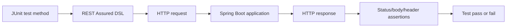
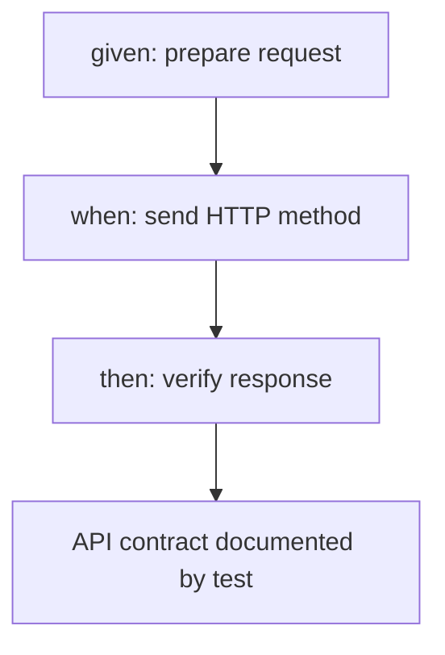
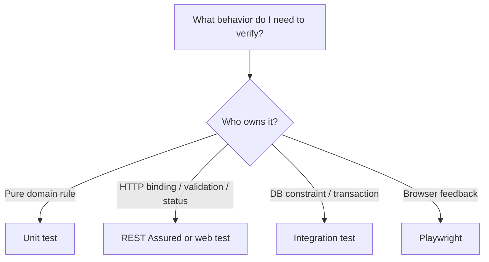

# Lessons 01-12 - REST Assured Foundations

This file contains the beginner-first part of the path. Each lesson uses the same didactic structure: what, why, vocabulary, minimal example, line-by-line explanation, professional example, common mistakes, repo connection, quality principle, QA/SDET view, questions, exercise, quiz, interview answers and remember section.

## Diagram - Request Lifecycle For REST Assured



## Diagram - Given When Then Mental Model



---

# Lesson 1 - Czym Jest REST Assured / What REST Assured Is

## 1. Tytuł PL + EN

PL: Czym jest REST Assured i po co testerowi backendowemu  
EN: What REST Assured is and why a backend tester uses it

## 2. Po Co Testerowi Ta Wiedza

REST Assured pozwala pisać automatyczne testy HTTP w Javie. Tester może wysłać request do uruchomionej aplikacji, sprawdzić status, body, headers i error contract bez klikania w UI.

## 3. Intuicyjne Wyjaśnienie Od Zera

REST Assured jest jak programowalny Postman w teście JUnit. Zamiast ręcznie klikać Send, piszesz kod, który wysyła request i sam sprawdza response.

## 4. Słowniczek Pojęć

| Pojęcie | Znaczenie |
|---|---|
| REST Assured | biblioteka Java do testowania API HTTP |
| Request | żądanie wysłane do backendu |
| Response | odpowiedź backendu |
| Assertion | sprawdzenie, czy wynik jest zgodny z oczekiwaniem |
| API contract | umowa: endpoint, statusy, body, error shape |

## 5. Minimalny Przykład

```java
given()
.when()
    .get("/api/status")
.then()
    .statusCode(200);
```

## 6. Wyjaśnienie Kodu Linia Po Linii

- `given()` zaczyna opis requestu. Typowo zwraca obiekt specyfikacji requestu, na którym można wywołać kolejne metody.
- `.when()` przechodzi z przygotowania requestu do wykonania akcji.
- `.get("/api/status")` wysyła HTTP GET na wskazany endpoint.
- `.then()` przechodzi do walidacji odpowiedzi.
- `.statusCode(200)` sprawdza, czy HTTP status wynosi `200`.
- Kropka `.` oznacza wywołanie metody na obiekcie zwróconym przez poprzedni krok.
- To jest fluent API: metody zwracają obiekty pozwalające dopisać kolejne kroki w czytelnej kolejności.
- `given()` zwykle pochodzi ze static importu: `import static io.restassured.RestAssured.given;`.

## 7. Bardziej Profesjonalny Przykład

```java
given()
    .port(port)
.when()
    .get("/api/status")
.then()
    .statusCode(200)
    .body("status", equalTo("UP"));
```

Tutaj test sprawdza nie tylko status HTTP, ale też sens odpowiedzi.

## 8. Typowe Błędy Początkujących

- Sprawdzanie tylko `statusCode(200)` bez body.
- Mylenie REST Assured z aplikacją produkcyjną.
- Pisanie testu, który nie mówi, jaki kontrakt API chroni.

## 9. Jak Ten Temat Pojawia Się W Obecnym Repo

- `apps/backend/src/test/java/lab/paymentquality/rest/StatusRestAssuredTest.java`
- `apps/backend/src/test/java/lab/paymentquality/rest/MerchantRestAssuredTest.java`

REST Assured zastępuje UI i Nuxt Server API w testach backendu.

## 10. Zasada Jakości / Design Principle

KISS: pierwszy test powinien jasno pokazywać request i oczekiwanie. Nie zaczynamy od helperów, zanim rozumiemy podstawowy przepływ.

## 11. Perspektywa QA/SDET

Tester backendowy używa REST Assured, żeby sprawdzić zachowanie API tam, gdzie UI byłby zbyt wolny, kruchy albo niewłaściwy do diagnozy problemu.

## 12. Pytania, Które Powinienem Sobie Zadać

- Jaki endpoint testuję?
- Jaki status powinien wrócić?
- Czy sprawdzam tylko techniczny status, czy też kontrakt body?

## 13. Mini Ćwiczenie Praktyczne

Zapisz słowami, co robi test `GET /api/status` z przykładu.

## 14. Quiz Kontrolny

1. Czy REST Assured jest częścią aplikacji produkcyjnej? Nie, to biblioteka testowa.
2. Co sprawdza `statusCode(200)`? HTTP status response.
3. Co zastępuje REST Assured w teście backendu? Klienta HTTP, np. UI/Postmana.

## 15. Pytania Rekrutacyjne EN + Odpowiedzi

**Question:** What is REST Assured used for?  
**Answer:** REST Assured is used to write automated HTTP API tests in Java, sending requests and validating responses in a fluent style.

## 16. Zapamiętaj

REST Assured to kodowy klient HTTP dla testów backendu. Najpierw rozumiesz request/response, dopiero potem budujesz helpery.

---

# Lesson 2 - Anatomia Pierwszego Testu / Anatomy of `given()`, `when()`, `then()`

## 1. Tytuł PL + EN

PL: Anatomia pierwszego testu: `given()`, `when()`, `then()`  
EN: Anatomy of the first test: `given()`, `when()`, `then()`

## 2. Po Co Testerowi Ta Wiedza

To jest podstawowa składnia REST Assured. Bez jej zrozumienia helpery i specyfikacje będą wyglądały jak magia.

## 3. Intuicyjne Wyjaśnienie Od Zera

- `given` = co przygotowuję?
- `when` = jaką akcję wykonuję?
- `then` = czego oczekuję?

To odpowiada Arrange / Act / Assert.

## 4. Słowniczek Pojęć

| Pojęcie | Znaczenie |
|---|---|
| Fluent API | styl, w którym metody łączą się w czytelny łańcuch |
| Static import | import pozwalający pisać `given()` zamiast `RestAssured.given()` |
| Chain | łańcuch kolejnych wywołań po kropce |

## 5. Minimalny Przykład

```java
given()
.when()
    .get("/status")
.then()
    .statusCode(200);
```

## 6. Wyjaśnienie Kodu Linia Po Linii

- `given()` tworzy startową specyfikację requestu.
- Pusta sekcja `given()` oznacza: nie ustawiam żadnych dodatkowych parametrów.
- `.when()` zwraca obiekt pozwalający wykonać metodę HTTP.
- `.get("/status")` wykonuje request GET.
- `.then()` zwraca obiekt do walidacji response.
- `.statusCode(200)` przyjmuje oczekiwany kod jako parametr typu `int`.
- Kropka działa, bo poprzednia metoda zwraca kolejny obiekt DSL.

## 7. Bardziej Profesjonalny Przykład

```java
given()
    .port(port)
    .accept(ContentType.JSON)
.when()
    .get("/api/status")
.then()
    .statusCode(200)
    .contentType(ContentType.JSON);
```

## 8. Typowe Błędy Początkujących

- Czytanie DSL od środka zamiast od góry do dołu.
- Mylenie `when()` z JUnit `when` z Mockito.
- Myślenie, że `.then()` wykonuje request. Request wykonuje metoda HTTP, np. `.get()`.

## 9. Jak Ten Temat Pojawia Się W Repo

`MerchantRestAssuredTest` używa układu:

```java
operatorRequest(port)
.when().get("/api/merchants")
.then().statusCode(200);
```

`operatorRequest(port)` jest przygotowanym `given()` z auth.

## 10. Zasada Jakości / Design Principle

Czytelność testu: test powinien dać się przeczytać jak zdanie: given request, when I call endpoint, then I expect response.

## 11. Perspektywa QA/SDET

Given/When/Then pomaga oddzielić setup, akcję i oracle testowy. To zmniejsza ryzyko testów, które robią wiele rzeczy naraz i są trudne w diagnozie.

## 12. Pytania

- Co przygotowuję?
- Kiedy request faktycznie jest wysyłany?
- Co jest asercją?

## 13. Mini Ćwiczenie

Przetłumacz na słowa:

```java
given().when().get("/api/status").then().statusCode(200);
```

## 14. Quiz

1. Czy `given()` wysyła request? Nie.
2. Który fragment wysyła request? `.get(...)`, `.post(...)` itd.
3. Co robi `.then()`? Otwiera walidację response.

## 15. Interview EN

**Question:** How does REST Assured's given/when/then structure relate to Arrange/Act/Assert?  
**Answer:** `given` prepares the request, `when` performs the HTTP action, and `then` verifies the response, which maps naturally to Arrange, Act and Assert.

## 16. Zapamiętaj

`given/when/then` to nie ozdoba. To struktura myślenia testera.

---

# Lesson 3 - Budowa Requestu / HTTP Method, Endpoint, Content-Type and Accept

## 1. Tytuł PL + EN

PL: Budowa requestu: endpoint, metoda HTTP, content type i accept  
EN: Building a request: endpoint, HTTP method, content type and accept

## 2. Po Co Testerowi Ta Wiedza

Tester musi rozumieć, co wysyła. Inaczej może mieć czerwony test z powodu błędnego requestu, a nie błędu aplikacji.

## 3. Intuicyjne Wyjaśnienie

Metoda HTTP mówi, co chcesz zrobić. Endpoint mówi, z czym. `Content-Type` mówi, jaki format wysyłasz. `Accept` mówi, jaki format chcesz dostać.

## 4. Słowniczek

| Element | Znaczenie |
|---|---|
| GET | pobierz dane |
| POST | utwórz lub uruchom akcję |
| PUT/PATCH | zmień dane |
| DELETE | usuń dane |
| Content-Type | format wysyłanego body |
| Accept | preferowany format odpowiedzi |

## 5. Minimalny Przykład

```java
given()
    .contentType(ContentType.JSON)
    .body(Map.of("merchantReference", "ABC-123", "displayName", "Example"))
.when()
    .post("/api/merchants")
.then()
    .statusCode(201);
```

## 6. Wyjaśnienie Kodu Linia Po Linii

- `.contentType(ContentType.JSON)` ustawia header `Content-Type: application/json`.
- `.body(...)` ustawia ciało requestu.
- `.post("/api/merchants")` wysyła HTTP POST.
- `.statusCode(201)` sprawdza, że zasób został utworzony.
- `ContentType.JSON` jest enumem/stałą REST Assured reprezentującą JSON.
- `Map.of(...)` tworzy niemutowalną mapę klucz-wartość.

## 7. Bardziej Profesjonalny Przykład

```java
given()
    .accept(ContentType.JSON)
.when()
    .get("/api/merchants")
.then()
    .statusCode(200)
    .contentType(ContentType.JSON);
```

GET nie potrzebuje body, ale `Accept` może jasno komunikować oczekiwany format odpowiedzi.

## 8. Typowe Błędy

- Wysyłanie JSON body bez `Content-Type: application/json`.
- Używanie POST dla odczytu tylko dlatego, że jest łatwiej.
- Mylenie `Content-Type` z `Accept`.

## 9. Repo

`MerchantRestAssuredTest#createMerchant` ustawia `ContentType.JSON` przed `.body(...)` i `.post("/api/merchants")`.

## 10. Zasada Jakości

API contract: metoda HTTP i endpoint są częścią kontraktu. Test powinien chronić właściwe znaczenie operacji.

## 11. QA/SDET

Błędny content type może ukryć prawdziwy problem. Tester powinien wiedzieć, czy testuje API, czy przypadkiem wysyła źle zbudowany request.

## 12. Pytania

- Czy ten endpoint powinien mieć body?
- Czy mój request mówi backendowi, że wysyłam JSON?
- Czy status sukcesu pasuje do metody HTTP?

## 13. Mini Ćwiczenie

Wskaż, który test potrzebuje `contentType(JSON)`: `GET /api/merchants` czy `POST /api/merchants` z body.

## 14. Quiz

1. Czy GET zwykle ma body? Nie.
2. Co oznacza `Content-Type`? Format wysyłanego body.
3. Co oznacza `Accept`? Preferowany format odpowiedzi.

## 15. Interview EN

**Question:** What is the difference between `Content-Type` and `Accept`?  
**Answer:** `Content-Type` describes the format of the request body being sent, while `Accept` describes the response format the client prefers.

## 16. Zapamiętaj

Request to nie tylko URL. To metoda, endpoint, headers, body i oczekiwania formatu.

---

# Lesson 4 - Parametry Wejścia / Path Params, Query Params and Headers

## 1. Tytuł PL + EN

PL: Parametry wejścia: path params, query params, headers  
EN: Input parameters: path params, query params and headers

## 2. Po Co Testerowi Ta Wiedza

Większość API przyjmuje dane nie tylko w body. Tester musi rozumieć, gdzie dana wartość powinna trafić.

## 3. Intuicyjne Wyjaśnienie

- Path param identyfikuje zasób: `/merchants/{id}`.
- Query param filtruje lub steruje odpowiedzią: `?status=ACTIVE`.
- Header niesie metadane: `Authorization`, `X-Correlation-ID`.

## 4. Słowniczek

| Typ | Przykład | Sens |
|---|---|---|
| Path param | `/api/merchants/{id}` | który zasób |
| Query param | `?status=ACTIVE` | jak filtrować |
| Header | `Authorization` | metadane requestu |

## 5. Minimalny Przykład

```java
given()
    .pathParam("id", merchantId)
.when()
    .get("/api/merchants/{id}")
.then()
    .statusCode(200);
```

## 6. Wyjaśnienie Linia Po Linii

- `.pathParam("id", merchantId)` zapisuje wartość parametru o nazwie `id`.
- `.get("/api/merchants/{id}")` używa placeholdera `{id}`.
- REST Assured podstawia wartość przed wysłaniem requestu.
- `merchantId` jest parametrem metody `.pathParam`.
- `.statusCode(200)` sprawdza, czy zasób znaleziono.

## 7. Profesjonalny Przykład

```java
given()
    .queryParam("status", "ACTIVE")
    .header("X-Correlation-ID", "test-123")
.when()
    .get("/api/merchants")
.then()
    .statusCode(200);
```

Uwaga: obecny Phase 1 contract nie ma filtrowania merchantów po statusie. Ten query param jest przykładem edukacyjnym, nie aktualnym endpointem repo.

## 8. Typowe Błędy

- Wkładanie ID do query param, gdy kontrakt mówi path param.
- Używanie body do GET, gdy API oczekuje path/query param.
- Logowanie wrażliwego headera `Authorization`.

## 9. Repo

`MerchantRestAssuredTest` używa `/api/merchants/{id}` przy GET, activate i suspend.

## 10. Zasada Jakości

Contract clarity: miejsce parametru jest częścią kontraktu. Zmiana path/query/header może być breaking change.

## 11. QA/SDET

Tester projektuje przypadki nie tylko po wartościach, ale też po kanałach wejścia: body, path, query, headers.

## 12. Pytania

- Czy ta wartość identyfikuje zasób?
- Czy ta wartość filtruje wynik?
- Czy ta wartość jest metadanym requestu?

## 13. Mini Ćwiczenie

Dopasuj: merchant id, status filter, Authorization token do path/query/header.

## 14. Quiz

1. Gdzie zwykle trafia id zasobu? Path param.
2. Gdzie trafia token? Header.
3. Gdzie trafia filtr listy? Query param.

## 15. Interview EN

**Question:** When should you use a path parameter instead of a query parameter?  
**Answer:** Use a path parameter when the value identifies a specific resource; use query parameters to filter, sort or control a collection response.

## 16. Zapamiętaj

Nie wszystkie dane wejściowe idą w body. Kanał danych mówi, jak API rozumie request.

---

# Lesson 5 - Request Body, JSON, `Map.of`, DTO and Serialization

## 1. Tytuł PL + EN

PL: Request body: JSON, `Map.of`, DTO i serializacja  
EN: Request body: JSON, `Map.of`, DTO and serialization

## 2. Po Co Testerowi Ta Wiedza

Tworzenie body jest źródłem wielu kruchych testów. Tester musi umieć wybrać prosty i stabilny sposób budowy payloadu.

## 3. Intuicyjne Wyjaśnienie

Body to formularz wysyłany do backendu. REST Assured może wysłać tekst JSON, mapę albo obiekt Java. Serializacja to zamiana obiektu Java na JSON.

## 4. Słowniczek

| Pojęcie | Znaczenie |
|---|---|
| Body | ciało requestu |
| JSON | tekstowy format danych |
| Serialization | Java object -> JSON |
| DTO | obiekt danych do transportu |
| `Map.of` | szybka niemutowalna mapa dla prostych payloadów |

## 5. Minimalny Przykład

```java
.body(Map.of(
    "merchantReference", "ABC-123",
    "displayName", "Example Merchant"
))
```

## 6. Wyjaśnienie Linia Po Linii

- `.body(...)` ustawia ciało requestu.
- `Map.of(...)` tworzy mapę.
- Klucz `"merchantReference"` stanie się nazwą pola JSON.
- Wartość `"ABC-123"` stanie się wartością pola JSON.
- REST Assured, z mapperem JSON na classpath, może zserializować mapę do JSON.
- Mapa jest niemutowalna, więc test przypadkiem jej nie zmieni po utworzeniu.

## 7. Profesjonalny Przykład

```java
record CreateMerchantPayload(String merchantReference, String displayName) {}

given()
    .contentType(ContentType.JSON)
    .body(new CreateMerchantPayload("ABC-123", "Example Merchant"))
.when()
    .post("/api/merchants")
.then()
    .statusCode(201);
```

DTO/record jest lepszy, gdy payload rośnie albo jest używany w wielu testach.

## 8. Typowe Błędy

- Ręczne składanie JSON stringiem z interpolacją i błędami cudzysłowów.
- Kopiowanie dużych payloadów między testami.
- Budowanie ogromnego Test Data Buildera dla dwóch pól.

## 9. Repo

W refactoring-derived testach payload merchanta jest budowany przez helper `createMerchantBody(...)`, który zwraca mapę zamiast składać ręczny JSON string.

## 10. Zasada Jakości

KISS + DRY: `Map.of` lub mały helper jest dobry dla prostych body. Builder jest uzasadniony dopiero, gdy realnie zmniejsza duplikację i ryzyko.

## 11. QA/SDET

Stabilne request body zmniejsza false negatives: test nie pada przez literówkę w JSON stringu.

## 12. Pytania

- Czy payload jest prosty?
- Czy pola powtarzają się w wielu testach?
- Czy potrzebuję typu Java, czy wystarczy mapa?

## 13. Mini Ćwiczenie

Zamień ręczny JSON `{"merchantReference":"ABC","displayName":"Acme"}` na `Map.of(...)`.

## 14. Quiz

1. Co robi serializacja? Zamienia obiekt Java na JSON.
2. Kiedy `Map.of` jest dobre? Przy małym, prostym payloadzie.
3. Kiedy DTO ma sens? Gdy payload jest większy lub współdzielony.

## 15. Interview EN

**Question:** Why can `Map.of` be better than a raw JSON string in REST Assured tests?  
**Answer:** It avoids fragile manual JSON formatting, makes fields explicit as key-value pairs, and lets REST Assured serialize the payload consistently.

## 16. Zapamiętaj

Najprostszy stabilny payload jest lepszy niż efektowny helper bez potrzeby.

---

# Lesson 6 - Response and Basic Assertions

## 1. Tytuł PL + EN

PL: Response i podstawowe asercje  
EN: Response and basic assertions

## 2. Po Co Testerowi Ta Wiedza

Test bez dobrych asercji nie chroni kontraktu. Status code to początek, nie koniec testowania API.

## 3. Intuicyjne Wyjaśnienie

Response to odpowiedź backendu. Asercja mówi: oczekuję, że odpowiedź ma taki status, taki format i takie pola.

## 4. Słowniczek

| Pojęcie | Znaczenie |
|---|---|
| `statusCode` | sprawdza HTTP status |
| `contentType` | sprawdza format odpowiedzi |
| `body` | sprawdza pole w response body |
| Matcher | obiekt opisujący oczekiwanie, np. `equalTo` |
| Hamcrest | biblioteka matcherów używana z REST Assured |

## 5. Minimalny Przykład

```java
then()
    .statusCode(201)
    .body("merchantReference", equalTo("ABC-123"));
```

## 6. Wyjaśnienie Linia Po Linii

- `.then()` zaczyna walidację response.
- `.statusCode(201)` sprawdza status HTTP.
- `.body("merchantReference", equalTo("ABC-123"))` sprawdza pole JSON.
- `"merchantReference"` to ścieżka do pola w JSON response.
- `equalTo("ABC-123")` to matcher: oczekuję dokładnie tej wartości.
- `equalTo` zwykle pochodzi ze static importu `org.hamcrest.Matchers.equalTo`.

## 7. Profesjonalny Przykład

```java
.then()
    .statusCode(201)
    .contentType(ContentType.JSON)
    .body("merchantId", notNullValue())
    .body("merchantReference", equalTo(reference))
    .body("status", equalTo("DRAFT"));
```

## 8. Typowe Błędy

- Brak sprawdzenia pól biznesowych.
- Zbyt kruche sprawdzanie całego JSON-a jako stringa.
- Asercje, które sprawdzają przypadkowy szczegół implementacji.

## 9. Repo

`MerchantRestAssuredTest` sprawdza status `201`, `merchantReference`, `displayName`, `status` i wyciąga `merchantId`.

## 10. Zasada Jakości

Test jako kontrakt: asercje powinny opisywać obietnicę API, nie wewnętrzne szczegóły.

## 11. QA/SDET

Tester pyta: co musi się zepsuć, żeby ten test zapalił czerwoną lampkę? Jeśli test sprawdza za mało, nie wykryje regresji.

## 12. Pytania

- Czy sprawdzam status?
- Czy sprawdzam wymagane pola?
- Czy sprawdzam error shape dla błędów?

## 13. Mini Ćwiczenie

Dopisz asercję, że `merchantId` nie jest null.

## 14. Quiz

1. Co oznacza `body("status", equalTo("DRAFT"))`? Pole `status` ma mieć wartość `DRAFT`.
2. Co to jest matcher? Opis oczekiwanej wartości.
3. Czy warto sprawdzać tylko status? Zwykle nie.

## 15. Interview EN

**Question:** Why should API tests assert response bodies, not only status codes?  
**Answer:** Status codes only show the high-level outcome. Body assertions verify the actual API contract and business-relevant response data.

## 16. Zapamiętaj

Dobre asercje mówią, jakie zachowanie API chronisz.

---

# Lesson 7 - Nested Responses and Lists

## 1. Tytuł PL + EN

PL: Asercje dla zagnieżdżonych odpowiedzi i list  
EN: Assertions for nested responses and lists

## 2. Po Co Testerowi Ta Wiedza

Wiele endpointów zwraca listy albo obiekty w obiektach. Tester musi umieć sprawdzić nie tylko pojedyncze pole na górze JSON-a.

## 3. Intuicyjne Wyjaśnienie

REST Assured pozwala używać ścieżek do pól w JSON. Dla listy merchantów możesz sprawdzić, czy lista zawiera konkretną reference.

## 4. Słowniczek

| Pojęcie | Znaczenie |
|---|---|
| Body path | ścieżka do wartości w JSON |
| List assertion | sprawdzenie kolekcji |
| `hasItem` | matcher: lista zawiera element |
| `hasSize` | matcher: lista ma określony rozmiar |

## 5. Minimalny Przykład

```java
.then()
    .body("merchants.merchantReference", hasItem(reference));
```

## 6. Wyjaśnienie Linia Po Linii

- `"merchants"` wskazuje pole z listą.
- `"merchantReference"` po kropce wskazuje pole każdego elementu listy.
- `hasItem(reference)` oczekuje, że lista wartości zawiera reference.
- To nie wymaga ręcznego parsowania całego JSON-a.

## 7. Profesjonalny Przykład

```java
.then()
    .statusCode(200)
    .body("merchants", notNullValue())
    .body("merchants.merchantReference", hasItem(reference))
    .body("merchants.status", hasItem("DRAFT"));
```

## 8. Typowe Błędy

- Zakładanie kolejności listy bez kontraktu.
- Sprawdzanie tylko pierwszego elementu, gdy kolejność nie jest gwarantowana.
- Nadmierne użycie skomplikowanych GPath expressions, których nikt nie rozumie.

## 9. Repo

`MerchantRestAssuredTest#listReturnsSeededMerchantsNewestFirst` sprawdza kolejność, bo kontrakt listowania ma deterministic ordering.

## 10. Zasada Jakości

Stable assertions: sprawdzaj kolejność tylko wtedy, gdy kontrakt ją gwarantuje.

## 11. QA/SDET

Dla list tester musi wiedzieć, czy testuje zawartość, rozmiar, kolejność czy filtr. To różne ryzyka.

## 12. Pytania

- Czy kolejność listy jest częścią kontraktu?
- Czy wystarczy `hasItem`, czy potrzebuję `containsExactly`?
- Czy odpowiedź może zawierać dane z innych testów?

## 13. Mini Ćwiczenie

Napisz asercję, że lista `merchants.merchantReference` zawiera `MERCH-123`.

## 14. Quiz

1. Co robi `hasItem`? Sprawdza obecność elementu w kolekcji.
2. Kiedy sprawdzać kolejność? Gdy jest częścią kontraktu.
3. Co oznacza `merchants.status`? Lista statusów z elementów listy merchants.

## 15. Interview EN

**Question:** Why can list ordering assertions be risky in API tests?  
**Answer:** They are risky when ordering is not part of the contract, because harmless implementation or database changes can break the test without a real product regression.

## 16. Zapamiętaj

Lista w API to osobny kontrakt: zawartość, rozmiar, kolejność i filtrowanie trzeba rozróżniać.

---

# Lesson 8 - Extraction and Deserialization

## 1. Tytuł PL + EN

PL: Pobieranie danych z odpowiedzi: `Response`, `extract()`, `path()`, deserializacja  
EN: Extracting response data: `Response`, `extract()`, `path()`, deserialization

## 2. Po Co Testerowi Ta Wiedza

Scenariusze API często mają kilka kroków: utwórz zasób, wyciągnij ID, odczytaj zasób, zmień status.

## 3. Intuicyjne Wyjaśnienie

Extraction to zapisanie kawałka odpowiedzi do zmiennej, żeby użyć go w kolejnym requestcie.

## 4. Słowniczek

| Pojęcie | Znaczenie |
|---|---|
| `extract()` | przejście od asercji do pobrania danych |
| `path()` | pobiera wartość z JSON path |
| `Response` | pełna odpowiedź HTTP w obiekcie REST Assured |
| Deserialization | JSON -> Java object |

## 5. Minimalny Przykład

```java
String id = given()
    .contentType(ContentType.JSON)
    .body(payload)
.when()
    .post("/api/merchants")
.then()
    .statusCode(201)
    .extract().path("merchantId");
```

## 6. Wyjaśnienie Linia Po Linii

- `String id =` zapisuje wynik extraction do zmiennej typu `String`.
- `.extract()` mówi: po walidacji chcę coś pobrać z response.
- `.path("merchantId")` pobiera pole JSON `merchantId`.
- Wartość może potem trafić do path param w kolejnym requestcie.

## 7. Profesjonalny Przykład

```java
String id = createMerchant(reference, "Flow Merchant")
        .then()
        .statusCode(201)
        .body("status", equalTo("DRAFT"))
        .extract().path("merchantId");

operatorRequest(port)
.when()
    .get("/api/merchants/{id}", id)
.then()
    .statusCode(200)
    .body("merchantId", equalTo(id));
```

## 8. Typowe Błędy

- Wyciąganie danych bez wcześniejszego sprawdzenia statusu.
- Budowanie długich scenariuszy, które trudno diagnozować.
- Używanie extraction do ukrycia braku asercji.

## 9. Repo

`createReadListActivateAndSuspendMerchant` wyciąga `merchantId` z POST i używa go do GET, activate i suspend.

## 10. Zasada Jakości

Scenario clarity: extraction jest dobra, gdy buduje realny flow, ale każdy krok powinien mieć swój sensowny oracle.

## 11. QA/SDET

Extraction umożliwia testy end-to-end na poziomie API, ale zwiększa zależność kroków. Gdy test pada, trzeba łatwo zobaczyć, który krok zawiódł.

## 12. Pytania

- Czy muszę użyć danych z poprzedniej odpowiedzi?
- Czy sprawdziłem response przed extraction?
- Czy scenariusz nie jest za długi?

## 13. Mini Ćwiczenie

Napisz mentalnie flow: POST merchant -> extract id -> GET merchant by id.

## 14. Quiz

1. Po co `extract().path(...)`? Żeby pobrać wartość z response.
2. Czy extraction zastępuje asercję? Nie.
3. Kiedy deserializacja do DTO ma sens? Gdy potrzebujesz wielu pól jako typowanego obiektu.

## 15. Interview EN

**Question:** Why should you assert the response before extracting values from it?  
**Answer:** Because extraction from an unexpected or failed response can hide the real failure and make the next step fail with a misleading error.

## 16. Zapamiętaj

Najpierw sprawdź, potem wyciągaj dane.

---

# Lesson 9 - Auth in REST Assured

## 1. Tytuł PL + EN

PL: Auth w REST Assured: Bearer token i testy security  
EN: Auth in REST Assured: Bearer token and security tests

## 2. Po Co Testerowi Ta Wiedza

API bez poprawnych testów security może działać funkcjonalnie, ale być niebezpieczne.

## 3. Intuicyjne Wyjaśnienie

Bearer token to przepustka wysłana w headerze `Authorization`. REST Assured może dodać ją przez `.auth().oauth2(token)`.

## 4. Słowniczek

| Pojęcie | Znaczenie |
|---|---|
| Authentication | kim jesteś |
| Authorization | co wolno ci zrobić |
| Bearer token | token dostępu w headerze |
| 401 | brak lub nieważny token |
| 403 | token ważny, ale brak uprawnienia |

## 5. Minimalny Przykład

```java
given()
    .auth().oauth2(token)
.when()
    .get("/api/merchants")
.then()
    .statusCode(200);
```

## 6. Wyjaśnienie Linia Po Linii

- `.auth()` przechodzi do konfiguracji auth.
- `.oauth2(token)` ustawia Bearer token w requestcie.
- `token` jest parametrem typu `String`.
- REST Assured doda header `Authorization: Bearer <token>`.
- `.get(...)` wysyła request z tokenem.

## 7. Profesjonalny Przykład

```java
requestWithToken(port, TestJwtSupport.deniedToken())
.when()
    .get("/api/merchants")
.then()
    .statusCode(403);
```

## 8. Typowe Błędy

- Testowanie tylko happy-path tokena.
- Mylenie `401` z `403`.
- Logowanie tokenów w CI.

## 9. Repo

`MerchantSecurityTest` sprawdza brak tokena, invalid token, denied identity, partial authorities i full platform operator.

## 10. Zasada Jakości

Security is behavior: autoryzacja jest częścią kontraktu API, nie dodatkiem.

## 11. QA/SDET

Tester powinien mieć macierz auth: unauthenticated, invalid, forbidden, authorized.

## 12. Pytania

- Jaki token wysyłam?
- Jakiej authority wymaga endpoint?
- Czy testuję oba przypadki: 401 i 403?

## 13. Mini Ćwiczenie

Wyjaśnij różnicę między requestem bez tokena a requestem z tokenem bez `platform:merchants:create`.

## 14. Quiz

1. Co robi `.auth().oauth2(token)`? Dodaje Bearer token.
2. Co oznacza 401? Brak/invalid authentication.
3. Co oznacza 403? Brak authorization.

## 15. Interview EN

**Question:** Why should backend API tests verify both 401 and 403?  
**Answer:** They represent different security failures: 401 means the caller is not authenticated, while 403 means the caller is authenticated but not allowed to perform the operation.

## 16. Zapamiętaj

JWT nie załatwia dostępu sam. Backend musi zweryfikować token i authority.

---

# Lesson 10 - Negative API Tests

## 1. Tytuł PL + EN

PL: Negatywne testy API: invalid input, missing fields, malformed path variable  
EN: Negative API tests: invalid input, missing fields, malformed path variable

## 2. Po Co Testerowi Ta Wiedza

Prawdziwa jakość API ujawnia się wtedy, gdy klient wysyła złe dane. Testy negatywne chronią error contract.

## 3. Intuicyjne Wyjaśnienie

Negatywny test mówi: kiedy użytkownik lub integracja zrobi coś źle, API odpowiada kontrolowanym błędem, a nie chaosem.

## 4. Słowniczek

| Status | Sens |
|---|---|
| 400 | invalid input / malformed value |
| 401 | missing or invalid auth |
| 403 | missing authority |
| 404 | resource not found |
| 409 | conflict with current server state |

## 5. Minimalny Przykład

```java
createMerchant("AB", "Short Reference")
    .then()
    .statusCode(400)
    .body("error", equalTo("validation"));
```

## 6. Wyjaśnienie Linia Po Linii

- `createMerchant("AB", ...)` wysyła za krótkie reference.
- `.then()` zaczyna asercje.
- `.statusCode(400)` oczekuje bad request.
- `.body("error", equalTo("validation"))` sprawdza error code w JSON.
- Test nie tylko sprawdza błąd, ale konkretny kontrakt błędu.

## 7. Profesjonalny Przykład

| Input | Expected status | Expected error |
|---|---:|---|
| reference `AB` | 400 | `validation` |
| reference blank | 400 | `validation` |
| malformed UUID | 400 | `validation` |
| unknown UUID | 404 | `not_found` |
| duplicate reference | 409 | `duplicate_merchant_reference` |

## 8. Typowe Błędy

- Negatywny test sprawdza tylko status, bez error shape.
- Test oczekuje złego statusu, np. 400 dla konfliktu stanu, który powinien być 409.
- Testuje frameworkowy binding w unit teście zamiast przez HTTP.

## 9. Repo

`MerchantRestAssuredTest#createValidationAndDuplicateErrors` i `notFoundMalformedAndInvalidTransitionErrors` pokrywają walidację, malformed UUID, 404 i 409.

## 10. Zasada Jakości

Error contract is a contract: klienci API zależą od stabilnych kodów błędów tak samo jak od happy path.

## 11. QA/SDET

Dobry tester projektuje macierz: input, expected status, expected error code/message, warstwa odpowiedzialna.

## 12. Pytania

- Czy błąd wynika z kształtu requestu, autoryzacji, braku zasobu czy konfliktu?
- Czy error response ma stabilny shape?
- Czy test jest na właściwym poziomie?

## 13. Mini Ćwiczenie

Dopisz oczekiwany status dla `GET /api/merchants/not-a-uuid`.

## 14. Quiz

1. Duplicate normalized reference to 400 czy 409? 409.
2. Malformed UUID to 400 czy 404? 400.
3. Unknown valid UUID to 404 czy 409? 404.

## 15. Interview EN

**Question:** Why is a duplicate resource often a 409 instead of a 400?  
**Answer:** The request can be syntactically valid but conflict with the current server state, so 409 communicates the problem more precisely.

## 16. Zapamiętaj

Negatywne testy mają dokumentować kontrolowane zachowanie błędu, nie tylko „coś się wywaliło”.

---

# Lesson 11 - Choosing Test Level

## 1. Tytuł PL + EN

PL: Jak dobierać poziom testu: unit vs web/HTTP vs integration  
EN: Choosing the right test level: unit vs web/HTTP vs integration

## 2. Po Co Testerowi Ta Wiedza

Ten sam błąd można testować na złym poziomie. Wtedy test jest kruchy, duplikuje framework albo daje fałszywe poczucie bezpieczeństwa.

## 3. Intuicyjne Wyjaśnienie

Testuj zachowanie tam, gdzie odpowiedzialność naprawdę mieszka.

## 4. Słowniczek

| Poziom | Co testuje |
|---|---|
| Unit | małą klasę/metodę bez pełnego Springa |
| Web/HTTP | binding, validation, security, statusy HTTP |
| Integration | współpracę wielu warstw z bazą/testcontainers |
| Persistence IT | trwałość i zachowanie bazy |

## 5. Minimalny Przykład

Malformed UUID przy `@PathVariable UUID` lepiej testować przez HTTP:

```java
operatorRequest(port)
.when()
    .get("/api/merchants/not-a-uuid")
.then()
    .statusCode(400);
```

## 6. Wyjaśnienie Linia Po Linii

- Test wysyła realny HTTP request.
- Spring MVC próbuje zbindować path variable do UUID.
- Jeśli binding się nie uda, API zwraca błąd HTTP.
- Nie testujemy ręcznie `UUID.fromString`, jeśli parsing jest odpowiedzialnością frameworka.

## 7. Profesjonalny Przykład



## 8. Typowe Błędy

- Unit test frameworkowego bindingu.
- REST test dla prostej metody domenowej bez potrzeby.
- Jeden test próbujący pokryć UI, security, DB i wszystkie edge cases.

## 9. Repo

Refactoring-derived decision: techniczny unit test ręcznego UUID parsing został usunięty, a malformed UUID pozostał w teście HTTP, bo odpowiedzialność należy do Spring bindingu.

## 10. Zasada Jakości

Test at the right level: test powinien być najniżej, gdzie daje wiarygodny sygnał, ale nie niżej niż odpowiedzialność zachowania.

## 11. QA/SDET

Senior SDET potrafi powiedzieć nie tylko „brakuje testu”, ale „ten test jest na złym poziomie”.

## 12. Pytania

- Kto jest właścicielem zachowania?
- Czy potrzebuję Spring MVC?
- Czy potrzebuję bazy?
- Czy test byłby stabilny bez pełnego stacka?

## 13. Mini Ćwiczenie

Dobierz poziom testu dla regex `MerchantReference`, malformed UUID i duplicate DB constraint.

## 14. Quiz

1. Regex value object najlepiej unit czy HTTP? Unit, plus wybrane HTTP contract tests.
2. Malformed UUID binding najlepiej HTTP czy pure unit? HTTP.
3. Unique constraint najlepiej unit czy integration? Integration/HTTP with DB.

## 15. Interview EN

**Question:** How do you decide whether a behavior belongs in a unit test or an HTTP test?  
**Answer:** I identify who owns the behavior. Pure domain rules fit unit tests, while HTTP binding, validation, security and status mapping should be verified at the web/HTTP level.

## 16. Zapamiętaj

Nie testuj frameworka w unit teście, jeśli zachowanie powstaje dopiero w frameworkowym request pipeline.

---

# Lesson 12 - Structure of a Good REST Assured Test

## 1. Tytuł PL + EN

PL: Struktura dobrego testu REST Assured  
EN: Structure of a good REST Assured test

## 2. Po Co Testerowi Ta Wiedza

Dobry test jest dokumentacją zachowania i narzędziem diagnozy. Zły test tylko wykonuje kod.

## 3. Intuicyjne Wyjaśnienie

Test ma mieć czytelne: przygotowanie danych, akcję HTTP, asercje kontraktu.

## 4. Słowniczek

| Pojęcie | Znaczenie |
|---|---|
| Arrange | przygotuj dane |
| Act | wykonaj akcję |
| Assert | sprawdź wynik |
| Oracle | źródło prawdy testu |
| Noise | techniczny szum ukrywający sens testu |

## 5. Minimalny Przykład

```java
String reference = uniqueMerchantReference("CREATE");

operatorRequest(port)
    .contentType(ContentType.JSON)
    .body(createMerchantBody(reference, "Created Merchant"))
.when()
    .post("/api/merchants")
.then()
    .statusCode(201)
    .body("merchantReference", equalTo(reference))
    .body("status", equalTo("DRAFT"));
```

## 6. Wyjaśnienie Linia Po Linii

- `uniqueMerchantReference(...)` przygotowuje izolowane dane testowe.
- `operatorRequest(port)` tworzy request z auth.
- `.contentType(...)` mówi, że wysyłamy JSON.
- `.body(...)` ustawia payload.
- `.post(...)` wykonuje akcję.
- `.statusCode(...)` i `.body(...)` są asercjami kontraktu.

## 7. Zły vs Lepszy Przykład

Zaszucony:

```java
given().port(port).auth().oauth2(token).contentType(JSON).body("{...}")
.when().post("/api/merchants")
.then().statusCode(201);
```

Lepszy:

```java
operatorRequest(port)
    .contentType(ContentType.JSON)
    .body(createMerchantBody(reference, "Created Merchant"))
.when()
    .post("/api/merchants")
.then()
    .statusCode(201)
    .body("merchantReference", equalTo(reference));
```

## 8. Typowe Błędy

- Setup dominuje nad sensem testu.
- Nazwa testu mówi o technice, nie zachowaniu.
- Helper ukrywa najważniejszą informację biznesową.

## 9. Repo

Refactoring testów HTTP zmniejszył powtarzanie `.port(port).auth().oauth2(...)` przez `operatorRequest(port)` i helper payloadu.

## 10. Zasada Jakości

DRY supports readability only when it removes noise, not intent.

## 11. QA/SDET

Reviewując test, pytaj: czy nowa osoba zrozumie, jakie zachowanie ma być chronione?

## 12. Pytania

- Czy nazwa testu opisuje zachowanie?
- Czy setup jest proporcjonalny?
- Czy asercje są biznesowo znaczące?

## 13. Mini Ćwiczenie

Wskaż w przykładzie linie Arrange, Act i Assert.

## 14. Quiz

1. Czy helper może być zły? Tak, jeśli ukrywa intent.
2. Czy DRY jest zawsze dobre w testach? Nie.
3. Co jest oracle w REST testach? API contract i oczekiwane zachowanie.

## 15. Interview EN

**Question:** What makes a REST Assured test maintainable?  
**Answer:** Clear Given/When/Then structure, readable test data, assertions tied to the API contract, minimal technical noise and helpers that reveal rather than hide intent.

## 16. Zapamiętaj

Dobry test REST Assured czyta się jak mała specyfikacja zachowania API.
