# Lessons 01-12 - REST Assured Foundations

This file contains the beginner-first part of the path. Each lesson uses the same didactic structure: what, why, vocabulary, minimal example, line-by-line explanation, professional example, common mistakes, repo connection, quality principle, QA/SDET view, questions, exercise, quiz, interview answers and remember section.

## Diagram - Request Lifecycle For REST Assured

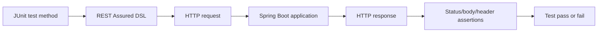

## Diagram - Given When Then Mental Model

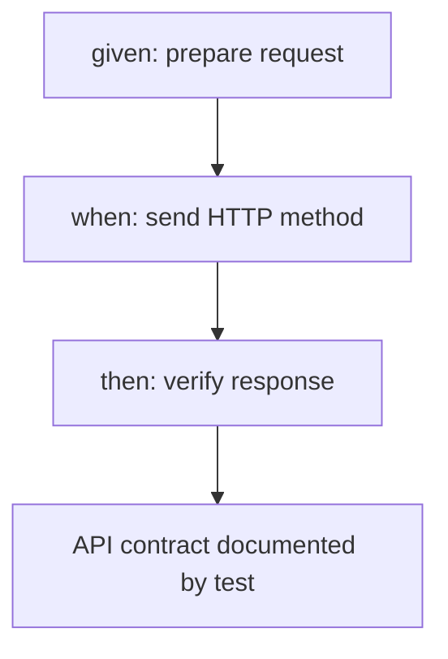

---

# Lesson 1 - Czym Jest REST Assured / What REST Assured Is

## 1. Tytuł PL + EN

PL: Czym jest REST Assured jako testowy klient HTTP.<br>
EN: What REST Assured is as a test HTTP client.

Ta lekcja jest pierwszym krokiem po `REST API From Zero - Merchant Request and Response Flow`. Nie uczymy się jeszcze głęboko składni `given()`, `.when()`, `.then()`. Uczymy się, czym REST Assured jest w warsztacie SDET, co zastępuje, co sprawdza i gdzie leży granica między testem API a testem UI.

Najważniejsze zdanie: **REST Assured nie jest częścią aplikacji produkcyjnej. REST Assured jest biblioteką testową, która działa jak programowalny klient HTTP w teście JUnit.**

## 2. Gdzie ta lekcja znajduje się w ścieżce nauki

Kolejność nauki w tej części labu:

1. `knowledge-vault/02 Areas/Technical Learning/REST API From Zero/Merchant Request and Response Flow.md` - rozumiesz request, response, endpoint, status code i body.
2. Ta lekcja - rozumiesz, czym REST Assured jest jako narzędzie testowe.
3. `Lesson 2 - Anatomia Pierwszego Testu / Anatomy of given(), when(), then()` - zaczynasz czytać składnię REST Assured świadomie.
4. Kolejne lekcje - request body, headers, path params, response assertions, extraction, auth i negative tests.

To jest lekcja dydaktyczna oparta na istniejącym kodzie. Nie dodaje Payment Order, Kafki, GraphQL, gRPC ani nowej funkcjonalności biznesowej.

## 3. Po co testerowi/SDET ta wiedza

Tester backendowy musi umieć sprawdzić API bez klikania w UI. UI jest ważny, ale nie zawsze jest najlepszym miejscem do diagnozy problemu.

REST Assured pomaga, gdy chcesz:

- wysłać prawdziwy HTTP request do uruchomionej aplikacji Spring Boot,
- sprawdzić HTTP status, np. `200`, `201`, `400`, `401`, `403`, `404`, `409`,
- sprawdzić body odpowiedzi, np. `status = UP` albo `merchantReference = ...`,
- zapisać API contract jako automatyczny test,
- oddzielić błąd backendu od błędu UI,
- zbudować interview story: **I use REST Assured to test backend APIs directly without relying on UI.**

REST Assured zastępuje w teście rolę klienta HTTP, np. Postmana, curl albo warstwy UI wysyłającej request. Nie zastępuje backendu i nie naprawia backendu. Tylko wysyła request i pozwala sprawdzić response.

## 4. Co już powinienem wiedzieć przed tą lekcją

Wystarczy poziom z poprzedniej lekcji REST API From Zero:

- request to wiadomość wysłana do backendu,
- response to odpowiedź backendu,
- endpoint to metoda HTTP plus ścieżka, np. `GET /api/status`,
- status code mówi, czy request zakończył się sukcesem albo błędem,
- JSON body niesie dane,
- test automatyczny może działać jako klient systemu.

Nie musisz jeszcze znać JUnit, fluent API, static import, Spring Boot random port, assertions, JWT ani Testcontainers. W tej lekcji rozpoznajesz te pojęcia na prostym poziomie.

## Sprint Learning Matrix

| Sekcja | Odpowiedź |
|---|---|
| Business capability | Brak nowej funkcji; uczymy się testowego klienta HTTP na istniejącym backendzie |
| Previous knowledge refresh | Request/response flow z Merchant Registry |
| New learning focus | REST Assured jako programowalny klient HTTP w teście JUnit |
| Java 25 focus | Static import, method chaining, fluent API na poziomie rozpoznawania |
| Spring focus | Test uruchamia aplikację na porcie testowym i wysyła realny HTTP request |
| SQL/PostgreSQL focus | Brak głębokiego SQL; DB pojawi się później przy testach merchant flow |
| REST Assured focus | Czym jest REST Assured, co zastępuje, co sprawdza, czego jeszcze nie robi magicznie |
| Security/Keycloak focus | Tylko zapowiedź: tokeny i 401/403 będą osobną lekcją |
| Test design focus | Smoke/API contract, status code vs body assertion, oracle testowy |
| Test data focus | Brak danych biznesowych dla `/api/status`; później unikalny merchant reference |
| Test layers | REST API smoke test, REST API contract test, nie UI test |
| Vault output | Rozbudowana lekcja REST Assured lesson 1 |
| Interview story | I use REST Assured to test backend APIs directly without relying on UI |

## 5. Intuicyjne wyjaśnienie od zera

Wyobraź sobie trzy sposoby sprawdzenia backendu:

| Sposób | Co robisz | Problem |
|---|---|---|
| UI | Klikasz w przeglądarce | Wolniejsze, miesza ryzyko UI i backendu |
| Postman/curl | Ręcznie wysyłasz request | Dobre do eksploracji, ale łatwo zapomnieć kroki |
| REST Assured | Piszesz test w Javie, który wysyła request | Automatyczne, powtarzalne, wersjonowane razem z repo |

REST Assured jest jak Postman zapisany w kodzie testowym. Zamiast ręcznie kliknąć `Send`, test JUnit wywołuje REST Assured, REST Assured wysyła HTTP request, Spring Boot odpowiada, a test sprawdza wynik.

Przepływ mentalny:

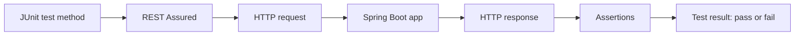

W obecnym repo najprostszy przykład to `StatusRestAssuredTest`. Test woła `GET /api/status`, a backend odpowiada prostym JSON-em z informacją, że aplikacja działa w fazie foundation.

## 6. Słowniczek pojęć

| Pojęcie | Proste znaczenie | Realny plik w repo |
|---|---|---|
| REST Assured | Biblioteka Java do wysyłania HTTP requestów i sprawdzania HTTP response w testach | `apps/backend/pom.xml`, dependency `io.rest-assured:rest-assured` |
| JUnit test method | Metoda testowa oznaczona `@Test` | `StatusRestAssuredTest#statusEndpointSupportsFoundationOnlyHttpSmokeCheck` |
| Testowy klient HTTP | Kod, który zachowuje się jak klient API | `given().port(port).when().get("/api/status")` |
| Spring Boot app | Uruchomiona aplikacja backendowa testowana przez HTTP | `@SpringBootTest(webEnvironment = RANDOM_PORT)` |
| Random port | Losowy port testowy, żeby test nie zakładał stałego `8080` | `@LocalServerPort private int port` |
| Static import | Import pozwalający pisać `given()` zamiast `RestAssured.given()` | `import static io.restassured.RestAssured.given;` |
| Method chaining | Łączenie wywołań metod po kropce | `.port(port).when().get(...).then()` |
| Fluent API | Styl kodu czytany prawie jak zdanie | `given -> when -> then` |
| Assertion | Sprawdzenie oczekiwanego wyniku | `.statusCode(200)`, `.body("status", equalTo("UP"))` |
| Oracle testowy | Źródło wiedzy, jaki wynik jest poprawny | Kontrakt `/api/status`: application, phase, status |
| API contract | Umowa, co endpoint przyjmuje i zwraca | `StatusController`, `MerchantController` |
| Smoke test | Szybki test, że podstawowy punkt systemu działa | `GET /api/status` |
| API contract test | Test chroniący status, body, headers albo error shape API | `MerchantRestAssuredTest` body assertions |
| UI test | Test przez przeglądarkę i interfejs użytkownika | Nie ten poziom w tej lekcji |
| Token/JWT | Dowód tożsamości lub uprawnień w requestach chronionych | `MerchantSecurityTest`, `TestJwtSupport` jako przyszły temat |

## 7. Minimalny przykład REST Assured

Minimalny przykład z tej lekcji:

```java
given()
        .port(port)
.when()
        .get("/api/status")
.then()
        .statusCode(200)
        .body("status", equalTo("UP"));
```

Ten przykład mówi:

- przygotuj testowy request na porcie uruchomionej aplikacji,
- wyślij `GET /api/status`,
- sprawdź, że backend odpowiedział `200 OK`,
- sprawdź, że w body JSON pole `status` ma wartość `UP`.

## 8. Wyjaśnienie przykładu linia po linii

`given()` zaczyna opis requestu. Na tym etapie myśl: „przygotowuję klienta HTTP”. W pliku `StatusRestAssuredTest.java` `given()` pochodzi ze static importu `import static io.restassured.RestAssured.given;`.

`.port(port)` mówi REST Assured, na który port ma wysłać request. Port pochodzi z `@LocalServerPort`, bo `@SpringBootTest(webEnvironment = RANDOM_PORT)` uruchamia aplikację na losowym porcie testowym.

`.when()` oznacza przejście z przygotowania requestu do wykonania akcji. W tej lekcji wystarczy zapamiętać: po `when` pojawia się metoda HTTP.

`.get("/api/status")` wysyła prawdziwy HTTP GET do backendu. To nie jest wywołanie metody kontrolera bezpośrednio. To request po HTTP do uruchomionej aplikacji.

`.then()` oznacza przejście do sprawdzania response. Request został już wysłany przez `.get(...)`.

`.statusCode(200)` sprawdza status HTTP. Sam `200` mówi, że endpoint odpowiedział sukcesem, ale jeszcze nie mówi, czy body ma sens.

`.body("status", equalTo("UP"))` sprawdza pole JSON w odpowiedzi. `equalTo` to matcher Hamcrest, czyli mały obiekt opisujący oczekiwanie: „wartość ma być równa `UP`”.

Kropka `.` przy kolejnych liniach to method chaining. Metody zwracają obiekt, na którym można wywołać następną metodę. Dzięki temu test czyta się od góry do dołu.

## 9. Bardziej profesjonalny przykład z obecnego repo

Realny test w `apps/backend/src/test/java/lab/paymentquality/rest/StatusRestAssuredTest.java`:

```java
@Test
void statusEndpointSupportsFoundationOnlyHttpSmokeCheck() {
    given()
            .port(port)
    .when()
            .get("/api/status")
    .then()
            .statusCode(200)
            .body("application", equalTo("payment-quality-lab"))
            .body("phase", equalTo("foundation"))
            .body("status", equalTo("UP"));
}
```

Dlaczego to jest bardziej profesjonalne niż samo `.statusCode(200)`:

- test ma nazwę opisującą intencję: status endpoint jest foundation-only HTTP smoke check,
- test wysyła request do prawdziwie uruchomionej aplikacji Spring Boot,
- test sprawdza body, czyli nie zadowala się samym faktem, że „coś odpowiedziało”,
- test zapisuje prosty kontrakt `/api/status`: `application`, `phase`, `status`,
- nie używa helpera, bo na tym poziomie czytelność podstawowego flow jest ważniejsza niż DRY.

Produkcyjny endpoint znajduje się w `apps/backend/src/main/java/lab/paymentquality/foundation/status/StatusController.java`:

```java
@RestController
@RequestMapping("/api/status")
class StatusController {

    @GetMapping
    StatusResponse status() {
        return new StatusResponse("payment-quality-lab", "foundation", "UP");
    }
}
```

Obserwacja z repo: użytkownik wskazał ścieżkę `apps/backend/src/main/java/lab/paymentquality/shared/web/StatusController.java`, ale w aktualnym repo kontroler istnieje pod `apps/backend/src/main/java/lab/paymentquality/foundation/status/StatusController.java`.

## 10. Jak ten temat pojawia się w obecnym kodzie testów

`StatusRestAssuredTest.java` pokazuje najprostszy REST Assured smoke/API contract test:

- `@SpringBootTest(webEnvironment = SpringBootTest.WebEnvironment.RANDOM_PORT)` uruchamia aplikację,
- `@LocalServerPort private int port` pobiera port aplikacji,
- `given().port(port)` kieruje REST Assured do tej aplikacji,
- `.get("/api/status")` wysyła request,
- `.statusCode(200)` i `.body(...)` są oracle testowym.

`MerchantRestAssuredTest.java` pokazuje późniejszy poziom:

- `operatorRequest(port)` ukrywa powtarzalne przygotowanie requestu z tokenem,
- `.contentType(ContentType.JSON)` ustawia JSON body przy `POST /api/merchants`,
- `.body(createMerchantBody(reference, "Flow Merchant"))` wysyła dane merchanta,
- `.extract().path("merchantId")` pobiera wartość z response do kolejnego requestu,
- testy sprawdzają `201`, `200`, `400`, `404`, `409` oraz pola body.

`MerchantApiTestSupport.java` pokazuje, kiedy helper ma sens:

```java
public static RequestSpecification publicRequest(int port) {
    return RestAssured.given().port(port);
}

public static RequestSpecification operatorRequest(int port) {
    return requestWithToken(port, TestJwtSupport.platformOperatorToken());
}
```

Na pierwszej lekcji nie zaczynamy od helperów, bo początkujący ma najpierw zobaczyć pełny request/response flow. Helpery są dobre później, gdy rozumiesz, co ukrywają.

`MerchantSecurityTest.java` jest tylko zapowiedzią przyszłych lekcji auth:

- `publicRequest(port)` bez tokena pokazuje request publiczny,
- `requestWithToken(port, token)` pokazuje request z tokenem,
- testy `401` i `403` będą osobnym tematem,
- `TestJwtSupport.java` generuje tokeny testowe, ale w tej lekcji nie wchodzimy głęboko w JWT ani Keycloak.

## 11. Jakie ryzyko testowe ten temat pomaga zrozumieć

REST Assured pomaga zobaczyć ryzyka na granicy HTTP API:

| Ryzyko | Jak REST Assured pomaga |
|---|---|
| Endpoint nie działa po uruchomieniu aplikacji | Smoke test `GET /api/status` wykrywa problem szybko |
| API zwraca dobry status, ale złe body | Body assertions wykrywają błędny kontrakt |
| UI ukrywa błąd backendu | Test API omija UI i uderza bezpośrednio w backend |
| Test sprawdza za mało | Porównanie `statusCode` vs `body` uczy lepszego oracle |
| Helper ukrywa zbyt dużo | Pierwszy test bez helperów pokazuje, co naprawdę jest wysyłane |
| Chroniony endpoint ma złą autoryzację | Przyszłe testy auth sprawdzą `401` i `403` przez HTTP |

Najważniejsze ryzyko tej lekcji: **zielony test z samym `statusCode(200)` może być słabym oracle, jeśli nie sprawdza sensu odpowiedzi.**

## 12. Jakie testy można z tego zaprojektować

Po tej lekcji umiesz zaprojektować proste testy na poziomie pomysłu:

| Test | Warstwa | Co sprawdza | Dane testowe |
|---|---|---|---|
| `GET /api/status` returns 200 | REST API smoke | Aplikacja odpowiada po HTTP | Brak danych biznesowych |
| `GET /api/status` returns expected body | REST API contract | `application`, `phase`, `status` | Brak danych biznesowych |
| `POST /api/merchants` returns 201 | REST API contract | Utworzenie merchanta | Unikalny `merchantReference` |
| `POST /api/merchants` duplicate returns 409 | Negative API test | Konflikt danych | Ten sam `merchantReference` dwa razy |
| Merchant endpoint without token returns 401 | Security API test | Brak uwierzytelnienia | Token absent/invalid, przyszła lekcja |

Na razie implementacyjnie studiujesz istniejące testy. Nie dodajesz nowych scenariuszy biznesowych.

## 13. Test design: smoke, contract, oracle, negative thinking preview

Smoke test odpowiada na pytanie: „Czy podstawowa ścieżka życia aplikacji działa?”. `GET /api/status` jest dobrym smoke testem, bo nie potrzebuje danych biznesowych i powinien być stabilny.

API contract test odpowiada na pytanie: „Czy API zwraca to, co obiecujemy klientom?”. Dla `/api/status` kontrakt to nie tylko `200`, ale też body z `application`, `phase`, `status`.

Oracle testowy odpowiada na pytanie: „Skąd wiem, że wynik jest poprawny?”. W tym repo oracle dla status endpointu pochodzi z kontraktu endpointu i z `StatusController`, który zwraca `payment-quality-lab`, `foundation`, `UP`.

Negative thinking preview oznacza: „Co jeśli request jest zły, danych brakuje, token jest nieważny albo stan jest niepoprawny?”. W tej lekcji tylko zapowiadasz ten sposób myślenia. Przykłady są już w `MerchantRestAssuredTest.java` i `MerchantSecurityTest.java`, ale szczegółowo wrócimy do nich w późniejszych lekcjach.

Diagram mentalny `given -> when -> then` jako zapowiedź następnej lekcji:

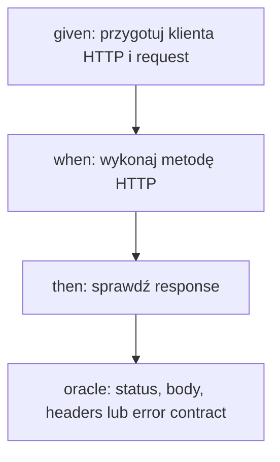

Na razie nie musisz znać wszystkich metod DSL. Wystarczy, że widzisz trzy role: przygotowanie, akcja, sprawdzenie.

## 14. Ćwiczenia praktyczne: zrozumienie, czytanie testu, projektowanie assertion, pytanie reviewera

Ćwiczenie 1 - zrozumienie:

Opisz własnymi słowami, czym REST Assured różni się od aplikacji Spring Boot.

Ćwiczenie 2 - czytanie testu:

Przeczytaj `StatusRestAssuredTest.java` i wypisz, która linia przygotowuje request, która wysyła request, a które linie sprawdzają response.

Ćwiczenie 3 - projektowanie assertion:

Wyobraź sobie, że test `/api/status` sprawdza tylko `.statusCode(200)`. Jaką jedną body assertion dodałbyś jako pierwszą i dlaczego?

Ćwiczenie 4 - różnica API vs UI:

Napisz jedno zdanie: kiedy wolisz REST Assured test API, a kiedy Playwright/UI test?

Ćwiczenie 5 - pytanie reviewera:

Jako reviewer widzisz nowy test REST Assured, który ma pięć helperów i tylko `statusCode(200)`. Jakie jedno pytanie zadasz autorowi?

## 15. Wskazówki do ćwiczeń

Wskazówka do ćwiczenia 1: REST Assured jest w `src/test`, a aplikacja Spring Boot jest w `src/main`. To pomaga zobaczyć granicę: narzędzie testowe kontra kod produkcyjny.

Wskazówka do ćwiczenia 2: Szukaj `given`, `when`, `get`, `then`, `statusCode`, `body`.

Wskazówka do ćwiczenia 3: Dobra pierwsza body assertion sprawdza pole, które mówi coś o sensie odpowiedzi, np. `status = UP`.

Wskazówka do ćwiczenia 4: API test jest dobry do kontraktu backendu. UI test jest dobry do zachowania widocznego dla użytkownika w przeglądarce.

Wskazówka do ćwiczenia 5: Pytaj o oracle: „Co ten test naprawdę gwarantuje poza tym, że endpoint zwrócił jakiś sukces?”.

## 16. Odpowiedzi / przykładowe rozwiązania

Odpowiedź 1:

REST Assured to biblioteka testowa, która wysyła HTTP requesty do aplikacji. Spring Boot app to system testowany, który odbiera request, wykonuje logikę i zwraca response.

Odpowiedź 2:

`given().port(port)` przygotowuje request. `.when().get("/api/status")` wysyła request. `.then().statusCode(200).body(...)` sprawdza response.

Odpowiedź 3:

Dodałbym `.body("status", equalTo("UP"))`, bo samo `200` nie mówi, czy endpoint statusu zwraca oczekiwany stan aplikacji.

Odpowiedź 4:

REST Assured wybieram, gdy chcę szybko i stabilnie sprawdzić kontrakt backend API; UI test wybieram, gdy chcę sprawdzić pełne doświadczenie użytkownika w przeglądarce.

Odpowiedź 5:

Zapytałbym: „Jaki kontrakt API chroni ten test i dlaczego sprawdzamy tylko status, a nie body albo error shape?”.

## 17. Typowe błędy początkujących

- Mylenie REST Assured z częścią aplikacji produkcyjnej.
- Myślenie, że `given()` wysyła request. Request wysyła metoda HTTP, np. `.get(...)` albo `.post(...)`.
- Sprawdzanie tylko `.statusCode(200)` bez sensownego body assertion.
- Pisanie helperów zanim wiadomo, co helper ukrywa.
- Mylenie testu API z testem UI.
- Zakładanie stałego portu `8080` zamiast użycia `@LocalServerPort` w teście z random port.
- Traktowanie tokenów jako magii zamiast osobnego tematu security test design.
- Kopiowanie składni bez pytania: „jaki oracle ma ten test?”.

## 18. Zasada jakości: KISS, readable assertions, no premature helpers

KISS w pierwszym teście REST Assured oznacza: pokaż request i oczekiwanie wprost. Nie zaczynaj od abstrakcji, jeśli uczysz się podstaw.

Readable assertions oznaczają: osoba czytająca test ma szybko zrozumieć, jaki kontrakt chronisz. W `StatusRestAssuredTest.java` dobrze widać, że chroniony jest status `UP`, nazwa aplikacji i faza `foundation`.

No premature helpers oznacza: helper ma sens wtedy, gdy usuwa powtarzalność bez ukrywania intencji testu. `MerchantApiTestSupport.operatorRequest(port)` jest dobry w późniejszych testach, bo requesty merchant wymagają tokena. W pierwszym smoke teście prosty `given().port(port)` jest bardziej edukacyjny.

## 19. Perspektywa Senior QA Automation/SDET

Senior SDET nie pyta tylko: „Czy test przechodzi?”. Pyta:

- jaki kontrakt API test chroni,
- czy test jest na właściwej warstwie,
- czy asercje są wystarczającym oracle,
- czy test jest stabilny przy równoległym uruchamianiu,
- czy helpery pomagają, czy ukrywają zachowanie,
- czy test pozwoli szybko zdiagnozować błąd,
- czy nie próbujemy testem API zastąpić wszystkiego, co powinno być testem domenowym, security albo UI.

W interview możesz powiedzieć:

**I use REST Assured as a programmable HTTP client in JUnit tests. It lets me verify backend API contracts directly, without relying on UI flows. I still choose assertions carefully, because a green status code alone is often a weak oracle.**

## 20. Pytania, które powinienem sobie zadać podczas pracy

- Czy REST Assured jest tutaj klientem testowym, a nie częścią backendu?
- Jaki endpoint testuję?
- Jaka metoda HTTP jest wysyłana?
- Czy aplikacja jest uruchomiona na random port i czy REST Assured zna ten port?
- Czy mój test sprawdza tylko status, czy też sens body?
- Jaki jest oracle testowy?
- Czy to powinien być test API, czy lepiej unit/domain/security/UI?
- Czy potrzebuję danych biznesowych, czy endpoint jest bezdany jak `/api/status`?
- Czy helper poprawia czytelność, czy ukrywa to, czego dopiero się uczę?
- Czy temat tokenów należy zostawić do osobnej lekcji auth?

## 21. Mini quiz kontrolny

1. Czy REST Assured jest częścią aplikacji produkcyjnej?
2. Co REST Assured zastępuje w teście backendowym?
3. Która metoda w przykładzie faktycznie wysyła request: `given()`, `.get(...)` czy `.then()`?
4. Po co w teście jest `.port(port)`?
5. Dlaczego samo `.statusCode(200)` może być słabym oracle?
6. Czym różni się test API od testu UI?
7. Który plik pokazuje najprostszy test `/api/status`?
8. Który plik pokazuje helpery dla requestów merchant?
9. Co jest następną lekcją po tej?

Odpowiedzi:

1. Nie. REST Assured jest biblioteką testową.
2. Klienta HTTP, np. Postmana, curl albo UI wysyłające request.
3. `.get(...)`.
4. Żeby REST Assured wysłał request do aplikacji uruchomionej na losowym porcie testowym.
5. Bo endpoint może zwrócić `200`, ale body może być błędne albo niezgodne z kontraktem.
6. Test API uderza bezpośrednio w backend HTTP API; test UI sprawdza zachowanie przez przeglądarkę.
7. `apps/backend/src/test/java/lab/paymentquality/rest/StatusRestAssuredTest.java`.
8. `apps/backend/src/test/java/lab/paymentquality/testsupport/MerchantApiTestSupport.java`.
9. `Lesson 2 - Anatomy of given(), when(), then()`.

## 22. Pytania rekrutacyjne po angielsku + przykładowe odpowiedzi

**Question:** What is REST Assured used for?<br>
**Answer:** REST Assured is used to write automated HTTP API tests in Java. It sends requests to a running application and validates responses using readable assertions.

**Question:** Is REST Assured part of the production application?<br>
**Answer:** No. REST Assured is a test library. The production application receives HTTP requests; REST Assured is only the test client that sends them.

**Question:** Why would you test an API directly instead of using the UI?<br>
**Answer:** Direct API tests are faster, more focused and better for verifying backend contracts. UI tests are still useful, but they include browser, frontend and user-flow risks.

**Question:** Why is checking only status code sometimes not enough?<br>
**Answer:** A status code tells me whether the request succeeded technically, but it may not prove that the response body matches the business or API contract. I usually add body assertions for meaningful fields.

**Question:** What does `given / when / then` mean in REST Assured?<br>
**Answer:** At a high level, `given` prepares the request, `when` performs the HTTP action, and `then` validates the response. The detailed syntax is the next lesson.

## 23. Powiązane pliki w repo

- `apps/backend/pom.xml` - dependency `io.rest-assured:rest-assured` w scope `test`; obecnie wersja z property `rest-assured.version` to `6.0.0`.
- `apps/backend/src/test/java/lab/paymentquality/rest/StatusRestAssuredTest.java` - najprostszy REST Assured test dla `GET /api/status`.
- `apps/backend/src/main/java/lab/paymentquality/foundation/status/StatusController.java` - produkcyjny endpoint `/api/status`; aktualna lokalizacja w repo.
- `apps/backend/src/test/java/lab/paymentquality/rest/MerchantRestAssuredTest.java` - bardziej rozbudowane API tests dla Merchant Registry.
- `apps/backend/src/main/java/lab/paymentquality/merchant/internal/web/MerchantController.java` - realny REST controller dla merchant API testowanego później.
- `apps/backend/src/test/java/lab/paymentquality/security/MerchantSecurityTest.java` - zapowiedź testów `401`, `403` i tokenów.
- `apps/backend/src/test/java/lab/paymentquality/testsupport/MerchantApiTestSupport.java` - helpery requestów i danych testowych dla merchant API.
- `apps/backend/src/test/java/lab/paymentquality/testsupport/TestJwtSupport.java` - testowe tokeny JWT jako przyszły temat security testingu.

## 24. Powiązane notatki w vault

- `knowledge-vault/01 Projects/Payment_Quality_Engineering_Lab/Payment Gateway SDET Learning Plan.md` - roadmapa; ta lekcja odpowiada sekcji `Lekcja 4. REST Assured Od Absolutnego Zera`.
- `knowledge-vault/02 Areas/Technical Learning/REST API From Zero/README.md` - indeks poprzedniej ścieżki.
- `knowledge-vault/02 Areas/Technical Learning/REST API From Zero/Merchant Request and Response Flow.md` - bezpośrednia poprzednia lekcja.
- `knowledge-vault/02 Areas/Technical Learning/JUnit REST Assured/README.md` - MOC obszaru JUnit REST Assured.
- `knowledge-vault/02 Areas/Technical Learning/JUnit REST Assured/REST Assured from Zero to Professional Backend API Testing/README.md` - mapa całej ścieżki REST Assured.
- `knowledge-vault/02 Areas/Technical Learning/Backend Testing Review/README.md` - późniejsza perspektywa reviewera backend API tests.

## 25. Co przerobić następnie

Następna lekcja to `Lesson 2 - Anatomia Pierwszego Testu / Anatomy of given(), when(), then()` w tym samym pliku.

Cel następnego kroku:

- zrozumieć dokładniej, co robi `given()`,
- zobaczyć, kiedy request naprawdę jest wysyłany,
- odróżnić przygotowanie requestu od wykonania HTTP method,
- czytać fluent API bez poczucia, że to magia.

Nie przechodź jeszcze do helperów, tokenów i extraction, jeśli nie umiesz własnymi słowami opisać prostego `GET /api/status`.

## 26. Zapamiętaj

REST Assured to testowy klient HTTP dla Javy. W teście JUnit wysyła request do uruchomionej aplikacji Spring Boot i pozwala sprawdzić response.

Najpierw rozumiesz flow:

```text
JUnit test -> REST Assured -> HTTP request -> Spring Boot app -> HTTP response -> assertions -> test result
```

Dopiero potem uczysz się pełnej składni `given()`, `.when()`, `.then()`, helperów, tokenów, request body i extraction.

Najważniejsza zasada SDET z tej lekcji: **test API ma mieć czytelny oracle, a REST Assured jest narzędziem do sprawdzania kontraktu backendu, nie magiczną częścią aplikacji.**

---

# Lesson 2 - Anatomia Pierwszego Testu / Anatomy of `given()`, `when()`, `then()`

## 1. Tytuł PL + EN

PL: Anatomia pierwszego testu: `given()`, `when()`, `then()`  
EN: Anatomy of the first test: `given()`, `when()`, `then()`

## 2. Po Co Testerowi Ta Wiedza

To jest podstawowa składnia REST Assured. Bez jej zrozumienia helpery i specyfikacje będą wyglądały jak magia.

## 3. Intuicyjne Wyjaśnienie Od Zera

- `given` = co przygotowuję?
- `when` = jaką akcję wykonuję?
- `then` = czego oczekuję?

To odpowiada Arrange / Act / Assert.

## 4. Słowniczek Pojęć

| Pojęcie | Znaczenie |
|---|---|
| Fluent API | styl, w którym metody łączą się w czytelny łańcuch |
| Static import | import pozwalający pisać `given()` zamiast `RestAssured.given()` |
| Chain | łańcuch kolejnych wywołań po kropce |

## 5. Minimalny Przykład

```java
given()
.when()
    .get("/status")
.then()
    .statusCode(200);
```

## 6. Wyjaśnienie Kodu Linia Po Linii

- `given()` tworzy startową specyfikację requestu.
- Pusta sekcja `given()` oznacza: nie ustawiam żadnych dodatkowych parametrów.
- `.when()` zwraca obiekt pozwalający wykonać metodę HTTP.
- `.get("/status")` wykonuje request GET.
- `.then()` zwraca obiekt do walidacji response.
- `.statusCode(200)` przyjmuje oczekiwany kod jako parametr typu `int`.
- Kropka działa, bo poprzednia metoda zwraca kolejny obiekt DSL.

## 7. Bardziej Profesjonalny Przykład

```java
given()
    .port(port)
    .accept(ContentType.JSON)
.when()
    .get("/api/status")
.then()
    .statusCode(200)
    .contentType(ContentType.JSON);
```

## 8. Typowe Błędy Początkujących

- Czytanie DSL od środka zamiast od góry do dołu.
- Mylenie `when()` z JUnit `when` z Mockito.
- Myślenie, że `.then()` wykonuje request. Request wykonuje metoda HTTP, np. `.get()`.

## 9. Jak Ten Temat Pojawia Się W Repo

`MerchantRestAssuredTest` używa układu:

```java
operatorRequest(port)
.when().get("/api/merchants")
.then().statusCode(200);
```

`operatorRequest(port)` jest przygotowanym `given()` z auth.

## 10. Zasada Jakości / Design Principle

Czytelność testu: test powinien dać się przeczytać jak zdanie: given request, when I call endpoint, then I expect response.

## 11. Perspektywa QA/SDET

Given/When/Then pomaga oddzielić setup, akcję i oracle testowy. To zmniejsza ryzyko testów, które robią wiele rzeczy naraz i są trudne w diagnozie.

## 12. Pytania

- Co przygotowuję?
- Kiedy request faktycznie jest wysyłany?
- Co jest asercją?

## 13. Mini Ćwiczenie

Przetłumacz na słowa:

```java
given().when().get("/api/status").then().statusCode(200);
```

## 14. Quiz

1. Czy `given()` wysyła request? Nie.
2. Który fragment wysyła request? `.get(...)`, `.post(...)` itd.
3. Co robi `.then()`? Otwiera walidację response.

## 15. Interview EN

**Question:** How does REST Assured's given/when/then structure relate to Arrange/Act/Assert?  
**Answer:** `given` prepares the request, `when` performs the HTTP action, and `then` verifies the response, which maps naturally to Arrange, Act and Assert.

## 16. Zapamiętaj

`given/when/then` to nie ozdoba. To struktura myślenia testera.

---

# Lesson 3 - Budowa Requestu / HTTP Method, Endpoint, Content-Type and Accept

## 1. Tytuł PL + EN

PL: Budowa requestu: metoda HTTP, endpoint, `Content-Type`, `Accept`, body i expected status.<br>
EN: Building a request: HTTP method, endpoint, `Content-Type`, `Accept`, body and expected status.

Ta lekcja uczy, jak request HTTP wyraża intencję testu. Nie dodajemy żadnej nowej funkcjonalności. Czytamy istniejące testy i kontrolery: `GET /api/status`, `GET /api/merchants` oraz `POST /api/merchants`.

Najważniejsze zdanie: **dobry test API pokazuje wprost, co klient chce zrobić: jaką metodą, pod jaką ścieżkę, z jakimi headerami, z jakim body i jakiego statusu odpowiedzi oczekuje.**

## 2. Gdzie ta lekcja znajduje się w ścieżce nauki

Kolejność w tej części REST Assured:

1. `Lesson 1 - What REST Assured Is` - REST Assured jako testowy klient HTTP.
2. `Lesson 2 - Anatomy of given(), when(), then()` - podział na przygotowanie, akcję i asercje.
3. Ta lekcja - request intent: metoda, endpoint, `Content-Type`, `Accept`, body i expected status.
4. `Lesson 4 - Path Params, Query Params and Headers` - kolejne kanały wejścia, np. `/api/merchants/{id}` i nagłówki.
5. `Lesson 5 - Request Body, JSON, Map.of, DTO and Serialization` - głębsza praca z body.

To nadal jest lekcja dydaktyczna oparta na istniejącym kodzie. Nie jest to sprint implementacyjny i nie tworzymy `Payment Order`.

## 3. Po co testerowi/SDET ta wiedza

Tester API może dostać czerwony test z dwóch zupełnie różnych powodów:

1. Aplikacja ma defekt.
2. Test wysłał źle zbudowany request.

Ta lekcja pomaga odróżnić te sytuacje. Jeśli test wysyła `POST` tam, gdzie kontrakt mówi `GET`, albo wysyła JSON body bez `Content-Type: application/json`, to test może paść mimo tego, że aplikacja działa poprawnie.

SDET musi umieć przeczytać request jak zdanie:

```text
POST /api/merchants with JSON body -> I want to create a merchant -> I expect 201 Created
GET /api/status without body -> I want to read status -> I expect 200 OK
```

Interview story z tej lekcji:

> I design API tests by making the request intent explicit: method, path, headers, body and expected response.

## 4. Co już powinienem wiedzieć przed tą lekcją

Wystarczy wiedza z poprzednich lekcji:

- REST Assured jest klientem HTTP w teście JUnit.
- `given()` przygotowuje request.
- `.when()` prowadzi do wykonania metody HTTP.
- `.then()` sprawdza response.
- Request to wiadomość do backendu.
- Response to odpowiedź backendu.
- Status code mówi, czy request zakończył się sukcesem albo błędem.

Nie musisz jeszcze znać HTTP methods, `Content-Type`, `Accept`, Spring `@GetMapping`, `@PostMapping`, `@RequestBody`, `ResponseEntity`, `Map.of` ani `ContentType.JSON`. Wszystkie te pojęcia są wyjaśnione od podstaw i przypięte do plików repo.

## Sprint Learning Matrix

| Sekcja | Odpowiedź |
|---|---|
| Business capability | Brak nowej funkcji; uczymy się, jak request opisuje intencję klienta API |
| Previous knowledge refresh | REST Assured jako klient HTTP oraz `given/when/then` |
| New learning focus | HTTP method, endpoint, `Content-Type`, `Accept`, body |
| Java 25 focus | `Map.of`, static import, enum/stała `ContentType.JSON`, method chaining |
| Spring focus | `@GetMapping`, `@PostMapping`, `@RequestBody`, `ResponseEntity.status(CREATED)` |
| SQL/PostgreSQL focus | Brak głębokiego SQL; merchant create/list korzysta z DB, ale lekcja skupia się na request contract |
| REST Assured focus | `.contentType(ContentType.JSON)`, `.body(...)`, `.post(...)`, `.get(...)`, opcjonalnie `.accept(...)` |
| Security/Keycloak focus | Tylko kontekst: merchant endpoints używają `operatorRequest(port)` z tokenem; auth będzie osobną lekcją |
| Test design focus | Czy metoda, endpoint, body i status pasują do intencji API |
| Test data focus | Unikalny `merchantReference` dla POST; brak danych biznesowych dla GET status |
| Test layers | REST API contract test, nie UI test |
| Vault output | Rozbudowana Lesson 3 w istniejącym lesson-packu |
| Interview story | I design API tests by making the request intent explicit: method, path, headers, body and expected response |

## 5. Intuicyjne wyjaśnienie od zera

Wyobraź sobie, że request HTTP jest formularzem wysyłanym do recepcji backendu.

Metoda HTTP mówi, co chcesz zrobić:

| Metoda | Prosta intuicja | Przykład z repo |
|---|---|---|
| `GET` | Chcę coś odczytać | `GET /api/status`, `GET /api/merchants` |
| `POST` | Chcę coś utworzyć albo uruchomić akcję | `POST /api/merchants`, `POST /api/merchants/{id}/activate` |
| `PUT` / `PATCH` | Chcę zmienić istniejące dane | Nie jest głównym tematem tej lekcji |
| `DELETE` | Chcę coś usunąć | Nie jest używane w przykładach tej lekcji |

Endpoint mówi, z czym pracujesz. W praktyce endpoint to metoda HTTP plus ścieżka, np. `GET /api/status` albo `POST /api/merchants`. Sama ścieżka `/api/merchants` nie mówi jeszcze wszystkiego, bo `GET /api/merchants` i `POST /api/merchants` mają różne znaczenie.

`Content-Type` mówi backendowi: „format danych, które wysyłam w body, to JSON”. Jeśli wysyłasz body jako JSON, ustawiasz `Content-Type: application/json`, w REST Assured przez `.contentType(ContentType.JSON)`.

`Accept` mówi backendowi: „najchętniej chcę dostać odpowiedź w JSON”. To dotyczy response, nie request body. W REST Assured można to pokazać przez `.accept(ContentType.JSON)`.

Body requestu to dane wysyłane do backendu. `POST /api/merchants` potrzebuje body, bo backend musi wiedzieć, jakiego merchanta utworzyć: `merchantReference` i `displayName`. `GET /api/status` zwykle nie ma body, bo niczego nie tworzy i nie przekazuje formularza danych. Chce tylko odczytać aktualny status.

Expected status to oczekiwany kod odpowiedzi. Dla create flow `201 Created` jest precyzyjny, bo powstał nowy zasób. Dla read/status flow `200 OK` jest naturalny, bo backend poprawnie zwrócił istniejącą informację.

## 6. Słowniczek pojęć

| Pojęcie | Proste znaczenie | Realny plik w repo |
|---|---|---|
| HTTP method | Czasownik requestu: odczytaj, utwórz, zmień, usuń | `.get(...)`, `.post(...)` w `MerchantRestAssuredTest.java` |
| `GET` | Odczyt danych bez tworzenia nowego zasobu | `StatusRestAssuredTest#statusEndpointSupportsFoundationOnlyHttpSmokeCheck` |
| `POST` | Utworzenie zasobu albo wykonanie akcji | `MerchantRestAssuredTest#createMerchant` helper |
| Endpoint | Metoda plus ścieżka API, np. `POST /api/merchants` | `MerchantController`, `StatusController` |
| Path | Sama ścieżka URL, np. `/api/status` | `.get("/api/status")` |
| Header | Metadane requestu, np. format albo auth | `Content-Type`, `Accept`, `Authorization` |
| `Content-Type` | Format body, które klient wysyła | `.contentType(ContentType.JSON)` |
| `Accept` | Format response, który klient preferuje | `.accept(ContentType.JSON)` w przykładzie dydaktycznym |
| Body | Dane wysyłane w requestcie | `.body(createMerchantBody(...))` |
| JSON | Tekstowy format danych: pola i wartości | `merchantReference`, `displayName` |
| `ContentType.JSON` | Stała/enum REST Assured reprezentująca `application/json` | import `io.restassured.http.ContentType` |
| `Map.of` | Prosty sposób zbudowania małego payloadu klucz-wartość | przykład minimalny w tej lekcji |
| Static import | Import pozwalający pisać `given()` bez `RestAssured.given()` | `StatusRestAssuredTest.java` |
| Method chaining | Łączenie wywołań po kropce | `.contentType(...).body(...).when().post(...)` |
| `@GetMapping` | Spring mapping dla HTTP GET | `StatusController`, `MerchantController#list` |
| `@PostMapping` | Spring mapping dla HTTP POST | `MerchantController#create` |
| `@RequestBody` | Spring czyta JSON body i tworzy obiekt Java | `MerchantController#create` |
| `ResponseEntity` | Spring obiekt odpowiedzi: status plus body | `ResponseEntity.status(HttpStatus.CREATED).body(response)` |
| Oracle testowy | Źródło wiedzy, jaki wynik jest poprawny | expected status i body assertions w REST Assured |

## 7. Minimalny przykład REST Assured

Minimalny przykład create requestu:

```java
given()
        .contentType(ContentType.JSON)
        .accept(ContentType.JSON)
        .body(Map.of(
                "merchantReference", "MERCH-ABC-123",
                "displayName", "Example Merchant"))
.when()
        .post("/api/merchants")
.then()
        .statusCode(201);
```

Ten przykład mówi:

- przygotuj request,
- powiedz backendowi, że wysyłasz JSON,
- powiedz backendowi, że chcesz odpowiedź JSON,
- wyślij body z danymi merchanta,
- wykonaj `POST /api/merchants`,
- oczekuj `201 Created`.

W realnym repo endpoint merchant jest chroniony, więc produkcyjny test używa `operatorRequest(port)` zamiast gołego `given()`. W tej lekcji `operatorRequest(port)` traktujemy tylko jako helper, który przygotowuje request z autoryzacją. Nie robimy tu lekcji o JWT.

## 8. Wyjaśnienie przykładu linia po linii

`given()` zaczyna przygotowanie requestu. To jeszcze niczego nie wysyła. W poprzedniej lekcji uczyłeś się, że `given` odpowiada mniej więcej części Arrange.

`.contentType(ContentType.JSON)` ustawia header `Content-Type: application/json`. To mówi backendowi: body, które wysyłam, jest JSON-em. Jest to ważne przy `POST /api/merchants`, bo backend musi zamienić JSON na `CreateMerchantRequest`.

`.accept(ContentType.JSON)` ustawia header `Accept: application/json`. To mówi: klient preferuje odpowiedź w JSON. W wielu prostych testach Spring i tak zwróci JSON, ale jawne `Accept` może poprawić czytelność intencji requestu.

`.body(Map.of(...))` ustawia body requestu. `Map.of` w Javie tworzy małą niemutowalną mapę klucz-wartość. REST Assured może zserializować taką mapę do JSON, czyli zamienić obiekt Java na tekst JSON.

`"merchantReference"` i `"displayName"` to nazwy pól, których oczekuje API create merchant. W kodzie produkcyjnym odpowiada im `CreateMerchantRequest`.

`.when()` przechodzi do wykonania akcji. Request nadal nie jest wysłany, dopóki nie pojawi się metoda HTTP.

`.post("/api/merchants")` wysyła HTTP POST pod ścieżkę `/api/merchants`. To właśnie ten fragment uruchamia request.

`.then()` przechodzi do walidacji response.

`.statusCode(201)` jest oracle dla statusu: jeśli tworzymy nowy zasób, oczekujemy `201 Created`.

## 9. Bardziej profesjonalny przykład z obecnego repo

Realny helper w `apps/backend/src/test/java/lab/paymentquality/rest/MerchantRestAssuredTest.java`:

```java
private Response createMerchant(String reference, String displayName) {
    return operatorRequest(port)
            .contentType(ContentType.JSON)
            .body(createMerchantBody(reference, displayName))
    .when().post("/api/merchants");
}
```

Co ten kod mówi jako request intent:

- `operatorRequest(port)` przygotowuje request do uruchomionej aplikacji i dodaje testową autoryzację operatora,
- `.contentType(ContentType.JSON)` mówi, że body jest JSON-em,
- `.body(createMerchantBody(reference, displayName))` wysyła dane potrzebne do utworzenia merchanta,
- `.post("/api/merchants")` wybiera metodę i endpoint create flow.

Fragment testu `createReadListActivateAndSuspendMerchant`:

```java
String reference = uniqueMerchantReference("FLOW");

String id = createMerchant(reference, "Flow Merchant")
        .then()
        .statusCode(201)
        .body("merchantReference", equalTo(reference))
        .body("displayName", equalTo("Flow Merchant"))
        .body("status", equalTo("DRAFT"))
        .extract().path("merchantId");

operatorRequest(port)
.when().get("/api/merchants/{id}", id)
.then()
        .statusCode(200)
        .body("merchantId", equalTo(id))
        .body("status", equalTo("DRAFT"));

operatorRequest(port)
.when().get("/api/merchants")
.then()
        .statusCode(200)
        .body("merchants.merchantReference", hasItem(reference));
```

W tym fragmencie widzisz trzy różne intencje:

| Request | Intencja | Body? | Expected status |
|---|---|---:|---:|
| `POST /api/merchants` | Utwórz merchanta | Tak | `201` |
| `GET /api/merchants/{id}` | Odczytaj jednego merchanta | Nie | `200` |
| `GET /api/merchants` | Odczytaj listę merchantów | Nie | `200` |

## 10. Jak ten temat pojawia się w obecnym kodzie testów

`StatusRestAssuredTest.java` pokazuje najprostszy read/status flow:

```java
given()
        .port(port)
.when()
        .get("/api/status")
.then()
        .statusCode(200)
        .body("application", equalTo("payment-quality-lab"))
        .body("phase", equalTo("foundation"))
        .body("status", equalTo("UP"));
```

Ten test nie potrzebuje body, bo `GET /api/status` tylko odczytuje status aplikacji.

`MerchantRestAssuredTest#createMerchant` pokazuje create flow:

```java
operatorRequest(port)
        .contentType(ContentType.JSON)
        .body(createMerchantBody(reference, displayName))
.when().post("/api/merchants");
```

Ten request potrzebuje body, bo backend nie zgadnie `merchantReference` i `displayName`.

`MerchantRestAssuredTest#createReadListActivateAndSuspendMerchant` pokazuje zestaw metod i endpointów:

| Fragment testu | Metoda i endpoint | Sens |
|---|---|---|
| `createMerchant(...)` | `POST /api/merchants` | Create merchant |
| `.get("/api/merchants/{id}", id)` | `GET /api/merchants/{id}` | Read one merchant |
| `.get("/api/merchants")` | `GET /api/merchants` | List merchants |
| `.post("/api/merchants/{id}/activate", id)` | `POST /api/merchants/{id}/activate` | Uruchom akcję aktywacji |
| `.post("/api/merchants/{id}/suspend", id)` | `POST /api/merchants/{id}/suspend` | Uruchom akcję zawieszenia |

`MerchantApiTestSupport#createMerchantBody` buduje body:

```java
public static Map<String, Object> createMerchantBody(String reference, String displayName) {
    Map<String, Object> body = new LinkedHashMap<>();
    body.put("merchantReference", reference);
    body.put("displayName", displayName);
    return Map.copyOf(body);
}
```

To jest przykład czytelnego helpera danych testowych: dwa pola body są nazwane tak samo jak kontrakt API.

`operatorRequest(port)` z `MerchantApiTestSupport` przygotowuje request z tokenem testowym:

```java
public static RequestSpecification operatorRequest(int port) {
    return requestWithToken(port, TestJwtSupport.platformOperatorToken());
}
```

Na potrzeby tej lekcji wystarczy wiedzieć: merchant endpoints wymagają autoryzowanego operatora, a helper ukrywa techniczny szczegół tokena. Szczegóły JWT, `401` i `403` będą osobną lekcją.

## 11. Jakie ryzyko testowe ten temat pomaga zrozumieć

| Ryzyko | Przykład | Dlaczego to ważne |
|---|---|---|
| Zła metoda HTTP | Test używa `POST /api/status` zamiast `GET /api/status` | Test nie sprawdza właściwego kontraktu |
| Zły endpoint/path | Literówka w `/api/merchants` | Czerwony test może oznaczać błąd testu, nie aplikacji |
| Brak `Content-Type` przy body | JSON body bez `application/json` | Spring może nie związać body zgodnie z oczekiwaniem |
| Mylenie `Content-Type` z `Accept` | Tester ustawia `Accept`, ale zapomina `Content-Type` | Backend wie, co klient chce dostać, ale nie wie jasno, co klient wysyła |
| Body przy flow, który go nie potrzebuje | GET status z body | Request staje się mylący i nieczytelny |
| Brak body przy create | POST merchant bez `merchantReference` | Test nie reprezentuje poprawnej intencji create flow |
| Zły expected status | Create oczekuje `200` zamiast `201` | Test osłabia kontrakt API |
| Słaby oracle | Test sprawdza tylko status | Może nie wykryć złego body odpowiedzi |

Najważniejsze ryzyko: **źle zbudowany request może dać czerwony test mimo braku defektu aplikacji.** Dlatego metoda HTTP i path są częścią API contract, a nie detalem składni.

## 12. Jakie testy można z tego zaprojektować

Po tej lekcji umiesz zaprojektować testy przez request intent:

| Test idea | Method | Endpoint | Body | Expected status | Warstwa |
|---|---|---|---|---:|---|
| Status endpoint returns app status | `GET` | `/api/status` | Nie | `200` | REST API smoke/contract |
| Merchant list returns collection | `GET` | `/api/merchants` | Nie | `200` | REST API contract |
| Create merchant creates draft merchant | `POST` | `/api/merchants` | Tak | `201` | REST API contract |
| Create merchant without valid body fails | `POST` | `/api/merchants` | Tak, invalid | `400` | REST API validation |
| Duplicate merchant reference fails | `POST` | `/api/merchants` | Tak, duplicate | `409` | REST API/business conflict |

Nie projektujemy tu nowej funkcji. Uczymy się, jak opisać istniejące zachowania przez metodę, endpoint, headers, body i expected status.

## 13. Test design: method, endpoint, headers, body, expected status, oracle

Przed napisaniem testu REST Assured wypełnij małą tabelę:

| Element | Pytanie projektowe | Przykład |
|---|---|---|
| Method | Co klient chce zrobić? | `GET` dla odczytu, `POST` dla create |
| Endpoint/path | Z jakim zasobem lub akcją klient pracuje? | `/api/status`, `/api/merchants` |
| Headers | Jakie metadane są potrzebne? | `Content-Type`, `Accept`, auth przez helper |
| Body | Czy klient wysyła dane? | body dla `POST /api/merchants`, brak body dla `GET /api/status` |
| Expected status | Jaki wynik HTTP pasuje do intencji? | `201` dla create, `200` dla read |
| Oracle | Skąd wiem, że wynik jest poprawny? | status plus body assertions |

Oracle nie powinien kończyć się na statusie, jeśli response body ma znaczenie. Dla `GET /api/status` oracle to `200` plus `application`, `phase`, `status`. Dla `POST /api/merchants` oracle to `201` plus `merchantReference`, `displayName`, `status = DRAFT` i obecność `merchantId` w późniejszych lekcjach.

Diagram request intent:

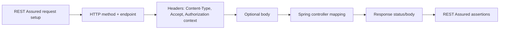

Porównanie trzech requestów:

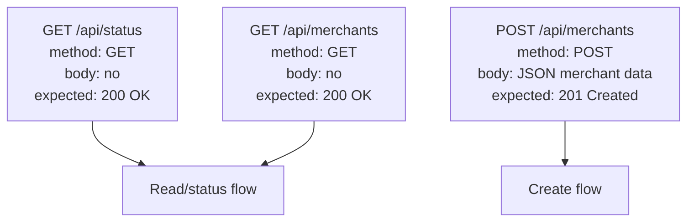

## 14. Ćwiczenia praktyczne: rozpoznawanie metody, endpointu, Content-Type, Accept, body i statusu

Ćwiczenie 1 - rozpoznaj request intent:

Przeczytaj `StatusRestAssuredTest.java` i zapisz: metoda, endpoint, body, expected status, oracle body.

Ćwiczenie 2 - rozpoznaj create flow:

Przeczytaj helper `createMerchant` w `MerchantRestAssuredTest.java` i zapisz: metoda, endpoint, `Content-Type`, body builder, expected status w teście wywołującym helper.

Ćwiczenie 3 - `Content-Type` vs `Accept`:

Wyjaśnij jednym zdaniem, dlaczego `POST /api/merchants` potrzebuje `Content-Type`, a `GET /api/status` zwykle nie potrzebuje body.

Ćwiczenie 4 - dopasuj status:

Dopasuj expected status do intencji: `GET /api/status`, `GET /api/merchants`, `POST /api/merchants`.

Ćwiczenie 5 - zaprojektuj test bez kodowania:

Wypełnij tabelę dla testu „create merchant returns draft merchant”: method, endpoint, headers, body, expected status, oracle.

Ćwiczenie 6 - pytanie reviewera:

Jako reviewer widzisz test `POST /api/merchants`, który ma body, ale nie ma `.contentType(ContentType.JSON)`. Jakie ryzyko zgłaszasz?

## 15. Wskazówki do ćwiczeń

Wskazówka do ćwiczenia 1: Szukaj `.get("/api/status")`, `.statusCode(200)` i `.body(...)`.

Wskazówka do ćwiczenia 2: `createMerchant` zwraca `Response`, więc expected status jest w miejscu, gdzie helper jest wywołany i dalej następuje `.then().statusCode(201)`.

Wskazówka do ćwiczenia 3: `Content-Type` opisuje to, co wysyłasz. `Accept` opisuje to, co chcesz dostać.

Wskazówka do ćwiczenia 4: Odczyt zwykle kończy się `200 OK`; utworzenie nowego zasobu zwykle kończy się `201 Created`.

Wskazówka do ćwiczenia 5: Oracle to nie tylko status. Dopisz pola body, które potwierdzają sens odpowiedzi.

Wskazówka do ćwiczenia 6: Pytaj, czy czerwony test będzie diagnozował defekt aplikacji, czy źle opisany format body.

## 16. Odpowiedzi / przykładowe rozwiązania

Odpowiedź 1:

| Element | Odpowiedź |
|---|---|
| Method | `GET` |
| Endpoint | `/api/status` |
| Body | Brak |
| Expected status | `200` |
| Oracle body | `application = payment-quality-lab`, `phase = foundation`, `status = UP` |

Odpowiedź 2:

| Element | Odpowiedź |
|---|---|
| Method | `POST` |
| Endpoint | `/api/merchants` |
| `Content-Type` | `ContentType.JSON` |
| Body builder | `createMerchantBody(reference, displayName)` |
| Expected status | `201` w testach happy path |

Odpowiedź 3:

`POST /api/merchants` potrzebuje `Content-Type`, bo wysyła JSON body z danymi merchanta. `GET /api/status` zwykle nie ma body, bo tylko odczytuje status i nie musi przekazywać formularza danych.

Odpowiedź 4:

| Request | Expected status | Dlaczego |
|---|---:|---|
| `GET /api/status` | `200` | Odczyt statusu zakończony sukcesem |
| `GET /api/merchants` | `200` | Odczyt listy zakończony sukcesem |
| `POST /api/merchants` | `201` | Utworzono nowego merchanta |

Odpowiedź 5:

| Element | Przykładowa decyzja |
|---|---|
| Method | `POST` |
| Endpoint | `/api/merchants` |
| Headers | `Content-Type: application/json`; auth przez `operatorRequest(port)`; opcjonalnie `Accept: application/json` |
| Body | `merchantReference`, `displayName` |
| Expected status | `201 Created` |
| Oracle | response zawiera ten sam `merchantReference`, `displayName`, `status = DRAFT`, niepuste `merchantId` |

Odpowiedź 6:

Zgłaszam ryzyko, że test wysyła body bez jasnego formatu. Jeśli test padnie, diagnoza może być myląca: problem może leżeć w request setup, a nie w logice create merchant.

## 17. Typowe błędy początkujących

- Myślenie, że endpoint to tylko URL. Endpoint w test design to metoda plus path, np. `GET /api/status`.
- Używanie `POST` do odczytu, bo „działa”, mimo że kontrakt mówi `GET`.
- Oczekiwanie `200` dla create flow, gdy kontrakt powinien jasno mówić `201 Created`.
- Wysyłanie JSON body bez `.contentType(ContentType.JSON)`.
- Mylenie `Content-Type` z `Accept`.
- Dodawanie body do `GET`, choć request niczego nie tworzy ani nie przekazuje danych wejściowych.
- Brak body przy `POST /api/merchants`, mimo że create flow potrzebuje `merchantReference` i `displayName`.
- Ukrywanie zbyt dużo w helperach zanim rozumiesz, jaki request naprawdę jest wysyłany.
- Patrzenie tylko na czerwony test bez sprawdzenia, czy sam request jest zgodny z kontraktem.
- Sprawdzanie tylko `.statusCode(...)` bez zastanowienia się nad oracle body.

## 18. Zasada jakości: explicit request intent, no misleading method, readable request setup

Explicit request intent oznacza: test ma jasno pokazywać, co klient API próbuje zrobić. Czytelnik powinien szybko zobaczyć metodę, endpoint, format body i oczekiwany status.

No misleading method oznacza: nie używaj metody HTTP niezgodnej z intencją. `GET` jest do odczytu. `POST /api/merchants` jest do tworzenia merchanta. Metoda HTTP jest częścią API contract.

Readable request setup oznacza: helpery są dobre, jeśli nie ukrywają sensu testu. `operatorRequest(port)` jest akceptowalny w merchant tests, bo merchant endpoints są chronione i helper usuwa powtarzalny auth setup. Ale nadal request powinien pokazywać `.contentType(ContentType.JSON)`, `.body(...)` i `.post(...)` tam, gdzie to jest istotne dla intencji testu.

## 19. Perspektywa Senior QA Automation/SDET

Senior SDET czyta test API od pytania: „Jaką umowę klient zawiera z backendem?”.

W tej lekcji ta umowa ma sześć elementów:

| Element | Senior SDET pyta |
|---|---|
| Method | Czy metoda pasuje do intencji biznesowej/API? |
| Path | Czy trafiamy we właściwy zasób albo akcję? |
| Headers | Czy format i wymagane metadane są jawne? |
| Body | Czy body jest potrzebne, poprawnie zbudowane i czytelne? |
| Expected status | Czy status jest semantycznie poprawny, np. `201` dla create? |
| Oracle | Czy asercje sprawdzają zachowanie, a nie tylko techniczny sukces? |

Senior SDET nie zgaduje od razu, że aplikacja ma błąd. Najpierw sprawdza, czy test wysłał request zgodny z kontraktem. To zmniejsza false negatives i poprawia diagnozę regresji.

## 20. Pytania, które powinienem sobie zadać podczas pracy

- Jaką intencję ma klient API: odczyt, create, akcja statusowa?
- Czy metoda HTTP pasuje do tej intencji?
- Czy path jest dokładnie tym endpointem, który testuję?
- Czy metoda plus path tworzą właściwy kontrakt, np. `POST /api/merchants`, a nie tylko `/api/merchants`?
- Czy request powinien mieć body?
- Jeśli wysyłam body, czy ustawiłem `.contentType(ContentType.JSON)`?
- Czy potrzebuję jawnego `.accept(ContentType.JSON)` dla czytelności albo negocjacji odpowiedzi?
- Czy expected status pasuje do flow: `201` dla create, `200` dla read/status?
- Czy oracle sprawdza body, jeśli body jest częścią kontraktu odpowiedzi?
- Czy `operatorRequest(port)` jest tylko helperem auth i czy rozumiem, co ukrywa?
- Czy czerwony test może wynikać z błędnego request setup?
- Czy nie mieszam w tej lekcji tematów, które przyjdą później: path params, query params, headers, extraction, JWT?

## 21. Mini quiz kontrolny

1. Co oznacza metoda HTTP?
2. Dlaczego endpoint to więcej niż sama ścieżka URL?
3. Dlaczego `GET /api/status` zwykle nie ma body?
4. Dlaczego `POST /api/merchants` potrzebuje body?
5. Co oznacza `Content-Type`?
6. Co oznacza `Accept`?
7. Czym różni się `Content-Type` od `Accept`?
8. Dlaczego `201 Created` pasuje do create flow?
9. Dlaczego `200 OK` pasuje do read/status flow?
10. Dlaczego źle zbudowany request może dać czerwony test mimo braku błędu aplikacji?
11. Który plik pokazuje prosty `GET /api/status`?
12. Który plik pokazuje `POST /api/merchants` z `.contentType(ContentType.JSON)` i `.body(...)`?

Odpowiedzi:

1. Metoda HTTP mówi, jaką akcję klient chce wykonać, np. odczyt przez `GET` albo create przez `POST`.
2. Bo `GET /api/merchants` i `POST /api/merchants` mają tę samą ścieżkę, ale inną intencję i kontrakt.
3. Bo odczytuje status i nie musi wysyłać danych wejściowych.
4. Bo backend potrzebuje danych merchanta: `merchantReference` i `displayName`.
5. Format body wysyłanego przez klienta.
6. Preferowany format odpowiedzi.
7. `Content-Type` opisuje request body; `Accept` opisuje response, który klient chce dostać.
8. Bo powstał nowy zasób.
9. Bo odczyt zakończył się sukcesem i backend zwrócił odpowiedź.
10. Bo problem może leżeć w metodzie, path, headerach albo body testu, a nie w logice aplikacji.
11. `apps/backend/src/test/java/lab/paymentquality/rest/StatusRestAssuredTest.java`.
12. `apps/backend/src/test/java/lab/paymentquality/rest/MerchantRestAssuredTest.java`.

## 22. Pytania rekrutacyjne po angielsku + przykładowe odpowiedzi

**Question:** How do you make request intent explicit in a REST Assured test?<br>
**Answer:** I make the HTTP method, path, headers, request body and expected response status visible in the test. This helps reviewers understand what client behavior the test is verifying.

**Question:** What is the difference between `Content-Type` and `Accept`?<br>
**Answer:** `Content-Type` describes the format of the request body being sent, while `Accept` describes the response format the client prefers to receive.

**Question:** Why does a create endpoint often return `201 Created` instead of `200 OK`?<br>
**Answer:** `201 Created` is more precise because it tells the client that a new resource was created successfully. `200 OK` is usually more natural for read operations.

**Question:** Why should a GET request usually not have a body?<br>
**Answer:** GET is intended for reading resources. Inputs for read operations are usually expressed through the path, query parameters or headers. A GET body is unusual and can make clients, caches and tests harder to reason about.

**Question:** How can a bad request setup cause a false negative test?<br>
**Answer:** If the test sends the wrong method, path, content type or body, the API may reject the request correctly. The test fails, but the application behavior may still be correct.

**Question:** Why are HTTP method and path part of the API contract?<br>
**Answer:** Because clients depend on both. `GET /api/merchants` and `POST /api/merchants` are different operations even though the path is the same. Changing method or path can break clients.

## 23. Powiązane pliki w repo

- `apps/backend/src/test/java/lab/paymentquality/rest/StatusRestAssuredTest.java` - prosty `GET /api/status`, brak body, expected `200`.
- `apps/backend/src/test/java/lab/paymentquality/rest/MerchantRestAssuredTest.java` - `POST /api/merchants`, `GET /api/merchants`, `GET /api/merchants/{id}`, activate/suspend actions.
- `apps/backend/src/test/java/lab/paymentquality/testsupport/MerchantApiTestSupport.java` - `operatorRequest(port)`, `createMerchantBody(...)`, `uniqueMerchantReference(...)`.
- `apps/backend/src/main/java/lab/paymentquality/merchant/internal/web/MerchantController.java` - produkcyjne mapowanie `@PostMapping`, `@GetMapping`, `@RequestBody`, `ResponseEntity.status(HttpStatus.CREATED)`.
- `apps/backend/src/main/java/lab/paymentquality/foundation/status/StatusController.java` - aktualna lokalizacja kontrolera `GET /api/status`; wskazana ścieżka istnieje w tym repo.
- `apps/backend/src/main/java/lab/paymentquality/merchant/internal/web/CreateMerchantRequest.java` - request DTO, które Spring tworzy z JSON body.
- `apps/backend/src/main/java/lab/paymentquality/merchant/internal/web/MerchantResponse.java` - response DTO zwracane jako JSON.

Obserwacja z repo: kontroler statusu znajduje się w `apps/backend/src/main/java/lab/paymentquality/foundation/status/StatusController.java`. Nie trzeba było szukać alternatywnej lokalizacji, bo wskazana przez zadanie ścieżka istnieje.

## 24. Powiązane notatki w vault

- `knowledge-vault/01 Projects/Payment_Quality_Engineering_Lab/Payment Gateway SDET Learning Plan.md` - roadmapa, w której REST Assured lesson 3 jest częścią warstwy fundamentów.
- `knowledge-vault/02 Areas/Technical Learning/JUnit REST Assured/README.md` - MOC obszaru JUnit REST Assured; wymienia HTTP methods, endpoint, content type i accept jako foundation.
- `knowledge-vault/02 Areas/Technical Learning/JUnit REST Assured/REST Assured from Zero to Professional Backend API Testing/README.md` - mapa ścieżki; Lesson 3 to `HTTP Method, Endpoint, Content-Type and Accept`.
- `knowledge-vault/02 Areas/Technical Learning/REST API From Zero/Merchant Request and Response Flow.md` - poprzednia notatka pokazująca request/response flow merchanta.
- `knowledge-vault/02 Areas/Technical Learning/Backend Testing Review/Professional Backend API Testing Reviewer Checklist.md` - późniejszy materiał do review API tests.
- `knowledge-vault/02 Areas/Business Product and Testing Thinking/Phase 1 Test Design.md` - szersze ryzyka i test design dla Merchant Registry.

## 25. Co przerobić następnie

Następna lekcja to `Lesson 4 - Parametry Wejścia / Path Params, Query Params and Headers`.

Cel następnego kroku:

- zrozumieć, jak wartości trafiają do path, query i headers,
- odróżnić `/api/merchants/{id}` od `/api/merchants?status=ACTIVE`,
- zobaczyć, dlaczego `Authorization` jest headerem,
- nie mieszać jeszcze głęboko auth/JWT z samą budową requestu.

Przed przejściem dalej umiej własnymi słowami powiedzieć:

```text
POST /api/merchants with Content-Type JSON and body creates a merchant and should return 201.
GET /api/status has no body, reads status and should return 200.
```

## 26. Zapamiętaj

Request to nie tylko URL. Request to intencja klienta API wyrażona przez metodę, endpoint, headers, opcjonalne body i oczekiwany response.

Najważniejsze różnice:

| Temat | Zapamiętaj |
|---|---|
| `GET` | Odczytuje; zwykle bez body; expected `200` przy sukcesie |
| `POST` | Tworzy lub uruchamia akcję; często ma body; create expected `201` |
| `Content-Type` | Format danych wysyłanych w request body |
| `Accept` | Format odpowiedzi preferowany przez klienta |
| Body | Potrzebne, gdy backend musi dostać dane, np. przy create merchant |
| Oracle | Expected status plus body assertions, jeśli body jest częścią kontraktu |

Zasada Senior QA/SDET: **explicit request intent, no misleading method, readable request setup.**

## Weryfikacja jakości tej lekcji

- [x] Lekcja zaczyna od podstaw.
- [x] Nie tworzy duplikatu, tylko rozbudowuje istniejącą Lesson 3.
- [x] Jasno tłumaczy method, endpoint, `Content-Type`, `Accept` i body.
- [x] Pokazuje różnicę między `GET` i `POST`.
- [x] Używa realnych przykładów z repo.
- [x] Nie wymaga rozszerzania aplikacji.
- [x] Ma ćwiczenia, wskazówki i odpowiedzi.
- [x] Mówi o ryzyku źle zbudowanego requestu.
- [x] Wyjaśnia oracle i expected status.
- [x] Wskazuje następną lekcję: `Path Params, Query Params and Headers`.

---

# Lesson 4 - Parametry Wejścia / Path Params, Query Params and Headers

## 1. Tytuł PL + EN

PL: Parametry wejścia requestu: path params, query params i headers.<br>
EN: Request input parameters: path params, query params and headers.

Ta lekcja jest następnym krokiem po Lesson 3. W poprzedniej lekcji request miał metodę, endpoint, format i opcjonalne body. Teraz uczymy się, że dane wejściowe mogą trafić do API trzema dodatkowymi kanałami: w ścieżce, w query stringu albo w headerach.

Najważniejsze zdanie: **SDET musi wiedzieć nie tylko jaką wartość wysyła, ale także gdzie ją wysyła, bo path, query i headers mają różne znaczenie w API contract.**

## 2. Gdzie ta lekcja znajduje się w ścieżce nauki

Kolejność w tej części REST Assured:

1. `Lesson 1 - What REST Assured Is` - REST Assured jako testowy klient HTTP.
2. `Lesson 2 - Anatomy of given(), when(), then()` - podstawowa struktura testu.
3. `Lesson 3 - HTTP Method, Endpoint, Content-Type and Accept` - request intent przez metodę, path, headers formatu, body i expected status.
4. Ta lekcja - path params, query params i headers jako kanały danych wejściowych.
5. `Lesson 5 - Request Body, JSON, Map.of, DTO and Serialization` - głębsze budowanie request body.

To nadal jest lekcja dydaktyczna oparta na istniejącym kodzie. Analiza repo pokazuje, że nie trzeba rozszerzać aplikacji, bo istnieją realne przykłady path params i headers. Query params omówimy jako składnię REST Assured i przyszły wzorzec API, ale obecny Merchant Registry nie ma jeszcze filtrowania listy przez `@RequestParam`.

## 3. Po co testerowi/SDET ta wiedza

Początkujący często pyta tylko: „Jaką wartość mam wysłać?”. Senior SDET pyta dokładniej: „Którym kanałem ta wartość jest częścią kontraktu API?”.

Przykład:

```text
GET /api/merchants/{id}
```

Tutaj `id` identyfikuje konkretny zasób, więc jest częścią path. Gdyby tester wysłał to samo `id` jako query param, np. `/api/merchants?id=...`, testowałby inny kontrakt, którego aplikacja nie musi obsługiwać.

Ta wiedza pomaga:

- czytać endpointy z dynamicznymi fragmentami ścieżki,
- odróżniać identyfikator zasobu od filtra listy,
- rozumieć, dlaczego token i correlation id są headerami,
- diagnozować `400`, `401`, `403`, `404` wynikające z błędnego kanału wejścia,
- projektować testy API bez wrzucania wszystkiego do body.

Interview story z tej lekcji:

> I decide where request data belongs: path parameters identify resources, query parameters filter or control collection responses, and headers carry metadata such as authorization or correlation IDs.

## 4. Co już powinienem wiedzieć przed tą lekcją

Powinieneś umieć powiedzieć:

- REST Assured jest testowym klientem HTTP.
- `given()` przygotowuje request.
- `.when().get(...)` albo `.when().post(...)` wysyła request.
- `.then()` sprawdza response.
- `GET` zwykle odczytuje, `POST` tworzy albo uruchamia akcję.
- `Content-Type` opisuje body, które wysyłasz.
- `Accept` opisuje format odpowiedzi, który preferujesz.
- Body jest tylko jednym z kanałów danych wejściowych.

Nie musisz jeszcze znać `pathParam`, `queryParam`, `header`, `@PathVariable`, `@RequestParam`, `@RequestHeader`, `Authorization`, `X-Correlation-ID` ani `UUID`. Ta lekcja tłumaczy je od podstaw.

## Sprint Learning Matrix

| Sekcja | Odpowiedź |
|---|---|
| Business capability | Brak nowej funkcji; uczymy się, gdzie request przenosi dane wejściowe |
| Previous knowledge refresh | Request intent z Lesson 3: method, endpoint, headers formatu, body, expected status |
| New learning focus | Path params, query params i headers |
| Java 25 focus | `String id`, `UUID.randomUUID()`, `UUID.fromString(...)`, method chaining, static imports |
| Spring focus | `@PathVariable`, `@GetMapping("/{id}")`, `@PostMapping("/{id}/activate")`, zapowiedź `@RequestParam` i `@RequestHeader` |
| SQL/PostgreSQL focus | Brak głębokiego SQL; GET by id i list korzystają z DB, ale lekcja skupia się na HTTP contract |
| REST Assured focus | `.pathParam(...)`, placeholder `{id}`, wariant `.get("/path/{id}", id)`, `.queryParam(...)`, `.header(...)`, auth helper context |
| Security/Keycloak focus | Tylko kontekst: `Authorization` jest headerem ustawianym przez `.auth().oauth2(token)` w helperach; głęboka lekcja auth później |
| Test design focus | Czy wartość jest identyfikatorem zasobu, filtrem/kontrolą kolekcji czy metadanym requestu |
| Test data focus | Utworzony merchant id dla path param; brak danych biznesowych dla correlation id; query params tylko edukacyjnie obecnie |
| Test layers | REST API contract test plus selective security/header tests, nie UI test |
| Vault output | Rozbudowana Lesson 4 w istniejącym lesson-packu oraz prompt dla Lesson 4 |
| Interview story | I decide where request data belongs: path identifies resources, query filters collections, headers carry metadata |

## 5. Intuicyjne wyjaśnienie od zera

Wyobraź sobie API jak recepcję z formularzem i kopertą.

Path param jest jak numer pokoju na drzwiach. Mówi, o który konkretny zasób chodzi.

```text
GET /api/merchants/7f3...
```

To znaczy: „daj mi merchanta o tym konkretnym id”. W Springu ten fragment obsługuje `@GetMapping("/{id}")` i `@PathVariable String id`.

Query param jest jak instrukcja wyszukiwania na kartce: „pokaż tylko aktywnych”, „strona 2”, „limit 20”, „sortuj malejąco”. Query param zwykle nie identyfikuje jednego zasobu, tylko filtruje albo steruje odpowiedzią kolekcji.

```text
GET /api/merchants?status=ACTIVE&limit=20
```

Uwaga: obecne repo nie ma jeszcze filtrowania merchantów przez query params. To znaczy, że `.queryParam("status", "ACTIVE")` jest w tej lekcji przykładem składni i przyszłego typu kontraktu, a nie aktualnym endpointem do automatyzacji.

Header jest jak informacja na kopercie albo metadane transportowe. Nie jest zwykle główną treścią biznesową, ale mówi backendowi coś o requestcie.

Przykłady headerów:

- `Authorization` - kto wysyła request i z jakim tokenem,
- `Content-Type` - format body, które klient wysyła,
- `Accept` - format response, który klient preferuje,
- `X-Correlation-ID` - identyfikator do śledzenia requestu w logach.

W obecnym repo istnieje `CorrelationIdFilter`, który czyta header `X-Correlation-ID` i odsyła go w response. To dobry przykład headera technicznego. Nie jest to funkcja biznesowa płatności.

## 6. Słowniczek pojęć

| Pojęcie | Proste znaczenie | Realny plik w repo |
|---|---|---|
| Path param | Dynamiczny fragment ścieżki, np. `{id}` | `MerchantController#getById` |
| Placeholder | Nazwa w klamrach w URL, np. `{id}` | `.get("/api/merchants/{id}", id)` |
| `pathParam` | REST Assured metoda do podstawienia wartości w placeholder | przykład minimalny tej lekcji |
| Varargs path substitution | REST Assured wariant, gdzie wartość przekazujesz jako drugi argument `.get(...)` | `MerchantRestAssuredTest.java` |
| Query param | Parametr po `?`, zwykle filtr/kontrola odpowiedzi | przykład edukacyjny `.queryParam("status", "ACTIVE")` |
| Query string | Część URL po `?`, np. `?status=ACTIVE&limit=20` | przyszły wzorzec API |
| Header | Metadane HTTP requestu | `Authorization`, `X-Correlation-ID` |
| `Authorization` | Header z tokenem dostępu | `MerchantApiTestSupport#requestWithToken` |
| `X-Correlation-ID` | Header do śledzenia requestu w logach i response | `CorrelationIdFilter` |
| `@PathVariable` | Spring pobiera fragment path i daje go do metody kontrolera | `MerchantController#getById` |
| `@RequestParam` | Spring pobiera query param | Brak aktualnego użycia w merchant API; temat edukacyjny |
| `@RequestHeader` | Spring pobiera header requestu | Brak bezpośredniego użycia w controllerze; `CorrelationIdFilter` czyta header przez servlet request |
| `UUID` | Typ identyfikatora, np. merchant id | `UUID.fromString(id)` w `MerchantController` |
| `400 Bad Request` | Request ma zły kształt, np. malformed UUID | `notFoundMalformedAndInvalidTransitionErrors` |
| `404 Not Found` | Zasób o poprawnym ID nie istnieje | `GET /api/merchants/{id}` z random UUID |
| `401` / `403` | Brak poprawnego auth albo brak uprawnienia | `MerchantSecurityTest` jako przyszła lekcja auth |

## 7. Minimalny przykład REST Assured

Minimalny przykład z `pathParam`:

```java
given()
        .pathParam("id", merchantId)
.when()
        .get("/api/merchants/{id}")
.then()
        .statusCode(200);
```

Ten kod mówi:

- przygotuj request,
- zapamiętaj, że placeholder `{id}` ma wartość `merchantId`,
- wyślij `GET /api/merchants/{id}` po podstawieniu wartości,
- oczekuj `200 OK`, jeśli merchant istnieje.

Minimalny przykład headera technicznego:

```java
given()
        .header("X-Correlation-ID", "lesson-4-request-1")
.when()
        .get("/api/status")
.then()
        .statusCode(200)
        .header("X-Correlation-ID", "lesson-4-request-1");
```

Ten drugi przykład pokazuje header, ale nie wymaga nowej funkcji biznesowej. Opiera się na istniejącym `CorrelationIdFilter`.

## 8. Wyjaśnienie przykładu linia po linii

`given()` zaczyna przygotowanie requestu. To nadal nie wysyła requestu.

`.pathParam("id", merchantId)` mówi REST Assured: gdy w URL zobaczysz `{id}`, podstaw tam wartość zmiennej `merchantId`.

`"id"` to nazwa placeholdera. Musi pasować do `{id}` w ścieżce.

`merchantId` to wartość, np. tekstowy UUID wyciągnięty z odpowiedzi po `POST /api/merchants`.

`.when()` przechodzi do wykonania akcji.

`.get("/api/merchants/{id}")` wysyła `GET` pod ścieżkę z placeholderem. REST Assured przed wysłaniem zamienia `{id}` na wartość.

`.then()` przechodzi do sprawdzania response.

`.statusCode(200)` zakłada, że merchant o tym id istnieje i został poprawnie odczytany.

W przykładzie headera `.header("X-Correlation-ID", "lesson-4-request-1")` dodaje metadane do requestu. `CorrelationIdFilter` czyta ten header i ustawia taki sam header w response.

## 9. Bardziej profesjonalny przykład z obecnego repo

Realny fragment z `MerchantRestAssuredTest#createReadListActivateAndSuspendMerchant`:

```java
String id = createMerchant(reference, "Flow Merchant")
        .then()
        .statusCode(201)
        .extract().path("merchantId");

operatorRequest(port)
.when().get("/api/merchants/{id}", id)
.then()
        .statusCode(200)
        .body("merchantId", equalTo(id))
        .body("status", equalTo("DRAFT"));

operatorRequest(port)
.when().post("/api/merchants/{id}/activate", id)
.then()
        .statusCode(200)
        .body("status", equalTo("ACTIVE"));
```

Ten kod używa wariantu REST Assured, w którym wartość path param jest przekazana jako argument metody HTTP:

```java
.get("/api/merchants/{id}", id)
```

To jest skrót wobec:

```java
given()
        .pathParam("id", id)
.when()
        .get("/api/merchants/{id}")
```

Oba style są poprawne. Dla początkującego `.pathParam("id", id)` jest bardziej jawne. W repo użyty jest krótszy styl, bo testy są już trochę bardziej profesjonalne.

Spring mapping w `MerchantController`:

```java
@GetMapping("/{id}")
public ResponseEntity<MerchantResponse> getById(@PathVariable String id) {
    UUID uuid = parseUUID(id);
    var response = merchantService.findById(uuid);
    return ResponseEntity.ok(response);
}
```

Tester powinien widzieć połączenie:

```text
REST Assured /api/merchants/{id} -> Spring @GetMapping("/{id}") -> @PathVariable String id
```

## 10. Jak ten temat pojawia się w obecnym kodzie testów

`MerchantRestAssuredTest` ma najważniejsze przykłady path params:

| Test / fragment | Request | Kanał danych |
|---|---|---|
| `createReadListActivateAndSuspendMerchant` | `GET /api/merchants/{id}` | `id` jako path param |
| `createReadListActivateAndSuspendMerchant` | `POST /api/merchants/{id}/activate` | `id` jako path param plus akcja w path |
| `createReadListActivateAndSuspendMerchant` | `POST /api/merchants/{id}/suspend` | `id` jako path param plus akcja w path |
| `notFoundMalformedAndInvalidTransitionErrors` | `GET /api/merchants/not-a-uuid` | malformed path value, expected `400` |
| `notFoundMalformedAndInvalidTransitionErrors` | `GET /api/merchants/{id}` z `UUID.randomUUID()` | poprawny format, ale zasób nie istnieje, expected `404` |
| `suspendValidAndInvalidTransitions` | `POST /api/merchants/{id}/suspend` | path param steruje, którego merchanta dotyczy akcja |

`MerchantSecurityTest` pokazuje header auth przez helpery:

```java
requestWithToken(port, readOnly)
        .when().get("/api/merchants/{id}", id)
        .then().statusCode(200);
```

W tym fragmencie token jest ustawiany przez helper `requestWithToken`, który wewnętrznie używa `.auth().oauth2(token)`. REST Assured dodaje wtedy header `Authorization: Bearer <token>`. To jest kontekst headera, ale pełna lekcja o auth będzie później.

`CorrelationIdFilter` pokazuje header techniczny:

```java
String correlationId = httpRequest.getHeader("X-Correlation-ID");
httpResponse.setHeader("X-Correlation-ID", correlationId);
```

Nie ma obecnie dedykowanego REST Assured testu dla `X-Correlation-ID`, ale istniejący kod produkcyjny pozwala go studiować jako przykład headera. Ewentualny test headera byłby testem technicznym HTTP, nie nową funkcją biznesową.

Obecny kod nie ma `@RequestParam` dla merchant list. Dlatego query params są w tej lekcji zagadnieniem do nauki składni i projektowania przyszłych API, nie czymś, co trzeba automatyzować w tej chwili.

## 11. Jakie ryzyko testowe ten temat pomaga zrozumieć

| Ryzyko | Przykład | Skutek |
|---|---|---|
| ID w złym kanale | Tester używa `/api/merchants?id=...` zamiast `/api/merchants/{id}` | Test nie trafia w kontrakt `get by id` |
| Zła nazwa placeholdera | `.pathParam("merchantId", id)` przy URL `{id}` | REST Assured nie podstawia wartości zgodnie z oczekiwaniem |
| Malformed path value | `/api/merchants/not-a-uuid` | API zwraca `400`, bo path ma zły format |
| Nieistniejący zasób | `/api/merchants/{randomUuid}` | API zwraca `404`, bo format jest poprawny, ale zasobu brak |
| Filtr jako path zamiast query | `/api/merchants/ACTIVE` zamiast `?status=ACTIVE` | Klient zmienia znaczenie requestu |
| Query param testowany bez kontraktu | Test oczekuje filtrowania, którego API nie implementuje | Fałszywe wymaganie w teście |
| Brak headera auth | Protected endpoint bez `Authorization` | `401` w security tests |
| Token bez roli | Header auth istnieje, ale authority nie pasuje | `403` w security tests |
| Logowanie sekretów | Wypisanie `Authorization` w logach | Ryzyko wycieku tokena |
| Brak correlation id w diagnostyce | Trudniej śledzić request w logach | Słabsza diagnozowalność |

Najważniejsza lekcja ryzyka: **kanał wejścia jest częścią kontraktu. Ta sama wartość w path, query, headerze albo body może znaczyć coś zupełnie innego.**

## 12. Jakie testy można z tego zaprojektować

Na obecnym kodzie możesz projektować i czytać takie testy:

| Test idea | Kanał wejścia | Istnieje w repo? | Gdzie patrzeć |
|---|---|---|---|
| Read merchant by id returns merchant | Path param | Tak | `MerchantRestAssuredTest#createReadListActivateAndSuspendMerchant` |
| Activate merchant by id | Path param | Tak | `MerchantRestAssuredTest#createReadListActivateAndSuspendMerchant` |
| Malformed UUID returns 400 | Path param format | Tak | `notFoundMalformedAndInvalidTransitionErrors` |
| Unknown UUID returns 404 | Path param value | Tak | `notFoundMalformedAndInvalidTransitionErrors` |
| Protected endpoint without auth returns 401 | Header auth absent | Tak | `MerchantSecurityTest#unauthenticatedAndInvalidTokensReturn401` |
| Token without authority returns 403 | Header auth present but insufficient | Tak | `MerchantSecurityTest#partialAuthoritiesAreSeparatedAcrossEndpoints` |
| `X-Correlation-ID` is echoed | Header technical metadata | Możliwe na istniejącym kodzie, ale nie ma dedykowanego testu | `CorrelationIdFilter` |
| Merchant list filtered by status | Query param | Nie, brak aktualnego kontraktu | Przyszła funkcja, nie implementować teraz |

Wniosek: nie trzeba rozszerzać aplikacji dla tej lekcji. Masz wystarczające realne przykłady path params i headers. Query params zostają świadomym tematem projektowym na przyszłość.

## 13. Test design: resource identity, filtering, metadata, expected status, oracle

Przed napisaniem testu zapytaj:

| Element | Pytanie | Przykład |
|---|---|---|
| Resource identity | Czy wartość wskazuje konkretny zasób? | `merchantId` w `/api/merchants/{id}` |
| Filtering/control | Czy wartość zawęża listę albo steruje odpowiedzią? | przyszłe `?status=ACTIVE`, `?limit=20` |
| Metadata | Czy wartość opisuje request technicznie? | `Authorization`, `X-Correlation-ID` |
| Expected status | Co powinno wrócić dla poprawnego i błędnego kanału? | `200`, `400`, `401`, `403`, `404` |
| Oracle | Co poza statusem potwierdza poprawność? | `merchantId`, `status`, error body, response header |

Dla path params bardzo ważne jest rozróżnienie `400` i `404`:

| Request | Problem | Expected status |
|---|---|---:|
| `GET /api/merchants/not-a-uuid` | ID ma zły format | `400` |
| `GET /api/merchants/{randomUuid}` | ID ma dobry format, ale zasobu nie ma | `404` |

Diagram kanałów wejścia:

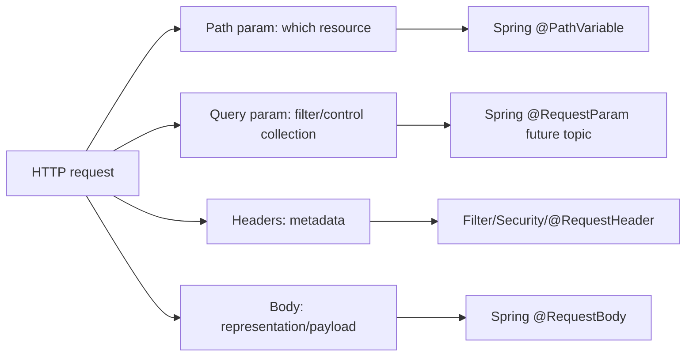

Diagram obecnego repo:

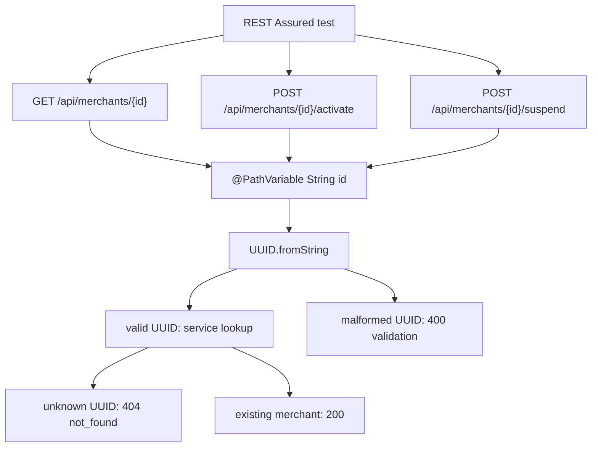

## 14. Ćwiczenia praktyczne: rozpoznawanie path, query, headers i expected status

Ćwiczenie 1 - path param w istniejącym teście:

Przeczytaj `MerchantRestAssuredTest#createReadListActivateAndSuspendMerchant` i wypisz wszystkie requesty, które używają `{id}`.

Odpowiedź PL:

Requesty, które używają `{id}`, to:

- `GET /api/merchants/{id}` - odczytuje konkretnego merchanta po jego identyfikatorze.
- `POST /api/merchants/{id}/activate` - aktywuje konkretnego merchanta wskazanego przez `id`.
- `POST /api/merchants/{id}/suspend` - zawiesza konkretnego merchanta wskazanego przez `id`.

Odpowiedź EN:

The requests that use `{id}` are:

- `GET /api/merchants/{id}` - reads a specific merchant by its identifier.
- `POST /api/merchants/{id}/activate` - activates the specific merchant identified by `id`.
- `POST /api/merchants/{id}/suspend` - suspends the specific merchant identified by `id`.

Ćwiczenie 2 - `400` vs `404`:

Przeczytaj `notFoundMalformedAndInvalidTransitionErrors` i wyjaśnij różnicę między `/api/merchants/not-a-uuid` a `/api/merchants/{UUID.randomUUID()}`.

Odpowiedź PL:

`/api/merchants/not-a-uuid` trafia do endpointu z `@PathVariable`, ale wartość `not-a-uuid` nie jest poprawnym UUID. Controller próbuje wykonać `UUID.fromString(id)`, parsowanie się nie udaje i API zwraca `400 Bad Request` jako błąd walidacji kształtu requestu.

`/api/merchants/{UUID.randomUUID()}` ma poprawny format UUID, więc parsowanie przechodzi. Problem jest inny: taki merchant prawdopodobnie nie istnieje w bazie, więc service nie znajduje zasobu i API zwraca `404 Not Found`.

Odpowiedź EN:

`/api/merchants/not-a-uuid` reaches the `@PathVariable` endpoint, but `not-a-uuid` is not a valid UUID. The controller tries to run `UUID.fromString(id)`, parsing fails, and the API returns `400 Bad Request` because the request shape is invalid.

`/api/merchants/{UUID.randomUUID()}` has a valid UUID format, so parsing succeeds. The problem is different: that merchant probably does not exist in the database, so the service cannot find the resource and the API returns `404 Not Found`.

Ćwiczenie 3 - dwa style REST Assured:

Przepisz mentalnie `.get("/api/merchants/{id}", id)` na wersję z `.pathParam("id", id)`.

Odpowiedź PL:

```java
operatorRequest(port)
        .pathParam("id", id)
.when()
        .get("/api/merchants/{id}")
.then()
        .statusCode(200);
```

Ten zapis jest bardziej jawny dla początkującego, bo osobno pokazuje przygotowanie wartości path param i osobno pokazuje URL z placeholderem `{id}`.

Odpowiedź EN:

```java
operatorRequest(port)
        .pathParam("id", id)
.when()
        .get("/api/merchants/{id}")
.then()
        .statusCode(200);
```

This form is more explicit for a beginner because it separately shows the path parameter setup and the URL containing the `{id}` placeholder.

Ćwiczenie 4 - query params bez implementowania funkcji:

Zaprojektuj przyszły request listy aktywnych merchantów jako URL i jako REST Assured `.queryParam(...)`. Zaznacz, że obecne repo tego jeszcze nie implementuje.

Odpowiedź PL:

Przyszły URL mógłby wyglądać tak:

```text
GET /api/merchants?status=ACTIVE
```

W REST Assured wyglądałoby to tak:

```java
operatorRequest(port)
        .queryParam("status", "ACTIVE")
.when()
        .get("/api/merchants")
.then()
        .statusCode(200);
```

Obecne repo nie implementuje jeszcze filtrowania merchantów po statusie, więc ten przykład pokazuje składnię i przyszły typ kontraktu. Nie należy teraz pisać testu, który oczekuje realnego filtrowania po `status=ACTIVE`.

Odpowiedź EN:

A future URL could look like this:

```text
GET /api/merchants?status=ACTIVE
```

In REST Assured it would look like this:

```java
operatorRequest(port)
        .queryParam("status", "ACTIVE")
.when()
        .get("/api/merchants")
.then()
        .statusCode(200);
```

The current repository does not implement merchant filtering by status yet, so this example demonstrates syntax and a future contract style. You should not write a test now that expects real filtering by `status=ACTIVE`.

Ćwiczenie 5 - header auth jako metadane:

Przeczytaj `MerchantApiTestSupport#requestWithToken`. Jak REST Assured dodaje token do requestu?

Odpowiedź PL:

`requestWithToken(port, token)` wywołuje:

```java
publicRequest(port).auth().oauth2(token)
```

REST Assured zamienia to na header HTTP:

```http
Authorization: Bearer <token>
```

W tej lekcji ważne jest tylko to, że token jest metadanym requestu przenoszonym w headerze. Szczegóły JWT, ról i `401/403` są osobną lekcją.

Odpowiedź EN:

`requestWithToken(port, token)` calls:

```java
publicRequest(port).auth().oauth2(token)
```

REST Assured turns this into the HTTP header:

```http
Authorization: Bearer <token>
```

For this lesson, the important point is that the token is request metadata carried in a header. JWT details, roles and `401/403` belong to a separate lesson.

Ćwiczenie 6 - header correlation id:

Przeczytaj `CorrelationIdFilter`. Co stanie się, jeśli request ma `X-Correlation-ID`, a co jeśli go nie ma?

Odpowiedź PL:

Jeśli request ma header `X-Correlation-ID` i nie jest on pusty, `CorrelationIdFilter` użyje tej wartości, zapisze ją w MDC jako `correlationId` i ustawi taki sam header w response.

Jeśli request nie ma `X-Correlation-ID` albo wartość jest pusta/blank, filter wygeneruje nowe `UUID`, zapisze je w MDC i odeśle w response jako `X-Correlation-ID`.

Odpowiedź EN:

If the request contains a non-blank `X-Correlation-ID` header, `CorrelationIdFilter` uses that value, stores it in MDC as `correlationId`, and sets the same header in the response.

If the request does not contain `X-Correlation-ID` or the value is blank, the filter generates a new `UUID`, stores it in MDC, and returns it in the response as `X-Correlation-ID`.

Ćwiczenie 7 - pytanie reviewera:

Jako reviewer widzisz test, który wysyła merchant id w query param, ale controller ma `@GetMapping("/{id}")`. Jakie pytanie zadasz autorowi?

Odpowiedź PL:

Zapytałbym: „Czy kontrakt API mówi, że `merchantId` jest query paramem, czy path paramem? Controller ma `@GetMapping("/{id}")` i `@PathVariable String id`, więc test `get by id` powinien używać `/api/merchants/{id}`, a nie `/api/merchants?id=...`. Czy ten test naprawdę sprawdza odczyt merchanta po ID, czy przypadkiem testuje listę z ignorowanym query paramem?”

Odpowiedź EN:

I would ask: “Does the API contract say that `merchantId` is a query parameter or a path parameter? The controller has `@GetMapping("/{id}")` and `@PathVariable String id`, so a `get by id` test should use `/api/merchants/{id}`, not `/api/merchants?id=...`. Is this test really verifying merchant lookup by ID, or is it accidentally testing the list endpoint with an ignored query parameter?”

## 15. Wskazówki do ćwiczeń

Wskazówka do ćwiczenia 1: Szukaj `"/api/merchants/{id}"`, `"/api/merchants/{id}/activate"` i `"/api/merchants/{id}/suspend"`.

Wskazówka do ćwiczenia 2: `not-a-uuid` nie przechodzi parsowania UUID. `UUID.randomUUID()` ma dobry format, ale prawdopodobnie nie istnieje w DB.

Wskazówka do ćwiczenia 3: Nazwa w `.pathParam("id", id)` musi pasować do `{id}`.

Wskazówka do ćwiczenia 4: Query string zaczyna się od `?`, a kolejne parametry łączy się przez `&`.

Wskazówka do ćwiczenia 5: `.auth().oauth2(token)` tworzy header `Authorization: Bearer <token>`.

Wskazówka do ćwiczenia 6: Filter działa przed controllerem i może dodać header do response niezależnie od endpointu.

Wskazówka do ćwiczenia 7: Pytaj o kontrakt, nie tylko o składnię: „Czy API naprawdę obsługuje ten kanał wejścia?”.

## 16. Odpowiedzi / przykładowe rozwiązania

Odpowiedź 1:

Requesty z `{id}` w flow:

- `GET /api/merchants/{id}` - odczyt konkretnego merchanta.
- `POST /api/merchants/{id}/activate` - aktywacja konkretnego merchanta.
- `POST /api/merchants/{id}/suspend` - zawieszenie konkretnego merchanta.

Odpowiedź 2:

`/api/merchants/not-a-uuid` ma zły format identyfikatora, więc API zwraca `400` z błędem walidacji. `/api/merchants/{UUID.randomUUID()}` ma poprawny format UUID, ale taki merchant nie istnieje, więc API zwraca `404 not_found`.

Odpowiedź 3:

```java
operatorRequest(port)
        .pathParam("id", id)
.when()
        .get("/api/merchants/{id}")
.then()
        .statusCode(200);
```

Odpowiedź 4:

URL przyszłego filtrowania mógłby wyglądać tak:

```text
GET /api/merchants?status=ACTIVE
```

REST Assured składnia:

```java
operatorRequest(port)
        .queryParam("status", "ACTIVE")
.when()
        .get("/api/merchants")
.then()
        .statusCode(200);
```

Obecne repo nie implementuje jeszcze tego kontraktu, więc nie należy oczekiwać takiego filtrowania w automatycznym teście.

Odpowiedź 5:

`requestWithToken(port, token)` wywołuje `publicRequest(port).auth().oauth2(token)`. REST Assured zamienia to na header HTTP `Authorization: Bearer <token>`.

Odpowiedź 6:

Jeśli request ma `X-Correlation-ID`, `CorrelationIdFilter` używa tej wartości i ustawia ją w response. Jeśli request nie ma tego headera albo jest blank, filter generuje nowe UUID i ustawia je w response.

Odpowiedź 7:

Zapytałbym: „Czy kontrakt API mówi, że merchant id jest query paramem, czy path paramem? Controller ma `@GetMapping("/{id}")`, więc test powinien używać `/api/merchants/{id}`, a nie `/api/merchants?id=...`”.

## 17. Typowe błędy początkujących

- Wysyłanie identyfikatora zasobu w query param, gdy API oczekuje path param.
- Mylenie `/api/merchants/{id}` z tekstem dosłownym, zamiast z placeholderem.
- Używanie `.pathParam("merchantId", id)` przy URL zawierającym `{id}`.
- Zakładanie, że query param działa, mimo że controller nie ma `@RequestParam` ani kontraktu filtrowania.
- Wrzucanie filtrów albo tokenów do body zamiast do query/header.
- Głębokie testowanie JWT w lekcji o kanałach wejścia.
- Logowanie headera `Authorization` w testach lub raportach.
- Mylenie `400` malformed id z `404` not found.
- Sprawdzanie tylko statusu bez body/error oracle.
- Dodawanie nowego endpointu tylko po to, żeby pokazać query params, gdy lekcja może użyć przykładu edukacyjnego.

## 18. Zasada jakości: right input channel, contract clarity, no fake query support

Right input channel oznacza: każda wartość powinna trafić tam, gdzie mówi kontrakt API. Identyfikator zasobu zwykle idzie do path. Filtr kolekcji zwykle idzie do query. Token i correlation id idą do headers. Reprezentacja tworzonego zasobu idzie do body.

Contract clarity oznacza: test nie powinien sugerować, że API obsługuje coś, czego nie ma. Jeśli obecne repo nie ma query filtering, nie pisz testu oczekującego `?status=ACTIVE` jako działającego kontraktu.

No fake query support oznacza: nie dodajemy dekoracyjnego query param tylko po to, żeby lekcja wyglądała pełniej. Najpierw potrzebna jest realna potrzeba produktu albo specyfikacja. W tej lekcji query params są pojęciem do nauki, a nie powodem do rozszerzania aplikacji.

## 19. Perspektywa Senior QA Automation/SDET

Senior SDET patrzy na kanały wejścia jak na projekt kontraktu API.

Pytania seniora:

- Czy `id` naprawdę identyfikuje zasób, więc należy do path?
- Czy parametr filtruje kolekcję, więc należy do query?
- Czy header niesie metadane techniczne, a nie ukryte dane biznesowe?
- Czy test sprawdza zarówno format path value (`400`), jak i brak zasobu (`404`), jeśli to ryzyko jest ważne?
- Czy auth header jest testowany w security lesson, a nie mieszany z lekcją path/query?
- Czy test nie tworzy fałszywego wymagania, którego aplikacja nie implementuje?
- Czy oracle obejmuje body/error/header, a nie tylko status?

Senior SDET potrafi powiedzieć na review: „Ten test jest czerwony, ale zanim zgłosimy bug, sprawdźmy czy wysłał dane właściwym kanałem zgodnie z kontraktem”.

## 20. Pytania, które powinienem sobie zadać podczas pracy

- Czy ta wartość identyfikuje jeden zasób?
- Czy ta wartość filtruje listę albo steruje paginacją/sortowaniem?
- Czy ta wartość jest metadanym requestu?
- Czy ta wartość jest reprezentacją danych, które tworzymy albo aktualizujemy?
- Czy używam path param, query param, headera czy body zgodnie z kontraktem?
- Czy controller ma `@PathVariable`, `@RequestParam`, `@RequestHeader` czy `@RequestBody`?
- Czy REST Assured placeholder `{id}` ma dokładnie tę samą nazwę co `.pathParam(...)`?
- Czy expected status odróżnia malformed id (`400`) od not found (`404`)?
- Czy query param, który pokazuję, naprawdę istnieje w API?
- Czy header `Authorization` traktuję tylko jako kontekst, a nie pełną lekcję JWT?
- Czy nie loguję sekretów?
- Czy nie dodaję funkcjonalności aplikacji bez potrzeby dydaktycznej i specyfikacji?

## 21. Mini quiz kontrolny

1. Co to jest path param?
2. Co to jest query param?
3. Co to jest header?
4. Gdzie powinien trafić `merchantId` dla `GET /api/merchants/{id}`?
5. Gdzie powinien trafić filtr `status=ACTIVE` w przyszłym list endpoint?
6. Gdzie trafia token Bearer?
7. Czym różni się `400` dla `not-a-uuid` od `404` dla random UUID?
8. Co robi `.pathParam("id", id)`?
9. Co robi `.queryParam("status", "ACTIVE")`?
10. Czy obecne repo implementuje query filtering dla `/api/merchants`?
11. Który plik pokazuje `@PathVariable String id`?
12. Który plik pokazuje `X-Correlation-ID`?

Odpowiedzi:

1. Dynamiczny fragment ścieżki URL identyfikujący zasób.
2. Parametr po `?`, zwykle filtrujący lub sterujący odpowiedzią kolekcji.
3. Metadane HTTP requestu, np. auth, format, correlation id.
4. Do path: `/api/merchants/{id}`.
5. Do query stringu: `/api/merchants?status=ACTIVE`.
6. Do headera `Authorization`.
7. `400` oznacza zły format wejścia; `404` oznacza poprawny format, ale brak zasobu.
8. Podstawia wartość zmiennej pod placeholder `{id}`.
9. Dodaje query string `?status=ACTIVE` do requestu.
10. Nie. To tylko przykład edukacyjny/future contract.
11. `apps/backend/src/main/java/lab/paymentquality/merchant/internal/web/MerchantController.java`.
12. `apps/backend/src/main/java/lab/paymentquality/shared/web/CorrelationIdFilter.java`.

## 22. Pytania rekrutacyjne po angielsku + przykładowe odpowiedzi

**Question:** What is the difference between a path parameter and a query parameter?<br>
**Answer:** A path parameter usually identifies a specific resource, such as `/merchants/{id}`. A query parameter usually filters, sorts or controls a collection response, such as `/merchants?status=ACTIVE`.

**Question:** Where would you put an authorization token in an HTTP request?<br>
**Answer:** I would put it in the `Authorization` header, commonly as `Authorization: Bearer <token>`. In REST Assured this can be done with `.auth().oauth2(token)`.

**Question:** Why should an API test distinguish malformed IDs from unknown IDs?<br>
**Answer:** A malformed ID is a bad request and should usually return `400`. A well-formed but unknown ID means the resource does not exist and should usually return `404`. These are different risks and different contracts.

**Question:** How do you pass a path parameter in REST Assured?<br>
**Answer:** I can use `.pathParam("id", id).get("/api/merchants/{id}")`, or pass the value directly as an argument like `.get("/api/merchants/{id}", id)`.

**Question:** Why is it risky to add query parameter tests before the API contract exists?<br>
**Answer:** The test may create a false requirement and fail even though the application is correct according to the current contract. Query parameters should be tested when the API actually defines them.

**Question:** What are headers used for in API tests?<br>
**Answer:** Headers carry metadata such as authorization, content negotiation, content type, correlation IDs or tracing information. They should not be treated as random extra fields.

## 23. Powiązane pliki w repo

- `apps/backend/src/test/java/lab/paymentquality/rest/MerchantRestAssuredTest.java` - główne REST Assured przykłady path params, `400`, `404`, activate/suspend by id.
- `apps/backend/src/test/java/lab/paymentquality/rest/MyMerchantRestAssuredTest.java` - disabled sandbox do samodzielnego przepisywania requestów z `{id}`.
- `apps/backend/src/test/java/lab/paymentquality/security/MerchantSecurityTest.java` - przykłady headera `Authorization` przez helpery i statusów `401`/`403`; szczegóły auth później.
- `apps/backend/src/test/java/lab/paymentquality/testsupport/MerchantApiTestSupport.java` - `publicRequest`, `operatorRequest`, `requestWithToken` i `.auth().oauth2(token)`.
- `apps/backend/src/main/java/lab/paymentquality/merchant/internal/web/MerchantController.java` - `@GetMapping("/{id}")`, `@PostMapping("/{id}/activate")`, `@PathVariable String id`, `UUID.fromString(id)`.
- `apps/backend/src/main/java/lab/paymentquality/shared/web/CorrelationIdFilter.java` - `X-Correlation-ID` jako header techniczny.
- `apps/backend/src/test/java/lab/paymentquality/merchant/internal/web/MerchantControllerTest.java` - unit-level przykład malformed UUID w controllerze.

## 24. Powiązane notatki w vault

- `knowledge-vault/01 Projects/Payment_Quality_Engineering_Lab/Payment Gateway SDET Learning Plan.md` - roadmapa REST Assured foundations.
- `knowledge-vault/02 Areas/Technical Learning/JUnit REST Assured/README.md` - MOC obszaru JUnit REST Assured.
- `knowledge-vault/02 Areas/Technical Learning/JUnit REST Assured/REST Assured from Zero to Professional Backend API Testing/README.md` - mapa ścieżki; Lesson 4 to `Path Params, Query Params and Headers`.
- `knowledge-vault/02 Areas/Technical Learning/REST API From Zero/Merchant Request and Response Flow.md` - wcześniejszy flow request/response.
- `knowledge-vault/02 Areas/Technical Learning/Security and Authorization Testing/README.md` - przyszły głębszy kontekst auth headers, jeśli istnieje w vault.
- `knowledge-vault/02 Areas/Technical Learning/Spring Boot Spring MVC/README.md` - przyszły głębszy kontekst `@PathVariable`, `@RequestParam`, `@RequestHeader`, jeśli istnieje w vault.

## 25. Co przerobić następnie

Następna lekcja to `Lesson 5 - Request Body, JSON, Map.of, DTO and Serialization`.

Cel następnego kroku:

- zrozumieć body jako osobny kanał danych,
- zobaczyć różnicę między ręcznym JSON stringiem, `Map.of`, helperem mapy i DTO/record,
- wyjaśnić serializację Java object -> JSON,
- połączyć `.contentType(ContentType.JSON)` z `.body(...)`,
- nie mylić body z path/query/header.

Przed przejściem dalej umiej własnymi słowami powiedzieć:

```text
Path identifies a resource. Query filters or controls a collection. Headers carry metadata. Body carries the representation or payload.
```

## 26. Zapamiętaj

Nie wszystkie dane wejściowe idą w body.

| Kanał | Kiedy używać | Przykład |
|---|---|---|
| Path param | Wartość identyfikuje konkretny zasób | `/api/merchants/{id}` |
| Query param | Wartość filtruje, sortuje, stronicuje albo steruje kolekcją | przyszłe `?status=ACTIVE` |
| Header | Wartość jest metadanym requestu | `Authorization`, `X-Correlation-ID` |
| Body | Wartość jest payloadem tworzonego/zmienianego zasobu | `merchantReference`, `displayName` |

Zasada Senior QA/SDET: **right input channel, contract clarity, no fake query support.**

## Weryfikacja jakości tej lekcji

- [x] Lekcja zaczyna od podstaw.
- [x] Nie tworzy duplikatu, tylko rozbudowuje istniejącą Lesson 4.
- [x] Wyjaśnia path params, query params i headers beginner-friendly.
- [x] Pokazuje, że aplikacji nie trzeba rozszerzać dla tej lekcji.
- [x] Rozróżnia realne przykłady z repo od edukacyjnego przykładu query params.
- [x] Wskazuje testy do czytania: `MerchantRestAssuredTest`, `MerchantSecurityTest`, `MyMerchantRestAssuredTest`.
- [x] Wyjaśnia `400` malformed id vs `404` unknown id.
- [x] Nie wchodzi głęboko w JWT.
- [x] Ma ćwiczenia, wskazówki i odpowiedzi.
- [x] Wskazuje następną lekcję: `Request Body, JSON, Map.of, DTO and Serialization`.

---

# Lesson 5 - Request Body, JSON, `Map.of`, DTO and Serialization

## 1. Tytuł PL + EN

PL: Request body: JSON, `Map.of`, helper mapy, DTO i serializacja.<br>
EN: Request body: JSON, `Map.of`, map helper, DTO and serialization.

Ta lekcja uczy, jak REST Assured wysyła body requestu i jak Java map/DTO/record zmienia się w JSON. Główny przykład to istniejący create merchant flow: `POST /api/merchants`.

Najważniejsze zdanie: **request body jest kontraktem danych wejściowych, więc test powinien pokazywać pola jawnie, stabilnie i bez przypadkowej magii.**

## 2. Gdzie ta lekcja znajduje się w ścieżce nauki

Kolejność w tej części REST Assured:

1. `Lesson 1 - What REST Assured Is` - REST Assured jako testowy klient HTTP.
2. `Lesson 2 - Anatomy of given(), when(), then()` - podstawowa struktura testu.
3. `Lesson 3 - HTTP Method, Endpoint, Content-Type and Accept` - metoda, endpoint, format i expected status.
4. `Lesson 4 - Path Params, Query Params and Headers` - kanały wejścia poza body.
5. Ta lekcja - body, JSON, mapa/helper, DTO/record i serializacja.
6. `Lesson 6 - PayU-like Business Flow: Response Contracts, Correlation IDs, Idempotency, ETag and Security Oracles` - response assertions jako narzędzie do sprawdzania realnego business flow.

To nadal jest lekcja dydaktyczna oparta na istniejącym kodzie. Aplikacji nie trzeba rozszerzać: `POST /api/merchants` już wymaga JSON body, testy już wysyłają `.body(createMerchantBody(...))`, a Spring już odbiera body przez `@RequestBody CreateMerchantRequest`.

## 3. Po co testerowi/SDET ta wiedza

Tworzenie request body jest jednym z najczęstszych źródeł fałszywie czerwonych testów API.

Test może paść, bo aplikacja ma defekt. Ale może też paść dlatego, że test wysłał body:

- z literówką w nazwie pola,
- bez `Content-Type: application/json`,
- z brakującym wymaganym polem,
- z wartością w złym formacie,
- z payloadem skopiowanym z innego testu i już nieaktualnym.

Senior SDET chce, żeby request body było czytelne jak mały kontrakt:

```json
{
  "merchantReference": "MERCH-ABC-123",
  "displayName": "Example Merchant"
}
```

Interview story z tej lekcji:

> I build request bodies explicitly and choose the simplest stable payload representation for the test.

## 4. Co już powinienem wiedzieć przed tą lekcją

Powinieneś umieć powiedzieć:

- REST Assured wysyła prawdziwy HTTP request w teście.
- `given()` przygotowuje request.
- `.when().post(...)` wysyła request.
- `.then()` sprawdza response.
- `POST /api/merchants` tworzy nowego merchanta.
- `Content-Type` opisuje format body wysyłanego do backendu.
- Path/query/header/body to różne kanały danych wejściowych.

Nie musisz jeszcze znać JSON, serializacji, DTO, Java `record`, `Map.of`, `Map.copyOf`, `LinkedHashMap`, `@RequestBody`, `@Valid` ani Bean Validation. Ta lekcja tłumaczy je od podstaw.

## Sprint Learning Matrix

| Sekcja | Odpowiedź |
|---|---|
| Business capability | Brak nowej funkcji; uczymy się budowy body dla istniejącego create merchant request |
| Previous knowledge refresh | Method, endpoint, `Content-Type`, path/query/header z poprzednich lekcji |
| New learning focus | Request body, JSON, `Map.of`, helper mapy, DTO/record, serialization |
| Java 25 focus | `Map.of`, `Map.copyOf`, `LinkedHashMap`, `record CreateMerchantRequest`, immutability, method chaining |
| Spring focus | `@RequestBody`, DTO binding, `@Valid`, Bean Validation, `CreateMerchantRequest` jako request contract |
| SQL/PostgreSQL focus | Brak głębokiego SQL; successful body może prowadzić do zapisu merchanta, ale lekcja skupia się na HTTP body contract |
| REST Assured focus | `.contentType(ContentType.JSON)`, `.body(...)`, serializacja mapy/obiektu do JSON, kiedy użyć mapy vs DTO/helper |
| Security/Keycloak focus | Tylko kontekst: `operatorRequest(port)` przygotowuje authorized request; auth będzie osobną lekcją |
| Test design focus | Czy body ma wymagane pola, poprawne nazwy pól, wartości boundary/invalid i czy oracle sprawdza response/error |
| Test data focus | Unikalny `merchantReference`; payload valid/invalid/duplicate |
| Test layers | REST API contract/validation tests plus domain tests dla reguł szczegółowych, nie UI test |
| Vault output | Rozbudowana Lesson 5 w istniejącym lesson-packu oraz prompt dla Lesson 5 |
| Interview story | I build request bodies explicitly and choose the simplest stable payload representation for the test |

## 5. Intuicyjne wyjaśnienie od zera

Request body to treść formularza wysłanego do backendu.

W `GET /api/status` nie potrzebujesz body, bo tylko pytasz o status. W `POST /api/merchants` body jest potrzebne, bo backend musi wiedzieć, jakiego merchanta utworzyć.

Minimalny HTTP request wygląda tak:

```http
POST /api/merchants HTTP/1.1
Content-Type: application/json

{
  "merchantReference": "MERCH-ABC-123",
  "displayName": "Example Merchant"
}
```

JSON to prosty tekstowy format danych: nazwy pól i wartości. W tym przykładzie są dwa pola:

- `merchantReference` - techniczno-biznesowy identyfikator merchanta,
- `displayName` - nazwa widoczna dla operatora.

W REST Assured nie musisz ręcznie pisać całego JSON stringa. Możesz przekazać mapę albo obiekt Java, a REST Assured z mapperem JSON zamieni to na JSON. Ta zamiana nazywa się serializacją.

Przepływ mentalny:

```text
Java Map/DTO -> serialization -> JSON request body -> Spring @RequestBody -> CreateMerchantRequest
```

## 6. Słowniczek pojęć

| Pojęcie | Proste znaczenie | Realny plik w repo |
|---|---|---|
| Request body | Dane wysłane w treści requestu | `.body(createMerchantBody(...))` |
| JSON | Tekstowy format pól i wartości | `merchantReference`, `displayName` |
| Payload | Praktyczne określenie danych requestu | `POST /api/merchants` body |
| `.body(...)` | REST Assured ustawia treść requestu | `MerchantRestAssuredTest#createMerchant` |
| `ContentType.JSON` | Stała REST Assured dla `application/json` | import `io.restassured.http.ContentType` |
| Serialization | Zamiana obiektu Java/mapy na JSON | REST Assured przed wysłaniem requestu |
| `Map.of` | Krótka niemutowalna mapa dla małych payloadów | przykład dydaktyczny tej lekcji |
| `LinkedHashMap` | Mapa zachowująca kolejność dodania pól | `MerchantApiTestSupport#createMerchantBody` |
| `Map.copyOf` | Tworzy niemutowalną kopię mapy | `MerchantApiTestSupport#createMerchantBody` |
| Helper body | Metoda budująca powtarzalne body | `createMerchantBody(reference, displayName)` |
| DTO | Obiekt przenoszący dane przez API | `CreateMerchantRequest`, `MerchantResponse` |
| Java `record` | Krótka składnia niemutowalnego obiektu danych | `CreateMerchantRequest` |
| Request DTO | DTO odbierające request body | `CreateMerchantRequest` |
| Response DTO | DTO zwracane w response body | `MerchantResponse` |
| `@RequestBody` | Spring czyta JSON body i tworzy obiekt Java | `MerchantController#create` |
| `@Valid` | Spring uruchamia walidację DTO | `@Valid @RequestBody CreateMerchantRequest` |
| Bean Validation | Walidacja adnotacjami, np. `@NotBlank`, `@Size` | `CreateMerchantRequest` |
| Oracle | Skąd test wie, że wynik jest poprawny | status `201`, body fields, error body |

## 7. Minimalny przykład REST Assured

Minimalny create request z `Map.of`:

```java
given()
        .contentType(ContentType.JSON)
        .body(Map.of(
                "merchantReference", "MERCH-ABC-123",
                "displayName", "Example Merchant"))
.when()
        .post("/api/merchants")
.then()
        .statusCode(201);
```

Ten przykład mówi:

- wysyłam JSON,
- body ma dwa pola,
- wykonuję `POST /api/merchants`,
- oczekuję `201 Created`.

W realnym repo protected merchant endpoint wymaga autoryzacji, więc testy używają `operatorRequest(port)` zamiast gołego `given()`. To tylko helper przygotowujący request z tokenem; security będzie osobną lekcją.

## 8. Wyjaśnienie przykładu linia po linii

`given()` zaczyna przygotowanie requestu.

`.contentType(ContentType.JSON)` ustawia `Content-Type: application/json`. Bez tego backend może nie wiedzieć jednoznacznie, że body jest JSON-em.

`.body(...)` ustawia treść requestu. To właśnie tu wkładasz dane, które backend ma przeczytać.

`Map.of(...)` tworzy małą, niemutowalną mapę. Klucze mapy staną się nazwami pól JSON, a wartości mapy staną się wartościami pól JSON.

`"merchantReference"` musi pasować do nazwy pola oczekiwanej przez API. W Springu odpowiada temu komponent `merchantReference` w `CreateMerchantRequest`.

`"displayName"` musi pasować do drugiego pola request DTO.

`.when().post("/api/merchants")` wysyła request.

`.then().statusCode(201)` sprawdza, że create flow zakończył się utworzeniem zasobu.

## 9. Bardziej profesjonalny przykład z obecnego repo

Realny helper w `MerchantRestAssuredTest`:

```java
private Response createMerchant(String reference, String displayName) {
    return operatorRequest(port)
            .contentType(ContentType.JSON)
            .body(createMerchantBody(reference, displayName))
    .when().post("/api/merchants");
}
```

Realny builder body w `MerchantApiTestSupport`:

```java
public static Map<String, Object> createMerchantBody(String reference, String displayName) {
    Map<String, Object> body = new LinkedHashMap<>();
    body.put("merchantReference", reference);
    body.put("displayName", displayName);
    return Map.copyOf(body);
}
```

Dlaczego to jest bardziej profesjonalne niż ręczny JSON string:

- nazwy pól są jawne,
- wartości są przekazywane parametrami,
- helper usuwa powtarzalność,
- `Map.copyOf` chroni przed przypadkową zmianą body po utworzeniu,
- test nie musi walczyć z cudzysłowami i przecinkami w JSON stringu.

Spring odbiera ten payload tutaj:

```java
@PostMapping
public ResponseEntity<MerchantResponse> create(@Valid @RequestBody CreateMerchantRequest request) {
    var merchant = merchantService.create(request.merchantReference(), request.displayName());
    var response = MerchantMapper.toResponse(merchant);
    return ResponseEntity.status(HttpStatus.CREATED).body(response);
}
```

I request DTO wygląda tak:

```java
public record CreateMerchantRequest(
        @NotBlank @Size(max = 64) String merchantReference,
        @NotBlank @Size(min = 2, max = 120) String displayName) {
}
```

## 10. Jak ten temat pojawia się w obecnym kodzie testów

`MerchantRestAssuredTest#createMerchant` to główny przykład:

```java
operatorRequest(port)
        .contentType(ContentType.JSON)
        .body(createMerchantBody(reference, displayName))
.when().post("/api/merchants");
```

`createReadListActivateAndSuspendMerchant` pokazuje happy path:

```java
String id = createMerchant(reference, "Flow Merchant")
        .then()
        .statusCode(201)
        .body("merchantReference", equalTo(reference))
        .body("displayName", equalTo("Flow Merchant"))
        .body("status", equalTo("DRAFT"))
        .extract().path("merchantId");
```

`createValidationAndDuplicateErrors` pokazuje invalid payloads:

| Payload | Oczekiwany status | Sens |
|---|---:|---|
| duplicate `merchantReference` | `409` | body poprawne technicznie, ale konflikt danych |
| `merchantReference = "AB"` | `400` | za krótka wartość |
| `merchantReference = " "` | `400` | blank required field |
| `merchantReference = "A".repeat(65)` | `400` | za długa wartość |
| `displayName = " "` | `400` | blank required field |
| `displayName = " A "` | `400` | po trimie za krótka nazwa |

`MerchantSecurityTest` ma dodatkowe przykłady `.contentType(ContentType.JSON)` i `.body(createMerchantBody(...))`, ale w tej lekcji traktujemy je tylko jako potwierdzenie wzorca body. Nie wchodzimy głęboko w role i JWT.

`MyMerchantRestAssuredTest` jest disabled sandboxiem. Jest użyteczny do nauki, bo zawiera przykładowe literówki, np. `displayNAme`, które pokazują, jak mała różnica w nazwie pola/asercji może zepsuć test albo diagnozę.

## 11. Jakie ryzyko testowe ten temat pomaga zrozumieć

| Ryzyko | Przykład | Skutek |
|---|---|---|
| Brak `Content-Type` | `.body(...)` bez `.contentType(ContentType.JSON)` | Backend może nie zinterpretować body jako JSON |
| Literówka w nazwie pola | `displayNAme` zamiast `displayName` | Body/asercja nie pasuje do kontraktu API |
| Raw JSON string | ręcznie składany `"{...}"` | kruche cudzysłowy, przecinki, escaping |
| Brak wymaganego pola | brak `merchantReference` | `400 validation` |
| Zła wartość pola | blank albo za długi reference | `400 validation` |
| Duplikat danych | drugi raz ten sam `merchantReference` | `409 duplicate_merchant_reference` |
| Payload ukryty w zbyt dużym helperze | test nie pokazuje pól body | słabszy review i diagnoza |
| Zły typ reprezentacji | duży payload jako chaotyczna mapa | trudniejsze utrzymanie |
| Mylenie request DTO z response DTO | użycie `MerchantResponse` jako body create | test sugeruje niepoprawny kontrakt |
| Brak unikalnych danych | stały `MERCH-001` w wielu testach | flaky duplicate conflicts |

Najważniejsze ryzyko: **źle zbudowane body może dać czerwony test mimo braku defektu aplikacji.**

## 12. Jakie testy można z tego zaprojektować

Na obecnym kodzie masz gotowe przykłady do nauki:

| Test idea | Body focus | Istnieje w repo? | Gdzie patrzeć |
|---|---|---|---|
| Valid create merchant | wymagane pola i JSON body | Tak | `createReadListActivateAndSuspendMerchant` |
| Duplicate merchant reference | ten sam payload drugi raz | Tak | `createValidationAndDuplicateErrors` |
| Blank reference | invalid required field | Tak | `createValidationAndDuplicateErrors` |
| Too short reference | boundary/validation | Tak | `createValidationAndDuplicateErrors` |
| Too long reference | boundary/validation | Tak | `createValidationAndDuplicateErrors` |
| Blank display name | invalid required field | Tak | `createValidationAndDuplicateErrors` |
| Typo in field/assertion | learning sandbox | Tak, disabled sandbox | `MyMerchantRestAssuredTest` |
| Raw JSON vs map/helper comparison | coding exercise | Nie jako test produkcyjny | ćwiczenie w lekcji |

Nie trzeba dodawać nowych testów produkcyjnych dla tej lekcji. Testy istnieją i wystarczą do nauki request body.

## 13. Test design: required fields, field names, valid/invalid payloads, oracle

Przed napisaniem testu z body wypełnij mentalnie tabelę:

| Element | Pytanie | Przykład |
|---|---|---|
| Required fields | Jakie pola muszą być w body? | `merchantReference`, `displayName` |
| Field names | Czy nazwy pól pasują do kontraktu? | `displayName`, nie `displayNAme` |
| Valid payload | Jaki minimalny poprawny payload tworzy zasób? | unikalny reference + poprawna nazwa |
| Invalid payload | Jakie wartości powinny dać `400`? | blank, za krótki, za długi |
| Conflict payload | Jakie dane powinny dać `409`? | duplicate `merchantReference` |
| Content type | Czy mówisz backendowi, że wysyłasz JSON? | `.contentType(ContentType.JSON)` |
| Oracle | Co potwierdza poprawność? | status + response body/error body |

Diagram przepływu body:

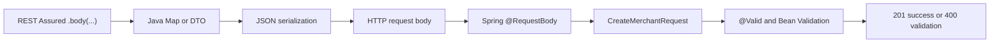

Porównanie sposobów budowy body:

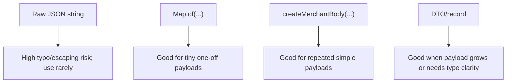

## 14. Ćwiczenia praktyczne: body, JSON, `Map.of`, helper, DTO, serialization

Ćwiczenie 1 - rozpoznaj pola body:

Przeczytaj `CreateMerchantRequest` i wypisz pola, które musi znać klient tworzący merchanta.

Ćwiczenie 2 - body jako `Map.of`:

Zamień ręczny JSON `{"merchantReference":"MERCH-001","displayName":"Acme"}` na `Map.of(...)`.

Ćwiczenie 3 - helper body:

Przeczytaj `createMerchantBody(reference, displayName)`. Dlaczego helper zwraca `Map.copyOf(body)`?

Ćwiczenie 4 - REST Assured flow:

Wskaż w helperze `createMerchant`, która linia ustawia format JSON, która linia ustawia body, a która linia wysyła request.

Ćwiczenie 5 - request DTO vs response DTO:

Porównaj `CreateMerchantRequest` i `MerchantResponse`. Dlaczego nie są tym samym obiektem?

Ćwiczenie 6 - invalid body:

W `createValidationAndDuplicateErrors` wybierz trzy payloady, które powinny zwrócić `400`, i wyjaśnij dlaczego.

Ćwiczenie 7 - literówka w field name:

W `MyMerchantRestAssuredTest` znajdź `displayNAme`. Jaką lekcję o field names daje ta literówka?

Ćwiczenie 8 - wybór reprezentacji payloadu:

Dla payloadu z dwoma polami zdecyduj: raw JSON string, `Map.of`, helper mapy czy DTO/record? Uzasadnij.

## 15. Wskazówki do ćwiczeń

Wskazówka do ćwiczenia 1: Szukaj komponentów Java record: `String merchantReference`, `String displayName`.

Wskazówka do ćwiczenia 2: Klucze mapy są nazwami pól JSON.

Wskazówka do ćwiczenia 3: Niemutowalność pomaga uniknąć przypadkowej zmiany payloadu po zbudowaniu.

Wskazówka do ćwiczenia 4: Szukaj `.contentType(...)`, `.body(...)`, `.post(...)`.

Wskazówka do ćwiczenia 5: Request DTO opisuje wejście, response DTO opisuje wyjście.

Wskazówka do ćwiczenia 6: `400` dotyczy invalid request body, nie duplicate conflict.

Wskazówka do ćwiczenia 7: Wielkość liter w nazwach pól ma znaczenie dla testu i kontraktu.

Wskazówka do ćwiczenia 8: Najprostsza stabilna reprezentacja jest zwykle najlepsza.

## 16. Odpowiedzi / przykładowe rozwiązania

Odpowiedź 1:

Klient tworzący merchanta musi znać pola `merchantReference` i `displayName`. Są one zdefiniowane w `CreateMerchantRequest`.

Odpowiedź 2:

```java
Map.of(
        "merchantReference", "MERCH-001",
        "displayName", "Acme")
```

Odpowiedź 3:

`Map.copyOf(body)` zwraca niemutowalną kopię mapy. Dzięki temu test nie zmieni przypadkiem payloadu po jego zbudowaniu.

Odpowiedź 4:

`.contentType(ContentType.JSON)` ustawia format JSON. `.body(createMerchantBody(reference, displayName))` ustawia body. `.post("/api/merchants")` wysyła request.

Odpowiedź 5:

`CreateMerchantRequest` ma tylko pola wejściowe potrzebne do utworzenia merchanta. `MerchantResponse` ma pola wyjściowe, np. `merchantId`, `status`, `createdAt`, `updatedAt`. Nie powinno się wysyłać response DTO jako create request body.

Odpowiedź 6:

Przykłady `400`: `merchantReference = "AB"`, `merchantReference = " "`, `displayName = " "`. Każdy z tych payloadów łamie wymagania requestu albo walidacji.

Odpowiedź 7:

`displayNAme` pokazuje, że literówka lub inna wielkość liter w nazwie pola może zepsuć test albo sprawić, że test sprawdza nieistniejące pole. Field names są częścią API contract.

Odpowiedź 8:

Dla dwóch pól dobry jest `Map.of` w przykładzie jednorazowym albo helper `createMerchantBody(...)`, jeśli payload powtarza się w wielu testach. DTO/record ma większy sens, gdy payload rośnie, jest współdzielony albo potrzebujesz silniejszej czytelności typu. Raw JSON string zostawiłbym tylko do szczególnych przypadków, np. testów malformed JSON.

## 17. Typowe błędy początkujących

- Wysyłanie body bez `.contentType(ContentType.JSON)`.
- Ręczne składanie JSON stringiem, gdy mapa/helper byłby prostszy.
- Literówki w field names, np. `displayNAme`.
- Mylenie request DTO z response DTO.
- Testowanie tylko `statusCode(201)` bez sprawdzenia, czy response odpowiada wysłanemu body.
- Kopiowanie payloadów między testami bez sprawdzenia, czy pola nadal pasują do kontraktu.
- Budowanie dużego buildera dla payloadu z dwoma polami.
- Ukrywanie całego body w helperze o niejasnej nazwie.
- Używanie stałego `merchantReference`, co powoduje konflikty danych.
- Próba testowania wszystkich reguł domenowych tylko przez REST API.

## 18. Zasada jakości: simplest stable payload, explicit field names, no raw JSON unless needed

Simplest stable payload oznacza: wybierz najprostszy sposób budowy body, który jest czytelny i stabilny. Dwa pola mogą być mapą albo małym helperem. Nie zaczynaj od ciężkiego buildera.

Explicit field names oznacza: nazwy pól powinny być widoczne tam, gdzie uczysz się kontraktu. `merchantReference` i `displayName` są ważniejsze niż efektowna abstrakcja.

No raw JSON unless needed oznacza: nie składaj JSON stringiem, jeśli nie musisz. Raw JSON bywa uzasadniony przy testach malformed JSON albo dokładnej kontroli tekstu, ale dla standardowego happy path mapa/helper/DTO są bezpieczniejsze.

## 19. Perspektywa Senior QA Automation/SDET

Senior SDET pyta o body nie tylko „czy działa?”, ale „czy ten payload jest dobrym kontraktem testowym?”.

Pytania seniora:

- Czy body pokazuje wymagane pola?
- Czy field names pasują do request DTO?
- Czy payload jest minimalny, ale reprezentatywny?
- Czy dane są unikalne, jeśli zapisujemy do DB?
- Czy `.contentType(ContentType.JSON)` jest ustawione jawnie?
- Czy invalid payloady testują request contract, a nie przypadkowe szczegóły implementacji?
- Czy helper pomaga, czy ukrywa sens testu?
- Czy test ma oracle dla response albo error body?

Senior SDET potrafi też powiedzieć: „Nie każdy wariant walidacji musi być REST API testem. Część granic może być szybciej i precyzyjniej sprawdzona w domain/value object tests”.

## 20. Pytania, które powinienem sobie zadać podczas pracy

- Czy ten endpoint naprawdę potrzebuje body?
- Jakie pola są wymagane w body?
- Czy nazwy pól są dokładnie takie jak w kontrakcie API?
- Czy ustawiłem `.contentType(ContentType.JSON)`?
- Czy body jest mapą, helperem czy DTO i dlaczego?
- Czy payload jest minimalny, ale czytelny?
- Czy `merchantReference` jest unikalny?
- Czy testuję valid body, invalid body czy conflict body?
- Czy expected status pasuje do rodzaju payloadu: `201`, `400`, `409`?
- Czy response oracle potwierdza, że backend użył mojego body?
- Czy nie używam response DTO jako request DTO?
- Czy raw JSON string jest naprawdę potrzebny?

## 21. Mini quiz kontrolny

1. Co to jest request body?
2. Dlaczego `POST /api/merchants` potrzebuje body?
3. Co robi `.body(...)` w REST Assured?
4. Dlaczego przy JSON body ustawiamy `.contentType(ContentType.JSON)`?
5. Co to jest serializacja?
6. Co robi `Map.of`?
7. Po co istnieje helper `createMerchantBody(...)`?
8. Co robi `@RequestBody`?
9. Co robi `@Valid`?
10. Czym różni się `CreateMerchantRequest` od `MerchantResponse`?
11. Dlaczego raw JSON string może być ryzykowny?
12. Dlaczego `displayNAme` jest problemem?

Odpowiedzi:

1. Dane wysłane w treści requestu.
2. Bo backend musi dostać `merchantReference` i `displayName`.
3. Ustawia treść requestu, którą REST Assured wyśle do backendu.
4. Żeby backend wiedział, że body jest JSON-em.
5. Zamiana obiektu Java lub mapy na JSON.
6. Tworzy małą niemutowalną mapę.
7. Żeby powtarzalny payload był budowany czytelnie i stabilnie.
8. Spring czyta JSON body i tworzy obiekt Java DTO.
9. Uruchamia walidację DTO, np. `@NotBlank`, `@Size`.
10. Request DTO opisuje wejście, response DTO opisuje wyjście.
11. Łatwo o błędy cudzysłowów, przecinków, escaping i kopiowania.
12. To literówka w nazwie pola; field names są częścią kontraktu i wielkość liter ma znaczenie.

## 22. Pytania rekrutacyjne po angielsku + przykładowe odpowiedzi

**Question:** How do you build request bodies in REST Assured tests?<br>
**Answer:** I usually use a small map, a helper method or a DTO/record, depending on payload complexity. I avoid raw JSON strings unless I need exact malformed JSON control.

**Question:** Why do you need `Content-Type: application/json` when sending a JSON body?<br>
**Answer:** It tells the server how to interpret the request body. Without it, the server may not bind or parse the payload as JSON correctly.

**Question:** What is serialization in API tests?<br>
**Answer:** Serialization is the conversion of a Java object or map into JSON before sending it as the HTTP request body.

**Question:** When would you use a DTO or record instead of `Map.of`?<br>
**Answer:** I would use a DTO or record when the payload grows, is reused in many tests, or when stronger type clarity improves readability and maintainability.

**Question:** Why can raw JSON strings be risky in automated API tests?<br>
**Answer:** They are easy to break with missing quotes, commas, escaping errors or copied stale fields. Maps or DTOs usually make payload fields clearer and safer.

**Question:** How do you test invalid request bodies?
**Answer:** I choose payloads that violate the request contract, send them with the correct content type, and assert both the expected status, such as `400`, and the error body.

## 23. Powiązane pliki w repo

- `apps/backend/src/test/java/lab/paymentquality/rest/MerchantRestAssuredTest.java` - główne przykłady `.contentType(ContentType.JSON)`, `.body(...)`, valid/invalid body.
- `apps/backend/src/test/java/lab/paymentquality/rest/MyMerchantRestAssuredTest.java` - disabled sandbox do ćwiczeń i literówek.
- `apps/backend/src/test/java/lab/paymentquality/security/MerchantSecurityTest.java` - dodatkowe przykłady body przy protected endpoints; security później.
- `apps/backend/src/test/java/lab/paymentquality/testsupport/MerchantApiTestSupport.java` - `createMerchantBody`, `LinkedHashMap`, `Map.copyOf`.
- `apps/backend/src/main/java/lab/paymentquality/merchant/internal/web/CreateMerchantRequest.java` - request DTO/record z Bean Validation.
- `apps/backend/src/main/java/lab/paymentquality/merchant/internal/web/MerchantController.java` - `@RequestBody`, `@Valid`, create endpoint.
- `apps/backend/src/main/java/lab/paymentquality/merchant/internal/web/MerchantExceptionHandler.java` - `400 validation`, `409 duplicate_merchant_reference`.
- `apps/backend/src/main/java/lab/paymentquality/merchant/internal/web/MerchantResponse.java` - response DTO, inne od request DTO.

## 24. Powiązane notatki w vault

- `knowledge-vault/01 Projects/Payment_Quality_Engineering_Lab/Payment Gateway SDET Learning Plan.md` - roadmapa REST Assured foundations.
- `knowledge-vault/02 Areas/Technical Learning/JUnit REST Assured/README.md` - MOC obszaru JUnit REST Assured.
- `knowledge-vault/02 Areas/Technical Learning/JUnit REST Assured/REST Assured from Zero to Professional Backend API Testing/README.md` - mapa ścieżki; Lesson 5 to request body, JSON, `Map.of`, DTO and serialization.
- `knowledge-vault/02 Areas/Technical Learning/REST API From Zero/Merchant Request and Response Flow.md` - wcześniejszy flow request/response merchanta.
- `knowledge-vault/02 Areas/Technical Learning/Spring Boot Spring MVC/README.md` - przyszły głębszy kontekst Spring MVC binding i validation, jeśli istnieje w vault.
- `knowledge-vault/02 Areas/Technical Learning/Java 25 For SDET/README.md` - przyszły głębszy kontekst records, maps i immutability, jeśli istnieje w vault.

## 25. Co przerobić następnie

Następna lekcja to `Lesson 6 - PayU-like Business Flow: Response Contracts, Correlation IDs, Idempotency, ETag and Security Oracles`.

Cel następnego kroku:

- odróżnić request body od response body,
- sprawdzać status, content type i pola odpowiedzi,
- rozumieć Hamcrest matchers, np. `equalTo`, `notNullValue`,
- budować oracle odpowiedzi zamiast tylko wysyłać poprawny request.

Przed przejściem dalej umiej własnymi słowami powiedzieć:

```text
I send a Java map or DTO as request body, REST Assured serializes it to JSON, Spring binds it with @RequestBody, and my test asserts the response contract.
```

## 26. Zapamiętaj

Request body to dane wejściowe wysyłane w treści requestu. Dla `POST /api/merchants` body opisuje merchanta, którego chcesz utworzyć.

Najważniejsze różnice:

| Sposób | Kiedy używać | Ryzyko |
|---|---|---|
| Raw JSON string | Gdy testujesz dokładny tekst lub malformed JSON | kruche cudzysłowy, escaping, kopiowanie |
| `Map.of` | Mały jednorazowy payload | mniej wygodne przy większym payloadzie |
| Helper mapy | Powtarzalny prosty payload | może ukrywać field names, jeśli nazwa helpera jest zbyt ogólna |
| DTO/record | Większy lub typowany payload | więcej kodu, ale lepsza czytelność typu |

Zasada Senior QA/SDET: **simplest stable payload, explicit field names, no raw JSON unless needed.**

## Weryfikacja jakości tej lekcji

- [x] Lekcja zaczyna od podstaw.
- [x] Nie tworzy duplikatu, tylko rozbudowuje istniejącą Lesson 5.
- [x] Jasno tłumaczy request body, JSON, `.body(...)` i serialization.
- [x] Pokazuje związek `.contentType(ContentType.JSON)` z `.body(...)`.
- [x] Używa realnych przykładów z repo.
- [x] Nie wymaga rozszerzania aplikacji.
- [x] Wskazuje, które testy są już gotowe dla tej lekcji.
- [x] Ma ćwiczenia, wskazówki i odpowiedzi.
- [x] Mówi o ryzyku raw JSON stringów i literówek w field names.
- [x] Wyjaśnia mapę vs helper vs DTO/record.
- [x] Wskazuje następną lekcję: accelerated PayU-like business-flow sprint.

---

# Lesson 6 - PayU-like Business Flow: Response Contracts, Correlation IDs, Idempotency, ETag and Security Oracles

## 1. Tytuł PL + EN

PL: PayU-like business flow: kontrakty odpowiedzi, correlation IDs, idempotency, ETag i security oracles.<br>
EN: PayU-like business flow: response contracts, correlation IDs, idempotency, ETag and security oracles.

## 2. Zmiana Trybu Od Lesson 6

Od tej lekcji nie uczymy się już pojedynczej składni REST Assured jako osobnego celu. Uczymy się przez realistyczny business-flow sprint.

Response assertions są tu narzędziem do sprawdzenia obietnicy produktu:

```text
merchant-scoped payment order -> protected API -> SQL integrity -> HTTP response contract -> UI journey -> automated tests
```

Aktualny gate repo jest ważny: aktywna specyfikacja `002-merchant-registry-activation` nadal wyklucza payment order creation. Dlatego ta lekcja przygotowuje discovery/spec input i test-design target dla następnej funkcji, a nie implementuje payment endpoints w Phase 1.

Spec input dla przyszłej funkcji znajduje się w:

- `specs/003-payment-order-access-lifecycle/spec-input.md`

## 3. Assumed Knowledge

Nie powtarzamy od podstaw:

- czym jest REST Assured,
- `given()`, `when()`, `then()`,
- podstawowych HTTP methods, endpointów, path/query/header/body,
- JSON body, `Map.of`, DTO i serializacji,
- prostych `statusCode(...)` i `body(...)` jako składni.

Wracaj do Lessons 1-5, jeśli te fundamenty nie są jeszcze automatyczne. Lesson 6 zakłada, że umiesz czytać istniejące merchant API tests i chcesz projektować większy flow.

## 4. Learning Delta Map

| Area | Nowy temat | Po co w Lesson 6 | Plik obecny lub planowany |
|---|---|---|---|
| Product | Payment order jako merchant-owned resource | Pierwszy realny zasób płatniczy po Merchant Registry | planned `payment.internal.domain.PaymentOrder` |
| Product | Minimalny access/ownership slice | Role bez ownership są za słabe dla płatności | planned `merchant_memberships` lub merchant public API |
| HTTP/API | `Location` header | `201 Created` wskazuje kanoniczny URL zasobu | planned `PaymentOrderController#create` |
| HTTP/API | `X-Correlation-ID` | Błąd płatności musi być diagnozowalny | existing `shared.web.CorrelationIdFilter` |
| HTTP/API | `Idempotency-Key` | Retry `POST` nie może tworzyć duplikatu płatności | planned `idempotency_records` |
| HTTP/API | `ETag` | Response niesie wersję reprezentacji | planned `PaymentOrderResponse` |
| HTTP/API | `If-Match` + `412` | Stare lifecycle action musi zostać odrzucone | planned action endpoints |
| HTTP/API | `409` business conflict | Idempotency conflict i invalid transition to konflikty stanu | planned `PaymentOrderExceptionHandler` |
| Java 25 | Value objects | Money/currency/key nie powinny być luźnymi stringami/liczbami | planned `Money`, `CurrencyCode`, `IdempotencyKey` |
| Spring | Transaction boundary | Order, idempotency record i history muszą zapisać się atomowo | planned `PaymentOrderService` |
| Spring Modulith | Public boundary | Payment nie może zależeć od `merchant.internal` | existing `ModulithArchitectureTest`, planned payment module test |
| PostgreSQL | FK, unique, check constraints | DB jest ostatnią linią integralności | planned payment migrations |
| PostgreSQL | Status history | Timeline jest audytowalnym oracle | planned `payment_order_status_history` |
| Security | Role + ownership matrix | `merchant:payments:*` bez merchant scope grozi data leak | planned `PaymentSecurityTest` |
| UI | Role-aware actions | UI ukrywa akcje, backend egzekwuje reguły | planned payment dashboard pages |
| Playwright | One representative journey | UI testuje journey, nie całą macierz API | planned `payment-order-lifecycle.spec.ts` |
| REST Assured | Header contract assertions | Test sprawdza protokół, nie tylko body | planned `PaymentOrderRestAssuredTest` |
| AssertJ | Complex extracted oracles | Idempotency replay i timeline wymagają porównań obiektów/list | planned typed extraction tests |
| Test data | Worker-safe payment data | Idempotency keys i references muszą być izolowane równolegle | planned `PaymentApiTestSupport` |

## 5. Business Flow Explanation

Rekomendowany flow główny to `Payment Order Initiation And Lifecycle`. Minimalny dependency slice to merchant-scoped access/ownership, tylko w zakresie potrzebnym do testowania płatności.

Główna ścieżka:

1. Merchant payment creator wysyła `POST /api/merchants/{merchantId}/payment-orders`.
2. Request ma `Authorization`, `Content-Type: application/json`, `Idempotency-Key` i `X-Correlation-ID`.
3. Backend sprawdza token, permission, ownership i to, czy merchant jest `ACTIVE`.
4. Backend waliduje amount/currency/reference/idempotency key.
5. Backend w jednej transakcji zapisuje payment order, idempotency record i status history.
6. Response zwraca `201 Created`, `Location`, `ETag`, `X-Correlation-ID` i body z `status = CREATED`.
7. Retry z tym samym `Idempotency-Key` i tym samym body zwraca ten sam payment order.
8. Retry z tym samym `Idempotency-Key`, ale innym body zwraca `409 idempotency_conflict`.
9. Lifecycle action typu authorize/capture/cancel używa `If-Match` i odrzuca stale version przez `412`.

## 6. API Contract

Minimalny kontrakt do Spec Kit, nie do implementacji w aktualnej Phase 1:

| Method | Path | Cel | Success | Ważne headers |
|---|---|---|---|---|
| `POST` | `/api/merchants/{merchantId}/payment-orders` | Create payment order | `201 Created` | `Location`, `ETag`, `X-Correlation-ID` |
| `GET` | `/api/merchants/{merchantId}/payment-orders/{paymentOrderId}` | Read payment order | `200 OK` | `ETag`, `X-Correlation-ID` |
| `POST` | `/api/merchants/{merchantId}/payment-orders/{paymentOrderId}/authorize` | Authorize | `200 OK` | request `If-Match`, response `ETag` |
| `POST` | `/api/merchants/{merchantId}/payment-orders/{paymentOrderId}/capture` | Capture | `200 OK` | request `If-Match`, response `ETag` |
| `POST` | `/api/merchants/{merchantId}/payment-orders/{paymentOrderId}/cancel` | Cancel | `200 OK` | request `If-Match`, response `ETag` |

Error contract:

| Status | Business meaning | Stable error code |
|---:|---|---|
| `400` | Invalid amount/currency/body/header shape | `validation` |
| `401` | Missing, invalid, expired token | Spring security auth error shape or unified future error contract |
| `403` | Authenticated but missing permission or forbidden ownership | `forbidden` if custom error is introduced |
| `404` | Unknown resource or masked cross-tenant resource if chosen | `not_found` |
| `409` | Duplicate/conflicting idempotency or invalid transition | `idempotency_conflict`, `invalid_transition` |
| `412` | `If-Match` does not match current ETag/version | `precondition_failed` |

## 7. HTTP Semantics As Product Promises

`201 Created` means the platform created a new payment order resource, not merely accepted some JSON.

`Location` means the client can follow the canonical URL to read the new order.

`X-Correlation-ID` means the client, tester and operator can connect API response, logs and status history without logging secrets.

`Idempotency-Key` means safe retry: the same create command cannot accidentally create a second payment order.

`ETag` means the response carries a version of the representation.

`If-Match` means lifecycle commands are conditional: do this only if the client acts on the version it actually saw.

`409` means the request conflicts with current business/server state.

`412` means the precondition header is stale, so this is a concurrency/version problem rather than a general invalid transition.

## 8. Java 25 And Spring Concepts

Planned domain/value objects:

```java
public record Money(long minorUnits, CurrencyCode currency) { }
public record CurrencyCode(String value) { }
public record IdempotencyKey(String value) { }
public enum PaymentOrderStatus { CREATED, AUTHORIZED, CAPTURED, CANCELED }
```

Design rules:

- No `double` for money.
- Validate money and currency in value objects and DB constraints.
- Keep payment lifecycle in enum/domain logic, not controller `if` chains.
- Put transaction boundary in application service.
- Use `@RestControllerAdvice` as the HTTP error-contract boundary.
- Keep `payment` module independent from `merchant.internal`.

## 9. SQL Design

Planned tables:

```sql
payment_orders(
  payment_order_id UUID PRIMARY KEY,
  merchant_id UUID NOT NULL REFERENCES merchants(merchant_id),
  client_order_reference VARCHAR(80) NOT NULL,
  amount_minor BIGINT NOT NULL,
  currency CHAR(3) NOT NULL,
  status VARCHAR(20) NOT NULL,
  version BIGINT NOT NULL,
  created_at TIMESTAMPTZ NOT NULL,
  updated_at TIMESTAMPTZ NOT NULL
)

idempotency_records(
  idempotency_record_id UUID PRIMARY KEY,
  merchant_id UUID NOT NULL REFERENCES merchants(merchant_id),
  operation VARCHAR(40) NOT NULL,
  idempotency_key VARCHAR(120) NOT NULL,
  request_fingerprint VARCHAR(128) NOT NULL,
  payment_order_id UUID NOT NULL REFERENCES payment_orders(payment_order_id),
  created_at TIMESTAMPTZ NOT NULL,
  UNIQUE (merchant_id, operation, idempotency_key)
)

payment_order_status_history(
  history_id UUID PRIMARY KEY,
  payment_order_id UUID NOT NULL REFERENCES payment_orders(payment_order_id),
  from_status VARCHAR(20),
  to_status VARCHAR(20) NOT NULL,
  actor_subject VARCHAR(120) NOT NULL,
  correlation_id VARCHAR(120) NOT NULL,
  occurred_at TIMESTAMPTZ NOT NULL
)
```

Tester lens:

- FK catches orphan payment orders.
- Check constraint catches invalid amount/currency/status even if application misses it.
- Unique idempotency key protects against concurrent duplicate creates.
- Merchant-scoped indexes support list/read without cross-tenant scanning becoming invisible.
- Status history gives an audit-style oracle for lifecycle tests.

## 10. Security Matrix

| Caller | Create | Read own | Operate own | Cross-merchant read/operate |
|---|---:|---:|---:|---:|
| No token | `401` | `401` | `401` | `401` |
| Invalid/expired token | `401` | `401` | `401` | `401` |
| Valid token, no payment role | `403` | `403` | `403` | `403` |
| Merchant viewer | `403` | `200` | `403` | `403` or masked `404` |
| Merchant payment creator | `201` | policy decision | `403` | `403` or masked `404` |
| Merchant payment operator | policy decision | `200` if also read | `200` if state/ETag valid | `403` or masked `404` |
| Platform payment reader | `403` unless explicitly granted | `200` if approved | `403` unless explicitly granted | `200` read if approved |

Spec clarification required before coding:

- Cross-tenant resource access returns `403` or masked `404`.
- Payment create replay returns `200` or `201` for same idempotency key and same fingerprint.
- Platform operator can read payments or only merchant-scoped users can read them.

## 11. REST Assured And AssertJ Test Patterns

Header contract assertion example shape:

```java
String correlationId = "lesson6-" + UUID.randomUUID();

Response response = merchantPaymentCreatorRequest(port)
        .contentType(ContentType.JSON)
        .header("X-Correlation-ID", correlationId)
        .header("Idempotency-Key", idempotencyKey)
        .body(createPaymentOrderBody(amountMinor, "PLN"))
.when()
        .post("/api/merchants/{merchantId}/payment-orders", merchantId);

String paymentOrderId = response.then()
        .statusCode(201)
        .header("Location", endsWith("/api/merchants/" + merchantId + "/payment-orders/" + response.path("paymentOrderId")))
        .header("X-Correlation-ID", equalTo(correlationId))
        .header("ETag", not(isBlankOrNullString()))
        .body("status", equalTo("CREATED"))
        .extract().path("paymentOrderId");
```

AssertJ complex oracle example shape:

```java
PaymentOrderResponse first = createPaymentOrder(idempotencyKey, body).as(PaymentOrderResponse.class);
PaymentOrderResponse replay = createPaymentOrder(idempotencyKey, body).as(PaymentOrderResponse.class);

assertThat(replay)
        .extracting(PaymentOrderResponse::paymentOrderId,
                PaymentOrderResponse::merchantId,
                PaymentOrderResponse::amountMinor,
                PaymentOrderResponse::currency,
                PaymentOrderResponse::status)
        .containsExactly(first.paymentOrderId(), first.merchantId(), first.amountMinor(), first.currency(), "CREATED");
```

Testing rule:

- Use REST Assured/Hamcrest for direct HTTP contract assertions.
- Use AssertJ after extraction when the oracle is richer than one JSON path.
- Do not push every domain combination through HTTP; test state machine and value objects lower.

## 12. UI And Playwright Angle

Frontend should be a consumer of the backend contract, not the source of security truth.

Planned UI scope after spec approval:

- Merchant detail page with payment orders panel.
- Payment order creation form with Zod validation.
- Payment order detail page with status badge.
- Action buttons for authorize/capture/cancel shown only when role and state allow.
- Error diagnostics may show `X-Correlation-ID` for support without exposing tokens.

Playwright should cover:

- One authenticated happy path: create payment order, read detail, perform one valid action.
- One forbidden UI case: viewer does not see operate button.
- API-assisted setup for merchants/payment data.
- Worker-safe data: unique merchant reference, client order reference and idempotency key per test/worker.

Do not test the full 401/403/ownership matrix through browser. That belongs mainly to REST/security tests.

## 13. Exercises

Exercise 1 - response contract:

Design assertions for `201 Created` payment order response. Include status, body, `Location`, `ETag`, `X-Correlation-ID`.

Exercise 2 - idempotency:

Write a test design table for three creates: first request, same key same body, same key different amount.

Exercise 3 - state transition:

Create a transition table for `CREATED`, `AUTHORIZED`, `CAPTURED`, `CANCELED` and mark expected `200`/`409`.

Exercise 4 - stale ETag:

Explain why stale `If-Match` should return `412`, not `409`.

Exercise 5 - security matrix:

Pick three actors and decide expected status for create/read/operate/cross-merchant read.

Exercise 6 - SQL safety net:

List which bugs would be caught by FK, unique idempotency constraint, amount check and status check.

Exercise 7 - UI vs API:

Choose which cases belong to REST Assured and which belong to Playwright.

## 14. PL/EN Answers

Answer 1 PL:

`201 Created` powinien potwierdzić, że powstał zasób. Sprawdzam `Location`, `ETag`, `X-Correlation-ID`, `paymentOrderId`, `merchantId`, amount/currency i `status = CREATED`.

Answer 1 EN:

`201 Created` should prove that a resource was created. I assert `Location`, `ETag`, `X-Correlation-ID`, `paymentOrderId`, `merchantId`, amount/currency and `status = CREATED`.

Answer 2 PL:

Pierwszy request tworzy order. Retry z tym samym key i body zwraca tę samą tożsamość ordera. Ten sam key z innym body zwraca `409 idempotency_conflict`.

Answer 2 EN:

The first request creates the order. A retry with the same key and same body returns the same order identity. The same key with a different body returns `409 idempotency_conflict`.

Answer 3 PL:

`CREATED -> AUTHORIZED`, `AUTHORIZED -> CAPTURED`, `CREATED -> CANCELED`, `AUTHORIZED -> CANCELED` są dozwolone. Capture z `CREATED` i akcje po `CAPTURED` lub `CANCELED` zwracają `409`.

Answer 3 EN:

`CREATED -> AUTHORIZED`, `AUTHORIZED -> CAPTURED`, `CREATED -> CANCELED`, and `AUTHORIZED -> CANCELED` are allowed. Capturing from `CREATED` and actions after `CAPTURED` or `CANCELED` return `409`.

Answer 4 PL:

`412` mówi, że warunek z nagłówka `If-Match` nie pasuje do aktualnej wersji. To problem precondition/concurrency, inny niż invalid business transition.

Answer 4 EN:

`412` means the `If-Match` precondition does not match the current version. It is a concurrency/precondition problem, not the same as an invalid business transition.

## 15. Interview Q&A

**Question:** Why is idempotency important for payment order creation?<br>
**Answer:** Payment clients may retry after timeouts. Without idempotency, a retry could create a duplicate payment order or, in a real system, risk a duplicate charge. I test same-key replay and same-key conflict cases.

**Question:** What does `X-Correlation-ID` prove in an API test?<br>
**Answer:** It proves that the API preserves a trace identifier across the response and, if tested further, logs or history records. It is an observability contract, not business data.

**Question:** When would you use `409` versus `412`?<br>
**Answer:** I use `409` for business or server-state conflicts such as invalid transitions or idempotency conflicts. I use `412` when a conditional request precondition such as `If-Match` fails.

**Question:** Why not test every authorization case in Playwright?<br>
**Answer:** Browser tests are good for representative user journeys and visible UI behavior. The full role/ownership matrix is faster, clearer and more stable at the HTTP API security-test level.

**Question:** Why should payment depend on a merchant public API instead of `merchant.internal`?<br>
**Answer:** Direct dependency on internals breaks modular-monolith boundaries and makes future refactoring risky. A public merchant boundary lets payment check eligibility without coupling to merchant implementation details.

## 16. Verification And Guardrails

Because current Phase 1 does not approve payment implementation, this lesson does not require new code verification.

When the future feature is approved, expected commands are:

```bash
cd apps/backend && ./mvnw test
cd apps/backend && ./mvnw verify
cd apps/frontend && corepack pnpm typecheck
cd apps/frontend && corepack pnpm build
cd apps/frontend && corepack pnpm exec playwright test
```

Current Lesson 6 documentation/spec-input update should be reviewed as discovery material. It must not be treated as implementation approval.

## 17. Zapamiętaj

Lesson 6 nie jest już lekcją „jak napisać `.body(..., equalTo(...))`”.

Lesson 6 uczy, że response contract jest produktem:

- status code mówi o wyniku biznesowym,
- header może być gwarancją protokołu,
- idempotency chroni przed duplicate order,
- ETag/If-Match chroni przed stale actions,
- error code jest kontraktem klienta,
- SQL constraints są safety netem,
- UI konsumuje kontrakt, ale backend egzekwuje security,
- REST Assured i AssertJ zapisują te obietnice jako executable specification.

---

# Lesson 7 - Nested Responses and Lists

## 1. Tytuł PL + EN

PL: Asercje dla zagnieżdżonych odpowiedzi i list  
EN: Assertions for nested responses and lists

## 2. Po Co Testerowi Ta Wiedza

Wiele endpointów zwraca listy albo obiekty w obiektach. Tester musi umieć sprawdzić nie tylko pojedyncze pole na górze JSON-a.

## 3. Intuicyjne Wyjaśnienie

REST Assured pozwala używać ścieżek do pól w JSON. Dla listy merchantów możesz sprawdzić, czy lista zawiera konkretną reference.

## 4. Słowniczek

| Pojęcie | Znaczenie |
|---|---|
| Body path | ścieżka do wartości w JSON |
| List assertion | sprawdzenie kolekcji |
| `hasItem` | matcher: lista zawiera element |
| `hasSize` | matcher: lista ma określony rozmiar |

## 5. Minimalny Przykład

```java
.then()
    .body("merchants.merchantReference", hasItem(reference));
```

## 6. Wyjaśnienie Linia Po Linii

- `"merchants"` wskazuje pole z listą.
- `"merchantReference"` po kropce wskazuje pole każdego elementu listy.
- `hasItem(reference)` oczekuje, że lista wartości zawiera reference.
- To nie wymaga ręcznego parsowania całego JSON-a.

## 7. Profesjonalny Przykład

```java
.then()
    .statusCode(200)
    .body("merchants", notNullValue())
    .body("merchants.merchantReference", hasItem(reference))
    .body("merchants.status", hasItem("DRAFT"));
```

## 8. Typowe Błędy

- Zakładanie kolejności listy bez kontraktu.
- Sprawdzanie tylko pierwszego elementu, gdy kolejność nie jest gwarantowana.
- Nadmierne użycie skomplikowanych GPath expressions, których nikt nie rozumie.

## 9. Repo

`MerchantRestAssuredTest#listReturnsSeededMerchantsNewestFirst` sprawdza kolejność, bo kontrakt listowania ma deterministic ordering.

## 10. Zasada Jakości

Stable assertions: sprawdzaj kolejność tylko wtedy, gdy kontrakt ją gwarantuje.

## 11. QA/SDET

Dla list tester musi wiedzieć, czy testuje zawartość, rozmiar, kolejność czy filtr. To różne ryzyka.

## 12. Pytania

- Czy kolejność listy jest częścią kontraktu?
- Czy wystarczy `hasItem`, czy potrzebuję `containsExactly`?
- Czy odpowiedź może zawierać dane z innych testów?

## 13. Mini Ćwiczenie

Napisz asercję, że lista `merchants.merchantReference` zawiera `MERCH-123`.

## 14. Quiz

1. Co robi `hasItem`? Sprawdza obecność elementu w kolekcji.
2. Kiedy sprawdzać kolejność? Gdy jest częścią kontraktu.
3. Co oznacza `merchants.status`? Lista statusów z elementów listy merchants.

## 15. Interview EN

**Question:** Why can list ordering assertions be risky in API tests?  
**Answer:** They are risky when ordering is not part of the contract, because harmless implementation or database changes can break the test without a real product regression.

## 16. Zapamiętaj

Lista w API to osobny kontrakt: zawartość, rozmiar, kolejność i filtrowanie trzeba rozróżniać.

---

# Lesson 8 - Extraction and Deserialization

## 1. Tytuł PL + EN

PL: Pobieranie danych z odpowiedzi: `Response`, `extract()`, `path()`, deserializacja  
EN: Extracting response data: `Response`, `extract()`, `path()`, deserialization

## 2. Po Co Testerowi Ta Wiedza

Scenariusze API często mają kilka kroków: utwórz zasób, wyciągnij ID, odczytaj zasób, zmień status.

## 3. Intuicyjne Wyjaśnienie

Extraction to zapisanie kawałka odpowiedzi do zmiennej, żeby użyć go w kolejnym requestcie.

## 4. Słowniczek

| Pojęcie | Znaczenie |
|---|---|
| `extract()` | przejście od asercji do pobrania danych |
| `path()` | pobiera wartość z JSON path |
| `Response` | pełna odpowiedź HTTP w obiekcie REST Assured |
| Deserialization | JSON -> Java object |

## 5. Minimalny Przykład

```java
String id = given()
    .contentType(ContentType.JSON)
    .body(payload)
.when()
    .post("/api/merchants")
.then()
    .statusCode(201)
    .extract().path("merchantId");
```

## 6. Wyjaśnienie Linia Po Linii

- `String id =` zapisuje wynik extraction do zmiennej typu `String`.
- `.extract()` mówi: po walidacji chcę coś pobrać z response.
- `.path("merchantId")` pobiera pole JSON `merchantId`.
- Wartość może potem trafić do path param w kolejnym requestcie.

## 7. Profesjonalny Przykład

```java
String id = createMerchant(reference, "Flow Merchant")
        .then()
        .statusCode(201)
        .body("status", equalTo("DRAFT"))
        .extract().path("merchantId");

operatorRequest(port)
.when()
    .get("/api/merchants/{id}", id)
.then()
    .statusCode(200)
    .body("merchantId", equalTo(id));
```

## 8. Typowe Błędy

- Wyciąganie danych bez wcześniejszego sprawdzenia statusu.
- Budowanie długich scenariuszy, które trudno diagnozować.
- Używanie extraction do ukrycia braku asercji.

## 9. Repo

`createReadListActivateAndSuspendMerchant` wyciąga `merchantId` z POST i używa go do GET, activate i suspend.

## 10. Zasada Jakości

Scenario clarity: extraction jest dobra, gdy buduje realny flow, ale każdy krok powinien mieć swój sensowny oracle.

## 11. QA/SDET

Extraction umożliwia testy end-to-end na poziomie API, ale zwiększa zależność kroków. Gdy test pada, trzeba łatwo zobaczyć, który krok zawiódł.

## 12. Pytania

- Czy muszę użyć danych z poprzedniej odpowiedzi?
- Czy sprawdziłem response przed extraction?
- Czy scenariusz nie jest za długi?

## 13. Mini Ćwiczenie

Napisz mentalnie flow: POST merchant -> extract id -> GET merchant by id.

## 14. Quiz

1. Po co `extract().path(...)`? Żeby pobrać wartość z response.
2. Czy extraction zastępuje asercję? Nie.
3. Kiedy deserializacja do DTO ma sens? Gdy potrzebujesz wielu pól jako typowanego obiektu.

## 15. Interview EN

**Question:** Why should you assert the response before extracting values from it?  
**Answer:** Because extraction from an unexpected or failed response can hide the real failure and make the next step fail with a misleading error.

## 16. Zapamiętaj

Najpierw sprawdź, potem wyciągaj dane.

---

# Lesson 9 - Auth in REST Assured

## 1. Tytuł PL + EN

PL: Auth w REST Assured: Bearer token i testy security  
EN: Auth in REST Assured: Bearer token and security tests

## 2. Po Co Testerowi Ta Wiedza

API bez poprawnych testów security może działać funkcjonalnie, ale być niebezpieczne.

## 3. Intuicyjne Wyjaśnienie

Bearer token to przepustka wysłana w headerze `Authorization`. REST Assured może dodać ją przez `.auth().oauth2(token)`.

## 4. Słowniczek

| Pojęcie | Znaczenie |
|---|---|
| Authentication | kim jesteś |
| Authorization | co wolno ci zrobić |
| Bearer token | token dostępu w headerze |
| 401 | brak lub nieważny token |
| 403 | token ważny, ale brak uprawnienia |

## 5. Minimalny Przykład

```java
given()
    .auth().oauth2(token)
.when()
    .get("/api/merchants")
.then()
    .statusCode(200);
```

## 6. Wyjaśnienie Linia Po Linii

- `.auth()` przechodzi do konfiguracji auth.
- `.oauth2(token)` ustawia Bearer token w requestcie.
- `token` jest parametrem typu `String`.
- REST Assured doda header `Authorization: Bearer <token>`.
- `.get(...)` wysyła request z tokenem.

## 7. Profesjonalny Przykład

```java
requestWithToken(port, TestJwtSupport.deniedToken())
.when()
    .get("/api/merchants")
.then()
    .statusCode(403);
```

## 8. Typowe Błędy

- Testowanie tylko happy-path tokena.
- Mylenie `401` z `403`.
- Logowanie tokenów w CI.

## 9. Repo

`MerchantSecurityTest` sprawdza brak tokena, invalid token, denied identity, partial authorities i full platform operator.

## 10. Zasada Jakości

Security is behavior: autoryzacja jest częścią kontraktu API, nie dodatkiem.

## 11. QA/SDET

Tester powinien mieć macierz auth: unauthenticated, invalid, forbidden, authorized.

## 12. Pytania

- Jaki token wysyłam?
- Jakiej authority wymaga endpoint?
- Czy testuję oba przypadki: 401 i 403?

## 13. Mini Ćwiczenie

Wyjaśnij różnicę między requestem bez tokena a requestem z tokenem bez `platform:merchants:create`.

## 14. Quiz

1. Co robi `.auth().oauth2(token)`? Dodaje Bearer token.
2. Co oznacza 401? Brak/invalid authentication.
3. Co oznacza 403? Brak authorization.

## 15. Interview EN

**Question:** Why should backend API tests verify both 401 and 403?  
**Answer:** They represent different security failures: 401 means the caller is not authenticated, while 403 means the caller is authenticated but not allowed to perform the operation.

## 16. Zapamiętaj

JWT nie załatwia dostępu sam. Backend musi zweryfikować token i authority.

---

# Lesson 10 - Negative API Tests

## 1. Tytuł PL + EN

PL: Negatywne testy API: invalid input, missing fields, malformed path variable  
EN: Negative API tests: invalid input, missing fields, malformed path variable

## 2. Po Co Testerowi Ta Wiedza

Prawdziwa jakość API ujawnia się wtedy, gdy klient wysyła złe dane. Testy negatywne chronią error contract.

## 3. Intuicyjne Wyjaśnienie

Negatywny test mówi: kiedy użytkownik lub integracja zrobi coś źle, API odpowiada kontrolowanym błędem, a nie chaosem.

## 4. Słowniczek

| Status | Sens |
|---|---|
| 400 | invalid input / malformed value |
| 401 | missing or invalid auth |
| 403 | missing authority |
| 404 | resource not found |
| 409 | conflict with current server state |

## 5. Minimalny Przykład

```java
createMerchant("AB", "Short Reference")
    .then()
    .statusCode(400)
    .body("error", equalTo("validation"));
```

## 6. Wyjaśnienie Linia Po Linii

- `createMerchant("AB", ...)` wysyła za krótkie reference.
- `.then()` zaczyna asercje.
- `.statusCode(400)` oczekuje bad request.
- `.body("error", equalTo("validation"))` sprawdza error code w JSON.
- Test nie tylko sprawdza błąd, ale konkretny kontrakt błędu.

## 7. Profesjonalny Przykład

| Input | Expected status | Expected error |
|---|---:|---|
| reference `AB` | 400 | `validation` |
| reference blank | 400 | `validation` |
| malformed UUID | 400 | `validation` |
| unknown UUID | 404 | `not_found` |
| duplicate reference | 409 | `duplicate_merchant_reference` |

## 8. Typowe Błędy

- Negatywny test sprawdza tylko status, bez error shape.
- Test oczekuje złego statusu, np. 400 dla konfliktu stanu, który powinien być 409.
- Testuje frameworkowy binding w unit teście zamiast przez HTTP.

## 9. Repo

`MerchantRestAssuredTest#createValidationAndDuplicateErrors` i `notFoundMalformedAndInvalidTransitionErrors` pokrywają walidację, malformed UUID, 404 i 409.

## 10. Zasada Jakości

Error contract is a contract: klienci API zależą od stabilnych kodów błędów tak samo jak od happy path.

## 11. QA/SDET

Dobry tester projektuje macierz: input, expected status, expected error code/message, warstwa odpowiedzialna.

## 12. Pytania

- Czy błąd wynika z kształtu requestu, autoryzacji, braku zasobu czy konfliktu?
- Czy error response ma stabilny shape?
- Czy test jest na właściwym poziomie?

## 13. Mini Ćwiczenie

Dopisz oczekiwany status dla `GET /api/merchants/not-a-uuid`.

## 14. Quiz

1. Duplicate normalized reference to 400 czy 409? 409.
2. Malformed UUID to 400 czy 404? 400.
3. Unknown valid UUID to 404 czy 409? 404.

## 15. Interview EN

**Question:** Why is a duplicate resource often a 409 instead of a 400?  
**Answer:** The request can be syntactically valid but conflict with the current server state, so 409 communicates the problem more precisely.

## 16. Zapamiętaj

Negatywne testy mają dokumentować kontrolowane zachowanie błędu, nie tylko „coś się wywaliło”.

---

# Lesson 11 - Choosing Test Level

## 1. Tytuł PL + EN

PL: Jak dobierać poziom testu: unit vs web/HTTP vs integration  
EN: Choosing the right test level: unit vs web/HTTP vs integration

## 2. Po Co Testerowi Ta Wiedza

Ten sam błąd można testować na złym poziomie. Wtedy test jest kruchy, duplikuje framework albo daje fałszywe poczucie bezpieczeństwa.

## 3. Intuicyjne Wyjaśnienie

Testuj zachowanie tam, gdzie odpowiedzialność naprawdę mieszka.

## 4. Słowniczek

| Poziom | Co testuje |
|---|---|
| Unit | małą klasę/metodę bez pełnego Springa |
| Web/HTTP | binding, validation, security, statusy HTTP |
| Integration | współpracę wielu warstw z bazą/testcontainers |
| Persistence IT | trwałość i zachowanie bazy |

## 5. Minimalny Przykład

Malformed UUID przy `@PathVariable UUID` lepiej testować przez HTTP:

```java
operatorRequest(port)
.when()
    .get("/api/merchants/not-a-uuid")
.then()
    .statusCode(400);
```

## 6. Wyjaśnienie Linia Po Linii

- Test wysyła realny HTTP request.
- Spring MVC próbuje zbindować path variable do UUID.
- Jeśli binding się nie uda, API zwraca błąd HTTP.
- Nie testujemy ręcznie `UUID.fromString`, jeśli parsing jest odpowiedzialnością frameworka.

## 7. Profesjonalny Przykład

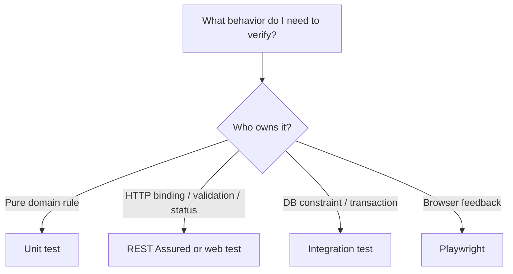

## 8. Typowe Błędy

- Unit test frameworkowego bindingu.
- REST test dla prostej metody domenowej bez potrzeby.
- Jeden test próbujący pokryć UI, security, DB i wszystkie edge cases.

## 9. Repo

Refactoring-derived decision: techniczny unit test ręcznego UUID parsing został usunięty, a malformed UUID pozostał w teście HTTP, bo odpowiedzialność należy do Spring bindingu.

## 10. Zasada Jakości

Test at the right level: test powinien być najniżej, gdzie daje wiarygodny sygnał, ale nie niżej niż odpowiedzialność zachowania.

## 11. QA/SDET

Senior SDET potrafi powiedzieć nie tylko „brakuje testu”, ale „ten test jest na złym poziomie”.

## 12. Pytania

- Kto jest właścicielem zachowania?
- Czy potrzebuję Spring MVC?
- Czy potrzebuję bazy?
- Czy test byłby stabilny bez pełnego stacka?

## 13. Mini Ćwiczenie

Dobierz poziom testu dla regex `MerchantReference`, malformed UUID i duplicate DB constraint.

## 14. Quiz

1. Regex value object najlepiej unit czy HTTP? Unit, plus wybrane HTTP contract tests.
2. Malformed UUID binding najlepiej HTTP czy pure unit? HTTP.
3. Unique constraint najlepiej unit czy integration? Integration/HTTP with DB.

## 15. Interview EN

**Question:** How do you decide whether a behavior belongs in a unit test or an HTTP test?  
**Answer:** I identify who owns the behavior. Pure domain rules fit unit tests, while HTTP binding, validation, security and status mapping should be verified at the web/HTTP level.

## 16. Zapamiętaj

Nie testuj frameworka w unit teście, jeśli zachowanie powstaje dopiero w frameworkowym request pipeline.

---

# Lesson 12 - Structure of a Good REST Assured Test

## 1. Tytuł PL + EN

PL: Struktura dobrego testu REST Assured  
EN: Structure of a good REST Assured test

## 2. Po Co Testerowi Ta Wiedza

Dobry test jest dokumentacją zachowania i narzędziem diagnozy. Zły test tylko wykonuje kod.

## 3. Intuicyjne Wyjaśnienie

Test ma mieć czytelne: przygotowanie danych, akcję HTTP, asercje kontraktu.

## 4. Słowniczek

| Pojęcie | Znaczenie |
|---|---|
| Arrange | przygotuj dane |
| Act | wykonaj akcję |
| Assert | sprawdź wynik |
| Oracle | źródło prawdy testu |
| Noise | techniczny szum ukrywający sens testu |

## 5. Minimalny Przykład

```java
String reference = uniqueMerchantReference("CREATE");

operatorRequest(port)
    .contentType(ContentType.JSON)
    .body(createMerchantBody(reference, "Created Merchant"))
.when()
    .post("/api/merchants")
.then()
    .statusCode(201)
    .body("merchantReference", equalTo(reference))
    .body("status", equalTo("DRAFT"));
```

## 6. Wyjaśnienie Linia Po Linii

- `uniqueMerchantReference(...)` przygotowuje izolowane dane testowe.
- `operatorRequest(port)` tworzy request z auth.
- `.contentType(...)` mówi, że wysyłamy JSON.
- `.body(...)` ustawia payload.
- `.post(...)` wykonuje akcję.
- `.statusCode(...)` i `.body(...)` są asercjami kontraktu.

## 7. Zły vs Lepszy Przykład

Zaszucony:

```java
given().port(port).auth().oauth2(token).contentType(JSON).body("{...}")
.when().post("/api/merchants")
.then().statusCode(201);
```

Lepszy:

```java
operatorRequest(port)
    .contentType(ContentType.JSON)
    .body(createMerchantBody(reference, "Created Merchant"))
.when()
    .post("/api/merchants")
.then()
    .statusCode(201)
    .body("merchantReference", equalTo(reference));
```

## 8. Typowe Błędy

- Setup dominuje nad sensem testu.
- Nazwa testu mówi o technice, nie zachowaniu.
- Helper ukrywa najważniejszą informację biznesową.

## 9. Repo

Refactoring testów HTTP zmniejszył powtarzanie `.port(port).auth().oauth2(...)` przez `operatorRequest(port)` i helper payloadu.

## 10. Zasada Jakości

DRY supports readability only when it removes noise, not intent.

## 11. QA/SDET

Reviewując test, pytaj: czy nowa osoba zrozumie, jakie zachowanie ma być chronione?

## 12. Pytania

- Czy nazwa testu opisuje zachowanie?
- Czy setup jest proporcjonalny?
- Czy asercje są biznesowo znaczące?

## 13. Mini Ćwiczenie

Wskaż w przykładzie linie Arrange, Act i Assert.

## 14. Quiz

1. Czy helper może być zły? Tak, jeśli ukrywa intent.
2. Czy DRY jest zawsze dobre w testach? Nie.
3. Co jest oracle w REST testach? API contract i oczekiwane zachowanie.

## 15. Interview EN

**Question:** What makes a REST Assured test maintainable?  
**Answer:** Clear Given/When/Then structure, readable test data, assertions tied to the API contract, minimal technical noise and helpers that reveal rather than hide intent.

## 16. Zapamiętaj

Dobry test REST Assured czyta się jak mała specyfikacja zachowania API.
