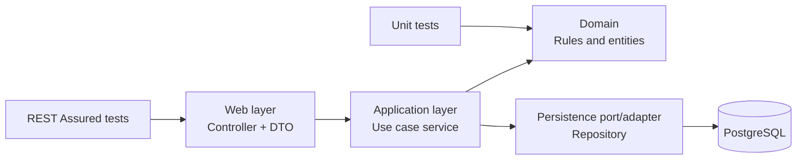
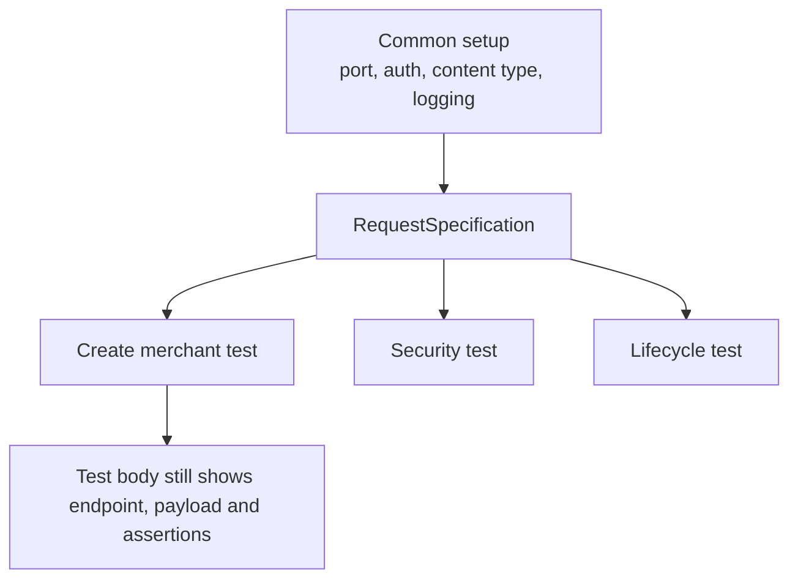
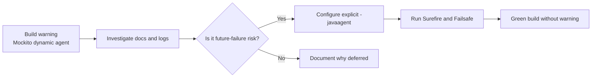

# Lessons 13-22 - Professional Practice After Refactoring

This lesson pack turns the recent backend/test refactoring into SDET learning material. The refactoring is treated as a case study: why cleaner architecture and cleaner REST Assured tests produce better failure signals and more maintainable test suites.

## Diagram - Request To Persistence With Testability Seams



## Diagram - Reusable REST Assured Spec



---

# Lesson 13 - Reusable `RequestSpecification`: Kiedy DRY Pomaga Testom

## 1. Tytuł PL + EN

PL: Reusable `RequestSpecification`: kiedy DRY pomaga testom  
EN: Reusable `RequestSpecification`: when DRY helps tests

## 2. Po Co Testerowi Ta Wiedza

Powtarzanie `.port(port).auth().oauth2(...)` w każdym teście tworzy szum. Reusable spec usuwa powtarzalny setup, ale nie powinien ukrywać celu testu.

## 3. Intuicyjne Wyjaśnienie

`RequestSpecification` to gotowy szablon requestu. Zamiast za każdym razem mówić „ten sam port, ten sam token”, tworzysz bazowy request i dopisujesz tylko różnice.

## 4. Słowniczek

| Pojęcie | Znaczenie |
|---|---|
| `RequestSpecification` | obiekt opisujący wspólny request setup |
| DRY | nie powtarzaj tego samego szumu |
| Intent | sens testu, którego helper nie może ukryć |

## 5. Minimalny Przykład

```java
public static RequestSpecification operatorRequest(int port) {
    return RestAssured.given()
            .port(port)
            .auth().oauth2(TestJwtSupport.platformOperatorToken());
}
```

## 6. Wyjaśnienie Kodu Linia Po Linii

- `public static` pozwala użyć helpera bez tworzenia obiektu.
- `RequestSpecification` jest typem zwracanym przez helper.
- `RestAssured.given()` zaczyna request DSL.
- `.port(port)` ustawia port randomowego Spring Boot test servera.
- `.auth().oauth2(...)` dodaje Bearer token.
- Zwrócona specyfikacja może dalej otrzymać `.contentType`, `.body`, `.when`.

## 7. Profesjonalny Przykład

Before:

```java
given().port(port).auth().oauth2(TestJwtSupport.platformOperatorToken())
.when().get("/api/merchants")
.then().statusCode(200);
```

After:

```java
operatorRequest(port)
.when().get("/api/merchants")
.then().statusCode(200);
```

## 8. Typowe Błędy Początkujących

- Wyciąganie wszystkiego do helpera, aż test nic nie mówi.
- Jeden globalny spec dla public, denied i operator requestów.
- Ukrywanie tokena/roli, gdy rola jest istotą testu.

## 9. Jak Ten Temat Pojawia Się W Repo

Refactoring testów HTTP wprowadza test support typu `MerchantApiTestSupport`, z helperami `publicRequest`, `operatorRequest`, `requestWithToken` oraz `createMerchantBody`.

## 10. Zasada Jakości

DRY + KISS: usuń powtarzalny setup, ale zostaw endpoint, payload i asercje widoczne w teście.

## 11. Perspektywa QA/SDET

Dobry helper poprawia diagnozę, bo awaria testu nie tonie w setupie. Zły helper ukrywa warunki testu.

## 12. Pytania

- Czy ten setup powtarza się w wielu testach?
- Czy helper ukrywa coś ważnego dla scenariusza?
- Czy mam osobne helpery dla różnych ról/security kontekstów?

## 13. Mini Ćwiczenie

Wskaż, które elementy można przenieść do speca: port, token, endpoint, expected status, payload.

## 14. Quiz

1. Czy endpoint powinien zwykle zostać w teście? Tak.
2. Czy auth setup może trafić do speca? Tak, jeśli nie ukrywa celu testu.
3. Czy DRY jest celem samym w sobie? Nie.

## 15. Interview EN

**Question:** When does a reusable RequestSpecification improve API tests?  
**Answer:** It improves tests when it removes repetitive technical setup while keeping the behavior under test visible: endpoint, request data and assertions.

## 16. Zapamiętaj

Specyfikacja ma redukować hałas, nie usuwać znaczenie testu.

---

# Lesson 14 - `RequestSpecBuilder` and `ResponseSpecBuilder`

## 1. Tytuł PL + EN

PL: `RequestSpecBuilder` i `ResponseSpecBuilder`  
EN: `RequestSpecBuilder` and `ResponseSpecBuilder`

## 2. Po Co Testerowi Ta Wiedza

Buildery pozwalają deklaratywnie zbudować wspólny setup i wspólne oczekiwania. Są profesjonalnym narzędziem, ale łatwo z nimi przesadzić.

## 3. Intuicyjne Wyjaśnienie

Builder to konstruktor konfiguracji. Zamiast składać spec przez długi chain w helperze, opisujesz elementy speca i na końcu wywołujesz `.build()`.

## 4. Słowniczek

| Pojęcie | Znaczenie |
|---|---|
| Builder | obiekt do konstruowania innego obiektu krok po kroku |
| Request spec | wspólny request setup |
| Response spec | wspólne oczekiwania response |
| Over-abstraction | helper/spec ukrywa za dużo |

## 5. Minimalny Przykład

```java
RequestSpecification jsonRequest = new RequestSpecBuilder()
        .setContentType(ContentType.JSON)
        .build();
```

## 6. Wyjaśnienie Kodu Linia Po Linii

- `new RequestSpecBuilder()` tworzy builder.
- `.setContentType(...)` dodaje wspólną konfigurację.
- `.build()` zwraca `RequestSpecification`.
- Tę specyfikację można użyć przez `.spec(jsonRequest)`.

## 7. Profesjonalny Przykład

```java
ResponseSpecification validationError = new ResponseSpecBuilder()
        .expectStatusCode(400)
        .expectBody("error", equalTo("validation"))
        .build();

operatorRequest(port)
    .contentType(ContentType.JSON)
    .body(createMerchantBody("AB", "Bad"))
.when()
    .post("/api/merchants")
.then()
    .spec(validationError);
```

## 8. Typowe Błędy

- Wspólna `ResponseSpecification` zbyt ogólna, np. tylko status.
- Helper ukrywa, który error code jest oczekiwany.
- Spec builder dodany dla jednego testu bez powodu.

## 9. Repo

Obecny test support może zacząć od prostych helperów. `RequestSpecBuilder` jest naturalnym następnym krokiem, jeśli wspólna konfiguracja urośnie o log config, base path, headers i content type.

## 10. Zasada Jakości

YAGNI: builder jest dobry, gdy konfiguracja realnie się powtarza i rośnie. Nie dodawaj pattern theatre.

## 11. QA/SDET

Response spec może być świetny dla wspólnego error contract, ale tylko jeśli nie ukrywa różnic między błędami 400, 401, 403, 404 i 409.

## 12. Pytania

- Czy ten spec ma przynajmniej kilka realnych zastosowań?
- Czy spec jest nazwany semantycznie?
- Czy spec ukrywa ważny status/error?

## 13. Mini Ćwiczenie

Zaprojektuj nazwę dla response speca walidacji create merchant.

## 14. Quiz

1. Co zwraca `.build()`? Gotowy spec.
2. Kiedy ResponseSpecification pomaga? Gdy wiele testów ma ten sam kontrakt odpowiedzi.
3. Kiedy szkodzi? Gdy ukrywa sens asercji.

## 15. Interview EN

**Question:** What is the risk of overusing ResponseSpecification?  
**Answer:** It can hide important assertions and make tests less readable, especially when different error cases require different contract checks.

## 16. Zapamiętaj

Buildery są narzędziem do czytelności, nie obowiązkowym etapem dojrzałości.

---

# Lesson 15 - Professional Logging in REST Assured

## 1. Tytuł PL + EN

PL: Profesjonalne logowanie w REST Assured  
EN: Professional logging in REST Assured

## 2. Po Co Testerowi Ta Wiedza

Gdy test pada w CI, logi muszą pomóc w diagnozie. Ale zielone testy nie powinny spamować, a sekrety nie mogą wyciekać.

## 3. Intuicyjne Wyjaśnienie

Najlepszy kompromis: loguj request/response tylko wtedy, gdy walidacja nie przejdzie, i maskuj wrażliwe nagłówki.

## 4. Słowniczek

| Pojęcie | Znaczenie |
|---|---|
| Logging on failure | logi tylko dla czerwonych testów |
| Header blacklist | ukrywanie wrażliwych nagłówków |
| CI logs | logi pipeline, które mogą być widoczne szerzej |

## 5. Minimalny Przykład

```java
given()
    .config(RestAssured.config().logConfig(
        logConfig().enableLoggingOfRequestAndResponseIfValidationFails()
    ));
```

## 6. Wyjaśnienie Kodu Linia Po Linii

- `.config(...)` ustawia konfigurację REST Assured.
- `RestAssured.config()` tworzy bazową konfigurację.
- `.logConfig(...)` ustawia konfigurację logowania.
- `enableLoggingOfRequestAndResponseIfValidationFails()` włącza logowanie tylko przy failure.
- `logConfig()` zwykle pochodzi ze static importu REST Assured config.

## 7. Profesjonalny Przykład

```java
LogConfig logConfig = logConfig()
        .blacklistHeader("Authorization")
        .enableLoggingOfRequestAndResponseIfValidationFails();
```

To chroni tokeny przed wypisaniem w logach.

## 8. Typowe Błędy

- `.log().all()` w każdym zielonym teście.
- Logowanie `Authorization` w CI.
- Brak logów przy failure, przez co trzeba odtwarzać błąd lokalnie.

## 9. Repo

Prompt refactoringowy wskazuje docelową praktykę: logging only on validation failure i blacklistowanie `Authorization` w test support.

## 10. Zasada Jakości

Security + diagnosability: testy mają być łatwe w diagnozie i bezpieczne dla sekretów.

## 11. QA/SDET

SDET dba nie tylko o asercje, ale też o operacyjność testów w pipeline.

## 12. Pytania

- Czy czerwony test daje wystarczająco danych do diagnozy?
- Czy tokeny są ukryte?
- Czy logi zielonych testów są ciche?

## 13. Mini Ćwiczenie

Wypisz dwa nagłówki, które mogą być wrażliwe w logach API tests.

## 14. Quiz

1. Kiedy najlepiej logować request/response? Przy validation failure.
2. Co maskować? `Authorization` i inne sekrety.
3. Czy `.log().all()` zawsze jest dobre? Nie.

## 15. Interview EN

**Question:** Why should API tests avoid logging Authorization headers?  
**Answer:** Authorization headers can contain access tokens; logging them may leak credentials in CI logs or shared artifacts.

## 16. Zapamiętaj

Dobre testy są diagnozowalne, ale nie gadatliwe i niebezpieczne.

---

# Lesson 16 - Test Data Design: `Map.of`, DTO, Builder, Fixture

## 1. Tytuł PL + EN

PL: Test data design: `Map.of`, DTO, builder, fixture  
EN: Test data design: `Map.of`, DTO, builder, fixture

## 2. Po Co Testerowi Ta Wiedza

Dane testowe decydują o czytelności i stabilności suite. Zły builder potrafi być gorszy niż prosta mapa.

## 3. Intuicyjne Wyjaśnienie

Wybierz najprostszy model danych, który nadal jasno pokazuje zamiar testu.

## 4. Słowniczek

| Technika | Kiedy pomaga |
|---|---|
| Raw JSON string | rzadko, dla dokładnego malformed JSON |
| `Map.of` | mały payload |
| record/DTO | większy lub typowany payload |
| Builder | wiele wariantów z domyślnymi wartościami |
| Fixture | wspólny gotowy obiekt/scenariusz |

## 5. Minimalny Przykład

```java
Map.of("merchantReference", reference, "displayName", "Acme")
```

## 6. Wyjaśnienie Kodu Linia Po Linii

- `Map.of` tworzy niemutowalną mapę.
- Pierwszy argument jest kluczem.
- Drugi argument jest wartością.
- REST Assured może zserializować mapę do JSON.

## 7. Profesjonalny Przykład

```java
record CreateMerchantPayload(String merchantReference, String displayName) {
    static CreateMerchantPayload valid(String reference) {
        return new CreateMerchantPayload(reference, "Example Merchant");
    }
}
```

## 8. Typowe Błędy

- Object Mother jako worek wszystkiego.
- Builder z 30 metodami dla prostego DTO.
- Dane magiczne bez nazw wyjaśniających intencję.

## 9. Repo

`createMerchantBody(reference, displayName)` jest dobrym KISS helperem dla obecnego małego payloadu. Jeśli payload urośnie, record/builder może być uzasadniony.

## 10. Zasada Jakości

Effective Java + KISS: preferuj proste, niemutowalne dane; abstrahuj dopiero przy realnej duplikacji.

## 11. QA/SDET

Czytelne dane testowe są częścią oracle. Test z `AB` powinien jasno mówić, że chodzi o short reference.

## 12. Pytania

- Czy dane pokazują powód testu?
- Czy helper nie ukrywa edge case?
- Czy potrzebuję domyślnych wartości?

## 13. Mini Ćwiczenie

Zaproponuj nazwę factory method dla valid merchant create payload.

## 14. Quiz

1. Kiedy raw JSON string ma sens? Przy malformed JSON albo dokładnym raw body.
2. Czy builder zawsze jest profesjonalny? Nie.
3. Co jest zaletą record? Typowany, czytelny, niemutowalny nośnik danych.

## 15. Interview EN

**Question:** How do you decide between `Map.of`, DTO and builder for REST Assured request bodies?  
**Answer:** I start with the simplest readable option. `Map.of` fits small payloads, DTOs fit typed reusable payloads, and builders fit many variants with meaningful defaults.

## 16. Zapamiętaj

Dane testowe mają wyjaśniać test, nie tylko go zasilać.

---

# Lesson 17 - Backend Architecture For Testers

## 1. Tytuł PL + EN

PL: Architektura backendu z perspektywy testera: Controller, DTO, Service, Domain  
EN: Backend architecture for testers: Controller, DTO, Service, Domain

## 2. Po Co Testerowi Ta Wiedza

Tester/SDET robi lepszy review, gdy widzi, czy kod produkcyjny wspiera testowalność, czy ją psuje.

## 3. Intuicyjne Wyjaśnienie

Warstwy powinny zależeć w jedną stronę: web woła application, application używa domain i persistence. Application nie powinno znać web DTO.

## 4. Słowniczek

| Warstwa | Odpowiedzialność |
|---|---|
| Web | HTTP, DTO, statusy, mapping |
| Application | use case orchestration |
| Domain | reguły biznesowe |
| Persistence | zapis/odczyt danych |

## 5. Minimalny Przykład Smell

```java
// smell: application layer returns web DTO
public MerchantResponse findById(UUID id) { ... }
```

## 6. Wyjaśnienie Kodu Linia Po Linii

- `MerchantResponse` należy do web/API contract.
- `findById` w application layer powinno raczej zwracać domenowy `Merchant` albo application DTO niezależny od web.
- Jeśli application zna web DTO, zależność idzie w złą stronę.
- Testy service zaczynają wtedy zależeć od kształtu HTTP response.

## 7. Profesjonalny Przykład

```java
// application
public Merchant findById(UUID id) { ... }

// web
var merchant = merchantService.findById(id);
return ResponseEntity.ok(MerchantMapper.toResponse(merchant));
```

## 8. Typowe Błędy

- Service zwraca web response DTO.
- Domain rzuca wyjątek zależny od HTTP.
- Controller zawiera reguły biznesowe.

## 9. Repo

Prompt refactoringowy wskazuje case study: `MerchantService` przestał zależeć od web DTO/mappera/web exception, a mapping domain -> DTO przeniesiono do `MerchantController`.

## 10. Zasada Jakości

DIP + SRP: wyższe reguły aplikacyjne nie powinny zależeć od szczegółów web adaptera.

## 11. QA/SDET

SDET powinien rozpoznać smell: test service zaczyna sprawdzać `MerchantResponse`, mimo że service nie jest HTTP adapterem.

## 12. Pytania

- Czy zależność idzie z web do application, czy odwrotnie?
- Czy test service musi importować web classes?
- Czy mapping API jest testowany na poziomie controllera/HTTP?

## 13. Mini Ćwiczenie

Wskaż, gdzie powinien mieszkać mapper domain -> response DTO.

## 14. Quiz

1. Czy application layer powinien znać `MerchantResponse`? Lepiej nie.
2. Gdzie należy mapping do HTTP response? Web layer.
3. Co daje lepsze layering? Lepszą testowalność i mniejsze sprzężenie.

## 15. Interview EN

**Question:** Why should application services avoid depending on web DTOs?  
**Answer:** It keeps the application layer independent from HTTP concerns, improves testability and allows other adapters to reuse the same use case without inheriting web-layer contracts.

## 16. Zapamiętaj

Tester architektury widzi kierunek zależności, bo zły kierunek szybko psuje testy.

---

# Lesson 18 - SOLID For Backend Testers

## 1. Tytuł PL + EN

PL: SOLID dla testera backendowego  
EN: SOLID for backend testers

## 2. Po Co Testerowi Ta Wiedza

SOLID nie jest tylko dla developerów. Dla testera oznacza: łatwiejsze testy, lepsza diagnoza, mniej regresji.

## 3. Intuicyjne Wyjaśnienie

Nie uczymy się definicji dla definicji. Patrzymy, jak zasady wpływają na testowalność.

## 4. Słowniczek

| Zasada | Tester widzi to jako |
|---|---|
| SRP | jedna klasa = jeden powód awarii |
| OCP | nowe zachowanie bez naruszania starego |
| LSP | podmiany typów nie łamią testów |
| ISP | małe kontrakty łatwiej mockować/testować |
| DIP | warstwy nie przeciekają |

## 5. Minimalny Przykład

```java
Controller -> Service -> Domain -> Repository
```

Jeśli Service importuje web DTO, DIP/SRP są podejrzane.

## 6. Wyjaśnienie Linia Po Linii

- Controller odpowiada za HTTP.
- Service odpowiada za use case.
- Domain odpowiada za reguły.
- Repository odpowiada za dane.
- Każdy test powinien móc celować w właściwą odpowiedzialność.

## 7. Profesjonalny Przykład

Refactoring-derived improvement:

- `MerchantService` zwraca domenowego `Merchant`.
- `MerchantController` mapuje `Merchant` do `MerchantResponse`.
- Testy service nie muszą znać web DTO.

## 8. Typowe Błędy

- SOLID jako checklist bez wpływu na testy.
- Nadmierne interfejsy bez potrzeby.
- Refactoring dla elegancji, nie dla konkretnego problemu.

## 9. Repo

Case study poprawia SRP, DIP i layering przez usunięcie zależności application -> web.

## 10. Zasada Jakości

SOLID + testability: zasady mają sens, gdy zmniejszają sprzężenie i poprawiają sygnał testów.

## 11. QA/SDET

Na review pytaj: czy testy są trudne, bo zachowanie jest trudne, czy dlatego, że design jest pomieszany?

## 12. Pytania

- Czy klasa ma więcej niż jedną odpowiedzialność?
- Czy testy muszą znać niepotrzebne szczegóły?
- Czy dependency direction jest prawidłowy?

## 13. Mini Ćwiczenie

Podaj przykład naruszenia SRP w controllerze.

## 14. Quiz

1. Która zasada mówi o jednej odpowiedzialności? SRP.
2. Która dotyczy kierunku zależności? DIP.
3. Czy SOLID zawsze oznacza więcej klas? Nie.

## 15. Interview EN

**Question:** How does SRP help testability?  
**Answer:** If a class has one clear responsibility, tests can target one reason to change and failures are easier to diagnose.

## 16. Zapamiętaj

SOLID dla SDET to heurystyka testowalności, nie akademicki rytuał.

---

# Lesson 19 - API Edge Validation vs Domain Rules

## 1. Tytuł PL + EN

PL: Walidacja na brzegu API vs reguły domenowe  
EN: API edge validation vs domain rules

## 2. Po Co Testerowi Ta Wiedza

Tester musi wiedzieć, czy błąd powinien zostać złapany przez DTO validation, domain validation czy DB constraint.

## 3. Intuicyjne Wyjaśnienie

DTO validation sprawdza formularz na wejściu. Domain validation sprawdza sens biznesowy po normalizacji. DB pilnuje finalnych niezmienników.

## 4. Słowniczek

| Warstwa | Przykład |
|---|---|
| DTO validation | `@NotBlank`, `@Size(min=3,max=64)` |
| Domain validation | trim, uppercase, regex |
| DB constraint | unique normalized reference |

## 5. Minimalny Przykład

```java
public record CreateMerchantRequest(
    @NotBlank @Size(min = 3, max = 64) String merchantReference,
    @NotBlank @Size(min = 2, max = 120) String displayName) {}
```

## 6. Wyjaśnienie Kodu Linia Po Linii

- `record` definiuje DTO.
- `@NotBlank` wymaga tekstu.
- `@Size(min = 3, max = 64)` łapie boundary na brzegu API.
- To nadal nie zastępuje `MerchantReference.from(...)`.

## 7. Profesjonalny Przykład

| Input | Layer | Expected |
|---|---|---|
| blank reference | DTO validation | 400 validation |
| `AB` | DTO/domain depending current mapping | 400 validation |
| `-ABC` | domain regex | 400 validation |
| duplicate normalized ref | service/DB | 409 conflict |

## 8. Typowe Błędy

- Cały regex tylko w frontendzie.
- Domain value object bez testów.
- Brak DB constraint dla unikalności.

## 9. Repo

Case study dodaje `@Size(min = 3, max = 64)` na `merchantReference`, ale zachowuje `MerchantReference.from(...)` dla trim/uppercase/regex.

## 10. Zasada Jakości

Defense in depth: walidacja na różnych warstwach chroni różne ryzyka.

## 11. QA/SDET

Projektuj testy: boundary values, equivalence partitions, normalized duplicates, concurrency/DB guardrail.

## 12. Pytania

- Która warstwa powinna złapać ten błąd?
- Czy testuję boundary 2/3/64/65?
- Czy duplikat po lowercase/uppercase jest pokryty?

## 13. Mini Ćwiczenie

Uzupełnij expected status dla `AB`, `ABC`, `A...65 chars`, `-ABC`, duplicate `merch-001`.

## 14. Quiz

1. Czy DTO validation zastępuje domain validation? Nie.
2. Co robi uppercase? Normalizuje reference.
3. Co chroni unique constraint? Spójność przy duplikatach i concurrency.

## 15. Interview EN

**Question:** Why keep domain validation if DTO validation already exists?  
**Answer:** DTO validation protects the API boundary, while domain validation protects business invariants regardless of how the domain is called.

## 16. Zapamiętaj

Walidacja na brzegu to filtr. Domena to źródło prawdy.

---

# Lesson 20 - Java 25 and Tooling Awareness

## 1. Tytuł PL + EN

PL: Java 25 i tooling awareness dla testera: warningi, Mockito agent, build hygiene  
EN: Java 25 and tooling awareness for testers: warnings, Mockito agent, build hygiene

## 2. Po Co Testerowi Ta Wiedza

Senior SDET czyta build logi. Warning może być przyszłym failure signal.

## 3. Intuicyjne Wyjaśnienie

Jeśli narzędzie testowe działa dzięki niejawnie tolerowanemu zachowaniu JVM, przyszła wersja JDK może to utrudnić. Lepsza jest jawna konfiguracja.

## 4. Słowniczek

| Pojęcie | Znaczenie |
|---|---|
| Java agent | mechanizm JVM pozwalający narzędziom instrumentować klasy |
| Dynamic agent loading | agent dołączany w runtime |
| Build hygiene | build bez istotnych ostrzeżeń i ukrytych zależności |
| Surefire/Failsafe | Maven plugins do testów unit/integration |

## 5. Minimalny Przykład

```xml
<argLine>-javaagent:${org.mockito:mockito-core:jar}</argLine>
```

## 6. Wyjaśnienie Kodu Linia Po Linii

- `<argLine>` przekazuje argumenty do JVM uruchamiającej testy.
- `-javaagent:` jawnie podłącza agenta.
- `${org.mockito:mockito-core:jar}` to property wskazujące jar Mockito.
- Konfiguracja w Surefire/Failsafe stabilizuje test runtime.

## 7. Profesjonalny Przykład

Refactoring-derived case study:

- wykryto warning Mockito self-attaching inline mock maker,
- dodano `maven-dependency-plugin:properties`,
- ustawiono jawny `-javaagent` dla Surefire i Failsafe,
- warningi dynamic agent loading zniknęły.

## 8. Typowe Błędy

- Ignorowanie warningów, bo build jest zielony.
- Traktowanie build tooling jako „nie moja sprawa testera”.
- Zbyt głębokie grzebanie w JVM bez celu.

## 9. Repo

Ta lekcja wiąże Java 25, Mockito i Maven test lifecycle z odpowiedzialnością SDET za stabilny pipeline.

## 10. Zasada Jakości

Future-proofing: zielony build z ważnymi warningami nie jest tak stabilny jak zielony build bez warningów.

## 11. QA/SDET

Tester ma widzieć build log jako źródło ryzyka, nie tylko pass/fail.

## 12. Pytania

- Czy warning może stać się failure po upgrade JDK?
- Czy konfiguracja testów jest jawna?
- Czy unit i integration tests używają spójnego runtime?

## 13. Mini Ćwiczenie

Napisz risk note dla dynamic agent loading warning.

## 14. Quiz

1. Czy warning można ignorować zawsze? Nie.
2. Co robi `-javaagent`? Podłącza agenta JVM.
3. Które pluginy uruchamiają testy unit i IT? Surefire i Failsafe.

## 15. Interview EN

**Question:** Why should a tester care about build warnings?  
**Answer:** Warnings often signal future failures or unstable tooling assumptions. A professional tester treats them as risk signals, especially on modern JDKs.

## 16. Zapamiętaj

SDET nie kończy na „testy przeszły”. SDET czyta też logi i warningi.

---

# Lesson 21 - Assessing Test Quality After Refactoring

## 1. Tytuł PL + EN

PL: Jak oceniać jakość testów po refactoringu  
EN: How to assess test quality after refactoring

## 2. Po Co Testerowi Ta Wiedza

Refactoring testów ma sens tylko wtedy, gdy poprawia czytelność, diagnozę lub pokrycie ryzyka. Krótszy test nie zawsze jest lepszy.

## 3. Intuicyjne Wyjaśnienie

Po refactoringu pytamy: czy test nadal jasno mówi, jakie zachowanie chroni i czy lepiej wykryje regresję?

## 4. Słowniczek

| Pojęcie | Znaczenie |
|---|---|
| Behavior assertion | sprawdzenie zachowania użytkowego/API |
| Technical noise | powtarzalny setup bez wartości poznawczej |
| Contract-focused | skupiony na obietnicy API |
| False negative | test pada bez realnej regresji |

## 5. Minimalny Przykład Kryterium

```text
Before: repeated port/auth setup in every test.
After: operatorRequest(port) removes noise, assertions remain visible.
```

## 6. Wyjaśnienie Linia Po Linii

- `Before` pokazuje problem.
- `After` pokazuje zmianę.
- Kluczowe: endpoint i asercje nie znikają.
- Jeśli znikają, helper jest zbyt agresywny.

## 7. Profesjonalna Checklista Skrócona

1. Czy test sprawdza zachowanie, nie implementację?
2. Czy test jest na właściwym poziomie?
3. Czy dane są czytelne?
4. Czy body jest stabilne?
5. Czy setup nie dominuje?
6. Czy assertions są jednoznaczne?
7. Czy auth i logowanie są bezpieczne?
8. Czy test zniesie rozsądne zmiany implementacji?

## 8. Typowe Błędy

- Refactoring usuwa asercje.
- Helpery ukrywają role/security.
- Testy stają się krótsze, ale mniej specyfikacyjne.

## 9. Repo

Refactoring HTTP tests uprościł setup przez helpery i Map payloads, a asercje kontraktowe nadal pozostały blisko requestu.

## 10. Zasada Jakości

Refactoring is behavior-preserving and signal-improving.

## 11. QA/SDET

Reviewuj testy jak produkt: co użytkownik/klient API dostaje, jakie ryzyko jest chronione, jak wygląda failure.

## 12. Pytania

- Co jest lepsze po zmianie?
- Czy coś ważnego zniknęło?
- Czy failure będzie łatwiejszy do zrozumienia?

## 13. Mini Ćwiczenie

Porównaj test przed i po helperze. Wskaż, co jest noise, a co intent.

## 14. Quiz

1. Czy krótszy test zawsze lepszy? Nie.
2. Co musi zostać widoczne? Zachowanie, dane, endpoint, oracle.
3. Czy refactoring testów może pogorszyć testy? Tak.

## 15. Interview EN

**Question:** How do you evaluate whether a test refactoring was successful?  
**Answer:** I check whether the test remains behavior-focused, has clearer data and assertions, reduces technical noise, improves diagnostics, and preserves or improves coverage of relevant risks.

## 16. Zapamiętaj

Dobry refactoring testów poprawia sygnał, nie tylko estetykę.

---

# Lesson 22 - Deferred Risks After Green Tests

## 1. Tytuł PL + EN

PL: Deferred risks: co dobry tester widzi po zakończonym tasku  
EN: Deferred risks: what a good tester sees after the task is green

## 2. Po Co Testerowi Ta Wiedza

Profesjonalny tester nie kończy analizy na „build green”. Zostawia świadome risk notes dla kolejnych iteracji.

## 3. Intuicyjne Wyjaśnienie

Nie wszystko trzeba naprawić teraz. Ale wszystko ważne powinno być nazwane: ryzyko, wpływ, kiedy wrócić.

## 4. Słowniczek

| Ryzyko | Znaczenie |
|---|---|
| Deferred risk | ryzyko świadomie odłożone |
| Risk note | krótka notatka co może pójść źle |
| Test debt | dług w testach |
| Security drift | role/uprawnienia rozjeżdżają się z oczekiwaniami |

## 5. Minimalny Przykład Risk Note

```text
Risk: ErrorResponse.details is Object.
Impact: clients may see inconsistent error detail shapes.
Follow-up: introduce typed validation error details when error contract grows.
```

## 6. Wyjaśnienie Linia Po Linii

- `Risk` nazywa problem.
- `Impact` mówi, czemu to ma znaczenie.
- `Follow-up` sugeruje moment lub kierunek powrotu.

## 7. Profesjonalne Przykłady Z Case Study

| Deferred risk | Why it matters |
|---|---|
| `ErrorResponse.details` as `Object` | flexible but weak contract for clients/tests |
| Incoming correlation id not constrained | possible log pollution or oversized header risk |
| Keycloak roles no allowlist | unexpected roles may become authorities |
| Ordered/static `MerchantPersistenceIT` | parallel execution and isolation risk |

## 8. Typowe Błędy

- Wszystko naprawiać od razu i rozdmuchać scope.
- Nic nie zapisać, bo testy przeszły.
- Risk note bez wpływu i follow-up.

## 9. Repo

Te deferred risks pochodzą z ostatniego refactoring review i są dobrym materiałem do nauki seniorowego myślenia QA.

## 10. Zasada Jakości

YAGNI + Risk Thinking: nie buduj hipotetycznej architektury teraz, ale nie ignoruj znanych ryzyk.

## 11. QA/SDET

SDET potrafi powiedzieć: „To nie blokuje merge, ale powinno być świadomie śledzone”.

## 12. Pytania

- Czy ryzyko jest realne czy hipotetyczne?
- Jaki ma wpływ?
- Kiedy warto wrócić?
- Czy potrzebuje testu, specyfikacji czy refactoringu?

## 13. Mini Ćwiczenie

Napisz risk note dla braku allowlisty ról w `KeycloakRealmRoleConverter`.

## 14. Quiz

1. Czy green build usuwa wszystkie ryzyka? Nie.
2. Czy każde ryzyko trzeba od razu naprawić? Nie.
3. Co powinien mieć risk note? Risk, impact, follow-up.

## 15. Interview EN

**Question:** What do you do with risks that are real but out of scope for the current refactoring?  
**Answer:** I document them with impact and a follow-up recommendation, so the team can make an informed decision without expanding the current scope unnecessarily.

## 16. Zapamiętaj

Senior QA nie tylko automatyzuje. Senior QA pomaga zespołowi widzieć ryzyka, timing i trade-offy.

## Diagram - Build Warning To Explicit Tooling Configuration


