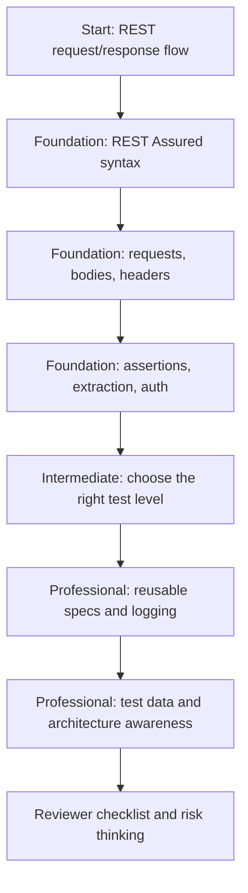

# REST Assured from Zero to Professional Backend API Testing

## Purpose

This path teaches REST Assured from the first mental model to professional backend API testing practice. Merchant Registry is used only as a real laboratory; the goal is not to memorize merchant business rules, but to learn how a backend SDET thinks about HTTP, contracts, test structure, data, security, architecture and build hygiene.

## Vault Audit Summary

Existing vault material already covered:

- Phase 1 Merchant Registry orientation and test-design themes.
- Spring Modulith merchant module architecture.
- Testing architecture baseline and parallel-readiness principles.
- A beginner-friendly request/response flow note: `REST API From Zero/Merchant Request and Response Flow.md`.

Missing material before this path:

- A true REST Assured course from zero.
- Line-by-line explanation of `given()`, `.when()`, `.then()` and chained calls.
- Request construction lessons: body, headers, path params, query params and content negotiation.
- Response assertion lessons with Hamcrest matchers and JSON path expressions.
- Extraction/deserialization lessons for scenario-style API tests.
- A bridge between beginner syntax and professional reusable specs.
- A checklist for reviewing backend API tests as an SDET.

Duplication avoided:

- The existing request/response flow note remains the conceptual flow note.
- This path focuses on REST Assured syntax, test design and refactoring-derived professional practices.
- Spring Modulith and Phase 1 notes are linked as context, not duplicated.

## How To Use This Path

Recommended order:

1. Read the existing flow note: `../REST API From Zero/Merchant Request and Response Flow.md`.
2. Study the foundation lessons in `01-12 REST Assured Foundations.md`.
3. Practice each lesson against `MerchantRestAssuredTest.java` and `MerchantSecurityTest.java`.
4. Study `13-22 Professional Practice After Refactoring.md`.
5. Use `Professional Backend API Testing Reviewer Checklist.md` for code review and self-review.
6. Revisit `Context7 Research Notes.md` when a tool/API detail feels uncertain.

## Lesson Map

| Lesson | Level | Title | Why it matters |
|---:|---|---|---|
| 1 | Foundation | What REST Assured Is | Places REST Assured in the backend testing toolbox |
| 2 | Foundation | `given()`, `when()`, `then()` | Builds the core mental model and syntax confidence |
| 3 | Foundation | HTTP Method, Endpoint, Content-Type and Accept | Teaches how request intent is expressed |
| 4 | Foundation | Path Params, Query Params and Headers | Teaches the three common input channels beyond body |
| 5 | Foundation | Request Body, JSON, `Map.of`, DTO and Serialization | Explains stable request payload construction |
| 6 | Foundation | Response Assertions | Teaches status, content type and body checks |
| 7 | Foundation | Nested Responses and Lists | Teaches assertions for collection-shaped API responses |
| 8 | Foundation | Extraction and Deserialization | Enables multi-step scenario tests |
| 9 | Foundation | Auth and Security Tests | Teaches 401, 403 and Bearer token testing |
| 10 | Foundation | Negative API Tests | Teaches validation, malformed input and error contracts |
| 11 | Intermediate | Choosing Test Level | Links behavior ownership to unit/HTTP/integration tests |
| 12 | Intermediate | Structure of a Good REST Assured Test | Turns syntax into readable test design |
| 13 | Professional Practice | Reusable `RequestSpecification` | Shows when DRY improves API tests |
| 14 | Professional Practice | Spec Builders | Shows declarative reusable test setup and expectations |
| 15 | Professional Practice | Professional Logging | Shows debugability without leaking secrets |
| 16 | Professional Practice | Test Data Design | Compares `Map.of`, records, builders and fixtures |
| 17 | Professional Practice | Backend Architecture for Testers | Teaches layering smells and testability consequences |
| 18 | Professional Practice | SOLID for Backend Testers | Translates SOLID into test review heuristics |
| 19 | Professional Practice | API Validation vs Domain Rules | Separates edge validation and business invariants |
| 20 | Professional Practice | Java 25 and Tooling Awareness | Teaches warning-driven build hygiene |
| 21 | Professional Practice | Assessing Tests After Refactoring | Provides quality criteria for API test refactoring |
| 22 | Professional Practice | Deferred Risks | Teaches residual-risk thinking after green builds |

## Mermaid Learning Map

## Files In This Learning Path

- `Context7 Research Notes.md`
- `01-12 REST Assured Foundations.md`
- `13-22 Professional Practice After Refactoring.md`
- `Professional Backend API Testing Reviewer Checklist.md`

## Related Existing Notes

- `knowledge-vault/02 Areas/Technical Learning/REST API From Zero/Merchant Request and Response Flow.md`
- `knowledge-vault/02 Areas/Business Product and Testing Thinking/Phase 1 Test Design.md`
- `knowledge-vault/02 Areas/Technical Learning/Spring Modulith/Merchant Module Architecture.md`
- `knowledge-vault/02 Areas/Technical Learning/Testing Architecture/Testing - Parallel Readiness Principles.md`
