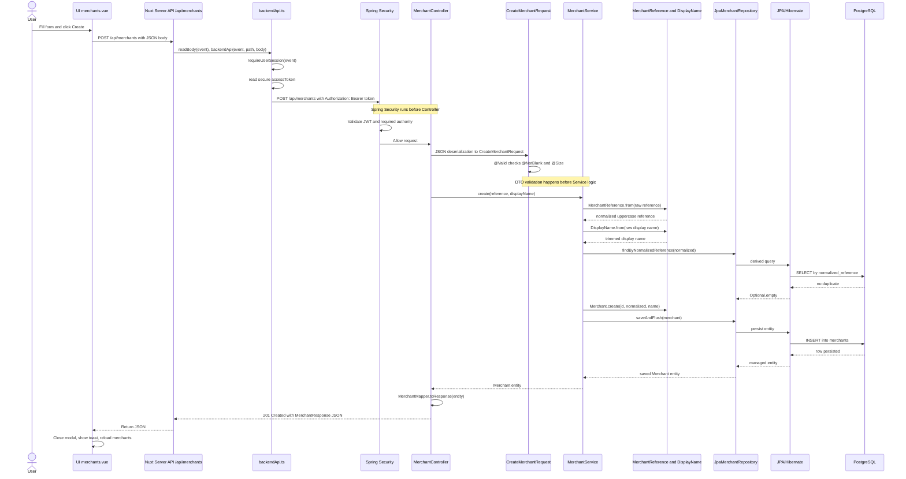
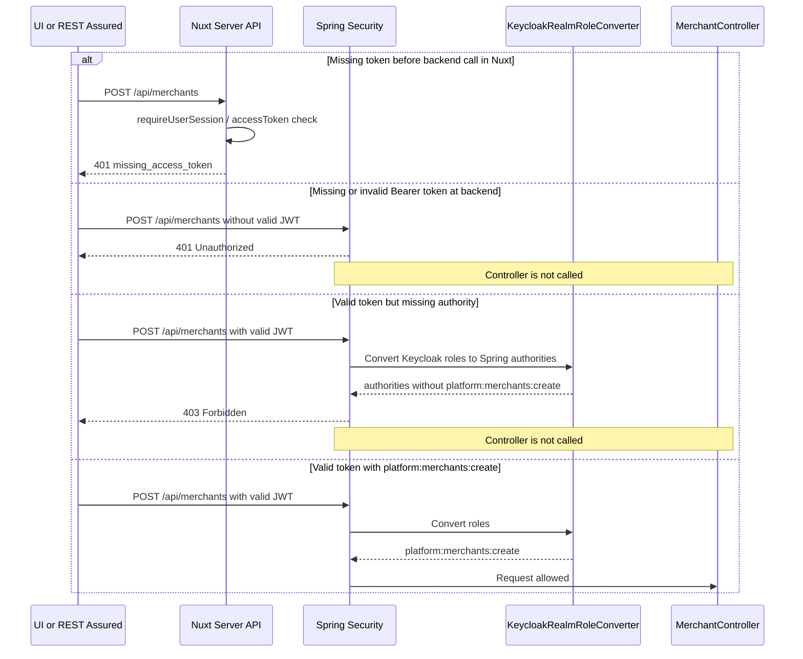

# REST API From Zero - Merchant Request and Response Flow

## Cel Lekcji

Ta lekcja wyjaśnia jeden pełny przepływ requestu i response'u w obecnym module **Merchant Registry**.

Będziemy śledzić akcję użytkownika: **Create merchant**.

Najważniejsze pytanie:

> Co dokładnie dzieje się od kliknięcia w UI aż do zapisu w PostgreSQL i powrotu odpowiedzi do ekranu?

Lekcja jest napisana dla początkującego testera automatyzującego. Nie zakłada, że znasz DTO, Service, Domain, Repository, JWT, Bearer token, Bean Validation, JPA albo REST Assured.

## Najważniejsza Korekta Mentalnego Modelu

Wcześniejsza sekwencja była prawie dobra:

```text
UI -> Nuxt server API -> Spring Security -> Controller -> DTO -> Validation -> Service -> Domain -> Repository -> PostgreSQL -> Response -> REST Assured
```

Trzeba ją poprawić na dwa osobne przepływy.

### Produkcyjny przepływ aplikacji

```text
UI
-> Nuxt Server API
-> Spring Security
-> Controller
-> DTO deserialization
-> DTO Validation
-> Service
-> Domain
-> Repository
-> JPA/Hibernate
-> PostgreSQL
-> Repository
-> Service
-> Mapper/Response DTO
-> Controller
-> Nuxt Server API
-> UI
```

### Testowy przepływ REST Assured

```text
REST Assured
-> Spring Security
-> Controller
-> DTO deserialization
-> DTO Validation
-> Service
-> Domain
-> Repository
-> JPA/Hibernate
-> PostgreSQL
-> Response
-> REST Assured assertions
```

REST Assured **nie jest częścią produkcyjnej aplikacji**. REST Assured jest klientem testowym. W testach backendu zastępuje UI oraz Nuxt Server API.

## Analogia Dla Całego Systemu

Wyobraź sobie firmę obsługującą formularz rejestracji merchanta.

| Element techniczny | Analogia | Rola |
|---|---|---|
| UI | okienko obsługi klienta | użytkownik wpisuje dane i klika przycisk |
| Nuxt Server API | recepcjonista/przekaźnik | odbiera request z UI i bezpiecznie przekazuje go dalej |
| `backendApi.ts` | recepcjonista z dostępem do sejfu | pobiera token z sesji i dodaje go do requestu |
| Spring Security | ochrona przy wejściu | sprawdza, czy request ma ważną przepustkę i odpowiednie uprawnienie |
| Controller | osoba przyjmująca formularz | odbiera request HTTP i przekazuje dane do procesu |
| DTO | formularz | prosty obiekt z danymi z JSON-a |
| DTO Validation | szybkie sprawdzenie formularza | czy pola są obecne i mają podstawową długość |
| Service | koordynator procesu | prowadzi cały przypadek użycia |
| Domain | regulamin biznesowy | mówi, co jest poprawnym merchant reference i statusem |
| Repository | pracownik archiwum | zapisuje i odczytuje dane |
| JPA/Hibernate | tłumacz Java-SQL | zamienia obiekty Java na operacje bazodanowe |
| PostgreSQL | magazyn danych | trwale przechowuje merchantów |
| Response DTO | potwierdzenie dla klienta | bezpieczny obiekt odpowiedzi, nie encja z bazy |
| REST Assured | tester z własnym klientem HTTP | wysyła requesty w testach backendu i sprawdza odpowiedzi |

## Pliki W Tej Lekcji

Czytaj je w tej kolejności:

1. `apps/frontend/app/pages/admin/merchants.vue`
2. `apps/frontend/server/api/merchants/index.post.ts`
3. `apps/frontend/server/utils/backendApi.ts`
4. `apps/backend/src/main/java/lab/paymentquality/shared/security/SecurityConfig.java`
5. `apps/backend/src/main/java/lab/paymentquality/shared/security/KeycloakRealmRoleConverter.java`
6. `apps/backend/src/main/java/lab/paymentquality/merchant/internal/web/MerchantController.java`
7. `apps/backend/src/main/java/lab/paymentquality/merchant/internal/web/CreateMerchantRequest.java`
8. `apps/backend/src/main/java/lab/paymentquality/merchant/internal/application/MerchantService.java`
9. `apps/backend/src/main/java/lab/paymentquality/merchant/internal/domain/MerchantReference.java`
10. `apps/backend/src/main/java/lab/paymentquality/merchant/internal/domain/DisplayName.java`
11. `apps/backend/src/main/java/lab/paymentquality/merchant/internal/infrastructure/JpaMerchantRepository.java`
12. `apps/backend/src/main/java/lab/paymentquality/merchant/internal/web/MerchantMapper.java`
13. `apps/backend/src/main/java/lab/paymentquality/merchant/internal/web/MerchantResponse.java`
14. `apps/backend/src/test/java/lab/paymentquality/rest/MerchantRestAssuredTest.java`

## Diagram 1 - Produkcyjny Przepływ Aplikacji

```mermaid
flowchart LR
    UI[UI: merchants.vue\nUser clicks Create] --> NuxtRoute[Nuxt Server API\n/api/merchants]
    NuxtRoute --> BackendApi[backendApi.ts\nreads session and access token]
    BackendApi --> Security[Spring Security\nBEFORE Controller\nvalidates JWT and authority]
    Security --> Controller[MerchantController\n@PostMapping]
    Controller --> Deserialize[JSON deserialization\nJSON -> CreateMerchantRequest]
    Deserialize --> DtoValidation[DTO Validation\n@Valid, @NotBlank, @Size\nBEFORE Service]
    DtoValidation --> Service[MerchantService\nuse case coordinator]
    Service --> Domain[Domain validation\nMerchantReference.from\nDisplayName.from]
    Domain --> Repository[JpaMerchantRepository]
    Repository --> Hibernate[JPA/Hibernate\nJava object <-> SQL]
    Hibernate --> DB[(PostgreSQL\nmerchants table)]
    DB --> HibernateBack[JPA/Hibernate\nmanaged entity]
    HibernateBack --> RepositoryBack[Repository returns entity]
    RepositoryBack --> ServiceBack[Service returns Merchant]
    ServiceBack --> Mapper[MerchantMapper\nEntity -> Response DTO]
    Mapper --> ResponseDto[MerchantResponse\nnot a database entity]
    ResponseDto --> ControllerBack[Controller returns 201]
    ControllerBack --> NuxtBack[Nuxt Server API returns JSON]
    NuxtBack --> UiBack[UI shows toast\nand reloads list]
```

Co tu jest bardzo ważne:

- Spring Security działa **przed** Controllerem.
- DTO Validation działa **przed** wejściem w logikę Service.
- Walidacja domenowa działa dopiero w Service/Domain.
- `MerchantResponse` to response DTO, a nie encja bazodanowa.
- REST Assured nie występuje w produkcyjnym przepływie.

## 1. Użytkownik Wykonuje Akcję W UI

Plik:

`apps/frontend/app/pages/admin/merchants.vue`

Użytkownik widzi ekran merchantów. Przycisk tworzenia merchanta ustawia flagę otwierającą modal:

```vue
<UButton
  v-if="!insufficientAuthority"
  icon="i-lucide-plus"
  aria-label="Create merchant"
  @click="showCreateModal = true"
/>
```

Potem formularz emituje zdarzenie `submit`:

```vue
<CreateMerchantForm
  :error="createError"
  :submitting="submittingCreate"
  @submit="createMerchant"
/>
```

Funkcja `createMerchant` wysyła lokalny request do Nuxt:

```ts
await $fetch('/api/merchants', {
  method: 'POST',
  body: {
    merchantReference: form.merchantReference,
    displayName: form.displayName
  }
})
```

Dla początkującego: `$fetch('/api/merchants')` w UI nie idzie od razu do Spring Boot. Najpierw idzie do lokalnego endpointu Nuxt Server API.

## 2. Nuxt Server API Odbiera Request

Plik:

`apps/frontend/server/api/merchants/index.post.ts`

Kod:

```ts
export default defineEventHandler(async (event) => {
  const body = await readBody(event)
  return backendApi(event, '/api/merchants', {
    method: 'POST',
    body
  })
})
```

Co tu się dzieje:

- `defineEventHandler` definiuje server-side [^1]handler Nuxt.
- `readBody(event)` czyta JSON wysłany przez UI.
- `backendApi(...)` przekazuje request do backendu Spring Boot.

Analogia: UI przynosi formularz do recepcji. Nuxt Server API jest recepcją. Recepcja nie załatwia całego biznesu, tylko przekazuje formularz do właściwego systemu.

## 3. `backendApi.ts` Pobiera Sesję I Dodaje Token

Plik:

`apps/frontend/server/utils/backendApi.ts`

Najważniejszy fragment:

```ts
const session = await requireUserSession(event)
const accessToken = session.secure?.accessToken
if (!accessToken) {
  throw createError({
    statusCode: 401,
    statusMessage: 'Authenticated session is missing a backend access token',
    data: { error: 'missing_access_token' }
  })
}

headers.Authorization = `Bearer ${accessToken}`
```

Pojęcia:

- **Session**: informacja po stronie Nuxt, że użytkownik jest zalogowany.
- **Access token**: krótko żyjący token, który backend może zweryfikować.
- **Bearer token**: sposób przekazania tokena w HTTP headerze.
- **Authorization header**: nagłówek requestu z tokenem.

Request do backendu wygląda logicznie tak:

```http
POST http://localhost:8080/api/merchants
Authorization: Bearer <access-token>
Content-Type: application/json

{
  "merchantReference": "MERCH-001",
  "displayName": "Acme Payments Inc."
}
```

Ważne bezpieczeństwo: token nie musi być ręcznie obsługiwany przez komponent UI. Nuxt Server API działa jako bezpieczny pośrednik.

## 4. Spring Security Działa Przed Controllerem

Plik:

`apps/backend/src/main/java/lab/paymentquality/shared/security/SecurityConfig.java`

Najważniejszy fragment:

```java
.requestMatchers(HttpMethod.POST, "/api/merchants")
.hasAuthority("platform:merchants:create")
```

To znaczy:

- request `POST /api/merchants` wymaga authority `platform:merchants:create`,
- jeśli token jest nieobecny albo błędny, request nie dojdzie do controllera,
- jeśli token jest poprawny, ale nie ma authority, request też nie dojdzie do controllera.

Spring Security jest jak ochrona przy wejściu do budynku. Controller jest za ochroną. Jeżeli ochrona zatrzyma request, Controller nawet go nie zobaczy.

### 401 vs 403

| Status | Znaczenie | Analogia |
|---|---|---|
| `401 Unauthorized` | nie masz ważnej przepustki | nie pokazałeś dokumentu albo dokument jest nieważny |
| `403 Forbidden` | masz przepustkę, ale nie masz dostępu do tego pokoju | jesteś pracownikiem, ale nie możesz wejść do archiwum |

## 5. Role Z Keycloak Stają Się Authorities Springa

Plik:

`apps/backend/src/main/java/lab/paymentquality/shared/security/KeycloakRealmRoleConverter.java`

Kod:

```java
return roles.stream()
        .filter(String.class::isInstance)
        .map(String.class::cast)
        .<GrantedAuthority>map(role -> new SimpleGrantedAuthority("platform:" + role))
        .toList();
```

Co to znaczy:

- JWT może zawierać role z Keycloak w claimie `realm_access.roles`.
- Converter bierze role, np. `merchants:create`.
- Dodaje prefix `platform:`.
- Spring widzi authority `platform:merchants:create`.

Dopiero wtedy `hasAuthority("platform:merchants:create")` może przepuścić request.

## Diagram 2 - Sequence Diagram: Create Merchant



## 6. Request Trafia Do `MerchantController`

Plik:

`apps/backend/src/main/java/lab/paymentquality/merchant/internal/web/MerchantController.java`

Metoda:

```java
@PostMapping
@PreAuthorize("hasAuthority('platform:merchants:create')")
public ResponseEntity<MerchantResponse> create(@Valid @RequestBody CreateMerchantRequest request) {
    var merchant = merchantService.create(request.merchantReference(), request.displayName());
    var response = MerchantMapper.toResponse(merchant);
    return ResponseEntity.status(HttpStatus.CREATED).body(response);
}
```

Pojęcia:

- `@RestController`: klasa obsługuje HTTP i zwraca dane jako JSON.
- `@RequestMapping("/api/merchants")`: wspólna ścieżka dla endpointów merchantów.
- `@PostMapping`: ta metoda obsługuje `POST /api/merchants`.
- `@PreAuthorize`: dodatkowa metoda-level security. Sprawdza authority.
- `ResponseEntity`: pozwala ustawić status HTTP i body.

Controller nie powinien zawierać logiki biznesowej. Controller jest jak osoba przyjmująca formularz. Nie decyduje sam, jakie są zasady biznesowe. Przekazuje dane do Service.

## 7. JSON Zamienia Się W DTO

Plik:

`apps/backend/src/main/java/lab/paymentquality/merchant/internal/web/CreateMerchantRequest.java`

Kod:

```java
public record CreateMerchantRequest(
        @NotBlank @Size(max = 64) String merchantReference,
        @NotBlank @Size(min = 2, max = 120) String displayName) {
}
```

Pojęcia:

- **JSON deserialization**: Spring bierze JSON z request body i tworzy z niego obiekt Java.
- **DTO**: Data Transfer Object. Prosty obiekt do przenoszenia danych między granicami systemu.
- `record`: nowoczesna Java do prostych, niemutowalnych obiektów danych.
- `@RequestBody`: mówi Springowi: weź dane z body requestu.

Przykład:

```json
{
  "merchantReference": "MERCH-001",
  "displayName": "Acme Payments Inc."
}
```

staje się logicznie:

```java
new CreateMerchantRequest("MERCH-001", "Acme Payments Inc.")
```

## 8. DTO Validation: `@Valid`, `@NotBlank`, `@Size`

W Controllerze:

```java
@Valid @RequestBody CreateMerchantRequest request
```

W DTO:

```java
@NotBlank @Size(max = 64) String merchantReference
@NotBlank @Size(min = 2, max = 120) String displayName
```

Pojęcia:

- **Bean Validation**: standard walidowania obiektów przez adnotacje.
- `@Valid`: uruchamia walidację obiektu.
- `@NotBlank`: pole nie może być `null`, puste albo złożone tylko ze spacji.
- `@Size`: sprawdza długość tekstu.

To jest pierwsza, brzegowa walidacja formularza.

Jeśli DTO validation się nie powiedzie, request nie powinien wejść w logikę Service. To jest jak odrzucenie formularza przy okienku, zanim trafi do koordynatora procesu.

## 9. Dlaczego Jest Druga Warstwa Walidacji W Domenie

DTO validation nie wystarcza, bo sprawdza tylko podstawowe reguły wejściowe. Reguły biznesowe są bogatsze.

### `MerchantReference.from(...)`

Plik:

`apps/backend/src/main/java/lab/paymentquality/merchant/internal/domain/MerchantReference.java`

Kod:

```java
String trimmed = raw.trim().toUpperCase(Locale.ROOT);
if (!PATTERN.matcher(trimmed).matches()) {
    throw new InvalidMerchantReferenceException(trimmed);
}
return new MerchantReference(trimmed);
```

Ta metoda:

- odrzuca `null`,
- usuwa spacje z początku i końca,
- zamienia litery na uppercase,
- sprawdza regex,
- zwraca bezpieczny value object.

Regex:

```text
^[A-Z0-9][A-Z0-9-]{1,62}[A-Z0-9]$
```

Znaczenie:

- pierwszy znak: wielka litera lub cyfra,
- środek: wielkie litery, cyfry lub myślniki,
- ostatni znak: wielka litera lub cyfra,
- razem długość 3-64,
- nie można zaczynać ani kończyć myślnikiem.

### `DisplayName.from(...)`

Plik:

`apps/backend/src/main/java/lab/paymentquality/merchant/internal/domain/DisplayName.java`

Kod:

```java
String trimmed = raw.trim();
if (trimmed.length() < 2 || trimmed.length() > 120) {
    throw new InvalidDisplayNameException(trimmed);
}
return new DisplayName(trimmed);
```

Ta metoda pilnuje reguły po trimie.

Przykład:

```text
" A " -> trim -> "A" -> długość 1 -> invalid
```

To jest ważne, bo `@Size(min = 2)` na DTO mogłoby patrzeć na tekst przed domenową normalizacją. Domena pilnuje prawdziwej reguły biznesowej.

## 10. `MerchantService` Orkiestruje Use Case

Plik:

`apps/backend/src/main/java/lab/paymentquality/merchant/internal/application/MerchantService.java`

Metoda:

```java
public Merchant create(String ref, String displayName) {
    MerchantReference normalizedRef = MerchantReference.from(ref);
    DisplayName validatedName = DisplayName.from(displayName);
    String normalized = normalizedRef.normalized();

    if (repository.findByNormalizedReference(normalized).isPresent()) {
        throw new DuplicateMerchantReferenceException(normalized);
    }

    UUID id = UUID.randomUUID();
    Merchant merchant;
    try {
        merchant = Merchant.create(id, normalized, validatedName.value());
        repository.saveAndFlush(merchant);
    } catch (DataIntegrityViolationException e) {
        throw new DuplicateMerchantReferenceException(normalized);
    }

    return merchant;
}
```

Service jest koordynatorem procesu:

- bierze dane z controllera,
- woła walidację domenową,
- sprawdza duplikat,
- tworzy encję domenową,
- zapisuje przez repository,
- tłumaczy database conflict na błąd biznesowy.

Dlaczego są dwa zabezpieczenia przed duplikatem?

1. `findByNormalizedReference` daje szybki, czytelny błąd biznesowy.
2. Unique constraint w bazie jest finalną ochroną przy równoległych requestach.

Jeśli dwa requesty przyjdą jednocześnie, oba mogą przejść pre-check. Baza danych nadal musi pilnować unikalności.

## 11. Co Należy Do Domain

Domain to miejsce na zasady biznesowe. Nie chodzi o techniczny transport JSON-a, tylko o prawdę biznesową systemu.

W tym module domain obejmuje między innymi:

- `MerchantReference`: co jest poprawnym merchant reference,
- `DisplayName`: co jest poprawną nazwą wyświetlaną,
- `Merchant`: encja reprezentująca merchanta,
- `MerchantStatus`: statusy lifecycle,
- reguły przejść statusów, np. `DRAFT -> ACTIVE`.

Plik:

`apps/backend/src/main/java/lab/paymentquality/merchant/internal/domain/Merchant.java`

Tworzenie merchanta:

```java
public static Merchant create(UUID merchantId, String normalizedReference, String displayName) {
    var m = new Merchant();
    m.merchantId = merchantId;
    m.normalizedReference = normalizedReference;
    m.displayName = displayName;
    m.status = MerchantStatus.DRAFT;
    m.createdAt = Instant.now();
    m.updatedAt = m.createdAt;
    return m;
}
```

Dlaczego nie trzymamy tego w Controllerze?

[^2]Bo Controller jest adapterem HTTP. Gdyby reguły biznesowe były w Controllerze, byłyby trudniejsze do testowania i łatwiejsze do ominięcia przez inny interfejs, np. przyszły batch job albo event handler.

## 12. Repository, JPA I Hibernate

Plik:

`apps/backend/src/main/java/lab/paymentquality/merchant/internal/infrastructure/JpaMerchantRepository.java`

Kod:

```java
public interface JpaMerchantRepository extends JpaRepository<Merchant, UUID> {

    Optional<Merchant> findByNormalizedReference(String ref);

    List<Merchant> findAllByOrderByCreatedAtDescMerchantIdAsc(Pageable pageable);
}
```

Pojęcia:

- **Repository**: obiekt do zapisu i odczytu danych.
- **JPA**: standard Java do mapowania obiektów na bazę danych.
- **Hibernate**: implementacja JPA używana przez Spring Boot.
- `JpaRepository<Merchant, UUID>`: gotowy zestaw operacji typu `save`, `findById`, `findAll`.
- `findByNormalizedReference`: Spring Data potrafi z nazwy metody zbudować query.

Repository nie powinno zawierać logiki biznesowej. Ono wie, jak znaleźć i zapisać dane, ale nie powinno decydować, czy merchant może zostać aktywowany albo jaki regex jest poprawny.

## 13. Jak Dane Trafiają Do PostgreSQL

`Merchant` jest encją JPA:

```java
@Entity
@Table(name = "merchants")
public class Merchant {
```

Pola encji są mapowane na kolumny:

```java
@Id
@Column(name = "merchant_id", nullable = false, updatable = false)
private UUID merchantId;

@Column(name = "normalized_reference", length = 64, nullable = false, unique = true)
private String normalizedReference;
```

Gdy Service wywołuje:

```java
repository.saveAndFlush(merchant);
```

JPA/Hibernate przygotowuje SQL `INSERT` do tabeli `merchants`. PostgreSQL zapisuje rekord. Jeśli `normalized_reference` już istnieje, PostgreSQL zgłosi naruszenie unique constraint, które Spring widzi jako `DataIntegrityViolationException`.

## 14. Jak Odpowiedź Wraca Do UI

Po zapisie odpowiedź wraca w drugą stronę:

```text
PostgreSQL
-> JPA/Hibernate+
-> Repository
-> Service
-> Controller
-> Mapper
-> MerchantResponse
-> Nuxt Server API
-> UI
```

Mapper:

`apps/backend/src/main/java/lab/paymentquality/merchant/internal/web/MerchantMapper.java`

```java
public static MerchantResponse toResponse(Merchant merchant) {
    return new MerchantResponse(
            merchant.getMerchantId(),
            merchant.getNormalizedReference(),
            merchant.getDisplayName(),
            merchant.getStatus().name(),
            merchant.getCreatedAt(),
            merchant.getUpdatedAt());
}
```

Response DTO:

`apps/backend/src/main/java/lab/paymentquality/merchant/internal/web/MerchantResponse.java`

```java
public record MerchantResponse(
        UUID merchantId,
        String merchantReference,
        String displayName,
        String status,
        Instant createdAt,
        Instant updatedAt) {
}
```

Ważne: `MerchantResponse` to nie encja bazodanowa. To obiekt odpowiedzi API. Dzięki temu nie wystawiamy automatycznie całego modelu persistence na zewnątrz.

## 15. Jak UI Reaguje Na Sukces I Błąd

Plik:

`apps/frontend/app/pages/admin/merchants.vue`

Sukces:

```ts
showCreateModal.value = false
formKey.value += 1
useToast().add({ title: 'Merchant created', color: 'primary' })
await loadMerchants()
```

UI:

- zamyka modal,
- resetuje formularz przez zmianę `formKey`,
- pokazuje toast `Merchant created`,
- odświeża listę merchantów.

Błąd duplikatu:

```ts
if (e?.statusCode === 409) {
  createError.value = 'A merchant with this reference already exists'
}
```

Błąd walidacji:

```ts
else if (e?.data?.error === 'validation') {
  createError.value = e.data.message || 'Invalid merchant data'
}
```

To jest ważne testersko: UI nie tylko wysyła request, ale też musi właściwie przetłumaczyć error response na komunikat dla użytkownika.

## Diagram 3 - Błędy Autoryzacji: 401 I 403



Najważniejsze:

- `401` oznacza problem z uwierzytelnieniem.
- `403` oznacza problem z autoryzacją.
- W obu przypadkach Controller nie wykonuje logiki biznesowej.

## Diagram 4 - Testowy Przepływ REST Assured

```mermaid
flowchart LR
    Test[REST Assured Test\nMerchantRestAssuredTest] --> Security[Spring Security\nvalidates test JWT]
    Security --> Controller[MerchantController]
    Controller --> Deserialize[JSON deserialization\nCreateMerchantRequest]
    Deserialize --> DtoValidation[DTO Validation\n@Valid before Service]
    DtoValidation --> Service[MerchantService]
    Service --> Domain[Domain validation\ntrim uppercase regex]
    Domain --> Repository[JpaMerchantRepository]
    Repository --> Hibernate[JPA/Hibernate]
    Hibernate --> DB[(PostgreSQL Testcontainer)]
    DB --> Response[Response DTO JSON]
    Response --> Assertions[REST Assured assertions\nstatus and body]

    UI[UI] -. omitted in backend test .- Test
    Nuxt[Nuxt Server API] -. omitted in backend test .- Test
```



REST Assured omija UI i Nuxt Server API. Testuje backend przez HTTP, ale startuje jako testowy klient zamiast przeglądarki.

## REST Assured W Obecnym Repo

Plik:

`apps/backend/src/test/java/lab/paymentquality/rest/MerchantRestAssuredTest.java`

Happy path:

```java
String id = createMerchant(reference, "Flow Merchant")
        .then()
        .statusCode(201)
        .body("merchantReference", equalTo(reference))
        .body("displayName", equalTo("Flow Merchant"))
        .body("status", equalTo("DRAFT"))
        .extract().path("merchantId");
```

Co robi ten test:

- wysyła `POST /api/merchants`,
- oczekuje `201`,
- sprawdza pola response,
- wyciąga `merchantId`,
- potem używa go do dalszych requestów.

Helper:

```java
private io.restassured.response.Response createMerchant(String reference, String displayName) {
    return given().port(port)
            .auth().oauth2(TestJwtSupport.platformOperatorToken())
            .contentType(ContentType.JSON)
            .body("""
                    {"merchantReference":"%s","displayName":"%s"}
                    """.formatted(reference, displayName))
    .when().post("/api/merchants");
}
```

REST Assured jest więc jak automatyczny tester, który umie wysłać request HTTP bez UI.

## Jedno Zdarzenie, Wiele Perspektyw

Ten sam request:

```http
POST /api/merchants
```

z body:

```json
{
  "merchantReference": "MERCH-001",
  "displayName": "Acme Payments Inc."
}
```

### Perspektywa Frontend Developera

Frontend developer pyta:

- Czy formularz wysyła poprawny JSON?
- Czy UI blokuje oczywiste błędy?
- Czy UI pokazuje loading state?
- Czy toast pojawia się po sukcesie?
- Czy błąd `409` zamienia się na jasny komunikat?

Najważniejszy plik:

`apps/frontend/app/pages/admin/merchants.vue`

### Perspektywa Backend Developera

Backend developer pyta:

- Czy endpoint ma poprawny kontrakt HTTP?
- Czy security blokuje nieuprawnione requesty?
- Czy DTO validation odrzuca błędny formularz?
- Czy Service pilnuje use case?
- Czy Domain pilnuje reguł biznesowych?
- Czy baza danych ma finalne constrainty?

Najważniejsze pliki:

- `MerchantController.java`
- `CreateMerchantRequest.java`
- `MerchantService.java`
- `MerchantReference.java`
- `DisplayName.java`
- `JpaMerchantRepository.java`

### Perspektywa Testera REST Assured

Tester pyta:

- Czy API zwraca `201` dla poprawnych danych?
- Czy response body ma oczekiwane pola?
- Czy `400` pojawia się dla invalid input?
- Czy `409` pojawia się dla duplikatu?
- Czy `401` i `403` są rozróżnione?
- Czy test data jest unikalna i parallel-safe?

Najważniejszy plik:

`apps/backend/src/test/java/lab/paymentquality/rest/MerchantRestAssuredTest.java`

### Perspektywa Architekta

Architekt pyta:

- Czy UI nie ma bezpośredniego dostępu do sekretów?
- Czy Nuxt Server API jest właściwym proxy do backendu?
- Czy Spring Security działa przed logiką biznesową?
- Czy warstwy mają jasne odpowiedzialności?
- Czy response DTO oddziela API contract od encji persistence?
- Czy domena nie przecieka do warstwy HTTP?

Najważniejsze pojęcia:

- separacja odpowiedzialności,
- granica zaufania,
- kontrakt API,
- warstwa domenowa,
- testowalność.

## Najczęstsze Pomyłki Początkujących

### 1. Mylenie DTO z encją

`CreateMerchantRequest` i `MerchantResponse` to DTO. Służą do komunikacji przez API.

`Merchant` to encja. Jest mapowana do tabeli `merchants`.

Nie powinno się automatycznie wystawiać encji jako API response.

### 2. Mylenie DTO validation z validation domenową

DTO validation odpowiada na pytanie:

> Czy formularz ma podstawowo poprawny kształt?

Domain validation odpowiada na pytanie:

> Czy ta wartość ma sens biznesowy po normalizacji?

### 3. Zakładanie, że Controller robi biznes

Controller nie powinien decydować o regułach merchanta. Controller ma odebrać request i przekazać go do Service.

### 4. Myślenie, że REST Assured jest częścią aplikacji produkcyjnej

REST Assured działa tylko w testach. W produkcji klientem jest UI przez Nuxt Server API albo inny prawdziwy klient HTTP.

### 5. Myślenie, że Repository zawiera logikę biznesową

Repository zapisuje i odczytuje dane. Nie powinno decydować, czy merchant reference jest poprawny biznesowo.

### 6. Myślenie, że JWT samo załatwia cały dostęp

JWT tylko niesie informacje. Spring Security musi go zweryfikować, a converter musi zamienić role na authorities. Potem reguły typu `hasAuthority` decydują, czy request przejdzie.

### 7. Ignorowanie drogi powrotnej response'u

Po zapisie w PostgreSQL response nie teleportuje się do UI. Wraca przez Repository, Service, Mapper, Controller, Nuxt Server API i dopiero UI.

## Jak Czytać Kod W Tej Kolejności W Repo

Praktyczna ścieżka nauki:

1. Zacznij od UI: `apps/frontend/app/pages/admin/merchants.vue`.
2. Zobacz lokalny Nuxt endpoint: `apps/frontend/server/api/merchants/index.post.ts`.
3. Zobacz proxy do backendu: `apps/frontend/server/utils/backendApi.ts`.
4. Przejdź do security: `apps/backend/src/main/java/lab/paymentquality/shared/security/SecurityConfig.java`.
5. Zobacz role converter: `apps/backend/src/main/java/lab/paymentquality/shared/security/KeycloakRealmRoleConverter.java`.
6. Przeczytaj Controller: `apps/backend/src/main/java/lab/paymentquality/merchant/internal/web/MerchantController.java`.
7. Przeczytaj request DTO: `apps/backend/src/main/java/lab/paymentquality/merchant/internal/web/CreateMerchantRequest.java`.
8. Przeczytaj Service: `apps/backend/src/main/java/lab/paymentquality/merchant/internal/application/MerchantService.java`.
9. Przeczytaj Domain: `MerchantReference.java`, `DisplayName.java`, `Merchant.java`.
10. Przeczytaj Repository: `apps/backend/src/main/java/lab/paymentquality/merchant/internal/infrastructure/JpaMerchantRepository.java`.
11. Przeczytaj Mapper i Response DTO: `MerchantMapper.java`, `MerchantResponse.java`.
12. Na końcu przeczytaj test REST Assured: `apps/backend/src/test/java/lab/paymentquality/rest/MerchantRestAssuredTest.java`.

Ta kolejność jest dobra dla początkującego, bo zaczyna od tego, co widzi użytkownik, a potem schodzi warstwa po warstwie do bazy danych i testów.

## Testerski Sposób Myślenia

Dla jednego endpointu `POST /api/merchants` warto sprawdzić:

| Ryzyko | Przykład testu |
|---|---|
| happy path | poprawny merchant daje `201` i `DRAFT` |
| walidacja DTO | blank field daje `400` |
| walidacja domenowa | `-ABC` daje `400` |
| normalizacja | ` merch-001 ` wraca jako `MERCH-001` |
| duplikat | drugi `MERCH-001` daje `409` |
| brak tokena | request bez JWT daje `401` |
| brak authority | token bez `platform:merchants:create` daje `403` |
| persistence | po zapisie można odczytać merchanta |

## Mini Ćwiczenie

Dla requestu:

```json
{
  "merchantReference": " merch-abc ",
  "displayName": " Acme Payments "
}
```

Odpowiedz:

1. Która warstwa usuwa spacje z `merchantReference`?
2. Która warstwa robi uppercase?
3. Która warstwa usuwa spacje z `displayName`?
4. Czy Controller powinien znać regex merchant reference?
5. Jaki status HTTP powinien wrócić przy sukcesie?
6. Czy REST Assured bierze udział w produkcyjnym requestcie?

Odpowiedzi:

1. `MerchantReference.from(...)` w domenie.
2. `MerchantReference.from(...)` w domenie.
3. `DisplayName.from(...)` w domenie.
4. Nie. Regex należy do domenowego value object, nie do controllera.
5. `201 Created`.
6. Nie. REST Assured jest klientem testowym.

## TL;DR

- UI wysyła request do lokalnego Nuxt endpointu `/api/merchants`.
- Nuxt Server API czyta body, bierze access token z sesji i przekazuje request do Spring Boot.
- Spring Security działa przed Controllerem i sprawdza JWT oraz authority.
- Controller odbiera JSON jako `CreateMerchantRequest`.
- `@Valid` uruchamia podstawową walidację DTO.
- Service prowadzi use case tworzenia merchanta.
- Domain pilnuje prawdziwych reguł biznesowych: trim, uppercase, regex, długości po trimie.
- Repository przez JPA/Hibernate zapisuje encję `Merchant` do PostgreSQL.
- Odpowiedź wraca jako `MerchantResponse`, nie jako encja.
- REST Assured nie jest częścią produkcji. W testach zastępuje UI i Nuxt Server API.

## 10 Pytań Sprawdzających Z Odpowiedziami

1. **Co robi UI w create merchant flow?**
   UI zbiera dane z formularza i wysyła `POST /api/merchants` do lokalnego Nuxt Server API.

2. **Dlaczego UI nie woła bezpośrednio Spring Boot?**
   Bo Nuxt Server API działa jako bezpieczny pośrednik, który może pobrać token z sesji i przekazać go do backendu.

3. **Co robi `backendApi.ts`?**
   Pobiera sesję, odczytuje access token, dodaje `Authorization: Bearer ...` i wysyła request do backendu Spring Boot.

4. **Kiedy działa Spring Security?**
   Przed Controllerem. Jeśli token lub authority są niepoprawne, Controller nie zostanie wywołany.

5. **Czym różni się 401 od 403?**
   `401` oznacza brak lub nieważny token. `403` oznacza ważny token, ale brak wymaganego uprawnienia.

6. **Co to jest DTO?**
   Prosty obiekt do przenoszenia danych przez granicę API, np. `CreateMerchantRequest`.

7. **Co robi `@RequestBody`?**
   Mówi Springowi, żeby zamienił JSON z body requestu na obiekt Java.

8. **Co robi `@Valid`?**
   Uruchamia walidację DTO na podstawie adnotacji takich jak `@NotBlank` i `@Size`.

9. **Dlaczego mamy walidację domenową oprócz DTO validation?**
   Bo domena musi pilnować reguł biznesowych po normalizacji, np. trim, uppercase i regex merchant reference.

10. **Czym jest REST Assured w tym projekcie?**
    Klientem testowym HTTP używanym w testach backendu. Nie jest częścią produkcyjnego request flow.

## 5 Pytań Rekrutacyjnych Po Angielsku Z Odpowiedziami

1. **Question:** What is the difference between request DTO validation and domain validation?
   **Answer:** Request DTO validation checks the basic shape of incoming data at the API boundary, such as blank fields or length limits. Domain validation enforces business rules after normalization, such as valid merchant reference format and trimmed display names.

2. **Question:** Why should Spring Security run before the controller?
   **Answer:** Security must reject unauthenticated or unauthorized requests before business logic is executed. This prevents controllers and services from processing requests that should not be allowed.

3. **Question:** Why is REST Assured not part of the production request flow?
   **Answer:** REST Assured is a test client. In backend tests it sends HTTP requests directly to the Spring Boot application, replacing the browser UI and Nuxt Server API.

4. **Question:** Why should an API return a response DTO instead of a JPA entity?
   **Answer:** A response DTO keeps the public API contract separate from the persistence model. It avoids leaking internal fields and allows the database model to evolve independently from the API response.

5. **Question:** Why do we need both a duplicate pre-check and a database unique constraint?
   **Answer:** The pre-check gives a clear business error in normal cases, while the database unique constraint is the final consistency guardrail under concurrent requests.

## Mini Checklista: Czy Rozumiem Ten Flow?

- [ ] Umiem wyjaśnić, co robi UI po kliknięciu `Create merchant`.
- [ ] Umiem powiedzieć, dlaczego request trafia najpierw do Nuxt Server API.
- [ ] Umiem wyjaśnić, po co `backendApi.ts` dodaje `Authorization: Bearer ...`.
- [ ] Umiem rozróżnić `401` i `403`.
- [ ] Umiem wskazać, że Spring Security działa przed Controllerem.
- [ ] Umiem wyjaśnić, czym jest `CreateMerchantRequest`.
- [ ] Umiem powiedzieć, co robi `@RequestBody`.
- [ ] Umiem powiedzieć, co robi `@Valid`.
- [ ] Umiem odróżnić DTO validation od domain validation.
- [ ] Umiem wyjaśnić rolę `MerchantService`.
- [ ] Umiem wyjaśnić rolę `MerchantReference` i `DisplayName`.
- [ ] Umiem powiedzieć, że Repository nie zawiera logiki biznesowej.
- [ ] Umiem opisać, jak JPA/Hibernate zapisuje encję do PostgreSQL.
- [ ] Umiem wyjaśnić, dlaczego `MerchantResponse` nie jest encją.
- [ ] Umiem powiedzieć, że REST Assured omija UI i Nuxt Server API.

## Linki Do Powiązanych Notatek

- `knowledge-vault/01 Projects/Payment_Quality_Engineering_Lab/01 Phase 1 - Merchant Registry/Phase 1 - Merchant Registry and Activation.md`
- `knowledge-vault/02 Areas/Business Product and Testing Thinking/Phase 1 Test Design.md`
- `knowledge-vault/02 Areas/Technical Learning/Spring Modulith/Merchant Module Architecture.md`

[^1]: Czym jest handler

[^2]: Do wyjaśnienia bardziej
