# Lekcja 01 - REST API od zera: przeplyw request/response merchanta / REST API From Zero: Merchant Request and Response Flow

## 1. Tytuł PL + EN

PL: REST API od zera - przeplyw requestu i response'u dla tworzenia merchanta.

EN: REST API From Zero - merchant request and response flow.

Ta lekcja tlumaczy jeden realny przeplyw w istniejacym kodzie Payment Quality Engineering Lab: uzytkownik lub test wysyla request utworzenia merchanta, backend sprawdza security i walidacje, zapisuje encje w PostgreSQL, a response wraca do klienta.

Nie dodajemy tu nowej funkcjonalnosci biznesowej. Uczymy sie na istniejacym module Merchant Registry.

## 2. Gdzie ta lekcja znajduje się w ścieżce nauki

To jest pierwsza praktyczna lekcja przed glebokim wejsciem w REST Assured.

Kolejnosc nauki w tej czesci labu:

1. Zrozumiec repo, build, scope i roadmap: `knowledge-vault/01 Projects/Payment_Quality_Engineering_Lab/Payment Gateway SDET Learning Plan.md`.
2. Przerobic te lekcje: `REST API From Zero - Merchant Request and Response Flow`.
3. Przejsc do `REST Assured lesson 1 - What REST Assured Is` w `knowledge-vault/02 Areas/Technical Learning/JUnit REST Assured/REST Assured from Zero to Professional Backend API Testing/01-12 REST Assured Foundations.md`.
4. Dopiero pozniej uczyc sie glebiej `given()`, `.when()`, `.then()`, request body, assertions, extraction, auth i negative tests.

Ta lekcja jest lekcja oparta na istniejacym kodzie, nie sprintem implementacyjnym.

## 3. Po co testerowi/SDET ta wiedza

Tester API nie testuje tylko tekstu JSON. Tester musi rozumiec, co request uruchamia w systemie.

Ta wiedza pomaga:

- odroznic blad UI od bledu backendu,
- zrozumiec, dlaczego `401`, `403`, `400`, `409` i `201` oznaczaja rozne ryzyka,
- wybrac wlasciwy poziom testu: REST API, security, domain, repository albo UI,
- projektowac dane testowe, ktore sa unikalne i bezpieczne przy rownoleglych testach,
- czytac kod backendu bez znajomosci calego Springa,
- opowiedziec na rozmowie technicznej, jak SDET trace'uje request przez warstwy aplikacji.

Najwazniejsza historia rekrutacyjna z tej lekcji: **I can trace an API request through frontend proxy, security, controller, validation, service, domain, repository, database and response assertions.**

## 4. Co już powinienem wiedzieć przed tą lekcją

Poprzednia wiedza wymagana: brak. To pierwsza praktyczna lekcja.

Wystarczy, ze rozumiesz bardzo ogolnie:

- przegladarka lub klient HTTP wysyla request,
- backend zwraca response,
- JSON to tekstowy format danych,
- test automatyczny moze wyslac request zamiast czlowieka.

Nie musisz jeszcze znac Spring, JPA, DTO, JWT, REST Assured ani SQL. Wszystkie pojecia sa wytlumaczone ponizej i przypiete do realnych plikow repo.

## Sprint Learning Matrix

| Sekcja | Odpowiedz |
|---|---|
| Business capability | Create merchant request/response flow |
| Previous knowledge refresh | Brak, to pierwsza praktyczna lekcja |
| New learning focus | HTTP request -> backend -> response -> assertion |
| Java 25 focus | `record`/DTO, metody, wyjatki na poziomie rozpoznawania |
| Spring focus | Controller, DTO binding, validation, service delegation |
| SQL/PostgreSQL focus | Repository zapisuje encje do tabeli `merchants` |
| REST Assured focus | REST Assured jako testowy klient HTTP, jeszcze bez glebokiej skladni |
| Security/Keycloak focus | JWT/Bearer token i Spring Security jako brama requestu |
| Test design focus | Happy path, validation error, duplicate error, auth denial |
| Test data focus | Unikalny `merchantReference` |
| Test layers | REST API test, domain test, repository test, security test |
| Vault output | Rozbudowana lekcja REST API From Zero |
| Interview story | How I trace an API request through backend layers |

## 5. Intuicyjne wyjaśnienie od zera

Wyobraz sobie, ze rejestrujesz nowego merchanta w firmie.

Przeplyw biznesowy wyglada tak:

1. Wypelniasz formularz.
2. Recepcja sprawdza, czy jestes zalogowany i przekazuje formularz dalej.
3. Ochrona sprawdza, czy masz prawo wejsc do procesu.
4. Pracownik przyjmuje formularz i sprawdza, czy podstawowe pola sa obecne.
5. Koordynator procesu sprawdza reguly biznesowe.
6. Archiwum zapisuje dane.
7. Dostajesz potwierdzenie.

W kodzie to samo wyglada tak:

```text
UI -> Nuxt Server API -> Spring Security -> Controller -> DTO -> Validation -> Service -> Domain -> Repository -> PostgreSQL -> Response
```

W tescie REST Assured UI i Nuxt nie biora udzialu. Test jest klientem HTTP:

```text
REST Assured -> Spring Security -> Controller -> DTO -> Service -> Repository -> PostgreSQL -> assertions
```

Najwazniejsze rozroznienie: REST Assured nie jest czescia produkcyjnej aplikacji. REST Assured jest narzedziem testowym, ktore potrafi wyslac request do backendu i sprawdzic response.

## 6. Słowniczek pojęć

| Pojecie | Proste znaczenie | Realny plik w repo |
|---|---|---|
| HTTP request | Wiadomosc wyslana do backendu | `apps/frontend/app/pages/admin/merchants.vue` |
| HTTP response | Odpowiedz backendu z kodem statusu i body | `apps/backend/src/main/java/lab/paymentquality/merchant/internal/web/MerchantResponse.java` |
| Endpoint | Adres i metoda API, np. `POST /api/merchants` | `MerchantController.java` |
| JSON | Format danych w request/response | request body w UI i REST Assured tests |
| DTO | Prosty obiekt do przenoszenia danych przez API | `CreateMerchantRequest.java`, `MerchantResponse.java` |
| Binding | Zamiana JSON-a na obiekt Java | `@RequestBody CreateMerchantRequest` |
| Validation | Sprawdzenie poprawnosci danych | `@Valid`, `@NotBlank`, `@Size`, value objects |
| Controller | Warstwa HTTP, ktora odbiera request | `MerchantController.java` |
| Service | Warstwa koordynujaca przypadek uzycia | `MerchantService.java` |
| Domain | Reguly biznesowe i model | `Merchant.java`, `MerchantReference.java`, `DisplayName.java` |
| Repository | Warstwa zapisu i odczytu danych | `JpaMerchantRepository.java` |
| JPA/Hibernate | Mechanizm mapowania obiektow Java na SQL | `Merchant.java` plus Spring Data JPA |
| PostgreSQL | Baza danych przechowujaca rekordy | `V1__create_merchants.sql` |
| JWT | Token z informacja o tozsamosci i rolach | `SecurityConfig.java`, `KeycloakRealmRoleConverter.java` |
| Bearer token | Sposob przekazania JWT w naglowku HTTP | `Authorization: Bearer <token>` |
| Authority | Uprawnienie widziane przez Spring Security | `platform:merchants:create` |
| REST Assured | Biblioteka Java do testowania HTTP API | `MerchantRestAssuredTest.java` |
| Assertion | Sprawdzenie w tescie, np. status/body | `.statusCode(201)`, `.body(...)` |

## 7. Minimalny przykład request/response

Minimalny request HTTP:

```http
POST /api/merchants HTTP/1.1
Authorization: Bearer <access-token>
Content-Type: application/json

{
  "merchantReference": "MERCH-001",
  "displayName": "Acme Payments Inc."
}
```

Minimalny response przy sukcesie:

```http
HTTP/1.1 201 Created
Content-Type: application/json

{
  "merchantId": "4d45c7e4-25b6-45fd-9b6a-9c7d8ec00f11",
  "merchantReference": "MERCH-001",
  "displayName": "Acme Payments Inc.",
  "status": "DRAFT",
  "createdAt": "2026-05-21T15:20:00Z",
  "updatedAt": "2026-05-21T15:20:00Z"
}
```

Minimalny testowy sens tego przykladu:

- request tworzy merchanta,
- backend zwraca `201 Created`,
- response zawiera ID, normalized reference, display name i poczatkowy status `DRAFT`.

## 8. Wyjaśnienie przykładu linia po linii

`POST /api/merchants HTTP/1.1` oznacza: klient chce utworzyc zasob merchanta przez endpoint `/api/merchants`.

`Authorization: Bearer <access-token>` oznacza: klient pokazuje token. Backend nie ufa samemu tekstowi tokena. Spring Security musi go zweryfikowac.

`Content-Type: application/json` oznacza: body requestu jest JSON-em.

`merchantReference` to techniczno-biznesowy identyfikator merchanta. Domena normalizuje go przez trim i uppercase, a potem sprawdza regex.

`displayName` to nazwa widoczna dla operatora. Domena robi trim i pilnuje dlugosci 2-120 znakow po trimie.

`HTTP/1.1 201 Created` oznacza: zasob zostal utworzony. Dla create flow `201` jest bardziej precyzyjne niz `200`.

`merchantId` to UUID wygenerowany w `MerchantService`.

`merchantReference` w odpowiedzi to wartosc po normalizacji, np. ` merch-001 ` moze wrocic jako `MERCH-001`.

`status: DRAFT` oznacza, ze nowo utworzony merchant nie jest jeszcze aktywny. To nie jest payment flow. To tylko stan merchanta w Merchant Registry.

`createdAt` i `updatedAt` sa timestampami z encji `Merchant`.

## 9. Bardziej profesjonalny przykład z obecnego repo

Fragment testu z `apps/backend/src/test/java/lab/paymentquality/rest/MerchantRestAssuredTest.java`:

```java
String reference = uniqueMerchantReference("FLOW");

String id = createMerchant(reference, "Flow Merchant")
        .then()
        .statusCode(201)
        .body("merchantReference", equalTo(reference))
        .body("displayName", equalTo("Flow Merchant"))
        .body("status", equalTo("DRAFT"))
        .extract().path("merchantId");
```

Co jest profesjonalniejsze niz minimalny przyklad:

- `uniqueMerchantReference("FLOW")` zmniejsza ryzyko konfliktu danych testowych,
- test sprawdza nie tylko status HTTP, ale tez pola response body,
- `merchantId` jest wyciagany z response i moze byc uzyty w kolejnych requestach,
- test uczy multi-step API flow bez UI.

Helper wysylajacy request korzysta z REST Assured:

```java
private io.restassured.response.Response createMerchant(String reference, String displayName) {
    return operatorRequest(port)
            .contentType(ContentType.JSON)
            .body(createMerchantBody(reference, displayName))
    .when().post("/api/merchants");
}
```

Na tym etapie nie musisz znac calej skladni REST Assured. Wystarczy mentalny model:

- przygotuj request,
- wyslij `POST /api/merchants`,
- sprawdz response.

## 10. Jak ten temat pojawia się w obecnym kodzie aplikacji

Diagram produkcyjny:

```mermaid
flowchart LR
    UI[UI: merchants.vue] --> Nuxt[Nuxt Server API: index.post.ts]
    Nuxt --> BackendApi[backendApi.ts: session and Bearer token]
    BackendApi --> Security[Spring Security: JWT and authority]
    Security --> Controller[MerchantController: POST /api/merchants]
    Controller --> DTO[CreateMerchantRequest: JSON to Java record]
    DTO --> Validation[Validation: @Valid, @NotBlank, @Size]
    Validation --> Service[MerchantService: create use case]
    Service --> Domain[Domain: MerchantReference, DisplayName, Merchant]
    Domain --> Repository[JpaMerchantRepository]
    Repository --> Postgres[(PostgreSQL: merchants table)]
    Postgres --> Response[MerchantResponse JSON]
    Response --> NuxtBack[Nuxt returns response]
    NuxtBack --> UIBack[UI toast and reload]
```



Diagram testowy:

```mermaid
flowchart LR
    RA[REST Assured test] --> Security[Spring Security: test JWT]
    Security --> Controller[MerchantController]
    Controller --> DTO[CreateMerchantRequest]
    DTO --> Validation[DTO validation]
    Validation --> Service[MerchantService]
    Service --> Domain[Domain validation and entity]
    Domain --> Repository[JpaMerchantRepository]
    Repository --> Postgres[(PostgreSQL Testcontainer)]
    Postgres --> Response[HTTP response]
    Response --> Assertions[REST Assured assertions]
```



Najwazniejsze pliki i odpowiedzialnosci:

| Plik | Co robi w flow |
|---|---|
| `apps/frontend/app/pages/admin/merchants.vue` | Otwiera modal, zbiera formularz i wysyla `$fetch('/api/merchants')` |
| `apps/frontend/server/api/merchants/index.post.ts` | Czyta body z UI i przekazuje je do backendu przez `backendApi` |
| `apps/frontend/server/utils/backendApi.ts` | Pobiera sesje, odczytuje access token i dodaje `Authorization: Bearer ...` |
| `apps/backend/src/main/java/lab/paymentquality/shared/security/SecurityConfig.java` | Wymaga `platform:merchants:create` dla `POST /api/merchants` |
| `apps/backend/src/main/java/lab/paymentquality/shared/security/KeycloakRealmRoleConverter.java` | Zamienia role Keycloak na Spring authorities z prefixem `platform:` |
| `apps/backend/src/main/java/lab/paymentquality/merchant/internal/web/MerchantController.java` | Odbiera `POST`, uruchamia `@Valid`, deleguje do service i zwraca `201` |
| `apps/backend/src/main/java/lab/paymentquality/merchant/internal/web/CreateMerchantRequest.java` | Request DTO jako Java `record` z `@NotBlank` i `@Size` |
| `apps/backend/src/main/java/lab/paymentquality/merchant/internal/web/MerchantResponse.java` | Response DTO zwracane jako JSON |
| `apps/backend/src/main/java/lab/paymentquality/merchant/internal/application/MerchantService.java` | Koordynuje create use case, duplicate check, zapis i obsluge konfliktu DB |
| `apps/backend/src/main/java/lab/paymentquality/merchant/internal/domain/Merchant.java` | Encja domenowa i JPA, startowy status `DRAFT` |
| `apps/backend/src/main/java/lab/paymentquality/merchant/internal/domain/MerchantReference.java` | Value object: trim, uppercase, regex, 3-64 znaki |
| `apps/backend/src/main/java/lab/paymentquality/merchant/internal/domain/DisplayName.java` | Value object: trim i dlugosc 2-120 znakow |
| `apps/backend/src/main/java/lab/paymentquality/merchant/internal/infrastructure/JpaMerchantRepository.java` | Spring Data JPA repository, m.in. `findByNormalizedReference` |
| `apps/backend/src/main/resources/db/migration/merchant/V1__create_merchants.sql` | Tworzy tabele `merchants`, unique constraint i indeksy |
| `apps/backend/src/test/java/lab/paymentquality/rest/MerchantRestAssuredTest.java` | Testy REST API: happy path, walidacja, duplicate, transitions |
| `apps/backend/src/test/java/lab/paymentquality/security/MerchantSecurityTest.java` | Testy security: `401`, `403`, role i authorities |

## 11. Jakie ryzyko testowe ten temat pomaga zrozumieć

| Ryzyko | Przyklad defektu | Gdzie je widac |
|---|---|---|
| Zly status HTTP | Create zwraca `200` zamiast `201` | `MerchantController`, REST Assured test |
| Brak auth | Endpoint dostepny bez tokena | `SecurityConfig`, `MerchantSecurityTest` |
| Zla autoryzacja | Read-only user moze tworzyc merchanta | `KeycloakRealmRoleConverter`, security tests |
| Slaba walidacja DTO | Blank reference przechodzi do service | `CreateMerchantRequest`, `@Valid` |
| Slaba walidacja domenowa | `-ABC` albo `ABC-` zostaje zapisane | `MerchantReference.from` |
| Brak normalizacji | ` merch-001 ` i `MERCH-001` staja sie roznymi merchantami | `MerchantReference`, unique constraint |
| Duplicate data | Dwa requesty tworza ten sam reference | `MerchantService`, `uk_merchants_normalized_reference` |
| Response leak | API zwraca cala encje zamiast response DTO | `MerchantResponse`, mapper |
| Zly poziom testu | 20 wariantow walidacji testowane przez UI | test design i piramida testow |
| Flaky data | Testy uzywaja stalego `MERCH-001` i koliduja | `uniqueMerchantReference` |

## 12. Jakie testy można z tego zaprojektować

| Cel testu | Poziom | Przyklad |
|---|---|---|
| API happy path | REST API test | `POST /api/merchants` zwraca `201`, `DRAFT`, poprawne body |
| Walidacja requestu | REST API test | blank `merchantReference` zwraca `400` i `error=validation` |
| Regula domenowa | Domain test | `MerchantReference.from("-ABC")` rzuca wyjatek |
| Duplicate reference | REST API lub service/repository | drugi ten sam reference zwraca `409` |
| DB safety net | Repository/integration test | unique constraint blokuje duplikat |
| Brak tokena | Security test | request bez JWT zwraca `401` |
| Brak authority | Security test | token bez `merchants:create` zwraca `403` |
| UI mapping errorow | UI/component/e2e selective | UI pokazuje komunikat dla `409` |
| Response contract | REST API test | body ma `merchantId`, `merchantReference`, `displayName`, `status` |
| Test data isolation | Test support review | reference zawiera unikalny suffix |

Nie wszystko powinno byc testowane przez UI. UI jest dobre do krytycznej sciezki uzytkownika i widocznych komunikatow. REST API/domain/repository/security tests sa lepsze do wariantow, brzegow i macierzy auth.

## 13. Test design: EP, BVA, negative scenarios, data setup

Equivalence Partitioning dla `merchantReference`:

| Klasa | Przyklad | Oczekiwany wynik |
|---|---|---|
| Poprawny uppercase | `MERCH-001` | `201` |
| Poprawny lowercase do normalizacji | `merch-001` | `201`, response `MERCH-001` |
| Blank | ` ` | `400` |
| Za krotki | `AB` | `400` |
| Za dlugi | 65 znakow | `400` |
| Zaczyna sie mylnikiem | `-ABC` | `400` |
| Konczy sie mylnikiem | `ABC-` | `400` |
| Duplikat po normalizacji | ` merch-001 ` po `MERCH-001` | `409` |

Boundary Value Analysis dla `merchantReference`:

| Granica | Dane | Oczekiwany wynik |
|---|---|---|
| Ponizej minimum | 2 znaki | `400` |
| Minimum | 3 znaki | `201` jesli regex poprawny |
| Maksimum | 64 znaki | `201` jesli regex poprawny |
| Powyzej maksimum | 65 znakow | `400` |

Boundary Value Analysis dla `displayName`:

| Granica | Dane | Oczekiwany wynik |
|---|---|---|
| Blank | ` ` | `400` |
| Po trimie za krotkie | ` A ` | `400` |
| Minimum | 2 znaki | `201` |
| Maksimum | 120 znakow | `201` |
| Powyzej maksimum | 121 znakow | `400` |

Negative scenarios:

| Scenariusz | Status | Warstwa |
|---|---|---|
| Brak tokena | `401` | Spring Security |
| Token expired/invalid | `401` | Spring Security |
| Token valid, brak roli create | `403` | Spring Security/method security |
| Blank request field | `400` | DTO validation |
| Domain-invalid reference | `400` | Domain exception handling |
| Duplicate reference | `409` | Service plus DB constraint |

Data setup:

- Dla happy path nie uzywaj stalego `MERCH-001` w wielu testach.
- Uzywaj unikalnego prefixu i suffixu, jak `uniqueMerchantReference("FLOW")`.
- Dla duplicate testu celowo utworz raz reference, a potem wyslij drugi raz ten sam reference.
- Dla security tests przygotuj dane przez service albo API z odpowiednia rola, a potem testuj odmowe dostepu osobno.
- Dla repository/DB ryzyka pamietaj, ze `uk_merchants_normalized_reference` jest finalnym safety netem przeciw duplikatom.

## 14. Ćwiczenia praktyczne: zrozumienie, czytanie kodu, projektowanie testu, pytanie reviewera

Cwiczenie 1 - zrozumienie flow:

Opisz wlasnymi slowami, co dzieje sie z requestem `POST /api/merchants` od UI do PostgreSQL i z powrotem.

"When the user submits the merchant form, the UI sends a POST /api/merchants request to the Nuxt server API. Nuxt reads the request body, takes the access token from the user session, adds it as a Bearer token, and forwards the request to the Spring Boot backend.

Spring Security checks the JWT and verifies that the caller has the required platform:merchants:create authority. If the request is allowed, the controller binds the JSON body to CreateMerchantRequest and runs validation. Then MerchantService coordinates the use case: it validates domain rules through MerchantReference and DisplayName, checks for duplicates, creates a Merchant, and saves it through the JPA repository.

JPA/Hibernate inserts the merchant into the PostgreSQL merchants table. The saved entity is mapped to MerchantResponse, and the backend returns 201 Created with the response JSON. The response goes back through Nuxt to the UI, where the modal closes, a success message is shown, and the merchant list is reloaded.


"

Cwiczenie 2 - czytanie kodu:

Otworz kolejno `merchants.vue`, `index.post.ts`, `backendApi.ts`, `SecurityConfig.java`, `MerchantController.java`, `CreateMerchantRequest.java`, `MerchantService.java`, `MerchantReference.java`, `JpaMerchantRepository.java`, `V1__create_merchants.sql` i `MerchantRestAssuredTest.java`. Przy kazdym pliku zapisz jedno zdanie: jaka odpowiedzialnosc ma ten plik.

Cwiczenie 3 - projektowanie testu:

Zaprojektuj 4 testy dla create merchant: happy path, validation error, duplicate error i auth denial. Dla kazdego zapisz request, expected status, expected body i poziom testu.

Cwiczenie 4 - pytanie reviewera:

Zadaj reviewerowi pytanie: czy dany przypadek powinien byc testowany przez REST API, domain test, repository test, security test czy UI test, i dlaczego?

## 15. Wskazówki do ćwiczeń

Do cwiczenia 1:

- Zacznij od klienta, nie od bazy.
- Nazwij brame security przed controllerem.
- Oddziel DTO validation od domain validation.
- Pamietaj o drodze powrotnej response'u.

Do cwiczenia 2:

- Nie czytaj calego Springa naraz.
- Szukaj metody, ktora obsluguje `POST /api/merchants`.
- W service szukaj slow: `create`, `findByNormalizedReference`, `saveAndFlush`.
- W migracji SQL szukaj constraintu unique.

Do cwiczenia 3:

- Happy path ma potwierdzic kontrakt API.
- Validation error ma pokazac, czy backend odrzuca zle dane.
- Duplicate error ma pokazac stabilnosc danych i konflikt biznesowy.
- Auth denial ma rozroznic `401` i `403`.

Do cwiczenia 4:

- Jesli testujesz regex value object, domain test jest szybki i precyzyjny.
- Jesli testujesz status HTTP i error body, REST API test jest naturalny.
- Jesli testujesz role i tokeny, security test jest naturalny.
- Jesli testujesz komunikat widoczny dla uzytkownika, UI test moze miec sens.

## 16. Odpowiedzi / przykładowe rozwiązania

Przykladowa odpowiedz do cwiczenia 1:

UI w `merchants.vue` wysyla `$fetch('/api/merchants')` z JSON body. Nuxt Server API w `index.post.ts` czyta body i przekazuje je do `backendApi.ts`. `backendApi.ts` pobiera access token z sesji i dodaje `Authorization: Bearer ...`. Spring Security sprawdza JWT i authority `platform:merchants:create`. `MerchantController` odbiera JSON jako `CreateMerchantRequest`, a `@Valid` sprawdza podstawowe adnotacje. `MerchantService` normalizuje i waliduje dane przez `MerchantReference` i `DisplayName`, sprawdza duplikat, tworzy `Merchant` i zapisuje przez `JpaMerchantRepository`. PostgreSQL zapisuje rekord w tabeli `merchants`. Response wraca jako `MerchantResponse` z `201 Created`.

Przykladowe testy do cwiczenia 3:

| Test | Request | Expected | Poziom |
|---|---|---|---|
| Happy path | valid reference i name | `201`, `DRAFT`, body fields | REST API |
| Validation error | blank reference | `400`, `error=validation` | REST API |
| Duplicate error | drugi ten sam reference | `409`, `error=duplicate_merchant_reference` | REST API/service |
| Auth denial | brak tokena lub brak roli | `401` albo `403` | Security test |

Przykladowa odpowiedz reviewera:

Nie testowalbym wszystkich boundary values przez UI, bo UI bylby wolny i mniej diagnostyczny. Regex i granice value object testowalbym blisko domeny, error contract przez REST API, a role przez security tests. UI zostawilbym dla jednego krytycznego journey i komunikatow widocznych dla uzytkownika.

## 17. Typowe błędy początkujących

| Blad | Dlaczego szkodzi |
|---|---|
| Myslenie, ze REST Assured jest czescia produkcji | REST Assured jest klientem testowym, nie elementem aplikacji |
| Myslenie, ze Controller robi biznes | Controller powinien odbierac HTTP i delegowac do service |
| Mylenie DTO z encja | DTO jest kontraktem API, encja jest modelem persistence/domain |
| Testowanie tylko `statusCode(201)` | Test nie chroni response body ani kontraktu biznesowego |
| Ignorowanie `401` vs `403` | To dwa rozne ryzyka security |
| Brak unikalnych danych | Testy moga byc flaky przez kolizje reference |
| Ufanie tylko pre-checkowi duplicate | Przy concurrency finalna ochrona musi byc w bazie |
| Wrzucanie wszystkich wariantow do Playwright | UI tests sa wolniejsze i gorsze do boundary matrix |

## 18. Zasada jakości: KISS, layering, test design

KISS:

Pierwszy mentalny model ma byc prosty: request wchodzi, backend waliduje i zapisuje, response wraca. Nie zaczynaj od helperow, frameworkowych szczegolow i abstrakcji.

Layering:

Warstwy maja rozne odpowiedzialnosci. UI zbiera dane, Nuxt przekazuje request i token, Security broni wejscia, Controller obsluguje HTTP, DTO przenosi dane, Service koordynuje przypadek uzycia, Domain pilnuje regulek, Repository zapisuje dane, PostgreSQL pilnuje integralnosci.

Test design:

Dobry SDET nie pyta tylko: czy moge to zautomatyzowac? Pyta: jaki risk pokrywam, jaki poziom testu da najlepszy sygnal, jakie dane sa potrzebne i co bedzie oracle'em testowym.

## 19. Perspektywa Senior QA Automation/SDET

Senior SDET patrzy na ten flow jak na lancuch odpowiedzialnosci i ryzyk.

Najwazniejsze pytania seniora:

- Czy request jest chroniony przed nieuprawnionym klientem?
- Czy walidacja na granicy API jest wystarczajaca, ale nie udaje calej domeny?
- Czy domena pilnuje regulek niezaleznie od klienta HTTP?
- Czy baza ma constrainty na dane krytyczne?
- Czy response jest stabilnym kontraktem API, a nie przypadkowym zrzutem encji?
- Czy testy maja jasny oracle i nie dubluja bezmyslnie tej samej warstwy?
- Czy dane testowe sa unikalne i odporne na rownolegla egzekucje?

Interview story:

> I start from the observable HTTP contract, then trace the request through security, controller binding, DTO validation, application service, domain value objects, repository and database constraints. I decide which risks belong to API tests, domain tests, repository tests and security tests, and I use unique test data to keep automated tests stable.

## 20. Pytania, które powinienem sobie zadać podczas pracy

- Kto jest klientem requestu: UI, Nuxt Server API, REST Assured czy inny system?
- Czy request ma token?
- Czy token jest poprawny, ale bez uprawnienia, czyli `403`, czy w ogole niewazny, czyli `401`?
- Czy JSON ma poprawny ksztalt?
- Czy DTO validation wystarczy, czy potrzebna jest domenowa walidacja po normalizacji?
- Ktora warstwa decyduje o statusie `DRAFT`?
- Ktora warstwa zapisuje do PostgreSQL?
- Ktory constraint w bazie broni przed duplikatem?
- Co dokladnie powinien sprawdzic test: status, body, naglowek, zapis w DB, czy widoczny komunikat UI?
- Czy test uzywa unikalnych danych?
- Czy wybralem najtanszy sensowny poziom testu?

## 21. Mini quiz kontrolny

1. Czy REST Assured jest czescia produkcyjnej aplikacji?
2. Ktory plik dodaje `Authorization: Bearer ...` przy przejsciu z Nuxt do backendu?
3. Ktory status oznacza brak poprawnego tokena?
4. Ktory status oznacza poprawny token, ale brak authority?
5. Co robi `@RequestBody`?
6. Co robi `@Valid`?
7. Dlaczego `MerchantReference.from(...)` jest potrzebne, skoro DTO ma `@Size`?
8. Ktory plik zawiera unique constraint dla `normalized_reference`?
9. Dlaczego response powinien byc `MerchantResponse`, a nie encja `Merchant`?
10. Jaki nastepny temat w sciezce nauki powinienem przerobic?

Odpowiedzi:

1. Nie. REST Assured jest klientem testowym.
2. `apps/frontend/server/utils/backendApi.ts`.
3. `401 Unauthorized`.
4. `403 Forbidden`.
5. Zamienia JSON body na obiekt Java DTO.
6. Uruchamia walidacje DTO z adnotacji.
7. Bo domena normalizuje dane i sprawdza reguly biznesowe, np. regex, trim i uppercase.
8. `apps/backend/src/main/resources/db/migration/merchant/V1__create_merchants.sql`.
9. Zeby nie przeciekal model persistence i zeby API mialo stabilny kontrakt.
10. `REST Assured lesson 1 - What REST Assured Is`.

## 22. Pytania rekrutacyjne po angielsku + przykładowe odpowiedzi

1. **Question:** How do you trace an API request through backend layers?

   **Answer:** I start from the HTTP method, path, headers and body. Then I check security, controller binding, request DTO validation, application service orchestration, domain validation, repository persistence, database constraints and the response DTO returned to the client.

2. **Question:** What is the difference between authentication and authorization?

   **Answer:** Authentication verifies who the caller is, usually through a token. Authorization decides whether that authenticated caller has permission to perform a specific action, such as creating a merchant.

3. **Question:** Why do we need both DTO validation and domain validation?

   **Answer:** DTO validation protects the API boundary and checks the basic shape of the request. Domain validation protects business rules after normalization and remains valid even if another interface calls the domain later.

4. **Question:** Why should an API return a response DTO instead of a JPA entity?

   **Answer:** A response DTO keeps the external API contract separate from the persistence model. It avoids leaking internal fields and lets the database entity evolve without breaking clients.

5. **Question:** Why is a database unique constraint still needed if the service checks duplicates?

   **Answer:** The service pre-check gives a readable business error in normal cases, but two concurrent requests can still pass the pre-check. The database unique constraint is the final consistency guardrail.

6. **Question:** How would you test create merchant behavior?

   **Answer:** I would test a REST happy path, validation errors, duplicate reference conflict, security denial cases and domain boundary rules. I would keep UI tests selective and use unique merchant references for stable automation.

## 23. Powiązane pliki w repo

Frontend:

- `apps/frontend/app/pages/admin/merchants.vue`
- `apps/frontend/server/api/merchants/index.post.ts`
- `apps/frontend/server/utils/backendApi.ts`

Security:

- `apps/backend/src/main/java/lab/paymentquality/shared/security/SecurityConfig.java`
- `apps/backend/src/main/java/lab/paymentquality/shared/security/KeycloakRealmRoleConverter.java`

Web/API:

- `apps/backend/src/main/java/lab/paymentquality/merchant/internal/web/MerchantController.java`
- `apps/backend/src/main/java/lab/paymentquality/merchant/internal/web/CreateMerchantRequest.java`
- `apps/backend/src/main/java/lab/paymentquality/merchant/internal/web/MerchantResponse.java`

Application/domain/persistence:

- `apps/backend/src/main/java/lab/paymentquality/merchant/internal/application/MerchantService.java`
- `apps/backend/src/main/java/lab/paymentquality/merchant/internal/domain/Merchant.java`
- `apps/backend/src/main/java/lab/paymentquality/merchant/internal/domain/MerchantReference.java`
- `apps/backend/src/main/java/lab/paymentquality/merchant/internal/domain/DisplayName.java`
- `apps/backend/src/main/java/lab/paymentquality/merchant/internal/infrastructure/JpaMerchantRepository.java`
- `apps/backend/src/main/resources/db/migration/merchant/V1__create_merchants.sql`

Tests:

- `apps/backend/src/test/java/lab/paymentquality/rest/MerchantRestAssuredTest.java`
- `apps/backend/src/test/java/lab/paymentquality/security/MerchantSecurityTest.java`

## 24. Powiązane notatki w vault

- `knowledge-vault/01 Projects/Payment_Quality_Engineering_Lab/Payment Gateway SDET Learning Plan.md`
- `knowledge-vault/02 Areas/Technical Learning/REST API From Zero/README.md`
- `knowledge-vault/02 Areas/Technical Learning/JUnit REST Assured/README.md`
- `knowledge-vault/02 Areas/Technical Learning/JUnit REST Assured/REST Assured from Zero to Professional Backend API Testing/01-12 REST Assured Foundations.md`
- `knowledge-vault/02 Areas/Technical Learning/Backend Testing Review/README.md`
- `knowledge-vault/02 Areas/Technical Learning/Backend Testing Review/Professional Backend API Testing Reviewer Checklist.md`
- `knowledge-vault/02 Areas/Technical Learning/PostgreSQL and SQL From Zero/README.md`
- `knowledge-vault/02 Areas/Technical Learning/Spring Boot Spring MVC/README.md`
- `knowledge-vault/02 Areas/Technical Learning/Spring Data JPA and Flyway/README.md`
- `knowledge-vault/02 Areas/Technical Learning/Security and Authorization Testing/README.md`
- `knowledge-vault/02 Areas/Business Product and Testing Thinking/Phase 1 Test Design.md`
- `docs/architecture/payment-gateway-roadmap-analysis.md`

## 25. Co przerobić następnie

Nastepna lekcja:

`REST Assured lesson 1 - What REST Assured Is`

Sciezka:

`knowledge-vault/02 Areas/Technical Learning/JUnit REST Assured/REST Assured from Zero to Professional Backend API Testing/01-12 REST Assured Foundations.md`

Cel nastepnej lekcji:

- zrozumiec, czym jest REST Assured,
- zobaczyc go jako programowalnego klienta HTTP,
- nie uczyc sie jeszcze wszystkiego naraz,
- polaczyc `given()`, `.when()`, `.then()` z request/response flow z tej lekcji.

Po tej lekcji i REST Assured lesson 1 warto kontynuowac:

1. `given / when / then`.
2. Request: method, endpoint, content type, accept.
3. Response assertions.
4. Auth, `401`, `403`.
5. Negative tests.
6. Test level selection.

## 26. Zapamiętaj

- Request nie trafia magicznie do bazy. Przechodzi przez klienta, security, controller, DTO, validation, service, domain, repository i dopiero PostgreSQL.
- Spring Security dziala przed controllerem.
- `401` i `403` to rozne problemy: brak poprawnej tozsamosci vs brak uprawnienia.
- DTO to kontrakt API, a encja to model persistence/domain. Nie myl ich.
- DTO validation sprawdza podstawowy ksztalt requestu, a domain validation pilnuje regulek biznesowych po normalizacji.
- PostgreSQL constraint jest finalnym safety netem dla integralnosci danych.
- REST Assured jest testowym klientem HTTP. W backend tests zastepuje UI i Nuxt Server API.
- Dobry SDET projektuje testy wedlug ryzyka, warstwy i danych, nie wedlug tego, gdzie najlatwiej kliknac.

## Weryfikacja jakości tej lekcji

- [x] Lekcja zaczyna od podstaw.
- [x] Nie tworzy duplikatu, tylko rozbudowuje istniejaca notatke.
- [x] Ma cwiczenia, wskazowki i odpowiedzi.
- [x] Linkuje realne pliki repo.
- [x] Ma perspektywe SDET.
- [x] Mowi o ryzykach testowych.
- [x] Wskazuje nastepna lekcje: `REST Assured lesson 1 - What REST Assured Is`.
- [x] Wymaga indeksu `REST API From Zero`, ktory jest utrzymywany w `README.md`.
