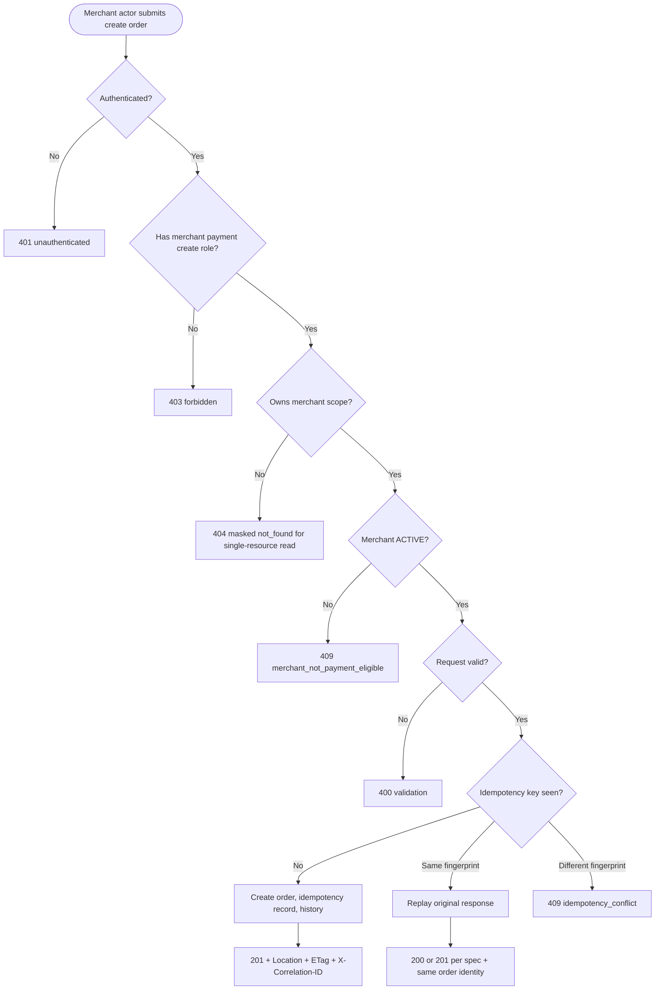
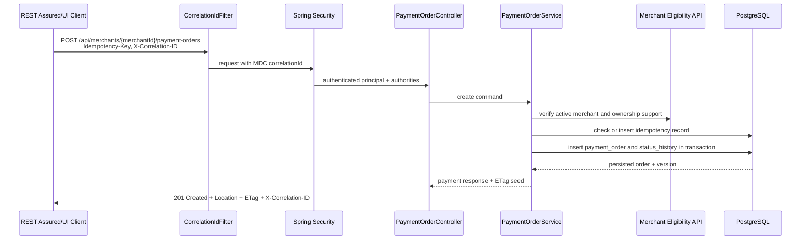
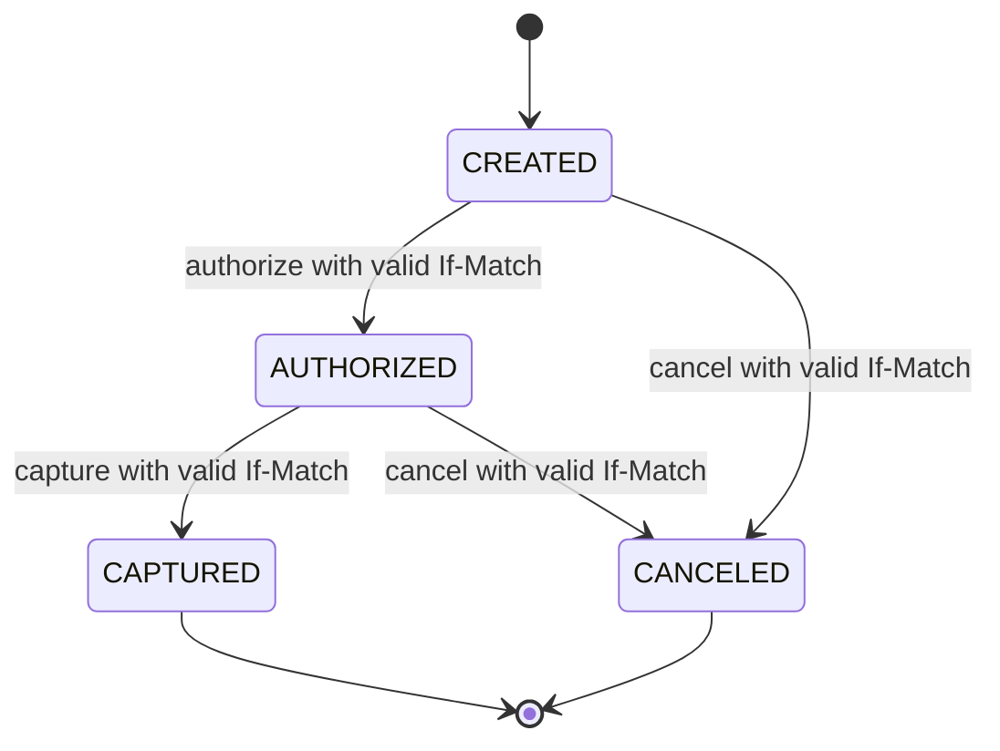

# Spec Kit Input Pack: Lesson 6 Payment Order Access and Lifecycle

**Status**: Discovery and Spec Kit input only, not approved for implementation 
**Prepared for**: Lesson 6 - PayU-like Business Flow: Response Contracts, Correlation IDs, Idempotency, ETag and Security Oracles 
**Current gate**: Active Phase 1 scope is `002-merchant-registry-activation`; payment behavior requires a new approved Spec Kit feature before coding.

## 1. Scope And Guardrail Assessment

Current repository/spec allows:

- Merchant Registry and Activation for platform operators.
- `POST /api/merchants`, `GET /api/merchants`, `GET /api/merchants/{id}`.
- `POST /api/merchants/{id}/activate` and `POST /api/merchants/{id}/suspend`.
- PostgreSQL `merchants` table with unique normalized reference, status check constraint, indexes, and optimistic-locking `version` column.
- Spring Security resource-server protection for platform merchant authorities.
- Correlation ID propagation through `X-Correlation-ID` via `CorrelationIdFilter`.
- Nuxt dashboard `/admin/merchants` and Playwright merchant journeys.

Current repository/spec does not allow:

- Payment order creation.
- `POST /payments` or any payment endpoint added ad hoc.
- PSP mock flows, Kafka, settlement, reconciliation, refunds, complete OAuth/OIDC app expansion, or a complete merchant self-service dashboard.

Guardrail decision:

- Do not implement payment flows inside the active Phase 1 spec.
- Prepare BA Discovery Pack, sequencing recommendation, models, Spec Kit-ready input, and Lesson 6 learning material.
- Implementation requires a new approved Spec Kit feature, suggested here as `003-payment-order-access-lifecycle`.

Default specification decisions to carry into `/speckit.specify`:

- First implementation slice is create/read only for payment orders; lifecycle actions are planned as the next slice unless Spec Kit explicitly expands scope.
- Cross-tenant single-resource read is masked as `404 not_found` to reduce resource enumeration.
- Missing role for an operation returns `403 forbidden`.
- First successful idempotent create returns `201 Created`.
- Same `Idempotency-Key` with the same request fingerprint returns `200 OK` replay with the original payment order identity.
- Same `Idempotency-Key` with a different request fingerprint returns `409 idempotency_conflict`.
- Amount is represented in minor units, must be positive, and is capped at `100_000_000` minor units for the first slice.
- Supported currencies for the first slice are `PLN`, `EUR`, and `USD`.
- Initial merchant-scoped payment roles are `merchant:payments:create`, `merchant:payments:read`, and `merchant:payments:operate`; only create/read are implemented in the first slice.
- Access/ownership is implemented as the smallest useful merchant-scoped test slice, not full Merchant Team Management.

## 1a. Learning Delta Map

Topics intentionally not repeated from Lessons 1-5:

- What REST Assured is.
- `given()`, `when()`, `then()` basics.
- HTTP method/path/header/body as beginner concepts.
- `Map.of`, DTOs, JSON serialization as foundational syntax.
- Basic status/body assertions on Merchant Registry.

New Lesson 6 delta:

| Area | New Concept | Why It Appears Now | Demonstration File Or Planned File |
|---|---|---|---|
| Product | Payment order as merchant-owned resource | First real payment-domain resource after Merchant Registry | Planned `payment.internal.domain.PaymentOrder` |
| Product | Merchant team/access as ownership support | Payment actor must be scoped to a merchant | Planned minimal `access` or merchant public API boundary |
| HTTP/API | `Location` after `201 Created` | Created payment order must have a canonical resource URL | Planned `PaymentOrderController#create` |
| HTTP/API | `X-Correlation-ID` as observability contract | Payment failures must be traceable across API/logs/history | Existing `shared.web.CorrelationIdFilter`, planned payment tests |
| HTTP/API | `Idempotency-Key` | Retry-safe create avoids duplicate payment orders | Planned `idempotency_records` and REST Assured replay tests |
| HTTP/API | `ETag` and `If-Match` | Lifecycle actions need stale-update protection | Planned `PaymentOrderResponse`, action endpoints |
| HTTP/API | `409` vs `412` | Invalid transition differs from stale representation | Planned `PaymentOrderExceptionHandler` |
| Java/Spring | Value objects for `Money`, `CurrencyCode`, `IdempotencyKey` | Avoid primitive obsession around financial data and retry keys | Planned domain records |
| Java/Spring | Transaction boundary in application service | Create order + idempotency record + status history must be atomic | Planned `PaymentOrderService` |
| Java/Spring | Enum state machine | Lifecycle transitions become a primary oracle | Planned `PaymentOrderStatus` tests |
| SQL | FK to merchant | Payment order cannot exist without owning merchant | Planned `payment_orders.merchant_id` FK |
| SQL | Unique idempotency constraint | Database prevents duplicate create under concurrency | Planned unique `(merchant_id, idempotency_key)` |
| SQL | Status history/audit | Business traceability for payment lifecycle | Planned `payment_order_status_history` |
| Security | Role plus ownership matrix | Role alone is insufficient for tenant isolation | Planned `PaymentSecurityTest` |
| Security | `403` vs masked `404` decision | Cross-tenant read behavior must be explicit | Spec clarification item |
| Frontend | Role-aware action visibility | UI consumes permissions but backend remains source of truth | Planned payment detail page/actions |
| Playwright | Authenticated role journeys | UI verifies one representative journey, not the full security matrix | Planned `payment-order-lifecycle.spec.ts` |
| REST Assured | Header contract assertions | Tests assert protocol-level guarantees, not only JSON body | Planned `PaymentOrderRestAssuredTest` |
| AssertJ | Extract and assert complex oracles | Idempotency replay and state timeline need richer assertions | Planned DTO extraction and collection assertions |
| Test data | Worker-safe merchant/payment/idempotency namespacing | Parallel tests must not share payment resources | Planned `PaymentApiTestSupport` |

## 2. BA Discovery Pack

### Flow A - Merchant Team And Access Management

Capability name:

- Merchant Team And Access Management.

Business goal:

- Allow platform and merchant-side actors to manage who can operate within a merchant account before payment operations exist.

Actors:

- Platform operator with `platform:merchants:manage`.
- Merchant admin with `merchant:users:manage` scoped to one merchant.
- Merchant viewer with `merchant:viewer` scoped to one merchant.
- Unauthenticated or authenticated denied user.

Workflow:

1. Platform operator selects an existing active merchant.
2. Operator assigns a user to the merchant with a merchant-scoped role.
3. Merchant admin lists team members for their merchant.
4. Merchant admin changes a member role within allowed bounds.
5. Viewer reads team membership but cannot mutate it.
6. Cross-merchant access is denied by backend even if UI hides controls.

State changes:

- New `merchant_memberships` row.
- Membership role changes.
- Optional audit record for invite/role change.

Business rules:

- A user may belong to multiple merchants only if spec approves multi-membership.
- Platform roles are global; merchant roles are scoped to `merchant_id`.
- Membership uniqueness should be `(merchant_id, user_id)`.
- Merchant-scoped role cannot grant platform authority.

Role/permission rules:

- Platform operator can manage memberships for any merchant.
- Merchant admin can manage only users in their merchant and cannot assign platform roles.
- Viewer can read own merchant membership list only.
- Denied identity receives `403`; cross-tenant read behavior needs `403` vs masked `404` decision.

Data needs:

- `users` or local account projection.
- `merchant_memberships` with `merchant_id`, `user_id`, `role`, timestamps, version.
- Indexes on `(merchant_id, role)` and unique `(merchant_id, user_id)`.

Acceptance criteria:

- Platform operator can add a user to an active merchant.
- Duplicate membership returns `409`.
- Merchant admin cannot manage another merchant's team.
- Viewer cannot mutate membership.
- UI hides mutation controls for viewer, while API still returns `403` for direct mutation attempts.

Ambiguities:

- Source of users: Keycloak users, local `accounts` projection, or test-only seeded accounts.
- Whether a user can belong to multiple merchants.
- Whether cross-tenant reads are `403` or masked `404`.
- Whether invited users require email/invite lifecycle or direct assignment is enough.

Tester risks:

- Role confusion between platform and merchant-scoped authorities.
- UI-only security illusion.
- Duplicate membership under concurrency.
- Cross-tenant data leakage in lists.

Sequencing recommendation:

- Useful as a minimal dependency slice, but not the main Lesson 6 implementation target unless Payment Order is still blocked for a later phase.

### Flow B - Payment Order Initiation And Lifecycle

Capability name:

- Payment Order Initiation And Lifecycle.

Business goal:

- Let an authorized merchant actor create and operate a small payment order lifecycle without PSP/cards, using real payment API risks: idempotency, ownership, status transitions, concurrency, auditability, and response contracts.

Actors:

- Merchant payment creator with `merchant:payments:create` for one merchant.
- Merchant payment reader with `merchant:payments:read` for one merchant.
- Merchant payment operator with `merchant:payments:operate` for one merchant.
- Platform payment reader/operator if explicitly approved.
- Unauthenticated, invalid-token, no-role, wrong-merchant users.

Workflow:

1. Merchant payment creator sends `POST /api/merchants/{merchantId}/payment-orders` with amount, currency, client order reference, `Idempotency-Key`, and `X-Correlation-ID`.
2. Backend verifies authentication, authority, merchant ownership, and merchant eligibility (`ACTIVE`).
3. Backend validates money, currency, idempotency key, and request shape.
4. Backend persists payment order with initial status `CREATED`, idempotency record, and first status history entry in one transaction.
5. API returns `201 Created`, `Location`, `ETag`, `X-Correlation-ID`, and stable response body.
6. Same request with same idempotency key replays the same order response without creating a duplicate.
7. Same idempotency key with different body returns `409 idempotency_conflict`.
8. Reader retrieves payment order by merchant scope.
9. Operator authorizes, captures, or cancels using `If-Match` to protect against stale actions.

State changes:

- `payment_orders`: `CREATED -> AUTHORIZED -> CAPTURED` or `CREATED/AUTHORIZED -> CANCELED`.
- `payment_order_status_history`: append-only status events.
- `idempotency_records`: request fingerprint and resulting resource.
- Version increment on lifecycle actions.

Business rules:

- Payment order can be created only under an active merchant.
- Amount is stored as minor units; no `double` for money.
- Currency uses ISO-like 3-letter code from the supported set for the slice, for example `PLN`, `EUR`, `USD`.
- Idempotency key is required for create and unique per merchant and operation.
- Replay with same key and same fingerprint returns the original result.
- Replay with same key and different fingerprint returns `409`.
- Lifecycle transitions are constrained by a state machine.
- Stale `If-Match` returns `412`, not `409`.

Role/permission rules:

- Missing/invalid token returns `401`.
- Valid token without role returns `403`.
- Valid role for wrong merchant returns either `403` or masked `404`; spec must decide.
- Create, read, and operate permissions are separate.
- UI hides forbidden buttons, backend still enforces all permissions.

Data needs:

- `payment_orders` with `payment_order_id`, `merchant_id`, `client_order_reference`, `amount_minor`, `currency`, `status`, `version`, timestamps.
- `idempotency_records` with `merchant_id`, `idempotency_key`, `operation`, request fingerprint, response reference.
- `payment_order_status_history` with from/to status, actor subject, correlation ID, timestamp.
- Indexes on `(merchant_id, created_at DESC)`, `(merchant_id, status)`, `(payment_order_id, occurred_at)`.

Acceptance criteria:

- Active merchant payment creator can create order and receives `201`, `Location`, `ETag`, `X-Correlation-ID`.
- Duplicate retry with same idempotency key and same body returns same order identity and no duplicate row.
- Same idempotency key with different body returns `409 idempotency_conflict`.
- Invalid amount/currency returns `400 validation`.
- Suspended/draft merchant create returns `409 merchant_not_payment_eligible` or a spec-approved equivalent.
- Unauthorized or wrong-merchant actor cannot create/read/operate.
- Lifecycle actions follow state table and stale `If-Match` returns `412`.
- Status history records successful lifecycle transitions with correlation ID.

Clarifications now resolved for the first implementation slice:

- Cross-tenant single-resource read returns masked `404`; direct forbidden operation without role returns `403`.
- Same idempotency key and same request fingerprint returns `200 OK` replay.
- Same idempotency key and different fingerprint returns `409 idempotency_conflict`.
- First slice implements payment order create/read only; authorize/capture/cancel are deferred.
- Currency set is `PLN`, `EUR`, `USD`; amount range is `1..100_000_000` minor units.
- Ownership is represented through a minimal merchant-scoped access model sufficient for tests, not a full team-management product.

Remaining ambiguities:

- Whether platform operator can read payment orders for support in the first slice or whether only merchant-scoped payment readers can read them.
- Whether `merchant:payments:operate` should be introduced in Keycloak/test JWT now as a planned role but unused until lifecycle slice, or deferred entirely until lifecycle implementation.

Tester risks:

- Duplicate charge/order due to weak idempotency.
- Money precision defects from primitive or decimal misuse.
- Role-only authorization that ignores merchant ownership.
- Invalid transition mutates state before returning error.
- Stale ETag updates accepted incorrectly.
- Error responses leak another merchant's resource existence.
- Status history not written atomically with state change.

Sequencing recommendation:

- Best main Lesson 6 business-flow sprint after Phase 1 is complete and a new Spec Kit feature is approved. Add only a minimal access/ownership dependency slice if the current identity model is insufficient.

## 3. Flow Selection

Selected sprint shape:

- Main flow: Flow B - Payment Order Initiation And Lifecycle.
- Supporting dependency slice: minimal merchant-scoped access model sufficient to test ownership and roles.

Justification:

- Payment Order gives the strongest learning value for Lesson 6 because response assertions become executable business oracles for `Location`, `X-Correlation-ID`, `Idempotency-Key`, `ETag`, `If-Match`, status codes, SQL constraints, and security matrix.
- Full Merchant Team management is valuable but can distract from the payment-flow objective. Lesson 6 needs enough access modeling to make ownership real, not a complete user-admin product.
- Implementation risk remains controlled if non-goals are strict: no PSP, no cards, no Kafka, no settlement, no refunds, no webhook.
- First implementation risk is controlled further by implementing create/read only. Lifecycle actions with `ETag`/`If-Match` remain planned but are not part of the first code slice unless explicitly approved.

## 4. Models

### BPMN - Main Payment Order Flow

### UML Sequence - Create Payment Order

### State Diagram - Payment Lifecycle

### Decision Table - Payment Action Authorization And State

| Actor State | Role | Ownership | Payment State | If-Match | Expected Outcome |
|---|---|---|---|---|---|
| Missing/invalid token | Any | Any | Any | Any | `401` |
| Authenticated | Missing required role | Any | Any | Any | `403` |
| Authenticated | Required role | Wrong merchant | Any | Any | `403` or masked `404` per spec |
| Authenticated | `merchant:payments:create` | Own merchant | Merchant not `ACTIVE` | N/A | `409 merchant_not_payment_eligible` |
| Authenticated | `merchant:payments:create` | Own merchant | N/A | N/A | `201 Created` for valid create |
| Authenticated | `merchant:payments:operate` | Own merchant | `CREATED` authorize | Current | `200 AUTHORIZED` |
| Authenticated | `merchant:payments:operate` | Own merchant | `CREATED` capture | Current | `409 invalid_transition` |
| Authenticated | `merchant:payments:operate` | Own merchant | `AUTHORIZED` capture | Current | `200 CAPTURED` |
| Authenticated | `merchant:payments:operate` | Own merchant | Valid transition | Stale | `412 precondition_failed` |

First-slice decision: rows involving `merchant:payments:operate`, lifecycle actions, `ETag`, `If-Match`, and `412` are planned learning targets for the next slice, not required in the first create/read implementation.

## 5. Spec Kit-Ready Summary

Feature title:

- Payment Order Access, Idempotent Creation, And Minimal Lifecycle.

User stories:

1. As a merchant payment creator, I want to create a payment order for my active merchant so the system records an intended payment exactly once across retries.
2. As a merchant payment reader, I want to retrieve my merchant's payment order so I can see its current status and protocol metadata.
3. As a merchant payment operator, I want to authorize, capture, or cancel a payment order using the current ETag so stale actions are rejected.
4. As a security reviewer, I want 401/403/ownership behavior to be explicit so cross-tenant access is testable and does not leak data.
5. As a tester, I want SQL constraints and status history so API behavior has durable integrity and audit evidence.

Functional requirements:

- FR-001: System MUST allow an authenticated caller with `merchant:payments:create` for an active merchant to create a payment order.
- FR-002: System MUST reject payment creation for non-active merchants.
- FR-003: System MUST require `Idempotency-Key` for create.
- FR-004: System MUST replay the original order identity for same key and same request fingerprint.
- FR-005: System MUST return `409 idempotency_conflict` for same key with different request fingerprint.
- FR-006: System MUST return `201 Created` with `Location`, `ETag`, and `X-Correlation-ID` for first successful creation.
- FR-007: System MUST store amount as minor units and currency as a constrained code.
- FR-008: System MUST protect all payment endpoints with authentication, role authorization, and merchant ownership.
- FR-009: System MUST return stable machine-readable error codes.
- FR-010: System MUST return `200 OK` replay with the original payment order identity for same key and same request fingerprint.
- FR-011: System MUST represent amount in minor units with valid range `1..100_000_000`.
- FR-012: System MUST allow only `PLN`, `EUR`, and `USD` in the first slice.
- FR-013: System MUST return masked `404 not_found` for cross-tenant single-resource reads.
- FR-014: System MUST return `403 forbidden` for authenticated callers missing the required payment role.
- FR-015: System MUST append at least the initial creation status history record with correlation ID.
- FR-016: System MUST preserve Spring Modulith boundaries; `payment` may depend only on merchant public API, never `merchant.internal`.
- FR-017: System SHOULD expose `ETag` on create/read responses as a planned compatibility point for the lifecycle slice, but lifecycle `If-Match` behavior is not required in the first create/read implementation.

Deferred functional requirements for the next lifecycle slice:

- DFR-001: System MUST support `CREATED -> AUTHORIZED -> CAPTURED` and cancellation from `CREATED` or `AUTHORIZED`.
- DFR-002: System MUST reject invalid transitions with `409 invalid_transition` without mutating status.
- DFR-003: System MUST require `If-Match` for lifecycle actions.
- DFR-004: System MUST reject stale `If-Match` with `412 precondition_failed`.
- DFR-005: System MUST append status history for successful lifecycle transitions.

Non-goals:

- No real cards, PAN, CVV, PCI, 3DS, PSP, bank/acquirer integration, PSP mock flow, refund, settlement, reconciliation, Kafka, webhook, GraphQL, gRPC, complete merchant self-service, complete admin platform, or Client Credentials Flow.

Data model:

- `payment_orders(payment_order_id, merchant_id, client_order_reference, amount_minor, currency, status, version, created_at, updated_at)`.
- `idempotency_records(idempotency_record_id, merchant_id, operation, idempotency_key, request_fingerprint, payment_order_id, created_at)`.
- `payment_order_status_history(history_id, payment_order_id, from_status, to_status, actor_subject, correlation_id, occurred_at)`.
- Constraints: FK to `merchants`, amount positive, currency in supported set, status in supported set, unique `(merchant_id, operation, idempotency_key)`, unique optional `(merchant_id, client_order_reference)` if product approves.
- Indexes: `(merchant_id, created_at DESC)`, `(merchant_id, status)`, `(payment_order_id, occurred_at)`.

API contract:

| Method | Path | Purpose | Success | Key Errors |
|---|---|---|---|---|
| `POST` | `/api/merchants/{merchantId}/payment-orders` | Create order | `201` + `Location` + `ETag` | `400`, `401`, `403`, `404`, `409` |
| `GET` | `/api/merchants/{merchantId}/payment-orders/{paymentOrderId}` | Read order | `200` + `ETag` | `401`, `403/404`, `404` |

Deferred lifecycle API contract:

| Method | Path | Purpose | Success | Key Errors |
|---|---|---|---|---|
| `POST` | `/api/merchants/{merchantId}/payment-orders/{paymentOrderId}/authorize` | Authorize | `200` + new `ETag` | `401`, masked `404`, `409`, `412` |
| `POST` | `/api/merchants/{merchantId}/payment-orders/{paymentOrderId}/capture` | Capture | `200` + new `ETag` | `401`, masked `404`, `409`, `412` |
| `POST` | `/api/merchants/{merchantId}/payment-orders/{paymentOrderId}/cancel` | Cancel | `200` + new `ETag` | `401`, masked `404`, `409`, `412` |

Security matrix:

| Caller | Create | Read Own | Operate Own | Cross-Merchant Read/Operate |
|---|---:|---:|---:|---:|
| Missing/invalid token | `401` | `401` | `401` | `401` |
| Authenticated no payment role | `403` | `403` | `403` | `403` |
| Merchant viewer/read role | `403` | `200` | `403` | masked `404` for single-resource read |
| Merchant payment creator | `201` | `403` unless also read | `403` | masked `404` for single-resource read |
| Merchant payment operator | Deferred | Deferred | Deferred | Deferred |
| Platform payment reader | `403` unless explicitly granted | `200` | `403` | `200` read if approved |

Acceptance criteria:

- Create success proves status/body/header contract.
- Idempotency replay proves duplicate-order prevention.
- Idempotency conflict proves stable `409` error code.
- Invalid amount/currency proves validation and SQL safety net.
- Wrong role and wrong merchant prove security contract.
- Cross-tenant single-resource read proves masked `404` behavior.
- Initial status history proves creation auditability with correlation ID.
- UI journey proves one end-to-end role-aware create/read path, not the full matrix.

Deferred lifecycle acceptance criteria:

- Invalid transition proves state machine oracle.
- Stale ETag proves optimistic concurrency contract.

Test strategy:

- Domain tests: money, currency, idempotency key, state transitions.
- Application tests: transaction boundary, eligibility, idempotency replay/conflict.
- Repository tests: FK, check constraints, unique idempotency, indexes where useful.
- REST Assured tests: `201`, `Location`, `X-Correlation-ID`, `ETag`, error codes, replay, stale `If-Match`.
- Security tests: token state x role x ownership x endpoint matrix.
- Spring Modulith tests: `payment` boundary and no access to `merchant.internal`.
- Playwright tests: one authenticated payment creation/detail/action journey and forbidden action visibility.
- Exploratory charters: duplicate retry, cross-tenant leakage, stale ETag, misleading UI, audit/correlation gaps.

Definition of Done:

- New Spec Kit feature is approved before code starts.
- Backend `./mvnw test` passes from `apps/backend`.
- Backend `./mvnw verify` passes if integration tests are included.
- Spring Modulith architecture verification passes.
- Frontend `corepack pnpm typecheck` and `corepack pnpm build` pass from `apps/frontend` if UI is included.
- Playwright `corepack pnpm exec playwright test` passes if UI flow is included.
- No payment scope is implemented in Phase 1 branch without approved spec.

## 6. Implementation Plan After Approval

Backend files/modules:

- Create `lab.paymentquality.payment` module with `package-info.java`.
- Add `payment.internal.domain`: `PaymentOrder`, `PaymentOrderStatus`, `Money`, `CurrencyCode`, `PaymentOrderReference`, `IdempotencyKey`.
- Add `payment.internal.application.PaymentOrderService` with transaction boundary.
- Add `payment.internal.infrastructure.JpaPaymentOrderRepository`, `JpaIdempotencyRecordRepository`, `JpaPaymentOrderStatusHistoryRepository`.
- Add `payment.internal.web.PaymentOrderController`, request/response/error records, mapper, exception handler.
- Add merchant public API only if needed for active-merchant eligibility; do not depend on `merchant.internal`.

First implementation slice must create/read payment orders only. Do not implement authorize/capture/cancel until the lifecycle slice is approved.

Flyway migrations:

- `db/migration/payment/V1__create_payment_orders.sql`.
- `db/migration/payment/V2__create_payment_idempotency_and_history.sql` or one combined migration if the slice is small.

REST endpoints:

- Minimal first slice: create and read payment order.
- Deferred lifecycle slice: authorize, capture, cancel with `If-Match`.

Security changes:

- Add payment authorities to test JWT support and Keycloak realm import.
- Add endpoint authorization and ownership check.
- Implement masked `404` for cross-tenant single-resource reads.
- Implement `403` for authenticated callers missing required payment roles.
- Add `merchant:payments:create` and `merchant:payments:read` for the first slice.
- Add `merchant:payments:operate` only as a planned role if it does not expand endpoint implementation scope; otherwise defer it to lifecycle slice.

Frontend files:

- `app/pages/admin/merchants/[merchantId]/payment-orders.vue` or merchant detail route.
- `app/pages/admin/merchants/[merchantId]/payment-orders/[paymentOrderId].vue`.
- `app/components/payment/PaymentOrderForm.vue`, `PaymentOrderStatusBadge.vue`, `PaymentOrderActions.vue`.
- `app/schemas/payment-order.schema.ts`.
- Server API proxy routes under `server/api/merchants/[merchantId]/payment-orders/`.

Backend tests:

- `PaymentOrderStatusTest`, `MoneyTest`, `IdempotencyKeyTest`.
- `PaymentOrderServiceTest`.
- `JpaPaymentOrderRepositoryTest`.
- `PaymentOrderRestAssuredTest`.
- `PaymentSecurityTest`.
- `PaymentModuleTest` and existing `ModulithArchitectureTest` update.

Frontend/E2E tests:

- `payment-order-create.spec.ts`.
- `payment-order-lifecycle.spec.ts`.
- `payment-order-forbidden-actions.spec.ts`.

Verification commands:

- Backend: `cd apps/backend && ./mvnw test`.
- Backend integration/verification: `cd apps/backend && ./mvnw verify`.
- Frontend typecheck: `cd apps/frontend && corepack pnpm typecheck`.
- Frontend build: `cd apps/frontend && corepack pnpm build`.
- Playwright: `cd apps/frontend && corepack pnpm exec playwright test`.

## 7. Required Next Approval Step

Run the normal Spec Kit flow for a new feature using this file as input. Implementation should start only after the new feature spec, plan, tasks, guardrails, and acceptance criteria are approved.
